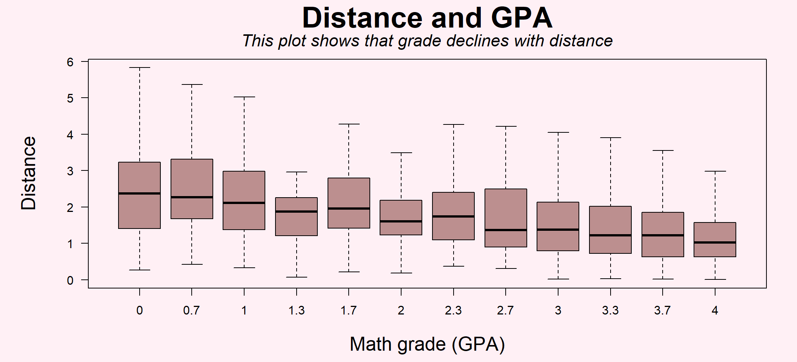
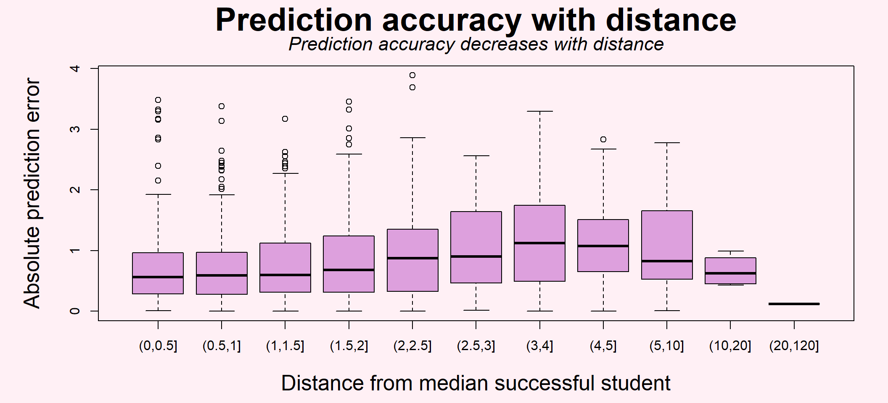
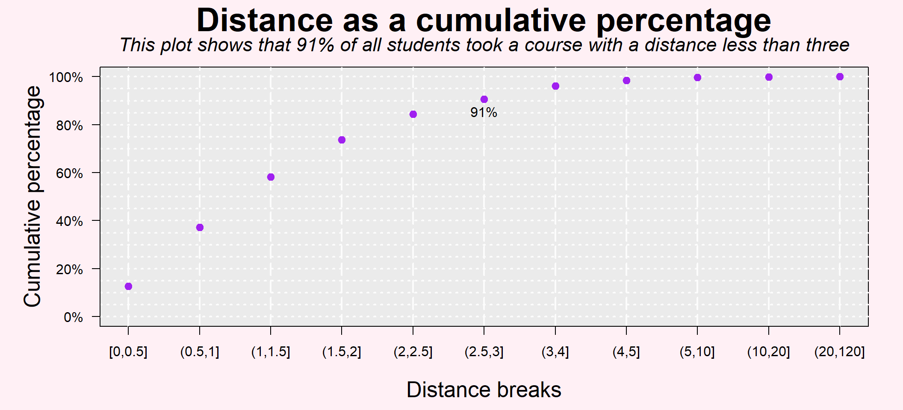
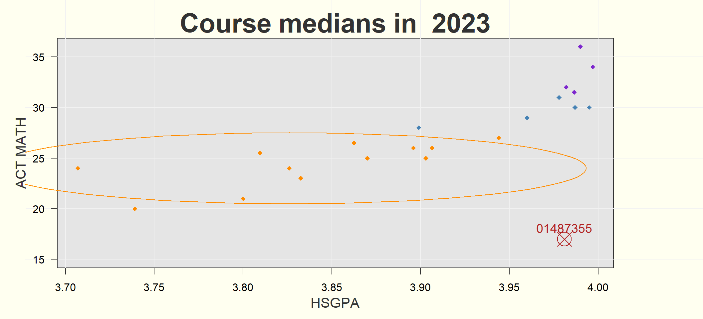
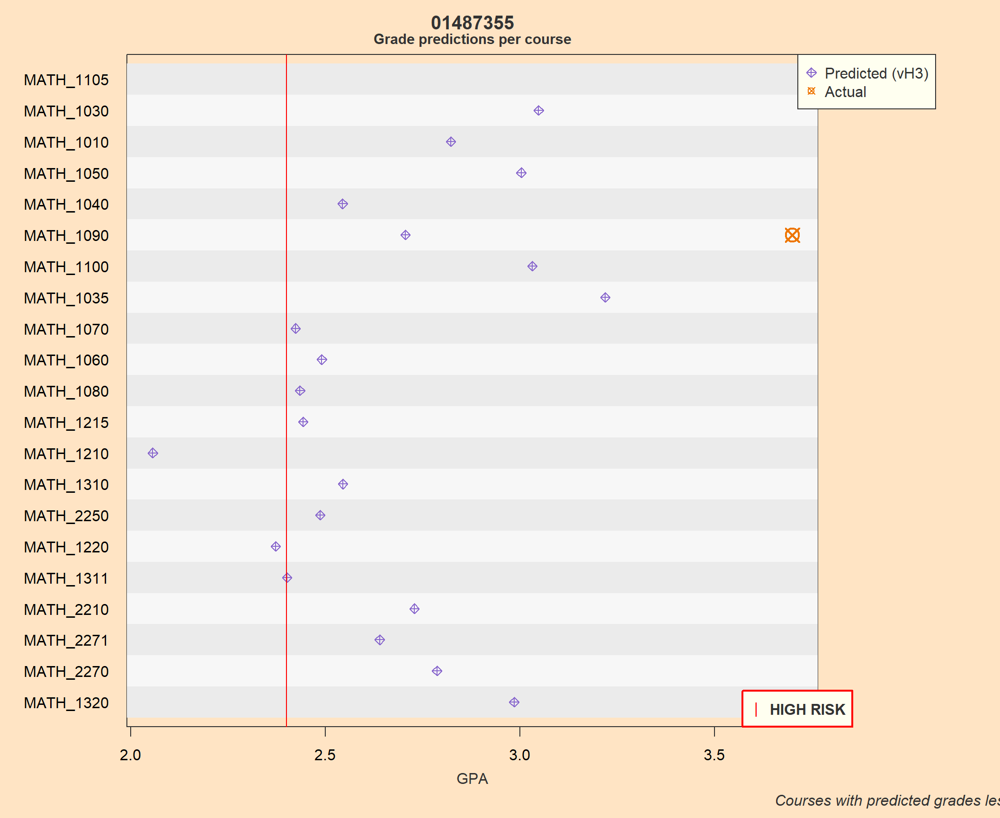

## 

**PURPOSE:** This report describes using counterfactuals and distance in recommending a course.

# What are counterfactuals?

Counterfactuals are a "what if" question. In this case, it is an attempt to answer: *What if a different course was taken?* It uses the model that was trained on the actual courses taken, swaps out the course for the other options, and produces an expected grade.

Counterfactuals have a few problems. Chief among them is that there is no way to evaluate their accuracy: there is no way to know what would have actually happened if a student took a different course. It is taking a model grounded in reality and applying it to an imaginary landscape, an alternate reality where we can ask what if people did things differently?

One way to improve the reasonableness of a counterfactual estimate is to stay within the bounds of the training data. That is to say, the model would produce a poor estimate of a grade for a course that had completely dissimilar students. For example, take Math 2250, where the minimum incoming qualifications for students were an ACT math test score of 23 and a high school GPA of 3.11. The model's predicted grade for that course for a student with qualifications far away from that (say, an ACT math test score of 17 with a high school GPA of 3.0) might not be reasonable.

Then, in order to get the best counterfactual estimates, the predictions should be bounded to be close to what happened in reality.

In this case, it is recommended to limit interpresting counterfactuals to courses that are less than three distance units away. This limit is explored below. (A more thorough approach would be to use the "MatchIt" package to better match the fictitious, counterfactual estimates with similar actual students.)

# Both accuracy and GPA decline with distance

Two variables are the most relevant towards predicting the grade for initial math courses for first time freshmen: high school GPA and ACT math test scores.

Another variable can be derived from these two, called "distance". It is the distance to the median qualifications of the successful student from the prior year. (Please see the section "Distance calculation explained" below for more detail.)

In the first place, the GPA gently declines as the distance increases, as shown in the boxplot titled "Distance and GPA." This suggests that a student should prefer courses that are closer.

In the second place, prediction accuracy also gently declines (or the prediction error mildly increases) with distance (as shown in the boxplot titled "Prediction accuracy with distance.") Actually, if you look at the graph closely, you'll see that the prediction error increases up until a distance of about four, and then starts declining again. This increase in accuracy is due to the fact above: the model easily predicts low grades for distant courses. Accuracy, but not desirability, is improved for the very distant courses.

Students have historically been capable of sorting themselves (or were guided) into close courses: 91% of the students took a course within three of these distance units.

Therefore, in order to improve desirability of a course and preserve a reasonable interpretation of a counterfactual, the author recommends limiting counterfactuals to courses that are less than three units away.

***Distance calculation explained***

I need to add an explanation here


::: {.cell}

:::


::: {.cell}

:::


::: {.cell}

:::


::: {.cell}

:::


::: {.cell}

:::


::: {.cell}

:::


::: {.cell}

:::


::: {.cell}

:::


::: {.cell}

:::


::: {.cell}
::: {.cell-output-display}
{width=1056}
:::
:::


::: {.cell}
::: {.cell-output-display}
{width=1056}
:::
:::


::: {.cell}
::: {.cell-output-display}
{width=1056}
:::
:::


::: {.cell}

:::


# Walking through an example

An example is given for a first-time freshman who took Math 1090 in the Fall of 2024. This student had a high GPA coming from high school, but relatively low test scores. These qualifications are plotted and compared to the median qualifications of the successful student from the prior year in a couple of scatterplots titled "Course medians in 2023", where the second one is interactive. Both plots show the interquartile range plotted as an ellipse around Math 1090, the class he actually ended up taking, that roughly show the qualifications of about half of the successful students.

Our student is outside of that range, and it's not terribly clear which course is closest to him. Several courses seem reasonable.

A look at the counterfactuals shows a wide range of estimated grades as well. The counterfactuals are sorted from the closest to the farthest, with the three-unit cutoff shown as a horizontal red line. His actual performance is shown as a circled red 'x'.

As it is, he performed better than expected with a grade of 3.7 against a prediction of 2.7. However, one wonders if he could have done even better in Math 1035, where he was predicted to achieve 3.2. In any case, it looks like he could have done as well in any of Math 1030, 1010, 1050, 1100, or 1035 as he did in 1090. 1040, where his predicted grade was lower, might be a questionable recommendation. Math 1070, 1060, 1080, and 1215 can hardly be recommended and Math 1210 can't be recommended at all as it is both far away from him and his predicted grade is so low it puts him at risk of failing.


::: {.cell}
::: {.cell-output-display}
{width=1056}
:::
:::


::: {.cell}
::: {.cell-output-display}
{width=1056}
:::
:::


::: {.cell}
::: {.cell-output-display}

```{=html}
<div class="plotly html-widget html-fill-item" id="htmlwidget-06cfbd2b20da026677e8" style="width:100%;height:295px;"></div>
<script type="application/json" data-for="htmlwidget-06cfbd2b20da026677e8">{"x":{"visdat":{"64746fff1bce":["function () ","plotlyVisDat"],"647437b07289":["function () ","data"],"647411301791":["function () ","data"],"64742d9c3f65":["function () ","data"]},"cur_data":"64742d9c3f65","attrs":{"647437b07289":{"alpha_stroke":1,"sizes":[10,100],"spans":[1,20],"x":{},"y":{},"type":"scatter","mode":"markers","marker":{"color":"darkorange","symbol":["diamond","diamond","diamond","diamond","diamond","diamond","diamond","diamond","diamond","diamond","diamond","diamond"],"size":10,"line":{"width":1,"color":"white"}},"name":"1","text":{},"hoverinfo":"text","legendgroup":"1","inherit":true},"647411301791":{"alpha_stroke":1,"sizes":[10,100],"spans":[1,20],"x":{},"y":{},"type":"scatter","mode":"markers","marker":{"color":"steelblue","symbol":["diamond","diamond","diamond","diamond","diamond"],"size":10,"line":{"width":1,"color":"white"}},"name":"2","text":{},"hoverinfo":"text","legendgroup":"2","inherit":true},"64742d9c3f65":{"alpha_stroke":1,"sizes":[10,100],"spans":[1,20],"x":{},"y":{},"type":"scatter","mode":"markers","marker":{"color":"purple3","symbol":["diamond","diamond","diamond","diamond"],"size":10,"line":{"width":1,"color":"white"}},"name":"3","text":{},"hoverinfo":"text","legendgroup":"3","inherit":true},"64742d9c3f65.1":{"alpha_stroke":1,"sizes":[10,100],"spans":[1,20],"x":[3.9932499999999997,3.9918768798119375,3.9877800658432774,3.9810268276661218,3.9717280532646364,3.9600364282574154,3.9461439288038447,3.9302786693608729,3.912701157049935,3.8937000141372198,3.8735872388640398,3.8526930824443322,3.8313606263488591,3.8099401489169398,3.7887833737958059,3.768237694648036,3.7486404709572199,3.7303134885945668,3.7135576761037945,3.6986481634627619,3.6858297644568392,3.67531295684332,3.6672704263124656,3.6618342309932439,3.6590936330625059,3.6590936330625059,3.6618342309932439,3.6672704263124656,3.67531295684332,3.6858297644568392,3.6986481634627619,3.7135576761037945,3.7303134885945668,3.7486404709572199,3.768237694648036,3.7887833737958059,3.8099401489169398,3.8313606263488591,3.8526930824443322,3.8735872388640398,3.8937000141372198,3.9127011570499346,3.9302786693608729,3.9461439288038442,3.9600364282574154,3.9717280532646364,3.9810268276661218,3.9877800658432774,3.9918768798119375,3.9932499999999997],"y":[24,24.447570065895771,24.887791043683276,25.313434517077809,25.717511432013783,26.093386856719256,26.434888927112201,26.736410188638104,26.99299967051871,27.200444180555344,27.355337485628311,27.455136241950576,27.498201756702407,27.483826895322196,27.412247692636384,27.28463947717416,27.103097572305501,26.870602891089348,26.590972989763607,26.26879938357726,25.909372154236923,25.518593086911455,25.102878763082671,24.669055200454803,24.224245769932498,23.775754230067506,23.330944799545197,22.897121236917329,22.481406913088549,22.09062784576308,21.73120061642274,21.409027010236397,21.129397108910656,20.896902427694499,20.71536052282584,20.587752307363616,20.516173104677808,20.501798243297593,20.544863758049424,20.644662514371689,20.799555819444656,21.007000329481286,21.263589811361896,21.565111072887795,21.906613143280744,22.282488567986213,22.686565482922187,23.112208956316721,23.552429934104225,24],"type":"scatter","mode":"lines","line":{"color":"darkorange","width":1.5},"showlegend":false,"hoverinfo":"skip","inherit":true},"64742d9c3f65.2":{"x":3.9809999999999999,"y":17,"z":null,"type":"scatter","mode":"markers","marker":{"symbol":"x-thin","size":20,"line":{"color":"firebrick","width":3}},"name":"Student","inherit":false}},"layout":{"margin":{"b":40,"l":60,"t":25,"r":10},"title":{"text":"Course medians in 2023","font":{"size":18}},"xaxis":{"domain":[0,1],"automargin":true,"title":"HSGPA","gridcolor":"white","zerolinecolor":"white"},"yaxis":{"domain":[0,1],"automargin":true,"title":"ACT MATH","gridcolor":"white","zerolinecolor":"white","range":[15,38]},"plot_bgcolor":"grey90","paper_bgcolor":"ivory","legend":{"x":1.02,"y":1,"bgcolor":"snow","bordercolor":"gray","borderwidth":1},"hovermode":"closest","scene":{"zaxis":{"title":[]}},"showlegend":true},"source":"A","config":{"modeBarButtonsToAdd":["hoverclosest","hovercompare"],"showSendToCloud":false},"data":[{"x":[3.7389999999999999,3.7999999999999998,3.7069999999999999,3.8624999999999998,3.8325,3.903,3.8959999999999999,3.8700000000000001,3.8259999999999996,3.8094999999999999,3.944,3.9064999999999999],"y":[20,21,24,26.5,23,25,26,25,24,25.5,27,26],"type":"scatter","mode":"markers","marker":{"color":"darkorange","symbol":["diamond","diamond","diamond","diamond","diamond","diamond","diamond","diamond","diamond","diamond","diamond","diamond"],"size":10,"line":{"color":"white","width":1}},"name":"1","text":["Course: MATH_1010<br>Year: 2023<br>HSGPA: 3.74 (IQR: 0.3)<br>ACT Math: 20 (IQR: 5)","Course: MATH_1030<br>Year: 2023<br>HSGPA: 3.8 (IQR: 0.32)<br>ACT Math: 21 (IQR: 6)","Course: MATH_1035<br>Year: 2023<br>HSGPA: 3.71 (IQR: 0.36)<br>ACT Math: 24 (IQR: 6.2)","Course: MATH_1040<br>Year: 2023<br>HSGPA: 3.86 (IQR: 0.23)<br>ACT Math: 26.5 (IQR: 4.8)","Course: MATH_1050<br>Year: 2023<br>HSGPA: 3.83 (IQR: 0.3)<br>ACT Math: 23 (IQR: 5)","Course: MATH_1060<br>Year: 2023<br>HSGPA: 3.9 (IQR: 0.31)<br>ACT Math: 25 (IQR: 3)","Course: MATH_1070<br>Year: 2023<br>HSGPA: 3.9 (IQR: 0.24)<br>ACT Math: 26 (IQR: 5)","Course: MATH_1080<br>Year: 2023<br>HSGPA: 3.87 (IQR: 0.36)<br>ACT Math: 25 (IQR: 3.5)","Course: MATH_1090<br>Year: 2023<br>HSGPA: 3.83 (IQR: 0.33)<br>ACT Math: 24 (IQR: 7)","Course: MATH_1100<br>Year: 2023<br>HSGPA: 3.81 (IQR: 0.34)<br>ACT Math: 25.5 (IQR: 5.8)","Course: MATH_1210<br>Year: 2023<br>HSGPA: 3.94 (IQR: 0.23)<br>ACT Math: 27 (IQR: 5)","Course: MATH_1215<br>Year: 2023<br>HSGPA: 3.91 (IQR: 0.29)<br>ACT Math: 26 (IQR: 3.5)"],"hoverinfo":["text","text","text","text","text","text","text","text","text","text","text","text"],"legendgroup":"1","error_y":{"color":"rgba(31,119,180,1)"},"error_x":{"color":"rgba(31,119,180,1)"},"line":{"color":"rgba(31,119,180,1)"},"xaxis":"x","yaxis":"y","frame":null},{"x":[3.96,3.899,3.9870000000000001,3.9950000000000001,3.9780000000000002],"y":[29,28,30,30,31],"type":"scatter","mode":"markers","marker":{"color":"steelblue","symbol":["diamond","diamond","diamond","diamond","diamond"],"size":10,"line":{"color":"white","width":1}},"name":"2","text":["Course: MATH_1220<br>Year: 2023<br>HSGPA: 3.96 (IQR: 0.16)<br>ACT Math: 29 (IQR: 4)","Course: MATH_1310<br>Year: 2023<br>HSGPA: 3.9 (IQR: 0.27)<br>ACT Math: 28 (IQR: 4)","Course: MATH_1311<br>Year: 2023<br>HSGPA: 3.99 (IQR: 0.04)<br>ACT Math: 30 (IQR: 4.5)","Course: MATH_2270<br>Year: 2023<br>HSGPA: 4 (IQR: 0.02)<br>ACT Math: 30 (IQR: 5)","Course: MATH_2200<br>Year: 2023<br>HSGPA: 3.98 (IQR: 0)<br>ACT Math: 31 (IQR: 0)"],"hoverinfo":["text","text","text","text","text"],"legendgroup":"2","error_y":{"color":"rgba(255,127,14,1)"},"error_x":{"color":"rgba(255,127,14,1)"},"line":{"color":"rgba(255,127,14,1)"},"xaxis":"x","yaxis":"y","frame":null},{"x":[3.9820000000000002,3.9969999999999999,3.9865000000000004,3.9900000000000002],"y":[32,34,31.5,36],"type":"scatter","mode":"markers","marker":{"color":"purple3","symbol":["diamond","diamond","diamond","diamond"],"size":10,"line":{"color":"white","width":1}},"name":"3","text":["Course: MATH_2210<br>Year: 2023<br>HSGPA: 3.98 (IQR: 0.07)<br>ACT Math: 32 (IQR: 4)","Course: MATH_2250<br>Year: 2023<br>HSGPA: 4 (IQR: 0.03)<br>ACT Math: 34 (IQR: 5)","Course: MATH_1320<br>Year: 2023<br>HSGPA: 3.99 (IQR: 0.06)<br>ACT Math: 31.5 (IQR: 2.8)","Course: MATH_2271<br>Year: 2023<br>HSGPA: 3.99 (IQR: 0.02)<br>ACT Math: 36 (IQR: 2)"],"hoverinfo":["text","text","text","text"],"legendgroup":"3","error_y":{"color":"rgba(44,160,44,1)"},"error_x":{"color":"rgba(44,160,44,1)"},"line":{"color":"rgba(44,160,44,1)"},"xaxis":"x","yaxis":"y","frame":null},{"x":[3.9932499999999997,3.9918768798119375,3.9877800658432774,3.9810268276661218,3.9717280532646364,3.9600364282574154,3.9461439288038447,3.9302786693608729,3.912701157049935,3.8937000141372198,3.8735872388640398,3.8526930824443322,3.8313606263488591,3.8099401489169398,3.7887833737958059,3.768237694648036,3.7486404709572199,3.7303134885945668,3.7135576761037945,3.6986481634627619,3.6858297644568392,3.67531295684332,3.6672704263124656,3.6618342309932439,3.6590936330625059,3.6590936330625059,3.6618342309932439,3.6672704263124656,3.67531295684332,3.6858297644568392,3.6986481634627619,3.7135576761037945,3.7303134885945668,3.7486404709572199,3.768237694648036,3.7887833737958059,3.8099401489169398,3.8313606263488591,3.8526930824443322,3.8735872388640398,3.8937000141372198,3.9127011570499346,3.9302786693608729,3.9461439288038442,3.9600364282574154,3.9717280532646364,3.9810268276661218,3.9877800658432774,3.9918768798119375,3.9932499999999997],"y":[24,24.447570065895771,24.887791043683276,25.313434517077809,25.717511432013783,26.093386856719256,26.434888927112201,26.736410188638104,26.99299967051871,27.200444180555344,27.355337485628311,27.455136241950576,27.498201756702407,27.483826895322196,27.412247692636384,27.28463947717416,27.103097572305501,26.870602891089348,26.590972989763607,26.26879938357726,25.909372154236923,25.518593086911455,25.102878763082671,24.669055200454803,24.224245769932498,23.775754230067506,23.330944799545197,22.897121236917329,22.481406913088549,22.09062784576308,21.73120061642274,21.409027010236397,21.129397108910656,20.896902427694499,20.71536052282584,20.587752307363616,20.516173104677808,20.501798243297593,20.544863758049424,20.644662514371689,20.799555819444656,21.007000329481286,21.263589811361896,21.565111072887795,21.906613143280744,22.282488567986213,22.686565482922187,23.112208956316721,23.552429934104225,24],"type":"scatter","mode":"lines","line":{"color":"darkorange","width":1.5},"showlegend":false,"hoverinfo":["skip","skip","skip","skip","skip","skip","skip","skip","skip","skip","skip","skip","skip","skip","skip","skip","skip","skip","skip","skip","skip","skip","skip","skip","skip","skip","skip","skip","skip","skip","skip","skip","skip","skip","skip","skip","skip","skip","skip","skip","skip","skip","skip","skip","skip","skip","skip","skip","skip","skip"],"marker":{"color":"rgba(214,39,40,1)","line":{"color":"rgba(214,39,40,1)"}},"error_y":{"color":"rgba(214,39,40,1)"},"error_x":{"color":"rgba(214,39,40,1)"},"xaxis":"x","yaxis":"y","frame":null},{"x":[3.9809999999999999],"y":[17],"type":"scatter","mode":"markers","marker":{"color":"rgba(148,103,189,1)","symbol":"x-thin","size":20,"line":{"color":"firebrick","width":3}},"name":"Student","error_y":{"color":"rgba(148,103,189,1)"},"error_x":{"color":"rgba(148,103,189,1)"},"line":{"color":"rgba(148,103,189,1)"},"xaxis":"x","yaxis":"y","frame":null}],"highlight":{"on":"plotly_click","persistent":false,"dynamic":false,"selectize":false,"opacityDim":0.20000000000000001,"selected":{"opacity":1},"debounce":0},"shinyEvents":["plotly_hover","plotly_click","plotly_selected","plotly_relayout","plotly_brushed","plotly_brushing","plotly_clickannotation","plotly_doubleclick","plotly_deselect","plotly_afterplot","plotly_sunburstclick"],"base_url":"https://plot.ly"},"evals":[],"jsHooks":[]}</script>
```

:::
:::


::: {.cell}
::: {.cell-output-display}
`````{=html}
<table class="table table-striped table-hover" style="width: auto !important; ">
<caption>Student  01487355</caption>
 <thead>
  <tr>
   <th style="text-align:center;"> HS GPA </th>
   <th style="text-align:center;"> ACT Math </th>
  </tr>
 </thead>
<tbody>
  <tr>
   <td style="text-align:center;"> 3.98 </td>
   <td style="text-align:center;"> 17 </td>
  </tr>
</tbody>
</table>

`````
:::
:::


::: {.cell}
::: {.cell-output-display}
`````{=html}
<table class="table table-striped table-hover" style="width: auto !important; margin-left: auto; margin-right: auto;">
<caption>Distance to median successful student and predicted grades</caption>
 <thead>
  <tr>
   <th style="text-align:left;">   </th>
   <th style="text-align:center;"> Distance </th>
   <th style="text-align:center;"> Predicted Grade </th>
   <th style="text-align:center;"> Median ACT Math </th>
   <th style="text-align:center;"> Median HS GPA </th>
  </tr>
 </thead>
<tbody>
  <tr>
   <td style="text-align:left;"> MATH_1030 </td>
   <td style="text-align:center;"> 1.36 </td>
   <td style="text-align:center;"> 3.05 </td>
   <td style="text-align:center;"> 21.0 </td>
   <td style="text-align:center;"> 3.80 </td>
  </tr>
  <tr>
   <td style="text-align:left;"> MATH_1010 </td>
   <td style="text-align:center;"> 1.45 </td>
   <td style="text-align:center;"> 2.82 </td>
   <td style="text-align:center;"> 20.0 </td>
   <td style="text-align:center;"> 3.74 </td>
  </tr>
  <tr>
   <td style="text-align:left;"> MATH_1050 </td>
   <td style="text-align:center;"> 1.79 </td>
   <td style="text-align:center;"> 3.00 </td>
   <td style="text-align:center;"> 23.0 </td>
   <td style="text-align:center;"> 3.83 </td>
  </tr>
  <tr>
   <td style="text-align:left;"> MATH_1040 </td>
   <td style="text-align:center;"> 1.90 </td>
   <td style="text-align:center;"> 2.54 </td>
   <td style="text-align:center;"> 26.5 </td>
   <td style="text-align:center;"> 3.86 </td>
  </tr>
  <tr>
   <td style="text-align:left;"> MATH_1090 </td>
   <td style="text-align:center;"> 1.90 </td>
   <td style="text-align:center;"> 2.71 </td>
   <td style="text-align:center;"> 24.0 </td>
   <td style="text-align:center;"> 3.83 </td>
  </tr>
  <tr>
   <td style="text-align:left;"> MATH_1100 </td>
   <td style="text-align:center;"> 2.06 </td>
   <td style="text-align:center;"> 3.03 </td>
   <td style="text-align:center;"> 25.5 </td>
   <td style="text-align:center;"> 3.81 </td>
  </tr>
  <tr>
   <td style="text-align:left;"> MATH_1035 </td>
   <td style="text-align:center;"> 2.12 </td>
   <td style="text-align:center;"> 3.22 </td>
   <td style="text-align:center;"> 24.0 </td>
   <td style="text-align:center;"> 3.71 </td>
  </tr>
  <tr>
   <td style="text-align:left;"> MATH_1070 </td>
   <td style="text-align:center;"> 2.27 </td>
   <td style="text-align:center;"> 2.42 </td>
   <td style="text-align:center;"> 26.0 </td>
   <td style="text-align:center;"> 3.90 </td>
  </tr>
  <tr>
   <td style="text-align:left;"> MATH_1060 </td>
   <td style="text-align:center;"> 2.51 </td>
   <td style="text-align:center;"> 2.49 </td>
   <td style="text-align:center;"> 25.0 </td>
   <td style="text-align:center;"> 3.90 </td>
  </tr>
  <tr>
   <td style="text-align:left;"> MATH_1080 </td>
   <td style="text-align:center;"> 2.55 </td>
   <td style="text-align:center;"> 2.43 </td>
   <td style="text-align:center;"> 25.0 </td>
   <td style="text-align:center;"> 3.87 </td>
  </tr>
  <tr>
   <td style="text-align:left;"> MATH_1215 </td>
   <td style="text-align:center;"> 2.58 </td>
   <td style="text-align:center;"> 2.44 </td>
   <td style="text-align:center;"> 26.0 </td>
   <td style="text-align:center;"> 3.91 </td>
  </tr>
  <tr>
   <td style="text-align:left;"> MATH_1210 </td>
   <td style="text-align:center;"> 2.64 </td>
   <td style="text-align:center;"> 2.06 </td>
   <td style="text-align:center;"> 27.0 </td>
   <td style="text-align:center;"> 3.94 </td>
  </tr>
  <tr>
   <td style="text-align:left;"> MATH_1310 </td>
   <td style="text-align:center;"> 3.34 </td>
   <td style="text-align:center;"> 2.55 </td>
   <td style="text-align:center;"> 28.0 </td>
   <td style="text-align:center;"> 3.90 </td>
  </tr>
  <tr>
   <td style="text-align:left;"> MATH_2250 </td>
   <td style="text-align:center;"> 3.39 </td>
   <td style="text-align:center;"> 2.49 </td>
   <td style="text-align:center;"> 34.0 </td>
   <td style="text-align:center;"> 4.00 </td>
  </tr>
  <tr>
   <td style="text-align:left;"> MATH_1220 </td>
   <td style="text-align:center;"> 3.58 </td>
   <td style="text-align:center;"> 2.37 </td>
   <td style="text-align:center;"> 29.0 </td>
   <td style="text-align:center;"> 3.96 </td>
  </tr>
  <tr>
   <td style="text-align:left;"> MATH_1311 </td>
   <td style="text-align:center;"> 3.69 </td>
   <td style="text-align:center;"> 2.40 </td>
   <td style="text-align:center;"> 30.0 </td>
   <td style="text-align:center;"> 3.99 </td>
  </tr>
  <tr>
   <td style="text-align:left;"> MATH_2210 </td>
   <td style="text-align:center;"> 4.71 </td>
   <td style="text-align:center;"> 2.73 </td>
   <td style="text-align:center;"> 32.0 </td>
   <td style="text-align:center;"> 3.98 </td>
  </tr>
  <tr>
   <td style="text-align:left;"> MATH_2271 </td>
   <td style="text-align:center;"> 4.81 </td>
   <td style="text-align:center;"> 2.64 </td>
   <td style="text-align:center;"> 36.0 </td>
   <td style="text-align:center;"> 3.99 </td>
  </tr>
  <tr>
   <td style="text-align:left;"> MATH_2270 </td>
   <td style="text-align:center;"> 4.85 </td>
   <td style="text-align:center;"> 2.79 </td>
   <td style="text-align:center;"> 30.0 </td>
   <td style="text-align:center;"> 4.00 </td>
  </tr>
  <tr>
   <td style="text-align:left;"> MATH_1320 </td>
   <td style="text-align:center;"> 6.43 </td>
   <td style="text-align:center;"> 2.98 </td>
   <td style="text-align:center;"> 31.5 </td>
   <td style="text-align:center;"> 3.99 </td>
  </tr>
  <tr>
   <td style="text-align:left;"> MATH_1105 </td>
   <td style="text-align:center;"> NA </td>
   <td style="text-align:center;"> NA </td>
   <td style="text-align:center;"> NA </td>
   <td style="text-align:center;"> NA </td>
  </tr>
</tbody>
</table>

`````
:::
:::


::: {.cell}

:::


That is, if there were no or hardly any students with an ACT math test score less than 20 who took Math

Another problem with counterfactuals is a limit to their accuracy. As courses get more and more unlike the training data, the accuracy

It's an effort to step into a fictitious alternative universe, and maybe in that alternative universe the student didn't connect with study group that they did in the actual class they took, or maybe

the predicted grades for alternative course selections. This takes the model that was trained on the grades earned from the courses that were actually taken, and swaps out the other course options to get a possible new


::: {.cell}
::: {.cell-output .cell-output-stdout}

```
[1] 2
```


:::
:::


You can add options to executable code like this


::: {.cell}
::: {.cell-output .cell-output-stdout}

```
[1] 4
```


:::
:::


The `echo: false` option disables the printing of code (only output is displayed).
