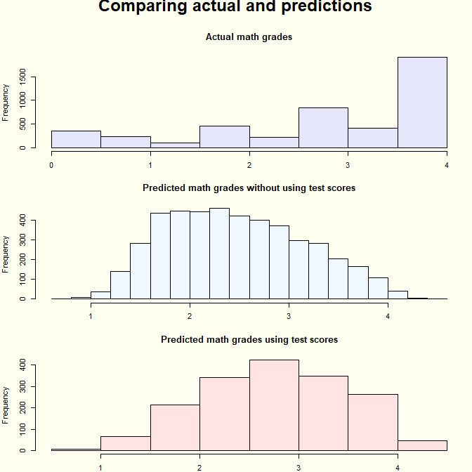
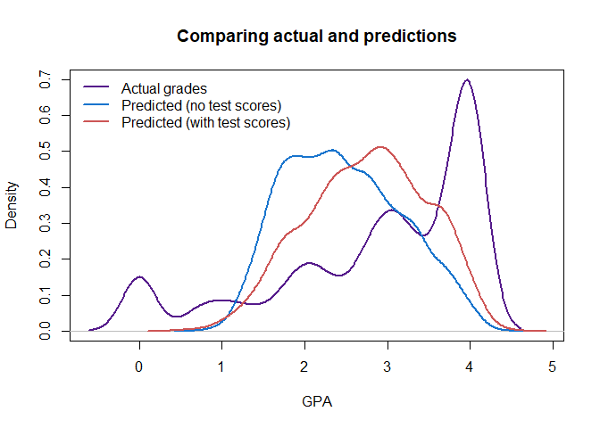
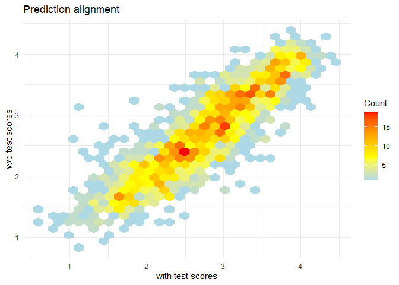
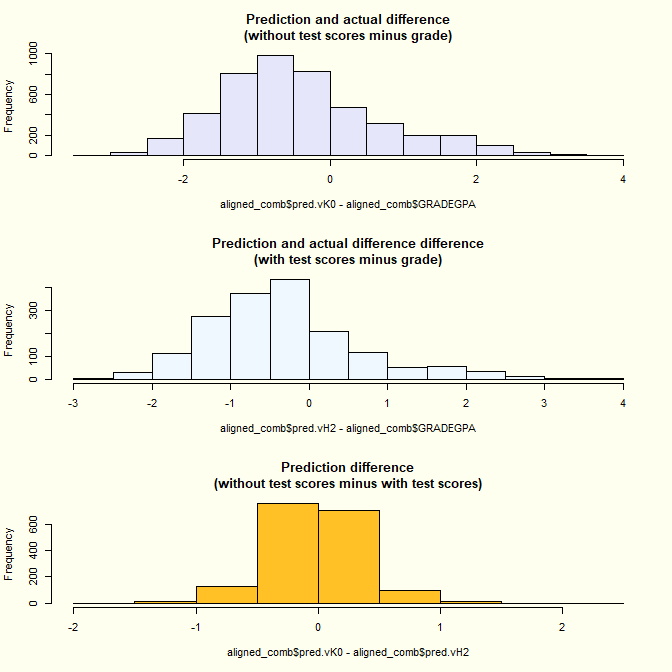
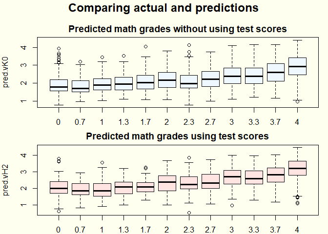
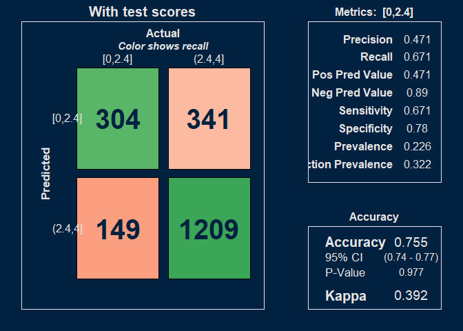
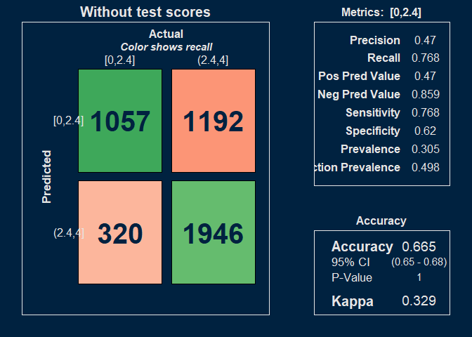
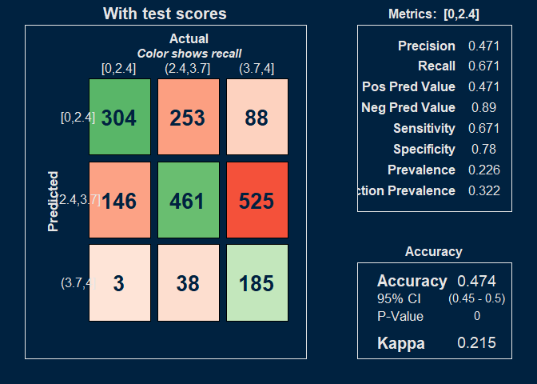
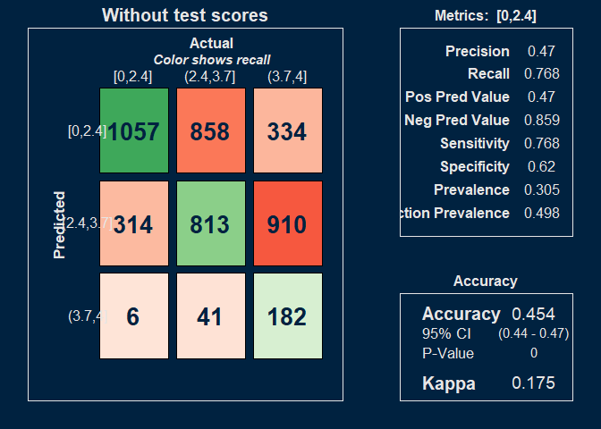

***PURPOSE:*** This document compares vH2 and vK0 for the year 2024. 

# EXECUTIVE SUMMARY

In order to minimize errors, the models tend to select the middle ground. 

Because actual performance data is heavily skewed towards the top, the models' tendency to populate the center results in under-prediction. 

Adding test scores improves the prediction.  Test score submitters also perform better, pushing their curve to the right.

Neither model really predicts failures, or admissions standards are aligned with grading standards.  (There aren't easily predicted failuress.) Something else is driving the failures. 

I'd like to see the density curves for score-submitters and non-score submitters.  


```
## [1] "GRADEGPA"
## [1] "grade_quad"
```


# Histograms

<!-- -->


# Density plots

<!-- -->


# Comparison heatmap

<!-- -->

# Differences

<!-- -->


# Box plots

<!-- -->


# Confusion matrix

<!-- --><!-- --><!-- --><!-- -->


