# Deeper Dive into vH4 (quarto)

# METHODLOGY

Data was prepared as described in the separate report, “Source Data,
Cleaning, and Preparation.” This model trained on the years 2006 to 2023
and tested on data from the year 2024.

A predictive model was trained with the package “xgboost.”

A value for math grade was predicted, and evaluated with the root mean
square error, mean absolute error, and r-squared values.

These values were also combined into a binary categorization
(“high”/“low” or “success”/“fail” or “on track”/“at risk”) using various
thresholds or cut-offs. An optimum threshold or cut-off was discovered
with the highest Kappa value.

# DISCUSSION

The model attempts to take information available at the time of
admittance, skip over course selection as a black box process, ignore
concurrent data such as class details (time of morning or capacity), and
predict grade performance for first-time freshmen at the end of their
initial math course. This comparison of the model with the timeline of
the actual student experience is shown in
<a href="#fig-pipeline" class="quarto-xref">Figure 1</a>.

With this minimalist data set, the model could predict grades in initial
math courses for first-time freshmen with an R-squared value of 0.28,
root mean square error of 1.01, and mean absolute error of 0.8.

The variables most important to the model were the high school GPA, the
ACT math test scores, and their derivative z-scores and combined z-score
distance to the qualifications of the prior year’s median successful
student.

This aligns with a theory of performance[^1]
(<a href="#fig-performance" class="quarto-xref">Figure 11</a>) where a
student’s math ability (as measured by the ACT math test scores) and a
student’s ‘study ability’ (as measured by their high school GPA) are
strong predictors of performance. However, the model is not completely
determinative – the pre-University data doesn’t define the grade
received – leaving room for individual motivation, effort, and the
influence of the concurrent situation (such as the number of credits
taken that semester). No student is guaranteed an ‘A’, as many students
who are predicted to score well do poorly (and vice versa.)

Given the sparsity of the data, the model tended to predict in the
middle of the range, putting 47% of the students between a grade of 2.7
and 3.7, while some 39% of students in 2024 actually received an ‘A’.
Several comparisons of the predicted and actual grades are presented as
scatter plots or box plots
(<a href="#fig-results_scatter_box" class="quarto-xref">Figure 2</a>),
density plots (<a href="#fig-density" class="quarto-xref">Figure 3</a>),
heat maps (<a href="#fig-heatmap" class="quarto-xref">Figure 4</a>),
confusion matrices
(<a href="#fig-binary_cm" class="quarto-xref">Figure 6</a>,
<a href="#fig-fail_cm" class="quarto-xref">Figure 9</a>), and histograms
(<a href="#fig-pred_hist_actual" class="quarto-xref">Figure 7</a>,
<a href="#fig-pred_hist_predict" class="quarto-xref">Figure 8</a>).

An optimum binary threshold was found at a predicted grade of 2.4, with
a Kappa value of 0.41. Students predicted to have a grade less than 2.4
are a high-risk group of students. 29% of these 507 students actually
did fail, or 76% of the total of students who failed. (76% recall and
29% precision).

This compares to the risk of students predicted to have a grade more
than 2.4. Only 47 of these 1195 students failed, or 4%.

Only a handful of students were precisely predicted fail their initial
math course – eight students were predicted to receive a grade less than
0.9, and six of these students actually received a grade less than 0.9.
These students might be considered admissions mistakes, as they
predictably failed. However, out of 1,759 students, this doesn’t seem to
indicate a large problem with admissions standards.

# CONCLUSIONS

The model could predict grades in initial math courses for first-time
freshmen with an R-squared value of 0.28, root mean square error of
1.01, and mean absolute error of 0.8. The variables most important to
the model were the high school GPA, the ACT math test scores, and their
derivative z-scores and combined distance.

The model had optimum performance in separating an at-risk population
and a successful population at a predicted grade threshold of 2.4
(between a C-plus and a B-minus.) Accuracy at this cut-off had a Kappa
value of 0.41.

At this cut-off, the actual failure metrics (grades less than a 1.7)
were 76% recall and 29% precision, or roughly one-third of the
identified “at risk” group actually failed and one out of twenty-five of
the “successful” group actually failed.

# POSSIBLE NEXT STEPS

Grade prediction accuracy should increase with the inclusion of
concurrent data, such as:

- The number of credits taken
- Difficulty of concurrent classes
- Initial course grades on quizzes, homework, and initial tests  
- Utilization of tutoring services  
- Participation in study groups

The model might improve with an indicator that clusters similar classes
(in terms of incoming qualifications) together. This could help
differentiate many small courses by combining them.

# RESULTS

Figure 1: Model compared to the timeline of actual student experience

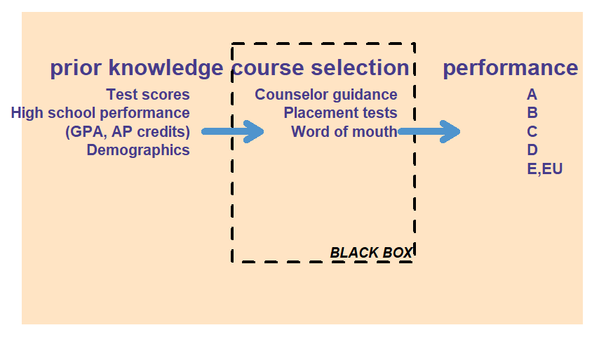

Table 1: Regression Results

Figure 2: These plots show what the correct prediction value would be
with a red line.

Figure 3: The model tends to predict towards the center, while most
students earn an ‘A’.

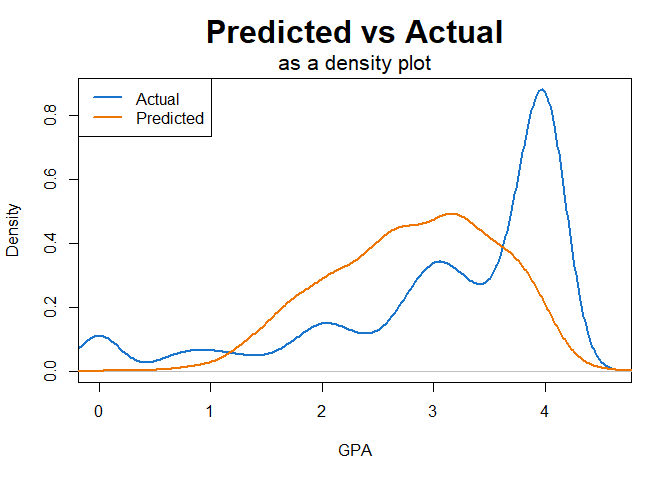

Figure 4: The heatmap shows grade expectations increase with ACT Math
and high school GPA.

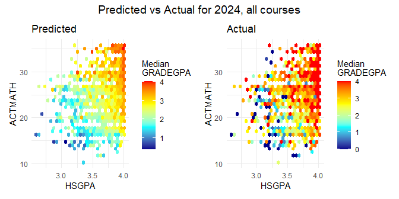

## Selection of model optimum binary cut-off or threshold

The model has the highest accuracy in separating into high/low (or
succeed/at-risk) populations at a predicted grade of 2.4, between an
actual grade of C-plus (2.3) and B-minus (2.7).

Figure 5: Selection of model optimum cut-off

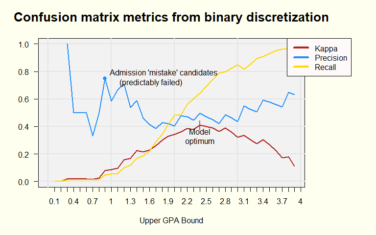

Figure 6: Confusion matrix at model binary optimum

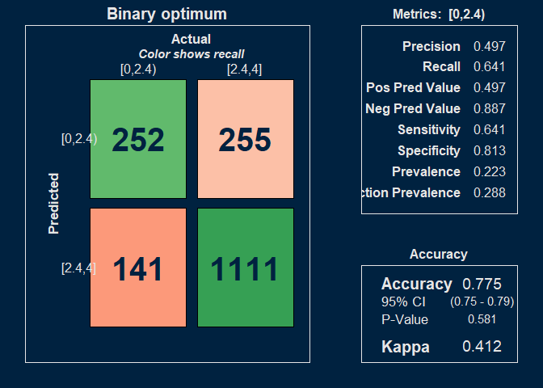

Table 2: Actual failure rates of ‘Success’ and ‘At Risk’ populations at
model binary optimum

Students predicted to have a grade less than 2.4 are a high-risk group
of students. 29% of these 507 students actually did fail, or 76% of the
total of students who failed. (76% recall and 29% precision).

This compares to the risk of students predicted to have a grade more
than 2.4. Only 47 of these 1195 students failed, or 4%.

The following histograms compare the ranges of grades predicted and
actually received. In
<a href="#fig-pred_hist_actual" class="quarto-xref">Figure 7</a>, 69
students predicted to get a grade less than 2.4 received a grade of
zero. In
<a href="#fig-pred_hist_predict" class="quarto-xref">Figure 8</a>, of
the students who actually received a grade less than 2.4, only nine of
them were predicted to get a grade less than one.

Figure 7: Illustration of prediction accuracy: where the histogram shows
the actual grades received for the grades predicted in the dotted box.

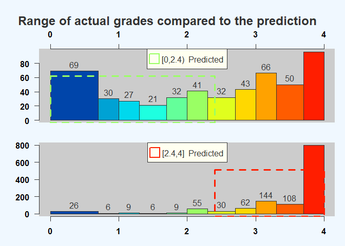

Figure 8: Illustration of prediction accuracy: where the histogram shows
the predicted grades for the actual grades received in the dotted box.

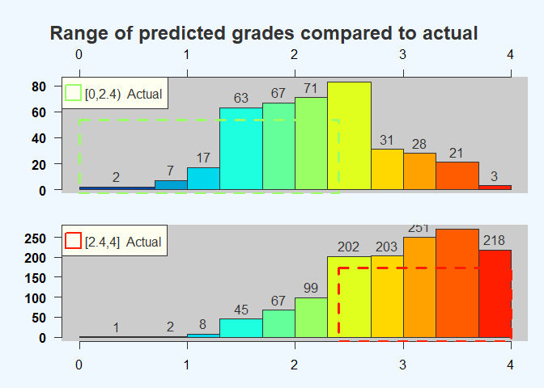

This model also shows a high precision point at a predicted GPA of 0.9.
These candidates would predictably fail, and could be considered an
admissions mistake. However, there are only eight people so identified
(out of 1,759), suggesting nearly all students admitted to the U have a
strong expectation of passing initial math courses.

Figure 9: Confusion matrix for ‘admission mistake’ candidates

## Variable importance

Figure 10: Variable importance to the model

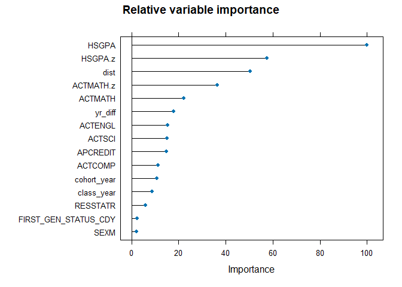

Figure 11: Theory of performance

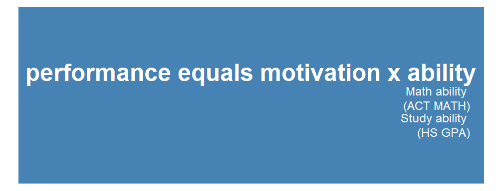

Figure 12: \#1 Variable: High school GPA

Figure 13: \#2 Variable: High school GPA z-score

Figure 14: \#3 Variable: Combined z-score distance

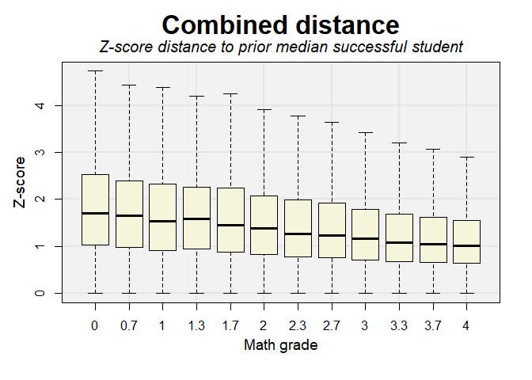

Figure 15: \#4 Variable: ACT Math z-score

Figure 16: \#5 Variable: ACT Math

Figure 17: \#6 Variable: Years to initial math course

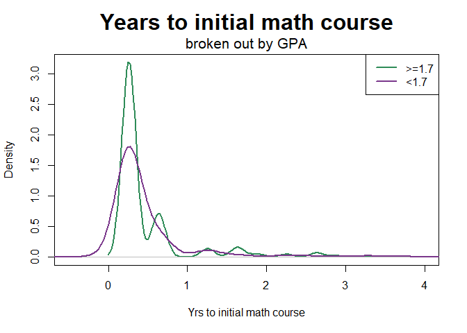

There is a small tendency for people who fail to take the initial math
course after the first year. (Most students (89% in 2024) take their
initial math course in the first year.)

# REFERENCES

Figure 18: How to interpret a confusion matrix

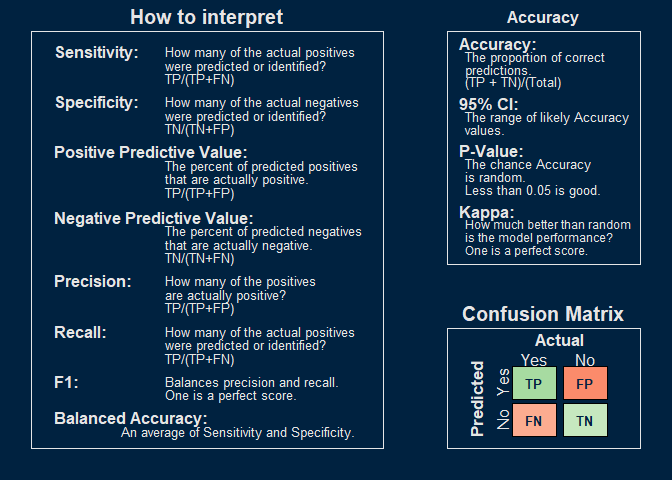

## Training data

|  |  |
|:---|:---|
| Name | data_list\[\[“GRADEGPA”\]\]\[\[… |
| Number of rows | 36924 |
| Number of columns | 24 |
| \_\_\_\_\_\_\_\_\_\_\_\_\_\_\_\_\_\_\_\_\_\_\_ |  |
| Column type frequency: |  |
| character | 5 |
| factor | 3 |
| numeric | 16 |
| \_\_\_\_\_\_\_\_\_\_\_\_\_\_\_\_\_\_\_\_\_\_\_\_ |  |
| Group variables | None |

Data summary

**Variable type: character**

| skim_variable       | n_missing | complete_rate | min | max | empty | n_unique | whitespace |
|:--------------------|----------:|--------------:|----:|----:|------:|---------:|-----------:|
| SEX                 |         0 |             1 |   1 |   1 |     0 |        2 |          0 |
| FIRST_GEN_STATUS_CD |         0 |             1 |   1 |   1 |     0 |        3 |          0 |
| RESSTAT             |         0 |             1 |   1 |   1 |     0 |        2 |          0 |
| HSPRIVATE           |         0 |             1 |   1 |   1 |     0 |        2 |          0 |
| season              |         0 |             1 |   4 |   6 |     0 |        3 |          0 |

**Variable type: factor**

| skim_variable | n_missing | complete_rate | ordered | n_unique | top_counts |
|:---|---:|---:|:---|---:|:---|
| course | 0 | 1 | FALSE | 25 | MAT: 8834, MAT: 6020, MAT: 4829, MAT: 3293 |
| ETHNICITY | 0 | 1 | FALSE | 9 | C: 26581, H: 4549, A: 2647, M: 1744 |
| age_cut | 0 | 1 | FALSE | 5 | (17: 30141, (18: 3150, (19: 1843, (0,: 1494 |

**Variable type: numeric**

| skim_variable | n_missing | complete_rate | mean | sd | p0 | p25 | p50 | p75 | p100 | hist |
|:---|---:|---:|---:|---:|---:|---:|---:|---:|---:|:---|
| GRADEGPA | 0 | 1 | 2.85 | 1.22 | 0.00 | 2.00 | 3.30 | 4.00 | 4.00 | ▂▁▂▃▇ |
| FA_PELL | 0 | 1 | 0.22 | 0.41 | 0.00 | 0.00 | 0.00 | 0.00 | 1.00 | ▇▁▁▁▂ |
| APCREDIT | 0 | 1 | 7.25 | 12.44 | 0.00 | 0.00 | 0.00 | 12.00 | 85.00 | ▇▁▁▁▁ |
| HSGPA | 0 | 1 | 3.62 | 0.34 | 1.07 | 3.41 | 3.71 | 3.91 | 4.42 | ▁▁▁▇▇ |
| HONORS | 0 | 1 | 0.16 | 0.37 | 0.00 | 0.00 | 0.00 | 0.00 | 1.00 | ▇▁▁▁▂ |
| ACTCOMP | 0 | 1 | 25.05 | 4.33 | 11.00 | 22.00 | 25.00 | 28.00 | 36.00 | ▁▅▇▅▂ |
| ACTENGL | 0 | 1 | 24.84 | 5.28 | 7.00 | 21.00 | 24.00 | 28.00 | 36.00 | ▁▂▇▆▃ |
| ACTMATH | 0 | 1 | 24.44 | 4.59 | 1.00 | 21.00 | 24.00 | 27.00 | 36.00 | ▁▁▅▇▂ |
| ACTSCI | 0 | 1 | 24.95 | 4.55 | 2.00 | 22.00 | 24.00 | 28.00 | 36.00 | ▁▁▅▇▂ |
| cohort_year | 0 | 1 | 2014.59 | 5.08 | 2005.00 | 2010.00 | 2015.00 | 2019.00 | 2023.00 | ▅▆▅▇▆ |
| class_year | 0 | 1 | 2014.96 | 4.99 | 2006.00 | 2011.00 | 2015.00 | 2019.00 | 2023.00 | ▆▆▇▇▇ |
| yr_diff | 0 | 1 | 0.50 | 0.79 | -0.40 | 0.24 | 0.26 | 0.26 | 16.64 | ▇▁▁▁▁ |
| course_level | 0 | 1 | 1.03 | 0.17 | 1.00 | 1.00 | 1.00 | 1.00 | 2.00 | ▇▁▁▁▁ |
| HSGPA.z | 0 | 1 | -0.53 | 1.21 | -42.07 | -1.16 | -0.23 | 0.32 | 2.01 | ▁▁▁▁▇ |
| ACTMATH.z | 0 | 1 | -0.13 | 1.12 | -10.00 | -0.79 | 0.00 | 0.49 | 6.93 | ▁▁▇▅▁ |
| dist | 0 | 1 | 1.41 | 1.01 | 0.00 | 0.72 | 1.18 | 1.86 | 42.07 | ▇▁▁▁▁ |

------------------------------------------------------------------------

[^1]: Anderson, N. H., & Butzin, C. A. 1974. Performance = motivation X
    ability: An integration-theoretical analysis. Journal of Personality
    and Social Psychology, 30(5): 598–604.
    <https://doi.org/10.1037/h0037447>
