**PURPOSE:** This report describes a model trained to predict initial math grades for first time freshmen in 2024 based on prior twenty years' of data on variables like ACT math test scores, high school GPA, and high school AP credits.  It performs with an r-squared value of 0.28.  Various aspects of the model prediction and actual performance are visualized and compared.  


I have all these nice graphs but no words.  

So here are some words.

I need an outline that includes "METHOD"

EXECUTIVE SUMMARY

METHODOLOGY

DISCUSSION

NEXT STEPS

RESULTS 

What this report shows:

- There are a handful of students who predictably failed (with high precision.)  This could suggest: 
  - That these students shouldn't have been admitted and constitute an admissions mistake.  (If we knew they had a high chance of failure, should we have admitted them?)    
  - That the very small number of students in this category suggests that we don't have a large admissions failure.   
  
- An R-squared model of 0.28 is a decently predictive model on very few variables.  It can predict the student's grade with a mean absolute error of 0.84.  So incoming math ability and study ability can explain about 28% of grade variation.    

- However, it still leaves a lot un-explained.  It is not mechanically deterministic and doesn't suggest strong cut-offs.  The histograms compare the ranges of actual vs predicted values.  

- Failure (<1.3) seems to be about a lot more than math ability and study ability (test scores and high school GPA) as students fail despite predicted grades as high as an A.  (What's my metric that says this?)

- The optimum split is 2.7 (B-).  This is where the model performs at its best (least-random) ability to sort students into high and low grades. 

- Unexpectedly, "course" disappears as an explanatory variable. 

  - Maybe this means that the courses are roughly equivalent and course selection doesn't matter. 
  - Maybe this means that some unknown sorting mechanism adequately places students into math courses appropriate to their ability, so that only their studiousness or "study ability" (as indicated by their high school GPA) separates academic performance.  

- The top two predictors of grade are (overwhelmingly) the high school GPA and the ACT math test scores.  

  - A heat map of expected values based on twenty years' of data is very reasonable, with lower grades expected upon moving diagonally to the lower left. 
  
  - Grade inflation?  A lot redder than expected; Way more 'A's than expected.  Looks a lot easier to top off on this scale.  Looking a lot more like a pass-fail.  (Like---what's the number here?  How many did I expect and how many did I get?  It's a simple question of precision I guess.)  
  
    Looking at this: createCM(aligned[["GRADEGPA"]], cuts = c(0,3.3,3.7,4)) |> drawCM()
    
 Look how it "leans" right towards the higher end.  Way more people get >3.7 who are predicted to get <3.7 .
 
 Math looks very, very, very forgiving.  It is graded very generously.
 
Look at how low the precision is for  
createCM(aligned[["GRADEGPA"]], cuts = c(0,3.3,4)) |> drawCM().

They are really pushing grades up here. 

...or is that a correct interpretation?  Does it just mean my model is bad?  Can I manually adjust the prediction and improve the prediction?  If I can, why doesn't the model do it automatically?


  
  
  


And what makes these reports hard to complete 

This report needs some TLC, changes to plot sizes, some words and write-up, and then it needs a comparison with the grade-only prediction (maybe a separate report?).

Possibly develop a <= accuracy metric, a modification of recall, as I don't care how many people got better than a C+ but I care how many people got a C+ or less.

I'll polish up this report a little more before adding that.  


```
## [1] "GRADEGPA"
## [1] "grade_quad"
```

### Models  

<table class="table table-striped table-hover table-condensed" style="color: black; width: auto !important; ">
<caption>Grade Mapping</caption>
 <thead>
  <tr>
   <th style="text-align:left;font-weight: bold;background-color: rgba(240, 240, 240, 255) !important;"> Letter Grade </th>
   <th style="text-align:center;font-weight: bold;background-color: rgba(240, 240, 240, 255) !important;"> GPA </th>
   <th style="text-align:center;font-weight: bold;background-color: rgba(240, 240, 240, 255) !important;"> Quad </th>
  </tr>
 </thead>
<tbody>
  <tr>
   <td style="text-align:left;font-weight: bold;"> E, EU </td>
   <td style="text-align:center;"> 0.0 </td>
   <td style="text-align:center;"> 0 </td>
  </tr>
  <tr>
   <td style="text-align:left;font-weight: bold;"> D- </td>
   <td style="text-align:center;"> 0.7 </td>
   <td style="text-align:center;"> 0 </td>
  </tr>
  <tr>
   <td style="text-align:left;font-weight: bold;"> D </td>
   <td style="text-align:center;"> 1.0 </td>
   <td style="text-align:center;"> 0 </td>
  </tr>
  <tr>
   <td style="text-align:left;font-weight: bold;"> D+ </td>
   <td style="text-align:center;"> 1.3 </td>
   <td style="text-align:center;"> 0 </td>
  </tr>
  <tr>
   <td style="text-align:left;font-weight: bold;"> C- </td>
   <td style="text-align:center;"> 1.7 </td>
   <td style="text-align:center;"> 1 </td>
  </tr>
  <tr>
   <td style="text-align:left;font-weight: bold;"> C </td>
   <td style="text-align:center;"> 2.0 </td>
   <td style="text-align:center;"> 1 </td>
  </tr>
  <tr>
   <td style="text-align:left;font-weight: bold;"> C+ </td>
   <td style="text-align:center;"> 2.3 </td>
   <td style="text-align:center;"> 1 </td>
  </tr>
  <tr>
   <td style="text-align:left;font-weight: bold;"> B- </td>
   <td style="text-align:center;"> 2.7 </td>
   <td style="text-align:center;"> 2 </td>
  </tr>
  <tr>
   <td style="text-align:left;font-weight: bold;"> B </td>
   <td style="text-align:center;"> 3.0 </td>
   <td style="text-align:center;"> 2 </td>
  </tr>
  <tr>
   <td style="text-align:left;font-weight: bold;"> B+ </td>
   <td style="text-align:center;"> 3.3 </td>
   <td style="text-align:center;"> 2 </td>
  </tr>
  <tr>
   <td style="text-align:left;font-weight: bold;"> A- </td>
   <td style="text-align:center;"> 3.7 </td>
   <td style="text-align:center;"> 2 </td>
  </tr>
  <tr>
   <td style="text-align:left;font-weight: bold;"> A </td>
   <td style="text-align:center;"> 4.0 </td>
   <td style="text-align:center;"> 3 </td>
  </tr>
</tbody>
</table>


# Results

<table class=" lightable-classic" style="color: black; font-family: Calibri; width: auto !important; margin-left: auto; margin-right: auto;">
<caption>Normalized Regression Results Across Grading Buckets</caption>
 <thead>
<tr>
<th style="empty-cells: hide;" colspan="1"></th>
<th style="padding-bottom:0; padding-left:3px;padding-right:3px;text-align: center; " colspan="3"><div style="border-bottom: 1px solid #111111; margin-bottom: -1px; ">Raw Metrics</div></th>
<th style="padding-bottom:0; padding-left:3px;padding-right:3px;text-align: center; " colspan="4"><div style="border-bottom: 1px solid #111111; margin-bottom: -1px; ">Normalized Metrics</div></th>
</tr>
  <tr>
   <th style="text-align:left;font-weight: bold;background-color: rgba(240, 240, 240, 255) !important;">  </th>
   <th style="text-align:center;font-weight: bold;background-color: rgba(240, 240, 240, 255) !important;"> RMSE </th>
   <th style="text-align:center;font-weight: bold;background-color: rgba(240, 240, 240, 255) !important;"> MAE </th>
   <th style="text-align:center;font-weight: bold;background-color: rgba(240, 240, 240, 255) !important;"> R-sq </th>
   <th style="text-align:center;font-weight: bold;background-color: rgba(240, 240, 240, 255) !important;"> NRMSE (Range) </th>
   <th style="text-align:center;font-weight: bold;background-color: rgba(240, 240, 240, 255) !important;"> NMAE (Range) </th>
   <th style="text-align:center;font-weight: bold;background-color: rgba(240, 240, 240, 255) !important;"> NRMSE (SD) </th>
   <th style="text-align:center;font-weight: bold;background-color: rgba(240, 240, 240, 255) !important;"> NMAE (SD) </th>
  </tr>
 </thead>
<tbody>
  <tr>
   <td style="text-align:left;background-color: rgba(255, 255, 255, 255) !important;"> GRADEGPA </td>
   <td style="text-align:center;background-color: rgba(255, 255, 255, 255) !important;"> 1.06 </td>
   <td style="text-align:center;background-color: rgba(255, 255, 255, 255) !important;"> 0.84 </td>
   <td style="text-align:center;background-color: rgba(255, 255, 255, 255) !important;"> 0.26 </td>
   <td style="text-align:center;background-color: rgba(255, 255, 255, 255) !important;"> 0.26 </td>
   <td style="text-align:center;background-color: rgba(255, 255, 255, 255) !important;"> 0.21 </td>
   <td style="text-align:center;background-color: rgba(255, 255, 255, 255) !important;"> 0.92 </td>
   <td style="text-align:center;background-color: rgba(255, 255, 255, 255) !important;"> 0.73 </td>
  </tr>
  <tr>
   <td style="text-align:left;background-color: rgba(255, 255, 255, 255) !important;"> grade_quad </td>
   <td style="text-align:center;background-color: rgba(255, 255, 255, 255) !important;"> 0.85 </td>
   <td style="text-align:center;background-color: rgba(255, 255, 255, 255) !important;"> 0.67 </td>
   <td style="text-align:center;background-color: rgba(255, 255, 255, 255) !important;"> 0.30 </td>
   <td style="text-align:center;background-color: rgba(255, 255, 255, 255) !important;"> 0.28 </td>
   <td style="text-align:center;background-color: rgba(255, 255, 255, 255) !important;"> 0.22 </td>
   <td style="text-align:center;background-color: rgba(255, 255, 255, 255) !important;"> 0.86 </td>
   <td style="text-align:center;background-color: rgba(255, 255, 255, 255) !important;"> 0.68 </td>
  </tr>
</tbody>
</table>


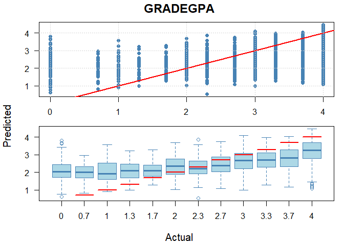<!-- --><!-- -->


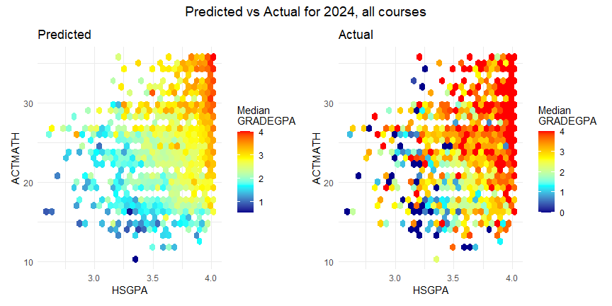<!-- -->


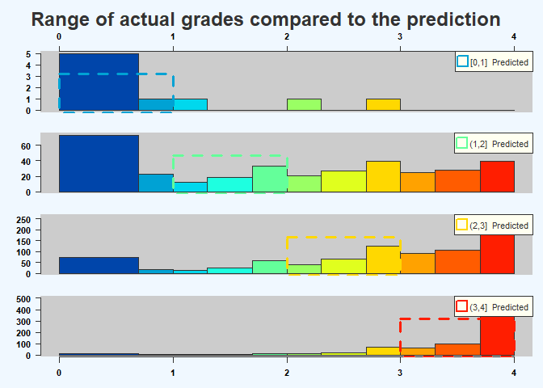<!-- -->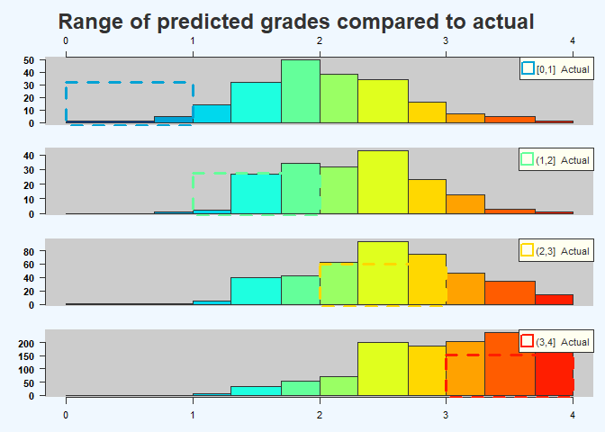<!-- -->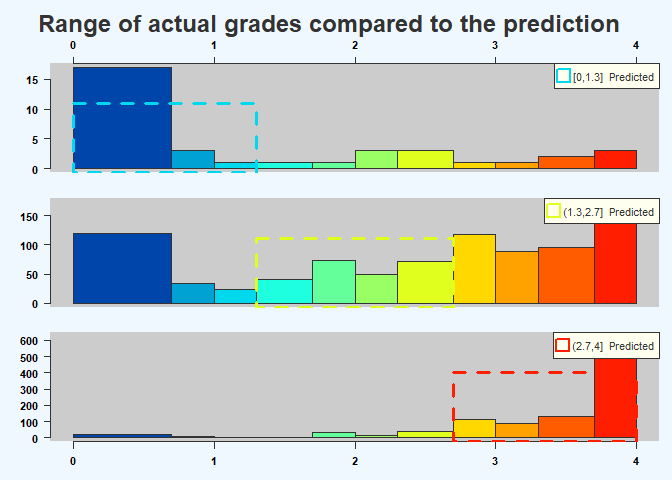<!-- -->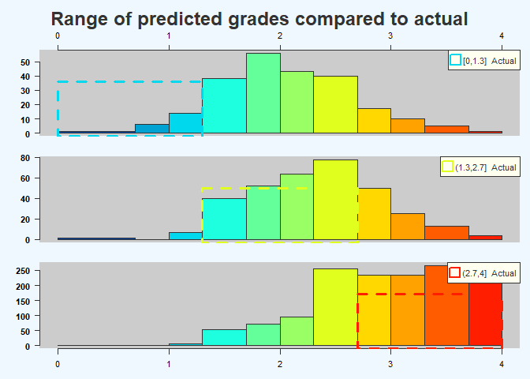<!-- -->

Examining the precision for predictions of grades <1 looks like these few people could be an admissions error, or a very low probability of success for this handful of people. 


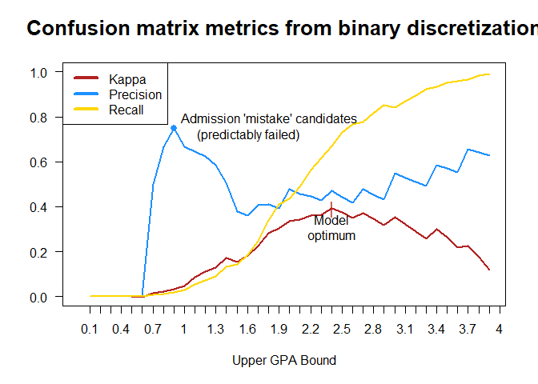<!-- -->


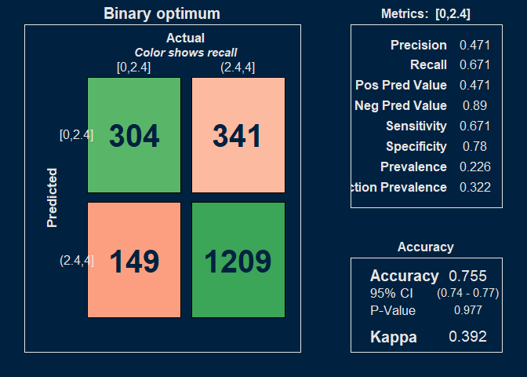<!-- -->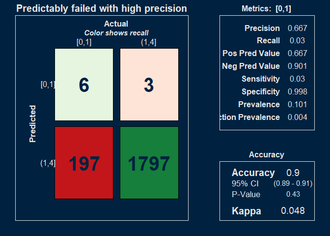<!-- -->


# Variable importance

### Predictors

course, SEX, FIRST_GEN_STATUS_CD, ETHNICITY, RESSTAT, FA_PELL, APCREDIT, HSGPA, HSPRIVATE, HONORS, ACTCOMP, ACTENGL, ACTMATH, ACTSCI, cohort_year, class_year, yr_diff, season, course_level, vol_cluster, age_cut. 

"load" is the credit load per student per term. 
"yr_diff" is the time (expressed as fractions of a year) between the cohort date and the end of term date for the course.  

The other variables are either self-explanatory or taken directly from OBIA tables.  


<!-- -->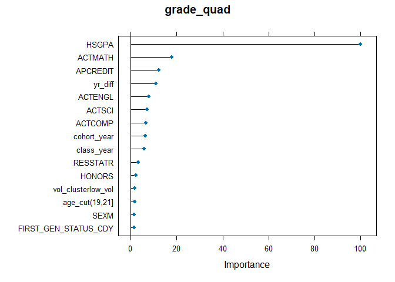<!-- -->


# Confusion matrix


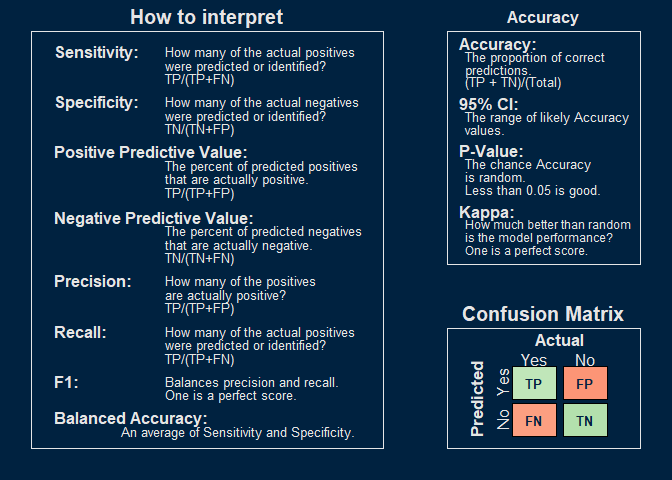<!-- -->

# Training data

Presentation order: 


