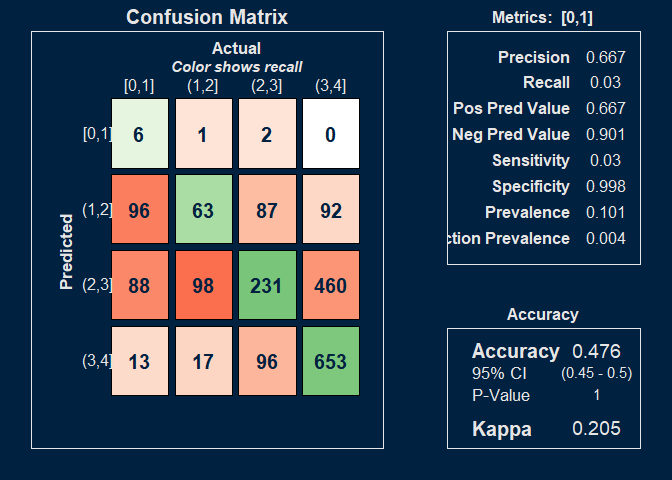
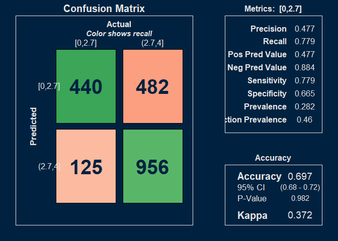
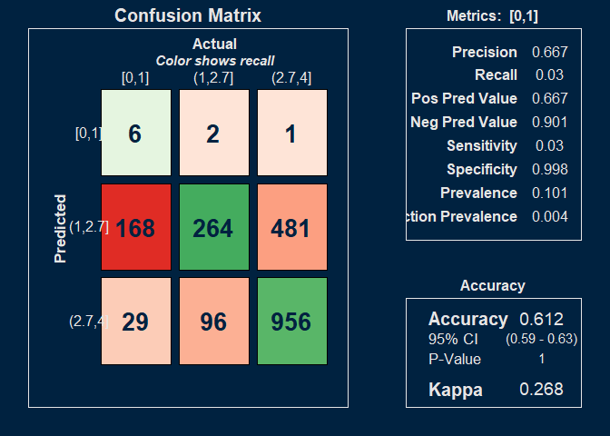
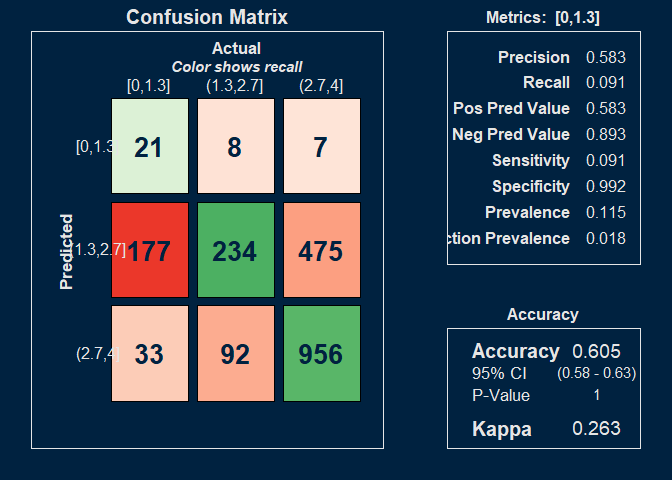
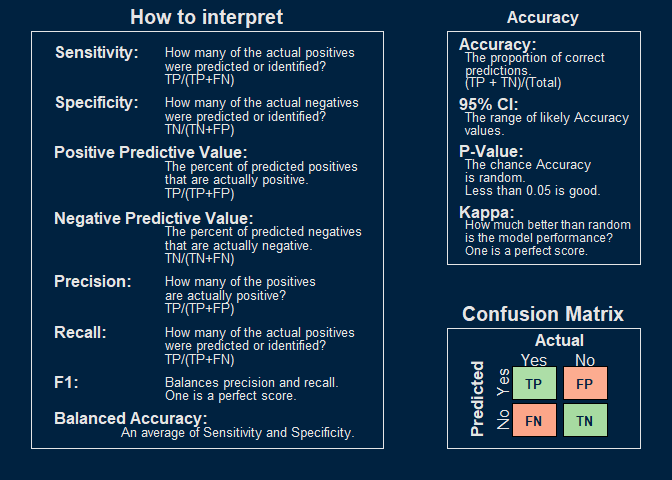

```
## [1] "GRADEGPA"
## [1] "GRADEGPA"
## missingFilter
## FALSE  TRUE 
##    11  2003 
## [1] "grade_quad"
## [1] "grade_quad"
## missingFilter
## FALSE  TRUE 
##    11  2003
```

### Models  

<table class="table table-striped table-hover table-condensed" style="color: black; width: auto !important; ">
<caption>Grade Mapping</caption>
 <thead>
  <tr>
   <th style="text-align:left;font-weight: bold;background-color: rgba(240, 240, 240, 255) !important;"> Letter Grade </th>
   <th style="text-align:center;font-weight: bold;background-color: rgba(240, 240, 240, 255) !important;"> GPA </th>
   <th style="text-align:center;font-weight: bold;background-color: rgba(240, 240, 240, 255) !important;"> Quad </th>
  </tr>
 </thead>
<tbody>
  <tr>
   <td style="text-align:left;font-weight: bold;"> E, EU </td>
   <td style="text-align:center;"> 0.0 </td>
   <td style="text-align:center;"> 0 </td>
  </tr>
  <tr>
   <td style="text-align:left;font-weight: bold;"> D- </td>
   <td style="text-align:center;"> 0.7 </td>
   <td style="text-align:center;"> 0 </td>
  </tr>
  <tr>
   <td style="text-align:left;font-weight: bold;"> D </td>
   <td style="text-align:center;"> 1.0 </td>
   <td style="text-align:center;"> 0 </td>
  </tr>
  <tr>
   <td style="text-align:left;font-weight: bold;"> D+ </td>
   <td style="text-align:center;"> 1.3 </td>
   <td style="text-align:center;"> 0 </td>
  </tr>
  <tr>
   <td style="text-align:left;font-weight: bold;"> C- </td>
   <td style="text-align:center;"> 1.7 </td>
   <td style="text-align:center;"> 1 </td>
  </tr>
  <tr>
   <td style="text-align:left;font-weight: bold;"> C </td>
   <td style="text-align:center;"> 2.0 </td>
   <td style="text-align:center;"> 1 </td>
  </tr>
  <tr>
   <td style="text-align:left;font-weight: bold;"> C+ </td>
   <td style="text-align:center;"> 2.3 </td>
   <td style="text-align:center;"> 1 </td>
  </tr>
  <tr>
   <td style="text-align:left;font-weight: bold;"> B- </td>
   <td style="text-align:center;"> 2.7 </td>
   <td style="text-align:center;"> 2 </td>
  </tr>
  <tr>
   <td style="text-align:left;font-weight: bold;"> B </td>
   <td style="text-align:center;"> 3.0 </td>
   <td style="text-align:center;"> 2 </td>
  </tr>
  <tr>
   <td style="text-align:left;font-weight: bold;"> B+ </td>
   <td style="text-align:center;"> 3.3 </td>
   <td style="text-align:center;"> 2 </td>
  </tr>
  <tr>
   <td style="text-align:left;font-weight: bold;"> A- </td>
   <td style="text-align:center;"> 3.7 </td>
   <td style="text-align:center;"> 2 </td>
  </tr>
  <tr>
   <td style="text-align:left;font-weight: bold;"> A </td>
   <td style="text-align:center;"> 4.0 </td>
   <td style="text-align:center;"> 3 </td>
  </tr>
</tbody>
</table>


# Results


```
## [1] "GRADEGPA"
## missingFilter
## FALSE  TRUE 
##    11  2003 
## [1] "grade_quad"
## missingFilter
## FALSE  TRUE 
##    11  2003
```

<table class=" lightable-classic" style="color: black; font-family: Calibri; width: auto !important; margin-left: auto; margin-right: auto;">
<caption>Normalized Regression Results Across Grading Buckets</caption>
 <thead>
<tr>
<th style="empty-cells: hide;" colspan="1"></th>
<th style="padding-bottom:0; padding-left:3px;padding-right:3px;text-align: center; " colspan="3"><div style="border-bottom: 1px solid #111111; margin-bottom: -1px; ">Raw Metrics</div></th>
<th style="padding-bottom:0; padding-left:3px;padding-right:3px;text-align: center; " colspan="4"><div style="border-bottom: 1px solid #111111; margin-bottom: -1px; ">Normalized Metrics</div></th>
</tr>
  <tr>
   <th style="text-align:left;font-weight: bold;background-color: rgba(240, 240, 240, 255) !important;">  </th>
   <th style="text-align:center;font-weight: bold;background-color: rgba(240, 240, 240, 255) !important;"> RMSE </th>
   <th style="text-align:center;font-weight: bold;background-color: rgba(240, 240, 240, 255) !important;"> MAE </th>
   <th style="text-align:center;font-weight: bold;background-color: rgba(240, 240, 240, 255) !important;"> R-sq </th>
   <th style="text-align:center;font-weight: bold;background-color: rgba(240, 240, 240, 255) !important;"> NRMSE (Range) </th>
   <th style="text-align:center;font-weight: bold;background-color: rgba(240, 240, 240, 255) !important;"> NMAE (Range) </th>
   <th style="text-align:center;font-weight: bold;background-color: rgba(240, 240, 240, 255) !important;"> NRMSE (SD) </th>
   <th style="text-align:center;font-weight: bold;background-color: rgba(240, 240, 240, 255) !important;"> NMAE (SD) </th>
  </tr>
 </thead>
<tbody>
  <tr>
   <td style="text-align:left;background-color: rgba(255, 255, 255, 255) !important;"> GRADEGPA </td>
   <td style="text-align:center;background-color: rgba(255, 255, 255, 255) !important;"> 1.06 </td>
   <td style="text-align:center;background-color: rgba(255, 255, 255, 255) !important;"> 0.84 </td>
   <td style="text-align:center;background-color: rgba(255, 255, 255, 255) !important;"> 0.26 </td>
   <td style="text-align:center;background-color: rgba(255, 255, 255, 255) !important;"> 0.26 </td>
   <td style="text-align:center;background-color: rgba(255, 255, 255, 255) !important;"> 0.21 </td>
   <td style="text-align:center;background-color: rgba(255, 255, 255, 255) !important;"> 0.92 </td>
   <td style="text-align:center;background-color: rgba(255, 255, 255, 255) !important;"> 0.73 </td>
  </tr>
  <tr>
   <td style="text-align:left;background-color: rgba(255, 255, 255, 255) !important;"> grade_quad </td>
   <td style="text-align:center;background-color: rgba(255, 255, 255, 255) !important;"> 0.85 </td>
   <td style="text-align:center;background-color: rgba(255, 255, 255, 255) !important;"> 0.67 </td>
   <td style="text-align:center;background-color: rgba(255, 255, 255, 255) !important;"> 0.30 </td>
   <td style="text-align:center;background-color: rgba(255, 255, 255, 255) !important;"> 0.28 </td>
   <td style="text-align:center;background-color: rgba(255, 255, 255, 255) !important;"> 0.22 </td>
   <td style="text-align:center;background-color: rgba(255, 255, 255, 255) !important;"> 0.86 </td>
   <td style="text-align:center;background-color: rgba(255, 255, 255, 255) !important;"> 0.68 </td>
  </tr>
</tbody>
</table>


<!-- --><!-- -->


<!-- -->


<!-- --><!-- --><!-- --><!-- -->

Examining the precision for predictions of grades <1 looks like these few people could be an admissions error, or a very low probability of success for this handful of people. 


<!-- --><!-- --><!-- --><!-- -->


# Variable importance

### Predictors

course, SEX, FIRST_GEN_STATUS_CD, ETHNICITY, RESSTAT, FA_PELL, APCREDIT, HSGPA, HSPRIVATE, HONORS, ACTCOMP, ACTENGL, ACTMATH, ACTSCI, cohort_year, class_year, yr_diff, season, course_level, vol_cluster, age_cut. 

"load" is the credit load per student per term. 
"yr_diff" is the time (expressed as fractions of a year) between the cohort date and the end of term date for the course.  

The other variables are either self-explanatory or taken directly from OBIA tables.  


<!-- --><!-- -->


# Confusion matrix


<!-- -->

# Training data

Presentation order: 


