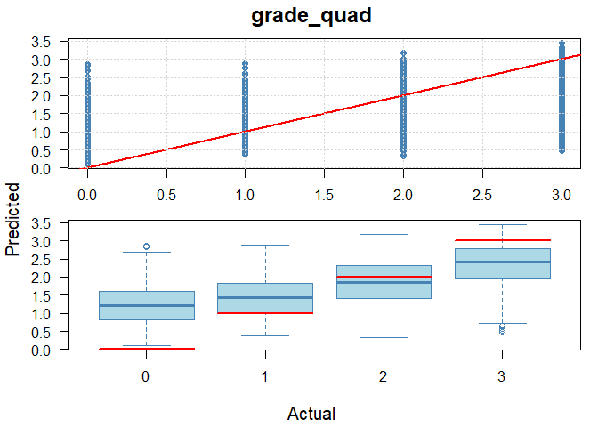

```
## [1] "GRADEGPA"
## missingFilter
## FALSE  TRUE 
##    11  2003 
## [1] "grade_quad"
## missingFilter
## FALSE  TRUE 
##    11  2003
```


### Models  

*MODEL 1: binary* 

  - Target buckets:   
    1: "A", "A-", "B+", "B", "B-", "C+", "C", "C-"  
    0: "D+", "D", "D-", "E", "EU" 
  
*MODEL 2: trinary*  

  - Target buckets:     
    2: "A", "A-", "B+", "B", "B-"  
    1: "C+", "C", "C-"  
    0: "D+", "D", "D-", "E", "EU" 

*MODEL 3: quad* 

  - Target buckets:   
    3: "A"  
    2: "A-", "B+", "B", "B-"  
    1: "C+", "C", "C-"  
    0: "D+", "D", "D-", "E", "EU" 

*MODEL 4: grade GPA* 

  - Targets: 
    4, 3.7, 3.3, 3, 2.7, 2.3, 2, 1.7, 1.3, 1, 0.7, 0

### Predictors  

course, SEX, FIRST_GEN_STATUS_CD, ETHNICITY, RESSTAT, FA_PELL, APCREDIT, HSGPA, HSPRIVATE, HONORS, ACTCOMP, ACTENGL, ACTMATH, ACTSCI, cohort_year, class_year, yr_diff, season, course_level, vol_cluster, age_cut. 

"load" is the credit load per student per term. 
"yr_diff" is the time (expressed as fractions of a year) between the cohort date and the end of term date for the course.  

The other variables are either self-explanatory or taken directly from OBIA tables.  

# Results


```
## [1] "GRADEGPA"
## [1] "GRADEGPA"
## missingFilter
## FALSE  TRUE 
##    11  2003 
## [1] "grade_quad"
## [1] "grade_quad"
## missingFilter
## FALSE  TRUE 
##    11  2003
```

```
## [1] "GRADEGPA"
## missingFilter
## FALSE  TRUE 
##    11  2003 
## [1] "grade_quad"
## missingFilter
## FALSE  TRUE 
##    11  2003
```

<table class=" lightable-classic" style="color: black; font-family: Calibri; width: auto !important; margin-left: auto; margin-right: auto;">
<caption>Normalized Regression Results Across Grading Buckets</caption>
 <thead>
<tr>
<th style="empty-cells: hide;" colspan="1"></th>
<th style="padding-bottom:0; padding-left:3px;padding-right:3px;text-align: center; " colspan="3"><div style="border-bottom: 1px solid #111111; margin-bottom: -1px; ">Raw Metrics</div></th>
<th style="padding-bottom:0; padding-left:3px;padding-right:3px;text-align: center; " colspan="4"><div style="border-bottom: 1px solid #111111; margin-bottom: -1px; ">Normalized Metrics</div></th>
</tr>
  <tr>
   <th style="text-align:left;font-weight: bold;background-color: rgba(240, 240, 240, 255) !important;">  </th>
   <th style="text-align:center;font-weight: bold;background-color: rgba(240, 240, 240, 255) !important;"> RMSE </th>
   <th style="text-align:center;font-weight: bold;background-color: rgba(240, 240, 240, 255) !important;"> MAE </th>
   <th style="text-align:center;font-weight: bold;background-color: rgba(240, 240, 240, 255) !important;"> R-sq </th>
   <th style="text-align:center;font-weight: bold;background-color: rgba(240, 240, 240, 255) !important;"> NRMSE (Range) </th>
   <th style="text-align:center;font-weight: bold;background-color: rgba(240, 240, 240, 255) !important;"> NMAE (Range) </th>
   <th style="text-align:center;font-weight: bold;background-color: rgba(240, 240, 240, 255) !important;"> NRMSE (SD) </th>
   <th style="text-align:center;font-weight: bold;background-color: rgba(240, 240, 240, 255) !important;"> NMAE (SD) </th>
  </tr>
 </thead>
<tbody>
  <tr>
   <td style="text-align:left;background-color: rgba(255, 255, 255, 255) !important;"> GRADEGPA </td>
   <td style="text-align:center;background-color: rgba(255, 255, 255, 255) !important;"> 1.06 </td>
   <td style="text-align:center;background-color: rgba(255, 255, 255, 255) !important;"> 0.84 </td>
   <td style="text-align:center;background-color: rgba(255, 255, 255, 255) !important;"> 0.26 </td>
   <td style="text-align:center;background-color: rgba(255, 255, 255, 255) !important;"> 0.26 </td>
   <td style="text-align:center;background-color: rgba(255, 255, 255, 255) !important;"> 0.21 </td>
   <td style="text-align:center;background-color: rgba(255, 255, 255, 255) !important;"> 0.92 </td>
   <td style="text-align:center;background-color: rgba(255, 255, 255, 255) !important;"> 0.73 </td>
  </tr>
  <tr>
   <td style="text-align:left;background-color: rgba(255, 255, 255, 255) !important;"> grade_quad </td>
   <td style="text-align:center;background-color: rgba(255, 255, 255, 255) !important;"> 0.85 </td>
   <td style="text-align:center;background-color: rgba(255, 255, 255, 255) !important;"> 0.67 </td>
   <td style="text-align:center;background-color: rgba(255, 255, 255, 255) !important;"> 0.30 </td>
   <td style="text-align:center;background-color: rgba(255, 255, 255, 255) !important;"> 0.28 </td>
   <td style="text-align:center;background-color: rgba(255, 255, 255, 255) !important;"> 0.22 </td>
   <td style="text-align:center;background-color: rgba(255, 255, 255, 255) !important;"> 0.86 </td>
   <td style="text-align:center;background-color: rgba(255, 255, 255, 255) !important;"> 0.68 </td>
  </tr>
</tbody>
</table>


<!-- --><!-- -->

# Variable importance

<!-- --><!-- -->


# Confusion matrix


```
## Confusion Matrix and Statistics
## 
##              Reference
## Prediction    (0.35,0.85] (0.85,1.15] (1.15,1.5] (1.5,1.85] (1.85,2.15]
##   (0.35,0.85]           1           0          0          0           0
##   (0.85,1.15]           1           2          1          0           1
##   (1.15,1.5]            3           5          4          5           8
##   (1.5,1.85]           14          12          6         10          14
##   (1.85,2.15]           4           8          4          9          21
##   (2.15,2.5]           10           5          6         12          20
##   (2.5,2.85]            6           6          4          5          21
##   (2.85,3.15]           2           2          2          3          11
##   (3.15,3.5]            0           2          1          2           8
##   (3.5,3.85]            0           1          0          0           1
##   (3.85,10]             0           0          0          0           0
##              Reference
## Prediction    (2.15,2.5] (2.5,2.85] (2.85,3.15] (3.15,3.5] (3.5,3.85] (3.85,10]
##   (0.35,0.85]          1          0           0          0          0         0
##   (0.85,1.15]          1          1           1          0          0         1
##   (1.15,1.5]           3          6          10          4          4         8
##   (1.5,1.85]           9         14          21         14         12        18
##   (1.85,2.15]         15         11          23         18         21        23
##   (2.15,2.5]          20         33          34         32         38        68
##   (2.5,2.85]           9         16          55         31         43       113
##   (2.85,3.15]          5         16          37         35         38       130
##   (3.15,3.5]           6         11          30         28         39       143
##   (3.5,3.85]           1          4          17         11         30       184
##   (3.85,10]            1          0           5          4          5       110
## 
## Overall Statistics
##                                           
##                Accuracy : 0.1481          
##                  95% CI : (0.1323, 0.1649)
##     No Information Rate : 0.4236          
##     P-Value [Acc > NIR] : 1               
##                                           
##                   Kappa : 0.0549          
##                                           
##  Mcnemar's Test P-Value : NA              
## 
## Statistics by Class:
## 
##                      Class: (0.35,0.85] Class: (0.85,1.15] Class: (1.15,1.5]
## Sensitivity                   0.0243902           0.046512          0.142857
## Specificity                   0.9994574           0.996198          0.969828
## Pos Pred Value                0.5000000           0.222222          0.066667
## Neg Pred Value                0.9787460           0.978133          0.986842
## Precision                     0.5000000           0.222222          0.066667
## Recall                        0.0243902           0.046512          0.142857
## F1                            0.0465116           0.076923          0.090909
## Prevalence                    0.0217622           0.022824          0.014862
## Detection Rate                0.0005308           0.001062          0.002123
## Detection Prevalence          0.0010616           0.004777          0.031847
## Balanced Accuracy             0.5119238           0.521355          0.556342
##                      Class: (1.5,1.85] Class: (1.85,2.15] Class: (2.15,2.5]
## Sensitivity                   0.217391            0.20000           0.28169
## Specificity                   0.927095            0.92355           0.85769
## Pos Pred Value                0.069444            0.13376           0.07194
## Neg Pred Value                0.979310            0.95136           0.96824
## Precision                     0.069444            0.13376           0.07194
## Recall                        0.217391            0.20000           0.28169
## F1                            0.105263            0.16031           0.11461
## Prevalence                    0.024416            0.05573           0.03769
## Detection Rate                0.005308            0.01115           0.01062
## Detection Prevalence          0.076433            0.08333           0.14756
## Balanced Accuracy             0.572243            0.56178           0.56969
##                      Class: (2.5,2.85] Class: (2.85,3.15] Class: (3.15,3.5]
## Sensitivity                   0.142857            0.15880           0.15819
## Specificity                   0.834650            0.85221           0.85823
## Pos Pred Value                0.051780            0.13167           0.10370
## Neg Pred Value                0.939048            0.87773           0.90768
## Precision                     0.051780            0.13167           0.10370
## Recall                        0.142857            0.15880           0.15819
## F1                            0.076010            0.14397           0.12528
## Prevalence                    0.059448            0.12367           0.09395
## Detection Rate                0.008493            0.01964           0.01486
## Detection Prevalence          0.164013            0.14915           0.14331
## Balanced Accuracy             0.488754            0.50550           0.50821
##                      Class: (3.5,3.85] Class: (3.85,10]
## Sensitivity                    0.13043          0.13784
## Specificity                    0.86759          0.98619
## Pos Pred Value                 0.12048          0.88000
## Neg Pred Value                 0.87768          0.60887
## Precision                      0.12048          0.88000
## Recall                         0.13043          0.13784
## F1                             0.12526          0.23835
## Prevalence                     0.12208          0.42357
## Detection Rate                 0.01592          0.05839
## Detection Prevalence           0.13217          0.06635
## Balanced Accuracy              0.49901          0.56202
```

```
## Confusion Matrix and Statistics
## 
##            Reference
## Prediction  (0.5,1.5] (1.5,2.5] (2.5,10]
##   (0.5,1.5]       113       217       72
##   (1.5,2.5]       100       413      362
##   (2.5,10]          5       114      363
## 
## Overall Statistics
##                                          
##                Accuracy : 0.5054         
##                  95% CI : (0.4818, 0.529)
##     No Information Rate : 0.4531         
##     P-Value [Acc > NIR] : 6.132e-06      
##                                          
##                   Kappa : 0.2237         
##                                          
##  Mcnemar's Test P-Value : < 2.2e-16      
## 
## Statistics by Class:
## 
##                      Class: (0.5,1.5] Class: (1.5,2.5] Class: (2.5,10]
## Sensitivity                   0.51835           0.5551          0.4555
## Specificity                   0.81246           0.5448          0.8763
## Pos Pred Value                0.28109           0.4720          0.7531
## Neg Pred Value                0.92262           0.6256          0.6601
## Precision                     0.28109           0.4720          0.7531
## Recall                        0.51835           0.5551          0.4555
## F1                            0.36452           0.5102          0.5676
## Prevalence                    0.12393           0.4230          0.4531
## Detection Rate                0.06424           0.2348          0.2064
## Detection Prevalence          0.22854           0.4974          0.2740
## Balanced Accuracy             0.66540           0.5500          0.6659
```


<!-- -->

# Training data

Presentation order: 


```
## [1] "GRADEGPA"
## [1] "grade_quad"
```

```
## [[1]]
## ── Data Summary ────────────────────────
##                            Values                      
## Name                       data_list[[x]][["training...
## Number of rows             38536                       
## Number of columns          22                          
## _______________________                                
## Column type frequency:                                 
##   character                7                           
##   factor                   2                           
##   numeric                  13                          
## ________________________                               
## Group variables            None                        
## 
## ── Variable type: character ────────────────────────────────────────────────────
##   skim_variable       n_missing complete_rate min max empty n_unique whitespace
## 1 SEX                         0             1   1   1     0        2          0
## 2 FIRST_GEN_STATUS_CD         0             1   1   1     0        3          0
## 3 ETHNICITY                   0             1   1   1     0        9          0
## 4 RESSTAT                     0             1   1   1     0        2          0
## 5 HSPRIVATE                   0             1   1   1     0        2          0
## 6 season                      0             1   4   6     0        3          0
## 7 vol_cluster                 0             1   6   7     0        2          0
## 
## ── Variable type: factor ───────────────────────────────────────────────────────
##   skim_variable n_missing complete_rate ordered n_unique
## 1 course                0             1 FALSE         28
## 2 age_cut               0             1 FALSE          5
##   top_counts                                 
## 1 MAT: 9263, MAT: 6206, MAT: 5069, MAT: 3385 
## 2 (17: 31449, (18: 3283, (19: 1928, (0,: 1552
## 
## ── Variable type: numeric ──────────────────────────────────────────────────────
##    skim_variable n_missing complete_rate     mean     sd       p0      p25
##  1 GRADEGPA              0             1    2.85   1.22     0        2    
##  2 FA_PELL               0             1    0.218  0.413    0        0    
##  3 APCREDIT              0             1    7.30  12.6      0        0    
##  4 HSGPA                 0             1    3.62   0.344    1.07     3.41 
##  5 HONORS                0             1    0.161  0.367    0        0    
##  6 ACTCOMP               0             1   25.0    4.33    11       22    
##  7 ACTENGL               0             1   24.8    5.27     7       21    
##  8 ACTMATH               0             1   24.4    4.61     1       21    
##  9 ACTSCI                0             1   24.9    4.54     2       22    
## 10 cohort_year           0             1 2014.     5.28  2005     2010    
## 11 class_year            0             1 2015.     5.22  2005     2010    
## 12 yr_diff               0             1    0.493  0.783   -0.397    0.241
## 13 course_level          0             1    1.03   0.173    1        1    
##         p50      p75    p100 hist 
##  1    3.3      4        4    ▂▁▂▃▇
##  2    0        0        1    ▇▁▁▁▂
##  3    0       12       89    ▇▁▁▁▁
##  4    3.71     3.91     4.42 ▁▁▁▇▇
##  5    0        0        1    ▇▁▁▁▂
##  6   25       28       36    ▁▅▇▅▂
##  7   24       28       36    ▁▂▇▆▃
##  8   24       27       36    ▁▁▅▇▂
##  9   24       28       36    ▁▁▅▇▂
## 10 2015     2019     2023    ▆▆▅▇▆
## 11 2015     2019     2023    ▅▆▅▇▇
## 12    0.258    0.260   16.6  ▇▁▁▁▁
## 13    1        1        2    ▇▁▁▁▁
## 
## [[2]]
## ── Data Summary ────────────────────────
##                            Values                      
## Name                       data_list[[x]][["training...
## Number of rows             38536                       
## Number of columns          22                          
## _______________________                                
## Column type frequency:                                 
##   character                7                           
##   factor                   2                           
##   numeric                  13                          
## ________________________                               
## Group variables            None                        
## 
## ── Variable type: character ────────────────────────────────────────────────────
##   skim_variable       n_missing complete_rate min max empty n_unique whitespace
## 1 SEX                         0             1   1   1     0        2          0
## 2 FIRST_GEN_STATUS_CD         0             1   1   1     0        3          0
## 3 ETHNICITY                   0             1   1   1     0        9          0
## 4 RESSTAT                     0             1   1   1     0        2          0
## 5 HSPRIVATE                   0             1   1   1     0        2          0
## 6 season                      0             1   4   6     0        3          0
## 7 vol_cluster                 0             1   6   7     0        2          0
## 
## ── Variable type: factor ───────────────────────────────────────────────────────
##   skim_variable n_missing complete_rate ordered n_unique
## 1 course                0             1 FALSE         28
## 2 age_cut               0             1 FALSE          5
##   top_counts                                 
## 1 MAT: 9263, MAT: 6206, MAT: 5069, MAT: 3385 
## 2 (17: 31449, (18: 3283, (19: 1928, (0,: 1552
## 
## ── Variable type: numeric ──────────────────────────────────────────────────────
##    skim_variable n_missing complete_rate     mean     sd       p0      p25
##  1 grade_quad            0             1    1.83   1.01     0        1    
##  2 FA_PELL               0             1    0.218  0.413    0        0    
##  3 APCREDIT              0             1    7.30  12.6      0        0    
##  4 HSGPA                 0             1    3.62   0.344    1.07     3.41 
##  5 HONORS                0             1    0.161  0.367    0        0    
##  6 ACTCOMP               0             1   25.0    4.33    11       22    
##  7 ACTENGL               0             1   24.8    5.27     7       21    
##  8 ACTMATH               0             1   24.4    4.61     1       21    
##  9 ACTSCI                0             1   24.9    4.54     2       22    
## 10 cohort_year           0             1 2014.     5.28  2005     2010    
## 11 class_year            0             1 2015.     5.22  2005     2010    
## 12 yr_diff               0             1    0.493  0.783   -0.397    0.241
## 13 course_level          0             1    1.03   0.173    1        1    
##         p50      p75    p100 hist 
##  1    2        3        3    ▃▃▁▇▆
##  2    0        0        1    ▇▁▁▁▂
##  3    0       12       89    ▇▁▁▁▁
##  4    3.71     3.91     4.42 ▁▁▁▇▇
##  5    0        0        1    ▇▁▁▁▂
##  6   25       28       36    ▁▅▇▅▂
##  7   24       28       36    ▁▂▇▆▃
##  8   24       27       36    ▁▁▅▇▂
##  9   24       28       36    ▁▁▅▇▂
## 10 2015     2019     2023    ▆▆▅▇▆
## 11 2015     2019     2023    ▅▆▅▇▇
## 12    0.258    0.260   16.6  ▇▁▁▁▁
## 13    1        1        2    ▇▁▁▁▁
```

