  
**PURPOSE:** This report describes a model trained to predict initial math grades for first time freshmen in 2024 based on the prior twenty years' of pre-University data like ACT math test scores, high school GPA, course selection, and various demographics. Various aspects of the model are visualized and compared.  

# SUMMARY

# METHODOLOGY 

Data was prepared as described in the separate report, "Source Data, Cleaning, and Preparation." 

A predictive model was trained with the package "xgboost."  

A value for math grade was predicted, and evaluated with the root mean square error, mean absolute error, and r-squared values. 

These values were also combined into a binary categorization ("high"/"low" or "success"/"fail" or "on track"/"at risk") using various thresholds or cut-offs.  An optimum threshold or cut-off was discovered with the highest Kappa value. 

# DISCUSSION  

#### *Implications for admissions*

# CONCLUSIONS 


# POSSIBLE NEXT STEPS 

Grade prediction accuracy should increase with the inclusion of concurrent data, such as: 

  * The number of credits taken 
  * Difficulty of other classes 
  * Initial course grades on quizzes, homework, and initial tests   
  * Utilization of tutoring services  
  * Participation in study groups 
  
The model might improve with an indicator that clusters similar classes (in terms of incoming qualifications) together.  This could help differentiate many small courses by combining them.   


# RESULTS 

# REFERENCES


EXECUTIVE SUMMARY

METHODOLOGY

To be copied from elsewhere.  
Importantly, 'W' or "withdraw" is removed from this analysis. 

DISCUSSION  

*ACCURACY*  

Predicting GPA directly performs with an R-squared value of 0.26.  Lumping the grades together into four bins, and predicting these bins, results in an R-squared value of 0.28.  Due to the similarity in performance, and a preference for the increased detail, this report focuses on the model that predicted grades directly.  

As far as distinguishing a binary grouping between "high" and "low", the model had an optimum Kappa of 0.39 at a cut-off value of predicting a GPA of 2.4 or less.  This draws a dividing line between a C+ and a B-, and identified "low" performers with 0.47 precision and 0.67 recall.  These "low" performers [[find out how they actually did, and shouldn't your histogram show that?]]

*PREDICTABLY FAILED*  

The model can identify a few students who were not expected to pass their first math class, and indeed did fail it, with good precision.  Due to their predictable failure, these students might be considered admissions mistakes, or are candidates for having their admissions determination reviewed.  

However, very few students are in this category.  The model predicted only 17 students would score 1.1 or less, and 11 of the students (65% precision) did indeed score 1.1 or less.  (Of the remaining six, one student scored 1.7, one student achieved a 4.0, and the remaining scored between a 2.0 and a 3.0.)  This very low number of students represented a recall metric of only 0.054.

A few conclusions can be drawn from this good-precision/low-recall result:  

  * That math grading practices are not mis-aligned with admissions standards.  (If they were mis-aligned, there would be more students expected to fail and the recall metric would be higher.)  
  * That practically every student admitted in 2024 was reasonably expected to pass a math class.   
  * That variables outside of information available upon admission is predicting or determining or causing math class failures.  This could include things like the number of credits taken, or a "poisonous" combination of difficult classes, or a mid-semester move.  It would be interesting to open up the class information to determine how quickly eventual failures can be identified. For example, to see if the first week's homework results or the first test's grade is highly predictive. 


  

NEXT STEPS

RESULTS 

What this report shows:

- There are a handful of students who predictably failed (with good precision.)  This could suggest: 
  - That these students shouldn't have been admitted and constitute an admissions mistake.  (If we knew they had a high chance of failure, should we have admitted them?)    
  - That the very small number of students in this category suggests that we don't have a large admissions failure.   
  
- An R-squared model of 0.28 is a decently predictive model on very few variables.  It can predict the student's grade with a mean absolute error of 0.84.  So incoming math ability and study ability can explain about 28% of grade variation.    

- However, it still leaves a lot un-explained.  It is not mechanically deterministic and doesn't suggest strong cut-offs.  The histograms compare the ranges of actual vs predicted values.  

- Failure (<1.3) seems to be about a lot more than math ability and study ability (test scores and high school GPA) as students fail despite predicted grades as high as an A.  (What's my metric that says this?)

- The optimum split is 2.7 (B-).  This is where the model performs at its best (least-random) ability to sort students into high and low grades. 

- Unexpectedly, "course" disappears as an explanatory variable. 

  - Maybe this means that the courses are roughly equivalent and course selection doesn't matter. 
  - Maybe this means that some unknown sorting mechanism adequately places students into math courses appropriate to their ability, so that only their studiousness or "study ability" (as indicated by their high school GPA) separates academic performance.  

- The top two predictors of grade are (overwhelmingly) the high school GPA and the ACT math test scores.  

  - A heat map of expected values based on twenty years' of data is very reasonable, with lower grades expected upon moving diagonally to the lower left. 
  
  - Grade inflation?  A lot redder than expected; Way more 'A's than expected.  Looks a lot easier to top off on this scale.  Looking a lot more like a pass-fail.  (Like---what's the number here?  How many did I expect and how many did I get?  It's a simple question of precision I guess.)  
  
    Looking at this: createCM(aligned[["GRADEGPA"]], cuts = c(0,3.3,3.7,4)) |> drawCM()
    
 Look how it "leans" right towards the higher end.  Way more people get >3.7 who are predicted to get <3.7 .
 
 Math looks very, very, very forgiving.  It is graded very generously.
 
Look at how low the precision is for  
createCM(aligned[["GRADEGPA"]], cuts = c(0,3.3,4)) |> drawCM().

They are really pushing grades up here. 

...or is that a correct interpretation?  Does it just mean my model is bad?  Can I manually adjust the prediction and improve the prediction?  If I can, why doesn't the model do it automatically?


  
  
  


And what makes these reports hard to complete 

This report needs some TLC, changes to plot sizes, some words and write-up, and then it needs a comparison with the grade-only prediction (maybe a separate report?).

Possibly develop a <= accuracy metric, a modification of recall, as I don't care how many people got better than a C+ but I care how many people got a C+ or less.

I'll polish up this report a little more before adding that.  


# Results

<table class=" lightable-classic" style="color: black; font-family: Calibri; width: auto !important; margin-left: auto; margin-right: auto;">
<caption>Normalized Regression Results Across Grading Buckets</caption>
 <thead>
<tr>
<th style="empty-cells: hide;" colspan="1"></th>
<th style="padding-bottom:0; padding-left:3px;padding-right:3px;text-align: center; " colspan="3"><div style="border-bottom: 1px solid #111111; margin-bottom: -1px; ">Raw Metrics</div></th>
<th style="padding-bottom:0; padding-left:3px;padding-right:3px;text-align: center; " colspan="4"><div style="border-bottom: 1px solid #111111; margin-bottom: -1px; ">Normalized Metrics</div></th>
</tr>
  <tr>
   <th style="text-align:left;font-weight: bold;background-color: rgba(240, 240, 240, 255) !important;">  </th>
   <th style="text-align:center;font-weight: bold;background-color: rgba(240, 240, 240, 255) !important;"> RMSE </th>
   <th style="text-align:center;font-weight: bold;background-color: rgba(240, 240, 240, 255) !important;"> MAE </th>
   <th style="text-align:center;font-weight: bold;background-color: rgba(240, 240, 240, 255) !important;"> R-sq </th>
   <th style="text-align:center;font-weight: bold;background-color: rgba(240, 240, 240, 255) !important;"> NRMSE (Range) </th>
   <th style="text-align:center;font-weight: bold;background-color: rgba(240, 240, 240, 255) !important;"> NMAE (Range) </th>
   <th style="text-align:center;font-weight: bold;background-color: rgba(240, 240, 240, 255) !important;"> NRMSE (SD) </th>
   <th style="text-align:center;font-weight: bold;background-color: rgba(240, 240, 240, 255) !important;"> NMAE (SD) </th>
  </tr>
 </thead>
<tbody>
  <tr>
   <td style="text-align:left;background-color: rgba(255, 255, 255, 255) !important;"> GRADEGPA </td>
   <td style="text-align:center;background-color: rgba(255, 255, 255, 255) !important;"> 1.01 </td>
   <td style="text-align:center;background-color: rgba(255, 255, 255, 255) !important;"> 0.8 </td>
   <td style="text-align:center;background-color: rgba(255, 255, 255, 255) !important;"> 0.28 </td>
   <td style="text-align:center;background-color: rgba(255, 255, 255, 255) !important;"> 0.25 </td>
   <td style="text-align:center;background-color: rgba(255, 255, 255, 255) !important;"> 0.2 </td>
   <td style="text-align:center;background-color: rgba(255, 255, 255, 255) !important;"> 0.89 </td>
   <td style="text-align:center;background-color: rgba(255, 255, 255, 255) !important;"> 0.7 </td>
  </tr>
</tbody>
</table>


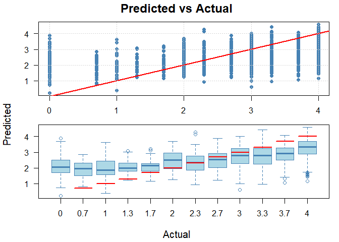<!-- -->


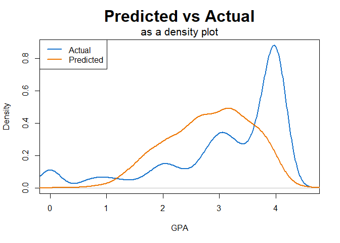<!-- -->


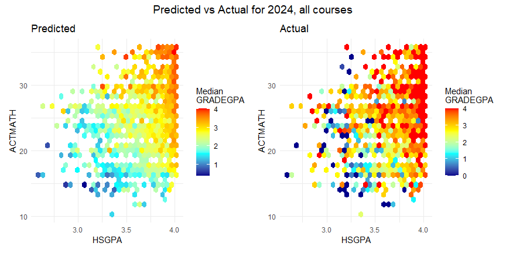<!-- -->


### Illustration of prediction accuracy

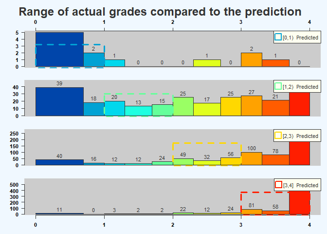<!-- -->

Use some good words here to describe what you are seeing.

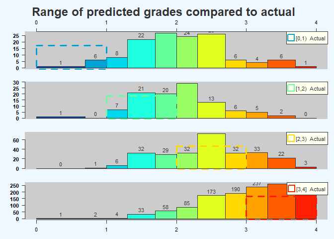<!-- -->

### Selection of binary optimum cutoff or threshold


<!-- -->


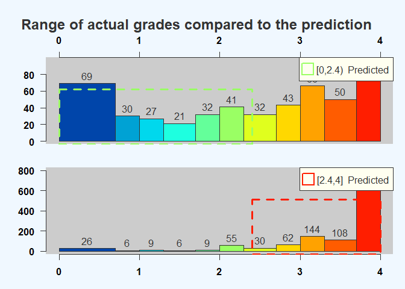<!-- -->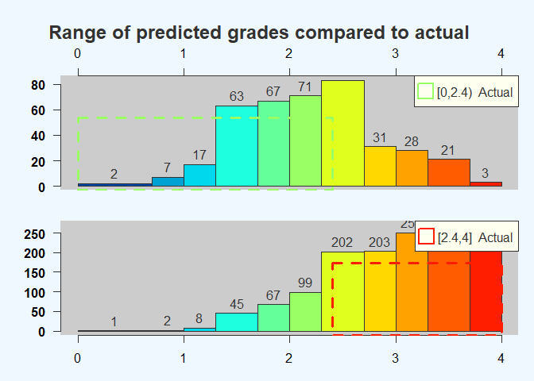<!-- -->


<table class="table table-striped table-hover" style="font-size: 18px; width: auto !important; margin-left: auto; margin-right: auto;">
<caption style="font-size: initial !important;">Predicted vs Actual Grade Categories</caption>
 <thead>
<tr>
<th style="border-bottom:hidden;padding-bottom:0; padding-left:3px;padding-right:3px;text-align: center; font-weight: bold; font-size: 20px;" colspan="1"><div style="border-bottom: 1px solid #ddd; padding-bottom: 5px; ">Predicted Grade</div></th>
<th style="border-bottom:hidden;padding-bottom:0; padding-left:3px;padding-right:3px;text-align: center; font-weight: bold; font-size: 20px;" colspan="2"><div style="border-bottom: 1px solid #ddd; padding-bottom: 5px; ">Actual Grade</div></th>
</tr>
  <tr>
   <th style="text-align:left;font-weight: bold;background-color: rgba(230, 242, 255, 255) !important;font-size: 20px;">   </th>
   <th style="text-align:center;font-weight: bold;background-color: rgba(230, 242, 255, 255) !important;font-size: 20px;"> Actual: Fail (&lt;1.7) </th>
   <th style="text-align:center;font-weight: bold;background-color: rgba(230, 242, 255, 255) !important;font-size: 20px;"> Actual: Pass (≥1.7) </th>
  </tr>
 </thead>
<tbody>
  <tr>
   <td style="text-align:left;"> [0,2.4] </td>
   <td style="text-align:center;"> 147
(8.6%) </td>
   <td style="text-align:center;"> 360
(21.2%) </td>
  </tr>
  <tr>
   <td style="text-align:left;"> (2.4,4] </td>
   <td style="text-align:center;"> 47
(2.8%) </td>
   <td style="text-align:center;"> 1148
(67.5%) </td>
  </tr>
</tbody>
</table>

Students predicted to have a grade less than 2.4 are a high-risk group of students. 29% of these 507 students actually did fail, or 76% of the total of students who failed.  (76% recall and 29% precision).

This compares to the risk of students predicted to have a grade more than 2.4. Only 47 of these 507 students failed, or 4%.


<!-- -->


Examining the precision for predictions of grades <0.9 looks like these few people could be an admissions error, or a very low probability of success for this handful of people. 


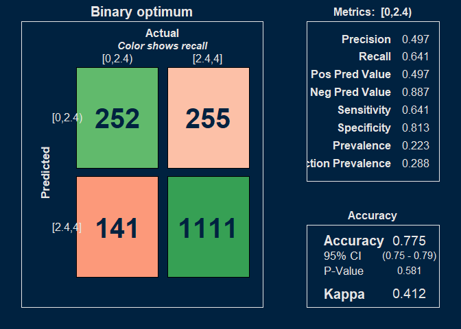<!-- -->


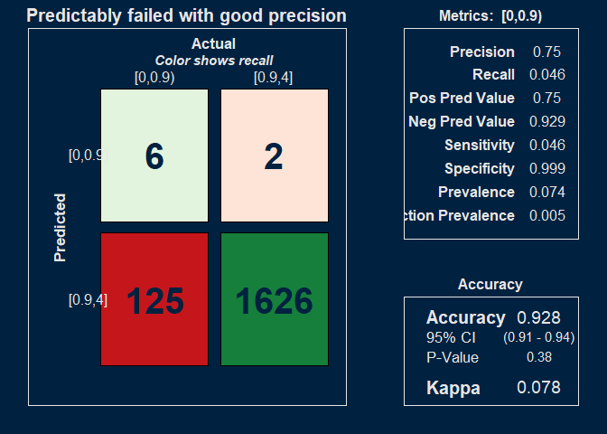<!-- -->


# Variable importance

### Predictors

SPEND SOME MORE TIME TALKING ABOUT THIS.
REMOVE "load" EXPLANATION

course, SEX, FIRST_GEN_STATUS_CD, ETHNICITY, RESSTAT, FA_PELL, APCREDIT, HSGPA, HSPRIVATE, HONORS, ACTCOMP, ACTENGL, ACTMATH, ACTSCI, cohort_year, class_year, yr_diff, season, course_level, age_cut, HSGPA.z, ACTMATH.z, dist. 

"load" is the credit load per student per term. 
"yr_diff" is the time (expressed as fractions of a year) between the cohort date and the end of term date for the course.  

The other variables are either self-explanatory or taken directly from OBIA tables.  


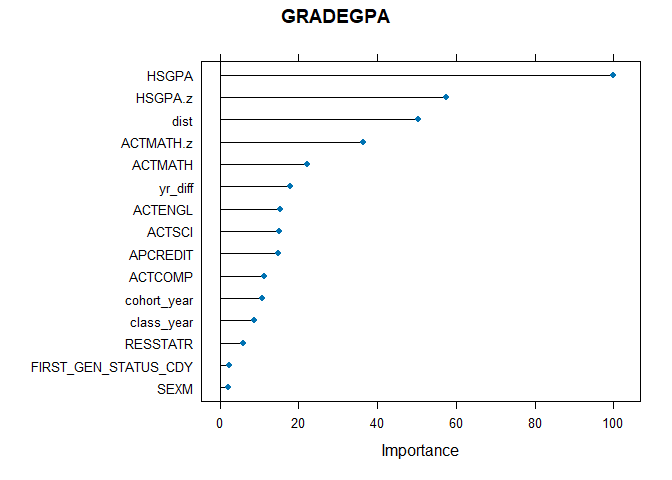<!-- -->


# Relationship between distance to median successful students (as a z-score) and grade


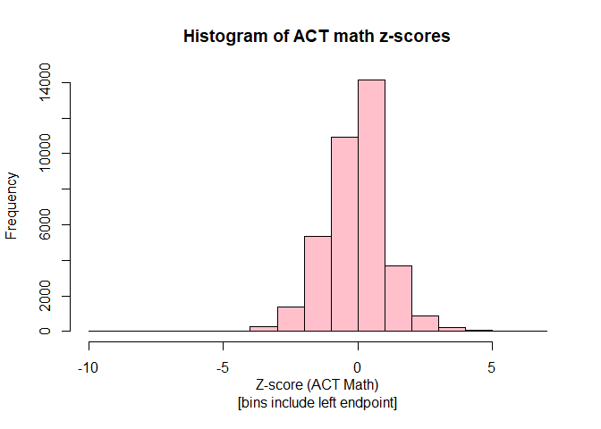<!-- -->


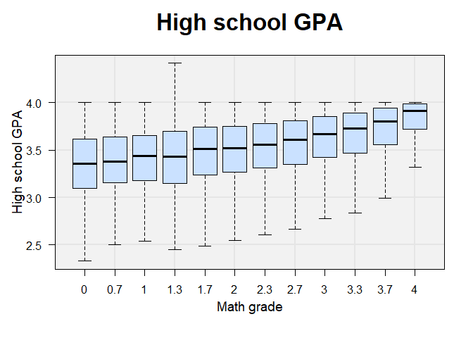<!-- -->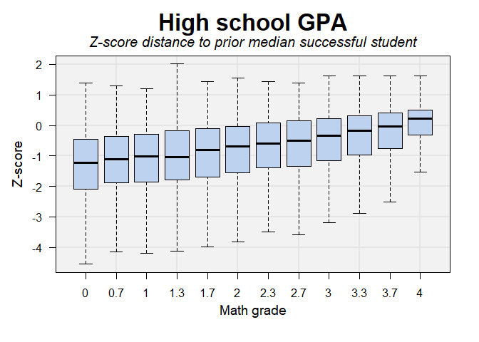<!-- -->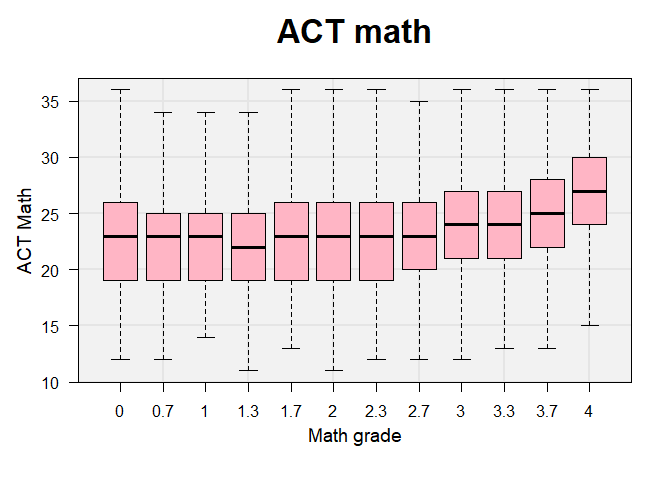<!-- -->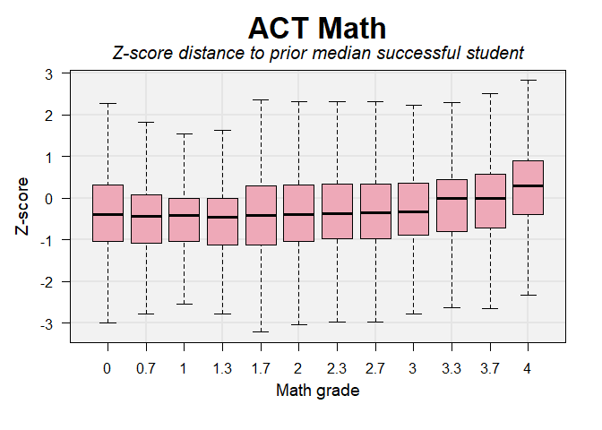<!-- --><!-- -->

not a bad series of boxplots.  Def something happening here

Man I've done so many boxplots -- don't I have a custom function to manage this?  

I should do the incoming plot hex.

Also, the hist is great -- but maybe the density plot? Nah, what I got is fine. 


# Confusion matrix


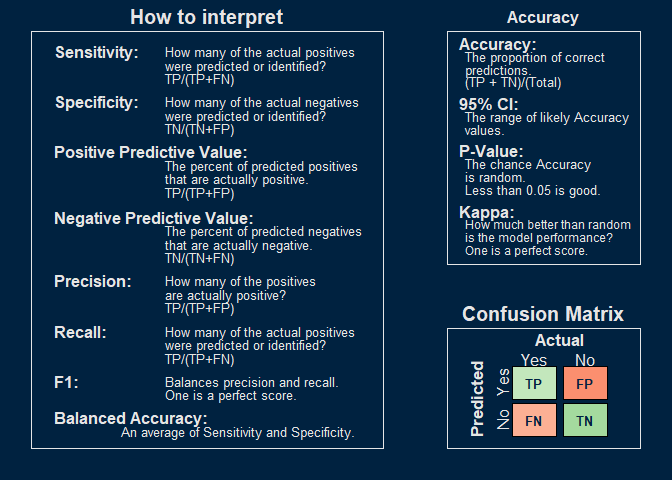<!-- -->


# 

# Training data

Presentation order: 


```
## [1] "GRADEGPA"
```

```
## [[1]]
## ── Data Summary ────────────────────────
##                            Values                      
## Name                       data_list[[x]][["training...
## Number of rows             36924                       
## Number of columns          24                          
## _______________________                                
## Column type frequency:                                 
##   character                5                           
##   factor                   3                           
##   numeric                  16                          
## ________________________                               
## Group variables            None                        
## 
## ── Variable type: character ────────────────────────────────────────────────────
##   skim_variable       n_missing complete_rate min max empty n_unique whitespace
## 1 SEX                         0             1   1   1     0        2          0
## 2 FIRST_GEN_STATUS_CD         0             1   1   1     0        3          0
## 3 RESSTAT                     0             1   1   1     0        2          0
## 4 HSPRIVATE                   0             1   1   1     0        2          0
## 5 season                      0             1   4   6     0        3          0
## 
## ── Variable type: factor ───────────────────────────────────────────────────────
##   skim_variable n_missing complete_rate ordered n_unique
## 1 course                0             1 FALSE         25
## 2 ETHNICITY             0             1 FALSE          9
## 3 age_cut               0             1 FALSE          5
##   top_counts                                 
## 1 MAT: 8834, MAT: 6020, MAT: 4829, MAT: 3293 
## 2 C: 26581, H: 4549, A: 2647, M: 1744        
## 3 (17: 30141, (18: 3150, (19: 1843, (0,: 1494
## 
## ── Variable type: numeric ──────────────────────────────────────────────────────
##    skim_variable n_missing complete_rate     mean     sd       p0      p25
##  1 GRADEGPA              0             1    2.85   1.22     0        2    
##  2 FA_PELL               0             1    0.220  0.414    0        0    
##  3 APCREDIT              0             1    7.25  12.4      0        0    
##  4 HSGPA                 0             1    3.62   0.342    1.07     3.41 
##  5 HONORS                0             1    0.164  0.370    0        0    
##  6 ACTCOMP               0             1   25.0    4.33    11       22    
##  7 ACTENGL               0             1   24.8    5.28     7       21    
##  8 ACTMATH               0             1   24.4    4.59     1       21    
##  9 ACTSCI                0             1   24.9    4.55     2       22    
## 10 cohort_year           0             1 2015.     5.08  2005     2010    
## 11 class_year            0             1 2015.     4.99  2006     2011    
## 12 yr_diff               0             1    0.503  0.795   -0.397    0.241
## 13 course_level          0             1    1.03   0.171    1        1    
## 14 HSGPA.z               0             1   -0.531  1.21   -42.1     -1.16 
## 15 ACTMATH.z             0             1   -0.133  1.12   -10       -0.795
## 16 dist                  0             1    1.41   1.01     0        0.724
##         p50      p75    p100 hist 
##  1    3.3      4        4    ▂▁▂▃▇
##  2    0        0        1    ▇▁▁▁▂
##  3    0       12       85    ▇▁▁▁▁
##  4    3.71     3.91     4.42 ▁▁▁▇▇
##  5    0        0        1    ▇▁▁▁▂
##  6   25       28       36    ▁▅▇▅▂
##  7   24       28       36    ▁▂▇▆▃
##  8   24       27       36    ▁▁▅▇▂
##  9   24       28       36    ▁▁▅▇▂
## 10 2015     2019     2023    ▅▆▅▇▆
## 11 2015     2019     2023    ▆▆▇▇▇
## 12    0.260    0.260   16.6  ▇▁▁▁▁
## 13    1        1        2    ▇▁▁▁▁
## 14   -0.233    0.318    2.01 ▁▁▁▁▇
## 15    0        0.492    6.93 ▁▁▇▅▁
## 16    1.18     1.86    42.1  ▇▁▁▁▁
```

# References

Maybe put this in the source/cleaning data?  Seems like a better place for it


# Old text

  - I'd like to show the essentially precision/recall for all of the grades in my two categories  

