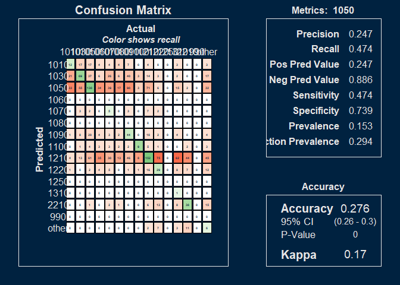

# Results

Develop and report the confusion matrices 


```{=html}
<div class="plotly html-widget html-fill-item" id="htmlwidget-978dc6165712df1ff18e" style="width:672px;height:480px;"></div>
<script type="application/json" data-for="htmlwidget-978dc6165712df1ff18e">{"x":{"visdat":{"59501cc63bab":["function () ","plotlyVisDat"]},"cur_data":"59501cc63bab","attrs":{"59501cc63bab":{"x":[2007,2008,2009,2010,2011,2012,2013,2014,2015,2016,2017,2018,2019,2020,2021,2022,2023,2024,2025],"y":[0.35699999999999998,0.39300000000000002,0.35299999999999998,0.35899999999999999,0.21299999999999999,0.17100000000000001,0.34499999999999997,0.34499999999999997,0.34399999999999997,0.375,0.34999999999999998,0.27300000000000002,0.25700000000000001,0.27500000000000002,0.19400000000000001,0.17399999999999999,0.13600000000000001,0.17000000000000001,0.13900000000000001],"mode":"lines+markers","line":{"color":"firebrick","width":2},"marker":{"color":"firebrick","size":8},"alpha_stroke":1,"sizes":[10,100],"spans":[1,20],"type":"scatter"}},"layout":{"margin":{"b":40,"l":60,"t":25,"r":10},"title":"Model Performance (Kappa) Over Time","xaxis":{"domain":[0,1],"automargin":true,"title":"","dtick":1,"tickangle":-45},"yaxis":{"domain":[0,1],"automargin":true,"title":"Kappa"},"hovermode":"closest","showlegend":false},"source":"A","config":{"modeBarButtonsToAdd":["hoverclosest","hovercompare"],"showSendToCloud":false},"data":[{"x":[2007,2008,2009,2010,2011,2012,2013,2014,2015,2016,2017,2018,2019,2020,2021,2022,2023,2024,2025],"y":[0.35699999999999998,0.39300000000000002,0.35299999999999998,0.35899999999999999,0.21299999999999999,0.17100000000000001,0.34499999999999997,0.34499999999999997,0.34399999999999997,0.375,0.34999999999999998,0.27300000000000002,0.25700000000000001,0.27500000000000002,0.19400000000000001,0.17399999999999999,0.13600000000000001,0.17000000000000001,0.13900000000000001],"mode":"lines+markers","line":{"color":"firebrick","width":2},"marker":{"color":"firebrick","size":8,"line":{"color":"rgba(31,119,180,1)"}},"type":"scatter","error_y":{"color":"rgba(31,119,180,1)"},"error_x":{"color":"rgba(31,119,180,1)"},"xaxis":"x","yaxis":"y","frame":null}],"highlight":{"on":"plotly_click","persistent":false,"dynamic":false,"selectize":false,"opacityDim":0.20000000000000001,"selected":{"opacity":1},"debounce":0},"shinyEvents":["plotly_hover","plotly_click","plotly_selected","plotly_relayout","plotly_brushed","plotly_brushing","plotly_clickannotation","plotly_doubleclick","plotly_deselect","plotly_afterplot","plotly_sunburstclick"],"base_url":"https://plot.ly"},"evals":[],"jsHooks":[]}</script>
```


```{=html}
<div class="plotly html-widget html-fill-item" id="htmlwidget-f8ddb9e7a935ae979b4f" style="width:672px;height:480px;"></div>
<script type="application/json" data-for="htmlwidget-f8ddb9e7a935ae979b4f">{"x":{"visdat":{"59501fcb3c2e":["function () ","plotlyVisDat"]},"cur_data":"59501fcb3c2e","attrs":{"59501fcb3c2e":{"alpha_stroke":1,"sizes":[10,100],"spans":[1,20],"x":[2007,2008,2009,2010,2011,2012,2013,2014,2015,2016,2017,2018,2019,2020,2021,2022,2023,2024,2025],"y":[100,100,100,100,100,100,100,100,100,100,100,100,100,100,100,100,100,100,100],"type":"scatter","mode":"lines","name":"ACTMATH","hovertemplate":"<b>ACTMATH<\/b><br>Year: %{x}<br>Importance: %{y:.2f}<br><extra><\/extra>","inherit":true},"59501fcb3c2e.1":{"alpha_stroke":1,"sizes":[10,100],"spans":[1,20],"x":[2007,2008,2009,2010,2011,2012,2013,2014,2015,2016,2017,2018,2019,2020,2021,2022,2023,2024,2025],"y":[22.645572971300172,10.839116797313308,7.0990220274431843,8.0751793793170901,8.4727743755789167,11.82792052085655,10.872849617287617,9.3958429600726276,8.4607669872635647,17.184243794808619,14.237571589920767,13.255621037460411,12.913169160340765,13.361692092435277,12.034310759616284,12.421520151818408,17.693616121934422,12.641143705592601,18.50251109948174],"type":"scatter","mode":"lines","name":"HSGPA","hovertemplate":"<b>HSGPA<\/b><br>Year: %{x}<br>Importance: %{y:.2f}<br><extra><\/extra>","inherit":true},"59501fcb3c2e.2":{"alpha_stroke":1,"sizes":[10,100],"spans":[1,20],"x":[2007,2008,2009,2010,2011,2012,2013,2014,2015,2016,2017,2018,2019,2020,2021,2022,2023,2024,2025],"y":[18.033100620687424,13.362220324543481,5.2482966174902455,8.9048911815388578,14.924162007064051,12.091483147013664,10.135891055876382,9.0923496431386717,11.801266686654662,22.494201270479351,9.4168269573825523,10.462098191402369,11.211688090363268,15.79407013676539,9.7853668406809078,9.7507066160705804,11.865487140094137,9.6881099203346679,13.458851731181525],"type":"scatter","mode":"lines","name":"ACTCOMP","hovertemplate":"<b>ACTCOMP<\/b><br>Year: %{x}<br>Importance: %{y:.2f}<br><extra><\/extra>","inherit":true},"59501fcb3c2e.3":{"alpha_stroke":1,"sizes":[10,100],"spans":[1,20],"x":[2007,2008,2009,2010,2011,2012,2013,2014,2015,2016,2017,2018,2019,2020,2021,2022,2023,2024,2025],"y":[16.619998774012185,11.910220856217819,9.2706894553161217,null,null,null,null,null,14.124946978539269,18.155707722448444,16.432303833567154,16.695104714533468,16.490731266951713,16.566968723532458,16.901422403228104,18.078563126739123,20.65541543256089,20.083813114677373,22.657553556054491],"type":"scatter","mode":"lines","name":"APCREDIT","hovertemplate":"<b>APCREDIT<\/b><br>Year: %{x}<br>Importance: %{y:.2f}<br><extra><\/extra>","inherit":true},"59501fcb3c2e.4":{"alpha_stroke":1,"sizes":[10,100],"spans":[1,20],"x":[2007,2008,2009,2010,2011,2012,2013,2014,2015,2016,2017,2018,2019,2020,2021,2022,2023,2024,2025],"y":[12.412742962102975,4.499185523153006,2.6723765632130152,2.960787461424716,4.012449754945056,4.8190571494120853,4.322288442663254,3.4387373787864468,3.9135038653413932,8.464144050119474,7.4104825519709943,6.5584137214556266,6.1742204111240628,6.4843393526606636,7.3277345195737311,5.5472767650370383,8.5548739525101904,6.146807713754141,8.0839720107365345],"type":"scatter","mode":"lines","name":"ACTSCI","hovertemplate":"<b>ACTSCI<\/b><br>Year: %{x}<br>Importance: %{y:.2f}<br><extra><\/extra>","inherit":true},"59501fcb3c2e.5":{"alpha_stroke":1,"sizes":[10,100],"spans":[1,20],"x":[2007,2008,2009,2010,2011,2012,2013,2014,2015,2016,2017,2018,2019,2020,2021,2022,2023,2024,2025],"y":[10.378972469988325,5.3211619930965011,3.5282648777222487,3.2309199690985322,3.0365046673001928,4.1751025069733831,3.8162189476028106,3.3455825854615338,2.9062630540192971,8.3006934889899977,6.8947990730940809,6.4270942211835989,6.1073527228076019,6.2482758038745541,5.4969860425149335,6.519300892160107,7.7823823535277334,5.2226849648971898,7.744661979280969],"type":"scatter","mode":"lines","name":"ACTENGL","hovertemplate":"<b>ACTENGL<\/b><br>Year: %{x}<br>Importance: %{y:.2f}<br><extra><\/extra>","inherit":true},"59501fcb3c2e.6":{"alpha_stroke":1,"sizes":[10,100],"spans":[1,20],"x":[2007,2008,2009,2010,2011,2012,2013,2014,2015,2016,2017,2018,2019,2020,2021,2022,2023,2024,2025],"y":[3.9768196817505532,5.205042141769824,4.5699364674856042,5.1562645592271004,4.7112768316969253,5.4467778187867379,7.0792299318654699,5.3620434641905561,5.8006457544841483,11.830734759955734,10.652102918561065,10.491228158030772,10.773160376060266,12.011849715267896,11.251017367384566,10.898440754769933,14.038390508764472,11.966100691324794,15.084630383037629],"type":"scatter","mode":"lines","name":"yr_diff","hovertemplate":"<b>yr_diff<\/b><br>Year: %{x}<br>Importance: %{y:.2f}<br><extra><\/extra>","inherit":true},"59501fcb3c2e.7":{"alpha_stroke":1,"sizes":[10,100],"spans":[1,20],"x":[2007,2008,2009,2010,2011,2012,2013,2014,2015,2016,2017,2018,2019,2020,2021,2022,2023,2024,2025],"y":[0.73065407130311311,1.803791752655362,2.5534069749614496,4.9834339896431965,6.4910039436127924,12.140610700339957,13.118872560106043,13.720778119986605,15.402363334637664,16.889340536942107,13.835914449825621,14.34026650751194,14.586664456695104,15.272307038840104,16.262314220189648,16.650493128395151,18.858529126246989,20.39449945669298,23.55349696979928],"type":"scatter","mode":"lines","name":"class_year","hovertemplate":"<b>class_year<\/b><br>Year: %{x}<br>Importance: %{y:.2f}<br><extra><\/extra>","inherit":true},"59501fcb3c2e.8":{"alpha_stroke":1,"sizes":[10,100],"spans":[1,20],"x":[2007,2008,2009,2010,2011,2012,2013,2014,2015,2016,2017,2018,2019,2020,2021,2022,2023,2024,2025],"y":[0.67257325903750309,3.7534221524179427,2.8512958628624294,4.2816799515026442,4.6907328293696064,15.124254503596276,13.932711177619476,14.695153660939924,14.981042323589142,18.038304221190309,16.416759409617825,17.26147348652146,17.358679203783669,17.84221137038357,15.059536955607827,17.432284102787072,20.731497926710855,19.6298364902343,22.514947020724659],"type":"scatter","mode":"lines","name":"cohort_year","hovertemplate":"<b>cohort_year<\/b><br>Year: %{x}<br>Importance: %{y:.2f}<br><extra><\/extra>","inherit":true}},"layout":{"margin":{"b":40,"l":60,"t":25,"r":10},"title":"Variable Importance Over Time (all variables)","xaxis":{"domain":[0,1],"automargin":true,"title":"Test Year"},"yaxis":{"domain":[0,1],"automargin":true,"title":"Variable Importance"},"hovermode":"closest","legend":{"title":{"text":"Variable"}},"showlegend":true},"source":"A","config":{"modeBarButtonsToAdd":["hoverclosest","hovercompare"],"showSendToCloud":false},"data":[{"x":[2007,2008,2009,2010,2011,2012,2013,2014,2015,2016,2017,2018,2019,2020,2021,2022,2023,2024,2025],"y":[100,100,100,100,100,100,100,100,100,100,100,100,100,100,100,100,100,100,100],"type":"scatter","mode":"lines","name":"ACTMATH","hovertemplate":["<b>ACTMATH<\/b><br>Year: %{x}<br>Importance: %{y:.2f}<br><extra><\/extra>","<b>ACTMATH<\/b><br>Year: %{x}<br>Importance: %{y:.2f}<br><extra><\/extra>","<b>ACTMATH<\/b><br>Year: %{x}<br>Importance: %{y:.2f}<br><extra><\/extra>","<b>ACTMATH<\/b><br>Year: %{x}<br>Importance: %{y:.2f}<br><extra><\/extra>","<b>ACTMATH<\/b><br>Year: %{x}<br>Importance: %{y:.2f}<br><extra><\/extra>","<b>ACTMATH<\/b><br>Year: %{x}<br>Importance: %{y:.2f}<br><extra><\/extra>","<b>ACTMATH<\/b><br>Year: %{x}<br>Importance: %{y:.2f}<br><extra><\/extra>","<b>ACTMATH<\/b><br>Year: %{x}<br>Importance: %{y:.2f}<br><extra><\/extra>","<b>ACTMATH<\/b><br>Year: %{x}<br>Importance: %{y:.2f}<br><extra><\/extra>","<b>ACTMATH<\/b><br>Year: %{x}<br>Importance: %{y:.2f}<br><extra><\/extra>","<b>ACTMATH<\/b><br>Year: %{x}<br>Importance: %{y:.2f}<br><extra><\/extra>","<b>ACTMATH<\/b><br>Year: %{x}<br>Importance: %{y:.2f}<br><extra><\/extra>","<b>ACTMATH<\/b><br>Year: %{x}<br>Importance: %{y:.2f}<br><extra><\/extra>","<b>ACTMATH<\/b><br>Year: %{x}<br>Importance: %{y:.2f}<br><extra><\/extra>","<b>ACTMATH<\/b><br>Year: %{x}<br>Importance: %{y:.2f}<br><extra><\/extra>","<b>ACTMATH<\/b><br>Year: %{x}<br>Importance: %{y:.2f}<br><extra><\/extra>","<b>ACTMATH<\/b><br>Year: %{x}<br>Importance: %{y:.2f}<br><extra><\/extra>","<b>ACTMATH<\/b><br>Year: %{x}<br>Importance: %{y:.2f}<br><extra><\/extra>","<b>ACTMATH<\/b><br>Year: %{x}<br>Importance: %{y:.2f}<br><extra><\/extra>"],"marker":{"color":"rgba(31,119,180,1)","line":{"color":"rgba(31,119,180,1)"}},"error_y":{"color":"rgba(31,119,180,1)"},"error_x":{"color":"rgba(31,119,180,1)"},"line":{"color":"rgba(31,119,180,1)"},"xaxis":"x","yaxis":"y","frame":null},{"x":[2007,2008,2009,2010,2011,2012,2013,2014,2015,2016,2017,2018,2019,2020,2021,2022,2023,2024,2025],"y":[22.645572971300172,10.839116797313308,7.0990220274431843,8.0751793793170901,8.4727743755789167,11.82792052085655,10.872849617287617,9.3958429600726276,8.4607669872635647,17.184243794808619,14.237571589920767,13.255621037460411,12.913169160340765,13.361692092435277,12.034310759616284,12.421520151818408,17.693616121934422,12.641143705592601,18.50251109948174],"type":"scatter","mode":"lines","name":"HSGPA","hovertemplate":["<b>HSGPA<\/b><br>Year: %{x}<br>Importance: %{y:.2f}<br><extra><\/extra>","<b>HSGPA<\/b><br>Year: %{x}<br>Importance: %{y:.2f}<br><extra><\/extra>","<b>HSGPA<\/b><br>Year: %{x}<br>Importance: %{y:.2f}<br><extra><\/extra>","<b>HSGPA<\/b><br>Year: %{x}<br>Importance: %{y:.2f}<br><extra><\/extra>","<b>HSGPA<\/b><br>Year: %{x}<br>Importance: %{y:.2f}<br><extra><\/extra>","<b>HSGPA<\/b><br>Year: %{x}<br>Importance: %{y:.2f}<br><extra><\/extra>","<b>HSGPA<\/b><br>Year: %{x}<br>Importance: %{y:.2f}<br><extra><\/extra>","<b>HSGPA<\/b><br>Year: %{x}<br>Importance: %{y:.2f}<br><extra><\/extra>","<b>HSGPA<\/b><br>Year: %{x}<br>Importance: %{y:.2f}<br><extra><\/extra>","<b>HSGPA<\/b><br>Year: %{x}<br>Importance: %{y:.2f}<br><extra><\/extra>","<b>HSGPA<\/b><br>Year: %{x}<br>Importance: %{y:.2f}<br><extra><\/extra>","<b>HSGPA<\/b><br>Year: %{x}<br>Importance: %{y:.2f}<br><extra><\/extra>","<b>HSGPA<\/b><br>Year: %{x}<br>Importance: %{y:.2f}<br><extra><\/extra>","<b>HSGPA<\/b><br>Year: %{x}<br>Importance: %{y:.2f}<br><extra><\/extra>","<b>HSGPA<\/b><br>Year: %{x}<br>Importance: %{y:.2f}<br><extra><\/extra>","<b>HSGPA<\/b><br>Year: %{x}<br>Importance: %{y:.2f}<br><extra><\/extra>","<b>HSGPA<\/b><br>Year: %{x}<br>Importance: %{y:.2f}<br><extra><\/extra>","<b>HSGPA<\/b><br>Year: %{x}<br>Importance: %{y:.2f}<br><extra><\/extra>","<b>HSGPA<\/b><br>Year: %{x}<br>Importance: %{y:.2f}<br><extra><\/extra>"],"marker":{"color":"rgba(255,127,14,1)","line":{"color":"rgba(255,127,14,1)"}},"error_y":{"color":"rgba(255,127,14,1)"},"error_x":{"color":"rgba(255,127,14,1)"},"line":{"color":"rgba(255,127,14,1)"},"xaxis":"x","yaxis":"y","frame":null},{"x":[2007,2008,2009,2010,2011,2012,2013,2014,2015,2016,2017,2018,2019,2020,2021,2022,2023,2024,2025],"y":[18.033100620687424,13.362220324543481,5.2482966174902455,8.9048911815388578,14.924162007064051,12.091483147013664,10.135891055876382,9.0923496431386717,11.801266686654662,22.494201270479351,9.4168269573825523,10.462098191402369,11.211688090363268,15.79407013676539,9.7853668406809078,9.7507066160705804,11.865487140094137,9.6881099203346679,13.458851731181525],"type":"scatter","mode":"lines","name":"ACTCOMP","hovertemplate":["<b>ACTCOMP<\/b><br>Year: %{x}<br>Importance: %{y:.2f}<br><extra><\/extra>","<b>ACTCOMP<\/b><br>Year: %{x}<br>Importance: %{y:.2f}<br><extra><\/extra>","<b>ACTCOMP<\/b><br>Year: %{x}<br>Importance: %{y:.2f}<br><extra><\/extra>","<b>ACTCOMP<\/b><br>Year: %{x}<br>Importance: %{y:.2f}<br><extra><\/extra>","<b>ACTCOMP<\/b><br>Year: %{x}<br>Importance: %{y:.2f}<br><extra><\/extra>","<b>ACTCOMP<\/b><br>Year: %{x}<br>Importance: %{y:.2f}<br><extra><\/extra>","<b>ACTCOMP<\/b><br>Year: %{x}<br>Importance: %{y:.2f}<br><extra><\/extra>","<b>ACTCOMP<\/b><br>Year: %{x}<br>Importance: %{y:.2f}<br><extra><\/extra>","<b>ACTCOMP<\/b><br>Year: %{x}<br>Importance: %{y:.2f}<br><extra><\/extra>","<b>ACTCOMP<\/b><br>Year: %{x}<br>Importance: %{y:.2f}<br><extra><\/extra>","<b>ACTCOMP<\/b><br>Year: %{x}<br>Importance: %{y:.2f}<br><extra><\/extra>","<b>ACTCOMP<\/b><br>Year: %{x}<br>Importance: %{y:.2f}<br><extra><\/extra>","<b>ACTCOMP<\/b><br>Year: %{x}<br>Importance: %{y:.2f}<br><extra><\/extra>","<b>ACTCOMP<\/b><br>Year: %{x}<br>Importance: %{y:.2f}<br><extra><\/extra>","<b>ACTCOMP<\/b><br>Year: %{x}<br>Importance: %{y:.2f}<br><extra><\/extra>","<b>ACTCOMP<\/b><br>Year: %{x}<br>Importance: %{y:.2f}<br><extra><\/extra>","<b>ACTCOMP<\/b><br>Year: %{x}<br>Importance: %{y:.2f}<br><extra><\/extra>","<b>ACTCOMP<\/b><br>Year: %{x}<br>Importance: %{y:.2f}<br><extra><\/extra>","<b>ACTCOMP<\/b><br>Year: %{x}<br>Importance: %{y:.2f}<br><extra><\/extra>"],"marker":{"color":"rgba(44,160,44,1)","line":{"color":"rgba(44,160,44,1)"}},"error_y":{"color":"rgba(44,160,44,1)"},"error_x":{"color":"rgba(44,160,44,1)"},"line":{"color":"rgba(44,160,44,1)"},"xaxis":"x","yaxis":"y","frame":null},{"x":[2007,2008,2009,null,2015,2016,2017,2018,2019,2020,2021,2022,2023,2024,2025],"y":[16.619998774012185,11.910220856217819,9.2706894553161217,null,14.124946978539269,18.155707722448444,16.432303833567154,16.695104714533468,16.490731266951713,16.566968723532458,16.901422403228104,18.078563126739123,20.65541543256089,20.083813114677373,22.657553556054491],"type":"scatter","mode":"lines","name":"APCREDIT","hovertemplate":["<b>APCREDIT<\/b><br>Year: %{x}<br>Importance: %{y:.2f}<br><extra><\/extra>","<b>APCREDIT<\/b><br>Year: %{x}<br>Importance: %{y:.2f}<br><extra><\/extra>","<b>APCREDIT<\/b><br>Year: %{x}<br>Importance: %{y:.2f}<br><extra><\/extra>",null,"<b>APCREDIT<\/b><br>Year: %{x}<br>Importance: %{y:.2f}<br><extra><\/extra>","<b>APCREDIT<\/b><br>Year: %{x}<br>Importance: %{y:.2f}<br><extra><\/extra>","<b>APCREDIT<\/b><br>Year: %{x}<br>Importance: %{y:.2f}<br><extra><\/extra>","<b>APCREDIT<\/b><br>Year: %{x}<br>Importance: %{y:.2f}<br><extra><\/extra>","<b>APCREDIT<\/b><br>Year: %{x}<br>Importance: %{y:.2f}<br><extra><\/extra>","<b>APCREDIT<\/b><br>Year: %{x}<br>Importance: %{y:.2f}<br><extra><\/extra>","<b>APCREDIT<\/b><br>Year: %{x}<br>Importance: %{y:.2f}<br><extra><\/extra>","<b>APCREDIT<\/b><br>Year: %{x}<br>Importance: %{y:.2f}<br><extra><\/extra>","<b>APCREDIT<\/b><br>Year: %{x}<br>Importance: %{y:.2f}<br><extra><\/extra>","<b>APCREDIT<\/b><br>Year: %{x}<br>Importance: %{y:.2f}<br><extra><\/extra>","<b>APCREDIT<\/b><br>Year: %{x}<br>Importance: %{y:.2f}<br><extra><\/extra>"],"marker":{"color":"rgba(214,39,40,1)","line":{"color":"rgba(214,39,40,1)"}},"error_y":{"color":"rgba(214,39,40,1)"},"error_x":{"color":"rgba(214,39,40,1)"},"line":{"color":"rgba(214,39,40,1)"},"xaxis":"x","yaxis":"y","frame":null},{"x":[2007,2008,2009,2010,2011,2012,2013,2014,2015,2016,2017,2018,2019,2020,2021,2022,2023,2024,2025],"y":[12.412742962102975,4.499185523153006,2.6723765632130152,2.960787461424716,4.012449754945056,4.8190571494120853,4.322288442663254,3.4387373787864468,3.9135038653413932,8.464144050119474,7.4104825519709943,6.5584137214556266,6.1742204111240628,6.4843393526606636,7.3277345195737311,5.5472767650370383,8.5548739525101904,6.146807713754141,8.0839720107365345],"type":"scatter","mode":"lines","name":"ACTSCI","hovertemplate":["<b>ACTSCI<\/b><br>Year: %{x}<br>Importance: %{y:.2f}<br><extra><\/extra>","<b>ACTSCI<\/b><br>Year: %{x}<br>Importance: %{y:.2f}<br><extra><\/extra>","<b>ACTSCI<\/b><br>Year: %{x}<br>Importance: %{y:.2f}<br><extra><\/extra>","<b>ACTSCI<\/b><br>Year: %{x}<br>Importance: %{y:.2f}<br><extra><\/extra>","<b>ACTSCI<\/b><br>Year: %{x}<br>Importance: %{y:.2f}<br><extra><\/extra>","<b>ACTSCI<\/b><br>Year: %{x}<br>Importance: %{y:.2f}<br><extra><\/extra>","<b>ACTSCI<\/b><br>Year: %{x}<br>Importance: %{y:.2f}<br><extra><\/extra>","<b>ACTSCI<\/b><br>Year: %{x}<br>Importance: %{y:.2f}<br><extra><\/extra>","<b>ACTSCI<\/b><br>Year: %{x}<br>Importance: %{y:.2f}<br><extra><\/extra>","<b>ACTSCI<\/b><br>Year: %{x}<br>Importance: %{y:.2f}<br><extra><\/extra>","<b>ACTSCI<\/b><br>Year: %{x}<br>Importance: %{y:.2f}<br><extra><\/extra>","<b>ACTSCI<\/b><br>Year: %{x}<br>Importance: %{y:.2f}<br><extra><\/extra>","<b>ACTSCI<\/b><br>Year: %{x}<br>Importance: %{y:.2f}<br><extra><\/extra>","<b>ACTSCI<\/b><br>Year: %{x}<br>Importance: %{y:.2f}<br><extra><\/extra>","<b>ACTSCI<\/b><br>Year: %{x}<br>Importance: %{y:.2f}<br><extra><\/extra>","<b>ACTSCI<\/b><br>Year: %{x}<br>Importance: %{y:.2f}<br><extra><\/extra>","<b>ACTSCI<\/b><br>Year: %{x}<br>Importance: %{y:.2f}<br><extra><\/extra>","<b>ACTSCI<\/b><br>Year: %{x}<br>Importance: %{y:.2f}<br><extra><\/extra>","<b>ACTSCI<\/b><br>Year: %{x}<br>Importance: %{y:.2f}<br><extra><\/extra>"],"marker":{"color":"rgba(148,103,189,1)","line":{"color":"rgba(148,103,189,1)"}},"error_y":{"color":"rgba(148,103,189,1)"},"error_x":{"color":"rgba(148,103,189,1)"},"line":{"color":"rgba(148,103,189,1)"},"xaxis":"x","yaxis":"y","frame":null},{"x":[2007,2008,2009,2010,2011,2012,2013,2014,2015,2016,2017,2018,2019,2020,2021,2022,2023,2024,2025],"y":[10.378972469988325,5.3211619930965011,3.5282648777222487,3.2309199690985322,3.0365046673001928,4.1751025069733831,3.8162189476028106,3.3455825854615338,2.9062630540192971,8.3006934889899977,6.8947990730940809,6.4270942211835989,6.1073527228076019,6.2482758038745541,5.4969860425149335,6.519300892160107,7.7823823535277334,5.2226849648971898,7.744661979280969],"type":"scatter","mode":"lines","name":"ACTENGL","hovertemplate":["<b>ACTENGL<\/b><br>Year: %{x}<br>Importance: %{y:.2f}<br><extra><\/extra>","<b>ACTENGL<\/b><br>Year: %{x}<br>Importance: %{y:.2f}<br><extra><\/extra>","<b>ACTENGL<\/b><br>Year: %{x}<br>Importance: %{y:.2f}<br><extra><\/extra>","<b>ACTENGL<\/b><br>Year: %{x}<br>Importance: %{y:.2f}<br><extra><\/extra>","<b>ACTENGL<\/b><br>Year: %{x}<br>Importance: %{y:.2f}<br><extra><\/extra>","<b>ACTENGL<\/b><br>Year: %{x}<br>Importance: %{y:.2f}<br><extra><\/extra>","<b>ACTENGL<\/b><br>Year: %{x}<br>Importance: %{y:.2f}<br><extra><\/extra>","<b>ACTENGL<\/b><br>Year: %{x}<br>Importance: %{y:.2f}<br><extra><\/extra>","<b>ACTENGL<\/b><br>Year: %{x}<br>Importance: %{y:.2f}<br><extra><\/extra>","<b>ACTENGL<\/b><br>Year: %{x}<br>Importance: %{y:.2f}<br><extra><\/extra>","<b>ACTENGL<\/b><br>Year: %{x}<br>Importance: %{y:.2f}<br><extra><\/extra>","<b>ACTENGL<\/b><br>Year: %{x}<br>Importance: %{y:.2f}<br><extra><\/extra>","<b>ACTENGL<\/b><br>Year: %{x}<br>Importance: %{y:.2f}<br><extra><\/extra>","<b>ACTENGL<\/b><br>Year: %{x}<br>Importance: %{y:.2f}<br><extra><\/extra>","<b>ACTENGL<\/b><br>Year: %{x}<br>Importance: %{y:.2f}<br><extra><\/extra>","<b>ACTENGL<\/b><br>Year: %{x}<br>Importance: %{y:.2f}<br><extra><\/extra>","<b>ACTENGL<\/b><br>Year: %{x}<br>Importance: %{y:.2f}<br><extra><\/extra>","<b>ACTENGL<\/b><br>Year: %{x}<br>Importance: %{y:.2f}<br><extra><\/extra>","<b>ACTENGL<\/b><br>Year: %{x}<br>Importance: %{y:.2f}<br><extra><\/extra>"],"marker":{"color":"rgba(140,86,75,1)","line":{"color":"rgba(140,86,75,1)"}},"error_y":{"color":"rgba(140,86,75,1)"},"error_x":{"color":"rgba(140,86,75,1)"},"line":{"color":"rgba(140,86,75,1)"},"xaxis":"x","yaxis":"y","frame":null},{"x":[2007,2008,2009,2010,2011,2012,2013,2014,2015,2016,2017,2018,2019,2020,2021,2022,2023,2024,2025],"y":[3.9768196817505532,5.205042141769824,4.5699364674856042,5.1562645592271004,4.7112768316969253,5.4467778187867379,7.0792299318654699,5.3620434641905561,5.8006457544841483,11.830734759955734,10.652102918561065,10.491228158030772,10.773160376060266,12.011849715267896,11.251017367384566,10.898440754769933,14.038390508764472,11.966100691324794,15.084630383037629],"type":"scatter","mode":"lines","name":"yr_diff","hovertemplate":["<b>yr_diff<\/b><br>Year: %{x}<br>Importance: %{y:.2f}<br><extra><\/extra>","<b>yr_diff<\/b><br>Year: %{x}<br>Importance: %{y:.2f}<br><extra><\/extra>","<b>yr_diff<\/b><br>Year: %{x}<br>Importance: %{y:.2f}<br><extra><\/extra>","<b>yr_diff<\/b><br>Year: %{x}<br>Importance: %{y:.2f}<br><extra><\/extra>","<b>yr_diff<\/b><br>Year: %{x}<br>Importance: %{y:.2f}<br><extra><\/extra>","<b>yr_diff<\/b><br>Year: %{x}<br>Importance: %{y:.2f}<br><extra><\/extra>","<b>yr_diff<\/b><br>Year: %{x}<br>Importance: %{y:.2f}<br><extra><\/extra>","<b>yr_diff<\/b><br>Year: %{x}<br>Importance: %{y:.2f}<br><extra><\/extra>","<b>yr_diff<\/b><br>Year: %{x}<br>Importance: %{y:.2f}<br><extra><\/extra>","<b>yr_diff<\/b><br>Year: %{x}<br>Importance: %{y:.2f}<br><extra><\/extra>","<b>yr_diff<\/b><br>Year: %{x}<br>Importance: %{y:.2f}<br><extra><\/extra>","<b>yr_diff<\/b><br>Year: %{x}<br>Importance: %{y:.2f}<br><extra><\/extra>","<b>yr_diff<\/b><br>Year: %{x}<br>Importance: %{y:.2f}<br><extra><\/extra>","<b>yr_diff<\/b><br>Year: %{x}<br>Importance: %{y:.2f}<br><extra><\/extra>","<b>yr_diff<\/b><br>Year: %{x}<br>Importance: %{y:.2f}<br><extra><\/extra>","<b>yr_diff<\/b><br>Year: %{x}<br>Importance: %{y:.2f}<br><extra><\/extra>","<b>yr_diff<\/b><br>Year: %{x}<br>Importance: %{y:.2f}<br><extra><\/extra>","<b>yr_diff<\/b><br>Year: %{x}<br>Importance: %{y:.2f}<br><extra><\/extra>","<b>yr_diff<\/b><br>Year: %{x}<br>Importance: %{y:.2f}<br><extra><\/extra>"],"marker":{"color":"rgba(227,119,194,1)","line":{"color":"rgba(227,119,194,1)"}},"error_y":{"color":"rgba(227,119,194,1)"},"error_x":{"color":"rgba(227,119,194,1)"},"line":{"color":"rgba(227,119,194,1)"},"xaxis":"x","yaxis":"y","frame":null},{"x":[2007,2008,2009,2010,2011,2012,2013,2014,2015,2016,2017,2018,2019,2020,2021,2022,2023,2024,2025],"y":[0.73065407130311311,1.803791752655362,2.5534069749614496,4.9834339896431965,6.4910039436127924,12.140610700339957,13.118872560106043,13.720778119986605,15.402363334637664,16.889340536942107,13.835914449825621,14.34026650751194,14.586664456695104,15.272307038840104,16.262314220189648,16.650493128395151,18.858529126246989,20.39449945669298,23.55349696979928],"type":"scatter","mode":"lines","name":"class_year","hovertemplate":["<b>class_year<\/b><br>Year: %{x}<br>Importance: %{y:.2f}<br><extra><\/extra>","<b>class_year<\/b><br>Year: %{x}<br>Importance: %{y:.2f}<br><extra><\/extra>","<b>class_year<\/b><br>Year: %{x}<br>Importance: %{y:.2f}<br><extra><\/extra>","<b>class_year<\/b><br>Year: %{x}<br>Importance: %{y:.2f}<br><extra><\/extra>","<b>class_year<\/b><br>Year: %{x}<br>Importance: %{y:.2f}<br><extra><\/extra>","<b>class_year<\/b><br>Year: %{x}<br>Importance: %{y:.2f}<br><extra><\/extra>","<b>class_year<\/b><br>Year: %{x}<br>Importance: %{y:.2f}<br><extra><\/extra>","<b>class_year<\/b><br>Year: %{x}<br>Importance: %{y:.2f}<br><extra><\/extra>","<b>class_year<\/b><br>Year: %{x}<br>Importance: %{y:.2f}<br><extra><\/extra>","<b>class_year<\/b><br>Year: %{x}<br>Importance: %{y:.2f}<br><extra><\/extra>","<b>class_year<\/b><br>Year: %{x}<br>Importance: %{y:.2f}<br><extra><\/extra>","<b>class_year<\/b><br>Year: %{x}<br>Importance: %{y:.2f}<br><extra><\/extra>","<b>class_year<\/b><br>Year: %{x}<br>Importance: %{y:.2f}<br><extra><\/extra>","<b>class_year<\/b><br>Year: %{x}<br>Importance: %{y:.2f}<br><extra><\/extra>","<b>class_year<\/b><br>Year: %{x}<br>Importance: %{y:.2f}<br><extra><\/extra>","<b>class_year<\/b><br>Year: %{x}<br>Importance: %{y:.2f}<br><extra><\/extra>","<b>class_year<\/b><br>Year: %{x}<br>Importance: %{y:.2f}<br><extra><\/extra>","<b>class_year<\/b><br>Year: %{x}<br>Importance: %{y:.2f}<br><extra><\/extra>","<b>class_year<\/b><br>Year: %{x}<br>Importance: %{y:.2f}<br><extra><\/extra>"],"marker":{"color":"rgba(127,127,127,1)","line":{"color":"rgba(127,127,127,1)"}},"error_y":{"color":"rgba(127,127,127,1)"},"error_x":{"color":"rgba(127,127,127,1)"},"line":{"color":"rgba(127,127,127,1)"},"xaxis":"x","yaxis":"y","frame":null},{"x":[2007,2008,2009,2010,2011,2012,2013,2014,2015,2016,2017,2018,2019,2020,2021,2022,2023,2024,2025],"y":[0.67257325903750309,3.7534221524179427,2.8512958628624294,4.2816799515026442,4.6907328293696064,15.124254503596276,13.932711177619476,14.695153660939924,14.981042323589142,18.038304221190309,16.416759409617825,17.26147348652146,17.358679203783669,17.84221137038357,15.059536955607827,17.432284102787072,20.731497926710855,19.6298364902343,22.514947020724659],"type":"scatter","mode":"lines","name":"cohort_year","hovertemplate":["<b>cohort_year<\/b><br>Year: %{x}<br>Importance: %{y:.2f}<br><extra><\/extra>","<b>cohort_year<\/b><br>Year: %{x}<br>Importance: %{y:.2f}<br><extra><\/extra>","<b>cohort_year<\/b><br>Year: %{x}<br>Importance: %{y:.2f}<br><extra><\/extra>","<b>cohort_year<\/b><br>Year: %{x}<br>Importance: %{y:.2f}<br><extra><\/extra>","<b>cohort_year<\/b><br>Year: %{x}<br>Importance: %{y:.2f}<br><extra><\/extra>","<b>cohort_year<\/b><br>Year: %{x}<br>Importance: %{y:.2f}<br><extra><\/extra>","<b>cohort_year<\/b><br>Year: %{x}<br>Importance: %{y:.2f}<br><extra><\/extra>","<b>cohort_year<\/b><br>Year: %{x}<br>Importance: %{y:.2f}<br><extra><\/extra>","<b>cohort_year<\/b><br>Year: %{x}<br>Importance: %{y:.2f}<br><extra><\/extra>","<b>cohort_year<\/b><br>Year: %{x}<br>Importance: %{y:.2f}<br><extra><\/extra>","<b>cohort_year<\/b><br>Year: %{x}<br>Importance: %{y:.2f}<br><extra><\/extra>","<b>cohort_year<\/b><br>Year: %{x}<br>Importance: %{y:.2f}<br><extra><\/extra>","<b>cohort_year<\/b><br>Year: %{x}<br>Importance: %{y:.2f}<br><extra><\/extra>","<b>cohort_year<\/b><br>Year: %{x}<br>Importance: %{y:.2f}<br><extra><\/extra>","<b>cohort_year<\/b><br>Year: %{x}<br>Importance: %{y:.2f}<br><extra><\/extra>","<b>cohort_year<\/b><br>Year: %{x}<br>Importance: %{y:.2f}<br><extra><\/extra>","<b>cohort_year<\/b><br>Year: %{x}<br>Importance: %{y:.2f}<br><extra><\/extra>","<b>cohort_year<\/b><br>Year: %{x}<br>Importance: %{y:.2f}<br><extra><\/extra>","<b>cohort_year<\/b><br>Year: %{x}<br>Importance: %{y:.2f}<br><extra><\/extra>"],"marker":{"color":"rgba(188,189,34,1)","line":{"color":"rgba(188,189,34,1)"}},"error_y":{"color":"rgba(188,189,34,1)"},"error_x":{"color":"rgba(188,189,34,1)"},"line":{"color":"rgba(188,189,34,1)"},"xaxis":"x","yaxis":"y","frame":null}],"highlight":{"on":"plotly_click","persistent":false,"dynamic":false,"selectize":false,"opacityDim":0.20000000000000001,"selected":{"opacity":1},"debounce":0},"shinyEvents":["plotly_hover","plotly_click","plotly_selected","plotly_relayout","plotly_brushed","plotly_brushing","plotly_clickannotation","plotly_doubleclick","plotly_deselect","plotly_afterplot","plotly_sunburstclick"],"base_url":"https://plot.ly"},"evals":[],"jsHooks":[]}</script>
```


```{=html}
<div class="plotly html-widget html-fill-item" id="htmlwidget-94d1d3d0ab9995670759" style="width:672px;height:480px;"></div>
<script type="application/json" data-for="htmlwidget-94d1d3d0ab9995670759">{"x":{"visdat":{"5950ad66a46":["function () ","plotlyVisDat"]},"cur_data":"5950ad66a46","attrs":{"5950ad66a46":{"alpha_stroke":1,"sizes":[10,100],"spans":[1,20],"x":[2007,2008,2009,2010,2011,2012,2013,2014,2015,2016,2017,2018,2019,2020,2021,2022,2023,2024,2025],"y":[22.645572971300172,10.839116797313308,7.0990220274431843,8.0751793793170901,8.4727743755789167,11.82792052085655,10.872849617287617,9.3958429600726276,8.4607669872635647,17.184243794808619,14.237571589920767,13.255621037460411,12.913169160340765,13.361692092435277,12.034310759616284,12.421520151818408,17.693616121934422,12.641143705592601,18.50251109948174],"type":"scatter","mode":"lines","name":"HSGPA","hovertemplate":"<b>HSGPA<\/b><br>Year: %{x}<br>Importance: %{y:.2f}<br><extra><\/extra>","inherit":true},"5950ad66a46.1":{"alpha_stroke":1,"sizes":[10,100],"spans":[1,20],"x":[2007,2008,2009,2010,2011,2012,2013,2014,2015,2016,2017,2018,2019,2020,2021,2022,2023,2024,2025],"y":[18.033100620687424,13.362220324543481,5.2482966174902455,8.9048911815388578,14.924162007064051,12.091483147013664,10.135891055876382,9.0923496431386717,11.801266686654662,22.494201270479351,9.4168269573825523,10.462098191402369,11.211688090363268,15.79407013676539,9.7853668406809078,9.7507066160705804,11.865487140094137,9.6881099203346679,13.458851731181525],"type":"scatter","mode":"lines","name":"ACTCOMP","hovertemplate":"<b>ACTCOMP<\/b><br>Year: %{x}<br>Importance: %{y:.2f}<br><extra><\/extra>","inherit":true},"5950ad66a46.2":{"alpha_stroke":1,"sizes":[10,100],"spans":[1,20],"x":[2007,2008,2009,2010,2011,2012,2013,2014,2015,2016,2017,2018,2019,2020,2021,2022,2023,2024,2025],"y":[16.619998774012185,11.910220856217819,9.2706894553161217,null,null,null,null,null,14.124946978539269,18.155707722448444,16.432303833567154,16.695104714533468,16.490731266951713,16.566968723532458,16.901422403228104,18.078563126739123,20.65541543256089,20.083813114677373,22.657553556054491],"type":"scatter","mode":"lines","name":"APCREDIT","hovertemplate":"<b>APCREDIT<\/b><br>Year: %{x}<br>Importance: %{y:.2f}<br><extra><\/extra>","inherit":true},"5950ad66a46.3":{"alpha_stroke":1,"sizes":[10,100],"spans":[1,20],"x":[2007,2008,2009,2010,2011,2012,2013,2014,2015,2016,2017,2018,2019,2020,2021,2022,2023,2024,2025],"y":[12.412742962102975,4.499185523153006,2.6723765632130152,2.960787461424716,4.012449754945056,4.8190571494120853,4.322288442663254,3.4387373787864468,3.9135038653413932,8.464144050119474,7.4104825519709943,6.5584137214556266,6.1742204111240628,6.4843393526606636,7.3277345195737311,5.5472767650370383,8.5548739525101904,6.146807713754141,8.0839720107365345],"type":"scatter","mode":"lines","name":"ACTSCI","hovertemplate":"<b>ACTSCI<\/b><br>Year: %{x}<br>Importance: %{y:.2f}<br><extra><\/extra>","inherit":true},"5950ad66a46.4":{"alpha_stroke":1,"sizes":[10,100],"spans":[1,20],"x":[2007,2008,2009,2010,2011,2012,2013,2014,2015,2016,2017,2018,2019,2020,2021,2022,2023,2024,2025],"y":[10.378972469988325,5.3211619930965011,3.5282648777222487,3.2309199690985322,3.0365046673001928,4.1751025069733831,3.8162189476028106,3.3455825854615338,2.9062630540192971,8.3006934889899977,6.8947990730940809,6.4270942211835989,6.1073527228076019,6.2482758038745541,5.4969860425149335,6.519300892160107,7.7823823535277334,5.2226849648971898,7.744661979280969],"type":"scatter","mode":"lines","name":"ACTENGL","hovertemplate":"<b>ACTENGL<\/b><br>Year: %{x}<br>Importance: %{y:.2f}<br><extra><\/extra>","inherit":true},"5950ad66a46.5":{"alpha_stroke":1,"sizes":[10,100],"spans":[1,20],"x":[2007,2008,2009,2010,2011,2012,2013,2014,2015,2016,2017,2018,2019,2020,2021,2022,2023,2024,2025],"y":[3.9768196817505532,5.205042141769824,4.5699364674856042,5.1562645592271004,4.7112768316969253,5.4467778187867379,7.0792299318654699,5.3620434641905561,5.8006457544841483,11.830734759955734,10.652102918561065,10.491228158030772,10.773160376060266,12.011849715267896,11.251017367384566,10.898440754769933,14.038390508764472,11.966100691324794,15.084630383037629],"type":"scatter","mode":"lines","name":"yr_diff","hovertemplate":"<b>yr_diff<\/b><br>Year: %{x}<br>Importance: %{y:.2f}<br><extra><\/extra>","inherit":true},"5950ad66a46.6":{"alpha_stroke":1,"sizes":[10,100],"spans":[1,20],"x":[2007,2008,2009,2010,2011,2012,2013,2014,2015,2016,2017,2018,2019,2020,2021,2022,2023,2024,2025],"y":[0.73065407130311311,1.803791752655362,2.5534069749614496,4.9834339896431965,6.4910039436127924,12.140610700339957,13.118872560106043,13.720778119986605,15.402363334637664,16.889340536942107,13.835914449825621,14.34026650751194,14.586664456695104,15.272307038840104,16.262314220189648,16.650493128395151,18.858529126246989,20.39449945669298,23.55349696979928],"type":"scatter","mode":"lines","name":"class_year","hovertemplate":"<b>class_year<\/b><br>Year: %{x}<br>Importance: %{y:.2f}<br><extra><\/extra>","inherit":true},"5950ad66a46.7":{"alpha_stroke":1,"sizes":[10,100],"spans":[1,20],"x":[2007,2008,2009,2010,2011,2012,2013,2014,2015,2016,2017,2018,2019,2020,2021,2022,2023,2024,2025],"y":[0.67257325903750309,3.7534221524179427,2.8512958628624294,4.2816799515026442,4.6907328293696064,15.124254503596276,13.932711177619476,14.695153660939924,14.981042323589142,18.038304221190309,16.416759409617825,17.26147348652146,17.358679203783669,17.84221137038357,15.059536955607827,17.432284102787072,20.731497926710855,19.6298364902343,22.514947020724659],"type":"scatter","mode":"lines","name":"cohort_year","hovertemplate":"<b>cohort_year<\/b><br>Year: %{x}<br>Importance: %{y:.2f}<br><extra><\/extra>","inherit":true}},"layout":{"margin":{"b":40,"l":60,"t":25,"r":10},"title":"Variable Importance Over Time (low importance variables)","xaxis":{"domain":[0,1],"automargin":true,"title":"Test Year"},"yaxis":{"domain":[0,1],"automargin":true,"title":"Variable Importance"},"hovermode":"closest","legend":{"title":{"text":"Variable"}},"showlegend":true},"source":"A","config":{"modeBarButtonsToAdd":["hoverclosest","hovercompare"],"showSendToCloud":false},"data":[{"x":[2007,2008,2009,2010,2011,2012,2013,2014,2015,2016,2017,2018,2019,2020,2021,2022,2023,2024,2025],"y":[22.645572971300172,10.839116797313308,7.0990220274431843,8.0751793793170901,8.4727743755789167,11.82792052085655,10.872849617287617,9.3958429600726276,8.4607669872635647,17.184243794808619,14.237571589920767,13.255621037460411,12.913169160340765,13.361692092435277,12.034310759616284,12.421520151818408,17.693616121934422,12.641143705592601,18.50251109948174],"type":"scatter","mode":"lines","name":"HSGPA","hovertemplate":["<b>HSGPA<\/b><br>Year: %{x}<br>Importance: %{y:.2f}<br><extra><\/extra>","<b>HSGPA<\/b><br>Year: %{x}<br>Importance: %{y:.2f}<br><extra><\/extra>","<b>HSGPA<\/b><br>Year: %{x}<br>Importance: %{y:.2f}<br><extra><\/extra>","<b>HSGPA<\/b><br>Year: %{x}<br>Importance: %{y:.2f}<br><extra><\/extra>","<b>HSGPA<\/b><br>Year: %{x}<br>Importance: %{y:.2f}<br><extra><\/extra>","<b>HSGPA<\/b><br>Year: %{x}<br>Importance: %{y:.2f}<br><extra><\/extra>","<b>HSGPA<\/b><br>Year: %{x}<br>Importance: %{y:.2f}<br><extra><\/extra>","<b>HSGPA<\/b><br>Year: %{x}<br>Importance: %{y:.2f}<br><extra><\/extra>","<b>HSGPA<\/b><br>Year: %{x}<br>Importance: %{y:.2f}<br><extra><\/extra>","<b>HSGPA<\/b><br>Year: %{x}<br>Importance: %{y:.2f}<br><extra><\/extra>","<b>HSGPA<\/b><br>Year: %{x}<br>Importance: %{y:.2f}<br><extra><\/extra>","<b>HSGPA<\/b><br>Year: %{x}<br>Importance: %{y:.2f}<br><extra><\/extra>","<b>HSGPA<\/b><br>Year: %{x}<br>Importance: %{y:.2f}<br><extra><\/extra>","<b>HSGPA<\/b><br>Year: %{x}<br>Importance: %{y:.2f}<br><extra><\/extra>","<b>HSGPA<\/b><br>Year: %{x}<br>Importance: %{y:.2f}<br><extra><\/extra>","<b>HSGPA<\/b><br>Year: %{x}<br>Importance: %{y:.2f}<br><extra><\/extra>","<b>HSGPA<\/b><br>Year: %{x}<br>Importance: %{y:.2f}<br><extra><\/extra>","<b>HSGPA<\/b><br>Year: %{x}<br>Importance: %{y:.2f}<br><extra><\/extra>","<b>HSGPA<\/b><br>Year: %{x}<br>Importance: %{y:.2f}<br><extra><\/extra>"],"marker":{"color":"rgba(31,119,180,1)","line":{"color":"rgba(31,119,180,1)"}},"error_y":{"color":"rgba(31,119,180,1)"},"error_x":{"color":"rgba(31,119,180,1)"},"line":{"color":"rgba(31,119,180,1)"},"xaxis":"x","yaxis":"y","frame":null},{"x":[2007,2008,2009,2010,2011,2012,2013,2014,2015,2016,2017,2018,2019,2020,2021,2022,2023,2024,2025],"y":[18.033100620687424,13.362220324543481,5.2482966174902455,8.9048911815388578,14.924162007064051,12.091483147013664,10.135891055876382,9.0923496431386717,11.801266686654662,22.494201270479351,9.4168269573825523,10.462098191402369,11.211688090363268,15.79407013676539,9.7853668406809078,9.7507066160705804,11.865487140094137,9.6881099203346679,13.458851731181525],"type":"scatter","mode":"lines","name":"ACTCOMP","hovertemplate":["<b>ACTCOMP<\/b><br>Year: %{x}<br>Importance: %{y:.2f}<br><extra><\/extra>","<b>ACTCOMP<\/b><br>Year: %{x}<br>Importance: %{y:.2f}<br><extra><\/extra>","<b>ACTCOMP<\/b><br>Year: %{x}<br>Importance: %{y:.2f}<br><extra><\/extra>","<b>ACTCOMP<\/b><br>Year: %{x}<br>Importance: %{y:.2f}<br><extra><\/extra>","<b>ACTCOMP<\/b><br>Year: %{x}<br>Importance: %{y:.2f}<br><extra><\/extra>","<b>ACTCOMP<\/b><br>Year: %{x}<br>Importance: %{y:.2f}<br><extra><\/extra>","<b>ACTCOMP<\/b><br>Year: %{x}<br>Importance: %{y:.2f}<br><extra><\/extra>","<b>ACTCOMP<\/b><br>Year: %{x}<br>Importance: %{y:.2f}<br><extra><\/extra>","<b>ACTCOMP<\/b><br>Year: %{x}<br>Importance: %{y:.2f}<br><extra><\/extra>","<b>ACTCOMP<\/b><br>Year: %{x}<br>Importance: %{y:.2f}<br><extra><\/extra>","<b>ACTCOMP<\/b><br>Year: %{x}<br>Importance: %{y:.2f}<br><extra><\/extra>","<b>ACTCOMP<\/b><br>Year: %{x}<br>Importance: %{y:.2f}<br><extra><\/extra>","<b>ACTCOMP<\/b><br>Year: %{x}<br>Importance: %{y:.2f}<br><extra><\/extra>","<b>ACTCOMP<\/b><br>Year: %{x}<br>Importance: %{y:.2f}<br><extra><\/extra>","<b>ACTCOMP<\/b><br>Year: %{x}<br>Importance: %{y:.2f}<br><extra><\/extra>","<b>ACTCOMP<\/b><br>Year: %{x}<br>Importance: %{y:.2f}<br><extra><\/extra>","<b>ACTCOMP<\/b><br>Year: %{x}<br>Importance: %{y:.2f}<br><extra><\/extra>","<b>ACTCOMP<\/b><br>Year: %{x}<br>Importance: %{y:.2f}<br><extra><\/extra>","<b>ACTCOMP<\/b><br>Year: %{x}<br>Importance: %{y:.2f}<br><extra><\/extra>"],"marker":{"color":"rgba(255,127,14,1)","line":{"color":"rgba(255,127,14,1)"}},"error_y":{"color":"rgba(255,127,14,1)"},"error_x":{"color":"rgba(255,127,14,1)"},"line":{"color":"rgba(255,127,14,1)"},"xaxis":"x","yaxis":"y","frame":null},{"x":[2007,2008,2009,null,2015,2016,2017,2018,2019,2020,2021,2022,2023,2024,2025],"y":[16.619998774012185,11.910220856217819,9.2706894553161217,null,14.124946978539269,18.155707722448444,16.432303833567154,16.695104714533468,16.490731266951713,16.566968723532458,16.901422403228104,18.078563126739123,20.65541543256089,20.083813114677373,22.657553556054491],"type":"scatter","mode":"lines","name":"APCREDIT","hovertemplate":["<b>APCREDIT<\/b><br>Year: %{x}<br>Importance: %{y:.2f}<br><extra><\/extra>","<b>APCREDIT<\/b><br>Year: %{x}<br>Importance: %{y:.2f}<br><extra><\/extra>","<b>APCREDIT<\/b><br>Year: %{x}<br>Importance: %{y:.2f}<br><extra><\/extra>",null,"<b>APCREDIT<\/b><br>Year: %{x}<br>Importance: %{y:.2f}<br><extra><\/extra>","<b>APCREDIT<\/b><br>Year: %{x}<br>Importance: %{y:.2f}<br><extra><\/extra>","<b>APCREDIT<\/b><br>Year: %{x}<br>Importance: %{y:.2f}<br><extra><\/extra>","<b>APCREDIT<\/b><br>Year: %{x}<br>Importance: %{y:.2f}<br><extra><\/extra>","<b>APCREDIT<\/b><br>Year: %{x}<br>Importance: %{y:.2f}<br><extra><\/extra>","<b>APCREDIT<\/b><br>Year: %{x}<br>Importance: %{y:.2f}<br><extra><\/extra>","<b>APCREDIT<\/b><br>Year: %{x}<br>Importance: %{y:.2f}<br><extra><\/extra>","<b>APCREDIT<\/b><br>Year: %{x}<br>Importance: %{y:.2f}<br><extra><\/extra>","<b>APCREDIT<\/b><br>Year: %{x}<br>Importance: %{y:.2f}<br><extra><\/extra>","<b>APCREDIT<\/b><br>Year: %{x}<br>Importance: %{y:.2f}<br><extra><\/extra>","<b>APCREDIT<\/b><br>Year: %{x}<br>Importance: %{y:.2f}<br><extra><\/extra>"],"marker":{"color":"rgba(44,160,44,1)","line":{"color":"rgba(44,160,44,1)"}},"error_y":{"color":"rgba(44,160,44,1)"},"error_x":{"color":"rgba(44,160,44,1)"},"line":{"color":"rgba(44,160,44,1)"},"xaxis":"x","yaxis":"y","frame":null},{"x":[2007,2008,2009,2010,2011,2012,2013,2014,2015,2016,2017,2018,2019,2020,2021,2022,2023,2024,2025],"y":[12.412742962102975,4.499185523153006,2.6723765632130152,2.960787461424716,4.012449754945056,4.8190571494120853,4.322288442663254,3.4387373787864468,3.9135038653413932,8.464144050119474,7.4104825519709943,6.5584137214556266,6.1742204111240628,6.4843393526606636,7.3277345195737311,5.5472767650370383,8.5548739525101904,6.146807713754141,8.0839720107365345],"type":"scatter","mode":"lines","name":"ACTSCI","hovertemplate":["<b>ACTSCI<\/b><br>Year: %{x}<br>Importance: %{y:.2f}<br><extra><\/extra>","<b>ACTSCI<\/b><br>Year: %{x}<br>Importance: %{y:.2f}<br><extra><\/extra>","<b>ACTSCI<\/b><br>Year: %{x}<br>Importance: %{y:.2f}<br><extra><\/extra>","<b>ACTSCI<\/b><br>Year: %{x}<br>Importance: %{y:.2f}<br><extra><\/extra>","<b>ACTSCI<\/b><br>Year: %{x}<br>Importance: %{y:.2f}<br><extra><\/extra>","<b>ACTSCI<\/b><br>Year: %{x}<br>Importance: %{y:.2f}<br><extra><\/extra>","<b>ACTSCI<\/b><br>Year: %{x}<br>Importance: %{y:.2f}<br><extra><\/extra>","<b>ACTSCI<\/b><br>Year: %{x}<br>Importance: %{y:.2f}<br><extra><\/extra>","<b>ACTSCI<\/b><br>Year: %{x}<br>Importance: %{y:.2f}<br><extra><\/extra>","<b>ACTSCI<\/b><br>Year: %{x}<br>Importance: %{y:.2f}<br><extra><\/extra>","<b>ACTSCI<\/b><br>Year: %{x}<br>Importance: %{y:.2f}<br><extra><\/extra>","<b>ACTSCI<\/b><br>Year: %{x}<br>Importance: %{y:.2f}<br><extra><\/extra>","<b>ACTSCI<\/b><br>Year: %{x}<br>Importance: %{y:.2f}<br><extra><\/extra>","<b>ACTSCI<\/b><br>Year: %{x}<br>Importance: %{y:.2f}<br><extra><\/extra>","<b>ACTSCI<\/b><br>Year: %{x}<br>Importance: %{y:.2f}<br><extra><\/extra>","<b>ACTSCI<\/b><br>Year: %{x}<br>Importance: %{y:.2f}<br><extra><\/extra>","<b>ACTSCI<\/b><br>Year: %{x}<br>Importance: %{y:.2f}<br><extra><\/extra>","<b>ACTSCI<\/b><br>Year: %{x}<br>Importance: %{y:.2f}<br><extra><\/extra>","<b>ACTSCI<\/b><br>Year: %{x}<br>Importance: %{y:.2f}<br><extra><\/extra>"],"marker":{"color":"rgba(214,39,40,1)","line":{"color":"rgba(214,39,40,1)"}},"error_y":{"color":"rgba(214,39,40,1)"},"error_x":{"color":"rgba(214,39,40,1)"},"line":{"color":"rgba(214,39,40,1)"},"xaxis":"x","yaxis":"y","frame":null},{"x":[2007,2008,2009,2010,2011,2012,2013,2014,2015,2016,2017,2018,2019,2020,2021,2022,2023,2024,2025],"y":[10.378972469988325,5.3211619930965011,3.5282648777222487,3.2309199690985322,3.0365046673001928,4.1751025069733831,3.8162189476028106,3.3455825854615338,2.9062630540192971,8.3006934889899977,6.8947990730940809,6.4270942211835989,6.1073527228076019,6.2482758038745541,5.4969860425149335,6.519300892160107,7.7823823535277334,5.2226849648971898,7.744661979280969],"type":"scatter","mode":"lines","name":"ACTENGL","hovertemplate":["<b>ACTENGL<\/b><br>Year: %{x}<br>Importance: %{y:.2f}<br><extra><\/extra>","<b>ACTENGL<\/b><br>Year: %{x}<br>Importance: %{y:.2f}<br><extra><\/extra>","<b>ACTENGL<\/b><br>Year: %{x}<br>Importance: %{y:.2f}<br><extra><\/extra>","<b>ACTENGL<\/b><br>Year: %{x}<br>Importance: %{y:.2f}<br><extra><\/extra>","<b>ACTENGL<\/b><br>Year: %{x}<br>Importance: %{y:.2f}<br><extra><\/extra>","<b>ACTENGL<\/b><br>Year: %{x}<br>Importance: %{y:.2f}<br><extra><\/extra>","<b>ACTENGL<\/b><br>Year: %{x}<br>Importance: %{y:.2f}<br><extra><\/extra>","<b>ACTENGL<\/b><br>Year: %{x}<br>Importance: %{y:.2f}<br><extra><\/extra>","<b>ACTENGL<\/b><br>Year: %{x}<br>Importance: %{y:.2f}<br><extra><\/extra>","<b>ACTENGL<\/b><br>Year: %{x}<br>Importance: %{y:.2f}<br><extra><\/extra>","<b>ACTENGL<\/b><br>Year: %{x}<br>Importance: %{y:.2f}<br><extra><\/extra>","<b>ACTENGL<\/b><br>Year: %{x}<br>Importance: %{y:.2f}<br><extra><\/extra>","<b>ACTENGL<\/b><br>Year: %{x}<br>Importance: %{y:.2f}<br><extra><\/extra>","<b>ACTENGL<\/b><br>Year: %{x}<br>Importance: %{y:.2f}<br><extra><\/extra>","<b>ACTENGL<\/b><br>Year: %{x}<br>Importance: %{y:.2f}<br><extra><\/extra>","<b>ACTENGL<\/b><br>Year: %{x}<br>Importance: %{y:.2f}<br><extra><\/extra>","<b>ACTENGL<\/b><br>Year: %{x}<br>Importance: %{y:.2f}<br><extra><\/extra>","<b>ACTENGL<\/b><br>Year: %{x}<br>Importance: %{y:.2f}<br><extra><\/extra>","<b>ACTENGL<\/b><br>Year: %{x}<br>Importance: %{y:.2f}<br><extra><\/extra>"],"marker":{"color":"rgba(148,103,189,1)","line":{"color":"rgba(148,103,189,1)"}},"error_y":{"color":"rgba(148,103,189,1)"},"error_x":{"color":"rgba(148,103,189,1)"},"line":{"color":"rgba(148,103,189,1)"},"xaxis":"x","yaxis":"y","frame":null},{"x":[2007,2008,2009,2010,2011,2012,2013,2014,2015,2016,2017,2018,2019,2020,2021,2022,2023,2024,2025],"y":[3.9768196817505532,5.205042141769824,4.5699364674856042,5.1562645592271004,4.7112768316969253,5.4467778187867379,7.0792299318654699,5.3620434641905561,5.8006457544841483,11.830734759955734,10.652102918561065,10.491228158030772,10.773160376060266,12.011849715267896,11.251017367384566,10.898440754769933,14.038390508764472,11.966100691324794,15.084630383037629],"type":"scatter","mode":"lines","name":"yr_diff","hovertemplate":["<b>yr_diff<\/b><br>Year: %{x}<br>Importance: %{y:.2f}<br><extra><\/extra>","<b>yr_diff<\/b><br>Year: %{x}<br>Importance: %{y:.2f}<br><extra><\/extra>","<b>yr_diff<\/b><br>Year: %{x}<br>Importance: %{y:.2f}<br><extra><\/extra>","<b>yr_diff<\/b><br>Year: %{x}<br>Importance: %{y:.2f}<br><extra><\/extra>","<b>yr_diff<\/b><br>Year: %{x}<br>Importance: %{y:.2f}<br><extra><\/extra>","<b>yr_diff<\/b><br>Year: %{x}<br>Importance: %{y:.2f}<br><extra><\/extra>","<b>yr_diff<\/b><br>Year: %{x}<br>Importance: %{y:.2f}<br><extra><\/extra>","<b>yr_diff<\/b><br>Year: %{x}<br>Importance: %{y:.2f}<br><extra><\/extra>","<b>yr_diff<\/b><br>Year: %{x}<br>Importance: %{y:.2f}<br><extra><\/extra>","<b>yr_diff<\/b><br>Year: %{x}<br>Importance: %{y:.2f}<br><extra><\/extra>","<b>yr_diff<\/b><br>Year: %{x}<br>Importance: %{y:.2f}<br><extra><\/extra>","<b>yr_diff<\/b><br>Year: %{x}<br>Importance: %{y:.2f}<br><extra><\/extra>","<b>yr_diff<\/b><br>Year: %{x}<br>Importance: %{y:.2f}<br><extra><\/extra>","<b>yr_diff<\/b><br>Year: %{x}<br>Importance: %{y:.2f}<br><extra><\/extra>","<b>yr_diff<\/b><br>Year: %{x}<br>Importance: %{y:.2f}<br><extra><\/extra>","<b>yr_diff<\/b><br>Year: %{x}<br>Importance: %{y:.2f}<br><extra><\/extra>","<b>yr_diff<\/b><br>Year: %{x}<br>Importance: %{y:.2f}<br><extra><\/extra>","<b>yr_diff<\/b><br>Year: %{x}<br>Importance: %{y:.2f}<br><extra><\/extra>","<b>yr_diff<\/b><br>Year: %{x}<br>Importance: %{y:.2f}<br><extra><\/extra>"],"marker":{"color":"rgba(140,86,75,1)","line":{"color":"rgba(140,86,75,1)"}},"error_y":{"color":"rgba(140,86,75,1)"},"error_x":{"color":"rgba(140,86,75,1)"},"line":{"color":"rgba(140,86,75,1)"},"xaxis":"x","yaxis":"y","frame":null},{"x":[2007,2008,2009,2010,2011,2012,2013,2014,2015,2016,2017,2018,2019,2020,2021,2022,2023,2024,2025],"y":[0.73065407130311311,1.803791752655362,2.5534069749614496,4.9834339896431965,6.4910039436127924,12.140610700339957,13.118872560106043,13.720778119986605,15.402363334637664,16.889340536942107,13.835914449825621,14.34026650751194,14.586664456695104,15.272307038840104,16.262314220189648,16.650493128395151,18.858529126246989,20.39449945669298,23.55349696979928],"type":"scatter","mode":"lines","name":"class_year","hovertemplate":["<b>class_year<\/b><br>Year: %{x}<br>Importance: %{y:.2f}<br><extra><\/extra>","<b>class_year<\/b><br>Year: %{x}<br>Importance: %{y:.2f}<br><extra><\/extra>","<b>class_year<\/b><br>Year: %{x}<br>Importance: %{y:.2f}<br><extra><\/extra>","<b>class_year<\/b><br>Year: %{x}<br>Importance: %{y:.2f}<br><extra><\/extra>","<b>class_year<\/b><br>Year: %{x}<br>Importance: %{y:.2f}<br><extra><\/extra>","<b>class_year<\/b><br>Year: %{x}<br>Importance: %{y:.2f}<br><extra><\/extra>","<b>class_year<\/b><br>Year: %{x}<br>Importance: %{y:.2f}<br><extra><\/extra>","<b>class_year<\/b><br>Year: %{x}<br>Importance: %{y:.2f}<br><extra><\/extra>","<b>class_year<\/b><br>Year: %{x}<br>Importance: %{y:.2f}<br><extra><\/extra>","<b>class_year<\/b><br>Year: %{x}<br>Importance: %{y:.2f}<br><extra><\/extra>","<b>class_year<\/b><br>Year: %{x}<br>Importance: %{y:.2f}<br><extra><\/extra>","<b>class_year<\/b><br>Year: %{x}<br>Importance: %{y:.2f}<br><extra><\/extra>","<b>class_year<\/b><br>Year: %{x}<br>Importance: %{y:.2f}<br><extra><\/extra>","<b>class_year<\/b><br>Year: %{x}<br>Importance: %{y:.2f}<br><extra><\/extra>","<b>class_year<\/b><br>Year: %{x}<br>Importance: %{y:.2f}<br><extra><\/extra>","<b>class_year<\/b><br>Year: %{x}<br>Importance: %{y:.2f}<br><extra><\/extra>","<b>class_year<\/b><br>Year: %{x}<br>Importance: %{y:.2f}<br><extra><\/extra>","<b>class_year<\/b><br>Year: %{x}<br>Importance: %{y:.2f}<br><extra><\/extra>","<b>class_year<\/b><br>Year: %{x}<br>Importance: %{y:.2f}<br><extra><\/extra>"],"marker":{"color":"rgba(227,119,194,1)","line":{"color":"rgba(227,119,194,1)"}},"error_y":{"color":"rgba(227,119,194,1)"},"error_x":{"color":"rgba(227,119,194,1)"},"line":{"color":"rgba(227,119,194,1)"},"xaxis":"x","yaxis":"y","frame":null},{"x":[2007,2008,2009,2010,2011,2012,2013,2014,2015,2016,2017,2018,2019,2020,2021,2022,2023,2024,2025],"y":[0.67257325903750309,3.7534221524179427,2.8512958628624294,4.2816799515026442,4.6907328293696064,15.124254503596276,13.932711177619476,14.695153660939924,14.981042323589142,18.038304221190309,16.416759409617825,17.26147348652146,17.358679203783669,17.84221137038357,15.059536955607827,17.432284102787072,20.731497926710855,19.6298364902343,22.514947020724659],"type":"scatter","mode":"lines","name":"cohort_year","hovertemplate":["<b>cohort_year<\/b><br>Year: %{x}<br>Importance: %{y:.2f}<br><extra><\/extra>","<b>cohort_year<\/b><br>Year: %{x}<br>Importance: %{y:.2f}<br><extra><\/extra>","<b>cohort_year<\/b><br>Year: %{x}<br>Importance: %{y:.2f}<br><extra><\/extra>","<b>cohort_year<\/b><br>Year: %{x}<br>Importance: %{y:.2f}<br><extra><\/extra>","<b>cohort_year<\/b><br>Year: %{x}<br>Importance: %{y:.2f}<br><extra><\/extra>","<b>cohort_year<\/b><br>Year: %{x}<br>Importance: %{y:.2f}<br><extra><\/extra>","<b>cohort_year<\/b><br>Year: %{x}<br>Importance: %{y:.2f}<br><extra><\/extra>","<b>cohort_year<\/b><br>Year: %{x}<br>Importance: %{y:.2f}<br><extra><\/extra>","<b>cohort_year<\/b><br>Year: %{x}<br>Importance: %{y:.2f}<br><extra><\/extra>","<b>cohort_year<\/b><br>Year: %{x}<br>Importance: %{y:.2f}<br><extra><\/extra>","<b>cohort_year<\/b><br>Year: %{x}<br>Importance: %{y:.2f}<br><extra><\/extra>","<b>cohort_year<\/b><br>Year: %{x}<br>Importance: %{y:.2f}<br><extra><\/extra>","<b>cohort_year<\/b><br>Year: %{x}<br>Importance: %{y:.2f}<br><extra><\/extra>","<b>cohort_year<\/b><br>Year: %{x}<br>Importance: %{y:.2f}<br><extra><\/extra>","<b>cohort_year<\/b><br>Year: %{x}<br>Importance: %{y:.2f}<br><extra><\/extra>","<b>cohort_year<\/b><br>Year: %{x}<br>Importance: %{y:.2f}<br><extra><\/extra>","<b>cohort_year<\/b><br>Year: %{x}<br>Importance: %{y:.2f}<br><extra><\/extra>","<b>cohort_year<\/b><br>Year: %{x}<br>Importance: %{y:.2f}<br><extra><\/extra>","<b>cohort_year<\/b><br>Year: %{x}<br>Importance: %{y:.2f}<br><extra><\/extra>"],"marker":{"color":"rgba(127,127,127,1)","line":{"color":"rgba(127,127,127,1)"}},"error_y":{"color":"rgba(127,127,127,1)"},"error_x":{"color":"rgba(127,127,127,1)"},"line":{"color":"rgba(127,127,127,1)"},"xaxis":"x","yaxis":"y","frame":null}],"highlight":{"on":"plotly_click","persistent":false,"dynamic":false,"selectize":false,"opacityDim":0.20000000000000001,"selected":{"opacity":1},"debounce":0},"shinyEvents":["plotly_hover","plotly_click","plotly_selected","plotly_relayout","plotly_brushed","plotly_brushing","plotly_clickannotation","plotly_doubleclick","plotly_deselect","plotly_afterplot","plotly_sunburstclick"],"base_url":"https://plot.ly"},"evals":[],"jsHooks":[]}</script>
```


Should I put a heatmap?  Really would tell the story well, don't you think?

I should put in an example confusion matrix.  


Possible next steps:
- explain NA values
- explain course_level strong showing


Show precision/recall over time

<!-- -->


```{=html}
<div class="plotly html-widget html-fill-item" id="htmlwidget-5fe275b404f16ab17f5c" style="width:672px;height:480px;"></div>
<script type="application/json" data-for="htmlwidget-5fe275b404f16ab17f5c">{"x":{"visdat":{"59502b8f1734":["function () ","plotlyVisDat"]},"cur_data":"59502b8f1734","attrs":{"59502b8f1734":{"alpha_stroke":1,"sizes":[10,100],"spans":[1,20],"x":[2007,2008,2009,2010,2011,2012,2013,2014,2015,2016,2017,2018,2019,2020,2021,2022,2023,2024,2025],"y":[0.71485411140583555,0.70857142857142852,0.74442793462109957,0.70731707317073167,0.67527173913043481,0.34294670846394987,0.68544600938967137,0.6588050314465409,0.64923076923076928,0.82908545727136429,0.70037453183520604,0.49870466321243523,0.4781144781144781,0.4562937062937063,0.33466135458167329,0.20173913043478262,0.16393442622950818,0.16,null],"type":"scatter","mode":"lines","name":"1010","hovertemplate":"<b>1010<\/b><br>Year: %{x}<br>Precision: %{y:.2f}<br><extra><\/extra>","inherit":true},"59502b8f1734.1":{"alpha_stroke":1,"sizes":[10,100],"spans":[1,20],"x":[2007,2008,2009,2010,2011,2012,2013,2014,2015,2016,2017,2018,2019,2020,2021,2022,2023,2024,2025],"y":[0.20338983050847459,0.34782608695652173,0.42424242424242425,0.25641025641025639,0.1111111111111111,0,0.083333333333333329,0.20000000000000001,0,0.20000000000000001,0.2857142857142857,0.47999999999999998,0.38405797101449274,0.43661971830985913,0.30653266331658291,0.46363636363636362,0.27667984189723321,0.28278688524590162,0.22641509433962265],"type":"scatter","mode":"lines","name":"1030","hovertemplate":"<b>1030<\/b><br>Year: %{x}<br>Precision: %{y:.2f}<br><extra><\/extra>","inherit":true},"59502b8f1734.2":{"alpha_stroke":1,"sizes":[10,100],"spans":[1,20],"x":[2007,2008,2009,2010,2011,2012,2013,2014,2015,2016,2017,2018,2019,2020,2021,2022,2023,2024,2025],"y":[0.34308510638297873,0.36980306345733044,0.32313575525812621,0.40734265734265734,0.154126213592233,0.034482758620689655,0.27669172932330827,0.27795527156549521,0.36436597110754415,0.40479760119940028,0.40395809080325962,0.34050632911392403,0.28099173553719009,0.312,0.24890829694323144,0.2767857142857143,0.2247191011235955,0.24667931688804554,0.23809523809523808],"type":"scatter","mode":"lines","name":"1050","hovertemplate":"<b>1050<\/b><br>Year: %{x}<br>Precision: %{y:.2f}<br><extra><\/extra>","inherit":true},"59502b8f1734.3":{"alpha_stroke":1,"sizes":[10,100],"spans":[1,20],"x":[2007,2008,2009,2010,2011,2012,2013,2014,2015,2016,2017,2018,2019,2020,2021,2022,2023,2024,2025],"y":[0,null,null,null,null,null,0,null,null,null,null,null,0,null,null,null,0,null,null],"type":"scatter","mode":"lines","name":"1060","hovertemplate":"<b>1060<\/b><br>Year: %{x}<br>Precision: %{y:.2f}<br><extra><\/extra>","inherit":true},"59502b8f1734.4":{"alpha_stroke":1,"sizes":[10,100],"spans":[1,20],"x":[2007,2008,2009,2010,2011,2012,2013,2014,2015,2016,2017,2018,2019,2020,2021,2022,2023,2024,2025],"y":[0.16666666666666666,0.16666666666666666,0,0,null,0.25,0,0.27777777777777779,0.26315789473684209,0.22222222222222221,0.55172413793103448,0.12903225806451613,0.16666666666666666,0.25,0.25641025641025639,0.125,0.2413793103448276,0.22727272727272727,0.14285714285714285],"type":"scatter","mode":"lines","name":"1070","hovertemplate":"<b>1070<\/b><br>Year: %{x}<br>Precision: %{y:.2f}<br><extra><\/extra>","inherit":true},"59502b8f1734.5":{"alpha_stroke":1,"sizes":[10,100],"spans":[1,20],"x":[2007,2008,2009,2010,2011,2012,2013,2014,2015,2016,2017,2018,2019,2020,2021,2022,2023,2024,2025],"y":[null,null,null,null,null,null,null,0.21794871794871795,0.1891891891891892,0.26190476190476192,0.21472392638036811,0.21768707482993196,0.31707317073170732,0.25,0.071856287425149698,0,null,null,null],"type":"scatter","mode":"lines","name":"1080","hovertemplate":"<b>1080<\/b><br>Year: %{x}<br>Precision: %{y:.2f}<br><extra><\/extra>","inherit":true},"59502b8f1734.6":{"alpha_stroke":1,"sizes":[10,100],"spans":[1,20],"x":[2007,2008,2009,2010,2011,2012,2013,2014,2015,2016,2017,2018,2019,2020,2021,2022,2023,2024,2025],"y":[0.25,0.16666666666666666,null,null,null,null,null,null,null,0.33333333333333331,0.29999999999999999,0.29999999999999999,0.3888888888888889,0.44927536231884058,0.29999999999999999,0.38775510204081631,0.34246575342465752,0.43137254901960786,0.2318840579710145],"type":"scatter","mode":"lines","name":"1090","hovertemplate":"<b>1090<\/b><br>Year: %{x}<br>Precision: %{y:.2f}<br><extra><\/extra>","inherit":true},"59502b8f1734.7":{"alpha_stroke":1,"sizes":[10,100],"spans":[1,20],"x":[2007,2008,2009,2010,2011,2012,2013,2014,2015,2016,2017,2018,2019,2020,2021,2022,2023,2024,2025],"y":[null,null,null,null,null,null,null,null,null,0.5,0.26666666666666666,0.16666666666666666,0.22222222222222221,0.25,0.29166666666666669,0.375,0.41666666666666669,0.25714285714285712,0.5],"type":"scatter","mode":"lines","name":"1100","hovertemplate":"<b>1100<\/b><br>Year: %{x}<br>Precision: %{y:.2f}<br><extra><\/extra>","inherit":true},"59502b8f1734.8":{"alpha_stroke":1,"sizes":[10,100],"spans":[1,20],"x":[2007,2008,2009,2010,2011,2012,2013,2014,2015,2016,2017,2018,2019,2020,2021,2022,2023,2024,2025],"y":[0.38337801608579086,0.37777777777777777,0.34747474747474749,0.30704697986577179,0.24070021881838075,0.29526462395543174,0.29854368932038833,0.34005037783375314,0.30255402750491162,0.25349650349650349,0.32416502946954812,0.32044198895027626,0.32737030411449014,0.3611111111111111,0.35756385068762281,0.34375,0.25709779179810727,0.25850340136054423,0.26923076923076922],"type":"scatter","mode":"lines","name":"1210","hovertemplate":"<b>1210<\/b><br>Year: %{x}<br>Precision: %{y:.2f}<br><extra><\/extra>","inherit":true},"59502b8f1734.9":{"alpha_stroke":1,"sizes":[10,100],"spans":[1,20],"x":[2007,2008,2009,2010,2011,2012,2013,2014,2015,2016,2017,2018,2019,2020,2021,2022,2023,2024,2025],"y":[0.10638297872340426,0.33333333333333331,0.0625,0.33333333333333331,null,0.22727272727272727,0.375,0.5,0.125,0.21428571428571427,0.25641025641025639,0.26923076923076922,0.36585365853658536,0.26530612244897961,0.15686274509803921,0.16666666666666666,0.23255813953488372,0.33720930232558138,0.25],"type":"scatter","mode":"lines","name":"1220","hovertemplate":"<b>1220<\/b><br>Year: %{x}<br>Precision: %{y:.2f}<br><extra><\/extra>","inherit":true},"59502b8f1734.10":{"alpha_stroke":1,"sizes":[10,100],"spans":[1,20],"x":[2007,2008,2009,2010,2011,2012,2013,2014,2015,2016,2017,2018,2019,2020,2021,2022,2023,2024,2025],"y":[0.22580645161290322,0.1875,0.25,null,null,null,null,null,0,null,null,0,null,null,null,null,null,null,null],"type":"scatter","mode":"lines","name":"1250","hovertemplate":"<b>1250<\/b><br>Year: %{x}<br>Precision: %{y:.2f}<br><extra><\/extra>","inherit":true},"59502b8f1734.11":{"alpha_stroke":1,"sizes":[10,100],"spans":[1,20],"x":[2007,2008,2009,2010,2011,2012,2013,2014,2015,2016,2017,2018,2019,2020,2021,2022,2023,2024,2025],"y":[null,null,null,null,null,null,0.20000000000000001,0,null,0.20000000000000001,0,0.25,0,0.25,0.27272727272727271,0.5,0.25,1,null],"type":"scatter","mode":"lines","name":"1310","hovertemplate":"<b>1310<\/b><br>Year: %{x}<br>Precision: %{y:.2f}<br><extra><\/extra>","inherit":true},"59502b8f1734.12":{"alpha_stroke":1,"sizes":[10,100],"spans":[1,20],"x":[2007,2008,2009,2010,2011,2012,2013,2014,2015,2016,2017,2018,2019,2020,2021,2022,2023,2024,2025],"y":[0.10000000000000001,0,0,null,null,0,null,0.375,0,0.14285714285714285,0.20833333333333334,0.42857142857142855,0.25925925925925924,0.2857142857142857,0.38461538461538464,0.33333333333333331,0.3108108108108108,0.45238095238095238,0.35714285714285715],"type":"scatter","mode":"lines","name":"2210","hovertemplate":"<b>2210<\/b><br>Year: %{x}<br>Precision: %{y:.2f}<br><extra><\/extra>","inherit":true},"59502b8f1734.13":{"alpha_stroke":1,"sizes":[10,100],"spans":[1,20],"x":[2007,2008,2009,2010,2011,2012,2013,2014,2015,2016,2017,2018,2019,2020,2021,2022,2023,2024,2025],"y":[null,null,null,0.45918367346938777,0.6223776223776224,0.67808219178082196,0.66826923076923073,0.6367924528301887,0.62895927601809953,0.34831460674157305,0,null,null,null,null,null,null,null,null],"type":"scatter","mode":"lines","name":"990","hovertemplate":"<b>990<\/b><br>Year: %{x}<br>Precision: %{y:.2f}<br><extra><\/extra>","inherit":true},"59502b8f1734.14":{"alpha_stroke":1,"sizes":[10,100],"spans":[1,20],"x":[2007,2008,2009,2010,2011,2012,2013,2014,2015,2016,2017,2018,2019,2020,2021,2022,2023,2024,2025],"y":[0.25,0.59627329192546585,0.40697674418604651,0.30769230769230771,0.28358208955223879,0.40425531914893614,0.30588235294117649,0.41860465116279072,0.42201834862385323,0.42857142857142855,0.30303030303030304,0.27702702702702703,0.28999999999999998,0.29166666666666669,0.30508474576271188,0.10344827586206896,0.30769230769230771,0.20689655172413793,0],"type":"scatter","mode":"lines","name":"Class: other","hovertemplate":"<b>Class: other<\/b><br>Year: %{x}<br>Precision: %{y:.2f}<br><extra><\/extra>","inherit":true}},"layout":{"margin":{"b":40,"l":60,"t":25,"r":10},"title":"Precision Over Time","xaxis":{"domain":[0,1],"automargin":true,"title":"Test Year"},"yaxis":{"domain":[0,1],"automargin":true,"title":"Precision"},"hovermode":"closest","legend":{"title":{"text":"Course"}},"showlegend":true},"source":"A","config":{"modeBarButtonsToAdd":["hoverclosest","hovercompare"],"showSendToCloud":false},"data":[{"x":[2007,2008,2009,2010,2011,2012,2013,2014,2015,2016,2017,2018,2019,2020,2021,2022,2023,2024],"y":[0.71485411140583555,0.70857142857142852,0.74442793462109957,0.70731707317073167,0.67527173913043481,0.34294670846394987,0.68544600938967137,0.6588050314465409,0.64923076923076928,0.82908545727136429,0.70037453183520604,0.49870466321243523,0.4781144781144781,0.4562937062937063,0.33466135458167329,0.20173913043478262,0.16393442622950818,0.16],"type":"scatter","mode":"lines","name":"1010","hovertemplate":["<b>1010<\/b><br>Year: %{x}<br>Precision: %{y:.2f}<br><extra><\/extra>","<b>1010<\/b><br>Year: %{x}<br>Precision: %{y:.2f}<br><extra><\/extra>","<b>1010<\/b><br>Year: %{x}<br>Precision: %{y:.2f}<br><extra><\/extra>","<b>1010<\/b><br>Year: %{x}<br>Precision: %{y:.2f}<br><extra><\/extra>","<b>1010<\/b><br>Year: %{x}<br>Precision: %{y:.2f}<br><extra><\/extra>","<b>1010<\/b><br>Year: %{x}<br>Precision: %{y:.2f}<br><extra><\/extra>","<b>1010<\/b><br>Year: %{x}<br>Precision: %{y:.2f}<br><extra><\/extra>","<b>1010<\/b><br>Year: %{x}<br>Precision: %{y:.2f}<br><extra><\/extra>","<b>1010<\/b><br>Year: %{x}<br>Precision: %{y:.2f}<br><extra><\/extra>","<b>1010<\/b><br>Year: %{x}<br>Precision: %{y:.2f}<br><extra><\/extra>","<b>1010<\/b><br>Year: %{x}<br>Precision: %{y:.2f}<br><extra><\/extra>","<b>1010<\/b><br>Year: %{x}<br>Precision: %{y:.2f}<br><extra><\/extra>","<b>1010<\/b><br>Year: %{x}<br>Precision: %{y:.2f}<br><extra><\/extra>","<b>1010<\/b><br>Year: %{x}<br>Precision: %{y:.2f}<br><extra><\/extra>","<b>1010<\/b><br>Year: %{x}<br>Precision: %{y:.2f}<br><extra><\/extra>","<b>1010<\/b><br>Year: %{x}<br>Precision: %{y:.2f}<br><extra><\/extra>","<b>1010<\/b><br>Year: %{x}<br>Precision: %{y:.2f}<br><extra><\/extra>","<b>1010<\/b><br>Year: %{x}<br>Precision: %{y:.2f}<br><extra><\/extra>"],"marker":{"color":"rgba(31,119,180,1)","line":{"color":"rgba(31,119,180,1)"}},"error_y":{"color":"rgba(31,119,180,1)"},"error_x":{"color":"rgba(31,119,180,1)"},"line":{"color":"rgba(31,119,180,1)"},"xaxis":"x","yaxis":"y","frame":null},{"x":[2007,2008,2009,2010,2011,2012,2013,2014,2015,2016,2017,2018,2019,2020,2021,2022,2023,2024,2025],"y":[0.20338983050847459,0.34782608695652173,0.42424242424242425,0.25641025641025639,0.1111111111111111,0,0.083333333333333329,0.20000000000000001,0,0.20000000000000001,0.2857142857142857,0.47999999999999998,0.38405797101449274,0.43661971830985913,0.30653266331658291,0.46363636363636362,0.27667984189723321,0.28278688524590162,0.22641509433962265],"type":"scatter","mode":"lines","name":"1030","hovertemplate":["<b>1030<\/b><br>Year: %{x}<br>Precision: %{y:.2f}<br><extra><\/extra>","<b>1030<\/b><br>Year: %{x}<br>Precision: %{y:.2f}<br><extra><\/extra>","<b>1030<\/b><br>Year: %{x}<br>Precision: %{y:.2f}<br><extra><\/extra>","<b>1030<\/b><br>Year: %{x}<br>Precision: %{y:.2f}<br><extra><\/extra>","<b>1030<\/b><br>Year: %{x}<br>Precision: %{y:.2f}<br><extra><\/extra>","<b>1030<\/b><br>Year: %{x}<br>Precision: %{y:.2f}<br><extra><\/extra>","<b>1030<\/b><br>Year: %{x}<br>Precision: %{y:.2f}<br><extra><\/extra>","<b>1030<\/b><br>Year: %{x}<br>Precision: %{y:.2f}<br><extra><\/extra>","<b>1030<\/b><br>Year: %{x}<br>Precision: %{y:.2f}<br><extra><\/extra>","<b>1030<\/b><br>Year: %{x}<br>Precision: %{y:.2f}<br><extra><\/extra>","<b>1030<\/b><br>Year: %{x}<br>Precision: %{y:.2f}<br><extra><\/extra>","<b>1030<\/b><br>Year: %{x}<br>Precision: %{y:.2f}<br><extra><\/extra>","<b>1030<\/b><br>Year: %{x}<br>Precision: %{y:.2f}<br><extra><\/extra>","<b>1030<\/b><br>Year: %{x}<br>Precision: %{y:.2f}<br><extra><\/extra>","<b>1030<\/b><br>Year: %{x}<br>Precision: %{y:.2f}<br><extra><\/extra>","<b>1030<\/b><br>Year: %{x}<br>Precision: %{y:.2f}<br><extra><\/extra>","<b>1030<\/b><br>Year: %{x}<br>Precision: %{y:.2f}<br><extra><\/extra>","<b>1030<\/b><br>Year: %{x}<br>Precision: %{y:.2f}<br><extra><\/extra>","<b>1030<\/b><br>Year: %{x}<br>Precision: %{y:.2f}<br><extra><\/extra>"],"marker":{"color":"rgba(255,127,14,1)","line":{"color":"rgba(255,127,14,1)"}},"error_y":{"color":"rgba(255,127,14,1)"},"error_x":{"color":"rgba(255,127,14,1)"},"line":{"color":"rgba(255,127,14,1)"},"xaxis":"x","yaxis":"y","frame":null},{"x":[2007,2008,2009,2010,2011,2012,2013,2014,2015,2016,2017,2018,2019,2020,2021,2022,2023,2024,2025],"y":[0.34308510638297873,0.36980306345733044,0.32313575525812621,0.40734265734265734,0.154126213592233,0.034482758620689655,0.27669172932330827,0.27795527156549521,0.36436597110754415,0.40479760119940028,0.40395809080325962,0.34050632911392403,0.28099173553719009,0.312,0.24890829694323144,0.2767857142857143,0.2247191011235955,0.24667931688804554,0.23809523809523808],"type":"scatter","mode":"lines","name":"1050","hovertemplate":["<b>1050<\/b><br>Year: %{x}<br>Precision: %{y:.2f}<br><extra><\/extra>","<b>1050<\/b><br>Year: %{x}<br>Precision: %{y:.2f}<br><extra><\/extra>","<b>1050<\/b><br>Year: %{x}<br>Precision: %{y:.2f}<br><extra><\/extra>","<b>1050<\/b><br>Year: %{x}<br>Precision: %{y:.2f}<br><extra><\/extra>","<b>1050<\/b><br>Year: %{x}<br>Precision: %{y:.2f}<br><extra><\/extra>","<b>1050<\/b><br>Year: %{x}<br>Precision: %{y:.2f}<br><extra><\/extra>","<b>1050<\/b><br>Year: %{x}<br>Precision: %{y:.2f}<br><extra><\/extra>","<b>1050<\/b><br>Year: %{x}<br>Precision: %{y:.2f}<br><extra><\/extra>","<b>1050<\/b><br>Year: %{x}<br>Precision: %{y:.2f}<br><extra><\/extra>","<b>1050<\/b><br>Year: %{x}<br>Precision: %{y:.2f}<br><extra><\/extra>","<b>1050<\/b><br>Year: %{x}<br>Precision: %{y:.2f}<br><extra><\/extra>","<b>1050<\/b><br>Year: %{x}<br>Precision: %{y:.2f}<br><extra><\/extra>","<b>1050<\/b><br>Year: %{x}<br>Precision: %{y:.2f}<br><extra><\/extra>","<b>1050<\/b><br>Year: %{x}<br>Precision: %{y:.2f}<br><extra><\/extra>","<b>1050<\/b><br>Year: %{x}<br>Precision: %{y:.2f}<br><extra><\/extra>","<b>1050<\/b><br>Year: %{x}<br>Precision: %{y:.2f}<br><extra><\/extra>","<b>1050<\/b><br>Year: %{x}<br>Precision: %{y:.2f}<br><extra><\/extra>","<b>1050<\/b><br>Year: %{x}<br>Precision: %{y:.2f}<br><extra><\/extra>","<b>1050<\/b><br>Year: %{x}<br>Precision: %{y:.2f}<br><extra><\/extra>"],"marker":{"color":"rgba(44,160,44,1)","line":{"color":"rgba(44,160,44,1)"}},"error_y":{"color":"rgba(44,160,44,1)"},"error_x":{"color":"rgba(44,160,44,1)"},"line":{"color":"rgba(44,160,44,1)"},"xaxis":"x","yaxis":"y","frame":null},{"x":[2007,null,2013,null,2019,null,2023],"y":[0,null,0,null,0,null,0],"type":"scatter","mode":"lines","name":"1060","hovertemplate":["<b>1060<\/b><br>Year: %{x}<br>Precision: %{y:.2f}<br><extra><\/extra>",null,"<b>1060<\/b><br>Year: %{x}<br>Precision: %{y:.2f}<br><extra><\/extra>",null,"<b>1060<\/b><br>Year: %{x}<br>Precision: %{y:.2f}<br><extra><\/extra>",null,"<b>1060<\/b><br>Year: %{x}<br>Precision: %{y:.2f}<br><extra><\/extra>"],"marker":{"color":"rgba(214,39,40,1)","line":{"color":"rgba(214,39,40,1)"}},"error_y":{"color":"rgba(214,39,40,1)"},"error_x":{"color":"rgba(214,39,40,1)"},"line":{"color":"rgba(214,39,40,1)"},"xaxis":"x","yaxis":"y","frame":null},{"x":[2007,2008,2009,2010,null,2012,2013,2014,2015,2016,2017,2018,2019,2020,2021,2022,2023,2024,2025],"y":[0.16666666666666666,0.16666666666666666,0,0,null,0.25,0,0.27777777777777779,0.26315789473684209,0.22222222222222221,0.55172413793103448,0.12903225806451613,0.16666666666666666,0.25,0.25641025641025639,0.125,0.2413793103448276,0.22727272727272727,0.14285714285714285],"type":"scatter","mode":"lines","name":"1070","hovertemplate":["<b>1070<\/b><br>Year: %{x}<br>Precision: %{y:.2f}<br><extra><\/extra>","<b>1070<\/b><br>Year: %{x}<br>Precision: %{y:.2f}<br><extra><\/extra>","<b>1070<\/b><br>Year: %{x}<br>Precision: %{y:.2f}<br><extra><\/extra>","<b>1070<\/b><br>Year: %{x}<br>Precision: %{y:.2f}<br><extra><\/extra>",null,"<b>1070<\/b><br>Year: %{x}<br>Precision: %{y:.2f}<br><extra><\/extra>","<b>1070<\/b><br>Year: %{x}<br>Precision: %{y:.2f}<br><extra><\/extra>","<b>1070<\/b><br>Year: %{x}<br>Precision: %{y:.2f}<br><extra><\/extra>","<b>1070<\/b><br>Year: %{x}<br>Precision: %{y:.2f}<br><extra><\/extra>","<b>1070<\/b><br>Year: %{x}<br>Precision: %{y:.2f}<br><extra><\/extra>","<b>1070<\/b><br>Year: %{x}<br>Precision: %{y:.2f}<br><extra><\/extra>","<b>1070<\/b><br>Year: %{x}<br>Precision: %{y:.2f}<br><extra><\/extra>","<b>1070<\/b><br>Year: %{x}<br>Precision: %{y:.2f}<br><extra><\/extra>","<b>1070<\/b><br>Year: %{x}<br>Precision: %{y:.2f}<br><extra><\/extra>","<b>1070<\/b><br>Year: %{x}<br>Precision: %{y:.2f}<br><extra><\/extra>","<b>1070<\/b><br>Year: %{x}<br>Precision: %{y:.2f}<br><extra><\/extra>","<b>1070<\/b><br>Year: %{x}<br>Precision: %{y:.2f}<br><extra><\/extra>","<b>1070<\/b><br>Year: %{x}<br>Precision: %{y:.2f}<br><extra><\/extra>","<b>1070<\/b><br>Year: %{x}<br>Precision: %{y:.2f}<br><extra><\/extra>"],"marker":{"color":"rgba(148,103,189,1)","line":{"color":"rgba(148,103,189,1)"}},"error_y":{"color":"rgba(148,103,189,1)"},"error_x":{"color":"rgba(148,103,189,1)"},"line":{"color":"rgba(148,103,189,1)"},"xaxis":"x","yaxis":"y","frame":null},{"x":[2014,2015,2016,2017,2018,2019,2020,2021,2022],"y":[0.21794871794871795,0.1891891891891892,0.26190476190476192,0.21472392638036811,0.21768707482993196,0.31707317073170732,0.25,0.071856287425149698,0],"type":"scatter","mode":"lines","name":"1080","hovertemplate":["<b>1080<\/b><br>Year: %{x}<br>Precision: %{y:.2f}<br><extra><\/extra>","<b>1080<\/b><br>Year: %{x}<br>Precision: %{y:.2f}<br><extra><\/extra>","<b>1080<\/b><br>Year: %{x}<br>Precision: %{y:.2f}<br><extra><\/extra>","<b>1080<\/b><br>Year: %{x}<br>Precision: %{y:.2f}<br><extra><\/extra>","<b>1080<\/b><br>Year: %{x}<br>Precision: %{y:.2f}<br><extra><\/extra>","<b>1080<\/b><br>Year: %{x}<br>Precision: %{y:.2f}<br><extra><\/extra>","<b>1080<\/b><br>Year: %{x}<br>Precision: %{y:.2f}<br><extra><\/extra>","<b>1080<\/b><br>Year: %{x}<br>Precision: %{y:.2f}<br><extra><\/extra>","<b>1080<\/b><br>Year: %{x}<br>Precision: %{y:.2f}<br><extra><\/extra>"],"marker":{"color":"rgba(140,86,75,1)","line":{"color":"rgba(140,86,75,1)"}},"error_y":{"color":"rgba(140,86,75,1)"},"error_x":{"color":"rgba(140,86,75,1)"},"line":{"color":"rgba(140,86,75,1)"},"xaxis":"x","yaxis":"y","frame":null},{"x":[2007,2008,null,2016,2017,2018,2019,2020,2021,2022,2023,2024,2025],"y":[0.25,0.16666666666666666,null,0.33333333333333331,0.29999999999999999,0.29999999999999999,0.3888888888888889,0.44927536231884058,0.29999999999999999,0.38775510204081631,0.34246575342465752,0.43137254901960786,0.2318840579710145],"type":"scatter","mode":"lines","name":"1090","hovertemplate":["<b>1090<\/b><br>Year: %{x}<br>Precision: %{y:.2f}<br><extra><\/extra>","<b>1090<\/b><br>Year: %{x}<br>Precision: %{y:.2f}<br><extra><\/extra>",null,"<b>1090<\/b><br>Year: %{x}<br>Precision: %{y:.2f}<br><extra><\/extra>","<b>1090<\/b><br>Year: %{x}<br>Precision: %{y:.2f}<br><extra><\/extra>","<b>1090<\/b><br>Year: %{x}<br>Precision: %{y:.2f}<br><extra><\/extra>","<b>1090<\/b><br>Year: %{x}<br>Precision: %{y:.2f}<br><extra><\/extra>","<b>1090<\/b><br>Year: %{x}<br>Precision: %{y:.2f}<br><extra><\/extra>","<b>1090<\/b><br>Year: %{x}<br>Precision: %{y:.2f}<br><extra><\/extra>","<b>1090<\/b><br>Year: %{x}<br>Precision: %{y:.2f}<br><extra><\/extra>","<b>1090<\/b><br>Year: %{x}<br>Precision: %{y:.2f}<br><extra><\/extra>","<b>1090<\/b><br>Year: %{x}<br>Precision: %{y:.2f}<br><extra><\/extra>","<b>1090<\/b><br>Year: %{x}<br>Precision: %{y:.2f}<br><extra><\/extra>"],"marker":{"color":"rgba(227,119,194,1)","line":{"color":"rgba(227,119,194,1)"}},"error_y":{"color":"rgba(227,119,194,1)"},"error_x":{"color":"rgba(227,119,194,1)"},"line":{"color":"rgba(227,119,194,1)"},"xaxis":"x","yaxis":"y","frame":null},{"x":[2016,2017,2018,2019,2020,2021,2022,2023,2024,2025],"y":[0.5,0.26666666666666666,0.16666666666666666,0.22222222222222221,0.25,0.29166666666666669,0.375,0.41666666666666669,0.25714285714285712,0.5],"type":"scatter","mode":"lines","name":"1100","hovertemplate":["<b>1100<\/b><br>Year: %{x}<br>Precision: %{y:.2f}<br><extra><\/extra>","<b>1100<\/b><br>Year: %{x}<br>Precision: %{y:.2f}<br><extra><\/extra>","<b>1100<\/b><br>Year: %{x}<br>Precision: %{y:.2f}<br><extra><\/extra>","<b>1100<\/b><br>Year: %{x}<br>Precision: %{y:.2f}<br><extra><\/extra>","<b>1100<\/b><br>Year: %{x}<br>Precision: %{y:.2f}<br><extra><\/extra>","<b>1100<\/b><br>Year: %{x}<br>Precision: %{y:.2f}<br><extra><\/extra>","<b>1100<\/b><br>Year: %{x}<br>Precision: %{y:.2f}<br><extra><\/extra>","<b>1100<\/b><br>Year: %{x}<br>Precision: %{y:.2f}<br><extra><\/extra>","<b>1100<\/b><br>Year: %{x}<br>Precision: %{y:.2f}<br><extra><\/extra>","<b>1100<\/b><br>Year: %{x}<br>Precision: %{y:.2f}<br><extra><\/extra>"],"marker":{"color":"rgba(127,127,127,1)","line":{"color":"rgba(127,127,127,1)"}},"error_y":{"color":"rgba(127,127,127,1)"},"error_x":{"color":"rgba(127,127,127,1)"},"line":{"color":"rgba(127,127,127,1)"},"xaxis":"x","yaxis":"y","frame":null},{"x":[2007,2008,2009,2010,2011,2012,2013,2014,2015,2016,2017,2018,2019,2020,2021,2022,2023,2024,2025],"y":[0.38337801608579086,0.37777777777777777,0.34747474747474749,0.30704697986577179,0.24070021881838075,0.29526462395543174,0.29854368932038833,0.34005037783375314,0.30255402750491162,0.25349650349650349,0.32416502946954812,0.32044198895027626,0.32737030411449014,0.3611111111111111,0.35756385068762281,0.34375,0.25709779179810727,0.25850340136054423,0.26923076923076922],"type":"scatter","mode":"lines","name":"1210","hovertemplate":["<b>1210<\/b><br>Year: %{x}<br>Precision: %{y:.2f}<br><extra><\/extra>","<b>1210<\/b><br>Year: %{x}<br>Precision: %{y:.2f}<br><extra><\/extra>","<b>1210<\/b><br>Year: %{x}<br>Precision: %{y:.2f}<br><extra><\/extra>","<b>1210<\/b><br>Year: %{x}<br>Precision: %{y:.2f}<br><extra><\/extra>","<b>1210<\/b><br>Year: %{x}<br>Precision: %{y:.2f}<br><extra><\/extra>","<b>1210<\/b><br>Year: %{x}<br>Precision: %{y:.2f}<br><extra><\/extra>","<b>1210<\/b><br>Year: %{x}<br>Precision: %{y:.2f}<br><extra><\/extra>","<b>1210<\/b><br>Year: %{x}<br>Precision: %{y:.2f}<br><extra><\/extra>","<b>1210<\/b><br>Year: %{x}<br>Precision: %{y:.2f}<br><extra><\/extra>","<b>1210<\/b><br>Year: %{x}<br>Precision: %{y:.2f}<br><extra><\/extra>","<b>1210<\/b><br>Year: %{x}<br>Precision: %{y:.2f}<br><extra><\/extra>","<b>1210<\/b><br>Year: %{x}<br>Precision: %{y:.2f}<br><extra><\/extra>","<b>1210<\/b><br>Year: %{x}<br>Precision: %{y:.2f}<br><extra><\/extra>","<b>1210<\/b><br>Year: %{x}<br>Precision: %{y:.2f}<br><extra><\/extra>","<b>1210<\/b><br>Year: %{x}<br>Precision: %{y:.2f}<br><extra><\/extra>","<b>1210<\/b><br>Year: %{x}<br>Precision: %{y:.2f}<br><extra><\/extra>","<b>1210<\/b><br>Year: %{x}<br>Precision: %{y:.2f}<br><extra><\/extra>","<b>1210<\/b><br>Year: %{x}<br>Precision: %{y:.2f}<br><extra><\/extra>","<b>1210<\/b><br>Year: %{x}<br>Precision: %{y:.2f}<br><extra><\/extra>"],"marker":{"color":"rgba(188,189,34,1)","line":{"color":"rgba(188,189,34,1)"}},"error_y":{"color":"rgba(188,189,34,1)"},"error_x":{"color":"rgba(188,189,34,1)"},"line":{"color":"rgba(188,189,34,1)"},"xaxis":"x","yaxis":"y","frame":null},{"x":[2007,2008,2009,2010,null,2012,2013,2014,2015,2016,2017,2018,2019,2020,2021,2022,2023,2024,2025],"y":[0.10638297872340426,0.33333333333333331,0.0625,0.33333333333333331,null,0.22727272727272727,0.375,0.5,0.125,0.21428571428571427,0.25641025641025639,0.26923076923076922,0.36585365853658536,0.26530612244897961,0.15686274509803921,0.16666666666666666,0.23255813953488372,0.33720930232558138,0.25],"type":"scatter","mode":"lines","name":"1220","hovertemplate":["<b>1220<\/b><br>Year: %{x}<br>Precision: %{y:.2f}<br><extra><\/extra>","<b>1220<\/b><br>Year: %{x}<br>Precision: %{y:.2f}<br><extra><\/extra>","<b>1220<\/b><br>Year: %{x}<br>Precision: %{y:.2f}<br><extra><\/extra>","<b>1220<\/b><br>Year: %{x}<br>Precision: %{y:.2f}<br><extra><\/extra>",null,"<b>1220<\/b><br>Year: %{x}<br>Precision: %{y:.2f}<br><extra><\/extra>","<b>1220<\/b><br>Year: %{x}<br>Precision: %{y:.2f}<br><extra><\/extra>","<b>1220<\/b><br>Year: %{x}<br>Precision: %{y:.2f}<br><extra><\/extra>","<b>1220<\/b><br>Year: %{x}<br>Precision: %{y:.2f}<br><extra><\/extra>","<b>1220<\/b><br>Year: %{x}<br>Precision: %{y:.2f}<br><extra><\/extra>","<b>1220<\/b><br>Year: %{x}<br>Precision: %{y:.2f}<br><extra><\/extra>","<b>1220<\/b><br>Year: %{x}<br>Precision: %{y:.2f}<br><extra><\/extra>","<b>1220<\/b><br>Year: %{x}<br>Precision: %{y:.2f}<br><extra><\/extra>","<b>1220<\/b><br>Year: %{x}<br>Precision: %{y:.2f}<br><extra><\/extra>","<b>1220<\/b><br>Year: %{x}<br>Precision: %{y:.2f}<br><extra><\/extra>","<b>1220<\/b><br>Year: %{x}<br>Precision: %{y:.2f}<br><extra><\/extra>","<b>1220<\/b><br>Year: %{x}<br>Precision: %{y:.2f}<br><extra><\/extra>","<b>1220<\/b><br>Year: %{x}<br>Precision: %{y:.2f}<br><extra><\/extra>","<b>1220<\/b><br>Year: %{x}<br>Precision: %{y:.2f}<br><extra><\/extra>"],"marker":{"color":"rgba(23,190,207,1)","line":{"color":"rgba(23,190,207,1)"}},"error_y":{"color":"rgba(23,190,207,1)"},"error_x":{"color":"rgba(23,190,207,1)"},"line":{"color":"rgba(23,190,207,1)"},"xaxis":"x","yaxis":"y","frame":null},{"x":[2007,2008,2009,null,2015,null,2018],"y":[0.22580645161290322,0.1875,0.25,null,0,null,0],"type":"scatter","mode":"lines","name":"1250","hovertemplate":["<b>1250<\/b><br>Year: %{x}<br>Precision: %{y:.2f}<br><extra><\/extra>","<b>1250<\/b><br>Year: %{x}<br>Precision: %{y:.2f}<br><extra><\/extra>","<b>1250<\/b><br>Year: %{x}<br>Precision: %{y:.2f}<br><extra><\/extra>",null,"<b>1250<\/b><br>Year: %{x}<br>Precision: %{y:.2f}<br><extra><\/extra>",null,"<b>1250<\/b><br>Year: %{x}<br>Precision: %{y:.2f}<br><extra><\/extra>"],"marker":{"color":"rgba(31,119,180,1)","line":{"color":"rgba(31,119,180,1)"}},"error_y":{"color":"rgba(31,119,180,1)"},"error_x":{"color":"rgba(31,119,180,1)"},"line":{"color":"rgba(31,119,180,1)"},"xaxis":"x","yaxis":"y","frame":null},{"x":[2013,2014,null,2016,2017,2018,2019,2020,2021,2022,2023,2024],"y":[0.20000000000000001,0,null,0.20000000000000001,0,0.25,0,0.25,0.27272727272727271,0.5,0.25,1],"type":"scatter","mode":"lines","name":"1310","hovertemplate":["<b>1310<\/b><br>Year: %{x}<br>Precision: %{y:.2f}<br><extra><\/extra>","<b>1310<\/b><br>Year: %{x}<br>Precision: %{y:.2f}<br><extra><\/extra>",null,"<b>1310<\/b><br>Year: %{x}<br>Precision: %{y:.2f}<br><extra><\/extra>","<b>1310<\/b><br>Year: %{x}<br>Precision: %{y:.2f}<br><extra><\/extra>","<b>1310<\/b><br>Year: %{x}<br>Precision: %{y:.2f}<br><extra><\/extra>","<b>1310<\/b><br>Year: %{x}<br>Precision: %{y:.2f}<br><extra><\/extra>","<b>1310<\/b><br>Year: %{x}<br>Precision: %{y:.2f}<br><extra><\/extra>","<b>1310<\/b><br>Year: %{x}<br>Precision: %{y:.2f}<br><extra><\/extra>","<b>1310<\/b><br>Year: %{x}<br>Precision: %{y:.2f}<br><extra><\/extra>","<b>1310<\/b><br>Year: %{x}<br>Precision: %{y:.2f}<br><extra><\/extra>","<b>1310<\/b><br>Year: %{x}<br>Precision: %{y:.2f}<br><extra><\/extra>"],"marker":{"color":"rgba(255,127,14,1)","line":{"color":"rgba(255,127,14,1)"}},"error_y":{"color":"rgba(255,127,14,1)"},"error_x":{"color":"rgba(255,127,14,1)"},"line":{"color":"rgba(255,127,14,1)"},"xaxis":"x","yaxis":"y","frame":null},{"x":[2007,2008,2009,null,2012,null,2014,2015,2016,2017,2018,2019,2020,2021,2022,2023,2024,2025],"y":[0.10000000000000001,0,0,null,0,null,0.375,0,0.14285714285714285,0.20833333333333334,0.42857142857142855,0.25925925925925924,0.2857142857142857,0.38461538461538464,0.33333333333333331,0.3108108108108108,0.45238095238095238,0.35714285714285715],"type":"scatter","mode":"lines","name":"2210","hovertemplate":["<b>2210<\/b><br>Year: %{x}<br>Precision: %{y:.2f}<br><extra><\/extra>","<b>2210<\/b><br>Year: %{x}<br>Precision: %{y:.2f}<br><extra><\/extra>","<b>2210<\/b><br>Year: %{x}<br>Precision: %{y:.2f}<br><extra><\/extra>",null,"<b>2210<\/b><br>Year: %{x}<br>Precision: %{y:.2f}<br><extra><\/extra>",null,"<b>2210<\/b><br>Year: %{x}<br>Precision: %{y:.2f}<br><extra><\/extra>","<b>2210<\/b><br>Year: %{x}<br>Precision: %{y:.2f}<br><extra><\/extra>","<b>2210<\/b><br>Year: %{x}<br>Precision: %{y:.2f}<br><extra><\/extra>","<b>2210<\/b><br>Year: %{x}<br>Precision: %{y:.2f}<br><extra><\/extra>","<b>2210<\/b><br>Year: %{x}<br>Precision: %{y:.2f}<br><extra><\/extra>","<b>2210<\/b><br>Year: %{x}<br>Precision: %{y:.2f}<br><extra><\/extra>","<b>2210<\/b><br>Year: %{x}<br>Precision: %{y:.2f}<br><extra><\/extra>","<b>2210<\/b><br>Year: %{x}<br>Precision: %{y:.2f}<br><extra><\/extra>","<b>2210<\/b><br>Year: %{x}<br>Precision: %{y:.2f}<br><extra><\/extra>","<b>2210<\/b><br>Year: %{x}<br>Precision: %{y:.2f}<br><extra><\/extra>","<b>2210<\/b><br>Year: %{x}<br>Precision: %{y:.2f}<br><extra><\/extra>","<b>2210<\/b><br>Year: %{x}<br>Precision: %{y:.2f}<br><extra><\/extra>"],"marker":{"color":"rgba(44,160,44,1)","line":{"color":"rgba(44,160,44,1)"}},"error_y":{"color":"rgba(44,160,44,1)"},"error_x":{"color":"rgba(44,160,44,1)"},"line":{"color":"rgba(44,160,44,1)"},"xaxis":"x","yaxis":"y","frame":null},{"x":[2010,2011,2012,2013,2014,2015,2016,2017],"y":[0.45918367346938777,0.6223776223776224,0.67808219178082196,0.66826923076923073,0.6367924528301887,0.62895927601809953,0.34831460674157305,0],"type":"scatter","mode":"lines","name":"990","hovertemplate":["<b>990<\/b><br>Year: %{x}<br>Precision: %{y:.2f}<br><extra><\/extra>","<b>990<\/b><br>Year: %{x}<br>Precision: %{y:.2f}<br><extra><\/extra>","<b>990<\/b><br>Year: %{x}<br>Precision: %{y:.2f}<br><extra><\/extra>","<b>990<\/b><br>Year: %{x}<br>Precision: %{y:.2f}<br><extra><\/extra>","<b>990<\/b><br>Year: %{x}<br>Precision: %{y:.2f}<br><extra><\/extra>","<b>990<\/b><br>Year: %{x}<br>Precision: %{y:.2f}<br><extra><\/extra>","<b>990<\/b><br>Year: %{x}<br>Precision: %{y:.2f}<br><extra><\/extra>","<b>990<\/b><br>Year: %{x}<br>Precision: %{y:.2f}<br><extra><\/extra>"],"marker":{"color":"rgba(214,39,40,1)","line":{"color":"rgba(214,39,40,1)"}},"error_y":{"color":"rgba(214,39,40,1)"},"error_x":{"color":"rgba(214,39,40,1)"},"line":{"color":"rgba(214,39,40,1)"},"xaxis":"x","yaxis":"y","frame":null},{"x":[2007,2008,2009,2010,2011,2012,2013,2014,2015,2016,2017,2018,2019,2020,2021,2022,2023,2024,2025],"y":[0.25,0.59627329192546585,0.40697674418604651,0.30769230769230771,0.28358208955223879,0.40425531914893614,0.30588235294117649,0.41860465116279072,0.42201834862385323,0.42857142857142855,0.30303030303030304,0.27702702702702703,0.28999999999999998,0.29166666666666669,0.30508474576271188,0.10344827586206896,0.30769230769230771,0.20689655172413793,0],"type":"scatter","mode":"lines","name":"Class: other","hovertemplate":["<b>Class: other<\/b><br>Year: %{x}<br>Precision: %{y:.2f}<br><extra><\/extra>","<b>Class: other<\/b><br>Year: %{x}<br>Precision: %{y:.2f}<br><extra><\/extra>","<b>Class: other<\/b><br>Year: %{x}<br>Precision: %{y:.2f}<br><extra><\/extra>","<b>Class: other<\/b><br>Year: %{x}<br>Precision: %{y:.2f}<br><extra><\/extra>","<b>Class: other<\/b><br>Year: %{x}<br>Precision: %{y:.2f}<br><extra><\/extra>","<b>Class: other<\/b><br>Year: %{x}<br>Precision: %{y:.2f}<br><extra><\/extra>","<b>Class: other<\/b><br>Year: %{x}<br>Precision: %{y:.2f}<br><extra><\/extra>","<b>Class: other<\/b><br>Year: %{x}<br>Precision: %{y:.2f}<br><extra><\/extra>","<b>Class: other<\/b><br>Year: %{x}<br>Precision: %{y:.2f}<br><extra><\/extra>","<b>Class: other<\/b><br>Year: %{x}<br>Precision: %{y:.2f}<br><extra><\/extra>","<b>Class: other<\/b><br>Year: %{x}<br>Precision: %{y:.2f}<br><extra><\/extra>","<b>Class: other<\/b><br>Year: %{x}<br>Precision: %{y:.2f}<br><extra><\/extra>","<b>Class: other<\/b><br>Year: %{x}<br>Precision: %{y:.2f}<br><extra><\/extra>","<b>Class: other<\/b><br>Year: %{x}<br>Precision: %{y:.2f}<br><extra><\/extra>","<b>Class: other<\/b><br>Year: %{x}<br>Precision: %{y:.2f}<br><extra><\/extra>","<b>Class: other<\/b><br>Year: %{x}<br>Precision: %{y:.2f}<br><extra><\/extra>","<b>Class: other<\/b><br>Year: %{x}<br>Precision: %{y:.2f}<br><extra><\/extra>","<b>Class: other<\/b><br>Year: %{x}<br>Precision: %{y:.2f}<br><extra><\/extra>","<b>Class: other<\/b><br>Year: %{x}<br>Precision: %{y:.2f}<br><extra><\/extra>"],"marker":{"color":"rgba(148,103,189,1)","line":{"color":"rgba(148,103,189,1)"}},"error_y":{"color":"rgba(148,103,189,1)"},"error_x":{"color":"rgba(148,103,189,1)"},"line":{"color":"rgba(148,103,189,1)"},"xaxis":"x","yaxis":"y","frame":null}],"highlight":{"on":"plotly_click","persistent":false,"dynamic":false,"selectize":false,"opacityDim":0.20000000000000001,"selected":{"opacity":1},"debounce":0},"shinyEvents":["plotly_hover","plotly_click","plotly_selected","plotly_relayout","plotly_brushed","plotly_brushing","plotly_clickannotation","plotly_doubleclick","plotly_deselect","plotly_afterplot","plotly_sunburstclick"],"base_url":"https://plot.ly"},"evals":[],"jsHooks":[]}</script>
```

```{=html}
<div class="plotly html-widget html-fill-item" id="htmlwidget-91abad04b30b3bd5c9b9" style="width:672px;height:480px;"></div>
<script type="application/json" data-for="htmlwidget-91abad04b30b3bd5c9b9">{"x":{"visdat":{"5950329b5451":["function () ","plotlyVisDat"]},"cur_data":"5950329b5451","attrs":{"5950329b5451":{"alpha_stroke":1,"sizes":[10,100],"spans":[1,20],"x":[2007,2008,2009,2010,2011,2012,2013,2014,2015,2016,2017,2018,2019,2020,2021,2022,2023,2024,2025],"y":[0.96768402154398558,0.88413547237076651,0.87587412587412583,0.88624787775891345,0.51131687242798352,0.89967105263157898,0.80073126142595974,0.818359375,0.77289377289377292,0.85603715170278638,0.91517128874388254,0.90375586854460099,0.85542168674698793,0.8817567567567568,0.71794871794871795,0.72955974842767291,0.38095238095238093,0.16666666666666666,0],"type":"scatter","mode":"lines","name":"1010","hovertemplate":"<b>1010<\/b><br>Year: %{x}<br>Recall: %{y:.2f}<br><extra><\/extra>","inherit":true},"5950329b5451.1":{"alpha_stroke":1,"sizes":[10,100],"spans":[1,20],"x":[2007,2008,2009,2010,2011,2012,2013,2014,2015,2016,2017,2018,2019,2020,2021,2022,2023,2024,2025],"y":[0.099173553719008267,0.067796610169491525,0.091503267973856203,0.066225165562913912,0.012500000000000001,0,0.010101010101010102,0.017543859649122806,0,0.015037593984962405,0.017621145374449341,0.034383954154727794,0.14804469273743018,0.18674698795180722,0.30348258706467662,0.18545454545454546,0.33980582524271846,0.41566265060240964,0.5714285714285714],"type":"scatter","mode":"lines","name":"1030","hovertemplate":"<b>1030<\/b><br>Year: %{x}<br>Recall: %{y:.2f}<br><extra><\/extra>","inherit":true},"5950329b5451.2":{"alpha_stroke":1,"sizes":[10,100],"spans":[1,20],"x":[2007,2008,2009,2010,2011,2012,2013,2014,2015,2016,2017,2018,2019,2020,2021,2022,2023,2024,2025],"y":[0.49806949806949807,0.61010830324909748,0.61454545454545451,0.57673267326732669,0.54506437768240346,0.0049627791563275434,0.69433962264150939,0.63503649635036497,0.57614213197969544,0.66014669926650371,0.71106557377049184,0.66256157635467983,0.58959537572254339,0.57017543859649122,0.33827893175074186,0.3492957746478873,0.33444816053511706,0.47445255474452552,0.15151515151515152],"type":"scatter","mode":"lines","name":"1050","hovertemplate":"<b>1050<\/b><br>Year: %{x}<br>Recall: %{y:.2f}<br><extra><\/extra>","inherit":true},"5950329b5451.3":{"alpha_stroke":1,"sizes":[10,100],"spans":[1,20],"x":[2007,2008,2009,2010,2011,2012,2013,2014,2015,2016,2017,2018,2019,2020,2021,2022,2023,2024,2025],"y":[0,0,0,0,0,0,0,0,0,0,0,0,0,0,0,0,0,0,0],"type":"scatter","mode":"lines","name":"1060","hovertemplate":"<b>1060<\/b><br>Year: %{x}<br>Recall: %{y:.2f}<br><extra><\/extra>","inherit":true},"5950329b5451.4":{"alpha_stroke":1,"sizes":[10,100],"spans":[1,20],"x":[2007,2008,2009,2010,2011,2012,2013,2014,2015,2016,2017,2018,2019,2020,2021,2022,2023,2024,2025],"y":[0.058823529411764705,0.047619047619047616,0,0,0,0.0099009900990099011,0,0.059523809523809521,0.04716981132075472,0.12987012987012986,0.13559322033898305,0.029629629629629631,0.033333333333333333,0.066666666666666666,0.082644628099173556,0.063829787234042548,0.064814814814814811,0.042735042735042736,0.090909090909090912],"type":"scatter","mode":"lines","name":"1070","hovertemplate":"<b>1070<\/b><br>Year: %{x}<br>Recall: %{y:.2f}<br><extra><\/extra>","inherit":true},"5950329b5451.5":{"alpha_stroke":1,"sizes":[10,100],"spans":[1,20],"x":[2007,2008,2009,2010,2011,2012,2013,2014,2015,2016,2017,2018,2019,2020,2021,2022,2023,2024,2025],"y":[0,null,null,null,null,0,0,0.22666666666666666,0.17177914110429449,0.20754716981132076,0.19230769230769232,0.1787709497206704,0.20526315789473684,0.24736842105263157,0.10526315789473684,0,0,0,0],"type":"scatter","mode":"lines","name":"1080","hovertemplate":"<b>1080<\/b><br>Year: %{x}<br>Recall: %{y:.2f}<br><extra><\/extra>","inherit":true},"5950329b5451.6":{"alpha_stroke":1,"sizes":[10,100],"spans":[1,20],"x":[2007,2008,2009,2010,2011,2012,2013,2014,2015,2016,2017,2018,2019,2020,2021,2022,2023,2024,2025],"y":[0.043103448275862072,0.0091743119266055051,0,0,0,0,0,0,0,0.0056179775280898875,0.027149321266968326,0.059701492537313432,0.075268817204301078,0.12757201646090535,0.125,0.10982658959537572,0.13157894736842105,0.18884120171673821,0.5],"type":"scatter","mode":"lines","name":"1090","hovertemplate":"<b>1090<\/b><br>Year: %{x}<br>Recall: %{y:.2f}<br><extra><\/extra>","inherit":true},"5950329b5451.7":{"alpha_stroke":1,"sizes":[10,100],"spans":[1,20],"x":[2007,2008,2009,2010,2011,2012,2013,2014,2015,2016,2017,2018,2019,2020,2021,2022,2023,2024,2025],"y":[0,0,0,0,0,0,0,0,0,0.033333333333333333,0.15384615384615385,0.025000000000000001,0.060606060606060608,0.071428571428571425,0.33333333333333331,0.10344827586206896,0.18518518518518517,0.375,0.20000000000000001],"type":"scatter","mode":"lines","name":"1100","hovertemplate":"<b>1100<\/b><br>Year: %{x}<br>Recall: %{y:.2f}<br><extra><\/extra>","inherit":true},"5950329b5451.8":{"alpha_stroke":1,"sizes":[10,100],"spans":[1,20],"x":[2007,2008,2009,2010,2011,2012,2013,2014,2015,2016,2017,2018,2019,2020,2021,2022,2023,2024,2025],"y":[0.57199999999999995,0.65384615384615385,0.60992907801418439,0.71484375,0.50458715596330272,0.43801652892561982,0.61194029850746268,0.57203389830508478,0.63636363636363635,0.68075117370892024,0.59139784946236562,0.58783783783783783,0.63103448275862073,0.66242038216560506,0.5,0.625,0.56794425087108014,0.52961672473867594,0.29166666666666669],"type":"scatter","mode":"lines","name":"1210","hovertemplate":"<b>1210<\/b><br>Year: %{x}<br>Recall: %{y:.2f}<br><extra><\/extra>","inherit":true},"5950329b5451.9":{"alpha_stroke":1,"sizes":[10,100],"spans":[1,20],"x":[2007,2008,2009,2010,2011,2012,2013,2014,2015,2016,2017,2018,2019,2020,2021,2022,2023,2024,2025],"y":[0.084745762711864403,0.047619047619047616,0.014492753623188406,0.014925373134328358,0,0.054945054945054944,0.037037037037037035,0.042253521126760563,0.014492753623188406,0.029702970297029702,0.090090090090090086,0.054263565891472867,0.10563380281690141,0.10077519379844961,0.071428571428571425,0.051020408163265307,0.080000000000000002,0.21014492753623187,0.17647058823529413],"type":"scatter","mode":"lines","name":"1220","hovertemplate":"<b>1220<\/b><br>Year: %{x}<br>Recall: %{y:.2f}<br><extra><\/extra>","inherit":true},"5950329b5451.10":{"alpha_stroke":1,"sizes":[10,100],"spans":[1,20],"x":[2007,2008,2009,2010,2011,2012,2013,2014,2015,2016,2017,2018,2019,2020,2021,2022,2023,2024,2025],"y":[0.25925925925925924,0.059999999999999998,0.125,0,0,0,0,0,0,0,0,0,0,0,0,null,null,null,null],"type":"scatter","mode":"lines","name":"1250","hovertemplate":"<b>1250<\/b><br>Year: %{x}<br>Recall: %{y:.2f}<br><extra><\/extra>","inherit":true},"5950329b5451.11":{"alpha_stroke":1,"sizes":[10,100],"spans":[1,20],"x":[2007,2008,2009,2010,2011,2012,2013,2014,2015,2016,2017,2018,2019,2020,2021,2022,2023,2024,2025],"y":[null,null,null,null,null,null,0.016129032258064516,0,0,0.0096153846153846159,0,0.02564102564102564,0,0.0074074074074074077,0.024193548387096774,0.007462686567164179,0.0082644628099173556,0.009433962264150943,0],"type":"scatter","mode":"lines","name":"1310","hovertemplate":"<b>1310<\/b><br>Year: %{x}<br>Recall: %{y:.2f}<br><extra><\/extra>","inherit":true},"5950329b5451.12":{"alpha_stroke":1,"sizes":[10,100],"spans":[1,20],"x":[2007,2008,2009,2010,2011,2012,2013,2014,2015,2016,2017,2018,2019,2020,2021,2022,2023,2024,2025],"y":[0.060606060606060608,0,0,0,0,0,0,0.058823529411764705,0,0.03125,0.079365079365079361,0.140625,0.2153846153846154,0.085714285714285715,0.24691358024691357,0.28125,0.38333333333333336,0.36538461538461536,0.5],"type":"scatter","mode":"lines","name":"2210","hovertemplate":"<b>2210<\/b><br>Year: %{x}<br>Recall: %{y:.2f}<br><extra><\/extra>","inherit":true},"5950329b5451.13":{"alpha_stroke":1,"sizes":[10,100],"spans":[1,20],"x":[2007,2008,2009,2010,2011,2012,2013,2014,2015,2016,2017,2018,2019,2020,2021,2022,2023,2024,2025],"y":[null,null,null,0.4838709677419355,0.43414634146341463,0.5625,0.72774869109947649,0.78488372093023251,0.79428571428571426,0.73809523809523814,null,null,null,null,null,null,null,null,null],"type":"scatter","mode":"lines","name":"990","hovertemplate":"<b>990<\/b><br>Year: %{x}<br>Recall: %{y:.2f}<br><extra><\/extra>","inherit":true},"5950329b5451.14":{"alpha_stroke":1,"sizes":[10,100],"spans":[1,20],"x":[2007,2008,2009,2010,2011,2012,2013,2014,2015,2016,2017,2018,2019,2020,2021,2022,2023,2024,2025],"y":[0.052631578947368418,0.42290748898678415,0.22435897435897437,0.15151515151515152,0.18269230769230768,0.27536231884057971,0.27659574468085107,0.29032258064516131,0.34586466165413532,0.53076923076923077,0.49586776859504134,0.36607142857142855,0.25217391304347825,0.33653846153846156,0.13636363636363635,0.058252427184466021,0.028571428571428571,0.043795620437956206,0],"type":"scatter","mode":"lines","name":"Class: other","hovertemplate":"<b>Class: other<\/b><br>Year: %{x}<br>Recall: %{y:.2f}<br><extra><\/extra>","inherit":true}},"layout":{"margin":{"b":40,"l":60,"t":25,"r":10},"title":"Recall Over Time","xaxis":{"domain":[0,1],"automargin":true,"title":"Test Year"},"yaxis":{"domain":[0,1],"automargin":true,"title":"Recall"},"hovermode":"closest","legend":{"title":{"text":"Course"}},"showlegend":true},"source":"A","config":{"modeBarButtonsToAdd":["hoverclosest","hovercompare"],"showSendToCloud":false},"data":[{"x":[2007,2008,2009,2010,2011,2012,2013,2014,2015,2016,2017,2018,2019,2020,2021,2022,2023,2024,2025],"y":[0.96768402154398558,0.88413547237076651,0.87587412587412583,0.88624787775891345,0.51131687242798352,0.89967105263157898,0.80073126142595974,0.818359375,0.77289377289377292,0.85603715170278638,0.91517128874388254,0.90375586854460099,0.85542168674698793,0.8817567567567568,0.71794871794871795,0.72955974842767291,0.38095238095238093,0.16666666666666666,0],"type":"scatter","mode":"lines","name":"1010","hovertemplate":["<b>1010<\/b><br>Year: %{x}<br>Recall: %{y:.2f}<br><extra><\/extra>","<b>1010<\/b><br>Year: %{x}<br>Recall: %{y:.2f}<br><extra><\/extra>","<b>1010<\/b><br>Year: %{x}<br>Recall: %{y:.2f}<br><extra><\/extra>","<b>1010<\/b><br>Year: %{x}<br>Recall: %{y:.2f}<br><extra><\/extra>","<b>1010<\/b><br>Year: %{x}<br>Recall: %{y:.2f}<br><extra><\/extra>","<b>1010<\/b><br>Year: %{x}<br>Recall: %{y:.2f}<br><extra><\/extra>","<b>1010<\/b><br>Year: %{x}<br>Recall: %{y:.2f}<br><extra><\/extra>","<b>1010<\/b><br>Year: %{x}<br>Recall: %{y:.2f}<br><extra><\/extra>","<b>1010<\/b><br>Year: %{x}<br>Recall: %{y:.2f}<br><extra><\/extra>","<b>1010<\/b><br>Year: %{x}<br>Recall: %{y:.2f}<br><extra><\/extra>","<b>1010<\/b><br>Year: %{x}<br>Recall: %{y:.2f}<br><extra><\/extra>","<b>1010<\/b><br>Year: %{x}<br>Recall: %{y:.2f}<br><extra><\/extra>","<b>1010<\/b><br>Year: %{x}<br>Recall: %{y:.2f}<br><extra><\/extra>","<b>1010<\/b><br>Year: %{x}<br>Recall: %{y:.2f}<br><extra><\/extra>","<b>1010<\/b><br>Year: %{x}<br>Recall: %{y:.2f}<br><extra><\/extra>","<b>1010<\/b><br>Year: %{x}<br>Recall: %{y:.2f}<br><extra><\/extra>","<b>1010<\/b><br>Year: %{x}<br>Recall: %{y:.2f}<br><extra><\/extra>","<b>1010<\/b><br>Year: %{x}<br>Recall: %{y:.2f}<br><extra><\/extra>","<b>1010<\/b><br>Year: %{x}<br>Recall: %{y:.2f}<br><extra><\/extra>"],"marker":{"color":"rgba(31,119,180,1)","line":{"color":"rgba(31,119,180,1)"}},"error_y":{"color":"rgba(31,119,180,1)"},"error_x":{"color":"rgba(31,119,180,1)"},"line":{"color":"rgba(31,119,180,1)"},"xaxis":"x","yaxis":"y","frame":null},{"x":[2007,2008,2009,2010,2011,2012,2013,2014,2015,2016,2017,2018,2019,2020,2021,2022,2023,2024,2025],"y":[0.099173553719008267,0.067796610169491525,0.091503267973856203,0.066225165562913912,0.012500000000000001,0,0.010101010101010102,0.017543859649122806,0,0.015037593984962405,0.017621145374449341,0.034383954154727794,0.14804469273743018,0.18674698795180722,0.30348258706467662,0.18545454545454546,0.33980582524271846,0.41566265060240964,0.5714285714285714],"type":"scatter","mode":"lines","name":"1030","hovertemplate":["<b>1030<\/b><br>Year: %{x}<br>Recall: %{y:.2f}<br><extra><\/extra>","<b>1030<\/b><br>Year: %{x}<br>Recall: %{y:.2f}<br><extra><\/extra>","<b>1030<\/b><br>Year: %{x}<br>Recall: %{y:.2f}<br><extra><\/extra>","<b>1030<\/b><br>Year: %{x}<br>Recall: %{y:.2f}<br><extra><\/extra>","<b>1030<\/b><br>Year: %{x}<br>Recall: %{y:.2f}<br><extra><\/extra>","<b>1030<\/b><br>Year: %{x}<br>Recall: %{y:.2f}<br><extra><\/extra>","<b>1030<\/b><br>Year: %{x}<br>Recall: %{y:.2f}<br><extra><\/extra>","<b>1030<\/b><br>Year: %{x}<br>Recall: %{y:.2f}<br><extra><\/extra>","<b>1030<\/b><br>Year: %{x}<br>Recall: %{y:.2f}<br><extra><\/extra>","<b>1030<\/b><br>Year: %{x}<br>Recall: %{y:.2f}<br><extra><\/extra>","<b>1030<\/b><br>Year: %{x}<br>Recall: %{y:.2f}<br><extra><\/extra>","<b>1030<\/b><br>Year: %{x}<br>Recall: %{y:.2f}<br><extra><\/extra>","<b>1030<\/b><br>Year: %{x}<br>Recall: %{y:.2f}<br><extra><\/extra>","<b>1030<\/b><br>Year: %{x}<br>Recall: %{y:.2f}<br><extra><\/extra>","<b>1030<\/b><br>Year: %{x}<br>Recall: %{y:.2f}<br><extra><\/extra>","<b>1030<\/b><br>Year: %{x}<br>Recall: %{y:.2f}<br><extra><\/extra>","<b>1030<\/b><br>Year: %{x}<br>Recall: %{y:.2f}<br><extra><\/extra>","<b>1030<\/b><br>Year: %{x}<br>Recall: %{y:.2f}<br><extra><\/extra>","<b>1030<\/b><br>Year: %{x}<br>Recall: %{y:.2f}<br><extra><\/extra>"],"marker":{"color":"rgba(255,127,14,1)","line":{"color":"rgba(255,127,14,1)"}},"error_y":{"color":"rgba(255,127,14,1)"},"error_x":{"color":"rgba(255,127,14,1)"},"line":{"color":"rgba(255,127,14,1)"},"xaxis":"x","yaxis":"y","frame":null},{"x":[2007,2008,2009,2010,2011,2012,2013,2014,2015,2016,2017,2018,2019,2020,2021,2022,2023,2024,2025],"y":[0.49806949806949807,0.61010830324909748,0.61454545454545451,0.57673267326732669,0.54506437768240346,0.0049627791563275434,0.69433962264150939,0.63503649635036497,0.57614213197969544,0.66014669926650371,0.71106557377049184,0.66256157635467983,0.58959537572254339,0.57017543859649122,0.33827893175074186,0.3492957746478873,0.33444816053511706,0.47445255474452552,0.15151515151515152],"type":"scatter","mode":"lines","name":"1050","hovertemplate":["<b>1050<\/b><br>Year: %{x}<br>Recall: %{y:.2f}<br><extra><\/extra>","<b>1050<\/b><br>Year: %{x}<br>Recall: %{y:.2f}<br><extra><\/extra>","<b>1050<\/b><br>Year: %{x}<br>Recall: %{y:.2f}<br><extra><\/extra>","<b>1050<\/b><br>Year: %{x}<br>Recall: %{y:.2f}<br><extra><\/extra>","<b>1050<\/b><br>Year: %{x}<br>Recall: %{y:.2f}<br><extra><\/extra>","<b>1050<\/b><br>Year: %{x}<br>Recall: %{y:.2f}<br><extra><\/extra>","<b>1050<\/b><br>Year: %{x}<br>Recall: %{y:.2f}<br><extra><\/extra>","<b>1050<\/b><br>Year: %{x}<br>Recall: %{y:.2f}<br><extra><\/extra>","<b>1050<\/b><br>Year: %{x}<br>Recall: %{y:.2f}<br><extra><\/extra>","<b>1050<\/b><br>Year: %{x}<br>Recall: %{y:.2f}<br><extra><\/extra>","<b>1050<\/b><br>Year: %{x}<br>Recall: %{y:.2f}<br><extra><\/extra>","<b>1050<\/b><br>Year: %{x}<br>Recall: %{y:.2f}<br><extra><\/extra>","<b>1050<\/b><br>Year: %{x}<br>Recall: %{y:.2f}<br><extra><\/extra>","<b>1050<\/b><br>Year: %{x}<br>Recall: %{y:.2f}<br><extra><\/extra>","<b>1050<\/b><br>Year: %{x}<br>Recall: %{y:.2f}<br><extra><\/extra>","<b>1050<\/b><br>Year: %{x}<br>Recall: %{y:.2f}<br><extra><\/extra>","<b>1050<\/b><br>Year: %{x}<br>Recall: %{y:.2f}<br><extra><\/extra>","<b>1050<\/b><br>Year: %{x}<br>Recall: %{y:.2f}<br><extra><\/extra>","<b>1050<\/b><br>Year: %{x}<br>Recall: %{y:.2f}<br><extra><\/extra>"],"marker":{"color":"rgba(44,160,44,1)","line":{"color":"rgba(44,160,44,1)"}},"error_y":{"color":"rgba(44,160,44,1)"},"error_x":{"color":"rgba(44,160,44,1)"},"line":{"color":"rgba(44,160,44,1)"},"xaxis":"x","yaxis":"y","frame":null},{"x":[2007,2008,2009,2010,2011,2012,2013,2014,2015,2016,2017,2018,2019,2020,2021,2022,2023,2024,2025],"y":[0,0,0,0,0,0,0,0,0,0,0,0,0,0,0,0,0,0,0],"type":"scatter","mode":"lines","name":"1060","hovertemplate":["<b>1060<\/b><br>Year: %{x}<br>Recall: %{y:.2f}<br><extra><\/extra>","<b>1060<\/b><br>Year: %{x}<br>Recall: %{y:.2f}<br><extra><\/extra>","<b>1060<\/b><br>Year: %{x}<br>Recall: %{y:.2f}<br><extra><\/extra>","<b>1060<\/b><br>Year: %{x}<br>Recall: %{y:.2f}<br><extra><\/extra>","<b>1060<\/b><br>Year: %{x}<br>Recall: %{y:.2f}<br><extra><\/extra>","<b>1060<\/b><br>Year: %{x}<br>Recall: %{y:.2f}<br><extra><\/extra>","<b>1060<\/b><br>Year: %{x}<br>Recall: %{y:.2f}<br><extra><\/extra>","<b>1060<\/b><br>Year: %{x}<br>Recall: %{y:.2f}<br><extra><\/extra>","<b>1060<\/b><br>Year: %{x}<br>Recall: %{y:.2f}<br><extra><\/extra>","<b>1060<\/b><br>Year: %{x}<br>Recall: %{y:.2f}<br><extra><\/extra>","<b>1060<\/b><br>Year: %{x}<br>Recall: %{y:.2f}<br><extra><\/extra>","<b>1060<\/b><br>Year: %{x}<br>Recall: %{y:.2f}<br><extra><\/extra>","<b>1060<\/b><br>Year: %{x}<br>Recall: %{y:.2f}<br><extra><\/extra>","<b>1060<\/b><br>Year: %{x}<br>Recall: %{y:.2f}<br><extra><\/extra>","<b>1060<\/b><br>Year: %{x}<br>Recall: %{y:.2f}<br><extra><\/extra>","<b>1060<\/b><br>Year: %{x}<br>Recall: %{y:.2f}<br><extra><\/extra>","<b>1060<\/b><br>Year: %{x}<br>Recall: %{y:.2f}<br><extra><\/extra>","<b>1060<\/b><br>Year: %{x}<br>Recall: %{y:.2f}<br><extra><\/extra>","<b>1060<\/b><br>Year: %{x}<br>Recall: %{y:.2f}<br><extra><\/extra>"],"marker":{"color":"rgba(214,39,40,1)","line":{"color":"rgba(214,39,40,1)"}},"error_y":{"color":"rgba(214,39,40,1)"},"error_x":{"color":"rgba(214,39,40,1)"},"line":{"color":"rgba(214,39,40,1)"},"xaxis":"x","yaxis":"y","frame":null},{"x":[2007,2008,2009,2010,2011,2012,2013,2014,2015,2016,2017,2018,2019,2020,2021,2022,2023,2024,2025],"y":[0.058823529411764705,0.047619047619047616,0,0,0,0.0099009900990099011,0,0.059523809523809521,0.04716981132075472,0.12987012987012986,0.13559322033898305,0.029629629629629631,0.033333333333333333,0.066666666666666666,0.082644628099173556,0.063829787234042548,0.064814814814814811,0.042735042735042736,0.090909090909090912],"type":"scatter","mode":"lines","name":"1070","hovertemplate":["<b>1070<\/b><br>Year: %{x}<br>Recall: %{y:.2f}<br><extra><\/extra>","<b>1070<\/b><br>Year: %{x}<br>Recall: %{y:.2f}<br><extra><\/extra>","<b>1070<\/b><br>Year: %{x}<br>Recall: %{y:.2f}<br><extra><\/extra>","<b>1070<\/b><br>Year: %{x}<br>Recall: %{y:.2f}<br><extra><\/extra>","<b>1070<\/b><br>Year: %{x}<br>Recall: %{y:.2f}<br><extra><\/extra>","<b>1070<\/b><br>Year: %{x}<br>Recall: %{y:.2f}<br><extra><\/extra>","<b>1070<\/b><br>Year: %{x}<br>Recall: %{y:.2f}<br><extra><\/extra>","<b>1070<\/b><br>Year: %{x}<br>Recall: %{y:.2f}<br><extra><\/extra>","<b>1070<\/b><br>Year: %{x}<br>Recall: %{y:.2f}<br><extra><\/extra>","<b>1070<\/b><br>Year: %{x}<br>Recall: %{y:.2f}<br><extra><\/extra>","<b>1070<\/b><br>Year: %{x}<br>Recall: %{y:.2f}<br><extra><\/extra>","<b>1070<\/b><br>Year: %{x}<br>Recall: %{y:.2f}<br><extra><\/extra>","<b>1070<\/b><br>Year: %{x}<br>Recall: %{y:.2f}<br><extra><\/extra>","<b>1070<\/b><br>Year: %{x}<br>Recall: %{y:.2f}<br><extra><\/extra>","<b>1070<\/b><br>Year: %{x}<br>Recall: %{y:.2f}<br><extra><\/extra>","<b>1070<\/b><br>Year: %{x}<br>Recall: %{y:.2f}<br><extra><\/extra>","<b>1070<\/b><br>Year: %{x}<br>Recall: %{y:.2f}<br><extra><\/extra>","<b>1070<\/b><br>Year: %{x}<br>Recall: %{y:.2f}<br><extra><\/extra>","<b>1070<\/b><br>Year: %{x}<br>Recall: %{y:.2f}<br><extra><\/extra>"],"marker":{"color":"rgba(148,103,189,1)","line":{"color":"rgba(148,103,189,1)"}},"error_y":{"color":"rgba(148,103,189,1)"},"error_x":{"color":"rgba(148,103,189,1)"},"line":{"color":"rgba(148,103,189,1)"},"xaxis":"x","yaxis":"y","frame":null},{"x":[2007,null,2012,2013,2014,2015,2016,2017,2018,2019,2020,2021,2022,2023,2024,2025],"y":[0,null,0,0,0.22666666666666666,0.17177914110429449,0.20754716981132076,0.19230769230769232,0.1787709497206704,0.20526315789473684,0.24736842105263157,0.10526315789473684,0,0,0,0],"type":"scatter","mode":"lines","name":"1080","hovertemplate":["<b>1080<\/b><br>Year: %{x}<br>Recall: %{y:.2f}<br><extra><\/extra>",null,"<b>1080<\/b><br>Year: %{x}<br>Recall: %{y:.2f}<br><extra><\/extra>","<b>1080<\/b><br>Year: %{x}<br>Recall: %{y:.2f}<br><extra><\/extra>","<b>1080<\/b><br>Year: %{x}<br>Recall: %{y:.2f}<br><extra><\/extra>","<b>1080<\/b><br>Year: %{x}<br>Recall: %{y:.2f}<br><extra><\/extra>","<b>1080<\/b><br>Year: %{x}<br>Recall: %{y:.2f}<br><extra><\/extra>","<b>1080<\/b><br>Year: %{x}<br>Recall: %{y:.2f}<br><extra><\/extra>","<b>1080<\/b><br>Year: %{x}<br>Recall: %{y:.2f}<br><extra><\/extra>","<b>1080<\/b><br>Year: %{x}<br>Recall: %{y:.2f}<br><extra><\/extra>","<b>1080<\/b><br>Year: %{x}<br>Recall: %{y:.2f}<br><extra><\/extra>","<b>1080<\/b><br>Year: %{x}<br>Recall: %{y:.2f}<br><extra><\/extra>","<b>1080<\/b><br>Year: %{x}<br>Recall: %{y:.2f}<br><extra><\/extra>","<b>1080<\/b><br>Year: %{x}<br>Recall: %{y:.2f}<br><extra><\/extra>","<b>1080<\/b><br>Year: %{x}<br>Recall: %{y:.2f}<br><extra><\/extra>","<b>1080<\/b><br>Year: %{x}<br>Recall: %{y:.2f}<br><extra><\/extra>"],"marker":{"color":"rgba(140,86,75,1)","line":{"color":"rgba(140,86,75,1)"}},"error_y":{"color":"rgba(140,86,75,1)"},"error_x":{"color":"rgba(140,86,75,1)"},"line":{"color":"rgba(140,86,75,1)"},"xaxis":"x","yaxis":"y","frame":null},{"x":[2007,2008,2009,2010,2011,2012,2013,2014,2015,2016,2017,2018,2019,2020,2021,2022,2023,2024,2025],"y":[0.043103448275862072,0.0091743119266055051,0,0,0,0,0,0,0,0.0056179775280898875,0.027149321266968326,0.059701492537313432,0.075268817204301078,0.12757201646090535,0.125,0.10982658959537572,0.13157894736842105,0.18884120171673821,0.5],"type":"scatter","mode":"lines","name":"1090","hovertemplate":["<b>1090<\/b><br>Year: %{x}<br>Recall: %{y:.2f}<br><extra><\/extra>","<b>1090<\/b><br>Year: %{x}<br>Recall: %{y:.2f}<br><extra><\/extra>","<b>1090<\/b><br>Year: %{x}<br>Recall: %{y:.2f}<br><extra><\/extra>","<b>1090<\/b><br>Year: %{x}<br>Recall: %{y:.2f}<br><extra><\/extra>","<b>1090<\/b><br>Year: %{x}<br>Recall: %{y:.2f}<br><extra><\/extra>","<b>1090<\/b><br>Year: %{x}<br>Recall: %{y:.2f}<br><extra><\/extra>","<b>1090<\/b><br>Year: %{x}<br>Recall: %{y:.2f}<br><extra><\/extra>","<b>1090<\/b><br>Year: %{x}<br>Recall: %{y:.2f}<br><extra><\/extra>","<b>1090<\/b><br>Year: %{x}<br>Recall: %{y:.2f}<br><extra><\/extra>","<b>1090<\/b><br>Year: %{x}<br>Recall: %{y:.2f}<br><extra><\/extra>","<b>1090<\/b><br>Year: %{x}<br>Recall: %{y:.2f}<br><extra><\/extra>","<b>1090<\/b><br>Year: %{x}<br>Recall: %{y:.2f}<br><extra><\/extra>","<b>1090<\/b><br>Year: %{x}<br>Recall: %{y:.2f}<br><extra><\/extra>","<b>1090<\/b><br>Year: %{x}<br>Recall: %{y:.2f}<br><extra><\/extra>","<b>1090<\/b><br>Year: %{x}<br>Recall: %{y:.2f}<br><extra><\/extra>","<b>1090<\/b><br>Year: %{x}<br>Recall: %{y:.2f}<br><extra><\/extra>","<b>1090<\/b><br>Year: %{x}<br>Recall: %{y:.2f}<br><extra><\/extra>","<b>1090<\/b><br>Year: %{x}<br>Recall: %{y:.2f}<br><extra><\/extra>","<b>1090<\/b><br>Year: %{x}<br>Recall: %{y:.2f}<br><extra><\/extra>"],"marker":{"color":"rgba(227,119,194,1)","line":{"color":"rgba(227,119,194,1)"}},"error_y":{"color":"rgba(227,119,194,1)"},"error_x":{"color":"rgba(227,119,194,1)"},"line":{"color":"rgba(227,119,194,1)"},"xaxis":"x","yaxis":"y","frame":null},{"x":[2007,2008,2009,2010,2011,2012,2013,2014,2015,2016,2017,2018,2019,2020,2021,2022,2023,2024,2025],"y":[0,0,0,0,0,0,0,0,0,0.033333333333333333,0.15384615384615385,0.025000000000000001,0.060606060606060608,0.071428571428571425,0.33333333333333331,0.10344827586206896,0.18518518518518517,0.375,0.20000000000000001],"type":"scatter","mode":"lines","name":"1100","hovertemplate":["<b>1100<\/b><br>Year: %{x}<br>Recall: %{y:.2f}<br><extra><\/extra>","<b>1100<\/b><br>Year: %{x}<br>Recall: %{y:.2f}<br><extra><\/extra>","<b>1100<\/b><br>Year: %{x}<br>Recall: %{y:.2f}<br><extra><\/extra>","<b>1100<\/b><br>Year: %{x}<br>Recall: %{y:.2f}<br><extra><\/extra>","<b>1100<\/b><br>Year: %{x}<br>Recall: %{y:.2f}<br><extra><\/extra>","<b>1100<\/b><br>Year: %{x}<br>Recall: %{y:.2f}<br><extra><\/extra>","<b>1100<\/b><br>Year: %{x}<br>Recall: %{y:.2f}<br><extra><\/extra>","<b>1100<\/b><br>Year: %{x}<br>Recall: %{y:.2f}<br><extra><\/extra>","<b>1100<\/b><br>Year: %{x}<br>Recall: %{y:.2f}<br><extra><\/extra>","<b>1100<\/b><br>Year: %{x}<br>Recall: %{y:.2f}<br><extra><\/extra>","<b>1100<\/b><br>Year: %{x}<br>Recall: %{y:.2f}<br><extra><\/extra>","<b>1100<\/b><br>Year: %{x}<br>Recall: %{y:.2f}<br><extra><\/extra>","<b>1100<\/b><br>Year: %{x}<br>Recall: %{y:.2f}<br><extra><\/extra>","<b>1100<\/b><br>Year: %{x}<br>Recall: %{y:.2f}<br><extra><\/extra>","<b>1100<\/b><br>Year: %{x}<br>Recall: %{y:.2f}<br><extra><\/extra>","<b>1100<\/b><br>Year: %{x}<br>Recall: %{y:.2f}<br><extra><\/extra>","<b>1100<\/b><br>Year: %{x}<br>Recall: %{y:.2f}<br><extra><\/extra>","<b>1100<\/b><br>Year: %{x}<br>Recall: %{y:.2f}<br><extra><\/extra>","<b>1100<\/b><br>Year: %{x}<br>Recall: %{y:.2f}<br><extra><\/extra>"],"marker":{"color":"rgba(127,127,127,1)","line":{"color":"rgba(127,127,127,1)"}},"error_y":{"color":"rgba(127,127,127,1)"},"error_x":{"color":"rgba(127,127,127,1)"},"line":{"color":"rgba(127,127,127,1)"},"xaxis":"x","yaxis":"y","frame":null},{"x":[2007,2008,2009,2010,2011,2012,2013,2014,2015,2016,2017,2018,2019,2020,2021,2022,2023,2024,2025],"y":[0.57199999999999995,0.65384615384615385,0.60992907801418439,0.71484375,0.50458715596330272,0.43801652892561982,0.61194029850746268,0.57203389830508478,0.63636363636363635,0.68075117370892024,0.59139784946236562,0.58783783783783783,0.63103448275862073,0.66242038216560506,0.5,0.625,0.56794425087108014,0.52961672473867594,0.29166666666666669],"type":"scatter","mode":"lines","name":"1210","hovertemplate":["<b>1210<\/b><br>Year: %{x}<br>Recall: %{y:.2f}<br><extra><\/extra>","<b>1210<\/b><br>Year: %{x}<br>Recall: %{y:.2f}<br><extra><\/extra>","<b>1210<\/b><br>Year: %{x}<br>Recall: %{y:.2f}<br><extra><\/extra>","<b>1210<\/b><br>Year: %{x}<br>Recall: %{y:.2f}<br><extra><\/extra>","<b>1210<\/b><br>Year: %{x}<br>Recall: %{y:.2f}<br><extra><\/extra>","<b>1210<\/b><br>Year: %{x}<br>Recall: %{y:.2f}<br><extra><\/extra>","<b>1210<\/b><br>Year: %{x}<br>Recall: %{y:.2f}<br><extra><\/extra>","<b>1210<\/b><br>Year: %{x}<br>Recall: %{y:.2f}<br><extra><\/extra>","<b>1210<\/b><br>Year: %{x}<br>Recall: %{y:.2f}<br><extra><\/extra>","<b>1210<\/b><br>Year: %{x}<br>Recall: %{y:.2f}<br><extra><\/extra>","<b>1210<\/b><br>Year: %{x}<br>Recall: %{y:.2f}<br><extra><\/extra>","<b>1210<\/b><br>Year: %{x}<br>Recall: %{y:.2f}<br><extra><\/extra>","<b>1210<\/b><br>Year: %{x}<br>Recall: %{y:.2f}<br><extra><\/extra>","<b>1210<\/b><br>Year: %{x}<br>Recall: %{y:.2f}<br><extra><\/extra>","<b>1210<\/b><br>Year: %{x}<br>Recall: %{y:.2f}<br><extra><\/extra>","<b>1210<\/b><br>Year: %{x}<br>Recall: %{y:.2f}<br><extra><\/extra>","<b>1210<\/b><br>Year: %{x}<br>Recall: %{y:.2f}<br><extra><\/extra>","<b>1210<\/b><br>Year: %{x}<br>Recall: %{y:.2f}<br><extra><\/extra>","<b>1210<\/b><br>Year: %{x}<br>Recall: %{y:.2f}<br><extra><\/extra>"],"marker":{"color":"rgba(188,189,34,1)","line":{"color":"rgba(188,189,34,1)"}},"error_y":{"color":"rgba(188,189,34,1)"},"error_x":{"color":"rgba(188,189,34,1)"},"line":{"color":"rgba(188,189,34,1)"},"xaxis":"x","yaxis":"y","frame":null},{"x":[2007,2008,2009,2010,2011,2012,2013,2014,2015,2016,2017,2018,2019,2020,2021,2022,2023,2024,2025],"y":[0.084745762711864403,0.047619047619047616,0.014492753623188406,0.014925373134328358,0,0.054945054945054944,0.037037037037037035,0.042253521126760563,0.014492753623188406,0.029702970297029702,0.090090090090090086,0.054263565891472867,0.10563380281690141,0.10077519379844961,0.071428571428571425,0.051020408163265307,0.080000000000000002,0.21014492753623187,0.17647058823529413],"type":"scatter","mode":"lines","name":"1220","hovertemplate":["<b>1220<\/b><br>Year: %{x}<br>Recall: %{y:.2f}<br><extra><\/extra>","<b>1220<\/b><br>Year: %{x}<br>Recall: %{y:.2f}<br><extra><\/extra>","<b>1220<\/b><br>Year: %{x}<br>Recall: %{y:.2f}<br><extra><\/extra>","<b>1220<\/b><br>Year: %{x}<br>Recall: %{y:.2f}<br><extra><\/extra>","<b>1220<\/b><br>Year: %{x}<br>Recall: %{y:.2f}<br><extra><\/extra>","<b>1220<\/b><br>Year: %{x}<br>Recall: %{y:.2f}<br><extra><\/extra>","<b>1220<\/b><br>Year: %{x}<br>Recall: %{y:.2f}<br><extra><\/extra>","<b>1220<\/b><br>Year: %{x}<br>Recall: %{y:.2f}<br><extra><\/extra>","<b>1220<\/b><br>Year: %{x}<br>Recall: %{y:.2f}<br><extra><\/extra>","<b>1220<\/b><br>Year: %{x}<br>Recall: %{y:.2f}<br><extra><\/extra>","<b>1220<\/b><br>Year: %{x}<br>Recall: %{y:.2f}<br><extra><\/extra>","<b>1220<\/b><br>Year: %{x}<br>Recall: %{y:.2f}<br><extra><\/extra>","<b>1220<\/b><br>Year: %{x}<br>Recall: %{y:.2f}<br><extra><\/extra>","<b>1220<\/b><br>Year: %{x}<br>Recall: %{y:.2f}<br><extra><\/extra>","<b>1220<\/b><br>Year: %{x}<br>Recall: %{y:.2f}<br><extra><\/extra>","<b>1220<\/b><br>Year: %{x}<br>Recall: %{y:.2f}<br><extra><\/extra>","<b>1220<\/b><br>Year: %{x}<br>Recall: %{y:.2f}<br><extra><\/extra>","<b>1220<\/b><br>Year: %{x}<br>Recall: %{y:.2f}<br><extra><\/extra>","<b>1220<\/b><br>Year: %{x}<br>Recall: %{y:.2f}<br><extra><\/extra>"],"marker":{"color":"rgba(23,190,207,1)","line":{"color":"rgba(23,190,207,1)"}},"error_y":{"color":"rgba(23,190,207,1)"},"error_x":{"color":"rgba(23,190,207,1)"},"line":{"color":"rgba(23,190,207,1)"},"xaxis":"x","yaxis":"y","frame":null},{"x":[2007,2008,2009,2010,2011,2012,2013,2014,2015,2016,2017,2018,2019,2020,2021],"y":[0.25925925925925924,0.059999999999999998,0.125,0,0,0,0,0,0,0,0,0,0,0,0],"type":"scatter","mode":"lines","name":"1250","hovertemplate":["<b>1250<\/b><br>Year: %{x}<br>Recall: %{y:.2f}<br><extra><\/extra>","<b>1250<\/b><br>Year: %{x}<br>Recall: %{y:.2f}<br><extra><\/extra>","<b>1250<\/b><br>Year: %{x}<br>Recall: %{y:.2f}<br><extra><\/extra>","<b>1250<\/b><br>Year: %{x}<br>Recall: %{y:.2f}<br><extra><\/extra>","<b>1250<\/b><br>Year: %{x}<br>Recall: %{y:.2f}<br><extra><\/extra>","<b>1250<\/b><br>Year: %{x}<br>Recall: %{y:.2f}<br><extra><\/extra>","<b>1250<\/b><br>Year: %{x}<br>Recall: %{y:.2f}<br><extra><\/extra>","<b>1250<\/b><br>Year: %{x}<br>Recall: %{y:.2f}<br><extra><\/extra>","<b>1250<\/b><br>Year: %{x}<br>Recall: %{y:.2f}<br><extra><\/extra>","<b>1250<\/b><br>Year: %{x}<br>Recall: %{y:.2f}<br><extra><\/extra>","<b>1250<\/b><br>Year: %{x}<br>Recall: %{y:.2f}<br><extra><\/extra>","<b>1250<\/b><br>Year: %{x}<br>Recall: %{y:.2f}<br><extra><\/extra>","<b>1250<\/b><br>Year: %{x}<br>Recall: %{y:.2f}<br><extra><\/extra>","<b>1250<\/b><br>Year: %{x}<br>Recall: %{y:.2f}<br><extra><\/extra>","<b>1250<\/b><br>Year: %{x}<br>Recall: %{y:.2f}<br><extra><\/extra>"],"marker":{"color":"rgba(31,119,180,1)","line":{"color":"rgba(31,119,180,1)"}},"error_y":{"color":"rgba(31,119,180,1)"},"error_x":{"color":"rgba(31,119,180,1)"},"line":{"color":"rgba(31,119,180,1)"},"xaxis":"x","yaxis":"y","frame":null},{"x":[2013,2014,2015,2016,2017,2018,2019,2020,2021,2022,2023,2024,2025],"y":[0.016129032258064516,0,0,0.0096153846153846159,0,0.02564102564102564,0,0.0074074074074074077,0.024193548387096774,0.007462686567164179,0.0082644628099173556,0.009433962264150943,0],"type":"scatter","mode":"lines","name":"1310","hovertemplate":["<b>1310<\/b><br>Year: %{x}<br>Recall: %{y:.2f}<br><extra><\/extra>","<b>1310<\/b><br>Year: %{x}<br>Recall: %{y:.2f}<br><extra><\/extra>","<b>1310<\/b><br>Year: %{x}<br>Recall: %{y:.2f}<br><extra><\/extra>","<b>1310<\/b><br>Year: %{x}<br>Recall: %{y:.2f}<br><extra><\/extra>","<b>1310<\/b><br>Year: %{x}<br>Recall: %{y:.2f}<br><extra><\/extra>","<b>1310<\/b><br>Year: %{x}<br>Recall: %{y:.2f}<br><extra><\/extra>","<b>1310<\/b><br>Year: %{x}<br>Recall: %{y:.2f}<br><extra><\/extra>","<b>1310<\/b><br>Year: %{x}<br>Recall: %{y:.2f}<br><extra><\/extra>","<b>1310<\/b><br>Year: %{x}<br>Recall: %{y:.2f}<br><extra><\/extra>","<b>1310<\/b><br>Year: %{x}<br>Recall: %{y:.2f}<br><extra><\/extra>","<b>1310<\/b><br>Year: %{x}<br>Recall: %{y:.2f}<br><extra><\/extra>","<b>1310<\/b><br>Year: %{x}<br>Recall: %{y:.2f}<br><extra><\/extra>","<b>1310<\/b><br>Year: %{x}<br>Recall: %{y:.2f}<br><extra><\/extra>"],"marker":{"color":"rgba(255,127,14,1)","line":{"color":"rgba(255,127,14,1)"}},"error_y":{"color":"rgba(255,127,14,1)"},"error_x":{"color":"rgba(255,127,14,1)"},"line":{"color":"rgba(255,127,14,1)"},"xaxis":"x","yaxis":"y","frame":null},{"x":[2007,2008,2009,2010,2011,2012,2013,2014,2015,2016,2017,2018,2019,2020,2021,2022,2023,2024,2025],"y":[0.060606060606060608,0,0,0,0,0,0,0.058823529411764705,0,0.03125,0.079365079365079361,0.140625,0.2153846153846154,0.085714285714285715,0.24691358024691357,0.28125,0.38333333333333336,0.36538461538461536,0.5],"type":"scatter","mode":"lines","name":"2210","hovertemplate":["<b>2210<\/b><br>Year: %{x}<br>Recall: %{y:.2f}<br><extra><\/extra>","<b>2210<\/b><br>Year: %{x}<br>Recall: %{y:.2f}<br><extra><\/extra>","<b>2210<\/b><br>Year: %{x}<br>Recall: %{y:.2f}<br><extra><\/extra>","<b>2210<\/b><br>Year: %{x}<br>Recall: %{y:.2f}<br><extra><\/extra>","<b>2210<\/b><br>Year: %{x}<br>Recall: %{y:.2f}<br><extra><\/extra>","<b>2210<\/b><br>Year: %{x}<br>Recall: %{y:.2f}<br><extra><\/extra>","<b>2210<\/b><br>Year: %{x}<br>Recall: %{y:.2f}<br><extra><\/extra>","<b>2210<\/b><br>Year: %{x}<br>Recall: %{y:.2f}<br><extra><\/extra>","<b>2210<\/b><br>Year: %{x}<br>Recall: %{y:.2f}<br><extra><\/extra>","<b>2210<\/b><br>Year: %{x}<br>Recall: %{y:.2f}<br><extra><\/extra>","<b>2210<\/b><br>Year: %{x}<br>Recall: %{y:.2f}<br><extra><\/extra>","<b>2210<\/b><br>Year: %{x}<br>Recall: %{y:.2f}<br><extra><\/extra>","<b>2210<\/b><br>Year: %{x}<br>Recall: %{y:.2f}<br><extra><\/extra>","<b>2210<\/b><br>Year: %{x}<br>Recall: %{y:.2f}<br><extra><\/extra>","<b>2210<\/b><br>Year: %{x}<br>Recall: %{y:.2f}<br><extra><\/extra>","<b>2210<\/b><br>Year: %{x}<br>Recall: %{y:.2f}<br><extra><\/extra>","<b>2210<\/b><br>Year: %{x}<br>Recall: %{y:.2f}<br><extra><\/extra>","<b>2210<\/b><br>Year: %{x}<br>Recall: %{y:.2f}<br><extra><\/extra>","<b>2210<\/b><br>Year: %{x}<br>Recall: %{y:.2f}<br><extra><\/extra>"],"marker":{"color":"rgba(44,160,44,1)","line":{"color":"rgba(44,160,44,1)"}},"error_y":{"color":"rgba(44,160,44,1)"},"error_x":{"color":"rgba(44,160,44,1)"},"line":{"color":"rgba(44,160,44,1)"},"xaxis":"x","yaxis":"y","frame":null},{"x":[2010,2011,2012,2013,2014,2015,2016],"y":[0.4838709677419355,0.43414634146341463,0.5625,0.72774869109947649,0.78488372093023251,0.79428571428571426,0.73809523809523814],"type":"scatter","mode":"lines","name":"990","hovertemplate":["<b>990<\/b><br>Year: %{x}<br>Recall: %{y:.2f}<br><extra><\/extra>","<b>990<\/b><br>Year: %{x}<br>Recall: %{y:.2f}<br><extra><\/extra>","<b>990<\/b><br>Year: %{x}<br>Recall: %{y:.2f}<br><extra><\/extra>","<b>990<\/b><br>Year: %{x}<br>Recall: %{y:.2f}<br><extra><\/extra>","<b>990<\/b><br>Year: %{x}<br>Recall: %{y:.2f}<br><extra><\/extra>","<b>990<\/b><br>Year: %{x}<br>Recall: %{y:.2f}<br><extra><\/extra>","<b>990<\/b><br>Year: %{x}<br>Recall: %{y:.2f}<br><extra><\/extra>"],"marker":{"color":"rgba(214,39,40,1)","line":{"color":"rgba(214,39,40,1)"}},"error_y":{"color":"rgba(214,39,40,1)"},"error_x":{"color":"rgba(214,39,40,1)"},"line":{"color":"rgba(214,39,40,1)"},"xaxis":"x","yaxis":"y","frame":null},{"x":[2007,2008,2009,2010,2011,2012,2013,2014,2015,2016,2017,2018,2019,2020,2021,2022,2023,2024,2025],"y":[0.052631578947368418,0.42290748898678415,0.22435897435897437,0.15151515151515152,0.18269230769230768,0.27536231884057971,0.27659574468085107,0.29032258064516131,0.34586466165413532,0.53076923076923077,0.49586776859504134,0.36607142857142855,0.25217391304347825,0.33653846153846156,0.13636363636363635,0.058252427184466021,0.028571428571428571,0.043795620437956206,0],"type":"scatter","mode":"lines","name":"Class: other","hovertemplate":["<b>Class: other<\/b><br>Year: %{x}<br>Recall: %{y:.2f}<br><extra><\/extra>","<b>Class: other<\/b><br>Year: %{x}<br>Recall: %{y:.2f}<br><extra><\/extra>","<b>Class: other<\/b><br>Year: %{x}<br>Recall: %{y:.2f}<br><extra><\/extra>","<b>Class: other<\/b><br>Year: %{x}<br>Recall: %{y:.2f}<br><extra><\/extra>","<b>Class: other<\/b><br>Year: %{x}<br>Recall: %{y:.2f}<br><extra><\/extra>","<b>Class: other<\/b><br>Year: %{x}<br>Recall: %{y:.2f}<br><extra><\/extra>","<b>Class: other<\/b><br>Year: %{x}<br>Recall: %{y:.2f}<br><extra><\/extra>","<b>Class: other<\/b><br>Year: %{x}<br>Recall: %{y:.2f}<br><extra><\/extra>","<b>Class: other<\/b><br>Year: %{x}<br>Recall: %{y:.2f}<br><extra><\/extra>","<b>Class: other<\/b><br>Year: %{x}<br>Recall: %{y:.2f}<br><extra><\/extra>","<b>Class: other<\/b><br>Year: %{x}<br>Recall: %{y:.2f}<br><extra><\/extra>","<b>Class: other<\/b><br>Year: %{x}<br>Recall: %{y:.2f}<br><extra><\/extra>","<b>Class: other<\/b><br>Year: %{x}<br>Recall: %{y:.2f}<br><extra><\/extra>","<b>Class: other<\/b><br>Year: %{x}<br>Recall: %{y:.2f}<br><extra><\/extra>","<b>Class: other<\/b><br>Year: %{x}<br>Recall: %{y:.2f}<br><extra><\/extra>","<b>Class: other<\/b><br>Year: %{x}<br>Recall: %{y:.2f}<br><extra><\/extra>","<b>Class: other<\/b><br>Year: %{x}<br>Recall: %{y:.2f}<br><extra><\/extra>","<b>Class: other<\/b><br>Year: %{x}<br>Recall: %{y:.2f}<br><extra><\/extra>","<b>Class: other<\/b><br>Year: %{x}<br>Recall: %{y:.2f}<br><extra><\/extra>"],"marker":{"color":"rgba(148,103,189,1)","line":{"color":"rgba(148,103,189,1)"}},"error_y":{"color":"rgba(148,103,189,1)"},"error_x":{"color":"rgba(148,103,189,1)"},"line":{"color":"rgba(148,103,189,1)"},"xaxis":"x","yaxis":"y","frame":null}],"highlight":{"on":"plotly_click","persistent":false,"dynamic":false,"selectize":false,"opacityDim":0.20000000000000001,"selected":{"opacity":1},"debounce":0},"shinyEvents":["plotly_hover","plotly_click","plotly_selected","plotly_relayout","plotly_brushed","plotly_brushing","plotly_clickannotation","plotly_doubleclick","plotly_deselect","plotly_afterplot","plotly_sunburstclick"],"base_url":"https://plot.ly"},"evals":[],"jsHooks":[]}</script>
```


Where is my "cleaning" and "prep" boilerplate?


So accuracy at predicting courses drops incredibly.
And I'm not sure I want to include "course_level", but why was it only super-important for a few years?  

I want to see the median grade per course over time.  What's my trend over time?

Similarly -- maybe I want to see the proportion of students achieving a particular grade level or grade chunk.  It's getting big, right?  Could that show grade inflation? 

And we're getting closer to counter-factuals. What grade would they get in a particular course?

I need to submit this to Git, and write up both reports, and get a couple of key visualizations over time. 

I'd like to see "precision" for the top three courses over time.  And "recall", sure.

I need to make the confusion matrices work--  

  - name matrix
  - whatever that error it's throwing 
  
I think I'll make a separate "over time" report that explores the predictors for both grades and course over time.  

I'll work on all three reports in parallel -- 

  - Prediction results  (course and grade)  
  - Predictors over time
  

### SUMMARY

### METHODOLOGY 

All math courses taken by first time freshmen were identified.  The term per student with that student's first math class was identified, and grade performance in all math courses taken during that term were queried.  These are called the initial math courses.   
Math labs were filtered out.

The early information variables included: 

*Demographics:* 

  * Age (less than 17 yrs old/17/18/19 or 20/greater than 21 years old)
  * Sex (male or female)
  * First generation status
  * Ethnicity 
  
*High school information and performance:*  

  * High school GPA 
  * Number of AP credits
  * Whether the high school was public or private   
  * Honors achievement

*Test scores:*    

  * ACT Math
  * ACT English
  * ACT Science
  * ACT comprehensive

*University information:*  

  * Residence status  
  * Pell grant eligibility  
  * Cohort year (2005 to 2024)
  * Class year (2005 to 2025)
  * Years from the cohort date (always fall of the year) until the first term with math courses 
  * Season (spring, summer, or fall)  


The following filters were applied: 

 * Courses higher than 3000 level were removed. 
 * Students younger than 11 yrs old were removed. 
 * Withdraw and "rare" grades of V, I, NC, and CR were removed.  
 * Students with high school GPA values of zero were removed. 
 * Courses from students with unusually high credits taken that semester (greater than 99th percentile) were removed.  
 * Courses taken more than half a year prior to the cohort date (where all cohort dates are in the fall) were removed   
 * All records with incomplete information were removed.  

The following transformations were applied: 

  * AP credit values of "NA" were converted to zero.  
  * Math courses with ordered enrollment above the 95th percentile of cumulative total were combined as "other"  
  
A predictive model was trained with package "xgboost" (extreme gradient boosting) with five-fold cross validation and a grid search pattern (nrounds = (100,200); max_depth(3,6); eta(0.05,0.2);colsample_bytree(0.8); subsample(0.8)).  

An expanding window of historical data was used, where one model was trained per year, incrementally adding an additional year's data and predicting on the subsequent year.  For example, the course selection for the year 2010 was trained on data from the years 2005 to 2009.  The course selection for the year 2024 was trained on data from the years 2005 to 2023.  Nineteen models were trained. 

Each model predicted a value for a math course out of the following possibilities:  

    "MATH_1010", "MATH_1050", "MATH_1210", "MATH_1030", "MATH_1090", "MATH_1070",   "MATH_1220", "MATH_1080", "MATH_1060", "MATH_1310", "MATH_2210", "MATH_990",  "MATH_1100", "MATH_1250" or "other".
 
The following math courses were combined into "other":  

    "MATH_1040, MATH_1311, MATH_1260, MATH_950, MATH_1270, MATH_1320, MATH_1321, MATH_1215, MATH_1170, MATH_2270, MATH_2250, MATH_1035, MATH_2000, MATH_1280, MATH_2200, MATH_1105, MATH_2271, MATH_2015, MATH_2280, MATH_2160, UC_1000, MATH_1180, MATH_1010, MATH_1030, MATH_1050, MATH_1060, MATH_1070, MATH_1080, MATH_1090, MATH_1100, MATH_1210, MATH_1220, MATH_1250, MATH_1310, MATH_2210, MATH_990"
  
*this belongs in the other report, not here!*
In one model, the actual GPA performance was targeted with the following values:  

  |         |***GPA model***| ***Quad Model*** |
  | Letter  | GPA           |  Grouping        |
  | E, EU   | 0             | "Low"            |
  | D-      | 0.7           | "Low"            |
  | D       | 1.0           | "Low"            |
  | D+      | 1.3           | "Low"            |
  | C-      | 1.7           | "Med-Minus"      | 
  | C       | 2.0           | "Med-Minus"      |  
  | C+      | 2.3           | "Med-Minus"      |
  | B-      | 2.7           | "Med-Plus"       |
  | B       | 3.0           | "Med-Plus"       |
  | B+      | 3.3           | "Med-Plus"       |
  | A-      | 3.7           | "Med-Plus"       |
  | A       | 4.0           | "High"           |


### DISCUSSION  

The relationship between early information and course selection was moderate for many years, until it started eroding in 2016 and approached random (or a very weak relationship) after covid (2021 onwards).  

The most important predictor over all years, by far, was test scores for ACT math.  This suggests the test score may have been explicitly used as a guideline in the past and remains the most important variable in predicting course selection.  

The model was able to correctly identify participants in Math 1010 until the year 2022 with a reasonably high recall score of 0.74, after which recall declined to 0.08 in 2024.  In 2024, the model's greatest success was in identifying Math 1210 with a recall score of 0.52 (which course had also been gently declining over time.) 

Historically, the model could most accurately predict 2210 with a precision of 0.93 (2014) and 1010 with a precision of 0.83 (2016.)  In 2024, the most precise predictions were 2210 (0.44) and 1090 (0.39).

Taken together, the decline in model accuracy (Kappa, precision, and recall) over the years suggests a collapse of guidelines and either a free-for-all in selecting courses, or the use of some other guideline or mechanism that aligns weakly with prior knowledge.


### CONCLUSIONS  

Initial math course selection for first time freshmen is decreasingly determined by variables known at the time of enrollment, until it is almost completely determined by variables other than early available information in 2024.

Predictive models had Kappa values as high as 0.4, indicating a moderate degree of determinism between early information (such as high school performance and test scores) and course selection.  However, that relationship eroded rapidly starting in 2016 until 2024 Kappa values were as low as 0.13, indicating a near-random relationship between prior information and course selection. 

All models in all years used ACTMATH scores as the most important predictor of course selection.  APCREDIT increased in importance in predicting math course selection, as did information about the class year and cohort year.  


By 2024, models that use a handful of variables are almost completeley unable to predict initial course selection.  Or, in other words, course selection is almost completely determined by factors other than these variables.  This can be compared to 2013 to 2016, 


### RESULTS 

Put graphics down here. 
