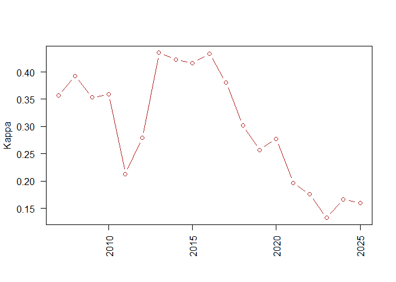

# Results

Develop and report the confusion matrices 


<!-- -->
```{=html}
<div class="plotly html-widget html-fill-item" id="htmlwidget-56f6d1ac7b417973d920" style="width:672px;height:480px;"></div>
<script type="application/json" data-for="htmlwidget-56f6d1ac7b417973d920">{"x":{"visdat":{"1fd83db14b98":["function () ","plotlyVisDat"]},"cur_data":"1fd83db14b98","attrs":{"1fd83db14b98":{"x":[2007,2008,2009,2010,2011,2012,2013,2014,2015,2016,2017,2018,2019,2020,2021,2022,2023,2024,2025],"y":[0.35699999999999998,0.39300000000000002,0.35299999999999998,0.35899999999999999,0.21299999999999999,0.27900000000000003,0.435,0.42299999999999999,0.41599999999999998,0.434,0.38100000000000001,0.30199999999999999,0.25700000000000001,0.27700000000000002,0.19700000000000001,0.17599999999999999,0.13300000000000001,0.16700000000000001,0.16],"mode":"lines+markers","line":{"color":"firebrick","width":2},"marker":{"color":"firebrick","size":8},"alpha_stroke":1,"sizes":[10,100],"spans":[1,20],"type":"scatter"}},"layout":{"margin":{"b":40,"l":60,"t":25,"r":10},"title":"Model Performance (Kappa) Over Time","xaxis":{"domain":[0,1],"automargin":true,"title":"","dtick":1,"tickangle":-45},"yaxis":{"domain":[0,1],"automargin":true,"title":"Kappa"},"hovermode":"closest","showlegend":false},"source":"A","config":{"modeBarButtonsToAdd":["hoverclosest","hovercompare"],"showSendToCloud":false},"data":[{"x":[2007,2008,2009,2010,2011,2012,2013,2014,2015,2016,2017,2018,2019,2020,2021,2022,2023,2024,2025],"y":[0.35699999999999998,0.39300000000000002,0.35299999999999998,0.35899999999999999,0.21299999999999999,0.27900000000000003,0.435,0.42299999999999999,0.41599999999999998,0.434,0.38100000000000001,0.30199999999999999,0.25700000000000001,0.27700000000000002,0.19700000000000001,0.17599999999999999,0.13300000000000001,0.16700000000000001,0.16],"mode":"lines+markers","line":{"color":"firebrick","width":2},"marker":{"color":"firebrick","size":8,"line":{"color":"rgba(31,119,180,1)"}},"type":"scatter","error_y":{"color":"rgba(31,119,180,1)"},"error_x":{"color":"rgba(31,119,180,1)"},"xaxis":"x","yaxis":"y","frame":null}],"highlight":{"on":"plotly_click","persistent":false,"dynamic":false,"selectize":false,"opacityDim":0.20000000000000001,"selected":{"opacity":1},"debounce":0},"shinyEvents":["plotly_hover","plotly_click","plotly_selected","plotly_relayout","plotly_brushed","plotly_brushing","plotly_clickannotation","plotly_doubleclick","plotly_deselect","plotly_afterplot","plotly_sunburstclick"],"base_url":"https://plot.ly"},"evals":[],"jsHooks":[]}</script>
```


```{=html}
<div class="plotly html-widget html-fill-item" id="htmlwidget-be157bc75deb92b3b61c" style="width:672px;height:480px;"></div>
<script type="application/json" data-for="htmlwidget-be157bc75deb92b3b61c">{"x":{"visdat":{"1fd8412d3833":["function () ","plotlyVisDat"]},"cur_data":"1fd8412d3833","attrs":{"1fd8412d3833":{"alpha_stroke":1,"sizes":[10,100],"spans":[1,20],"x":[2007,2008,2009,2010,2011,2012,2013,2014,2015,2016,2017,2018,2019,2020,2021,2022,2023,2024,2025],"y":[22.645572971300172,10.839116797313308,7.0990220274431843,8.0751793793170901,8.4727743755789167,12.144158642354366,11.965385468059139,11.036640492792497,9.4894546307006671,17.361823424382237,15.622279495364138,14.72951314643692,18.589393931967216,12.454816130802916,12.642324303082258,12.400011596795956,17.959411117981713,18.463209826694555,18.631193764737663],"type":"scatter","mode":"lines","name":"HSGPA","hovertemplate":"<b>HSGPA<\/b><br>Year: %{x}<br>Importance: %{y:.2f}<br><extra><\/extra>","inherit":true},"1fd8412d3833.1":{"alpha_stroke":1,"sizes":[10,100],"spans":[1,20],"x":[2007,2008,2009,2010,2011,2012,2013,2014,2015,2016,2017,2018,2019,2020,2021,2022,2023,2024,2025],"y":[18.033100620687424,13.362220324543481,5.2482966174902455,8.9048911815388578,14.924162007064051,8.9686151274977721,6.3431875716558599,10.772153055758436,13.468616116697104,18.543675505585995,16.609569680141973,11.416494087784356,13.990386263616047,11.424169232140018,12.23944558356874,8.3002508047716095,12.751823167951807,14.574930804931194,12.112116774290001],"type":"scatter","mode":"lines","name":"ACTCOMP","hovertemplate":"<b>ACTCOMP<\/b><br>Year: %{x}<br>Importance: %{y:.2f}<br><extra><\/extra>","inherit":true},"1fd8412d3833.2":{"alpha_stroke":1,"sizes":[10,100],"spans":[1,20],"x":[2007,2008,2009,2010,2011,2012,2013,2014,2015,2016,2017,2018,2019,2020,2021,2022,2023,2024,2025],"y":[16.619998774012185,11.910220856217819,9.2706894553161217,null,null,null,null,null,14.457746263054302,17.216771783152833,16.790619901207229,16.895487176521819,18.316279144959939,16.622126949695936,17.645217999297852,18.225670914914939,20.34739940013009,21.766106423581085,23.405249607820085],"type":"scatter","mode":"lines","name":"APCREDIT","hovertemplate":"<b>APCREDIT<\/b><br>Year: %{x}<br>Importance: %{y:.2f}<br><extra><\/extra>","inherit":true},"1fd8412d3833.3":{"alpha_stroke":1,"sizes":[10,100],"spans":[1,20],"x":[2007,2008,2009,2010,2011,2012,2013,2014,2015,2016,2017,2018,2019,2020,2021,2022,2023,2024,2025],"y":[12.412742962102975,4.499185523153006,2.6723765632130152,2.960787461424716,4.012449754945056,4.062872715373703,6.7180404105310672,3.7300601072122812,3.5200574027958185,7.5671003972690318,7.5369891667571407,6.4026915368289252,8.8423534251543305,5.6843233025089495,6.6300670612643646,7.4696406862319602,7.4468645747215572,8.1597820678460504,10.776111818963056],"type":"scatter","mode":"lines","name":"ACTSCI","hovertemplate":"<b>ACTSCI<\/b><br>Year: %{x}<br>Importance: %{y:.2f}<br><extra><\/extra>","inherit":true},"1fd8412d3833.4":{"alpha_stroke":1,"sizes":[10,100],"spans":[1,20],"x":[2007,2008,2009,2010,2011,2012,2013,2014,2015,2016,2017,2018,2019,2020,2021,2022,2023,2024,2025],"y":[10.378972469988325,5.3211619930965011,3.5282648777222487,3.2309199690985322,3.0365046673001928,4.3497928410004292,4.2639582739727855,3.7549131252285393,3.3227314098169383,7.6417702692925529,7.247741880188868,6.5849104024998644,9.2051306981433285,5.438575370331435,5.5235352339812671,5.4657180398847469,7.9433300574560937,8.1306897372938245,8.2133696734594484],"type":"scatter","mode":"lines","name":"ACTENGL","hovertemplate":"<b>ACTENGL<\/b><br>Year: %{x}<br>Importance: %{y:.2f}<br><extra><\/extra>","inherit":true},"1fd8412d3833.5":{"alpha_stroke":1,"sizes":[10,100],"spans":[1,20],"x":[2007,2008,2009,2010,2011,2012,2013,2014,2015,2016,2017,2018,2019,2020,2021,2022,2023,2024,2025],"y":[3.9768196817505532,5.205042141769824,4.5699364674856042,5.1562645592271004,4.7112768316969253,6.6940765282851382,8.3306957256038281,6.7325163295860593,7.3796366021005406,12.076573397431915,12.41297585004593,12.595745427846076,13.792161462573297,11.324242850252277,11.349156909900278,11.173265620891529,13.783429975396333,14.479289561204805,15.176330906234799],"type":"scatter","mode":"lines","name":"yr_diff","hovertemplate":"<b>yr_diff<\/b><br>Year: %{x}<br>Importance: %{y:.2f}<br><extra><\/extra>","inherit":true},"1fd8412d3833.6":{"alpha_stroke":1,"sizes":[10,100],"spans":[1,20],"x":[2007,2008,2009,2010,2011,2012,2013,2014,2015,2016,2017,2018,2019,2020,2021,2022,2023,2024,2025],"y":[0.73065407130311311,1.803791752655362,2.5534069749614496,4.9834339896431965,6.4910039436127924,12.24270628440542,14.964396541371839,17.557328108116895,17.408184101240025,17.825837092506813,18.073202578231321,15.769191659198031,14.907364384313713,14.805715263879534,15.322747288859897,16.966990721884116,18.990822528061095,21.72732913167841,23.754151094283106],"type":"scatter","mode":"lines","name":"class_year","hovertemplate":"<b>class_year<\/b><br>Year: %{x}<br>Importance: %{y:.2f}<br><extra><\/extra>","inherit":true},"1fd8412d3833.7":{"alpha_stroke":1,"sizes":[10,100],"spans":[1,20],"x":[2007,2008,2009,2010,2011,2012,2013,2014,2015,2016,2017,2018,2019,2020,2021,2022,2023,2024,2025],"y":[0.67257325903750309,3.7534221524179427,2.8512958628624294,4.2816799515026442,4.6907328293696064,15.382492373329528,15.319079543981479,14.963336847590247,17.513921218595168,18.455120869154761,16.663143293287256,19.277543454361222,20.002802463387397,17.452810980220939,16.801834465326497,16.256386148870199,21.189619094230522,22.761519391502823,24.368651871423303],"type":"scatter","mode":"lines","name":"cohort_year","hovertemplate":"<b>cohort_year<\/b><br>Year: %{x}<br>Importance: %{y:.2f}<br><extra><\/extra>","inherit":true},"1fd8412d3833.8":{"alpha_stroke":1,"sizes":[10,100],"spans":[1,20],"x":[2007,2008,2009,2010,2011,2012,2013,2014,2015,2016,2017,2018,2019,2020,2021,2022,2023,2024,2025],"y":[null,null,null,null,null,56.169994424077927,65.642051431985266,69.311711154787133,75.376080173551074,69.730432231358392,62.851113888098098,65.613194918532614,null,null,null,null,null,null,null],"type":"scatter","mode":"lines","name":"course_level","hovertemplate":"<b>course_level<\/b><br>Year: %{x}<br>Importance: %{y:.2f}<br><extra><\/extra>","inherit":true}},"layout":{"margin":{"b":40,"l":60,"t":25,"r":10},"xaxis":{"domain":[0,1],"automargin":true,"title":"Test Year"},"yaxis":{"domain":[0,1],"automargin":true,"title":"Variable Importance"},"hovermode":"closest","legend":{"title":{"text":"Variable"}},"showlegend":true},"source":"A","config":{"modeBarButtonsToAdd":["hoverclosest","hovercompare"],"showSendToCloud":false},"data":[{"x":[2007,2008,2009,2010,2011,2012,2013,2014,2015,2016,2017,2018,2019,2020,2021,2022,2023,2024,2025],"y":[22.645572971300172,10.839116797313308,7.0990220274431843,8.0751793793170901,8.4727743755789167,12.144158642354366,11.965385468059139,11.036640492792497,9.4894546307006671,17.361823424382237,15.622279495364138,14.72951314643692,18.589393931967216,12.454816130802916,12.642324303082258,12.400011596795956,17.959411117981713,18.463209826694555,18.631193764737663],"type":"scatter","mode":"lines","name":"HSGPA","hovertemplate":["<b>HSGPA<\/b><br>Year: %{x}<br>Importance: %{y:.2f}<br><extra><\/extra>","<b>HSGPA<\/b><br>Year: %{x}<br>Importance: %{y:.2f}<br><extra><\/extra>","<b>HSGPA<\/b><br>Year: %{x}<br>Importance: %{y:.2f}<br><extra><\/extra>","<b>HSGPA<\/b><br>Year: %{x}<br>Importance: %{y:.2f}<br><extra><\/extra>","<b>HSGPA<\/b><br>Year: %{x}<br>Importance: %{y:.2f}<br><extra><\/extra>","<b>HSGPA<\/b><br>Year: %{x}<br>Importance: %{y:.2f}<br><extra><\/extra>","<b>HSGPA<\/b><br>Year: %{x}<br>Importance: %{y:.2f}<br><extra><\/extra>","<b>HSGPA<\/b><br>Year: %{x}<br>Importance: %{y:.2f}<br><extra><\/extra>","<b>HSGPA<\/b><br>Year: %{x}<br>Importance: %{y:.2f}<br><extra><\/extra>","<b>HSGPA<\/b><br>Year: %{x}<br>Importance: %{y:.2f}<br><extra><\/extra>","<b>HSGPA<\/b><br>Year: %{x}<br>Importance: %{y:.2f}<br><extra><\/extra>","<b>HSGPA<\/b><br>Year: %{x}<br>Importance: %{y:.2f}<br><extra><\/extra>","<b>HSGPA<\/b><br>Year: %{x}<br>Importance: %{y:.2f}<br><extra><\/extra>","<b>HSGPA<\/b><br>Year: %{x}<br>Importance: %{y:.2f}<br><extra><\/extra>","<b>HSGPA<\/b><br>Year: %{x}<br>Importance: %{y:.2f}<br><extra><\/extra>","<b>HSGPA<\/b><br>Year: %{x}<br>Importance: %{y:.2f}<br><extra><\/extra>","<b>HSGPA<\/b><br>Year: %{x}<br>Importance: %{y:.2f}<br><extra><\/extra>","<b>HSGPA<\/b><br>Year: %{x}<br>Importance: %{y:.2f}<br><extra><\/extra>","<b>HSGPA<\/b><br>Year: %{x}<br>Importance: %{y:.2f}<br><extra><\/extra>"],"marker":{"color":"rgba(31,119,180,1)","line":{"color":"rgba(31,119,180,1)"}},"error_y":{"color":"rgba(31,119,180,1)"},"error_x":{"color":"rgba(31,119,180,1)"},"line":{"color":"rgba(31,119,180,1)"},"xaxis":"x","yaxis":"y","frame":null},{"x":[2007,2008,2009,2010,2011,2012,2013,2014,2015,2016,2017,2018,2019,2020,2021,2022,2023,2024,2025],"y":[18.033100620687424,13.362220324543481,5.2482966174902455,8.9048911815388578,14.924162007064051,8.9686151274977721,6.3431875716558599,10.772153055758436,13.468616116697104,18.543675505585995,16.609569680141973,11.416494087784356,13.990386263616047,11.424169232140018,12.23944558356874,8.3002508047716095,12.751823167951807,14.574930804931194,12.112116774290001],"type":"scatter","mode":"lines","name":"ACTCOMP","hovertemplate":["<b>ACTCOMP<\/b><br>Year: %{x}<br>Importance: %{y:.2f}<br><extra><\/extra>","<b>ACTCOMP<\/b><br>Year: %{x}<br>Importance: %{y:.2f}<br><extra><\/extra>","<b>ACTCOMP<\/b><br>Year: %{x}<br>Importance: %{y:.2f}<br><extra><\/extra>","<b>ACTCOMP<\/b><br>Year: %{x}<br>Importance: %{y:.2f}<br><extra><\/extra>","<b>ACTCOMP<\/b><br>Year: %{x}<br>Importance: %{y:.2f}<br><extra><\/extra>","<b>ACTCOMP<\/b><br>Year: %{x}<br>Importance: %{y:.2f}<br><extra><\/extra>","<b>ACTCOMP<\/b><br>Year: %{x}<br>Importance: %{y:.2f}<br><extra><\/extra>","<b>ACTCOMP<\/b><br>Year: %{x}<br>Importance: %{y:.2f}<br><extra><\/extra>","<b>ACTCOMP<\/b><br>Year: %{x}<br>Importance: %{y:.2f}<br><extra><\/extra>","<b>ACTCOMP<\/b><br>Year: %{x}<br>Importance: %{y:.2f}<br><extra><\/extra>","<b>ACTCOMP<\/b><br>Year: %{x}<br>Importance: %{y:.2f}<br><extra><\/extra>","<b>ACTCOMP<\/b><br>Year: %{x}<br>Importance: %{y:.2f}<br><extra><\/extra>","<b>ACTCOMP<\/b><br>Year: %{x}<br>Importance: %{y:.2f}<br><extra><\/extra>","<b>ACTCOMP<\/b><br>Year: %{x}<br>Importance: %{y:.2f}<br><extra><\/extra>","<b>ACTCOMP<\/b><br>Year: %{x}<br>Importance: %{y:.2f}<br><extra><\/extra>","<b>ACTCOMP<\/b><br>Year: %{x}<br>Importance: %{y:.2f}<br><extra><\/extra>","<b>ACTCOMP<\/b><br>Year: %{x}<br>Importance: %{y:.2f}<br><extra><\/extra>","<b>ACTCOMP<\/b><br>Year: %{x}<br>Importance: %{y:.2f}<br><extra><\/extra>","<b>ACTCOMP<\/b><br>Year: %{x}<br>Importance: %{y:.2f}<br><extra><\/extra>"],"marker":{"color":"rgba(255,127,14,1)","line":{"color":"rgba(255,127,14,1)"}},"error_y":{"color":"rgba(255,127,14,1)"},"error_x":{"color":"rgba(255,127,14,1)"},"line":{"color":"rgba(255,127,14,1)"},"xaxis":"x","yaxis":"y","frame":null},{"x":[2007,2008,2009,null,2015,2016,2017,2018,2019,2020,2021,2022,2023,2024,2025],"y":[16.619998774012185,11.910220856217819,9.2706894553161217,null,14.457746263054302,17.216771783152833,16.790619901207229,16.895487176521819,18.316279144959939,16.622126949695936,17.645217999297852,18.225670914914939,20.34739940013009,21.766106423581085,23.405249607820085],"type":"scatter","mode":"lines","name":"APCREDIT","hovertemplate":["<b>APCREDIT<\/b><br>Year: %{x}<br>Importance: %{y:.2f}<br><extra><\/extra>","<b>APCREDIT<\/b><br>Year: %{x}<br>Importance: %{y:.2f}<br><extra><\/extra>","<b>APCREDIT<\/b><br>Year: %{x}<br>Importance: %{y:.2f}<br><extra><\/extra>",null,"<b>APCREDIT<\/b><br>Year: %{x}<br>Importance: %{y:.2f}<br><extra><\/extra>","<b>APCREDIT<\/b><br>Year: %{x}<br>Importance: %{y:.2f}<br><extra><\/extra>","<b>APCREDIT<\/b><br>Year: %{x}<br>Importance: %{y:.2f}<br><extra><\/extra>","<b>APCREDIT<\/b><br>Year: %{x}<br>Importance: %{y:.2f}<br><extra><\/extra>","<b>APCREDIT<\/b><br>Year: %{x}<br>Importance: %{y:.2f}<br><extra><\/extra>","<b>APCREDIT<\/b><br>Year: %{x}<br>Importance: %{y:.2f}<br><extra><\/extra>","<b>APCREDIT<\/b><br>Year: %{x}<br>Importance: %{y:.2f}<br><extra><\/extra>","<b>APCREDIT<\/b><br>Year: %{x}<br>Importance: %{y:.2f}<br><extra><\/extra>","<b>APCREDIT<\/b><br>Year: %{x}<br>Importance: %{y:.2f}<br><extra><\/extra>","<b>APCREDIT<\/b><br>Year: %{x}<br>Importance: %{y:.2f}<br><extra><\/extra>","<b>APCREDIT<\/b><br>Year: %{x}<br>Importance: %{y:.2f}<br><extra><\/extra>"],"marker":{"color":"rgba(44,160,44,1)","line":{"color":"rgba(44,160,44,1)"}},"error_y":{"color":"rgba(44,160,44,1)"},"error_x":{"color":"rgba(44,160,44,1)"},"line":{"color":"rgba(44,160,44,1)"},"xaxis":"x","yaxis":"y","frame":null},{"x":[2007,2008,2009,2010,2011,2012,2013,2014,2015,2016,2017,2018,2019,2020,2021,2022,2023,2024,2025],"y":[12.412742962102975,4.499185523153006,2.6723765632130152,2.960787461424716,4.012449754945056,4.062872715373703,6.7180404105310672,3.7300601072122812,3.5200574027958185,7.5671003972690318,7.5369891667571407,6.4026915368289252,8.8423534251543305,5.6843233025089495,6.6300670612643646,7.4696406862319602,7.4468645747215572,8.1597820678460504,10.776111818963056],"type":"scatter","mode":"lines","name":"ACTSCI","hovertemplate":["<b>ACTSCI<\/b><br>Year: %{x}<br>Importance: %{y:.2f}<br><extra><\/extra>","<b>ACTSCI<\/b><br>Year: %{x}<br>Importance: %{y:.2f}<br><extra><\/extra>","<b>ACTSCI<\/b><br>Year: %{x}<br>Importance: %{y:.2f}<br><extra><\/extra>","<b>ACTSCI<\/b><br>Year: %{x}<br>Importance: %{y:.2f}<br><extra><\/extra>","<b>ACTSCI<\/b><br>Year: %{x}<br>Importance: %{y:.2f}<br><extra><\/extra>","<b>ACTSCI<\/b><br>Year: %{x}<br>Importance: %{y:.2f}<br><extra><\/extra>","<b>ACTSCI<\/b><br>Year: %{x}<br>Importance: %{y:.2f}<br><extra><\/extra>","<b>ACTSCI<\/b><br>Year: %{x}<br>Importance: %{y:.2f}<br><extra><\/extra>","<b>ACTSCI<\/b><br>Year: %{x}<br>Importance: %{y:.2f}<br><extra><\/extra>","<b>ACTSCI<\/b><br>Year: %{x}<br>Importance: %{y:.2f}<br><extra><\/extra>","<b>ACTSCI<\/b><br>Year: %{x}<br>Importance: %{y:.2f}<br><extra><\/extra>","<b>ACTSCI<\/b><br>Year: %{x}<br>Importance: %{y:.2f}<br><extra><\/extra>","<b>ACTSCI<\/b><br>Year: %{x}<br>Importance: %{y:.2f}<br><extra><\/extra>","<b>ACTSCI<\/b><br>Year: %{x}<br>Importance: %{y:.2f}<br><extra><\/extra>","<b>ACTSCI<\/b><br>Year: %{x}<br>Importance: %{y:.2f}<br><extra><\/extra>","<b>ACTSCI<\/b><br>Year: %{x}<br>Importance: %{y:.2f}<br><extra><\/extra>","<b>ACTSCI<\/b><br>Year: %{x}<br>Importance: %{y:.2f}<br><extra><\/extra>","<b>ACTSCI<\/b><br>Year: %{x}<br>Importance: %{y:.2f}<br><extra><\/extra>","<b>ACTSCI<\/b><br>Year: %{x}<br>Importance: %{y:.2f}<br><extra><\/extra>"],"marker":{"color":"rgba(214,39,40,1)","line":{"color":"rgba(214,39,40,1)"}},"error_y":{"color":"rgba(214,39,40,1)"},"error_x":{"color":"rgba(214,39,40,1)"},"line":{"color":"rgba(214,39,40,1)"},"xaxis":"x","yaxis":"y","frame":null},{"x":[2007,2008,2009,2010,2011,2012,2013,2014,2015,2016,2017,2018,2019,2020,2021,2022,2023,2024,2025],"y":[10.378972469988325,5.3211619930965011,3.5282648777222487,3.2309199690985322,3.0365046673001928,4.3497928410004292,4.2639582739727855,3.7549131252285393,3.3227314098169383,7.6417702692925529,7.247741880188868,6.5849104024998644,9.2051306981433285,5.438575370331435,5.5235352339812671,5.4657180398847469,7.9433300574560937,8.1306897372938245,8.2133696734594484],"type":"scatter","mode":"lines","name":"ACTENGL","hovertemplate":["<b>ACTENGL<\/b><br>Year: %{x}<br>Importance: %{y:.2f}<br><extra><\/extra>","<b>ACTENGL<\/b><br>Year: %{x}<br>Importance: %{y:.2f}<br><extra><\/extra>","<b>ACTENGL<\/b><br>Year: %{x}<br>Importance: %{y:.2f}<br><extra><\/extra>","<b>ACTENGL<\/b><br>Year: %{x}<br>Importance: %{y:.2f}<br><extra><\/extra>","<b>ACTENGL<\/b><br>Year: %{x}<br>Importance: %{y:.2f}<br><extra><\/extra>","<b>ACTENGL<\/b><br>Year: %{x}<br>Importance: %{y:.2f}<br><extra><\/extra>","<b>ACTENGL<\/b><br>Year: %{x}<br>Importance: %{y:.2f}<br><extra><\/extra>","<b>ACTENGL<\/b><br>Year: %{x}<br>Importance: %{y:.2f}<br><extra><\/extra>","<b>ACTENGL<\/b><br>Year: %{x}<br>Importance: %{y:.2f}<br><extra><\/extra>","<b>ACTENGL<\/b><br>Year: %{x}<br>Importance: %{y:.2f}<br><extra><\/extra>","<b>ACTENGL<\/b><br>Year: %{x}<br>Importance: %{y:.2f}<br><extra><\/extra>","<b>ACTENGL<\/b><br>Year: %{x}<br>Importance: %{y:.2f}<br><extra><\/extra>","<b>ACTENGL<\/b><br>Year: %{x}<br>Importance: %{y:.2f}<br><extra><\/extra>","<b>ACTENGL<\/b><br>Year: %{x}<br>Importance: %{y:.2f}<br><extra><\/extra>","<b>ACTENGL<\/b><br>Year: %{x}<br>Importance: %{y:.2f}<br><extra><\/extra>","<b>ACTENGL<\/b><br>Year: %{x}<br>Importance: %{y:.2f}<br><extra><\/extra>","<b>ACTENGL<\/b><br>Year: %{x}<br>Importance: %{y:.2f}<br><extra><\/extra>","<b>ACTENGL<\/b><br>Year: %{x}<br>Importance: %{y:.2f}<br><extra><\/extra>","<b>ACTENGL<\/b><br>Year: %{x}<br>Importance: %{y:.2f}<br><extra><\/extra>"],"marker":{"color":"rgba(148,103,189,1)","line":{"color":"rgba(148,103,189,1)"}},"error_y":{"color":"rgba(148,103,189,1)"},"error_x":{"color":"rgba(148,103,189,1)"},"line":{"color":"rgba(148,103,189,1)"},"xaxis":"x","yaxis":"y","frame":null},{"x":[2007,2008,2009,2010,2011,2012,2013,2014,2015,2016,2017,2018,2019,2020,2021,2022,2023,2024,2025],"y":[3.9768196817505532,5.205042141769824,4.5699364674856042,5.1562645592271004,4.7112768316969253,6.6940765282851382,8.3306957256038281,6.7325163295860593,7.3796366021005406,12.076573397431915,12.41297585004593,12.595745427846076,13.792161462573297,11.324242850252277,11.349156909900278,11.173265620891529,13.783429975396333,14.479289561204805,15.176330906234799],"type":"scatter","mode":"lines","name":"yr_diff","hovertemplate":["<b>yr_diff<\/b><br>Year: %{x}<br>Importance: %{y:.2f}<br><extra><\/extra>","<b>yr_diff<\/b><br>Year: %{x}<br>Importance: %{y:.2f}<br><extra><\/extra>","<b>yr_diff<\/b><br>Year: %{x}<br>Importance: %{y:.2f}<br><extra><\/extra>","<b>yr_diff<\/b><br>Year: %{x}<br>Importance: %{y:.2f}<br><extra><\/extra>","<b>yr_diff<\/b><br>Year: %{x}<br>Importance: %{y:.2f}<br><extra><\/extra>","<b>yr_diff<\/b><br>Year: %{x}<br>Importance: %{y:.2f}<br><extra><\/extra>","<b>yr_diff<\/b><br>Year: %{x}<br>Importance: %{y:.2f}<br><extra><\/extra>","<b>yr_diff<\/b><br>Year: %{x}<br>Importance: %{y:.2f}<br><extra><\/extra>","<b>yr_diff<\/b><br>Year: %{x}<br>Importance: %{y:.2f}<br><extra><\/extra>","<b>yr_diff<\/b><br>Year: %{x}<br>Importance: %{y:.2f}<br><extra><\/extra>","<b>yr_diff<\/b><br>Year: %{x}<br>Importance: %{y:.2f}<br><extra><\/extra>","<b>yr_diff<\/b><br>Year: %{x}<br>Importance: %{y:.2f}<br><extra><\/extra>","<b>yr_diff<\/b><br>Year: %{x}<br>Importance: %{y:.2f}<br><extra><\/extra>","<b>yr_diff<\/b><br>Year: %{x}<br>Importance: %{y:.2f}<br><extra><\/extra>","<b>yr_diff<\/b><br>Year: %{x}<br>Importance: %{y:.2f}<br><extra><\/extra>","<b>yr_diff<\/b><br>Year: %{x}<br>Importance: %{y:.2f}<br><extra><\/extra>","<b>yr_diff<\/b><br>Year: %{x}<br>Importance: %{y:.2f}<br><extra><\/extra>","<b>yr_diff<\/b><br>Year: %{x}<br>Importance: %{y:.2f}<br><extra><\/extra>","<b>yr_diff<\/b><br>Year: %{x}<br>Importance: %{y:.2f}<br><extra><\/extra>"],"marker":{"color":"rgba(140,86,75,1)","line":{"color":"rgba(140,86,75,1)"}},"error_y":{"color":"rgba(140,86,75,1)"},"error_x":{"color":"rgba(140,86,75,1)"},"line":{"color":"rgba(140,86,75,1)"},"xaxis":"x","yaxis":"y","frame":null},{"x":[2007,2008,2009,2010,2011,2012,2013,2014,2015,2016,2017,2018,2019,2020,2021,2022,2023,2024,2025],"y":[0.73065407130311311,1.803791752655362,2.5534069749614496,4.9834339896431965,6.4910039436127924,12.24270628440542,14.964396541371839,17.557328108116895,17.408184101240025,17.825837092506813,18.073202578231321,15.769191659198031,14.907364384313713,14.805715263879534,15.322747288859897,16.966990721884116,18.990822528061095,21.72732913167841,23.754151094283106],"type":"scatter","mode":"lines","name":"class_year","hovertemplate":["<b>class_year<\/b><br>Year: %{x}<br>Importance: %{y:.2f}<br><extra><\/extra>","<b>class_year<\/b><br>Year: %{x}<br>Importance: %{y:.2f}<br><extra><\/extra>","<b>class_year<\/b><br>Year: %{x}<br>Importance: %{y:.2f}<br><extra><\/extra>","<b>class_year<\/b><br>Year: %{x}<br>Importance: %{y:.2f}<br><extra><\/extra>","<b>class_year<\/b><br>Year: %{x}<br>Importance: %{y:.2f}<br><extra><\/extra>","<b>class_year<\/b><br>Year: %{x}<br>Importance: %{y:.2f}<br><extra><\/extra>","<b>class_year<\/b><br>Year: %{x}<br>Importance: %{y:.2f}<br><extra><\/extra>","<b>class_year<\/b><br>Year: %{x}<br>Importance: %{y:.2f}<br><extra><\/extra>","<b>class_year<\/b><br>Year: %{x}<br>Importance: %{y:.2f}<br><extra><\/extra>","<b>class_year<\/b><br>Year: %{x}<br>Importance: %{y:.2f}<br><extra><\/extra>","<b>class_year<\/b><br>Year: %{x}<br>Importance: %{y:.2f}<br><extra><\/extra>","<b>class_year<\/b><br>Year: %{x}<br>Importance: %{y:.2f}<br><extra><\/extra>","<b>class_year<\/b><br>Year: %{x}<br>Importance: %{y:.2f}<br><extra><\/extra>","<b>class_year<\/b><br>Year: %{x}<br>Importance: %{y:.2f}<br><extra><\/extra>","<b>class_year<\/b><br>Year: %{x}<br>Importance: %{y:.2f}<br><extra><\/extra>","<b>class_year<\/b><br>Year: %{x}<br>Importance: %{y:.2f}<br><extra><\/extra>","<b>class_year<\/b><br>Year: %{x}<br>Importance: %{y:.2f}<br><extra><\/extra>","<b>class_year<\/b><br>Year: %{x}<br>Importance: %{y:.2f}<br><extra><\/extra>","<b>class_year<\/b><br>Year: %{x}<br>Importance: %{y:.2f}<br><extra><\/extra>"],"marker":{"color":"rgba(227,119,194,1)","line":{"color":"rgba(227,119,194,1)"}},"error_y":{"color":"rgba(227,119,194,1)"},"error_x":{"color":"rgba(227,119,194,1)"},"line":{"color":"rgba(227,119,194,1)"},"xaxis":"x","yaxis":"y","frame":null},{"x":[2007,2008,2009,2010,2011,2012,2013,2014,2015,2016,2017,2018,2019,2020,2021,2022,2023,2024,2025],"y":[0.67257325903750309,3.7534221524179427,2.8512958628624294,4.2816799515026442,4.6907328293696064,15.382492373329528,15.319079543981479,14.963336847590247,17.513921218595168,18.455120869154761,16.663143293287256,19.277543454361222,20.002802463387397,17.452810980220939,16.801834465326497,16.256386148870199,21.189619094230522,22.761519391502823,24.368651871423303],"type":"scatter","mode":"lines","name":"cohort_year","hovertemplate":["<b>cohort_year<\/b><br>Year: %{x}<br>Importance: %{y:.2f}<br><extra><\/extra>","<b>cohort_year<\/b><br>Year: %{x}<br>Importance: %{y:.2f}<br><extra><\/extra>","<b>cohort_year<\/b><br>Year: %{x}<br>Importance: %{y:.2f}<br><extra><\/extra>","<b>cohort_year<\/b><br>Year: %{x}<br>Importance: %{y:.2f}<br><extra><\/extra>","<b>cohort_year<\/b><br>Year: %{x}<br>Importance: %{y:.2f}<br><extra><\/extra>","<b>cohort_year<\/b><br>Year: %{x}<br>Importance: %{y:.2f}<br><extra><\/extra>","<b>cohort_year<\/b><br>Year: %{x}<br>Importance: %{y:.2f}<br><extra><\/extra>","<b>cohort_year<\/b><br>Year: %{x}<br>Importance: %{y:.2f}<br><extra><\/extra>","<b>cohort_year<\/b><br>Year: %{x}<br>Importance: %{y:.2f}<br><extra><\/extra>","<b>cohort_year<\/b><br>Year: %{x}<br>Importance: %{y:.2f}<br><extra><\/extra>","<b>cohort_year<\/b><br>Year: %{x}<br>Importance: %{y:.2f}<br><extra><\/extra>","<b>cohort_year<\/b><br>Year: %{x}<br>Importance: %{y:.2f}<br><extra><\/extra>","<b>cohort_year<\/b><br>Year: %{x}<br>Importance: %{y:.2f}<br><extra><\/extra>","<b>cohort_year<\/b><br>Year: %{x}<br>Importance: %{y:.2f}<br><extra><\/extra>","<b>cohort_year<\/b><br>Year: %{x}<br>Importance: %{y:.2f}<br><extra><\/extra>","<b>cohort_year<\/b><br>Year: %{x}<br>Importance: %{y:.2f}<br><extra><\/extra>","<b>cohort_year<\/b><br>Year: %{x}<br>Importance: %{y:.2f}<br><extra><\/extra>","<b>cohort_year<\/b><br>Year: %{x}<br>Importance: %{y:.2f}<br><extra><\/extra>","<b>cohort_year<\/b><br>Year: %{x}<br>Importance: %{y:.2f}<br><extra><\/extra>"],"marker":{"color":"rgba(127,127,127,1)","line":{"color":"rgba(127,127,127,1)"}},"error_y":{"color":"rgba(127,127,127,1)"},"error_x":{"color":"rgba(127,127,127,1)"},"line":{"color":"rgba(127,127,127,1)"},"xaxis":"x","yaxis":"y","frame":null},{"x":[2012,2013,2014,2015,2016,2017,2018],"y":[56.169994424077927,65.642051431985266,69.311711154787133,75.376080173551074,69.730432231358392,62.851113888098098,65.613194918532614],"type":"scatter","mode":"lines","name":"course_level","hovertemplate":["<b>course_level<\/b><br>Year: %{x}<br>Importance: %{y:.2f}<br><extra><\/extra>","<b>course_level<\/b><br>Year: %{x}<br>Importance: %{y:.2f}<br><extra><\/extra>","<b>course_level<\/b><br>Year: %{x}<br>Importance: %{y:.2f}<br><extra><\/extra>","<b>course_level<\/b><br>Year: %{x}<br>Importance: %{y:.2f}<br><extra><\/extra>","<b>course_level<\/b><br>Year: %{x}<br>Importance: %{y:.2f}<br><extra><\/extra>","<b>course_level<\/b><br>Year: %{x}<br>Importance: %{y:.2f}<br><extra><\/extra>","<b>course_level<\/b><br>Year: %{x}<br>Importance: %{y:.2f}<br><extra><\/extra>"],"marker":{"color":"rgba(188,189,34,1)","line":{"color":"rgba(188,189,34,1)"}},"error_y":{"color":"rgba(188,189,34,1)"},"error_x":{"color":"rgba(188,189,34,1)"},"line":{"color":"rgba(188,189,34,1)"},"xaxis":"x","yaxis":"y","frame":null}],"highlight":{"on":"plotly_click","persistent":false,"dynamic":false,"selectize":false,"opacityDim":0.20000000000000001,"selected":{"opacity":1},"debounce":0},"shinyEvents":["plotly_hover","plotly_click","plotly_selected","plotly_relayout","plotly_brushed","plotly_brushing","plotly_clickannotation","plotly_doubleclick","plotly_deselect","plotly_afterplot","plotly_sunburstclick"],"base_url":"https://plot.ly"},"evals":[],"jsHooks":[]}</script>
```


So accuracy at predicting courses drops incredibly.
And I'm not sure I want to include "course_level", but why was it only super-important for a few years?  

I want to see the median grade per course over time.  What's my trend over time?

Similarly -- maybe I want to see the proportion of students achieving a particular grade level or grade chunk.  It's getting big, right?  Could that show grade inflation? 

And we're getting closer to counter-factuals. What grade would they get in a particular course?

I need to submit this to Git, and write up both reports, and get a couple of key visualizations over time. 

I'd like to see "precision" for the top three courses over time.  And "recall", sure.

I need to make the confusion matrices work--  

  - name matrix
  - whatever that error it's throwing 
  
I think I'll make a separate "over time" report that explores the predictors for both grades and course over time.  

I'll work on all three reports in parallel -- 

  - Prediction results  (course and grade)  
  - Predictors over time
