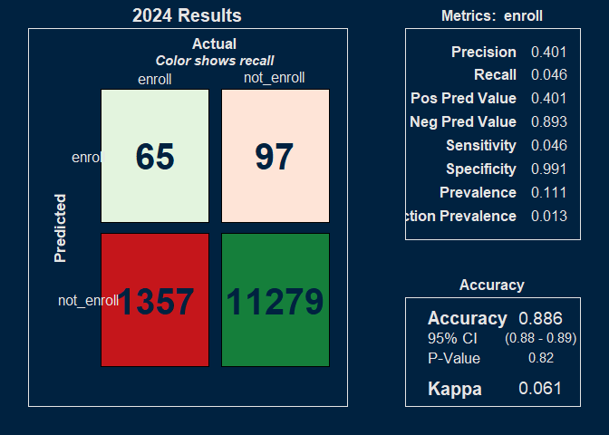

# NEED TO CHANGE TEXT TO REFLECT vD0


### SUMMARY

In order to examine trends in initial math course selection by first time freshmen over time, a series of predictive models were trained that used minimal and readily available information about first time freshmen.  

Nineteen predictive models were trained using extreme gradient boosting and an expanding window, where each year a consecutive year's worth of data was added and a new subsequent year's course selection was predicted. 

The predictive model found a moderate relationship between math course selection and predictors early on (Kappa of ~0.35), but that relationship eroded to a very weak relationship by 2024 (when the Kappa value declined to 0.17).   

The most important predictor in every year was the ACT test scores.  Distantly, the number of AP credits, cohort year, and class year were next highest in model importance.  

Some courses such as Math 2210 bucked the trend and increased in accuracy metrics over time.  

The overall decline in the model's ability to predict course selection suggests a weakening relationship between predictors like test scores, high school GPA, and AP credits, and math course selection.  Instead, it suggests something like a new free-for-all where historical guidelines have been abandoned, or the introduction of new guidelines that do not align with historical practices.  

### METHODOLOGY 

All math courses taken by first time freshmen were identified. Each student's first math courses were identified (or multiple courses if taken in the same term.)   Grade performance for these math courses was queried.  These are called the initial math courses.   

Predictive models were trained with package "xgboost" (extreme gradient boosting) with five-fold cross validation and a grid search pattern (nrounds = (100,200); max_depth(3,6); eta(0.05,0.2); colsample_bytree(0.8); subsample(0.8).)    

An expanding window of historical data was used, where one model was trained per year for nineteen models.  Each model incrementally added an additional year's data and predicted on the subsequent year.  For example, the predicted course selection for the year 2010 was trained on data from the years 2005 to 2009.  The predicted course selection for the year 2024 was trained on data from the years 2005 to 2023.  

A value for math course was predicted.  

#### Variables 

The variables included: 

*Demographics:* 

  * Age (less than 17 yrs old/17/18/19 or 20/greater than 21 years old)
  * Sex (male or female)
  * First generation status
  * Ethnicity 
  
*High school information and performance:*  

  * High school GPA 
  * Number of AP credits
  * Whether the high school was public or private   
  * Honors achievement

*Test scores:*    

  * ACT Math
  * ACT English
  * ACT Science
  * ACT comprehensive

*University information:*  

  * Residence status  
  * Pell grant eligibility  
  * Cohort year (2005 to 2024)
  * Class year (2005 to 2025)
  * Years from the cohort date (always fall of the year) until the first term with math courses 
  * Season (spring, summer, or fall)  

#### Filters  

The following filters were applied: 

 * Math labs are filtered out.  
 * Courses higher than 3000 level were removed. 
 * Students younger than 11 yrs old were removed. 
 * Withdraw and "rare" grades of V, I, NC, and CR were removed.  
 * Students with high school GPA values of zero were removed. 
 * Courses from students with unusually high credits taken that semester (greater than 99th percentile) were removed.  
 * Courses taken more than half a year prior to the cohort date (where all cohort dates are in the fall) were removed   
 * All records with incomplete information were removed.  

#### Transformations    

The following transformations were applied: 

  * AP credit values of "NA" were converted to zero.  
  * Math courses with ordered enrollment above the 95th percentile of cumulative total were combined as "other"  
  
#### Target values    

Each model predicted a value for a math course out of the following possibilities:  

MATH_1010, MATH_1050, MATH_1210, MATH_1030, MATH_1090, MATH_1070, MATH_1220, MATH_1080, MATH_1060, MATH_1310, MATH_2210, MATH_990, MATH_1100, MATH_1250 or "other".
 
The following math courses were combined into "other":  

MATH_1040, MATH_1311, MATH_1260, MATH_950, MATH_1270, MATH_1320, MATH_1321, MATH_1215, MATH_1170, MATH_2270, MATH_2250, MATH_1035, MATH_2000, MATH_1280, MATH_2200, MATH_1105, MATH_2271, MATH_2015, MATH_2280, MATH_2160, UC_1000, MATH_1180.
  
### DISCUSSION  

The relationship between early information and course selection was moderately predictive for many years, with Kappa values around 0.35 from 2013 to 2017, when it rapidly started eroding to a Kappa value of 0.17 in 2024. 

Kappa values also dipped in 2011 and 2012, suggesting a change in practices or guidelines or expectations for course selection.

The most important predictor over all years, by far, was test scores for ACT math.  This suggests the test score may have been explicitly used as a guideline in the past and remains the most influential variable of these in course selection today.

Some notable courses include: 

  - *Math 1010:*  The model was able to correctly identify participants in Math 1010 until the year 2022 with reasonably high precision and recall scores (except for the 2011-12 dip), but declined steeply to precision and recall scores of about only 0.16 in 2024.  
  - *Math 1310:*  The model's precision in identifying Math 1310 has improved, but the recall numbers are very low (with a high of 0.03.)  
  - *Math 1030:* The model's recall has improved since 2018 until it had comparatively high recall in 2024 (0.42) with relatively moderate precision as well (0.28). 
  - *Math 2210:* The model's recall has improved since 2015 until it has relatively high recall and precision in 2024.
  
It might be useful to cluster the courses to separate courses with rising, declining, or stable trends.  
  
Taken together, the overall decline in model accuracy (Kappa, precision, and recall) over the years suggests several possibilities:  

  (1) A collapse of guidelines and a free-for-all in selecting courses
  (2) The introduction of some new guideline or mechanism that aligns weakly with prior practices.    
  (3) At the same time, some courses with improving accuracy (such as Math 2210 with improving precision and recall) suggest more rigid course selection.  


### CONCLUSIONS  

Initial math course selection for first time freshmen is decreasingly determined by variables known at the time of enrollment, until it is almost completely determined by variables other than early available information in 2024.

Predictive models had Kappa values as high as 0.4, indicating a moderate degree of determinism between early information (such as high school performance and test scores) and course selection.  However, that relationship eroded rapidly starting in 2016 until Kappa values were as low as 0.13 by 2024, indicating a near-random or weak relationship between prior information and course selection. 

All models in all years used ACT Math scores as the most important predictor of course selection.  AP credit increased in importance in predicting math course selection, as did information about the class year and cohort year.  

Some courses have run counter to the general trend, as precision and recall scores have improved over the years.

### RESULTS 


```{=html}
<div class="plotly html-widget html-fill-item" id="htmlwidget-39190514d8f984b8b1e7" style="width:672px;height:480px;"></div>
<script type="application/json" data-for="htmlwidget-39190514d8f984b8b1e7">{"x":{"visdat":{"40983c771c0c":["function () ","plotlyVisDat"]},"cur_data":"40983c771c0c","attrs":{"40983c771c0c":{"x":[2007,2008,2009,2010,2011,2012,2013,2014,2015,2016,2017,2018,2019,2020,2021,2022,2023,2024],"y":[0.29399999999999998,0.45400000000000001,0.46100000000000002,0.42699999999999999,0.34699999999999998,0.307,0.375,0.36899999999999999,0.35999999999999999,0.36099999999999999,0.27700000000000002,0.20100000000000001,0.23999999999999999,0.20799999999999999,0.14099999999999999,0.13200000000000001,0.070000000000000007,0.060999999999999999],"mode":"lines+markers","line":{"color":"firebrick","width":2},"marker":{"color":"firebrick","size":8},"alpha_stroke":1,"sizes":[10,100],"spans":[1,20],"type":"scatter"}},"layout":{"margin":{"b":40,"l":60,"t":25,"r":10},"title":"Model Performance (Kappa) Over Time","xaxis":{"domain":[0,1],"automargin":true,"title":"","dtick":1,"tickangle":-45},"yaxis":{"domain":[0,1],"automargin":true,"title":"Kappa"},"hovermode":"closest","showlegend":false},"source":"A","config":{"modeBarButtonsToAdd":["hoverclosest","hovercompare"],"showSendToCloud":false},"data":[{"x":[2007,2008,2009,2010,2011,2012,2013,2014,2015,2016,2017,2018,2019,2020,2021,2022,2023,2024],"y":[0.29399999999999998,0.45400000000000001,0.46100000000000002,0.42699999999999999,0.34699999999999998,0.307,0.375,0.36899999999999999,0.35999999999999999,0.36099999999999999,0.27700000000000002,0.20100000000000001,0.23999999999999999,0.20799999999999999,0.14099999999999999,0.13200000000000001,0.070000000000000007,0.060999999999999999],"mode":"lines+markers","line":{"color":"firebrick","width":2},"marker":{"color":"firebrick","size":8,"line":{"color":"rgba(31,119,180,1)"}},"type":"scatter","error_y":{"color":"rgba(31,119,180,1)"},"error_x":{"color":"rgba(31,119,180,1)"},"xaxis":"x","yaxis":"y","frame":null}],"highlight":{"on":"plotly_click","persistent":false,"dynamic":false,"selectize":false,"opacityDim":0.20000000000000001,"selected":{"opacity":1},"debounce":0},"shinyEvents":["plotly_hover","plotly_click","plotly_selected","plotly_relayout","plotly_brushed","plotly_brushing","plotly_clickannotation","plotly_doubleclick","plotly_deselect","plotly_afterplot","plotly_sunburstclick"],"base_url":"https://plot.ly"},"evals":[],"jsHooks":[]}</script>
```


```{=html}
<div class="plotly html-widget html-fill-item" id="htmlwidget-e2c106033e65b9678c7e" style="width:672px;height:480px;"></div>
<script type="application/json" data-for="htmlwidget-e2c106033e65b9678c7e">{"x":{"visdat":{"40981984757e":["function () ","plotlyVisDat"]},"cur_data":"40981984757e","attrs":{"40981984757e":{"alpha_stroke":1,"sizes":[10,100],"spans":[1,20],"x":[2007,2008,2009,2010,2011,2012,2013,2014,2015,2016,2017,2018,2019,2020,2021,2022,2023,2024],"y":[0.76201923076923073,0.80148148148148146,0.77966101694915257,0.74939467312348673,0.71847507331378302,0.74603174603174605,0.77816291161178508,0.74137931034482762,0.73538011695906436,0.80123266563944529,0.74346405228758172,0.54765751211631664,0.49019607843137253,0.54941373534338356,0.4461883408071749,0.46256684491978611,0.46540880503144655,0.40123456790123457],"type":"scatter","mode":"lines","name":"Precision","hovertemplate":"<b>Precision<\/b><br>Year: %{x}<br>Precision: %{y:.2f}<br><extra><\/extra>","inherit":true}},"layout":{"margin":{"b":40,"l":60,"t":25,"r":10},"title":"Precision Over Time","xaxis":{"domain":[0,1],"automargin":true,"title":"Test Year"},"yaxis":{"domain":[0,1],"automargin":true,"title":"Precision"},"hovermode":"closest","legend":{"title":{"text":"Course"}},"showlegend":false},"source":"A","config":{"modeBarButtonsToAdd":["hoverclosest","hovercompare"],"showSendToCloud":false},"data":[{"x":[2007,2008,2009,2010,2011,2012,2013,2014,2015,2016,2017,2018,2019,2020,2021,2022,2023,2024],"y":[0.76201923076923073,0.80148148148148146,0.77966101694915257,0.74939467312348673,0.71847507331378302,0.74603174603174605,0.77816291161178508,0.74137931034482762,0.73538011695906436,0.80123266563944529,0.74346405228758172,0.54765751211631664,0.49019607843137253,0.54941373534338356,0.4461883408071749,0.46256684491978611,0.46540880503144655,0.40123456790123457],"type":"scatter","mode":"lines","name":"Precision","hovertemplate":["<b>Precision<\/b><br>Year: %{x}<br>Precision: %{y:.2f}<br><extra><\/extra>","<b>Precision<\/b><br>Year: %{x}<br>Precision: %{y:.2f}<br><extra><\/extra>","<b>Precision<\/b><br>Year: %{x}<br>Precision: %{y:.2f}<br><extra><\/extra>","<b>Precision<\/b><br>Year: %{x}<br>Precision: %{y:.2f}<br><extra><\/extra>","<b>Precision<\/b><br>Year: %{x}<br>Precision: %{y:.2f}<br><extra><\/extra>","<b>Precision<\/b><br>Year: %{x}<br>Precision: %{y:.2f}<br><extra><\/extra>","<b>Precision<\/b><br>Year: %{x}<br>Precision: %{y:.2f}<br><extra><\/extra>","<b>Precision<\/b><br>Year: %{x}<br>Precision: %{y:.2f}<br><extra><\/extra>","<b>Precision<\/b><br>Year: %{x}<br>Precision: %{y:.2f}<br><extra><\/extra>","<b>Precision<\/b><br>Year: %{x}<br>Precision: %{y:.2f}<br><extra><\/extra>","<b>Precision<\/b><br>Year: %{x}<br>Precision: %{y:.2f}<br><extra><\/extra>","<b>Precision<\/b><br>Year: %{x}<br>Precision: %{y:.2f}<br><extra><\/extra>","<b>Precision<\/b><br>Year: %{x}<br>Precision: %{y:.2f}<br><extra><\/extra>","<b>Precision<\/b><br>Year: %{x}<br>Precision: %{y:.2f}<br><extra><\/extra>","<b>Precision<\/b><br>Year: %{x}<br>Precision: %{y:.2f}<br><extra><\/extra>","<b>Precision<\/b><br>Year: %{x}<br>Precision: %{y:.2f}<br><extra><\/extra>","<b>Precision<\/b><br>Year: %{x}<br>Precision: %{y:.2f}<br><extra><\/extra>","<b>Precision<\/b><br>Year: %{x}<br>Precision: %{y:.2f}<br><extra><\/extra>"],"marker":{"color":"rgba(31,119,180,1)","line":{"color":"rgba(31,119,180,1)"}},"error_y":{"color":"rgba(31,119,180,1)"},"error_x":{"color":"rgba(31,119,180,1)"},"line":{"color":"rgba(31,119,180,1)"},"xaxis":"x","yaxis":"y","frame":null}],"highlight":{"on":"plotly_click","persistent":false,"dynamic":false,"selectize":false,"opacityDim":0.20000000000000001,"selected":{"opacity":1},"debounce":0},"shinyEvents":["plotly_hover","plotly_click","plotly_selected","plotly_relayout","plotly_brushed","plotly_brushing","plotly_clickannotation","plotly_doubleclick","plotly_deselect","plotly_afterplot","plotly_sunburstclick"],"base_url":"https://plot.ly"},"evals":[],"jsHooks":[]}</script>
```


```{=html}
<div class="plotly html-widget html-fill-item" id="htmlwidget-59bcc5f84b06f0a10ae0" style="width:672px;height:480px;"></div>
<script type="application/json" data-for="htmlwidget-59bcc5f84b06f0a10ae0">{"x":{"visdat":{"40983c877c9e":["function () ","plotlyVisDat"]},"cur_data":"40983c877c9e","attrs":{"40983c877c9e":{"alpha_stroke":1,"sizes":[10,100],"spans":[1,20],"x":[2007,2008,2009,2010,2011,2012,2013,2014,2015,2016,2017,2018,2019,2020,2021,2022,2023,2024],"y":[0.21232417950435364,0.35946843853820598,0.37281795511221943,0.3450390189520624,0.26878771256171147,0.22608230892570819,0.28027465667915108,0.28087885985748218,0.27336956521739131,0.26289180990899896,0.19620526088831391,0.15367180417044424,0.20631067961165048,0.15976619581100829,0.11211267605633803,0.10212514757969303,0.050067658998646819,0.045710267229254573],"type":"scatter","mode":"lines","name":"Recall","hovertemplate":"<b>Recall<\/b><br>Year: %{x}<br>Recall: %{y:.2f}<br><extra><\/extra>","inherit":true}},"layout":{"margin":{"b":40,"l":60,"t":25,"r":10},"title":"Recall Over Time","xaxis":{"domain":[0,1],"automargin":true,"title":"Test Year"},"yaxis":{"domain":[0,1],"automargin":true,"title":"Recall"},"hovermode":"closest","legend":{"title":{"text":"Course"}},"showlegend":false},"source":"A","config":{"modeBarButtonsToAdd":["hoverclosest","hovercompare"],"showSendToCloud":false},"data":[{"x":[2007,2008,2009,2010,2011,2012,2013,2014,2015,2016,2017,2018,2019,2020,2021,2022,2023,2024],"y":[0.21232417950435364,0.35946843853820598,0.37281795511221943,0.3450390189520624,0.26878771256171147,0.22608230892570819,0.28027465667915108,0.28087885985748218,0.27336956521739131,0.26289180990899896,0.19620526088831391,0.15367180417044424,0.20631067961165048,0.15976619581100829,0.11211267605633803,0.10212514757969303,0.050067658998646819,0.045710267229254573],"type":"scatter","mode":"lines","name":"Recall","hovertemplate":["<b>Recall<\/b><br>Year: %{x}<br>Recall: %{y:.2f}<br><extra><\/extra>","<b>Recall<\/b><br>Year: %{x}<br>Recall: %{y:.2f}<br><extra><\/extra>","<b>Recall<\/b><br>Year: %{x}<br>Recall: %{y:.2f}<br><extra><\/extra>","<b>Recall<\/b><br>Year: %{x}<br>Recall: %{y:.2f}<br><extra><\/extra>","<b>Recall<\/b><br>Year: %{x}<br>Recall: %{y:.2f}<br><extra><\/extra>","<b>Recall<\/b><br>Year: %{x}<br>Recall: %{y:.2f}<br><extra><\/extra>","<b>Recall<\/b><br>Year: %{x}<br>Recall: %{y:.2f}<br><extra><\/extra>","<b>Recall<\/b><br>Year: %{x}<br>Recall: %{y:.2f}<br><extra><\/extra>","<b>Recall<\/b><br>Year: %{x}<br>Recall: %{y:.2f}<br><extra><\/extra>","<b>Recall<\/b><br>Year: %{x}<br>Recall: %{y:.2f}<br><extra><\/extra>","<b>Recall<\/b><br>Year: %{x}<br>Recall: %{y:.2f}<br><extra><\/extra>","<b>Recall<\/b><br>Year: %{x}<br>Recall: %{y:.2f}<br><extra><\/extra>","<b>Recall<\/b><br>Year: %{x}<br>Recall: %{y:.2f}<br><extra><\/extra>","<b>Recall<\/b><br>Year: %{x}<br>Recall: %{y:.2f}<br><extra><\/extra>","<b>Recall<\/b><br>Year: %{x}<br>Recall: %{y:.2f}<br><extra><\/extra>","<b>Recall<\/b><br>Year: %{x}<br>Recall: %{y:.2f}<br><extra><\/extra>","<b>Recall<\/b><br>Year: %{x}<br>Recall: %{y:.2f}<br><extra><\/extra>","<b>Recall<\/b><br>Year: %{x}<br>Recall: %{y:.2f}<br><extra><\/extra>"],"marker":{"color":"rgba(31,119,180,1)","line":{"color":"rgba(31,119,180,1)"}},"error_y":{"color":"rgba(31,119,180,1)"},"error_x":{"color":"rgba(31,119,180,1)"},"line":{"color":"rgba(31,119,180,1)"},"xaxis":"x","yaxis":"y","frame":null}],"highlight":{"on":"plotly_click","persistent":false,"dynamic":false,"selectize":false,"opacityDim":0.20000000000000001,"selected":{"opacity":1},"debounce":0},"shinyEvents":["plotly_hover","plotly_click","plotly_selected","plotly_relayout","plotly_brushed","plotly_brushing","plotly_clickannotation","plotly_doubleclick","plotly_deselect","plotly_afterplot","plotly_sunburstclick"],"base_url":"https://plot.ly"},"evals":[],"jsHooks":[]}</script>
```


```{=html}
<div class="plotly html-widget html-fill-item" id="htmlwidget-916f816a9127a45f3e9a" style="width:672px;height:480px;"></div>
<script type="application/json" data-for="htmlwidget-916f816a9127a45f3e9a">{"x":{"visdat":{"40987b635ad0":["function () ","plotlyVisDat"]},"cur_data":"40987b635ad0","attrs":{"40987b635ad0":{"alpha_stroke":1,"sizes":[10,100],"spans":[1,20],"x":[2007,2008,2009,2010,2011,2012,2013,2014,2015,2016,2017,2018,2019,2020,2021,2022,2023,2024],"y":[0.4736745149491256,0.74733955735457336,0.76740752458540951,0.74844630005321511,0.34218697632813394,0.57911166950358939,0.69038794860000241,0.71625562579256197,0.70436771248049013,0.71644777375847157,0.63697277281301212,0.49821072276770206,0.50417623987890159,0.48529504282236025,0.31012000854266625,0.11635998624026556,0.037252209429243732,0],"type":"scatter","mode":"lines","name":"MATH_1010","hovertemplate":"<b>MATH_1010<\/b><br>Year: %{x}<br>Kappa: %{y:.2f}<br><extra><\/extra>","inherit":true},"40987b635ad0.1":{"alpha_stroke":1,"sizes":[10,100],"spans":[1,20],"x":[2007,2008,2009,2010,2011,2012,2013,2014,2015,2016,2017,2018,2019,2020,2021,2022,2023,2024],"y":[0,0,0,0,0,0,-0.0012374845314434993,0,0,0,0,0.0029932155502588125,0.13567432613620603,0.10440116761274908,0.16333640741879341,0.12300683371298417,0.089546230787997949,0.01523545706371246],"type":"scatter","mode":"lines","name":"MATH_1030","hovertemplate":"<b>MATH_1030<\/b><br>Year: %{x}<br>Kappa: %{y:.2f}<br><extra><\/extra>","inherit":true},"40987b635ad0.2":{"alpha_stroke":1,"sizes":[10,100],"spans":[1,20],"x":[2007,2008,2009,2010,2011,2012,2013,2014,2015,2016,2017,2018,2019,2020,2021,2022,2023,2024],"y":[null,null,null,null,null,null,null,null,null,null,null,null,null,null,null,null,null,null],"type":"scatter","mode":"lines","name":"MATH_1035","hovertemplate":"<b>MATH_1035<\/b><br>Year: %{x}<br>Kappa: %{y:.2f}<br><extra><\/extra>","inherit":true},"40987b635ad0.3":{"alpha_stroke":1,"sizes":[10,100],"spans":[1,20],"x":[2007,2008,2009,2010,2011,2012,2013,2014,2015,2016,2017,2018,2019,2020,2021,2022,2023,2024],"y":[null,null,null,null,null,null,null,null,null,null,null,null,null,null,null,null,null,null],"type":"scatter","mode":"lines","name":"MATH_1040","hovertemplate":"<b>MATH_1040<\/b><br>Year: %{x}<br>Kappa: %{y:.2f}<br><extra><\/extra>","inherit":true},"40987b635ad0.4":{"alpha_stroke":1,"sizes":[10,100],"spans":[1,20],"x":[2007,2008,2009,2010,2011,2012,2013,2014,2015,2016,2017,2018,2019,2020,2021,2022,2023,2024],"y":[-0.0013344256044845297,0,-0.0012439104927251627,0.0092146700177881281,-0.019095656151139444,0,0,0,0,0,0,0,0.084767133623898969,0,-0.0055824277763055243,0.049670102257391574,0.013169863909913235,-0.0028003761089076765],"type":"scatter","mode":"lines","name":"MATH_1050","hovertemplate":"<b>MATH_1050<\/b><br>Year: %{x}<br>Kappa: %{y:.2f}<br><extra><\/extra>","inherit":true},"40987b635ad0.5":{"alpha_stroke":1,"sizes":[10,100],"spans":[1,20],"x":[2007,2008,2009,2010,2011,2012,2013,2014,2015,2016,2017,2018,2019,2020,2021,2022,2023,2024],"y":[0,0,0,0,0,0,0,0,0,0,0,0,0,0,0,0,0,0],"type":"scatter","mode":"lines","name":"MATH_1060","hovertemplate":"<b>MATH_1060<\/b><br>Year: %{x}<br>Kappa: %{y:.2f}<br><extra><\/extra>","inherit":true},"40987b635ad0.6":{"alpha_stroke":1,"sizes":[10,100],"spans":[1,20],"x":[2007,2008,2009,2010,2011,2012,2013,2014,2015,2016,2017,2018,2019,2020,2021,2022,2023,2024],"y":[0,0,0,0,0,0,0,0,0,0,0,0,0,0.017920223726818084,0,0,0,0],"type":"scatter","mode":"lines","name":"MATH_1070","hovertemplate":"<b>MATH_1070<\/b><br>Year: %{x}<br>Kappa: %{y:.2f}<br><extra><\/extra>","inherit":true},"40987b635ad0.7":{"alpha_stroke":1,"sizes":[10,100],"spans":[1,20],"x":[2007,2008,2009,2010,2011,2012,2013,2014,2015,2016,2017,2018,2019,2020,2021,2022,2023,2024],"y":[null,null,null,null,null,null,0,0,0,0,0,0,0,0,0,0,0,0],"type":"scatter","mode":"lines","name":"MATH_1080","hovertemplate":"<b>MATH_1080<\/b><br>Year: %{x}<br>Kappa: %{y:.2f}<br><extra><\/extra>","inherit":true},"40987b635ad0.8":{"alpha_stroke":1,"sizes":[10,100],"spans":[1,20],"x":[2007,2008,2009,2010,2011,2012,2013,2014,2015,2016,2017,2018,2019,2020,2021,2022,2023,2024],"y":[0,0,0,0,0,0,0,0,0,0,0,0,0,0,-0.0011213493570600439,0,0,0],"type":"scatter","mode":"lines","name":"MATH_1090","hovertemplate":"<b>MATH_1090<\/b><br>Year: %{x}<br>Kappa: %{y:.2f}<br><extra><\/extra>","inherit":true},"40987b635ad0.9":{"alpha_stroke":1,"sizes":[10,100],"spans":[1,20],"x":[2007,2008,2009,2010,2011,2012,2013,2014,2015,2016,2017,2018,2019,2020,2021,2022,2023,2024],"y":[null,null,null,null,null,null,null,null,null,null,null,null,null,null,null,null,null,null],"type":"scatter","mode":"lines","name":"MATH_1100","hovertemplate":"<b>MATH_1100<\/b><br>Year: %{x}<br>Kappa: %{y:.2f}<br><extra><\/extra>","inherit":true},"40987b635ad0.10":{"alpha_stroke":1,"sizes":[10,100],"spans":[1,20],"x":[2007,2008,2009,2010,2011,2012,2013,2014,2015,2016,2017,2018,2019,2020,2021,2022,2023,2024],"y":[null,null,null,null,null,null,null,null,null,null,null,null,null,null,null,null,null,null],"type":"scatter","mode":"lines","name":"MATH_1105","hovertemplate":"<b>MATH_1105<\/b><br>Year: %{x}<br>Kappa: %{y:.2f}<br><extra><\/extra>","inherit":true},"40987b635ad0.11":{"alpha_stroke":1,"sizes":[10,100],"spans":[1,20],"x":[2007,2008,2009,2010,2011,2012,2013,2014,2015,2016,2017,2018,2019,2020,2021,2022,2023,2024],"y":[null,null,null,null,null,null,null,null,null,null,null,null,null,null,null,null,null,null],"type":"scatter","mode":"lines","name":"MATH_1170","hovertemplate":"<b>MATH_1170<\/b><br>Year: %{x}<br>Kappa: %{y:.2f}<br><extra><\/extra>","inherit":true},"40987b635ad0.12":{"alpha_stroke":1,"sizes":[10,100],"spans":[1,20],"x":[2007,2008,2009,2010,2011,2012,2013,2014,2015,2016,2017,2018,2019,2020,2021,2022,2023,2024],"y":[null,null,null,null,null,null,null,null,null,null,null,null,null,null,null,null,null,null],"type":"scatter","mode":"lines","name":"MATH_1180","hovertemplate":"<b>MATH_1180<\/b><br>Year: %{x}<br>Kappa: %{y:.2f}<br><extra><\/extra>","inherit":true},"40987b635ad0.13":{"alpha_stroke":1,"sizes":[10,100],"spans":[1,20],"x":[2007,2008,2009,2010,2011,2012,2013,2014,2015,2016,2017,2018,2019,2020,2021,2022,2023,2024],"y":[0.1093585956002637,0.25086151882578134,0.31321390588527759,0.38520269966927562,0.27989524897874274,0.13637628292321055,0.14029245920178349,0.15130681267991297,0.26078899320965276,0.22572640811546921,0.062339208829685827,0.14311507819573815,0.27355416119461062,0.34152427668168417,0.17593100848505694,0.24494696818090844,0.13008826673768159,0.12175363261934354],"type":"scatter","mode":"lines","name":"MATH_1210","hovertemplate":"<b>MATH_1210<\/b><br>Year: %{x}<br>Kappa: %{y:.2f}<br><extra><\/extra>","inherit":true},"40987b635ad0.14":{"alpha_stroke":1,"sizes":[10,100],"spans":[1,20],"x":[2007,2008,2009,2010,2011,2012,2013,2014,2015,2016,2017,2018,2019,2020,2021,2022,2023,2024],"y":[null,null,null,null,null,null,null,null,null,null,null,null,null,null,null,null,null,null],"type":"scatter","mode":"lines","name":"MATH_1215","hovertemplate":"<b>MATH_1215<\/b><br>Year: %{x}<br>Kappa: %{y:.2f}<br><extra><\/extra>","inherit":true},"40987b635ad0.15":{"alpha_stroke":1,"sizes":[10,100],"spans":[1,20],"x":[2007,2008,2009,2010,2011,2012,2013,2014,2015,2016,2017,2018,2019,2020,2021,2022,2023,2024],"y":[0,0,0,0,0,0,0,0,0.026111503175726983,0.070996558962513376,0.050238907849831878,0.15638922350331641,0.20798113508464153,0.23559643779260347,0.19035310532341007,0.19969040247678008,0.15397410933570815,0.16141117702154234],"type":"scatter","mode":"lines","name":"MATH_1220","hovertemplate":"<b>MATH_1220<\/b><br>Year: %{x}<br>Kappa: %{y:.2f}<br><extra><\/extra>","inherit":true},"40987b635ad0.16":{"alpha_stroke":1,"sizes":[10,100],"spans":[1,20],"x":[2007,2008,2009,2010,2011,2012,2013,2014,2015,2016,2017,2018,2019,2020,2021,2022,2023,2024],"y":[null,null,null,null,null,null,null,null,null,null,null,null,null,null,null,null,null,null],"type":"scatter","mode":"lines","name":"MATH_1250","hovertemplate":"<b>MATH_1250<\/b><br>Year: %{x}<br>Kappa: %{y:.2f}<br><extra><\/extra>","inherit":true},"40987b635ad0.17":{"alpha_stroke":1,"sizes":[10,100],"spans":[1,20],"x":[2007,2008,2009,2010,2011,2012,2013,2014,2015,2016,2017,2018,2019,2020,2021,2022,2023,2024],"y":[null,null,null,null,null,null,null,null,null,null,null,null,null,null,null,null,null,null],"type":"scatter","mode":"lines","name":"MATH_1260","hovertemplate":"<b>MATH_1260<\/b><br>Year: %{x}<br>Kappa: %{y:.2f}<br><extra><\/extra>","inherit":true},"40987b635ad0.18":{"alpha_stroke":1,"sizes":[10,100],"spans":[1,20],"x":[2007,2008,2009,2010,2011,2012,2013,2014,2015,2016,2017,2018,2019,2020,2021,2022,2023,2024],"y":[null,null,null,null,null,null,null,null,null,null,null,null,null,null,null,null,null,null],"type":"scatter","mode":"lines","name":"MATH_1310","hovertemplate":"<b>MATH_1310<\/b><br>Year: %{x}<br>Kappa: %{y:.2f}<br><extra><\/extra>","inherit":true},"40987b635ad0.19":{"alpha_stroke":1,"sizes":[10,100],"spans":[1,20],"x":[2007,2008,2009,2010,2011,2012,2013,2014,2015,2016,2017,2018,2019,2020,2021,2022,2023,2024],"y":[null,null,null,null,null,null,null,null,null,null,null,null,null,null,null,null,null,null],"type":"scatter","mode":"lines","name":"MATH_1311","hovertemplate":"<b>MATH_1311<\/b><br>Year: %{x}<br>Kappa: %{y:.2f}<br><extra><\/extra>","inherit":true},"40987b635ad0.20":{"alpha_stroke":1,"sizes":[10,100],"spans":[1,20],"x":[2007,2008,2009,2010,2011,2012,2013,2014,2015,2016,2017,2018,2019,2020,2021,2022,2023,2024],"y":[null,null,null,null,null,null,null,null,null,null,null,null,null,null,null,null,null,null],"type":"scatter","mode":"lines","name":"MATH_1320","hovertemplate":"<b>MATH_1320<\/b><br>Year: %{x}<br>Kappa: %{y:.2f}<br><extra><\/extra>","inherit":true},"40987b635ad0.21":{"alpha_stroke":1,"sizes":[10,100],"spans":[1,20],"x":[2007,2008,2009,2010,2011,2012,2013,2014,2015,2016,2017,2018,2019,2020,2021,2022,2023,2024],"y":[null,null,null,null,null,null,null,null,null,null,null,null,null,null,null,null,null,null],"type":"scatter","mode":"lines","name":"MATH_1321","hovertemplate":"<b>MATH_1321<\/b><br>Year: %{x}<br>Kappa: %{y:.2f}<br><extra><\/extra>","inherit":true},"40987b635ad0.22":{"alpha_stroke":1,"sizes":[10,100],"spans":[1,20],"x":[2007,2008,2009,2010,2011,2012,2013,2014,2015,2016,2017,2018,2019,2020,2021,2022,2023,2024],"y":[null,null,null,null,null,null,null,null,null,null,null,null,null,null,null,null,null,null],"type":"scatter","mode":"lines","name":"MATH_2000","hovertemplate":"<b>MATH_2000<\/b><br>Year: %{x}<br>Kappa: %{y:.2f}<br><extra><\/extra>","inherit":true},"40987b635ad0.23":{"alpha_stroke":1,"sizes":[10,100],"spans":[1,20],"x":[2007,2008,2009,2010,2011,2012,2013,2014,2015,2016,2017,2018,2019,2020,2021,2022,2023,2024],"y":[null,null,null,null,null,null,null,null,null,null,null,null,null,null,null,null,null,null],"type":"scatter","mode":"lines","name":"MATH_2200","hovertemplate":"<b>MATH_2200<\/b><br>Year: %{x}<br>Kappa: %{y:.2f}<br><extra><\/extra>","inherit":true},"40987b635ad0.24":{"alpha_stroke":1,"sizes":[10,100],"spans":[1,20],"x":[2007,2008,2009,2010,2011,2012,2013,2014,2015,2016,2017,2018,2019,2020,2021,2022,2023,2024],"y":[null,null,null,null,null,null,null,null,null,null,null,null,null,null,null,null,null,null],"type":"scatter","mode":"lines","name":"MATH_2210","hovertemplate":"<b>MATH_2210<\/b><br>Year: %{x}<br>Kappa: %{y:.2f}<br><extra><\/extra>","inherit":true},"40987b635ad0.25":{"alpha_stroke":1,"sizes":[10,100],"spans":[1,20],"x":[2007,2008,2009,2010,2011,2012,2013,2014,2015,2016,2017,2018,2019,2020,2021,2022,2023,2024],"y":[null,null,null,null,null,null,null,null,null,null,null,null,null,null,null,null,null,null],"type":"scatter","mode":"lines","name":"MATH_2250","hovertemplate":"<b>MATH_2250<\/b><br>Year: %{x}<br>Kappa: %{y:.2f}<br><extra><\/extra>","inherit":true},"40987b635ad0.26":{"alpha_stroke":1,"sizes":[10,100],"spans":[1,20],"x":[2007,2008,2009,2010,2011,2012,2013,2014,2015,2016,2017,2018,2019,2020,2021,2022,2023,2024],"y":[null,null,null,null,null,null,null,null,null,null,null,null,null,null,null,null,null,null],"type":"scatter","mode":"lines","name":"MATH_2270","hovertemplate":"<b>MATH_2270<\/b><br>Year: %{x}<br>Kappa: %{y:.2f}<br><extra><\/extra>","inherit":true},"40987b635ad0.27":{"alpha_stroke":1,"sizes":[10,100],"spans":[1,20],"x":[2007,2008,2009,2010,2011,2012,2013,2014,2015,2016,2017,2018,2019,2020,2021,2022,2023,2024],"y":[null,null,null,null,null,null,null,null,null,null,null,null,null,null,null,null,null,null],"type":"scatter","mode":"lines","name":"MATH_2271","hovertemplate":"<b>MATH_2271<\/b><br>Year: %{x}<br>Kappa: %{y:.2f}<br><extra><\/extra>","inherit":true},"40987b635ad0.28":{"alpha_stroke":1,"sizes":[10,100],"spans":[1,20],"x":[2007,2008,2009,2010,2011,2012,2013,2014,2015,2016,2017,2018,2019,2020,2021,2022,2023,2024],"y":[null,null,null,null,null,null,null,null,null,null,null,null,null,null,null,null,null,null],"type":"scatter","mode":"lines","name":"MATH_2280","hovertemplate":"<b>MATH_2280<\/b><br>Year: %{x}<br>Kappa: %{y:.2f}<br><extra><\/extra>","inherit":true}},"layout":{"margin":{"b":40,"l":60,"t":25,"r":10},"title":"Kappa by course over time","xaxis":{"domain":[0,1],"automargin":true,"title":"Test Year"},"yaxis":{"domain":[0,1],"automargin":true,"title":"Kappa"},"hovermode":"closest","legend":{"title":{"text":"Course"}},"showlegend":true},"source":"A","config":{"modeBarButtonsToAdd":["hoverclosest","hovercompare"],"showSendToCloud":false},"data":[{"x":[2007,2008,2009,2010,2011,2012,2013,2014,2015,2016,2017,2018,2019,2020,2021,2022,2023,2024],"y":[0.4736745149491256,0.74733955735457336,0.76740752458540951,0.74844630005321511,0.34218697632813394,0.57911166950358939,0.69038794860000241,0.71625562579256197,0.70436771248049013,0.71644777375847157,0.63697277281301212,0.49821072276770206,0.50417623987890159,0.48529504282236025,0.31012000854266625,0.11635998624026556,0.037252209429243732,0],"type":"scatter","mode":"lines","name":"MATH_1010","hovertemplate":["<b>MATH_1010<\/b><br>Year: %{x}<br>Kappa: %{y:.2f}<br><extra><\/extra>","<b>MATH_1010<\/b><br>Year: %{x}<br>Kappa: %{y:.2f}<br><extra><\/extra>","<b>MATH_1010<\/b><br>Year: %{x}<br>Kappa: %{y:.2f}<br><extra><\/extra>","<b>MATH_1010<\/b><br>Year: %{x}<br>Kappa: %{y:.2f}<br><extra><\/extra>","<b>MATH_1010<\/b><br>Year: %{x}<br>Kappa: %{y:.2f}<br><extra><\/extra>","<b>MATH_1010<\/b><br>Year: %{x}<br>Kappa: %{y:.2f}<br><extra><\/extra>","<b>MATH_1010<\/b><br>Year: %{x}<br>Kappa: %{y:.2f}<br><extra><\/extra>","<b>MATH_1010<\/b><br>Year: %{x}<br>Kappa: %{y:.2f}<br><extra><\/extra>","<b>MATH_1010<\/b><br>Year: %{x}<br>Kappa: %{y:.2f}<br><extra><\/extra>","<b>MATH_1010<\/b><br>Year: %{x}<br>Kappa: %{y:.2f}<br><extra><\/extra>","<b>MATH_1010<\/b><br>Year: %{x}<br>Kappa: %{y:.2f}<br><extra><\/extra>","<b>MATH_1010<\/b><br>Year: %{x}<br>Kappa: %{y:.2f}<br><extra><\/extra>","<b>MATH_1010<\/b><br>Year: %{x}<br>Kappa: %{y:.2f}<br><extra><\/extra>","<b>MATH_1010<\/b><br>Year: %{x}<br>Kappa: %{y:.2f}<br><extra><\/extra>","<b>MATH_1010<\/b><br>Year: %{x}<br>Kappa: %{y:.2f}<br><extra><\/extra>","<b>MATH_1010<\/b><br>Year: %{x}<br>Kappa: %{y:.2f}<br><extra><\/extra>","<b>MATH_1010<\/b><br>Year: %{x}<br>Kappa: %{y:.2f}<br><extra><\/extra>","<b>MATH_1010<\/b><br>Year: %{x}<br>Kappa: %{y:.2f}<br><extra><\/extra>"],"marker":{"color":"rgba(31,119,180,1)","line":{"color":"rgba(31,119,180,1)"}},"error_y":{"color":"rgba(31,119,180,1)"},"error_x":{"color":"rgba(31,119,180,1)"},"line":{"color":"rgba(31,119,180,1)"},"xaxis":"x","yaxis":"y","frame":null},{"x":[2007,2008,2009,2010,2011,2012,2013,2014,2015,2016,2017,2018,2019,2020,2021,2022,2023,2024],"y":[0,0,0,0,0,0,-0.0012374845314434993,0,0,0,0,0.0029932155502588125,0.13567432613620603,0.10440116761274908,0.16333640741879341,0.12300683371298417,0.089546230787997949,0.01523545706371246],"type":"scatter","mode":"lines","name":"MATH_1030","hovertemplate":["<b>MATH_1030<\/b><br>Year: %{x}<br>Kappa: %{y:.2f}<br><extra><\/extra>","<b>MATH_1030<\/b><br>Year: %{x}<br>Kappa: %{y:.2f}<br><extra><\/extra>","<b>MATH_1030<\/b><br>Year: %{x}<br>Kappa: %{y:.2f}<br><extra><\/extra>","<b>MATH_1030<\/b><br>Year: %{x}<br>Kappa: %{y:.2f}<br><extra><\/extra>","<b>MATH_1030<\/b><br>Year: %{x}<br>Kappa: %{y:.2f}<br><extra><\/extra>","<b>MATH_1030<\/b><br>Year: %{x}<br>Kappa: %{y:.2f}<br><extra><\/extra>","<b>MATH_1030<\/b><br>Year: %{x}<br>Kappa: %{y:.2f}<br><extra><\/extra>","<b>MATH_1030<\/b><br>Year: %{x}<br>Kappa: %{y:.2f}<br><extra><\/extra>","<b>MATH_1030<\/b><br>Year: %{x}<br>Kappa: %{y:.2f}<br><extra><\/extra>","<b>MATH_1030<\/b><br>Year: %{x}<br>Kappa: %{y:.2f}<br><extra><\/extra>","<b>MATH_1030<\/b><br>Year: %{x}<br>Kappa: %{y:.2f}<br><extra><\/extra>","<b>MATH_1030<\/b><br>Year: %{x}<br>Kappa: %{y:.2f}<br><extra><\/extra>","<b>MATH_1030<\/b><br>Year: %{x}<br>Kappa: %{y:.2f}<br><extra><\/extra>","<b>MATH_1030<\/b><br>Year: %{x}<br>Kappa: %{y:.2f}<br><extra><\/extra>","<b>MATH_1030<\/b><br>Year: %{x}<br>Kappa: %{y:.2f}<br><extra><\/extra>","<b>MATH_1030<\/b><br>Year: %{x}<br>Kappa: %{y:.2f}<br><extra><\/extra>","<b>MATH_1030<\/b><br>Year: %{x}<br>Kappa: %{y:.2f}<br><extra><\/extra>","<b>MATH_1030<\/b><br>Year: %{x}<br>Kappa: %{y:.2f}<br><extra><\/extra>"],"marker":{"color":"rgba(255,127,14,1)","line":{"color":"rgba(255,127,14,1)"}},"error_y":{"color":"rgba(255,127,14,1)"},"error_x":{"color":"rgba(255,127,14,1)"},"line":{"color":"rgba(255,127,14,1)"},"xaxis":"x","yaxis":"y","frame":null},{"type":"scatter","mode":"lines","marker":{"color":"rgba(44,160,44,1)","line":{"color":"rgba(44,160,44,1)"}},"error_y":{"color":"rgba(44,160,44,1)"},"error_x":{"color":"rgba(44,160,44,1)"},"line":{"color":"rgba(44,160,44,1)"},"xaxis":"x","yaxis":"y","frame":null},{"type":"scatter","mode":"lines","marker":{"color":"rgba(214,39,40,1)","line":{"color":"rgba(214,39,40,1)"}},"error_y":{"color":"rgba(214,39,40,1)"},"error_x":{"color":"rgba(214,39,40,1)"},"line":{"color":"rgba(214,39,40,1)"},"xaxis":"x","yaxis":"y","frame":null},{"x":[2007,2008,2009,2010,2011,2012,2013,2014,2015,2016,2017,2018,2019,2020,2021,2022,2023,2024],"y":[-0.0013344256044845297,0,-0.0012439104927251627,0.0092146700177881281,-0.019095656151139444,0,0,0,0,0,0,0,0.084767133623898969,0,-0.0055824277763055243,0.049670102257391574,0.013169863909913235,-0.0028003761089076765],"type":"scatter","mode":"lines","name":"MATH_1050","hovertemplate":["<b>MATH_1050<\/b><br>Year: %{x}<br>Kappa: %{y:.2f}<br><extra><\/extra>","<b>MATH_1050<\/b><br>Year: %{x}<br>Kappa: %{y:.2f}<br><extra><\/extra>","<b>MATH_1050<\/b><br>Year: %{x}<br>Kappa: %{y:.2f}<br><extra><\/extra>","<b>MATH_1050<\/b><br>Year: %{x}<br>Kappa: %{y:.2f}<br><extra><\/extra>","<b>MATH_1050<\/b><br>Year: %{x}<br>Kappa: %{y:.2f}<br><extra><\/extra>","<b>MATH_1050<\/b><br>Year: %{x}<br>Kappa: %{y:.2f}<br><extra><\/extra>","<b>MATH_1050<\/b><br>Year: %{x}<br>Kappa: %{y:.2f}<br><extra><\/extra>","<b>MATH_1050<\/b><br>Year: %{x}<br>Kappa: %{y:.2f}<br><extra><\/extra>","<b>MATH_1050<\/b><br>Year: %{x}<br>Kappa: %{y:.2f}<br><extra><\/extra>","<b>MATH_1050<\/b><br>Year: %{x}<br>Kappa: %{y:.2f}<br><extra><\/extra>","<b>MATH_1050<\/b><br>Year: %{x}<br>Kappa: %{y:.2f}<br><extra><\/extra>","<b>MATH_1050<\/b><br>Year: %{x}<br>Kappa: %{y:.2f}<br><extra><\/extra>","<b>MATH_1050<\/b><br>Year: %{x}<br>Kappa: %{y:.2f}<br><extra><\/extra>","<b>MATH_1050<\/b><br>Year: %{x}<br>Kappa: %{y:.2f}<br><extra><\/extra>","<b>MATH_1050<\/b><br>Year: %{x}<br>Kappa: %{y:.2f}<br><extra><\/extra>","<b>MATH_1050<\/b><br>Year: %{x}<br>Kappa: %{y:.2f}<br><extra><\/extra>","<b>MATH_1050<\/b><br>Year: %{x}<br>Kappa: %{y:.2f}<br><extra><\/extra>","<b>MATH_1050<\/b><br>Year: %{x}<br>Kappa: %{y:.2f}<br><extra><\/extra>"],"marker":{"color":"rgba(148,103,189,1)","line":{"color":"rgba(148,103,189,1)"}},"error_y":{"color":"rgba(148,103,189,1)"},"error_x":{"color":"rgba(148,103,189,1)"},"line":{"color":"rgba(148,103,189,1)"},"xaxis":"x","yaxis":"y","frame":null},{"x":[2007,2008,2009,2010,2011,2012,2013,2014,2015,2016,2017,2018,2019,2020,2021,2022,2023,2024],"y":[0,0,0,0,0,0,0,0,0,0,0,0,0,0,0,0,0,0],"type":"scatter","mode":"lines","name":"MATH_1060","hovertemplate":["<b>MATH_1060<\/b><br>Year: %{x}<br>Kappa: %{y:.2f}<br><extra><\/extra>","<b>MATH_1060<\/b><br>Year: %{x}<br>Kappa: %{y:.2f}<br><extra><\/extra>","<b>MATH_1060<\/b><br>Year: %{x}<br>Kappa: %{y:.2f}<br><extra><\/extra>","<b>MATH_1060<\/b><br>Year: %{x}<br>Kappa: %{y:.2f}<br><extra><\/extra>","<b>MATH_1060<\/b><br>Year: %{x}<br>Kappa: %{y:.2f}<br><extra><\/extra>","<b>MATH_1060<\/b><br>Year: %{x}<br>Kappa: %{y:.2f}<br><extra><\/extra>","<b>MATH_1060<\/b><br>Year: %{x}<br>Kappa: %{y:.2f}<br><extra><\/extra>","<b>MATH_1060<\/b><br>Year: %{x}<br>Kappa: %{y:.2f}<br><extra><\/extra>","<b>MATH_1060<\/b><br>Year: %{x}<br>Kappa: %{y:.2f}<br><extra><\/extra>","<b>MATH_1060<\/b><br>Year: %{x}<br>Kappa: %{y:.2f}<br><extra><\/extra>","<b>MATH_1060<\/b><br>Year: %{x}<br>Kappa: %{y:.2f}<br><extra><\/extra>","<b>MATH_1060<\/b><br>Year: %{x}<br>Kappa: %{y:.2f}<br><extra><\/extra>","<b>MATH_1060<\/b><br>Year: %{x}<br>Kappa: %{y:.2f}<br><extra><\/extra>","<b>MATH_1060<\/b><br>Year: %{x}<br>Kappa: %{y:.2f}<br><extra><\/extra>","<b>MATH_1060<\/b><br>Year: %{x}<br>Kappa: %{y:.2f}<br><extra><\/extra>","<b>MATH_1060<\/b><br>Year: %{x}<br>Kappa: %{y:.2f}<br><extra><\/extra>","<b>MATH_1060<\/b><br>Year: %{x}<br>Kappa: %{y:.2f}<br><extra><\/extra>","<b>MATH_1060<\/b><br>Year: %{x}<br>Kappa: %{y:.2f}<br><extra><\/extra>"],"marker":{"color":"rgba(140,86,75,1)","line":{"color":"rgba(140,86,75,1)"}},"error_y":{"color":"rgba(140,86,75,1)"},"error_x":{"color":"rgba(140,86,75,1)"},"line":{"color":"rgba(140,86,75,1)"},"xaxis":"x","yaxis":"y","frame":null},{"x":[2007,2008,2009,2010,2011,2012,2013,2014,2015,2016,2017,2018,2019,2020,2021,2022,2023,2024],"y":[0,0,0,0,0,0,0,0,0,0,0,0,0,0.017920223726818084,0,0,0,0],"type":"scatter","mode":"lines","name":"MATH_1070","hovertemplate":["<b>MATH_1070<\/b><br>Year: %{x}<br>Kappa: %{y:.2f}<br><extra><\/extra>","<b>MATH_1070<\/b><br>Year: %{x}<br>Kappa: %{y:.2f}<br><extra><\/extra>","<b>MATH_1070<\/b><br>Year: %{x}<br>Kappa: %{y:.2f}<br><extra><\/extra>","<b>MATH_1070<\/b><br>Year: %{x}<br>Kappa: %{y:.2f}<br><extra><\/extra>","<b>MATH_1070<\/b><br>Year: %{x}<br>Kappa: %{y:.2f}<br><extra><\/extra>","<b>MATH_1070<\/b><br>Year: %{x}<br>Kappa: %{y:.2f}<br><extra><\/extra>","<b>MATH_1070<\/b><br>Year: %{x}<br>Kappa: %{y:.2f}<br><extra><\/extra>","<b>MATH_1070<\/b><br>Year: %{x}<br>Kappa: %{y:.2f}<br><extra><\/extra>","<b>MATH_1070<\/b><br>Year: %{x}<br>Kappa: %{y:.2f}<br><extra><\/extra>","<b>MATH_1070<\/b><br>Year: %{x}<br>Kappa: %{y:.2f}<br><extra><\/extra>","<b>MATH_1070<\/b><br>Year: %{x}<br>Kappa: %{y:.2f}<br><extra><\/extra>","<b>MATH_1070<\/b><br>Year: %{x}<br>Kappa: %{y:.2f}<br><extra><\/extra>","<b>MATH_1070<\/b><br>Year: %{x}<br>Kappa: %{y:.2f}<br><extra><\/extra>","<b>MATH_1070<\/b><br>Year: %{x}<br>Kappa: %{y:.2f}<br><extra><\/extra>","<b>MATH_1070<\/b><br>Year: %{x}<br>Kappa: %{y:.2f}<br><extra><\/extra>","<b>MATH_1070<\/b><br>Year: %{x}<br>Kappa: %{y:.2f}<br><extra><\/extra>","<b>MATH_1070<\/b><br>Year: %{x}<br>Kappa: %{y:.2f}<br><extra><\/extra>","<b>MATH_1070<\/b><br>Year: %{x}<br>Kappa: %{y:.2f}<br><extra><\/extra>"],"marker":{"color":"rgba(227,119,194,1)","line":{"color":"rgba(227,119,194,1)"}},"error_y":{"color":"rgba(227,119,194,1)"},"error_x":{"color":"rgba(227,119,194,1)"},"line":{"color":"rgba(227,119,194,1)"},"xaxis":"x","yaxis":"y","frame":null},{"x":[2013,2014,2015,2016,2017,2018,2019,2020,2021,2022,2023,2024],"y":[0,0,0,0,0,0,0,0,0,0,0,0],"type":"scatter","mode":"lines","name":"MATH_1080","hovertemplate":["<b>MATH_1080<\/b><br>Year: %{x}<br>Kappa: %{y:.2f}<br><extra><\/extra>","<b>MATH_1080<\/b><br>Year: %{x}<br>Kappa: %{y:.2f}<br><extra><\/extra>","<b>MATH_1080<\/b><br>Year: %{x}<br>Kappa: %{y:.2f}<br><extra><\/extra>","<b>MATH_1080<\/b><br>Year: %{x}<br>Kappa: %{y:.2f}<br><extra><\/extra>","<b>MATH_1080<\/b><br>Year: %{x}<br>Kappa: %{y:.2f}<br><extra><\/extra>","<b>MATH_1080<\/b><br>Year: %{x}<br>Kappa: %{y:.2f}<br><extra><\/extra>","<b>MATH_1080<\/b><br>Year: %{x}<br>Kappa: %{y:.2f}<br><extra><\/extra>","<b>MATH_1080<\/b><br>Year: %{x}<br>Kappa: %{y:.2f}<br><extra><\/extra>","<b>MATH_1080<\/b><br>Year: %{x}<br>Kappa: %{y:.2f}<br><extra><\/extra>","<b>MATH_1080<\/b><br>Year: %{x}<br>Kappa: %{y:.2f}<br><extra><\/extra>","<b>MATH_1080<\/b><br>Year: %{x}<br>Kappa: %{y:.2f}<br><extra><\/extra>","<b>MATH_1080<\/b><br>Year: %{x}<br>Kappa: %{y:.2f}<br><extra><\/extra>"],"marker":{"color":"rgba(127,127,127,1)","line":{"color":"rgba(127,127,127,1)"}},"error_y":{"color":"rgba(127,127,127,1)"},"error_x":{"color":"rgba(127,127,127,1)"},"line":{"color":"rgba(127,127,127,1)"},"xaxis":"x","yaxis":"y","frame":null},{"x":[2007,2008,2009,2010,2011,2012,2013,2014,2015,2016,2017,2018,2019,2020,2021,2022,2023,2024],"y":[0,0,0,0,0,0,0,0,0,0,0,0,0,0,-0.0011213493570600439,0,0,0],"type":"scatter","mode":"lines","name":"MATH_1090","hovertemplate":["<b>MATH_1090<\/b><br>Year: %{x}<br>Kappa: %{y:.2f}<br><extra><\/extra>","<b>MATH_1090<\/b><br>Year: %{x}<br>Kappa: %{y:.2f}<br><extra><\/extra>","<b>MATH_1090<\/b><br>Year: %{x}<br>Kappa: %{y:.2f}<br><extra><\/extra>","<b>MATH_1090<\/b><br>Year: %{x}<br>Kappa: %{y:.2f}<br><extra><\/extra>","<b>MATH_1090<\/b><br>Year: %{x}<br>Kappa: %{y:.2f}<br><extra><\/extra>","<b>MATH_1090<\/b><br>Year: %{x}<br>Kappa: %{y:.2f}<br><extra><\/extra>","<b>MATH_1090<\/b><br>Year: %{x}<br>Kappa: %{y:.2f}<br><extra><\/extra>","<b>MATH_1090<\/b><br>Year: %{x}<br>Kappa: %{y:.2f}<br><extra><\/extra>","<b>MATH_1090<\/b><br>Year: %{x}<br>Kappa: %{y:.2f}<br><extra><\/extra>","<b>MATH_1090<\/b><br>Year: %{x}<br>Kappa: %{y:.2f}<br><extra><\/extra>","<b>MATH_1090<\/b><br>Year: %{x}<br>Kappa: %{y:.2f}<br><extra><\/extra>","<b>MATH_1090<\/b><br>Year: %{x}<br>Kappa: %{y:.2f}<br><extra><\/extra>","<b>MATH_1090<\/b><br>Year: %{x}<br>Kappa: %{y:.2f}<br><extra><\/extra>","<b>MATH_1090<\/b><br>Year: %{x}<br>Kappa: %{y:.2f}<br><extra><\/extra>","<b>MATH_1090<\/b><br>Year: %{x}<br>Kappa: %{y:.2f}<br><extra><\/extra>","<b>MATH_1090<\/b><br>Year: %{x}<br>Kappa: %{y:.2f}<br><extra><\/extra>","<b>MATH_1090<\/b><br>Year: %{x}<br>Kappa: %{y:.2f}<br><extra><\/extra>","<b>MATH_1090<\/b><br>Year: %{x}<br>Kappa: %{y:.2f}<br><extra><\/extra>"],"marker":{"color":"rgba(188,189,34,1)","line":{"color":"rgba(188,189,34,1)"}},"error_y":{"color":"rgba(188,189,34,1)"},"error_x":{"color":"rgba(188,189,34,1)"},"line":{"color":"rgba(188,189,34,1)"},"xaxis":"x","yaxis":"y","frame":null},{"type":"scatter","mode":"lines","marker":{"color":"rgba(23,190,207,1)","line":{"color":"rgba(23,190,207,1)"}},"error_y":{"color":"rgba(23,190,207,1)"},"error_x":{"color":"rgba(23,190,207,1)"},"line":{"color":"rgba(23,190,207,1)"},"xaxis":"x","yaxis":"y","frame":null},{"type":"scatter","mode":"lines","marker":{"color":"rgba(31,119,180,1)","line":{"color":"rgba(31,119,180,1)"}},"error_y":{"color":"rgba(31,119,180,1)"},"error_x":{"color":"rgba(31,119,180,1)"},"line":{"color":"rgba(31,119,180,1)"},"xaxis":"x","yaxis":"y","frame":null},{"type":"scatter","mode":"lines","marker":{"color":"rgba(255,127,14,1)","line":{"color":"rgba(255,127,14,1)"}},"error_y":{"color":"rgba(255,127,14,1)"},"error_x":{"color":"rgba(255,127,14,1)"},"line":{"color":"rgba(255,127,14,1)"},"xaxis":"x","yaxis":"y","frame":null},{"type":"scatter","mode":"lines","marker":{"color":"rgba(44,160,44,1)","line":{"color":"rgba(44,160,44,1)"}},"error_y":{"color":"rgba(44,160,44,1)"},"error_x":{"color":"rgba(44,160,44,1)"},"line":{"color":"rgba(44,160,44,1)"},"xaxis":"x","yaxis":"y","frame":null},{"x":[2007,2008,2009,2010,2011,2012,2013,2014,2015,2016,2017,2018,2019,2020,2021,2022,2023,2024],"y":[0.1093585956002637,0.25086151882578134,0.31321390588527759,0.38520269966927562,0.27989524897874274,0.13637628292321055,0.14029245920178349,0.15130681267991297,0.26078899320965276,0.22572640811546921,0.062339208829685827,0.14311507819573815,0.27355416119461062,0.34152427668168417,0.17593100848505694,0.24494696818090844,0.13008826673768159,0.12175363261934354],"type":"scatter","mode":"lines","name":"MATH_1210","hovertemplate":["<b>MATH_1210<\/b><br>Year: %{x}<br>Kappa: %{y:.2f}<br><extra><\/extra>","<b>MATH_1210<\/b><br>Year: %{x}<br>Kappa: %{y:.2f}<br><extra><\/extra>","<b>MATH_1210<\/b><br>Year: %{x}<br>Kappa: %{y:.2f}<br><extra><\/extra>","<b>MATH_1210<\/b><br>Year: %{x}<br>Kappa: %{y:.2f}<br><extra><\/extra>","<b>MATH_1210<\/b><br>Year: %{x}<br>Kappa: %{y:.2f}<br><extra><\/extra>","<b>MATH_1210<\/b><br>Year: %{x}<br>Kappa: %{y:.2f}<br><extra><\/extra>","<b>MATH_1210<\/b><br>Year: %{x}<br>Kappa: %{y:.2f}<br><extra><\/extra>","<b>MATH_1210<\/b><br>Year: %{x}<br>Kappa: %{y:.2f}<br><extra><\/extra>","<b>MATH_1210<\/b><br>Year: %{x}<br>Kappa: %{y:.2f}<br><extra><\/extra>","<b>MATH_1210<\/b><br>Year: %{x}<br>Kappa: %{y:.2f}<br><extra><\/extra>","<b>MATH_1210<\/b><br>Year: %{x}<br>Kappa: %{y:.2f}<br><extra><\/extra>","<b>MATH_1210<\/b><br>Year: %{x}<br>Kappa: %{y:.2f}<br><extra><\/extra>","<b>MATH_1210<\/b><br>Year: %{x}<br>Kappa: %{y:.2f}<br><extra><\/extra>","<b>MATH_1210<\/b><br>Year: %{x}<br>Kappa: %{y:.2f}<br><extra><\/extra>","<b>MATH_1210<\/b><br>Year: %{x}<br>Kappa: %{y:.2f}<br><extra><\/extra>","<b>MATH_1210<\/b><br>Year: %{x}<br>Kappa: %{y:.2f}<br><extra><\/extra>","<b>MATH_1210<\/b><br>Year: %{x}<br>Kappa: %{y:.2f}<br><extra><\/extra>","<b>MATH_1210<\/b><br>Year: %{x}<br>Kappa: %{y:.2f}<br><extra><\/extra>"],"marker":{"color":"rgba(214,39,40,1)","line":{"color":"rgba(214,39,40,1)"}},"error_y":{"color":"rgba(214,39,40,1)"},"error_x":{"color":"rgba(214,39,40,1)"},"line":{"color":"rgba(214,39,40,1)"},"xaxis":"x","yaxis":"y","frame":null},{"type":"scatter","mode":"lines","marker":{"color":"rgba(148,103,189,1)","line":{"color":"rgba(148,103,189,1)"}},"error_y":{"color":"rgba(148,103,189,1)"},"error_x":{"color":"rgba(148,103,189,1)"},"line":{"color":"rgba(148,103,189,1)"},"xaxis":"x","yaxis":"y","frame":null},{"x":[2007,2008,2009,2010,2011,2012,2013,2014,2015,2016,2017,2018,2019,2020,2021,2022,2023,2024],"y":[0,0,0,0,0,0,0,0,0.026111503175726983,0.070996558962513376,0.050238907849831878,0.15638922350331641,0.20798113508464153,0.23559643779260347,0.19035310532341007,0.19969040247678008,0.15397410933570815,0.16141117702154234],"type":"scatter","mode":"lines","name":"MATH_1220","hovertemplate":["<b>MATH_1220<\/b><br>Year: %{x}<br>Kappa: %{y:.2f}<br><extra><\/extra>","<b>MATH_1220<\/b><br>Year: %{x}<br>Kappa: %{y:.2f}<br><extra><\/extra>","<b>MATH_1220<\/b><br>Year: %{x}<br>Kappa: %{y:.2f}<br><extra><\/extra>","<b>MATH_1220<\/b><br>Year: %{x}<br>Kappa: %{y:.2f}<br><extra><\/extra>","<b>MATH_1220<\/b><br>Year: %{x}<br>Kappa: %{y:.2f}<br><extra><\/extra>","<b>MATH_1220<\/b><br>Year: %{x}<br>Kappa: %{y:.2f}<br><extra><\/extra>","<b>MATH_1220<\/b><br>Year: %{x}<br>Kappa: %{y:.2f}<br><extra><\/extra>","<b>MATH_1220<\/b><br>Year: %{x}<br>Kappa: %{y:.2f}<br><extra><\/extra>","<b>MATH_1220<\/b><br>Year: %{x}<br>Kappa: %{y:.2f}<br><extra><\/extra>","<b>MATH_1220<\/b><br>Year: %{x}<br>Kappa: %{y:.2f}<br><extra><\/extra>","<b>MATH_1220<\/b><br>Year: %{x}<br>Kappa: %{y:.2f}<br><extra><\/extra>","<b>MATH_1220<\/b><br>Year: %{x}<br>Kappa: %{y:.2f}<br><extra><\/extra>","<b>MATH_1220<\/b><br>Year: %{x}<br>Kappa: %{y:.2f}<br><extra><\/extra>","<b>MATH_1220<\/b><br>Year: %{x}<br>Kappa: %{y:.2f}<br><extra><\/extra>","<b>MATH_1220<\/b><br>Year: %{x}<br>Kappa: %{y:.2f}<br><extra><\/extra>","<b>MATH_1220<\/b><br>Year: %{x}<br>Kappa: %{y:.2f}<br><extra><\/extra>","<b>MATH_1220<\/b><br>Year: %{x}<br>Kappa: %{y:.2f}<br><extra><\/extra>","<b>MATH_1220<\/b><br>Year: %{x}<br>Kappa: %{y:.2f}<br><extra><\/extra>"],"marker":{"color":"rgba(140,86,75,1)","line":{"color":"rgba(140,86,75,1)"}},"error_y":{"color":"rgba(140,86,75,1)"},"error_x":{"color":"rgba(140,86,75,1)"},"line":{"color":"rgba(140,86,75,1)"},"xaxis":"x","yaxis":"y","frame":null},{"type":"scatter","mode":"lines","marker":{"color":"rgba(227,119,194,1)","line":{"color":"rgba(227,119,194,1)"}},"error_y":{"color":"rgba(227,119,194,1)"},"error_x":{"color":"rgba(227,119,194,1)"},"line":{"color":"rgba(227,119,194,1)"},"xaxis":"x","yaxis":"y","frame":null},{"type":"scatter","mode":"lines","marker":{"color":"rgba(127,127,127,1)","line":{"color":"rgba(127,127,127,1)"}},"error_y":{"color":"rgba(127,127,127,1)"},"error_x":{"color":"rgba(127,127,127,1)"},"line":{"color":"rgba(127,127,127,1)"},"xaxis":"x","yaxis":"y","frame":null},{"type":"scatter","mode":"lines","marker":{"color":"rgba(188,189,34,1)","line":{"color":"rgba(188,189,34,1)"}},"error_y":{"color":"rgba(188,189,34,1)"},"error_x":{"color":"rgba(188,189,34,1)"},"line":{"color":"rgba(188,189,34,1)"},"xaxis":"x","yaxis":"y","frame":null},{"type":"scatter","mode":"lines","marker":{"color":"rgba(23,190,207,1)","line":{"color":"rgba(23,190,207,1)"}},"error_y":{"color":"rgba(23,190,207,1)"},"error_x":{"color":"rgba(23,190,207,1)"},"line":{"color":"rgba(23,190,207,1)"},"xaxis":"x","yaxis":"y","frame":null},{"type":"scatter","mode":"lines","marker":{"color":"rgba(31,119,180,1)","line":{"color":"rgba(31,119,180,1)"}},"error_y":{"color":"rgba(31,119,180,1)"},"error_x":{"color":"rgba(31,119,180,1)"},"line":{"color":"rgba(31,119,180,1)"},"xaxis":"x","yaxis":"y","frame":null},{"type":"scatter","mode":"lines","marker":{"color":"rgba(255,127,14,1)","line":{"color":"rgba(255,127,14,1)"}},"error_y":{"color":"rgba(255,127,14,1)"},"error_x":{"color":"rgba(255,127,14,1)"},"line":{"color":"rgba(255,127,14,1)"},"xaxis":"x","yaxis":"y","frame":null},{"type":"scatter","mode":"lines","marker":{"color":"rgba(44,160,44,1)","line":{"color":"rgba(44,160,44,1)"}},"error_y":{"color":"rgba(44,160,44,1)"},"error_x":{"color":"rgba(44,160,44,1)"},"line":{"color":"rgba(44,160,44,1)"},"xaxis":"x","yaxis":"y","frame":null},{"type":"scatter","mode":"lines","marker":{"color":"rgba(214,39,40,1)","line":{"color":"rgba(214,39,40,1)"}},"error_y":{"color":"rgba(214,39,40,1)"},"error_x":{"color":"rgba(214,39,40,1)"},"line":{"color":"rgba(214,39,40,1)"},"xaxis":"x","yaxis":"y","frame":null},{"type":"scatter","mode":"lines","marker":{"color":"rgba(148,103,189,1)","line":{"color":"rgba(148,103,189,1)"}},"error_y":{"color":"rgba(148,103,189,1)"},"error_x":{"color":"rgba(148,103,189,1)"},"line":{"color":"rgba(148,103,189,1)"},"xaxis":"x","yaxis":"y","frame":null},{"type":"scatter","mode":"lines","marker":{"color":"rgba(140,86,75,1)","line":{"color":"rgba(140,86,75,1)"}},"error_y":{"color":"rgba(140,86,75,1)"},"error_x":{"color":"rgba(140,86,75,1)"},"line":{"color":"rgba(140,86,75,1)"},"xaxis":"x","yaxis":"y","frame":null},{"type":"scatter","mode":"lines","marker":{"color":"rgba(227,119,194,1)","line":{"color":"rgba(227,119,194,1)"}},"error_y":{"color":"rgba(227,119,194,1)"},"error_x":{"color":"rgba(227,119,194,1)"},"line":{"color":"rgba(227,119,194,1)"},"xaxis":"x","yaxis":"y","frame":null},{"type":"scatter","mode":"lines","marker":{"color":"rgba(127,127,127,1)","line":{"color":"rgba(127,127,127,1)"}},"error_y":{"color":"rgba(127,127,127,1)"},"error_x":{"color":"rgba(127,127,127,1)"},"line":{"color":"rgba(127,127,127,1)"},"xaxis":"x","yaxis":"y","frame":null},{"type":"scatter","mode":"lines","marker":{"color":"rgba(188,189,34,1)","line":{"color":"rgba(188,189,34,1)"}},"error_y":{"color":"rgba(188,189,34,1)"},"error_x":{"color":"rgba(188,189,34,1)"},"line":{"color":"rgba(188,189,34,1)"},"xaxis":"x","yaxis":"y","frame":null}],"highlight":{"on":"plotly_click","persistent":false,"dynamic":false,"selectize":false,"opacityDim":0.20000000000000001,"selected":{"opacity":1},"debounce":0},"shinyEvents":["plotly_hover","plotly_click","plotly_selected","plotly_relayout","plotly_brushed","plotly_brushing","plotly_clickannotation","plotly_doubleclick","plotly_deselect","plotly_afterplot","plotly_sunburstclick"],"base_url":"https://plot.ly"},"evals":[],"jsHooks":[]}</script>
```


```{=html}
<div class="plotly html-widget html-fill-item" id="htmlwidget-1093fe27c03598b6eaa1" style="width:672px;height:480px;"></div>
<script type="application/json" data-for="htmlwidget-1093fe27c03598b6eaa1">{"x":{"visdat":{"40987cfa464f":["function () ","plotlyVisDat"]},"cur_data":"40987cfa464f","attrs":{"40987cfa464f":{"alpha_stroke":1,"sizes":[10,100],"spans":[1,20],"x":[2007,2008,2009,2010,2011,2012,2013,2014,2015,2016,2017,2018,2019,2020,2021,2022,2023,2024],"y":[0.53141831238779169,0.86987522281639929,0.90909090909090906,0.88455008488964348,0.43415637860082307,0.65625,0.77879341864716634,0.87109375,0.81868131868131866,0.72600619195046434,0.71941272430668846,0.6901408450704225,0.77108433734939763,0.57770270270270274,0.42735042735042733,0.11320754716981132,0.028571428571428571,0],"type":"scatter","mode":"lines","name":"MATH_1010","hovertemplate":"<b>MATH_1010<\/b><br>Year: %{x}<br>Recall: %{y:.2f}<br><extra><\/extra>","inherit":true},"40987cfa464f.1":{"alpha_stroke":1,"sizes":[10,100],"spans":[1,20],"x":[2007,2008,2009,2010,2011,2012,2013,2014,2015,2016,2017,2018,2019,2020,2021,2022,2023,2024],"y":[0,0,0,0,0,0,0,0,0,0,0,0.0028653295128939827,0.12569832402234637,0.078313253012048195,0.13432835820895522,0.11636363636363636,0.063106796116504854,0.012048192771084338],"type":"scatter","mode":"lines","name":"MATH_1030","hovertemplate":"<b>MATH_1030<\/b><br>Year: %{x}<br>Recall: %{y:.2f}<br><extra><\/extra>","inherit":true},"40987cfa464f.2":{"alpha_stroke":1,"sizes":[10,100],"spans":[1,20],"x":[2007,2008,2009,2010,2011,2012,2013,2014,2015,2016,2017,2018,2019,2020,2021,2022,2023,2024],"y":[null,null,null,null,null,null,null,null,null,null,null,null,null,null,null,null,null,null],"type":"scatter","mode":"lines","name":"MATH_1035","hovertemplate":"<b>MATH_1035<\/b><br>Year: %{x}<br>Recall: %{y:.2f}<br><extra><\/extra>","inherit":true},"40987cfa464f.3":{"alpha_stroke":1,"sizes":[10,100],"spans":[1,20],"x":[2007,2008,2009,2010,2011,2012,2013,2014,2015,2016,2017,2018,2019,2020,2021,2022,2023,2024],"y":[null,null,null,null,null,null,null,null,null,null,null,null,null,null,null,null,null,null],"type":"scatter","mode":"lines","name":"MATH_1040","hovertemplate":"<b>MATH_1040<\/b><br>Year: %{x}<br>Recall: %{y:.2f}<br><extra><\/extra>","inherit":true},"40987cfa464f.4":{"alpha_stroke":1,"sizes":[10,100],"spans":[1,20],"x":[2007,2008,2009,2010,2011,2012,2013,2014,2015,2016,2017,2018,2019,2020,2021,2022,2023,2024],"y":[0,0,0,0.0074257425742574254,0.0085836909871244635,0,0,0,0,0,0,0,0.080924855491329481,0,0,0.050704225352112678,0.010033444816053512,0],"type":"scatter","mode":"lines","name":"MATH_1050","hovertemplate":"<b>MATH_1050<\/b><br>Year: %{x}<br>Recall: %{y:.2f}<br><extra><\/extra>","inherit":true},"40987cfa464f.5":{"alpha_stroke":1,"sizes":[10,100],"spans":[1,20],"x":[2007,2008,2009,2010,2011,2012,2013,2014,2015,2016,2017,2018,2019,2020,2021,2022,2023,2024],"y":[0,0,0,0,0,0,0,0,0,0,0,0,0,0,0,0,0,0],"type":"scatter","mode":"lines","name":"MATH_1060","hovertemplate":"<b>MATH_1060<\/b><br>Year: %{x}<br>Recall: %{y:.2f}<br><extra><\/extra>","inherit":true},"40987cfa464f.6":{"alpha_stroke":1,"sizes":[10,100],"spans":[1,20],"x":[2007,2008,2009,2010,2011,2012,2013,2014,2015,2016,2017,2018,2019,2020,2021,2022,2023,2024],"y":[0,0,0,0,0,0,0,0,0,0,0,0,0,0.0095238095238095247,0,0,0,0],"type":"scatter","mode":"lines","name":"MATH_1070","hovertemplate":"<b>MATH_1070<\/b><br>Year: %{x}<br>Recall: %{y:.2f}<br><extra><\/extra>","inherit":true},"40987cfa464f.7":{"alpha_stroke":1,"sizes":[10,100],"spans":[1,20],"x":[2007,2008,2009,2010,2011,2012,2013,2014,2015,2016,2017,2018,2019,2020,2021,2022,2023,2024],"y":[null,null,null,null,null,null,0,0,0,0,0,0,0,0,0,0,0,0],"type":"scatter","mode":"lines","name":"MATH_1080","hovertemplate":"<b>MATH_1080<\/b><br>Year: %{x}<br>Recall: %{y:.2f}<br><extra><\/extra>","inherit":true},"40987cfa464f.8":{"alpha_stroke":1,"sizes":[10,100],"spans":[1,20],"x":[2007,2008,2009,2010,2011,2012,2013,2014,2015,2016,2017,2018,2019,2020,2021,2022,2023,2024],"y":[0,0,0,0,0,0,0,0,0,0,0,0,0,0,0,0,0,0],"type":"scatter","mode":"lines","name":"MATH_1090","hovertemplate":"<b>MATH_1090<\/b><br>Year: %{x}<br>Recall: %{y:.2f}<br><extra><\/extra>","inherit":true},"40987cfa464f.9":{"alpha_stroke":1,"sizes":[10,100],"spans":[1,20],"x":[2007,2008,2009,2010,2011,2012,2013,2014,2015,2016,2017,2018,2019,2020,2021,2022,2023,2024],"y":[null,null,null,null,null,null,null,null,null,null,null,null,null,null,null,null,null,null],"type":"scatter","mode":"lines","name":"MATH_1100","hovertemplate":"<b>MATH_1100<\/b><br>Year: %{x}<br>Recall: %{y:.2f}<br><extra><\/extra>","inherit":true},"40987cfa464f.10":{"alpha_stroke":1,"sizes":[10,100],"spans":[1,20],"x":[2007,2008,2009,2010,2011,2012,2013,2014,2015,2016,2017,2018,2019,2020,2021,2022,2023,2024],"y":[null,null,null,null,null,null,null,null,null,null,null,null,null,null,null,null,null,null],"type":"scatter","mode":"lines","name":"MATH_1105","hovertemplate":"<b>MATH_1105<\/b><br>Year: %{x}<br>Recall: %{y:.2f}<br><extra><\/extra>","inherit":true},"40987cfa464f.11":{"alpha_stroke":1,"sizes":[10,100],"spans":[1,20],"x":[2007,2008,2009,2010,2011,2012,2013,2014,2015,2016,2017,2018,2019,2020,2021,2022,2023,2024],"y":[null,null,null,null,null,null,null,null,null,null,null,null,null,null,null,null,null,null],"type":"scatter","mode":"lines","name":"MATH_1170","hovertemplate":"<b>MATH_1170<\/b><br>Year: %{x}<br>Recall: %{y:.2f}<br><extra><\/extra>","inherit":true},"40987cfa464f.12":{"alpha_stroke":1,"sizes":[10,100],"spans":[1,20],"x":[2007,2008,2009,2010,2011,2012,2013,2014,2015,2016,2017,2018,2019,2020,2021,2022,2023,2024],"y":[null,null,null,null,null,null,null,null,null,null,null,null,null,null,null,null,null,null],"type":"scatter","mode":"lines","name":"MATH_1180","hovertemplate":"<b>MATH_1180<\/b><br>Year: %{x}<br>Recall: %{y:.2f}<br><extra><\/extra>","inherit":true},"40987cfa464f.13":{"alpha_stroke":1,"sizes":[10,100],"spans":[1,20],"x":[2007,2008,2009,2010,2011,2012,2013,2014,2015,2016,2017,2018,2019,2020,2021,2022,2023,2024],"y":[0.084000000000000005,0.20384615384615384,0.27659574468085107,0.37109375,0.30275229357798167,0.099173553719008267,0.11442786069651742,0.11440677966101695,0.22727272727272727,0.22065727699530516,0.039426523297491037,0.10810810810810811,0.2620689655172414,0.34713375796178342,0.16208791208791209,0.26136363636363635,0.14982578397212543,0.16376306620209058],"type":"scatter","mode":"lines","name":"MATH_1210","hovertemplate":"<b>MATH_1210<\/b><br>Year: %{x}<br>Recall: %{y:.2f}<br><extra><\/extra>","inherit":true},"40987cfa464f.14":{"alpha_stroke":1,"sizes":[10,100],"spans":[1,20],"x":[2007,2008,2009,2010,2011,2012,2013,2014,2015,2016,2017,2018,2019,2020,2021,2022,2023,2024],"y":[null,null,null,null,null,null,null,null,null,null,null,null,null,null,null,null,null,null],"type":"scatter","mode":"lines","name":"MATH_1215","hovertemplate":"<b>MATH_1215<\/b><br>Year: %{x}<br>Recall: %{y:.2f}<br><extra><\/extra>","inherit":true},"40987cfa464f.15":{"alpha_stroke":1,"sizes":[10,100],"spans":[1,20],"x":[2007,2008,2009,2010,2011,2012,2013,2014,2015,2016,2017,2018,2019,2020,2021,2022,2023,2024],"y":[0,0,0,0,0,0,0,0,0.014492753623188406,0.039603960396039604,0.027027027027027029,0.093023255813953487,0.14084507042253522,0.16279069767441862,0.11607142857142858,0.1326530612244898,0.096000000000000002,0.11594202898550725],"type":"scatter","mode":"lines","name":"MATH_1220","hovertemplate":"<b>MATH_1220<\/b><br>Year: %{x}<br>Recall: %{y:.2f}<br><extra><\/extra>","inherit":true},"40987cfa464f.16":{"alpha_stroke":1,"sizes":[10,100],"spans":[1,20],"x":[2007,2008,2009,2010,2011,2012,2013,2014,2015,2016,2017,2018,2019,2020,2021,2022,2023,2024],"y":[null,null,null,null,null,null,null,null,null,null,null,null,null,null,null,null,null,null],"type":"scatter","mode":"lines","name":"MATH_1250","hovertemplate":"<b>MATH_1250<\/b><br>Year: %{x}<br>Recall: %{y:.2f}<br><extra><\/extra>","inherit":true},"40987cfa464f.17":{"alpha_stroke":1,"sizes":[10,100],"spans":[1,20],"x":[2007,2008,2009,2010,2011,2012,2013,2014,2015,2016,2017,2018,2019,2020,2021,2022,2023,2024],"y":[null,null,null,null,null,null,null,null,null,null,null,null,null,null,null,null,null,null],"type":"scatter","mode":"lines","name":"MATH_1260","hovertemplate":"<b>MATH_1260<\/b><br>Year: %{x}<br>Recall: %{y:.2f}<br><extra><\/extra>","inherit":true},"40987cfa464f.18":{"alpha_stroke":1,"sizes":[10,100],"spans":[1,20],"x":[2007,2008,2009,2010,2011,2012,2013,2014,2015,2016,2017,2018,2019,2020,2021,2022,2023,2024],"y":[null,null,null,null,null,null,null,null,null,null,null,null,null,null,null,null,null,null],"type":"scatter","mode":"lines","name":"MATH_1310","hovertemplate":"<b>MATH_1310<\/b><br>Year: %{x}<br>Recall: %{y:.2f}<br><extra><\/extra>","inherit":true},"40987cfa464f.19":{"alpha_stroke":1,"sizes":[10,100],"spans":[1,20],"x":[2007,2008,2009,2010,2011,2012,2013,2014,2015,2016,2017,2018,2019,2020,2021,2022,2023,2024],"y":[null,null,null,null,null,null,null,null,null,null,null,null,null,null,null,null,null,null],"type":"scatter","mode":"lines","name":"MATH_1311","hovertemplate":"<b>MATH_1311<\/b><br>Year: %{x}<br>Recall: %{y:.2f}<br><extra><\/extra>","inherit":true},"40987cfa464f.20":{"alpha_stroke":1,"sizes":[10,100],"spans":[1,20],"x":[2007,2008,2009,2010,2011,2012,2013,2014,2015,2016,2017,2018,2019,2020,2021,2022,2023,2024],"y":[null,null,null,null,null,null,null,null,null,null,null,null,null,null,null,null,null,null],"type":"scatter","mode":"lines","name":"MATH_1320","hovertemplate":"<b>MATH_1320<\/b><br>Year: %{x}<br>Recall: %{y:.2f}<br><extra><\/extra>","inherit":true},"40987cfa464f.21":{"alpha_stroke":1,"sizes":[10,100],"spans":[1,20],"x":[2007,2008,2009,2010,2011,2012,2013,2014,2015,2016,2017,2018,2019,2020,2021,2022,2023,2024],"y":[null,null,null,null,null,null,null,null,null,null,null,null,null,null,null,null,null,null],"type":"scatter","mode":"lines","name":"MATH_1321","hovertemplate":"<b>MATH_1321<\/b><br>Year: %{x}<br>Recall: %{y:.2f}<br><extra><\/extra>","inherit":true},"40987cfa464f.22":{"alpha_stroke":1,"sizes":[10,100],"spans":[1,20],"x":[2007,2008,2009,2010,2011,2012,2013,2014,2015,2016,2017,2018,2019,2020,2021,2022,2023,2024],"y":[null,null,null,null,null,null,null,null,null,null,null,null,null,null,null,null,null,null],"type":"scatter","mode":"lines","name":"MATH_2000","hovertemplate":"<b>MATH_2000<\/b><br>Year: %{x}<br>Recall: %{y:.2f}<br><extra><\/extra>","inherit":true},"40987cfa464f.23":{"alpha_stroke":1,"sizes":[10,100],"spans":[1,20],"x":[2007,2008,2009,2010,2011,2012,2013,2014,2015,2016,2017,2018,2019,2020,2021,2022,2023,2024],"y":[null,null,null,null,null,null,null,null,null,null,null,null,null,null,null,null,null,null],"type":"scatter","mode":"lines","name":"MATH_2200","hovertemplate":"<b>MATH_2200<\/b><br>Year: %{x}<br>Recall: %{y:.2f}<br><extra><\/extra>","inherit":true},"40987cfa464f.24":{"alpha_stroke":1,"sizes":[10,100],"spans":[1,20],"x":[2007,2008,2009,2010,2011,2012,2013,2014,2015,2016,2017,2018,2019,2020,2021,2022,2023,2024],"y":[null,null,null,null,null,null,null,null,null,null,null,null,null,null,null,null,null,null],"type":"scatter","mode":"lines","name":"MATH_2210","hovertemplate":"<b>MATH_2210<\/b><br>Year: %{x}<br>Recall: %{y:.2f}<br><extra><\/extra>","inherit":true},"40987cfa464f.25":{"alpha_stroke":1,"sizes":[10,100],"spans":[1,20],"x":[2007,2008,2009,2010,2011,2012,2013,2014,2015,2016,2017,2018,2019,2020,2021,2022,2023,2024],"y":[null,null,null,null,null,null,null,null,null,null,null,null,null,null,null,null,null,null],"type":"scatter","mode":"lines","name":"MATH_2250","hovertemplate":"<b>MATH_2250<\/b><br>Year: %{x}<br>Recall: %{y:.2f}<br><extra><\/extra>","inherit":true},"40987cfa464f.26":{"alpha_stroke":1,"sizes":[10,100],"spans":[1,20],"x":[2007,2008,2009,2010,2011,2012,2013,2014,2015,2016,2017,2018,2019,2020,2021,2022,2023,2024],"y":[null,null,null,null,null,null,null,null,null,null,null,null,null,null,null,null,null,null],"type":"scatter","mode":"lines","name":"MATH_2270","hovertemplate":"<b>MATH_2270<\/b><br>Year: %{x}<br>Recall: %{y:.2f}<br><extra><\/extra>","inherit":true},"40987cfa464f.27":{"alpha_stroke":1,"sizes":[10,100],"spans":[1,20],"x":[2007,2008,2009,2010,2011,2012,2013,2014,2015,2016,2017,2018,2019,2020,2021,2022,2023,2024],"y":[null,null,null,null,null,null,null,null,null,null,null,null,null,null,null,null,null,null],"type":"scatter","mode":"lines","name":"MATH_2271","hovertemplate":"<b>MATH_2271<\/b><br>Year: %{x}<br>Recall: %{y:.2f}<br><extra><\/extra>","inherit":true},"40987cfa464f.28":{"alpha_stroke":1,"sizes":[10,100],"spans":[1,20],"x":[2007,2008,2009,2010,2011,2012,2013,2014,2015,2016,2017,2018,2019,2020,2021,2022,2023,2024],"y":[null,null,null,null,null,null,null,null,null,null,null,null,null,null,null,null,null,null],"type":"scatter","mode":"lines","name":"MATH_2280","hovertemplate":"<b>MATH_2280<\/b><br>Year: %{x}<br>Recall: %{y:.2f}<br><extra><\/extra>","inherit":true}},"layout":{"margin":{"b":40,"l":60,"t":25,"r":10},"title":"Recall by course over time","xaxis":{"domain":[0,1],"automargin":true,"title":"Test Year"},"yaxis":{"domain":[0,1],"automargin":true,"title":"Recall"},"hovermode":"closest","legend":{"title":{"text":"Course"}},"showlegend":true},"source":"A","config":{"modeBarButtonsToAdd":["hoverclosest","hovercompare"],"showSendToCloud":false},"data":[{"x":[2007,2008,2009,2010,2011,2012,2013,2014,2015,2016,2017,2018,2019,2020,2021,2022,2023,2024],"y":[0.53141831238779169,0.86987522281639929,0.90909090909090906,0.88455008488964348,0.43415637860082307,0.65625,0.77879341864716634,0.87109375,0.81868131868131866,0.72600619195046434,0.71941272430668846,0.6901408450704225,0.77108433734939763,0.57770270270270274,0.42735042735042733,0.11320754716981132,0.028571428571428571,0],"type":"scatter","mode":"lines","name":"MATH_1010","hovertemplate":["<b>MATH_1010<\/b><br>Year: %{x}<br>Recall: %{y:.2f}<br><extra><\/extra>","<b>MATH_1010<\/b><br>Year: %{x}<br>Recall: %{y:.2f}<br><extra><\/extra>","<b>MATH_1010<\/b><br>Year: %{x}<br>Recall: %{y:.2f}<br><extra><\/extra>","<b>MATH_1010<\/b><br>Year: %{x}<br>Recall: %{y:.2f}<br><extra><\/extra>","<b>MATH_1010<\/b><br>Year: %{x}<br>Recall: %{y:.2f}<br><extra><\/extra>","<b>MATH_1010<\/b><br>Year: %{x}<br>Recall: %{y:.2f}<br><extra><\/extra>","<b>MATH_1010<\/b><br>Year: %{x}<br>Recall: %{y:.2f}<br><extra><\/extra>","<b>MATH_1010<\/b><br>Year: %{x}<br>Recall: %{y:.2f}<br><extra><\/extra>","<b>MATH_1010<\/b><br>Year: %{x}<br>Recall: %{y:.2f}<br><extra><\/extra>","<b>MATH_1010<\/b><br>Year: %{x}<br>Recall: %{y:.2f}<br><extra><\/extra>","<b>MATH_1010<\/b><br>Year: %{x}<br>Recall: %{y:.2f}<br><extra><\/extra>","<b>MATH_1010<\/b><br>Year: %{x}<br>Recall: %{y:.2f}<br><extra><\/extra>","<b>MATH_1010<\/b><br>Year: %{x}<br>Recall: %{y:.2f}<br><extra><\/extra>","<b>MATH_1010<\/b><br>Year: %{x}<br>Recall: %{y:.2f}<br><extra><\/extra>","<b>MATH_1010<\/b><br>Year: %{x}<br>Recall: %{y:.2f}<br><extra><\/extra>","<b>MATH_1010<\/b><br>Year: %{x}<br>Recall: %{y:.2f}<br><extra><\/extra>","<b>MATH_1010<\/b><br>Year: %{x}<br>Recall: %{y:.2f}<br><extra><\/extra>","<b>MATH_1010<\/b><br>Year: %{x}<br>Recall: %{y:.2f}<br><extra><\/extra>"],"marker":{"color":"rgba(31,119,180,1)","line":{"color":"rgba(31,119,180,1)"}},"error_y":{"color":"rgba(31,119,180,1)"},"error_x":{"color":"rgba(31,119,180,1)"},"line":{"color":"rgba(31,119,180,1)"},"xaxis":"x","yaxis":"y","frame":null},{"x":[2007,2008,2009,2010,2011,2012,2013,2014,2015,2016,2017,2018,2019,2020,2021,2022,2023,2024],"y":[0,0,0,0,0,0,0,0,0,0,0,0.0028653295128939827,0.12569832402234637,0.078313253012048195,0.13432835820895522,0.11636363636363636,0.063106796116504854,0.012048192771084338],"type":"scatter","mode":"lines","name":"MATH_1030","hovertemplate":["<b>MATH_1030<\/b><br>Year: %{x}<br>Recall: %{y:.2f}<br><extra><\/extra>","<b>MATH_1030<\/b><br>Year: %{x}<br>Recall: %{y:.2f}<br><extra><\/extra>","<b>MATH_1030<\/b><br>Year: %{x}<br>Recall: %{y:.2f}<br><extra><\/extra>","<b>MATH_1030<\/b><br>Year: %{x}<br>Recall: %{y:.2f}<br><extra><\/extra>","<b>MATH_1030<\/b><br>Year: %{x}<br>Recall: %{y:.2f}<br><extra><\/extra>","<b>MATH_1030<\/b><br>Year: %{x}<br>Recall: %{y:.2f}<br><extra><\/extra>","<b>MATH_1030<\/b><br>Year: %{x}<br>Recall: %{y:.2f}<br><extra><\/extra>","<b>MATH_1030<\/b><br>Year: %{x}<br>Recall: %{y:.2f}<br><extra><\/extra>","<b>MATH_1030<\/b><br>Year: %{x}<br>Recall: %{y:.2f}<br><extra><\/extra>","<b>MATH_1030<\/b><br>Year: %{x}<br>Recall: %{y:.2f}<br><extra><\/extra>","<b>MATH_1030<\/b><br>Year: %{x}<br>Recall: %{y:.2f}<br><extra><\/extra>","<b>MATH_1030<\/b><br>Year: %{x}<br>Recall: %{y:.2f}<br><extra><\/extra>","<b>MATH_1030<\/b><br>Year: %{x}<br>Recall: %{y:.2f}<br><extra><\/extra>","<b>MATH_1030<\/b><br>Year: %{x}<br>Recall: %{y:.2f}<br><extra><\/extra>","<b>MATH_1030<\/b><br>Year: %{x}<br>Recall: %{y:.2f}<br><extra><\/extra>","<b>MATH_1030<\/b><br>Year: %{x}<br>Recall: %{y:.2f}<br><extra><\/extra>","<b>MATH_1030<\/b><br>Year: %{x}<br>Recall: %{y:.2f}<br><extra><\/extra>","<b>MATH_1030<\/b><br>Year: %{x}<br>Recall: %{y:.2f}<br><extra><\/extra>"],"marker":{"color":"rgba(255,127,14,1)","line":{"color":"rgba(255,127,14,1)"}},"error_y":{"color":"rgba(255,127,14,1)"},"error_x":{"color":"rgba(255,127,14,1)"},"line":{"color":"rgba(255,127,14,1)"},"xaxis":"x","yaxis":"y","frame":null},{"type":"scatter","mode":"lines","marker":{"color":"rgba(44,160,44,1)","line":{"color":"rgba(44,160,44,1)"}},"error_y":{"color":"rgba(44,160,44,1)"},"error_x":{"color":"rgba(44,160,44,1)"},"line":{"color":"rgba(44,160,44,1)"},"xaxis":"x","yaxis":"y","frame":null},{"type":"scatter","mode":"lines","marker":{"color":"rgba(214,39,40,1)","line":{"color":"rgba(214,39,40,1)"}},"error_y":{"color":"rgba(214,39,40,1)"},"error_x":{"color":"rgba(214,39,40,1)"},"line":{"color":"rgba(214,39,40,1)"},"xaxis":"x","yaxis":"y","frame":null},{"x":[2007,2008,2009,2010,2011,2012,2013,2014,2015,2016,2017,2018,2019,2020,2021,2022,2023,2024],"y":[0,0,0,0.0074257425742574254,0.0085836909871244635,0,0,0,0,0,0,0,0.080924855491329481,0,0,0.050704225352112678,0.010033444816053512,0],"type":"scatter","mode":"lines","name":"MATH_1050","hovertemplate":["<b>MATH_1050<\/b><br>Year: %{x}<br>Recall: %{y:.2f}<br><extra><\/extra>","<b>MATH_1050<\/b><br>Year: %{x}<br>Recall: %{y:.2f}<br><extra><\/extra>","<b>MATH_1050<\/b><br>Year: %{x}<br>Recall: %{y:.2f}<br><extra><\/extra>","<b>MATH_1050<\/b><br>Year: %{x}<br>Recall: %{y:.2f}<br><extra><\/extra>","<b>MATH_1050<\/b><br>Year: %{x}<br>Recall: %{y:.2f}<br><extra><\/extra>","<b>MATH_1050<\/b><br>Year: %{x}<br>Recall: %{y:.2f}<br><extra><\/extra>","<b>MATH_1050<\/b><br>Year: %{x}<br>Recall: %{y:.2f}<br><extra><\/extra>","<b>MATH_1050<\/b><br>Year: %{x}<br>Recall: %{y:.2f}<br><extra><\/extra>","<b>MATH_1050<\/b><br>Year: %{x}<br>Recall: %{y:.2f}<br><extra><\/extra>","<b>MATH_1050<\/b><br>Year: %{x}<br>Recall: %{y:.2f}<br><extra><\/extra>","<b>MATH_1050<\/b><br>Year: %{x}<br>Recall: %{y:.2f}<br><extra><\/extra>","<b>MATH_1050<\/b><br>Year: %{x}<br>Recall: %{y:.2f}<br><extra><\/extra>","<b>MATH_1050<\/b><br>Year: %{x}<br>Recall: %{y:.2f}<br><extra><\/extra>","<b>MATH_1050<\/b><br>Year: %{x}<br>Recall: %{y:.2f}<br><extra><\/extra>","<b>MATH_1050<\/b><br>Year: %{x}<br>Recall: %{y:.2f}<br><extra><\/extra>","<b>MATH_1050<\/b><br>Year: %{x}<br>Recall: %{y:.2f}<br><extra><\/extra>","<b>MATH_1050<\/b><br>Year: %{x}<br>Recall: %{y:.2f}<br><extra><\/extra>","<b>MATH_1050<\/b><br>Year: %{x}<br>Recall: %{y:.2f}<br><extra><\/extra>"],"marker":{"color":"rgba(148,103,189,1)","line":{"color":"rgba(148,103,189,1)"}},"error_y":{"color":"rgba(148,103,189,1)"},"error_x":{"color":"rgba(148,103,189,1)"},"line":{"color":"rgba(148,103,189,1)"},"xaxis":"x","yaxis":"y","frame":null},{"x":[2007,2008,2009,2010,2011,2012,2013,2014,2015,2016,2017,2018,2019,2020,2021,2022,2023,2024],"y":[0,0,0,0,0,0,0,0,0,0,0,0,0,0,0,0,0,0],"type":"scatter","mode":"lines","name":"MATH_1060","hovertemplate":["<b>MATH_1060<\/b><br>Year: %{x}<br>Recall: %{y:.2f}<br><extra><\/extra>","<b>MATH_1060<\/b><br>Year: %{x}<br>Recall: %{y:.2f}<br><extra><\/extra>","<b>MATH_1060<\/b><br>Year: %{x}<br>Recall: %{y:.2f}<br><extra><\/extra>","<b>MATH_1060<\/b><br>Year: %{x}<br>Recall: %{y:.2f}<br><extra><\/extra>","<b>MATH_1060<\/b><br>Year: %{x}<br>Recall: %{y:.2f}<br><extra><\/extra>","<b>MATH_1060<\/b><br>Year: %{x}<br>Recall: %{y:.2f}<br><extra><\/extra>","<b>MATH_1060<\/b><br>Year: %{x}<br>Recall: %{y:.2f}<br><extra><\/extra>","<b>MATH_1060<\/b><br>Year: %{x}<br>Recall: %{y:.2f}<br><extra><\/extra>","<b>MATH_1060<\/b><br>Year: %{x}<br>Recall: %{y:.2f}<br><extra><\/extra>","<b>MATH_1060<\/b><br>Year: %{x}<br>Recall: %{y:.2f}<br><extra><\/extra>","<b>MATH_1060<\/b><br>Year: %{x}<br>Recall: %{y:.2f}<br><extra><\/extra>","<b>MATH_1060<\/b><br>Year: %{x}<br>Recall: %{y:.2f}<br><extra><\/extra>","<b>MATH_1060<\/b><br>Year: %{x}<br>Recall: %{y:.2f}<br><extra><\/extra>","<b>MATH_1060<\/b><br>Year: %{x}<br>Recall: %{y:.2f}<br><extra><\/extra>","<b>MATH_1060<\/b><br>Year: %{x}<br>Recall: %{y:.2f}<br><extra><\/extra>","<b>MATH_1060<\/b><br>Year: %{x}<br>Recall: %{y:.2f}<br><extra><\/extra>","<b>MATH_1060<\/b><br>Year: %{x}<br>Recall: %{y:.2f}<br><extra><\/extra>","<b>MATH_1060<\/b><br>Year: %{x}<br>Recall: %{y:.2f}<br><extra><\/extra>"],"marker":{"color":"rgba(140,86,75,1)","line":{"color":"rgba(140,86,75,1)"}},"error_y":{"color":"rgba(140,86,75,1)"},"error_x":{"color":"rgba(140,86,75,1)"},"line":{"color":"rgba(140,86,75,1)"},"xaxis":"x","yaxis":"y","frame":null},{"x":[2007,2008,2009,2010,2011,2012,2013,2014,2015,2016,2017,2018,2019,2020,2021,2022,2023,2024],"y":[0,0,0,0,0,0,0,0,0,0,0,0,0,0.0095238095238095247,0,0,0,0],"type":"scatter","mode":"lines","name":"MATH_1070","hovertemplate":["<b>MATH_1070<\/b><br>Year: %{x}<br>Recall: %{y:.2f}<br><extra><\/extra>","<b>MATH_1070<\/b><br>Year: %{x}<br>Recall: %{y:.2f}<br><extra><\/extra>","<b>MATH_1070<\/b><br>Year: %{x}<br>Recall: %{y:.2f}<br><extra><\/extra>","<b>MATH_1070<\/b><br>Year: %{x}<br>Recall: %{y:.2f}<br><extra><\/extra>","<b>MATH_1070<\/b><br>Year: %{x}<br>Recall: %{y:.2f}<br><extra><\/extra>","<b>MATH_1070<\/b><br>Year: %{x}<br>Recall: %{y:.2f}<br><extra><\/extra>","<b>MATH_1070<\/b><br>Year: %{x}<br>Recall: %{y:.2f}<br><extra><\/extra>","<b>MATH_1070<\/b><br>Year: %{x}<br>Recall: %{y:.2f}<br><extra><\/extra>","<b>MATH_1070<\/b><br>Year: %{x}<br>Recall: %{y:.2f}<br><extra><\/extra>","<b>MATH_1070<\/b><br>Year: %{x}<br>Recall: %{y:.2f}<br><extra><\/extra>","<b>MATH_1070<\/b><br>Year: %{x}<br>Recall: %{y:.2f}<br><extra><\/extra>","<b>MATH_1070<\/b><br>Year: %{x}<br>Recall: %{y:.2f}<br><extra><\/extra>","<b>MATH_1070<\/b><br>Year: %{x}<br>Recall: %{y:.2f}<br><extra><\/extra>","<b>MATH_1070<\/b><br>Year: %{x}<br>Recall: %{y:.2f}<br><extra><\/extra>","<b>MATH_1070<\/b><br>Year: %{x}<br>Recall: %{y:.2f}<br><extra><\/extra>","<b>MATH_1070<\/b><br>Year: %{x}<br>Recall: %{y:.2f}<br><extra><\/extra>","<b>MATH_1070<\/b><br>Year: %{x}<br>Recall: %{y:.2f}<br><extra><\/extra>","<b>MATH_1070<\/b><br>Year: %{x}<br>Recall: %{y:.2f}<br><extra><\/extra>"],"marker":{"color":"rgba(227,119,194,1)","line":{"color":"rgba(227,119,194,1)"}},"error_y":{"color":"rgba(227,119,194,1)"},"error_x":{"color":"rgba(227,119,194,1)"},"line":{"color":"rgba(227,119,194,1)"},"xaxis":"x","yaxis":"y","frame":null},{"x":[2013,2014,2015,2016,2017,2018,2019,2020,2021,2022,2023,2024],"y":[0,0,0,0,0,0,0,0,0,0,0,0],"type":"scatter","mode":"lines","name":"MATH_1080","hovertemplate":["<b>MATH_1080<\/b><br>Year: %{x}<br>Recall: %{y:.2f}<br><extra><\/extra>","<b>MATH_1080<\/b><br>Year: %{x}<br>Recall: %{y:.2f}<br><extra><\/extra>","<b>MATH_1080<\/b><br>Year: %{x}<br>Recall: %{y:.2f}<br><extra><\/extra>","<b>MATH_1080<\/b><br>Year: %{x}<br>Recall: %{y:.2f}<br><extra><\/extra>","<b>MATH_1080<\/b><br>Year: %{x}<br>Recall: %{y:.2f}<br><extra><\/extra>","<b>MATH_1080<\/b><br>Year: %{x}<br>Recall: %{y:.2f}<br><extra><\/extra>","<b>MATH_1080<\/b><br>Year: %{x}<br>Recall: %{y:.2f}<br><extra><\/extra>","<b>MATH_1080<\/b><br>Year: %{x}<br>Recall: %{y:.2f}<br><extra><\/extra>","<b>MATH_1080<\/b><br>Year: %{x}<br>Recall: %{y:.2f}<br><extra><\/extra>","<b>MATH_1080<\/b><br>Year: %{x}<br>Recall: %{y:.2f}<br><extra><\/extra>","<b>MATH_1080<\/b><br>Year: %{x}<br>Recall: %{y:.2f}<br><extra><\/extra>","<b>MATH_1080<\/b><br>Year: %{x}<br>Recall: %{y:.2f}<br><extra><\/extra>"],"marker":{"color":"rgba(127,127,127,1)","line":{"color":"rgba(127,127,127,1)"}},"error_y":{"color":"rgba(127,127,127,1)"},"error_x":{"color":"rgba(127,127,127,1)"},"line":{"color":"rgba(127,127,127,1)"},"xaxis":"x","yaxis":"y","frame":null},{"x":[2007,2008,2009,2010,2011,2012,2013,2014,2015,2016,2017,2018,2019,2020,2021,2022,2023,2024],"y":[0,0,0,0,0,0,0,0,0,0,0,0,0,0,0,0,0,0],"type":"scatter","mode":"lines","name":"MATH_1090","hovertemplate":["<b>MATH_1090<\/b><br>Year: %{x}<br>Recall: %{y:.2f}<br><extra><\/extra>","<b>MATH_1090<\/b><br>Year: %{x}<br>Recall: %{y:.2f}<br><extra><\/extra>","<b>MATH_1090<\/b><br>Year: %{x}<br>Recall: %{y:.2f}<br><extra><\/extra>","<b>MATH_1090<\/b><br>Year: %{x}<br>Recall: %{y:.2f}<br><extra><\/extra>","<b>MATH_1090<\/b><br>Year: %{x}<br>Recall: %{y:.2f}<br><extra><\/extra>","<b>MATH_1090<\/b><br>Year: %{x}<br>Recall: %{y:.2f}<br><extra><\/extra>","<b>MATH_1090<\/b><br>Year: %{x}<br>Recall: %{y:.2f}<br><extra><\/extra>","<b>MATH_1090<\/b><br>Year: %{x}<br>Recall: %{y:.2f}<br><extra><\/extra>","<b>MATH_1090<\/b><br>Year: %{x}<br>Recall: %{y:.2f}<br><extra><\/extra>","<b>MATH_1090<\/b><br>Year: %{x}<br>Recall: %{y:.2f}<br><extra><\/extra>","<b>MATH_1090<\/b><br>Year: %{x}<br>Recall: %{y:.2f}<br><extra><\/extra>","<b>MATH_1090<\/b><br>Year: %{x}<br>Recall: %{y:.2f}<br><extra><\/extra>","<b>MATH_1090<\/b><br>Year: %{x}<br>Recall: %{y:.2f}<br><extra><\/extra>","<b>MATH_1090<\/b><br>Year: %{x}<br>Recall: %{y:.2f}<br><extra><\/extra>","<b>MATH_1090<\/b><br>Year: %{x}<br>Recall: %{y:.2f}<br><extra><\/extra>","<b>MATH_1090<\/b><br>Year: %{x}<br>Recall: %{y:.2f}<br><extra><\/extra>","<b>MATH_1090<\/b><br>Year: %{x}<br>Recall: %{y:.2f}<br><extra><\/extra>","<b>MATH_1090<\/b><br>Year: %{x}<br>Recall: %{y:.2f}<br><extra><\/extra>"],"marker":{"color":"rgba(188,189,34,1)","line":{"color":"rgba(188,189,34,1)"}},"error_y":{"color":"rgba(188,189,34,1)"},"error_x":{"color":"rgba(188,189,34,1)"},"line":{"color":"rgba(188,189,34,1)"},"xaxis":"x","yaxis":"y","frame":null},{"type":"scatter","mode":"lines","marker":{"color":"rgba(23,190,207,1)","line":{"color":"rgba(23,190,207,1)"}},"error_y":{"color":"rgba(23,190,207,1)"},"error_x":{"color":"rgba(23,190,207,1)"},"line":{"color":"rgba(23,190,207,1)"},"xaxis":"x","yaxis":"y","frame":null},{"type":"scatter","mode":"lines","marker":{"color":"rgba(31,119,180,1)","line":{"color":"rgba(31,119,180,1)"}},"error_y":{"color":"rgba(31,119,180,1)"},"error_x":{"color":"rgba(31,119,180,1)"},"line":{"color":"rgba(31,119,180,1)"},"xaxis":"x","yaxis":"y","frame":null},{"type":"scatter","mode":"lines","marker":{"color":"rgba(255,127,14,1)","line":{"color":"rgba(255,127,14,1)"}},"error_y":{"color":"rgba(255,127,14,1)"},"error_x":{"color":"rgba(255,127,14,1)"},"line":{"color":"rgba(255,127,14,1)"},"xaxis":"x","yaxis":"y","frame":null},{"type":"scatter","mode":"lines","marker":{"color":"rgba(44,160,44,1)","line":{"color":"rgba(44,160,44,1)"}},"error_y":{"color":"rgba(44,160,44,1)"},"error_x":{"color":"rgba(44,160,44,1)"},"line":{"color":"rgba(44,160,44,1)"},"xaxis":"x","yaxis":"y","frame":null},{"x":[2007,2008,2009,2010,2011,2012,2013,2014,2015,2016,2017,2018,2019,2020,2021,2022,2023,2024],"y":[0.084000000000000005,0.20384615384615384,0.27659574468085107,0.37109375,0.30275229357798167,0.099173553719008267,0.11442786069651742,0.11440677966101695,0.22727272727272727,0.22065727699530516,0.039426523297491037,0.10810810810810811,0.2620689655172414,0.34713375796178342,0.16208791208791209,0.26136363636363635,0.14982578397212543,0.16376306620209058],"type":"scatter","mode":"lines","name":"MATH_1210","hovertemplate":["<b>MATH_1210<\/b><br>Year: %{x}<br>Recall: %{y:.2f}<br><extra><\/extra>","<b>MATH_1210<\/b><br>Year: %{x}<br>Recall: %{y:.2f}<br><extra><\/extra>","<b>MATH_1210<\/b><br>Year: %{x}<br>Recall: %{y:.2f}<br><extra><\/extra>","<b>MATH_1210<\/b><br>Year: %{x}<br>Recall: %{y:.2f}<br><extra><\/extra>","<b>MATH_1210<\/b><br>Year: %{x}<br>Recall: %{y:.2f}<br><extra><\/extra>","<b>MATH_1210<\/b><br>Year: %{x}<br>Recall: %{y:.2f}<br><extra><\/extra>","<b>MATH_1210<\/b><br>Year: %{x}<br>Recall: %{y:.2f}<br><extra><\/extra>","<b>MATH_1210<\/b><br>Year: %{x}<br>Recall: %{y:.2f}<br><extra><\/extra>","<b>MATH_1210<\/b><br>Year: %{x}<br>Recall: %{y:.2f}<br><extra><\/extra>","<b>MATH_1210<\/b><br>Year: %{x}<br>Recall: %{y:.2f}<br><extra><\/extra>","<b>MATH_1210<\/b><br>Year: %{x}<br>Recall: %{y:.2f}<br><extra><\/extra>","<b>MATH_1210<\/b><br>Year: %{x}<br>Recall: %{y:.2f}<br><extra><\/extra>","<b>MATH_1210<\/b><br>Year: %{x}<br>Recall: %{y:.2f}<br><extra><\/extra>","<b>MATH_1210<\/b><br>Year: %{x}<br>Recall: %{y:.2f}<br><extra><\/extra>","<b>MATH_1210<\/b><br>Year: %{x}<br>Recall: %{y:.2f}<br><extra><\/extra>","<b>MATH_1210<\/b><br>Year: %{x}<br>Recall: %{y:.2f}<br><extra><\/extra>","<b>MATH_1210<\/b><br>Year: %{x}<br>Recall: %{y:.2f}<br><extra><\/extra>","<b>MATH_1210<\/b><br>Year: %{x}<br>Recall: %{y:.2f}<br><extra><\/extra>"],"marker":{"color":"rgba(214,39,40,1)","line":{"color":"rgba(214,39,40,1)"}},"error_y":{"color":"rgba(214,39,40,1)"},"error_x":{"color":"rgba(214,39,40,1)"},"line":{"color":"rgba(214,39,40,1)"},"xaxis":"x","yaxis":"y","frame":null},{"type":"scatter","mode":"lines","marker":{"color":"rgba(148,103,189,1)","line":{"color":"rgba(148,103,189,1)"}},"error_y":{"color":"rgba(148,103,189,1)"},"error_x":{"color":"rgba(148,103,189,1)"},"line":{"color":"rgba(148,103,189,1)"},"xaxis":"x","yaxis":"y","frame":null},{"x":[2007,2008,2009,2010,2011,2012,2013,2014,2015,2016,2017,2018,2019,2020,2021,2022,2023,2024],"y":[0,0,0,0,0,0,0,0,0.014492753623188406,0.039603960396039604,0.027027027027027029,0.093023255813953487,0.14084507042253522,0.16279069767441862,0.11607142857142858,0.1326530612244898,0.096000000000000002,0.11594202898550725],"type":"scatter","mode":"lines","name":"MATH_1220","hovertemplate":["<b>MATH_1220<\/b><br>Year: %{x}<br>Recall: %{y:.2f}<br><extra><\/extra>","<b>MATH_1220<\/b><br>Year: %{x}<br>Recall: %{y:.2f}<br><extra><\/extra>","<b>MATH_1220<\/b><br>Year: %{x}<br>Recall: %{y:.2f}<br><extra><\/extra>","<b>MATH_1220<\/b><br>Year: %{x}<br>Recall: %{y:.2f}<br><extra><\/extra>","<b>MATH_1220<\/b><br>Year: %{x}<br>Recall: %{y:.2f}<br><extra><\/extra>","<b>MATH_1220<\/b><br>Year: %{x}<br>Recall: %{y:.2f}<br><extra><\/extra>","<b>MATH_1220<\/b><br>Year: %{x}<br>Recall: %{y:.2f}<br><extra><\/extra>","<b>MATH_1220<\/b><br>Year: %{x}<br>Recall: %{y:.2f}<br><extra><\/extra>","<b>MATH_1220<\/b><br>Year: %{x}<br>Recall: %{y:.2f}<br><extra><\/extra>","<b>MATH_1220<\/b><br>Year: %{x}<br>Recall: %{y:.2f}<br><extra><\/extra>","<b>MATH_1220<\/b><br>Year: %{x}<br>Recall: %{y:.2f}<br><extra><\/extra>","<b>MATH_1220<\/b><br>Year: %{x}<br>Recall: %{y:.2f}<br><extra><\/extra>","<b>MATH_1220<\/b><br>Year: %{x}<br>Recall: %{y:.2f}<br><extra><\/extra>","<b>MATH_1220<\/b><br>Year: %{x}<br>Recall: %{y:.2f}<br><extra><\/extra>","<b>MATH_1220<\/b><br>Year: %{x}<br>Recall: %{y:.2f}<br><extra><\/extra>","<b>MATH_1220<\/b><br>Year: %{x}<br>Recall: %{y:.2f}<br><extra><\/extra>","<b>MATH_1220<\/b><br>Year: %{x}<br>Recall: %{y:.2f}<br><extra><\/extra>","<b>MATH_1220<\/b><br>Year: %{x}<br>Recall: %{y:.2f}<br><extra><\/extra>"],"marker":{"color":"rgba(140,86,75,1)","line":{"color":"rgba(140,86,75,1)"}},"error_y":{"color":"rgba(140,86,75,1)"},"error_x":{"color":"rgba(140,86,75,1)"},"line":{"color":"rgba(140,86,75,1)"},"xaxis":"x","yaxis":"y","frame":null},{"type":"scatter","mode":"lines","marker":{"color":"rgba(227,119,194,1)","line":{"color":"rgba(227,119,194,1)"}},"error_y":{"color":"rgba(227,119,194,1)"},"error_x":{"color":"rgba(227,119,194,1)"},"line":{"color":"rgba(227,119,194,1)"},"xaxis":"x","yaxis":"y","frame":null},{"type":"scatter","mode":"lines","marker":{"color":"rgba(127,127,127,1)","line":{"color":"rgba(127,127,127,1)"}},"error_y":{"color":"rgba(127,127,127,1)"},"error_x":{"color":"rgba(127,127,127,1)"},"line":{"color":"rgba(127,127,127,1)"},"xaxis":"x","yaxis":"y","frame":null},{"type":"scatter","mode":"lines","marker":{"color":"rgba(188,189,34,1)","line":{"color":"rgba(188,189,34,1)"}},"error_y":{"color":"rgba(188,189,34,1)"},"error_x":{"color":"rgba(188,189,34,1)"},"line":{"color":"rgba(188,189,34,1)"},"xaxis":"x","yaxis":"y","frame":null},{"type":"scatter","mode":"lines","marker":{"color":"rgba(23,190,207,1)","line":{"color":"rgba(23,190,207,1)"}},"error_y":{"color":"rgba(23,190,207,1)"},"error_x":{"color":"rgba(23,190,207,1)"},"line":{"color":"rgba(23,190,207,1)"},"xaxis":"x","yaxis":"y","frame":null},{"type":"scatter","mode":"lines","marker":{"color":"rgba(31,119,180,1)","line":{"color":"rgba(31,119,180,1)"}},"error_y":{"color":"rgba(31,119,180,1)"},"error_x":{"color":"rgba(31,119,180,1)"},"line":{"color":"rgba(31,119,180,1)"},"xaxis":"x","yaxis":"y","frame":null},{"type":"scatter","mode":"lines","marker":{"color":"rgba(255,127,14,1)","line":{"color":"rgba(255,127,14,1)"}},"error_y":{"color":"rgba(255,127,14,1)"},"error_x":{"color":"rgba(255,127,14,1)"},"line":{"color":"rgba(255,127,14,1)"},"xaxis":"x","yaxis":"y","frame":null},{"type":"scatter","mode":"lines","marker":{"color":"rgba(44,160,44,1)","line":{"color":"rgba(44,160,44,1)"}},"error_y":{"color":"rgba(44,160,44,1)"},"error_x":{"color":"rgba(44,160,44,1)"},"line":{"color":"rgba(44,160,44,1)"},"xaxis":"x","yaxis":"y","frame":null},{"type":"scatter","mode":"lines","marker":{"color":"rgba(214,39,40,1)","line":{"color":"rgba(214,39,40,1)"}},"error_y":{"color":"rgba(214,39,40,1)"},"error_x":{"color":"rgba(214,39,40,1)"},"line":{"color":"rgba(214,39,40,1)"},"xaxis":"x","yaxis":"y","frame":null},{"type":"scatter","mode":"lines","marker":{"color":"rgba(148,103,189,1)","line":{"color":"rgba(148,103,189,1)"}},"error_y":{"color":"rgba(148,103,189,1)"},"error_x":{"color":"rgba(148,103,189,1)"},"line":{"color":"rgba(148,103,189,1)"},"xaxis":"x","yaxis":"y","frame":null},{"type":"scatter","mode":"lines","marker":{"color":"rgba(140,86,75,1)","line":{"color":"rgba(140,86,75,1)"}},"error_y":{"color":"rgba(140,86,75,1)"},"error_x":{"color":"rgba(140,86,75,1)"},"line":{"color":"rgba(140,86,75,1)"},"xaxis":"x","yaxis":"y","frame":null},{"type":"scatter","mode":"lines","marker":{"color":"rgba(227,119,194,1)","line":{"color":"rgba(227,119,194,1)"}},"error_y":{"color":"rgba(227,119,194,1)"},"error_x":{"color":"rgba(227,119,194,1)"},"line":{"color":"rgba(227,119,194,1)"},"xaxis":"x","yaxis":"y","frame":null},{"type":"scatter","mode":"lines","marker":{"color":"rgba(127,127,127,1)","line":{"color":"rgba(127,127,127,1)"}},"error_y":{"color":"rgba(127,127,127,1)"},"error_x":{"color":"rgba(127,127,127,1)"},"line":{"color":"rgba(127,127,127,1)"},"xaxis":"x","yaxis":"y","frame":null},{"type":"scatter","mode":"lines","marker":{"color":"rgba(188,189,34,1)","line":{"color":"rgba(188,189,34,1)"}},"error_y":{"color":"rgba(188,189,34,1)"},"error_x":{"color":"rgba(188,189,34,1)"},"line":{"color":"rgba(188,189,34,1)"},"xaxis":"x","yaxis":"y","frame":null}],"highlight":{"on":"plotly_click","persistent":false,"dynamic":false,"selectize":false,"opacityDim":0.20000000000000001,"selected":{"opacity":1},"debounce":0},"shinyEvents":["plotly_hover","plotly_click","plotly_selected","plotly_relayout","plotly_brushed","plotly_brushing","plotly_clickannotation","plotly_doubleclick","plotly_deselect","plotly_afterplot","plotly_sunburstclick"],"base_url":"https://plot.ly"},"evals":[],"jsHooks":[]}</script>
```


```{=html}
<div class="plotly html-widget html-fill-item" id="htmlwidget-ccf9e98d13c3f7c58d7c" style="width:672px;height:480px;"></div>
<script type="application/json" data-for="htmlwidget-ccf9e98d13c3f7c58d7c">{"x":{"visdat":{"40985c031126":["function () ","plotlyVisDat"]},"cur_data":"40985c031126","attrs":{"40985c031126":{"alpha_stroke":1,"sizes":[10,100],"spans":[1,20],"x":[2007,2008,2009,2010,2011,2012,2013,2014,2015,2016,2017,2018,2019,2020,2021,2022,2023,2024],"y":[0.78100263852242746,0.82016806722689073,0.80745341614906829,0.79179331306990886,0.86122448979591837,0.76000000000000001,0.8098859315589354,0.75465313028764802,0.772020725388601,0.88994307400379502,0.74367622259696464,0.54143646408839774,0.4932562620423892,0.54632587859424919,0.38610038610038611,0.29032258064516131,0.25,null],"type":"scatter","mode":"lines","name":"MATH_1010","hovertemplate":"<b>MATH_1010<\/b><br>Year: %{x}<br>Precision: %{y:.2f}<br><extra><\/extra>","inherit":true},"40985c031126.1":{"alpha_stroke":1,"sizes":[10,100],"spans":[1,20],"x":[2007,2008,2009,2010,2011,2012,2013,2014,2015,2016,2017,2018,2019,2020,2021,2022,2023,2024],"y":[null,null,null,null,null,null,0,null,null,null,null,0.33333333333333331,0.47368421052631576,0.59090909090909094,0.45000000000000001,0.43243243243243246,0.59090909090909094,0.33333333333333331],"type":"scatter","mode":"lines","name":"MATH_1030","hovertemplate":"<b>MATH_1030<\/b><br>Year: %{x}<br>Precision: %{y:.2f}<br><extra><\/extra>","inherit":true},"40985c031126.2":{"alpha_stroke":1,"sizes":[10,100],"spans":[1,20],"x":[2007,2008,2009,2010,2011,2012,2013,2014,2015,2016,2017,2018,2019,2020,2021,2022,2023,2024],"y":[null,null,null,null,null,null,null,null,null,null,null,null,null,null,null,null,null,null],"type":"scatter","mode":"lines","name":"MATH_1035","hovertemplate":"<b>MATH_1035<\/b><br>Year: %{x}<br>Precision: %{y:.2f}<br><extra><\/extra>","inherit":true},"40985c031126.3":{"alpha_stroke":1,"sizes":[10,100],"spans":[1,20],"x":[2007,2008,2009,2010,2011,2012,2013,2014,2015,2016,2017,2018,2019,2020,2021,2022,2023,2024],"y":[null,null,null,null,null,null,null,null,null,null,null,null,null,null,null,null,null,null],"type":"scatter","mode":"lines","name":"MATH_1040","hovertemplate":"<b>MATH_1040<\/b><br>Year: %{x}<br>Precision: %{y:.2f}<br><extra><\/extra>","inherit":true},"40985c031126.4":{"alpha_stroke":1,"sizes":[10,100],"spans":[1,20],"x":[2007,2008,2009,2010,2011,2012,2013,2014,2015,2016,2017,2018,2019,2020,2021,2022,2023,2024],"y":[0,null,0,0.59999999999999998,0.057142857142857141,null,null,null,null,null,null,null,0.41176470588235292,null,0,0.43902439024390244,0.59999999999999998,0],"type":"scatter","mode":"lines","name":"MATH_1050","hovertemplate":"<b>MATH_1050<\/b><br>Year: %{x}<br>Precision: %{y:.2f}<br><extra><\/extra>","inherit":true},"40985c031126.5":{"alpha_stroke":1,"sizes":[10,100],"spans":[1,20],"x":[2007,2008,2009,2010,2011,2012,2013,2014,2015,2016,2017,2018,2019,2020,2021,2022,2023,2024],"y":[null,null,null,null,null,null,null,null,null,null,null,null,null,null,null,null,null,null],"type":"scatter","mode":"lines","name":"MATH_1060","hovertemplate":"<b>MATH_1060<\/b><br>Year: %{x}<br>Precision: %{y:.2f}<br><extra><\/extra>","inherit":true},"40985c031126.6":{"alpha_stroke":1,"sizes":[10,100],"spans":[1,20],"x":[2007,2008,2009,2010,2011,2012,2013,2014,2015,2016,2017,2018,2019,2020,2021,2022,2023,2024],"y":[null,null,null,null,null,null,null,null,null,null,null,null,null,1,null,null,null,null],"type":"scatter","mode":"lines","name":"MATH_1070","hovertemplate":"<b>MATH_1070<\/b><br>Year: %{x}<br>Precision: %{y:.2f}<br><extra><\/extra>","inherit":true},"40985c031126.7":{"alpha_stroke":1,"sizes":[10,100],"spans":[1,20],"x":[2007,2008,2009,2010,2011,2012,2013,2014,2015,2016,2017,2018,2019,2020,2021,2022,2023,2024],"y":[null,null,null,null,null,null,null,null,null,null,null,null,null,null,null,null,null,null],"type":"scatter","mode":"lines","name":"MATH_1080","hovertemplate":"<b>MATH_1080<\/b><br>Year: %{x}<br>Precision: %{y:.2f}<br><extra><\/extra>","inherit":true},"40985c031126.8":{"alpha_stroke":1,"sizes":[10,100],"spans":[1,20],"x":[2007,2008,2009,2010,2011,2012,2013,2014,2015,2016,2017,2018,2019,2020,2021,2022,2023,2024],"y":[null,null,null,null,null,null,null,null,null,null,null,null,null,null,0,null,null,null],"type":"scatter","mode":"lines","name":"MATH_1090","hovertemplate":"<b>MATH_1090<\/b><br>Year: %{x}<br>Precision: %{y:.2f}<br><extra><\/extra>","inherit":true},"40985c031126.9":{"alpha_stroke":1,"sizes":[10,100],"spans":[1,20],"x":[2007,2008,2009,2010,2011,2012,2013,2014,2015,2016,2017,2018,2019,2020,2021,2022,2023,2024],"y":[null,null,null,null,null,null,null,null,null,null,null,null,null,null,null,null,null,null],"type":"scatter","mode":"lines","name":"MATH_1100","hovertemplate":"<b>MATH_1100<\/b><br>Year: %{x}<br>Precision: %{y:.2f}<br><extra><\/extra>","inherit":true},"40985c031126.10":{"alpha_stroke":1,"sizes":[10,100],"spans":[1,20],"x":[2007,2008,2009,2010,2011,2012,2013,2014,2015,2016,2017,2018,2019,2020,2021,2022,2023,2024],"y":[null,null,null,null,null,null,null,null,null,null,null,null,null,null,null,null,null,null],"type":"scatter","mode":"lines","name":"MATH_1105","hovertemplate":"<b>MATH_1105<\/b><br>Year: %{x}<br>Precision: %{y:.2f}<br><extra><\/extra>","inherit":true},"40985c031126.11":{"alpha_stroke":1,"sizes":[10,100],"spans":[1,20],"x":[2007,2008,2009,2010,2011,2012,2013,2014,2015,2016,2017,2018,2019,2020,2021,2022,2023,2024],"y":[null,null,null,null,null,null,null,null,null,null,null,null,null,null,null,null,null,null],"type":"scatter","mode":"lines","name":"MATH_1170","hovertemplate":"<b>MATH_1170<\/b><br>Year: %{x}<br>Precision: %{y:.2f}<br><extra><\/extra>","inherit":true},"40985c031126.12":{"alpha_stroke":1,"sizes":[10,100],"spans":[1,20],"x":[2007,2008,2009,2010,2011,2012,2013,2014,2015,2016,2017,2018,2019,2020,2021,2022,2023,2024],"y":[null,null,null,null,null,null,null,null,null,null,null,null,null,null,null,null,null,null],"type":"scatter","mode":"lines","name":"MATH_1180","hovertemplate":"<b>MATH_1180<\/b><br>Year: %{x}<br>Precision: %{y:.2f}<br><extra><\/extra>","inherit":true},"40985c031126.13":{"alpha_stroke":1,"sizes":[10,100],"spans":[1,20],"x":[2007,2008,2009,2010,2011,2012,2013,2014,2015,2016,2017,2018,2019,2020,2021,2022,2023,2024],"y":[0.58333333333333337,0.66249999999999998,0.63934426229508201,0.58282208588957052,0.42038216560509556,0.5714285714285714,0.46000000000000002,0.57446808510638303,0.53398058252427183,0.40170940170940173,0.6875,0.55172413793103448,0.5,0.53431372549019607,0.56190476190476191,0.52571428571428569,0.41346153846153844,0.37903225806451613],"type":"scatter","mode":"lines","name":"MATH_1210","hovertemplate":"<b>MATH_1210<\/b><br>Year: %{x}<br>Precision: %{y:.2f}<br><extra><\/extra>","inherit":true},"40985c031126.14":{"alpha_stroke":1,"sizes":[10,100],"spans":[1,20],"x":[2007,2008,2009,2010,2011,2012,2013,2014,2015,2016,2017,2018,2019,2020,2021,2022,2023,2024],"y":[null,null,null,null,null,null,null,null,null,null,null,null,null,null,null,null,null,null],"type":"scatter","mode":"lines","name":"MATH_1215","hovertemplate":"<b>MATH_1215<\/b><br>Year: %{x}<br>Precision: %{y:.2f}<br><extra><\/extra>","inherit":true},"40985c031126.15":{"alpha_stroke":1,"sizes":[10,100],"spans":[1,20],"x":[2007,2008,2009,2010,2011,2012,2013,2014,2015,2016,2017,2018,2019,2020,2021,2022,2023,2024],"y":[null,null,null,null,null,null,null,null,0.5,0.80000000000000004,1,0.80000000000000004,0.60606060606060608,0.59999999999999998,0.8125,0.59090909090909094,0.75,0.53333333333333333],"type":"scatter","mode":"lines","name":"MATH_1220","hovertemplate":"<b>MATH_1220<\/b><br>Year: %{x}<br>Precision: %{y:.2f}<br><extra><\/extra>","inherit":true},"40985c031126.16":{"alpha_stroke":1,"sizes":[10,100],"spans":[1,20],"x":[2007,2008,2009,2010,2011,2012,2013,2014,2015,2016,2017,2018,2019,2020,2021,2022,2023,2024],"y":[null,null,null,null,null,null,null,null,null,null,null,null,null,null,null,null,null,null],"type":"scatter","mode":"lines","name":"MATH_1250","hovertemplate":"<b>MATH_1250<\/b><br>Year: %{x}<br>Precision: %{y:.2f}<br><extra><\/extra>","inherit":true},"40985c031126.17":{"alpha_stroke":1,"sizes":[10,100],"spans":[1,20],"x":[2007,2008,2009,2010,2011,2012,2013,2014,2015,2016,2017,2018,2019,2020,2021,2022,2023,2024],"y":[null,null,null,null,null,null,null,null,null,null,null,null,null,null,null,null,null,null],"type":"scatter","mode":"lines","name":"MATH_1260","hovertemplate":"<b>MATH_1260<\/b><br>Year: %{x}<br>Precision: %{y:.2f}<br><extra><\/extra>","inherit":true},"40985c031126.18":{"alpha_stroke":1,"sizes":[10,100],"spans":[1,20],"x":[2007,2008,2009,2010,2011,2012,2013,2014,2015,2016,2017,2018,2019,2020,2021,2022,2023,2024],"y":[null,null,null,null,null,null,null,null,null,null,null,null,null,null,null,null,null,null],"type":"scatter","mode":"lines","name":"MATH_1310","hovertemplate":"<b>MATH_1310<\/b><br>Year: %{x}<br>Precision: %{y:.2f}<br><extra><\/extra>","inherit":true},"40985c031126.19":{"alpha_stroke":1,"sizes":[10,100],"spans":[1,20],"x":[2007,2008,2009,2010,2011,2012,2013,2014,2015,2016,2017,2018,2019,2020,2021,2022,2023,2024],"y":[null,null,null,null,null,null,null,null,null,null,null,null,null,null,null,null,null,null],"type":"scatter","mode":"lines","name":"MATH_1311","hovertemplate":"<b>MATH_1311<\/b><br>Year: %{x}<br>Precision: %{y:.2f}<br><extra><\/extra>","inherit":true},"40985c031126.20":{"alpha_stroke":1,"sizes":[10,100],"spans":[1,20],"x":[2007,2008,2009,2010,2011,2012,2013,2014,2015,2016,2017,2018,2019,2020,2021,2022,2023,2024],"y":[null,null,null,null,null,null,null,null,null,null,null,null,null,null,null,null,null,null],"type":"scatter","mode":"lines","name":"MATH_1320","hovertemplate":"<b>MATH_1320<\/b><br>Year: %{x}<br>Precision: %{y:.2f}<br><extra><\/extra>","inherit":true},"40985c031126.21":{"alpha_stroke":1,"sizes":[10,100],"spans":[1,20],"x":[2007,2008,2009,2010,2011,2012,2013,2014,2015,2016,2017,2018,2019,2020,2021,2022,2023,2024],"y":[null,null,null,null,null,null,null,null,null,null,null,null,null,null,null,null,null,null],"type":"scatter","mode":"lines","name":"MATH_1321","hovertemplate":"<b>MATH_1321<\/b><br>Year: %{x}<br>Precision: %{y:.2f}<br><extra><\/extra>","inherit":true},"40985c031126.22":{"alpha_stroke":1,"sizes":[10,100],"spans":[1,20],"x":[2007,2008,2009,2010,2011,2012,2013,2014,2015,2016,2017,2018,2019,2020,2021,2022,2023,2024],"y":[null,null,null,null,null,null,null,null,null,null,null,null,null,null,null,null,null,null],"type":"scatter","mode":"lines","name":"MATH_2000","hovertemplate":"<b>MATH_2000<\/b><br>Year: %{x}<br>Precision: %{y:.2f}<br><extra><\/extra>","inherit":true},"40985c031126.23":{"alpha_stroke":1,"sizes":[10,100],"spans":[1,20],"x":[2007,2008,2009,2010,2011,2012,2013,2014,2015,2016,2017,2018,2019,2020,2021,2022,2023,2024],"y":[null,null,null,null,null,null,null,null,null,null,null,null,null,null,null,null,null,null],"type":"scatter","mode":"lines","name":"MATH_2200","hovertemplate":"<b>MATH_2200<\/b><br>Year: %{x}<br>Precision: %{y:.2f}<br><extra><\/extra>","inherit":true},"40985c031126.24":{"alpha_stroke":1,"sizes":[10,100],"spans":[1,20],"x":[2007,2008,2009,2010,2011,2012,2013,2014,2015,2016,2017,2018,2019,2020,2021,2022,2023,2024],"y":[null,null,null,null,null,null,null,null,null,null,null,null,null,null,null,null,null,null],"type":"scatter","mode":"lines","name":"MATH_2210","hovertemplate":"<b>MATH_2210<\/b><br>Year: %{x}<br>Precision: %{y:.2f}<br><extra><\/extra>","inherit":true},"40985c031126.25":{"alpha_stroke":1,"sizes":[10,100],"spans":[1,20],"x":[2007,2008,2009,2010,2011,2012,2013,2014,2015,2016,2017,2018,2019,2020,2021,2022,2023,2024],"y":[null,null,null,null,null,null,null,null,null,null,null,null,null,null,null,null,null,null],"type":"scatter","mode":"lines","name":"MATH_2250","hovertemplate":"<b>MATH_2250<\/b><br>Year: %{x}<br>Precision: %{y:.2f}<br><extra><\/extra>","inherit":true},"40985c031126.26":{"alpha_stroke":1,"sizes":[10,100],"spans":[1,20],"x":[2007,2008,2009,2010,2011,2012,2013,2014,2015,2016,2017,2018,2019,2020,2021,2022,2023,2024],"y":[null,null,null,null,null,null,null,null,null,null,null,null,null,null,null,null,null,null],"type":"scatter","mode":"lines","name":"MATH_2270","hovertemplate":"<b>MATH_2270<\/b><br>Year: %{x}<br>Precision: %{y:.2f}<br><extra><\/extra>","inherit":true},"40985c031126.27":{"alpha_stroke":1,"sizes":[10,100],"spans":[1,20],"x":[2007,2008,2009,2010,2011,2012,2013,2014,2015,2016,2017,2018,2019,2020,2021,2022,2023,2024],"y":[null,null,null,null,null,null,null,null,null,null,null,null,null,null,null,null,null,null],"type":"scatter","mode":"lines","name":"MATH_2271","hovertemplate":"<b>MATH_2271<\/b><br>Year: %{x}<br>Precision: %{y:.2f}<br><extra><\/extra>","inherit":true},"40985c031126.28":{"alpha_stroke":1,"sizes":[10,100],"spans":[1,20],"x":[2007,2008,2009,2010,2011,2012,2013,2014,2015,2016,2017,2018,2019,2020,2021,2022,2023,2024],"y":[null,null,null,null,null,null,null,null,null,null,null,null,null,null,null,null,null,null],"type":"scatter","mode":"lines","name":"MATH_2280","hovertemplate":"<b>MATH_2280<\/b><br>Year: %{x}<br>Precision: %{y:.2f}<br><extra><\/extra>","inherit":true}},"layout":{"margin":{"b":40,"l":60,"t":25,"r":10},"title":"Precision by course over time","xaxis":{"domain":[0,1],"automargin":true,"title":"Test Year"},"yaxis":{"domain":[0,1],"automargin":true,"title":"Precision"},"hovermode":"closest","legend":{"title":{"text":"Course"}},"showlegend":true},"source":"A","config":{"modeBarButtonsToAdd":["hoverclosest","hovercompare"],"showSendToCloud":false},"data":[{"x":[2007,2008,2009,2010,2011,2012,2013,2014,2015,2016,2017,2018,2019,2020,2021,2022,2023],"y":[0.78100263852242746,0.82016806722689073,0.80745341614906829,0.79179331306990886,0.86122448979591837,0.76000000000000001,0.8098859315589354,0.75465313028764802,0.772020725388601,0.88994307400379502,0.74367622259696464,0.54143646408839774,0.4932562620423892,0.54632587859424919,0.38610038610038611,0.29032258064516131,0.25],"type":"scatter","mode":"lines","name":"MATH_1010","hovertemplate":["<b>MATH_1010<\/b><br>Year: %{x}<br>Precision: %{y:.2f}<br><extra><\/extra>","<b>MATH_1010<\/b><br>Year: %{x}<br>Precision: %{y:.2f}<br><extra><\/extra>","<b>MATH_1010<\/b><br>Year: %{x}<br>Precision: %{y:.2f}<br><extra><\/extra>","<b>MATH_1010<\/b><br>Year: %{x}<br>Precision: %{y:.2f}<br><extra><\/extra>","<b>MATH_1010<\/b><br>Year: %{x}<br>Precision: %{y:.2f}<br><extra><\/extra>","<b>MATH_1010<\/b><br>Year: %{x}<br>Precision: %{y:.2f}<br><extra><\/extra>","<b>MATH_1010<\/b><br>Year: %{x}<br>Precision: %{y:.2f}<br><extra><\/extra>","<b>MATH_1010<\/b><br>Year: %{x}<br>Precision: %{y:.2f}<br><extra><\/extra>","<b>MATH_1010<\/b><br>Year: %{x}<br>Precision: %{y:.2f}<br><extra><\/extra>","<b>MATH_1010<\/b><br>Year: %{x}<br>Precision: %{y:.2f}<br><extra><\/extra>","<b>MATH_1010<\/b><br>Year: %{x}<br>Precision: %{y:.2f}<br><extra><\/extra>","<b>MATH_1010<\/b><br>Year: %{x}<br>Precision: %{y:.2f}<br><extra><\/extra>","<b>MATH_1010<\/b><br>Year: %{x}<br>Precision: %{y:.2f}<br><extra><\/extra>","<b>MATH_1010<\/b><br>Year: %{x}<br>Precision: %{y:.2f}<br><extra><\/extra>","<b>MATH_1010<\/b><br>Year: %{x}<br>Precision: %{y:.2f}<br><extra><\/extra>","<b>MATH_1010<\/b><br>Year: %{x}<br>Precision: %{y:.2f}<br><extra><\/extra>","<b>MATH_1010<\/b><br>Year: %{x}<br>Precision: %{y:.2f}<br><extra><\/extra>"],"marker":{"color":"rgba(31,119,180,1)","line":{"color":"rgba(31,119,180,1)"}},"error_y":{"color":"rgba(31,119,180,1)"},"error_x":{"color":"rgba(31,119,180,1)"},"line":{"color":"rgba(31,119,180,1)"},"xaxis":"x","yaxis":"y","frame":null},{"x":[2013,null,2018,2019,2020,2021,2022,2023,2024],"y":[0,null,0.33333333333333331,0.47368421052631576,0.59090909090909094,0.45000000000000001,0.43243243243243246,0.59090909090909094,0.33333333333333331],"type":"scatter","mode":"lines","name":"MATH_1030","hovertemplate":["<b>MATH_1030<\/b><br>Year: %{x}<br>Precision: %{y:.2f}<br><extra><\/extra>",null,"<b>MATH_1030<\/b><br>Year: %{x}<br>Precision: %{y:.2f}<br><extra><\/extra>","<b>MATH_1030<\/b><br>Year: %{x}<br>Precision: %{y:.2f}<br><extra><\/extra>","<b>MATH_1030<\/b><br>Year: %{x}<br>Precision: %{y:.2f}<br><extra><\/extra>","<b>MATH_1030<\/b><br>Year: %{x}<br>Precision: %{y:.2f}<br><extra><\/extra>","<b>MATH_1030<\/b><br>Year: %{x}<br>Precision: %{y:.2f}<br><extra><\/extra>","<b>MATH_1030<\/b><br>Year: %{x}<br>Precision: %{y:.2f}<br><extra><\/extra>","<b>MATH_1030<\/b><br>Year: %{x}<br>Precision: %{y:.2f}<br><extra><\/extra>"],"marker":{"color":"rgba(255,127,14,1)","line":{"color":"rgba(255,127,14,1)"}},"error_y":{"color":"rgba(255,127,14,1)"},"error_x":{"color":"rgba(255,127,14,1)"},"line":{"color":"rgba(255,127,14,1)"},"xaxis":"x","yaxis":"y","frame":null},{"type":"scatter","mode":"lines","marker":{"color":"rgba(44,160,44,1)","line":{"color":"rgba(44,160,44,1)"}},"error_y":{"color":"rgba(44,160,44,1)"},"error_x":{"color":"rgba(44,160,44,1)"},"line":{"color":"rgba(44,160,44,1)"},"xaxis":"x","yaxis":"y","frame":null},{"type":"scatter","mode":"lines","marker":{"color":"rgba(214,39,40,1)","line":{"color":"rgba(214,39,40,1)"}},"error_y":{"color":"rgba(214,39,40,1)"},"error_x":{"color":"rgba(214,39,40,1)"},"line":{"color":"rgba(214,39,40,1)"},"xaxis":"x","yaxis":"y","frame":null},{"x":[2007,null,2009,2010,2011,null,2019,null,2021,2022,2023,2024],"y":[0,null,0,0.59999999999999998,0.057142857142857141,null,0.41176470588235292,null,0,0.43902439024390244,0.59999999999999998,0],"type":"scatter","mode":"lines","name":"MATH_1050","hovertemplate":["<b>MATH_1050<\/b><br>Year: %{x}<br>Precision: %{y:.2f}<br><extra><\/extra>",null,"<b>MATH_1050<\/b><br>Year: %{x}<br>Precision: %{y:.2f}<br><extra><\/extra>","<b>MATH_1050<\/b><br>Year: %{x}<br>Precision: %{y:.2f}<br><extra><\/extra>","<b>MATH_1050<\/b><br>Year: %{x}<br>Precision: %{y:.2f}<br><extra><\/extra>",null,"<b>MATH_1050<\/b><br>Year: %{x}<br>Precision: %{y:.2f}<br><extra><\/extra>",null,"<b>MATH_1050<\/b><br>Year: %{x}<br>Precision: %{y:.2f}<br><extra><\/extra>","<b>MATH_1050<\/b><br>Year: %{x}<br>Precision: %{y:.2f}<br><extra><\/extra>","<b>MATH_1050<\/b><br>Year: %{x}<br>Precision: %{y:.2f}<br><extra><\/extra>","<b>MATH_1050<\/b><br>Year: %{x}<br>Precision: %{y:.2f}<br><extra><\/extra>"],"marker":{"color":"rgba(148,103,189,1)","line":{"color":"rgba(148,103,189,1)"}},"error_y":{"color":"rgba(148,103,189,1)"},"error_x":{"color":"rgba(148,103,189,1)"},"line":{"color":"rgba(148,103,189,1)"},"xaxis":"x","yaxis":"y","frame":null},{"type":"scatter","mode":"lines","marker":{"color":"rgba(140,86,75,1)","line":{"color":"rgba(140,86,75,1)"}},"error_y":{"color":"rgba(140,86,75,1)"},"error_x":{"color":"rgba(140,86,75,1)"},"line":{"color":"rgba(140,86,75,1)"},"xaxis":"x","yaxis":"y","frame":null},{"x":[2020],"y":[1],"type":"scatter","mode":"lines","name":"MATH_1070","hovertemplate":"<b>MATH_1070<\/b><br>Year: %{x}<br>Precision: %{y:.2f}<br><extra><\/extra>","marker":{"color":"rgba(227,119,194,1)","line":{"color":"rgba(227,119,194,1)"}},"error_y":{"color":"rgba(227,119,194,1)"},"error_x":{"color":"rgba(227,119,194,1)"},"line":{"color":"rgba(227,119,194,1)"},"xaxis":"x","yaxis":"y","frame":null},{"type":"scatter","mode":"lines","marker":{"color":"rgba(127,127,127,1)","line":{"color":"rgba(127,127,127,1)"}},"error_y":{"color":"rgba(127,127,127,1)"},"error_x":{"color":"rgba(127,127,127,1)"},"line":{"color":"rgba(127,127,127,1)"},"xaxis":"x","yaxis":"y","frame":null},{"x":[2021],"y":[0],"type":"scatter","mode":"lines","name":"MATH_1090","hovertemplate":"<b>MATH_1090<\/b><br>Year: %{x}<br>Precision: %{y:.2f}<br><extra><\/extra>","marker":{"color":"rgba(188,189,34,1)","line":{"color":"rgba(188,189,34,1)"}},"error_y":{"color":"rgba(188,189,34,1)"},"error_x":{"color":"rgba(188,189,34,1)"},"line":{"color":"rgba(188,189,34,1)"},"xaxis":"x","yaxis":"y","frame":null},{"type":"scatter","mode":"lines","marker":{"color":"rgba(23,190,207,1)","line":{"color":"rgba(23,190,207,1)"}},"error_y":{"color":"rgba(23,190,207,1)"},"error_x":{"color":"rgba(23,190,207,1)"},"line":{"color":"rgba(23,190,207,1)"},"xaxis":"x","yaxis":"y","frame":null},{"type":"scatter","mode":"lines","marker":{"color":"rgba(31,119,180,1)","line":{"color":"rgba(31,119,180,1)"}},"error_y":{"color":"rgba(31,119,180,1)"},"error_x":{"color":"rgba(31,119,180,1)"},"line":{"color":"rgba(31,119,180,1)"},"xaxis":"x","yaxis":"y","frame":null},{"type":"scatter","mode":"lines","marker":{"color":"rgba(255,127,14,1)","line":{"color":"rgba(255,127,14,1)"}},"error_y":{"color":"rgba(255,127,14,1)"},"error_x":{"color":"rgba(255,127,14,1)"},"line":{"color":"rgba(255,127,14,1)"},"xaxis":"x","yaxis":"y","frame":null},{"type":"scatter","mode":"lines","marker":{"color":"rgba(44,160,44,1)","line":{"color":"rgba(44,160,44,1)"}},"error_y":{"color":"rgba(44,160,44,1)"},"error_x":{"color":"rgba(44,160,44,1)"},"line":{"color":"rgba(44,160,44,1)"},"xaxis":"x","yaxis":"y","frame":null},{"x":[2007,2008,2009,2010,2011,2012,2013,2014,2015,2016,2017,2018,2019,2020,2021,2022,2023,2024],"y":[0.58333333333333337,0.66249999999999998,0.63934426229508201,0.58282208588957052,0.42038216560509556,0.5714285714285714,0.46000000000000002,0.57446808510638303,0.53398058252427183,0.40170940170940173,0.6875,0.55172413793103448,0.5,0.53431372549019607,0.56190476190476191,0.52571428571428569,0.41346153846153844,0.37903225806451613],"type":"scatter","mode":"lines","name":"MATH_1210","hovertemplate":["<b>MATH_1210<\/b><br>Year: %{x}<br>Precision: %{y:.2f}<br><extra><\/extra>","<b>MATH_1210<\/b><br>Year: %{x}<br>Precision: %{y:.2f}<br><extra><\/extra>","<b>MATH_1210<\/b><br>Year: %{x}<br>Precision: %{y:.2f}<br><extra><\/extra>","<b>MATH_1210<\/b><br>Year: %{x}<br>Precision: %{y:.2f}<br><extra><\/extra>","<b>MATH_1210<\/b><br>Year: %{x}<br>Precision: %{y:.2f}<br><extra><\/extra>","<b>MATH_1210<\/b><br>Year: %{x}<br>Precision: %{y:.2f}<br><extra><\/extra>","<b>MATH_1210<\/b><br>Year: %{x}<br>Precision: %{y:.2f}<br><extra><\/extra>","<b>MATH_1210<\/b><br>Year: %{x}<br>Precision: %{y:.2f}<br><extra><\/extra>","<b>MATH_1210<\/b><br>Year: %{x}<br>Precision: %{y:.2f}<br><extra><\/extra>","<b>MATH_1210<\/b><br>Year: %{x}<br>Precision: %{y:.2f}<br><extra><\/extra>","<b>MATH_1210<\/b><br>Year: %{x}<br>Precision: %{y:.2f}<br><extra><\/extra>","<b>MATH_1210<\/b><br>Year: %{x}<br>Precision: %{y:.2f}<br><extra><\/extra>","<b>MATH_1210<\/b><br>Year: %{x}<br>Precision: %{y:.2f}<br><extra><\/extra>","<b>MATH_1210<\/b><br>Year: %{x}<br>Precision: %{y:.2f}<br><extra><\/extra>","<b>MATH_1210<\/b><br>Year: %{x}<br>Precision: %{y:.2f}<br><extra><\/extra>","<b>MATH_1210<\/b><br>Year: %{x}<br>Precision: %{y:.2f}<br><extra><\/extra>","<b>MATH_1210<\/b><br>Year: %{x}<br>Precision: %{y:.2f}<br><extra><\/extra>","<b>MATH_1210<\/b><br>Year: %{x}<br>Precision: %{y:.2f}<br><extra><\/extra>"],"marker":{"color":"rgba(214,39,40,1)","line":{"color":"rgba(214,39,40,1)"}},"error_y":{"color":"rgba(214,39,40,1)"},"error_x":{"color":"rgba(214,39,40,1)"},"line":{"color":"rgba(214,39,40,1)"},"xaxis":"x","yaxis":"y","frame":null},{"type":"scatter","mode":"lines","marker":{"color":"rgba(148,103,189,1)","line":{"color":"rgba(148,103,189,1)"}},"error_y":{"color":"rgba(148,103,189,1)"},"error_x":{"color":"rgba(148,103,189,1)"},"line":{"color":"rgba(148,103,189,1)"},"xaxis":"x","yaxis":"y","frame":null},{"x":[2015,2016,2017,2018,2019,2020,2021,2022,2023,2024],"y":[0.5,0.80000000000000004,1,0.80000000000000004,0.60606060606060608,0.59999999999999998,0.8125,0.59090909090909094,0.75,0.53333333333333333],"type":"scatter","mode":"lines","name":"MATH_1220","hovertemplate":["<b>MATH_1220<\/b><br>Year: %{x}<br>Precision: %{y:.2f}<br><extra><\/extra>","<b>MATH_1220<\/b><br>Year: %{x}<br>Precision: %{y:.2f}<br><extra><\/extra>","<b>MATH_1220<\/b><br>Year: %{x}<br>Precision: %{y:.2f}<br><extra><\/extra>","<b>MATH_1220<\/b><br>Year: %{x}<br>Precision: %{y:.2f}<br><extra><\/extra>","<b>MATH_1220<\/b><br>Year: %{x}<br>Precision: %{y:.2f}<br><extra><\/extra>","<b>MATH_1220<\/b><br>Year: %{x}<br>Precision: %{y:.2f}<br><extra><\/extra>","<b>MATH_1220<\/b><br>Year: %{x}<br>Precision: %{y:.2f}<br><extra><\/extra>","<b>MATH_1220<\/b><br>Year: %{x}<br>Precision: %{y:.2f}<br><extra><\/extra>","<b>MATH_1220<\/b><br>Year: %{x}<br>Precision: %{y:.2f}<br><extra><\/extra>","<b>MATH_1220<\/b><br>Year: %{x}<br>Precision: %{y:.2f}<br><extra><\/extra>"],"marker":{"color":"rgba(140,86,75,1)","line":{"color":"rgba(140,86,75,1)"}},"error_y":{"color":"rgba(140,86,75,1)"},"error_x":{"color":"rgba(140,86,75,1)"},"line":{"color":"rgba(140,86,75,1)"},"xaxis":"x","yaxis":"y","frame":null},{"type":"scatter","mode":"lines","marker":{"color":"rgba(227,119,194,1)","line":{"color":"rgba(227,119,194,1)"}},"error_y":{"color":"rgba(227,119,194,1)"},"error_x":{"color":"rgba(227,119,194,1)"},"line":{"color":"rgba(227,119,194,1)"},"xaxis":"x","yaxis":"y","frame":null},{"type":"scatter","mode":"lines","marker":{"color":"rgba(127,127,127,1)","line":{"color":"rgba(127,127,127,1)"}},"error_y":{"color":"rgba(127,127,127,1)"},"error_x":{"color":"rgba(127,127,127,1)"},"line":{"color":"rgba(127,127,127,1)"},"xaxis":"x","yaxis":"y","frame":null},{"type":"scatter","mode":"lines","marker":{"color":"rgba(188,189,34,1)","line":{"color":"rgba(188,189,34,1)"}},"error_y":{"color":"rgba(188,189,34,1)"},"error_x":{"color":"rgba(188,189,34,1)"},"line":{"color":"rgba(188,189,34,1)"},"xaxis":"x","yaxis":"y","frame":null},{"type":"scatter","mode":"lines","marker":{"color":"rgba(23,190,207,1)","line":{"color":"rgba(23,190,207,1)"}},"error_y":{"color":"rgba(23,190,207,1)"},"error_x":{"color":"rgba(23,190,207,1)"},"line":{"color":"rgba(23,190,207,1)"},"xaxis":"x","yaxis":"y","frame":null},{"type":"scatter","mode":"lines","marker":{"color":"rgba(31,119,180,1)","line":{"color":"rgba(31,119,180,1)"}},"error_y":{"color":"rgba(31,119,180,1)"},"error_x":{"color":"rgba(31,119,180,1)"},"line":{"color":"rgba(31,119,180,1)"},"xaxis":"x","yaxis":"y","frame":null},{"type":"scatter","mode":"lines","marker":{"color":"rgba(255,127,14,1)","line":{"color":"rgba(255,127,14,1)"}},"error_y":{"color":"rgba(255,127,14,1)"},"error_x":{"color":"rgba(255,127,14,1)"},"line":{"color":"rgba(255,127,14,1)"},"xaxis":"x","yaxis":"y","frame":null},{"type":"scatter","mode":"lines","marker":{"color":"rgba(44,160,44,1)","line":{"color":"rgba(44,160,44,1)"}},"error_y":{"color":"rgba(44,160,44,1)"},"error_x":{"color":"rgba(44,160,44,1)"},"line":{"color":"rgba(44,160,44,1)"},"xaxis":"x","yaxis":"y","frame":null},{"type":"scatter","mode":"lines","marker":{"color":"rgba(214,39,40,1)","line":{"color":"rgba(214,39,40,1)"}},"error_y":{"color":"rgba(214,39,40,1)"},"error_x":{"color":"rgba(214,39,40,1)"},"line":{"color":"rgba(214,39,40,1)"},"xaxis":"x","yaxis":"y","frame":null},{"type":"scatter","mode":"lines","marker":{"color":"rgba(148,103,189,1)","line":{"color":"rgba(148,103,189,1)"}},"error_y":{"color":"rgba(148,103,189,1)"},"error_x":{"color":"rgba(148,103,189,1)"},"line":{"color":"rgba(148,103,189,1)"},"xaxis":"x","yaxis":"y","frame":null},{"type":"scatter","mode":"lines","marker":{"color":"rgba(140,86,75,1)","line":{"color":"rgba(140,86,75,1)"}},"error_y":{"color":"rgba(140,86,75,1)"},"error_x":{"color":"rgba(140,86,75,1)"},"line":{"color":"rgba(140,86,75,1)"},"xaxis":"x","yaxis":"y","frame":null},{"type":"scatter","mode":"lines","marker":{"color":"rgba(227,119,194,1)","line":{"color":"rgba(227,119,194,1)"}},"error_y":{"color":"rgba(227,119,194,1)"},"error_x":{"color":"rgba(227,119,194,1)"},"line":{"color":"rgba(227,119,194,1)"},"xaxis":"x","yaxis":"y","frame":null},{"type":"scatter","mode":"lines","marker":{"color":"rgba(127,127,127,1)","line":{"color":"rgba(127,127,127,1)"}},"error_y":{"color":"rgba(127,127,127,1)"},"error_x":{"color":"rgba(127,127,127,1)"},"line":{"color":"rgba(127,127,127,1)"},"xaxis":"x","yaxis":"y","frame":null},{"type":"scatter","mode":"lines","marker":{"color":"rgba(188,189,34,1)","line":{"color":"rgba(188,189,34,1)"}},"error_y":{"color":"rgba(188,189,34,1)"},"error_x":{"color":"rgba(188,189,34,1)"},"line":{"color":"rgba(188,189,34,1)"},"xaxis":"x","yaxis":"y","frame":null}],"highlight":{"on":"plotly_click","persistent":false,"dynamic":false,"selectize":false,"opacityDim":0.20000000000000001,"selected":{"opacity":1},"debounce":0},"shinyEvents":["plotly_hover","plotly_click","plotly_selected","plotly_relayout","plotly_brushed","plotly_brushing","plotly_clickannotation","plotly_doubleclick","plotly_deselect","plotly_afterplot","plotly_sunburstclick"],"base_url":"https://plot.ly"},"evals":[],"jsHooks":[]}</script>
```


```{=html}
<div class="plotly html-widget html-fill-item" id="htmlwidget-b4ec1f19da2f9caa0ab7" style="width:672px;height:480px;"></div>
<script type="application/json" data-for="htmlwidget-b4ec1f19da2f9caa0ab7">{"x":{"visdat":{"40981cf95b6c":["function () ","plotlyVisDat"]},"cur_data":"40981cf95b6c","attrs":{"40981cf95b6c":{"alpha_stroke":1,"sizes":[10,100],"spans":[1,20],"x":[2007,2008,2009,2010,2011,2012,2013,2014,2015,2016,2017,2018,2019,2020,2021,2022,2023,2024],"y":[100,64.436425514952347,73.931793038283047,null,null,null,null,null,null,null,null,null,null,null,null,null,null,null],"type":"scatter","mode":"lines","name":"ACTMATH.z","hovertemplate":"<b>ACTMATH.z<\/b><br>Year: %{x}<br>Importance: %{y:.2f}<br><extra><\/extra>","inherit":true},"40981cf95b6c.1":{"alpha_stroke":1,"sizes":[10,100],"spans":[1,20],"x":[2007,2008,2009,2010,2011,2012,2013,2014,2015,2016,2017,2018,2019,2020,2021,2022,2023,2024],"y":[96.840358257417023,100,100,89.036959213375823,94.228537377413872,100,100,100,100,100,100,100,100,100,97.708453130116453,100,76.822799805009652,100],"type":"scatter","mode":"lines","name":"ACTMATH","hovertemplate":"<b>ACTMATH<\/b><br>Year: %{x}<br>Importance: %{y:.2f}<br><extra><\/extra>","inherit":true},"40981cf95b6c.2":{"alpha_stroke":1,"sizes":[10,100],"spans":[1,20],"x":[2007,2008,2009,2010,2011,2012,2013,2014,2015,2016,2017,2018,2019,2020,2021,2022,2023,2024],"y":[50.68287316060843,44.889840629698973,48.231118358926963,100,100,83.716920992513451,81.215096914958437,76.692413175908129,78.5567609508131,78.97061334627054,83.616567035402795,78.430353350054787,91.261978753325153,80.595124681604418,100,86.985285886121133,100,92.346580658073123],"type":"scatter","mode":"lines","name":"dist","hovertemplate":"<b>dist<\/b><br>Year: %{x}<br>Importance: %{y:.2f}<br><extra><\/extra>","inherit":true},"40981cf95b6c.3":{"alpha_stroke":1,"sizes":[10,100],"spans":[1,20],"x":[2007,2008,2009,2010,2011,2012,2013,2014,2015,2016,2017,2018,2019,2020,2021,2022,2023,2024],"y":[20.959604444125652,10.66607480468579,10.360335022588568,16.344999003021162,16.727581626269707,14.939815289641695,13.631138386976074,13.37941673213145,10.035254259696492,10.105821321777549,12.408888476824579,11.724426862081911,17.726197878658819,9.1785315291438643,14.163062527040731,11.113460819344768,12.341418439212823,11.730611997860503],"type":"scatter","mode":"lines","name":"course_optionMATH_1060","hovertemplate":"<b>course_optionMATH_1060<\/b><br>Year: %{x}<br>Importance: %{y:.2f}<br><extra><\/extra>","inherit":true},"40981cf95b6c.4":{"alpha_stroke":1,"sizes":[10,100],"spans":[1,20],"x":[2007,2008,2009,2010,2011,2012,2013,2014,2015,2016,2017,2018,2019,2020,2021,2022,2023,2024],"y":[19.285877632220874,14.638131508442287,11.257251258938627,28.040905645461894,31.672310958895249,26.620522042625339,26.56083756806602,25.453262270799044,23.849277424580205,25.3709531689287,27.092102861489803,24.935511503729263,28.086807194873863,24.840026388048091,31.136865938101284,27.791172512483524,34.781966093424515,29.821599395625082],"type":"scatter","mode":"lines","name":"HSGPA","hovertemplate":"<b>HSGPA<\/b><br>Year: %{x}<br>Importance: %{y:.2f}<br><extra><\/extra>","inherit":true},"40981cf95b6c.5":{"alpha_stroke":1,"sizes":[10,100],"spans":[1,20],"x":[2007,2008,2009,2010,2011,2012,2013,2014,2015,2016,2017,2018,2019,2020,2021,2022,2023,2024],"y":[13.896395036375278,3.3223750691743534,2.9744996632499285,4.5907776236258755,5.0049568126673245,5.1832253002729489,3.4537511806048693,4.1352841074744617,2.6821323220594087,3.240051123854943,6.2791279716589044,3.531002795121259,11.833136657309131,2.7488453016170102,5.9096389245173002,3.2731106335566404,12.488842708468544,5.1730872894915905],"type":"scatter","mode":"lines","name":"ACTCOMP","hovertemplate":"<b>ACTCOMP<\/b><br>Year: %{x}<br>Importance: %{y:.2f}<br><extra><\/extra>","inherit":true},"40981cf95b6c.6":{"alpha_stroke":1,"sizes":[10,100],"spans":[1,20],"x":[2007,2008,2009,2010,2011,2012,2013,2014,2015,2016,2017,2018,2019,2020,2021,2022,2023,2024],"y":[13.235772823646993,10.640850137141642,6.8348846948372319,24.499639207419651,20.959073647585026,24.580272098468782,19.101551825143218,17.139831375403304,14.539614040511925,13.195802119993569,13.083281079906042,15.200225070931983,22.36889297197424,18.580219057302564,19.376205483530384,25.673291141082334,21.717671319286673,27.387804187022013],"type":"scatter","mode":"lines","name":"HSGPA.z","hovertemplate":"<b>HSGPA.z<\/b><br>Year: %{x}<br>Importance: %{y:.2f}<br><extra><\/extra>","inherit":true},"40981cf95b6c.7":{"alpha_stroke":1,"sizes":[10,100],"spans":[1,20],"x":[2007,2008,2009,2010,2011,2012,2013,2014,2015,2016,2017,2018,2019,2020,2021,2022,2023,2024],"y":[10.988809449645371,12.066597785339665,13.54764666411489,10.94072494187251,11.451901781082048,13.638421004979987,14.979856656859756,13.868725636771085,10.932140247871105,11.458227761876573,10.88034986697906,10.718175222788142,10.902514802283282,9.4468497974252337,11.332312310512901,12.691583635732737,14.009971357342774,11.997357425229756],"type":"scatter","mode":"lines","name":"course_optionMATH_1210","hovertemplate":"<b>course_optionMATH_1210<\/b><br>Year: %{x}<br>Importance: %{y:.2f}<br><extra><\/extra>","inherit":true},"40981cf95b6c.8":{"alpha_stroke":1,"sizes":[10,100],"spans":[1,20],"x":[2007,2008,2009,2010,2011,2012,2013,2014,2015,2016,2017,2018,2019,2020,2021,2022,2023,2024],"y":[10.107664933857663,3.5013728659306826,2.4408849125293659,5.4990440402011966,5.2555607844737882,3.9857228382294454,3.9281299323884986,3.9240058811275276,3.2367851260102687,2.5939244910871144,3.5092623746403575,2.1957944822324249,3.061754247305565,3.9058259098444577,4.8462712731315323,3.7914502347978845,4.2425408350027061,5.4770510045933287],"type":"scatter","mode":"lines","name":"ACTSCI","hovertemplate":"<b>ACTSCI<\/b><br>Year: %{x}<br>Importance: %{y:.2f}<br><extra><\/extra>","inherit":true},"40981cf95b6c.9":{"alpha_stroke":1,"sizes":[10,100],"spans":[1,20],"x":[2007,2008,2009,2010,2011,2012,2013,2014,2015,2016,2017,2018,2019,2020,2021,2022,2023,2024],"y":[9.2818052341702071,7.0700534351963631,6.970700994170695,13.568497715858912,13.385974150937329,12.520053546678215,14.616860702855497,10.872973379958523,9.9871282717576335,8.046208062520293,9.7456782477163966,10.401256208705604,11.595410481098966,8.1315456314340384,12.202633952185701,10.509259877878245,11.444381126551786,9.8285507401465821],"type":"scatter","mode":"lines","name":"course_optionMATH_1070","hovertemplate":"<b>course_optionMATH_1070<\/b><br>Year: %{x}<br>Importance: %{y:.2f}<br><extra><\/extra>","inherit":true},"40981cf95b6c.10":{"alpha_stroke":1,"sizes":[10,100],"spans":[1,20],"x":[2007,2008,2009,2010,2011,2012,2013,2014,2015,2016,2017,2018,2019,2020,2021,2022,2023,2024],"y":[7.742362147572857,8.4236815361193287,9.50960934959671,5.9167915455309901,7.3920483790763898,10.212548979819172,10.405543428569912,9.1669597591248326,8.0861703067057444,10.184351070714643,10.357386265792631,10.055509960170772,10.796323981043098,11.438923402554117,11.163175068325783,12.162050428992918,15.701137382939843,10.641010766978029],"type":"scatter","mode":"lines","name":"course_optionMATH_1050","hovertemplate":"<b>course_optionMATH_1050<\/b><br>Year: %{x}<br>Importance: %{y:.2f}<br><extra><\/extra>","inherit":true},"40981cf95b6c.11":{"alpha_stroke":1,"sizes":[10,100],"spans":[1,20],"x":[2007,2008,2009,2010,2011,2012,2013,2014,2015,2016,2017,2018,2019,2020,2021,2022,2023,2024],"y":[6.8046939769750976,5.274687124467035,3.9192782648572893,null,null,null,null,null,7.851109951497576,7.8349434106330564,8.3671351416762594,7.6090229087814789,10.134991123200134,8.6739682308447854,11.329794717417933,9.9972189317137961,10.801282700794355,12.484321638421125],"type":"scatter","mode":"lines","name":"APCREDIT","hovertemplate":"<b>APCREDIT<\/b><br>Year: %{x}<br>Importance: %{y:.2f}<br><extra><\/extra>","inherit":true},"40981cf95b6c.12":{"alpha_stroke":1,"sizes":[10,100],"spans":[1,20],"x":[2007,2008,2009,2010,2011,2012,2013,2014,2015,2016,2017,2018,2019,2020,2021,2022,2023,2024],"y":[3.3756871584571768,0.95883223690358377,1.2880401965321981,2.0190903246464078,2.6956825893471694,11.882614965909079,9.5010865214255631,6.4838375029093953,6.418246105051546,6.3034661325453119,6.8511570620988307,6.9009199216246309,8.4040206734434069,6.9746565869072059,9.8185193090701901,11.105885720657595,11.909682556380732,19.037191642178311],"type":"scatter","mode":"lines","name":"cohort_year","hovertemplate":"<b>cohort_year<\/b><br>Year: %{x}<br>Importance: %{y:.2f}<br><extra><\/extra>","inherit":true},"40981cf95b6c.13":{"alpha_stroke":1,"sizes":[10,100],"spans":[1,20],"x":[2007,2008,2009,2010,2011,2012,2013,2014,2015,2016,2017,2018,2019,2020,2021,2022,2023,2024],"y":[2.5659778352433804,2.8204571147572879,1.8499915142910814,9.1786326100254669,9.9479572326029526,13.177030566593483,13.162517603431322,10.206283380887164,10.691169506024197,9.6817488303305286,13.627836422105391,8.3645108599079645,12.355684718780774,5.0778748510697334,9.2272196068066883,6.7514474539332348,6.2305329550956943,8.3557720866648513],"type":"scatter","mode":"lines","name":"course_optionMATH_1090","hovertemplate":"<b>course_optionMATH_1090<\/b><br>Year: %{x}<br>Importance: %{y:.2f}<br><extra><\/extra>","inherit":true},"40981cf95b6c.14":{"alpha_stroke":1,"sizes":[10,100],"spans":[1,20],"x":[2007,2008,2009,2010,2011,2012,2013,2014,2015,2016,2017,2018,2019,2020,2021,2022,2023,2024],"y":[2.4186793391120247,4.3437210697220143,3.2160958712306544,12.732111875212409,15.290420075168477,17.301025290394168,15.494166009749277,15.564781616551581,16.069386497478227,15.542533170827513,16.384270677641883,15.594741600973796,19.576863942827334,10.142685851154262,15.215096826060964,12.681436484004832,10.817582766817562,10.829587693364875],"type":"scatter","mode":"lines","name":"course_optionMATH_1030","hovertemplate":"<b>course_optionMATH_1030<\/b><br>Year: %{x}<br>Importance: %{y:.2f}<br><extra><\/extra>","inherit":true},"40981cf95b6c.15":{"alpha_stroke":1,"sizes":[10,100],"spans":[1,20],"x":[2007,2008,2009,2010,2011,2012,2013,2014,2015,2016,2017,2018,2019,2020,2021,2022,2023,2024],"y":[1.6164134947135929,6.225411375957564,4.9823352060710207,7.4256949778312125,7.1119150371001387,6.1646371277369907,7.3627911304839397,7.7803081406480779,9.0342312810875214,8.2823737909947628,9.6928352116689869,9.4998969849690642,15.033448561959419,12.964559308258217,14.743049375785766,12.901236240547892,13.601940659369735,15.266673342948204],"type":"scatter","mode":"lines","name":"yr_diff","hovertemplate":"<b>yr_diff<\/b><br>Year: %{x}<br>Importance: %{y:.2f}<br><extra><\/extra>","inherit":true},"40981cf95b6c.16":{"alpha_stroke":1,"sizes":[10,100],"spans":[1,20],"x":[2007,2008,2009,2010,2011,2012,2013,2014,2015,2016,2017,2018,2019,2020,2021,2022,2023,2024],"y":[null,0.2322781147662713,0.36070787479993577,1.5370219053880696,2.0687080186136044,5.5410647209487438,8.2729775970646742,8.6587200157676172,7.675015117248531,7.5145026583408603,7.3960602680370915,5.6943685348962374,10.397651272221724,11.838168606344471,13.701004290444773,16.054511937860404,18.996114055426521,21.413168742284039],"type":"scatter","mode":"lines","name":"class_year","hovertemplate":"<b>class_year<\/b><br>Year: %{x}<br>Importance: %{y:.2f}<br><extra><\/extra>","inherit":true}},"layout":{"margin":{"b":40,"l":60,"t":25,"r":10},"title":"Variable Importance Over Time (all variables)","xaxis":{"domain":[0,1],"automargin":true,"title":"Test Year"},"yaxis":{"domain":[0,1],"automargin":true,"title":"Variable Importance"},"hovermode":"closest","legend":{"title":{"text":"Variable"}},"showlegend":true},"source":"A","config":{"modeBarButtonsToAdd":["hoverclosest","hovercompare"],"showSendToCloud":false},"data":[{"x":[2007,2008,2009],"y":[100,64.436425514952347,73.931793038283047],"type":"scatter","mode":"lines","name":"ACTMATH.z","hovertemplate":["<b>ACTMATH.z<\/b><br>Year: %{x}<br>Importance: %{y:.2f}<br><extra><\/extra>","<b>ACTMATH.z<\/b><br>Year: %{x}<br>Importance: %{y:.2f}<br><extra><\/extra>","<b>ACTMATH.z<\/b><br>Year: %{x}<br>Importance: %{y:.2f}<br><extra><\/extra>"],"marker":{"color":"rgba(31,119,180,1)","line":{"color":"rgba(31,119,180,1)"}},"error_y":{"color":"rgba(31,119,180,1)"},"error_x":{"color":"rgba(31,119,180,1)"},"line":{"color":"rgba(31,119,180,1)"},"xaxis":"x","yaxis":"y","frame":null},{"x":[2007,2008,2009,2010,2011,2012,2013,2014,2015,2016,2017,2018,2019,2020,2021,2022,2023,2024],"y":[96.840358257417023,100,100,89.036959213375823,94.228537377413872,100,100,100,100,100,100,100,100,100,97.708453130116453,100,76.822799805009652,100],"type":"scatter","mode":"lines","name":"ACTMATH","hovertemplate":["<b>ACTMATH<\/b><br>Year: %{x}<br>Importance: %{y:.2f}<br><extra><\/extra>","<b>ACTMATH<\/b><br>Year: %{x}<br>Importance: %{y:.2f}<br><extra><\/extra>","<b>ACTMATH<\/b><br>Year: %{x}<br>Importance: %{y:.2f}<br><extra><\/extra>","<b>ACTMATH<\/b><br>Year: %{x}<br>Importance: %{y:.2f}<br><extra><\/extra>","<b>ACTMATH<\/b><br>Year: %{x}<br>Importance: %{y:.2f}<br><extra><\/extra>","<b>ACTMATH<\/b><br>Year: %{x}<br>Importance: %{y:.2f}<br><extra><\/extra>","<b>ACTMATH<\/b><br>Year: %{x}<br>Importance: %{y:.2f}<br><extra><\/extra>","<b>ACTMATH<\/b><br>Year: %{x}<br>Importance: %{y:.2f}<br><extra><\/extra>","<b>ACTMATH<\/b><br>Year: %{x}<br>Importance: %{y:.2f}<br><extra><\/extra>","<b>ACTMATH<\/b><br>Year: %{x}<br>Importance: %{y:.2f}<br><extra><\/extra>","<b>ACTMATH<\/b><br>Year: %{x}<br>Importance: %{y:.2f}<br><extra><\/extra>","<b>ACTMATH<\/b><br>Year: %{x}<br>Importance: %{y:.2f}<br><extra><\/extra>","<b>ACTMATH<\/b><br>Year: %{x}<br>Importance: %{y:.2f}<br><extra><\/extra>","<b>ACTMATH<\/b><br>Year: %{x}<br>Importance: %{y:.2f}<br><extra><\/extra>","<b>ACTMATH<\/b><br>Year: %{x}<br>Importance: %{y:.2f}<br><extra><\/extra>","<b>ACTMATH<\/b><br>Year: %{x}<br>Importance: %{y:.2f}<br><extra><\/extra>","<b>ACTMATH<\/b><br>Year: %{x}<br>Importance: %{y:.2f}<br><extra><\/extra>","<b>ACTMATH<\/b><br>Year: %{x}<br>Importance: %{y:.2f}<br><extra><\/extra>"],"marker":{"color":"rgba(255,127,14,1)","line":{"color":"rgba(255,127,14,1)"}},"error_y":{"color":"rgba(255,127,14,1)"},"error_x":{"color":"rgba(255,127,14,1)"},"line":{"color":"rgba(255,127,14,1)"},"xaxis":"x","yaxis":"y","frame":null},{"x":[2007,2008,2009,2010,2011,2012,2013,2014,2015,2016,2017,2018,2019,2020,2021,2022,2023,2024],"y":[50.68287316060843,44.889840629698973,48.231118358926963,100,100,83.716920992513451,81.215096914958437,76.692413175908129,78.5567609508131,78.97061334627054,83.616567035402795,78.430353350054787,91.261978753325153,80.595124681604418,100,86.985285886121133,100,92.346580658073123],"type":"scatter","mode":"lines","name":"dist","hovertemplate":["<b>dist<\/b><br>Year: %{x}<br>Importance: %{y:.2f}<br><extra><\/extra>","<b>dist<\/b><br>Year: %{x}<br>Importance: %{y:.2f}<br><extra><\/extra>","<b>dist<\/b><br>Year: %{x}<br>Importance: %{y:.2f}<br><extra><\/extra>","<b>dist<\/b><br>Year: %{x}<br>Importance: %{y:.2f}<br><extra><\/extra>","<b>dist<\/b><br>Year: %{x}<br>Importance: %{y:.2f}<br><extra><\/extra>","<b>dist<\/b><br>Year: %{x}<br>Importance: %{y:.2f}<br><extra><\/extra>","<b>dist<\/b><br>Year: %{x}<br>Importance: %{y:.2f}<br><extra><\/extra>","<b>dist<\/b><br>Year: %{x}<br>Importance: %{y:.2f}<br><extra><\/extra>","<b>dist<\/b><br>Year: %{x}<br>Importance: %{y:.2f}<br><extra><\/extra>","<b>dist<\/b><br>Year: %{x}<br>Importance: %{y:.2f}<br><extra><\/extra>","<b>dist<\/b><br>Year: %{x}<br>Importance: %{y:.2f}<br><extra><\/extra>","<b>dist<\/b><br>Year: %{x}<br>Importance: %{y:.2f}<br><extra><\/extra>","<b>dist<\/b><br>Year: %{x}<br>Importance: %{y:.2f}<br><extra><\/extra>","<b>dist<\/b><br>Year: %{x}<br>Importance: %{y:.2f}<br><extra><\/extra>","<b>dist<\/b><br>Year: %{x}<br>Importance: %{y:.2f}<br><extra><\/extra>","<b>dist<\/b><br>Year: %{x}<br>Importance: %{y:.2f}<br><extra><\/extra>","<b>dist<\/b><br>Year: %{x}<br>Importance: %{y:.2f}<br><extra><\/extra>","<b>dist<\/b><br>Year: %{x}<br>Importance: %{y:.2f}<br><extra><\/extra>"],"marker":{"color":"rgba(44,160,44,1)","line":{"color":"rgba(44,160,44,1)"}},"error_y":{"color":"rgba(44,160,44,1)"},"error_x":{"color":"rgba(44,160,44,1)"},"line":{"color":"rgba(44,160,44,1)"},"xaxis":"x","yaxis":"y","frame":null},{"x":[2007,2008,2009,2010,2011,2012,2013,2014,2015,2016,2017,2018,2019,2020,2021,2022,2023,2024],"y":[20.959604444125652,10.66607480468579,10.360335022588568,16.344999003021162,16.727581626269707,14.939815289641695,13.631138386976074,13.37941673213145,10.035254259696492,10.105821321777549,12.408888476824579,11.724426862081911,17.726197878658819,9.1785315291438643,14.163062527040731,11.113460819344768,12.341418439212823,11.730611997860503],"type":"scatter","mode":"lines","name":"course_optionMATH_1060","hovertemplate":["<b>course_optionMATH_1060<\/b><br>Year: %{x}<br>Importance: %{y:.2f}<br><extra><\/extra>","<b>course_optionMATH_1060<\/b><br>Year: %{x}<br>Importance: %{y:.2f}<br><extra><\/extra>","<b>course_optionMATH_1060<\/b><br>Year: %{x}<br>Importance: %{y:.2f}<br><extra><\/extra>","<b>course_optionMATH_1060<\/b><br>Year: %{x}<br>Importance: %{y:.2f}<br><extra><\/extra>","<b>course_optionMATH_1060<\/b><br>Year: %{x}<br>Importance: %{y:.2f}<br><extra><\/extra>","<b>course_optionMATH_1060<\/b><br>Year: %{x}<br>Importance: %{y:.2f}<br><extra><\/extra>","<b>course_optionMATH_1060<\/b><br>Year: %{x}<br>Importance: %{y:.2f}<br><extra><\/extra>","<b>course_optionMATH_1060<\/b><br>Year: %{x}<br>Importance: %{y:.2f}<br><extra><\/extra>","<b>course_optionMATH_1060<\/b><br>Year: %{x}<br>Importance: %{y:.2f}<br><extra><\/extra>","<b>course_optionMATH_1060<\/b><br>Year: %{x}<br>Importance: %{y:.2f}<br><extra><\/extra>","<b>course_optionMATH_1060<\/b><br>Year: %{x}<br>Importance: %{y:.2f}<br><extra><\/extra>","<b>course_optionMATH_1060<\/b><br>Year: %{x}<br>Importance: %{y:.2f}<br><extra><\/extra>","<b>course_optionMATH_1060<\/b><br>Year: %{x}<br>Importance: %{y:.2f}<br><extra><\/extra>","<b>course_optionMATH_1060<\/b><br>Year: %{x}<br>Importance: %{y:.2f}<br><extra><\/extra>","<b>course_optionMATH_1060<\/b><br>Year: %{x}<br>Importance: %{y:.2f}<br><extra><\/extra>","<b>course_optionMATH_1060<\/b><br>Year: %{x}<br>Importance: %{y:.2f}<br><extra><\/extra>","<b>course_optionMATH_1060<\/b><br>Year: %{x}<br>Importance: %{y:.2f}<br><extra><\/extra>","<b>course_optionMATH_1060<\/b><br>Year: %{x}<br>Importance: %{y:.2f}<br><extra><\/extra>"],"marker":{"color":"rgba(214,39,40,1)","line":{"color":"rgba(214,39,40,1)"}},"error_y":{"color":"rgba(214,39,40,1)"},"error_x":{"color":"rgba(214,39,40,1)"},"line":{"color":"rgba(214,39,40,1)"},"xaxis":"x","yaxis":"y","frame":null},{"x":[2007,2008,2009,2010,2011,2012,2013,2014,2015,2016,2017,2018,2019,2020,2021,2022,2023,2024],"y":[19.285877632220874,14.638131508442287,11.257251258938627,28.040905645461894,31.672310958895249,26.620522042625339,26.56083756806602,25.453262270799044,23.849277424580205,25.3709531689287,27.092102861489803,24.935511503729263,28.086807194873863,24.840026388048091,31.136865938101284,27.791172512483524,34.781966093424515,29.821599395625082],"type":"scatter","mode":"lines","name":"HSGPA","hovertemplate":["<b>HSGPA<\/b><br>Year: %{x}<br>Importance: %{y:.2f}<br><extra><\/extra>","<b>HSGPA<\/b><br>Year: %{x}<br>Importance: %{y:.2f}<br><extra><\/extra>","<b>HSGPA<\/b><br>Year: %{x}<br>Importance: %{y:.2f}<br><extra><\/extra>","<b>HSGPA<\/b><br>Year: %{x}<br>Importance: %{y:.2f}<br><extra><\/extra>","<b>HSGPA<\/b><br>Year: %{x}<br>Importance: %{y:.2f}<br><extra><\/extra>","<b>HSGPA<\/b><br>Year: %{x}<br>Importance: %{y:.2f}<br><extra><\/extra>","<b>HSGPA<\/b><br>Year: %{x}<br>Importance: %{y:.2f}<br><extra><\/extra>","<b>HSGPA<\/b><br>Year: %{x}<br>Importance: %{y:.2f}<br><extra><\/extra>","<b>HSGPA<\/b><br>Year: %{x}<br>Importance: %{y:.2f}<br><extra><\/extra>","<b>HSGPA<\/b><br>Year: %{x}<br>Importance: %{y:.2f}<br><extra><\/extra>","<b>HSGPA<\/b><br>Year: %{x}<br>Importance: %{y:.2f}<br><extra><\/extra>","<b>HSGPA<\/b><br>Year: %{x}<br>Importance: %{y:.2f}<br><extra><\/extra>","<b>HSGPA<\/b><br>Year: %{x}<br>Importance: %{y:.2f}<br><extra><\/extra>","<b>HSGPA<\/b><br>Year: %{x}<br>Importance: %{y:.2f}<br><extra><\/extra>","<b>HSGPA<\/b><br>Year: %{x}<br>Importance: %{y:.2f}<br><extra><\/extra>","<b>HSGPA<\/b><br>Year: %{x}<br>Importance: %{y:.2f}<br><extra><\/extra>","<b>HSGPA<\/b><br>Year: %{x}<br>Importance: %{y:.2f}<br><extra><\/extra>","<b>HSGPA<\/b><br>Year: %{x}<br>Importance: %{y:.2f}<br><extra><\/extra>"],"marker":{"color":"rgba(148,103,189,1)","line":{"color":"rgba(148,103,189,1)"}},"error_y":{"color":"rgba(148,103,189,1)"},"error_x":{"color":"rgba(148,103,189,1)"},"line":{"color":"rgba(148,103,189,1)"},"xaxis":"x","yaxis":"y","frame":null},{"x":[2007,2008,2009,2010,2011,2012,2013,2014,2015,2016,2017,2018,2019,2020,2021,2022,2023,2024],"y":[13.896395036375278,3.3223750691743534,2.9744996632499285,4.5907776236258755,5.0049568126673245,5.1832253002729489,3.4537511806048693,4.1352841074744617,2.6821323220594087,3.240051123854943,6.2791279716589044,3.531002795121259,11.833136657309131,2.7488453016170102,5.9096389245173002,3.2731106335566404,12.488842708468544,5.1730872894915905],"type":"scatter","mode":"lines","name":"ACTCOMP","hovertemplate":["<b>ACTCOMP<\/b><br>Year: %{x}<br>Importance: %{y:.2f}<br><extra><\/extra>","<b>ACTCOMP<\/b><br>Year: %{x}<br>Importance: %{y:.2f}<br><extra><\/extra>","<b>ACTCOMP<\/b><br>Year: %{x}<br>Importance: %{y:.2f}<br><extra><\/extra>","<b>ACTCOMP<\/b><br>Year: %{x}<br>Importance: %{y:.2f}<br><extra><\/extra>","<b>ACTCOMP<\/b><br>Year: %{x}<br>Importance: %{y:.2f}<br><extra><\/extra>","<b>ACTCOMP<\/b><br>Year: %{x}<br>Importance: %{y:.2f}<br><extra><\/extra>","<b>ACTCOMP<\/b><br>Year: %{x}<br>Importance: %{y:.2f}<br><extra><\/extra>","<b>ACTCOMP<\/b><br>Year: %{x}<br>Importance: %{y:.2f}<br><extra><\/extra>","<b>ACTCOMP<\/b><br>Year: %{x}<br>Importance: %{y:.2f}<br><extra><\/extra>","<b>ACTCOMP<\/b><br>Year: %{x}<br>Importance: %{y:.2f}<br><extra><\/extra>","<b>ACTCOMP<\/b><br>Year: %{x}<br>Importance: %{y:.2f}<br><extra><\/extra>","<b>ACTCOMP<\/b><br>Year: %{x}<br>Importance: %{y:.2f}<br><extra><\/extra>","<b>ACTCOMP<\/b><br>Year: %{x}<br>Importance: %{y:.2f}<br><extra><\/extra>","<b>ACTCOMP<\/b><br>Year: %{x}<br>Importance: %{y:.2f}<br><extra><\/extra>","<b>ACTCOMP<\/b><br>Year: %{x}<br>Importance: %{y:.2f}<br><extra><\/extra>","<b>ACTCOMP<\/b><br>Year: %{x}<br>Importance: %{y:.2f}<br><extra><\/extra>","<b>ACTCOMP<\/b><br>Year: %{x}<br>Importance: %{y:.2f}<br><extra><\/extra>","<b>ACTCOMP<\/b><br>Year: %{x}<br>Importance: %{y:.2f}<br><extra><\/extra>"],"marker":{"color":"rgba(140,86,75,1)","line":{"color":"rgba(140,86,75,1)"}},"error_y":{"color":"rgba(140,86,75,1)"},"error_x":{"color":"rgba(140,86,75,1)"},"line":{"color":"rgba(140,86,75,1)"},"xaxis":"x","yaxis":"y","frame":null},{"x":[2007,2008,2009,2010,2011,2012,2013,2014,2015,2016,2017,2018,2019,2020,2021,2022,2023,2024],"y":[13.235772823646993,10.640850137141642,6.8348846948372319,24.499639207419651,20.959073647585026,24.580272098468782,19.101551825143218,17.139831375403304,14.539614040511925,13.195802119993569,13.083281079906042,15.200225070931983,22.36889297197424,18.580219057302564,19.376205483530384,25.673291141082334,21.717671319286673,27.387804187022013],"type":"scatter","mode":"lines","name":"HSGPA.z","hovertemplate":["<b>HSGPA.z<\/b><br>Year: %{x}<br>Importance: %{y:.2f}<br><extra><\/extra>","<b>HSGPA.z<\/b><br>Year: %{x}<br>Importance: %{y:.2f}<br><extra><\/extra>","<b>HSGPA.z<\/b><br>Year: %{x}<br>Importance: %{y:.2f}<br><extra><\/extra>","<b>HSGPA.z<\/b><br>Year: %{x}<br>Importance: %{y:.2f}<br><extra><\/extra>","<b>HSGPA.z<\/b><br>Year: %{x}<br>Importance: %{y:.2f}<br><extra><\/extra>","<b>HSGPA.z<\/b><br>Year: %{x}<br>Importance: %{y:.2f}<br><extra><\/extra>","<b>HSGPA.z<\/b><br>Year: %{x}<br>Importance: %{y:.2f}<br><extra><\/extra>","<b>HSGPA.z<\/b><br>Year: %{x}<br>Importance: %{y:.2f}<br><extra><\/extra>","<b>HSGPA.z<\/b><br>Year: %{x}<br>Importance: %{y:.2f}<br><extra><\/extra>","<b>HSGPA.z<\/b><br>Year: %{x}<br>Importance: %{y:.2f}<br><extra><\/extra>","<b>HSGPA.z<\/b><br>Year: %{x}<br>Importance: %{y:.2f}<br><extra><\/extra>","<b>HSGPA.z<\/b><br>Year: %{x}<br>Importance: %{y:.2f}<br><extra><\/extra>","<b>HSGPA.z<\/b><br>Year: %{x}<br>Importance: %{y:.2f}<br><extra><\/extra>","<b>HSGPA.z<\/b><br>Year: %{x}<br>Importance: %{y:.2f}<br><extra><\/extra>","<b>HSGPA.z<\/b><br>Year: %{x}<br>Importance: %{y:.2f}<br><extra><\/extra>","<b>HSGPA.z<\/b><br>Year: %{x}<br>Importance: %{y:.2f}<br><extra><\/extra>","<b>HSGPA.z<\/b><br>Year: %{x}<br>Importance: %{y:.2f}<br><extra><\/extra>","<b>HSGPA.z<\/b><br>Year: %{x}<br>Importance: %{y:.2f}<br><extra><\/extra>"],"marker":{"color":"rgba(227,119,194,1)","line":{"color":"rgba(227,119,194,1)"}},"error_y":{"color":"rgba(227,119,194,1)"},"error_x":{"color":"rgba(227,119,194,1)"},"line":{"color":"rgba(227,119,194,1)"},"xaxis":"x","yaxis":"y","frame":null},{"x":[2007,2008,2009,2010,2011,2012,2013,2014,2015,2016,2017,2018,2019,2020,2021,2022,2023,2024],"y":[10.988809449645371,12.066597785339665,13.54764666411489,10.94072494187251,11.451901781082048,13.638421004979987,14.979856656859756,13.868725636771085,10.932140247871105,11.458227761876573,10.88034986697906,10.718175222788142,10.902514802283282,9.4468497974252337,11.332312310512901,12.691583635732737,14.009971357342774,11.997357425229756],"type":"scatter","mode":"lines","name":"course_optionMATH_1210","hovertemplate":["<b>course_optionMATH_1210<\/b><br>Year: %{x}<br>Importance: %{y:.2f}<br><extra><\/extra>","<b>course_optionMATH_1210<\/b><br>Year: %{x}<br>Importance: %{y:.2f}<br><extra><\/extra>","<b>course_optionMATH_1210<\/b><br>Year: %{x}<br>Importance: %{y:.2f}<br><extra><\/extra>","<b>course_optionMATH_1210<\/b><br>Year: %{x}<br>Importance: %{y:.2f}<br><extra><\/extra>","<b>course_optionMATH_1210<\/b><br>Year: %{x}<br>Importance: %{y:.2f}<br><extra><\/extra>","<b>course_optionMATH_1210<\/b><br>Year: %{x}<br>Importance: %{y:.2f}<br><extra><\/extra>","<b>course_optionMATH_1210<\/b><br>Year: %{x}<br>Importance: %{y:.2f}<br><extra><\/extra>","<b>course_optionMATH_1210<\/b><br>Year: %{x}<br>Importance: %{y:.2f}<br><extra><\/extra>","<b>course_optionMATH_1210<\/b><br>Year: %{x}<br>Importance: %{y:.2f}<br><extra><\/extra>","<b>course_optionMATH_1210<\/b><br>Year: %{x}<br>Importance: %{y:.2f}<br><extra><\/extra>","<b>course_optionMATH_1210<\/b><br>Year: %{x}<br>Importance: %{y:.2f}<br><extra><\/extra>","<b>course_optionMATH_1210<\/b><br>Year: %{x}<br>Importance: %{y:.2f}<br><extra><\/extra>","<b>course_optionMATH_1210<\/b><br>Year: %{x}<br>Importance: %{y:.2f}<br><extra><\/extra>","<b>course_optionMATH_1210<\/b><br>Year: %{x}<br>Importance: %{y:.2f}<br><extra><\/extra>","<b>course_optionMATH_1210<\/b><br>Year: %{x}<br>Importance: %{y:.2f}<br><extra><\/extra>","<b>course_optionMATH_1210<\/b><br>Year: %{x}<br>Importance: %{y:.2f}<br><extra><\/extra>","<b>course_optionMATH_1210<\/b><br>Year: %{x}<br>Importance: %{y:.2f}<br><extra><\/extra>","<b>course_optionMATH_1210<\/b><br>Year: %{x}<br>Importance: %{y:.2f}<br><extra><\/extra>"],"marker":{"color":"rgba(127,127,127,1)","line":{"color":"rgba(127,127,127,1)"}},"error_y":{"color":"rgba(127,127,127,1)"},"error_x":{"color":"rgba(127,127,127,1)"},"line":{"color":"rgba(127,127,127,1)"},"xaxis":"x","yaxis":"y","frame":null},{"x":[2007,2008,2009,2010,2011,2012,2013,2014,2015,2016,2017,2018,2019,2020,2021,2022,2023,2024],"y":[10.107664933857663,3.5013728659306826,2.4408849125293659,5.4990440402011966,5.2555607844737882,3.9857228382294454,3.9281299323884986,3.9240058811275276,3.2367851260102687,2.5939244910871144,3.5092623746403575,2.1957944822324249,3.061754247305565,3.9058259098444577,4.8462712731315323,3.7914502347978845,4.2425408350027061,5.4770510045933287],"type":"scatter","mode":"lines","name":"ACTSCI","hovertemplate":["<b>ACTSCI<\/b><br>Year: %{x}<br>Importance: %{y:.2f}<br><extra><\/extra>","<b>ACTSCI<\/b><br>Year: %{x}<br>Importance: %{y:.2f}<br><extra><\/extra>","<b>ACTSCI<\/b><br>Year: %{x}<br>Importance: %{y:.2f}<br><extra><\/extra>","<b>ACTSCI<\/b><br>Year: %{x}<br>Importance: %{y:.2f}<br><extra><\/extra>","<b>ACTSCI<\/b><br>Year: %{x}<br>Importance: %{y:.2f}<br><extra><\/extra>","<b>ACTSCI<\/b><br>Year: %{x}<br>Importance: %{y:.2f}<br><extra><\/extra>","<b>ACTSCI<\/b><br>Year: %{x}<br>Importance: %{y:.2f}<br><extra><\/extra>","<b>ACTSCI<\/b><br>Year: %{x}<br>Importance: %{y:.2f}<br><extra><\/extra>","<b>ACTSCI<\/b><br>Year: %{x}<br>Importance: %{y:.2f}<br><extra><\/extra>","<b>ACTSCI<\/b><br>Year: %{x}<br>Importance: %{y:.2f}<br><extra><\/extra>","<b>ACTSCI<\/b><br>Year: %{x}<br>Importance: %{y:.2f}<br><extra><\/extra>","<b>ACTSCI<\/b><br>Year: %{x}<br>Importance: %{y:.2f}<br><extra><\/extra>","<b>ACTSCI<\/b><br>Year: %{x}<br>Importance: %{y:.2f}<br><extra><\/extra>","<b>ACTSCI<\/b><br>Year: %{x}<br>Importance: %{y:.2f}<br><extra><\/extra>","<b>ACTSCI<\/b><br>Year: %{x}<br>Importance: %{y:.2f}<br><extra><\/extra>","<b>ACTSCI<\/b><br>Year: %{x}<br>Importance: %{y:.2f}<br><extra><\/extra>","<b>ACTSCI<\/b><br>Year: %{x}<br>Importance: %{y:.2f}<br><extra><\/extra>","<b>ACTSCI<\/b><br>Year: %{x}<br>Importance: %{y:.2f}<br><extra><\/extra>"],"marker":{"color":"rgba(188,189,34,1)","line":{"color":"rgba(188,189,34,1)"}},"error_y":{"color":"rgba(188,189,34,1)"},"error_x":{"color":"rgba(188,189,34,1)"},"line":{"color":"rgba(188,189,34,1)"},"xaxis":"x","yaxis":"y","frame":null},{"x":[2007,2008,2009,2010,2011,2012,2013,2014,2015,2016,2017,2018,2019,2020,2021,2022,2023,2024],"y":[9.2818052341702071,7.0700534351963631,6.970700994170695,13.568497715858912,13.385974150937329,12.520053546678215,14.616860702855497,10.872973379958523,9.9871282717576335,8.046208062520293,9.7456782477163966,10.401256208705604,11.595410481098966,8.1315456314340384,12.202633952185701,10.509259877878245,11.444381126551786,9.8285507401465821],"type":"scatter","mode":"lines","name":"course_optionMATH_1070","hovertemplate":["<b>course_optionMATH_1070<\/b><br>Year: %{x}<br>Importance: %{y:.2f}<br><extra><\/extra>","<b>course_optionMATH_1070<\/b><br>Year: %{x}<br>Importance: %{y:.2f}<br><extra><\/extra>","<b>course_optionMATH_1070<\/b><br>Year: %{x}<br>Importance: %{y:.2f}<br><extra><\/extra>","<b>course_optionMATH_1070<\/b><br>Year: %{x}<br>Importance: %{y:.2f}<br><extra><\/extra>","<b>course_optionMATH_1070<\/b><br>Year: %{x}<br>Importance: %{y:.2f}<br><extra><\/extra>","<b>course_optionMATH_1070<\/b><br>Year: %{x}<br>Importance: %{y:.2f}<br><extra><\/extra>","<b>course_optionMATH_1070<\/b><br>Year: %{x}<br>Importance: %{y:.2f}<br><extra><\/extra>","<b>course_optionMATH_1070<\/b><br>Year: %{x}<br>Importance: %{y:.2f}<br><extra><\/extra>","<b>course_optionMATH_1070<\/b><br>Year: %{x}<br>Importance: %{y:.2f}<br><extra><\/extra>","<b>course_optionMATH_1070<\/b><br>Year: %{x}<br>Importance: %{y:.2f}<br><extra><\/extra>","<b>course_optionMATH_1070<\/b><br>Year: %{x}<br>Importance: %{y:.2f}<br><extra><\/extra>","<b>course_optionMATH_1070<\/b><br>Year: %{x}<br>Importance: %{y:.2f}<br><extra><\/extra>","<b>course_optionMATH_1070<\/b><br>Year: %{x}<br>Importance: %{y:.2f}<br><extra><\/extra>","<b>course_optionMATH_1070<\/b><br>Year: %{x}<br>Importance: %{y:.2f}<br><extra><\/extra>","<b>course_optionMATH_1070<\/b><br>Year: %{x}<br>Importance: %{y:.2f}<br><extra><\/extra>","<b>course_optionMATH_1070<\/b><br>Year: %{x}<br>Importance: %{y:.2f}<br><extra><\/extra>","<b>course_optionMATH_1070<\/b><br>Year: %{x}<br>Importance: %{y:.2f}<br><extra><\/extra>","<b>course_optionMATH_1070<\/b><br>Year: %{x}<br>Importance: %{y:.2f}<br><extra><\/extra>"],"marker":{"color":"rgba(23,190,207,1)","line":{"color":"rgba(23,190,207,1)"}},"error_y":{"color":"rgba(23,190,207,1)"},"error_x":{"color":"rgba(23,190,207,1)"},"line":{"color":"rgba(23,190,207,1)"},"xaxis":"x","yaxis":"y","frame":null},{"x":[2007,2008,2009,2010,2011,2012,2013,2014,2015,2016,2017,2018,2019,2020,2021,2022,2023,2024],"y":[7.742362147572857,8.4236815361193287,9.50960934959671,5.9167915455309901,7.3920483790763898,10.212548979819172,10.405543428569912,9.1669597591248326,8.0861703067057444,10.184351070714643,10.357386265792631,10.055509960170772,10.796323981043098,11.438923402554117,11.163175068325783,12.162050428992918,15.701137382939843,10.641010766978029],"type":"scatter","mode":"lines","name":"course_optionMATH_1050","hovertemplate":["<b>course_optionMATH_1050<\/b><br>Year: %{x}<br>Importance: %{y:.2f}<br><extra><\/extra>","<b>course_optionMATH_1050<\/b><br>Year: %{x}<br>Importance: %{y:.2f}<br><extra><\/extra>","<b>course_optionMATH_1050<\/b><br>Year: %{x}<br>Importance: %{y:.2f}<br><extra><\/extra>","<b>course_optionMATH_1050<\/b><br>Year: %{x}<br>Importance: %{y:.2f}<br><extra><\/extra>","<b>course_optionMATH_1050<\/b><br>Year: %{x}<br>Importance: %{y:.2f}<br><extra><\/extra>","<b>course_optionMATH_1050<\/b><br>Year: %{x}<br>Importance: %{y:.2f}<br><extra><\/extra>","<b>course_optionMATH_1050<\/b><br>Year: %{x}<br>Importance: %{y:.2f}<br><extra><\/extra>","<b>course_optionMATH_1050<\/b><br>Year: %{x}<br>Importance: %{y:.2f}<br><extra><\/extra>","<b>course_optionMATH_1050<\/b><br>Year: %{x}<br>Importance: %{y:.2f}<br><extra><\/extra>","<b>course_optionMATH_1050<\/b><br>Year: %{x}<br>Importance: %{y:.2f}<br><extra><\/extra>","<b>course_optionMATH_1050<\/b><br>Year: %{x}<br>Importance: %{y:.2f}<br><extra><\/extra>","<b>course_optionMATH_1050<\/b><br>Year: %{x}<br>Importance: %{y:.2f}<br><extra><\/extra>","<b>course_optionMATH_1050<\/b><br>Year: %{x}<br>Importance: %{y:.2f}<br><extra><\/extra>","<b>course_optionMATH_1050<\/b><br>Year: %{x}<br>Importance: %{y:.2f}<br><extra><\/extra>","<b>course_optionMATH_1050<\/b><br>Year: %{x}<br>Importance: %{y:.2f}<br><extra><\/extra>","<b>course_optionMATH_1050<\/b><br>Year: %{x}<br>Importance: %{y:.2f}<br><extra><\/extra>","<b>course_optionMATH_1050<\/b><br>Year: %{x}<br>Importance: %{y:.2f}<br><extra><\/extra>","<b>course_optionMATH_1050<\/b><br>Year: %{x}<br>Importance: %{y:.2f}<br><extra><\/extra>"],"marker":{"color":"rgba(31,119,180,1)","line":{"color":"rgba(31,119,180,1)"}},"error_y":{"color":"rgba(31,119,180,1)"},"error_x":{"color":"rgba(31,119,180,1)"},"line":{"color":"rgba(31,119,180,1)"},"xaxis":"x","yaxis":"y","frame":null},{"x":[2007,2008,2009,null,2015,2016,2017,2018,2019,2020,2021,2022,2023,2024],"y":[6.8046939769750976,5.274687124467035,3.9192782648572893,null,7.851109951497576,7.8349434106330564,8.3671351416762594,7.6090229087814789,10.134991123200134,8.6739682308447854,11.329794717417933,9.9972189317137961,10.801282700794355,12.484321638421125],"type":"scatter","mode":"lines","name":"APCREDIT","hovertemplate":["<b>APCREDIT<\/b><br>Year: %{x}<br>Importance: %{y:.2f}<br><extra><\/extra>","<b>APCREDIT<\/b><br>Year: %{x}<br>Importance: %{y:.2f}<br><extra><\/extra>","<b>APCREDIT<\/b><br>Year: %{x}<br>Importance: %{y:.2f}<br><extra><\/extra>",null,"<b>APCREDIT<\/b><br>Year: %{x}<br>Importance: %{y:.2f}<br><extra><\/extra>","<b>APCREDIT<\/b><br>Year: %{x}<br>Importance: %{y:.2f}<br><extra><\/extra>","<b>APCREDIT<\/b><br>Year: %{x}<br>Importance: %{y:.2f}<br><extra><\/extra>","<b>APCREDIT<\/b><br>Year: %{x}<br>Importance: %{y:.2f}<br><extra><\/extra>","<b>APCREDIT<\/b><br>Year: %{x}<br>Importance: %{y:.2f}<br><extra><\/extra>","<b>APCREDIT<\/b><br>Year: %{x}<br>Importance: %{y:.2f}<br><extra><\/extra>","<b>APCREDIT<\/b><br>Year: %{x}<br>Importance: %{y:.2f}<br><extra><\/extra>","<b>APCREDIT<\/b><br>Year: %{x}<br>Importance: %{y:.2f}<br><extra><\/extra>","<b>APCREDIT<\/b><br>Year: %{x}<br>Importance: %{y:.2f}<br><extra><\/extra>","<b>APCREDIT<\/b><br>Year: %{x}<br>Importance: %{y:.2f}<br><extra><\/extra>"],"marker":{"color":"rgba(255,127,14,1)","line":{"color":"rgba(255,127,14,1)"}},"error_y":{"color":"rgba(255,127,14,1)"},"error_x":{"color":"rgba(255,127,14,1)"},"line":{"color":"rgba(255,127,14,1)"},"xaxis":"x","yaxis":"y","frame":null},{"x":[2007,2008,2009,2010,2011,2012,2013,2014,2015,2016,2017,2018,2019,2020,2021,2022,2023,2024],"y":[3.3756871584571768,0.95883223690358377,1.2880401965321981,2.0190903246464078,2.6956825893471694,11.882614965909079,9.5010865214255631,6.4838375029093953,6.418246105051546,6.3034661325453119,6.8511570620988307,6.9009199216246309,8.4040206734434069,6.9746565869072059,9.8185193090701901,11.105885720657595,11.909682556380732,19.037191642178311],"type":"scatter","mode":"lines","name":"cohort_year","hovertemplate":["<b>cohort_year<\/b><br>Year: %{x}<br>Importance: %{y:.2f}<br><extra><\/extra>","<b>cohort_year<\/b><br>Year: %{x}<br>Importance: %{y:.2f}<br><extra><\/extra>","<b>cohort_year<\/b><br>Year: %{x}<br>Importance: %{y:.2f}<br><extra><\/extra>","<b>cohort_year<\/b><br>Year: %{x}<br>Importance: %{y:.2f}<br><extra><\/extra>","<b>cohort_year<\/b><br>Year: %{x}<br>Importance: %{y:.2f}<br><extra><\/extra>","<b>cohort_year<\/b><br>Year: %{x}<br>Importance: %{y:.2f}<br><extra><\/extra>","<b>cohort_year<\/b><br>Year: %{x}<br>Importance: %{y:.2f}<br><extra><\/extra>","<b>cohort_year<\/b><br>Year: %{x}<br>Importance: %{y:.2f}<br><extra><\/extra>","<b>cohort_year<\/b><br>Year: %{x}<br>Importance: %{y:.2f}<br><extra><\/extra>","<b>cohort_year<\/b><br>Year: %{x}<br>Importance: %{y:.2f}<br><extra><\/extra>","<b>cohort_year<\/b><br>Year: %{x}<br>Importance: %{y:.2f}<br><extra><\/extra>","<b>cohort_year<\/b><br>Year: %{x}<br>Importance: %{y:.2f}<br><extra><\/extra>","<b>cohort_year<\/b><br>Year: %{x}<br>Importance: %{y:.2f}<br><extra><\/extra>","<b>cohort_year<\/b><br>Year: %{x}<br>Importance: %{y:.2f}<br><extra><\/extra>","<b>cohort_year<\/b><br>Year: %{x}<br>Importance: %{y:.2f}<br><extra><\/extra>","<b>cohort_year<\/b><br>Year: %{x}<br>Importance: %{y:.2f}<br><extra><\/extra>","<b>cohort_year<\/b><br>Year: %{x}<br>Importance: %{y:.2f}<br><extra><\/extra>","<b>cohort_year<\/b><br>Year: %{x}<br>Importance: %{y:.2f}<br><extra><\/extra>"],"marker":{"color":"rgba(44,160,44,1)","line":{"color":"rgba(44,160,44,1)"}},"error_y":{"color":"rgba(44,160,44,1)"},"error_x":{"color":"rgba(44,160,44,1)"},"line":{"color":"rgba(44,160,44,1)"},"xaxis":"x","yaxis":"y","frame":null},{"x":[2007,2008,2009,2010,2011,2012,2013,2014,2015,2016,2017,2018,2019,2020,2021,2022,2023,2024],"y":[2.5659778352433804,2.8204571147572879,1.8499915142910814,9.1786326100254669,9.9479572326029526,13.177030566593483,13.162517603431322,10.206283380887164,10.691169506024197,9.6817488303305286,13.627836422105391,8.3645108599079645,12.355684718780774,5.0778748510697334,9.2272196068066883,6.7514474539332348,6.2305329550956943,8.3557720866648513],"type":"scatter","mode":"lines","name":"course_optionMATH_1090","hovertemplate":["<b>course_optionMATH_1090<\/b><br>Year: %{x}<br>Importance: %{y:.2f}<br><extra><\/extra>","<b>course_optionMATH_1090<\/b><br>Year: %{x}<br>Importance: %{y:.2f}<br><extra><\/extra>","<b>course_optionMATH_1090<\/b><br>Year: %{x}<br>Importance: %{y:.2f}<br><extra><\/extra>","<b>course_optionMATH_1090<\/b><br>Year: %{x}<br>Importance: %{y:.2f}<br><extra><\/extra>","<b>course_optionMATH_1090<\/b><br>Year: %{x}<br>Importance: %{y:.2f}<br><extra><\/extra>","<b>course_optionMATH_1090<\/b><br>Year: %{x}<br>Importance: %{y:.2f}<br><extra><\/extra>","<b>course_optionMATH_1090<\/b><br>Year: %{x}<br>Importance: %{y:.2f}<br><extra><\/extra>","<b>course_optionMATH_1090<\/b><br>Year: %{x}<br>Importance: %{y:.2f}<br><extra><\/extra>","<b>course_optionMATH_1090<\/b><br>Year: %{x}<br>Importance: %{y:.2f}<br><extra><\/extra>","<b>course_optionMATH_1090<\/b><br>Year: %{x}<br>Importance: %{y:.2f}<br><extra><\/extra>","<b>course_optionMATH_1090<\/b><br>Year: %{x}<br>Importance: %{y:.2f}<br><extra><\/extra>","<b>course_optionMATH_1090<\/b><br>Year: %{x}<br>Importance: %{y:.2f}<br><extra><\/extra>","<b>course_optionMATH_1090<\/b><br>Year: %{x}<br>Importance: %{y:.2f}<br><extra><\/extra>","<b>course_optionMATH_1090<\/b><br>Year: %{x}<br>Importance: %{y:.2f}<br><extra><\/extra>","<b>course_optionMATH_1090<\/b><br>Year: %{x}<br>Importance: %{y:.2f}<br><extra><\/extra>","<b>course_optionMATH_1090<\/b><br>Year: %{x}<br>Importance: %{y:.2f}<br><extra><\/extra>","<b>course_optionMATH_1090<\/b><br>Year: %{x}<br>Importance: %{y:.2f}<br><extra><\/extra>","<b>course_optionMATH_1090<\/b><br>Year: %{x}<br>Importance: %{y:.2f}<br><extra><\/extra>"],"marker":{"color":"rgba(214,39,40,1)","line":{"color":"rgba(214,39,40,1)"}},"error_y":{"color":"rgba(214,39,40,1)"},"error_x":{"color":"rgba(214,39,40,1)"},"line":{"color":"rgba(214,39,40,1)"},"xaxis":"x","yaxis":"y","frame":null},{"x":[2007,2008,2009,2010,2011,2012,2013,2014,2015,2016,2017,2018,2019,2020,2021,2022,2023,2024],"y":[2.4186793391120247,4.3437210697220143,3.2160958712306544,12.732111875212409,15.290420075168477,17.301025290394168,15.494166009749277,15.564781616551581,16.069386497478227,15.542533170827513,16.384270677641883,15.594741600973796,19.576863942827334,10.142685851154262,15.215096826060964,12.681436484004832,10.817582766817562,10.829587693364875],"type":"scatter","mode":"lines","name":"course_optionMATH_1030","hovertemplate":["<b>course_optionMATH_1030<\/b><br>Year: %{x}<br>Importance: %{y:.2f}<br><extra><\/extra>","<b>course_optionMATH_1030<\/b><br>Year: %{x}<br>Importance: %{y:.2f}<br><extra><\/extra>","<b>course_optionMATH_1030<\/b><br>Year: %{x}<br>Importance: %{y:.2f}<br><extra><\/extra>","<b>course_optionMATH_1030<\/b><br>Year: %{x}<br>Importance: %{y:.2f}<br><extra><\/extra>","<b>course_optionMATH_1030<\/b><br>Year: %{x}<br>Importance: %{y:.2f}<br><extra><\/extra>","<b>course_optionMATH_1030<\/b><br>Year: %{x}<br>Importance: %{y:.2f}<br><extra><\/extra>","<b>course_optionMATH_1030<\/b><br>Year: %{x}<br>Importance: %{y:.2f}<br><extra><\/extra>","<b>course_optionMATH_1030<\/b><br>Year: %{x}<br>Importance: %{y:.2f}<br><extra><\/extra>","<b>course_optionMATH_1030<\/b><br>Year: %{x}<br>Importance: %{y:.2f}<br><extra><\/extra>","<b>course_optionMATH_1030<\/b><br>Year: %{x}<br>Importance: %{y:.2f}<br><extra><\/extra>","<b>course_optionMATH_1030<\/b><br>Year: %{x}<br>Importance: %{y:.2f}<br><extra><\/extra>","<b>course_optionMATH_1030<\/b><br>Year: %{x}<br>Importance: %{y:.2f}<br><extra><\/extra>","<b>course_optionMATH_1030<\/b><br>Year: %{x}<br>Importance: %{y:.2f}<br><extra><\/extra>","<b>course_optionMATH_1030<\/b><br>Year: %{x}<br>Importance: %{y:.2f}<br><extra><\/extra>","<b>course_optionMATH_1030<\/b><br>Year: %{x}<br>Importance: %{y:.2f}<br><extra><\/extra>","<b>course_optionMATH_1030<\/b><br>Year: %{x}<br>Importance: %{y:.2f}<br><extra><\/extra>","<b>course_optionMATH_1030<\/b><br>Year: %{x}<br>Importance: %{y:.2f}<br><extra><\/extra>","<b>course_optionMATH_1030<\/b><br>Year: %{x}<br>Importance: %{y:.2f}<br><extra><\/extra>"],"marker":{"color":"rgba(148,103,189,1)","line":{"color":"rgba(148,103,189,1)"}},"error_y":{"color":"rgba(148,103,189,1)"},"error_x":{"color":"rgba(148,103,189,1)"},"line":{"color":"rgba(148,103,189,1)"},"xaxis":"x","yaxis":"y","frame":null},{"x":[2007,2008,2009,2010,2011,2012,2013,2014,2015,2016,2017,2018,2019,2020,2021,2022,2023,2024],"y":[1.6164134947135929,6.225411375957564,4.9823352060710207,7.4256949778312125,7.1119150371001387,6.1646371277369907,7.3627911304839397,7.7803081406480779,9.0342312810875214,8.2823737909947628,9.6928352116689869,9.4998969849690642,15.033448561959419,12.964559308258217,14.743049375785766,12.901236240547892,13.601940659369735,15.266673342948204],"type":"scatter","mode":"lines","name":"yr_diff","hovertemplate":["<b>yr_diff<\/b><br>Year: %{x}<br>Importance: %{y:.2f}<br><extra><\/extra>","<b>yr_diff<\/b><br>Year: %{x}<br>Importance: %{y:.2f}<br><extra><\/extra>","<b>yr_diff<\/b><br>Year: %{x}<br>Importance: %{y:.2f}<br><extra><\/extra>","<b>yr_diff<\/b><br>Year: %{x}<br>Importance: %{y:.2f}<br><extra><\/extra>","<b>yr_diff<\/b><br>Year: %{x}<br>Importance: %{y:.2f}<br><extra><\/extra>","<b>yr_diff<\/b><br>Year: %{x}<br>Importance: %{y:.2f}<br><extra><\/extra>","<b>yr_diff<\/b><br>Year: %{x}<br>Importance: %{y:.2f}<br><extra><\/extra>","<b>yr_diff<\/b><br>Year: %{x}<br>Importance: %{y:.2f}<br><extra><\/extra>","<b>yr_diff<\/b><br>Year: %{x}<br>Importance: %{y:.2f}<br><extra><\/extra>","<b>yr_diff<\/b><br>Year: %{x}<br>Importance: %{y:.2f}<br><extra><\/extra>","<b>yr_diff<\/b><br>Year: %{x}<br>Importance: %{y:.2f}<br><extra><\/extra>","<b>yr_diff<\/b><br>Year: %{x}<br>Importance: %{y:.2f}<br><extra><\/extra>","<b>yr_diff<\/b><br>Year: %{x}<br>Importance: %{y:.2f}<br><extra><\/extra>","<b>yr_diff<\/b><br>Year: %{x}<br>Importance: %{y:.2f}<br><extra><\/extra>","<b>yr_diff<\/b><br>Year: %{x}<br>Importance: %{y:.2f}<br><extra><\/extra>","<b>yr_diff<\/b><br>Year: %{x}<br>Importance: %{y:.2f}<br><extra><\/extra>","<b>yr_diff<\/b><br>Year: %{x}<br>Importance: %{y:.2f}<br><extra><\/extra>","<b>yr_diff<\/b><br>Year: %{x}<br>Importance: %{y:.2f}<br><extra><\/extra>"],"marker":{"color":"rgba(140,86,75,1)","line":{"color":"rgba(140,86,75,1)"}},"error_y":{"color":"rgba(140,86,75,1)"},"error_x":{"color":"rgba(140,86,75,1)"},"line":{"color":"rgba(140,86,75,1)"},"xaxis":"x","yaxis":"y","frame":null},{"x":[2008,2009,2010,2011,2012,2013,2014,2015,2016,2017,2018,2019,2020,2021,2022,2023,2024],"y":[0.2322781147662713,0.36070787479993577,1.5370219053880696,2.0687080186136044,5.5410647209487438,8.2729775970646742,8.6587200157676172,7.675015117248531,7.5145026583408603,7.3960602680370915,5.6943685348962374,10.397651272221724,11.838168606344471,13.701004290444773,16.054511937860404,18.996114055426521,21.413168742284039],"type":"scatter","mode":"lines","name":"class_year","hovertemplate":["<b>class_year<\/b><br>Year: %{x}<br>Importance: %{y:.2f}<br><extra><\/extra>","<b>class_year<\/b><br>Year: %{x}<br>Importance: %{y:.2f}<br><extra><\/extra>","<b>class_year<\/b><br>Year: %{x}<br>Importance: %{y:.2f}<br><extra><\/extra>","<b>class_year<\/b><br>Year: %{x}<br>Importance: %{y:.2f}<br><extra><\/extra>","<b>class_year<\/b><br>Year: %{x}<br>Importance: %{y:.2f}<br><extra><\/extra>","<b>class_year<\/b><br>Year: %{x}<br>Importance: %{y:.2f}<br><extra><\/extra>","<b>class_year<\/b><br>Year: %{x}<br>Importance: %{y:.2f}<br><extra><\/extra>","<b>class_year<\/b><br>Year: %{x}<br>Importance: %{y:.2f}<br><extra><\/extra>","<b>class_year<\/b><br>Year: %{x}<br>Importance: %{y:.2f}<br><extra><\/extra>","<b>class_year<\/b><br>Year: %{x}<br>Importance: %{y:.2f}<br><extra><\/extra>","<b>class_year<\/b><br>Year: %{x}<br>Importance: %{y:.2f}<br><extra><\/extra>","<b>class_year<\/b><br>Year: %{x}<br>Importance: %{y:.2f}<br><extra><\/extra>","<b>class_year<\/b><br>Year: %{x}<br>Importance: %{y:.2f}<br><extra><\/extra>","<b>class_year<\/b><br>Year: %{x}<br>Importance: %{y:.2f}<br><extra><\/extra>","<b>class_year<\/b><br>Year: %{x}<br>Importance: %{y:.2f}<br><extra><\/extra>","<b>class_year<\/b><br>Year: %{x}<br>Importance: %{y:.2f}<br><extra><\/extra>","<b>class_year<\/b><br>Year: %{x}<br>Importance: %{y:.2f}<br><extra><\/extra>"],"marker":{"color":"rgba(227,119,194,1)","line":{"color":"rgba(227,119,194,1)"}},"error_y":{"color":"rgba(227,119,194,1)"},"error_x":{"color":"rgba(227,119,194,1)"},"line":{"color":"rgba(227,119,194,1)"},"xaxis":"x","yaxis":"y","frame":null}],"highlight":{"on":"plotly_click","persistent":false,"dynamic":false,"selectize":false,"opacityDim":0.20000000000000001,"selected":{"opacity":1},"debounce":0},"shinyEvents":["plotly_hover","plotly_click","plotly_selected","plotly_relayout","plotly_brushed","plotly_brushing","plotly_clickannotation","plotly_doubleclick","plotly_deselect","plotly_afterplot","plotly_sunburstclick"],"base_url":"https://plot.ly"},"evals":[],"jsHooks":[]}</script>
```


```{=html}
<div class="plotly html-widget html-fill-item" id="htmlwidget-2da8be7646e1cfc0569d" style="width:672px;height:480px;"></div>
<script type="application/json" data-for="htmlwidget-2da8be7646e1cfc0569d">{"x":{"visdat":{"40983c2d4776":["function () ","plotlyVisDat"]},"cur_data":"40983c2d4776","attrs":{"40983c2d4776":{"alpha_stroke":1,"sizes":[10,100],"spans":[1,20],"x":[2007,2008,2009,2010,2011,2012,2013,2014,2015,2016,2017,2018,2019,2020,2021,2022,2023,2024],"y":[100,64.436425514952347,73.931793038283047,null,null,null,null,null,null,null,null,null,null,null,null,null,null,null],"type":"scatter","mode":"lines","name":"ACTMATH.z","hovertemplate":"<b>ACTMATH.z<\/b><br>Year: %{x}<br>Importance: %{y:.2f}<br><extra><\/extra>","inherit":true},"40983c2d4776.1":{"alpha_stroke":1,"sizes":[10,100],"spans":[1,20],"x":[2007,2008,2009,2010,2011,2012,2013,2014,2015,2016,2017,2018,2019,2020,2021,2022,2023,2024],"y":[50.68287316060843,44.889840629698973,48.231118358926963,100,100,83.716920992513451,81.215096914958437,76.692413175908129,78.5567609508131,78.97061334627054,83.616567035402795,78.430353350054787,91.261978753325153,80.595124681604418,100,86.985285886121133,100,92.346580658073123],"type":"scatter","mode":"lines","name":"dist","hovertemplate":"<b>dist<\/b><br>Year: %{x}<br>Importance: %{y:.2f}<br><extra><\/extra>","inherit":true},"40983c2d4776.2":{"alpha_stroke":1,"sizes":[10,100],"spans":[1,20],"x":[2007,2008,2009,2010,2011,2012,2013,2014,2015,2016,2017,2018,2019,2020,2021,2022,2023,2024],"y":[20.959604444125652,10.66607480468579,10.360335022588568,16.344999003021162,16.727581626269707,14.939815289641695,13.631138386976074,13.37941673213145,10.035254259696492,10.105821321777549,12.408888476824579,11.724426862081911,17.726197878658819,9.1785315291438643,14.163062527040731,11.113460819344768,12.341418439212823,11.730611997860503],"type":"scatter","mode":"lines","name":"course_optionMATH_1060","hovertemplate":"<b>course_optionMATH_1060<\/b><br>Year: %{x}<br>Importance: %{y:.2f}<br><extra><\/extra>","inherit":true},"40983c2d4776.3":{"alpha_stroke":1,"sizes":[10,100],"spans":[1,20],"x":[2007,2008,2009,2010,2011,2012,2013,2014,2015,2016,2017,2018,2019,2020,2021,2022,2023,2024],"y":[19.285877632220874,14.638131508442287,11.257251258938627,28.040905645461894,31.672310958895249,26.620522042625339,26.56083756806602,25.453262270799044,23.849277424580205,25.3709531689287,27.092102861489803,24.935511503729263,28.086807194873863,24.840026388048091,31.136865938101284,27.791172512483524,34.781966093424515,29.821599395625082],"type":"scatter","mode":"lines","name":"HSGPA","hovertemplate":"<b>HSGPA<\/b><br>Year: %{x}<br>Importance: %{y:.2f}<br><extra><\/extra>","inherit":true},"40983c2d4776.4":{"alpha_stroke":1,"sizes":[10,100],"spans":[1,20],"x":[2007,2008,2009,2010,2011,2012,2013,2014,2015,2016,2017,2018,2019,2020,2021,2022,2023,2024],"y":[13.896395036375278,3.3223750691743534,2.9744996632499285,4.5907776236258755,5.0049568126673245,5.1832253002729489,3.4537511806048693,4.1352841074744617,2.6821323220594087,3.240051123854943,6.2791279716589044,3.531002795121259,11.833136657309131,2.7488453016170102,5.9096389245173002,3.2731106335566404,12.488842708468544,5.1730872894915905],"type":"scatter","mode":"lines","name":"ACTCOMP","hovertemplate":"<b>ACTCOMP<\/b><br>Year: %{x}<br>Importance: %{y:.2f}<br><extra><\/extra>","inherit":true},"40983c2d4776.5":{"alpha_stroke":1,"sizes":[10,100],"spans":[1,20],"x":[2007,2008,2009,2010,2011,2012,2013,2014,2015,2016,2017,2018,2019,2020,2021,2022,2023,2024],"y":[13.235772823646993,10.640850137141642,6.8348846948372319,24.499639207419651,20.959073647585026,24.580272098468782,19.101551825143218,17.139831375403304,14.539614040511925,13.195802119993569,13.083281079906042,15.200225070931983,22.36889297197424,18.580219057302564,19.376205483530384,25.673291141082334,21.717671319286673,27.387804187022013],"type":"scatter","mode":"lines","name":"HSGPA.z","hovertemplate":"<b>HSGPA.z<\/b><br>Year: %{x}<br>Importance: %{y:.2f}<br><extra><\/extra>","inherit":true},"40983c2d4776.6":{"alpha_stroke":1,"sizes":[10,100],"spans":[1,20],"x":[2007,2008,2009,2010,2011,2012,2013,2014,2015,2016,2017,2018,2019,2020,2021,2022,2023,2024],"y":[10.988809449645371,12.066597785339665,13.54764666411489,10.94072494187251,11.451901781082048,13.638421004979987,14.979856656859756,13.868725636771085,10.932140247871105,11.458227761876573,10.88034986697906,10.718175222788142,10.902514802283282,9.4468497974252337,11.332312310512901,12.691583635732737,14.009971357342774,11.997357425229756],"type":"scatter","mode":"lines","name":"course_optionMATH_1210","hovertemplate":"<b>course_optionMATH_1210<\/b><br>Year: %{x}<br>Importance: %{y:.2f}<br><extra><\/extra>","inherit":true},"40983c2d4776.7":{"alpha_stroke":1,"sizes":[10,100],"spans":[1,20],"x":[2007,2008,2009,2010,2011,2012,2013,2014,2015,2016,2017,2018,2019,2020,2021,2022,2023,2024],"y":[10.107664933857663,3.5013728659306826,2.4408849125293659,5.4990440402011966,5.2555607844737882,3.9857228382294454,3.9281299323884986,3.9240058811275276,3.2367851260102687,2.5939244910871144,3.5092623746403575,2.1957944822324249,3.061754247305565,3.9058259098444577,4.8462712731315323,3.7914502347978845,4.2425408350027061,5.4770510045933287],"type":"scatter","mode":"lines","name":"ACTSCI","hovertemplate":"<b>ACTSCI<\/b><br>Year: %{x}<br>Importance: %{y:.2f}<br><extra><\/extra>","inherit":true},"40983c2d4776.8":{"alpha_stroke":1,"sizes":[10,100],"spans":[1,20],"x":[2007,2008,2009,2010,2011,2012,2013,2014,2015,2016,2017,2018,2019,2020,2021,2022,2023,2024],"y":[9.2818052341702071,7.0700534351963631,6.970700994170695,13.568497715858912,13.385974150937329,12.520053546678215,14.616860702855497,10.872973379958523,9.9871282717576335,8.046208062520293,9.7456782477163966,10.401256208705604,11.595410481098966,8.1315456314340384,12.202633952185701,10.509259877878245,11.444381126551786,9.8285507401465821],"type":"scatter","mode":"lines","name":"course_optionMATH_1070","hovertemplate":"<b>course_optionMATH_1070<\/b><br>Year: %{x}<br>Importance: %{y:.2f}<br><extra><\/extra>","inherit":true},"40983c2d4776.9":{"alpha_stroke":1,"sizes":[10,100],"spans":[1,20],"x":[2007,2008,2009,2010,2011,2012,2013,2014,2015,2016,2017,2018,2019,2020,2021,2022,2023,2024],"y":[7.742362147572857,8.4236815361193287,9.50960934959671,5.9167915455309901,7.3920483790763898,10.212548979819172,10.405543428569912,9.1669597591248326,8.0861703067057444,10.184351070714643,10.357386265792631,10.055509960170772,10.796323981043098,11.438923402554117,11.163175068325783,12.162050428992918,15.701137382939843,10.641010766978029],"type":"scatter","mode":"lines","name":"course_optionMATH_1050","hovertemplate":"<b>course_optionMATH_1050<\/b><br>Year: %{x}<br>Importance: %{y:.2f}<br><extra><\/extra>","inherit":true},"40983c2d4776.10":{"alpha_stroke":1,"sizes":[10,100],"spans":[1,20],"x":[2007,2008,2009,2010,2011,2012,2013,2014,2015,2016,2017,2018,2019,2020,2021,2022,2023,2024],"y":[6.8046939769750976,5.274687124467035,3.9192782648572893,null,null,null,null,null,7.851109951497576,7.8349434106330564,8.3671351416762594,7.6090229087814789,10.134991123200134,8.6739682308447854,11.329794717417933,9.9972189317137961,10.801282700794355,12.484321638421125],"type":"scatter","mode":"lines","name":"APCREDIT","hovertemplate":"<b>APCREDIT<\/b><br>Year: %{x}<br>Importance: %{y:.2f}<br><extra><\/extra>","inherit":true},"40983c2d4776.11":{"alpha_stroke":1,"sizes":[10,100],"spans":[1,20],"x":[2007,2008,2009,2010,2011,2012,2013,2014,2015,2016,2017,2018,2019,2020,2021,2022,2023,2024],"y":[3.3756871584571768,0.95883223690358377,1.2880401965321981,2.0190903246464078,2.6956825893471694,11.882614965909079,9.5010865214255631,6.4838375029093953,6.418246105051546,6.3034661325453119,6.8511570620988307,6.9009199216246309,8.4040206734434069,6.9746565869072059,9.8185193090701901,11.105885720657595,11.909682556380732,19.037191642178311],"type":"scatter","mode":"lines","name":"cohort_year","hovertemplate":"<b>cohort_year<\/b><br>Year: %{x}<br>Importance: %{y:.2f}<br><extra><\/extra>","inherit":true},"40983c2d4776.12":{"alpha_stroke":1,"sizes":[10,100],"spans":[1,20],"x":[2007,2008,2009,2010,2011,2012,2013,2014,2015,2016,2017,2018,2019,2020,2021,2022,2023,2024],"y":[2.5659778352433804,2.8204571147572879,1.8499915142910814,9.1786326100254669,9.9479572326029526,13.177030566593483,13.162517603431322,10.206283380887164,10.691169506024197,9.6817488303305286,13.627836422105391,8.3645108599079645,12.355684718780774,5.0778748510697334,9.2272196068066883,6.7514474539332348,6.2305329550956943,8.3557720866648513],"type":"scatter","mode":"lines","name":"course_optionMATH_1090","hovertemplate":"<b>course_optionMATH_1090<\/b><br>Year: %{x}<br>Importance: %{y:.2f}<br><extra><\/extra>","inherit":true},"40983c2d4776.13":{"alpha_stroke":1,"sizes":[10,100],"spans":[1,20],"x":[2007,2008,2009,2010,2011,2012,2013,2014,2015,2016,2017,2018,2019,2020,2021,2022,2023,2024],"y":[2.4186793391120247,4.3437210697220143,3.2160958712306544,12.732111875212409,15.290420075168477,17.301025290394168,15.494166009749277,15.564781616551581,16.069386497478227,15.542533170827513,16.384270677641883,15.594741600973796,19.576863942827334,10.142685851154262,15.215096826060964,12.681436484004832,10.817582766817562,10.829587693364875],"type":"scatter","mode":"lines","name":"course_optionMATH_1030","hovertemplate":"<b>course_optionMATH_1030<\/b><br>Year: %{x}<br>Importance: %{y:.2f}<br><extra><\/extra>","inherit":true},"40983c2d4776.14":{"alpha_stroke":1,"sizes":[10,100],"spans":[1,20],"x":[2007,2008,2009,2010,2011,2012,2013,2014,2015,2016,2017,2018,2019,2020,2021,2022,2023,2024],"y":[1.6164134947135929,6.225411375957564,4.9823352060710207,7.4256949778312125,7.1119150371001387,6.1646371277369907,7.3627911304839397,7.7803081406480779,9.0342312810875214,8.2823737909947628,9.6928352116689869,9.4998969849690642,15.033448561959419,12.964559308258217,14.743049375785766,12.901236240547892,13.601940659369735,15.266673342948204],"type":"scatter","mode":"lines","name":"yr_diff","hovertemplate":"<b>yr_diff<\/b><br>Year: %{x}<br>Importance: %{y:.2f}<br><extra><\/extra>","inherit":true},"40983c2d4776.15":{"alpha_stroke":1,"sizes":[10,100],"spans":[1,20],"x":[2007,2008,2009,2010,2011,2012,2013,2014,2015,2016,2017,2018,2019,2020,2021,2022,2023,2024],"y":[null,0.2322781147662713,0.36070787479993577,1.5370219053880696,2.0687080186136044,5.5410647209487438,8.2729775970646742,8.6587200157676172,7.675015117248531,7.5145026583408603,7.3960602680370915,5.6943685348962374,10.397651272221724,11.838168606344471,13.701004290444773,16.054511937860404,18.996114055426521,21.413168742284039],"type":"scatter","mode":"lines","name":"class_year","hovertemplate":"<b>class_year<\/b><br>Year: %{x}<br>Importance: %{y:.2f}<br><extra><\/extra>","inherit":true}},"layout":{"margin":{"b":40,"l":60,"t":25,"r":10},"title":"Variable Importance Over Time (low importance variables)","xaxis":{"domain":[0,1],"automargin":true,"title":"Test Year"},"yaxis":{"domain":[0,1],"automargin":true,"title":"Variable Importance"},"hovermode":"closest","legend":{"title":{"text":"Variable"}},"showlegend":true},"source":"A","config":{"modeBarButtonsToAdd":["hoverclosest","hovercompare"],"showSendToCloud":false},"data":[{"x":[2007,2008,2009],"y":[100,64.436425514952347,73.931793038283047],"type":"scatter","mode":"lines","name":"ACTMATH.z","hovertemplate":["<b>ACTMATH.z<\/b><br>Year: %{x}<br>Importance: %{y:.2f}<br><extra><\/extra>","<b>ACTMATH.z<\/b><br>Year: %{x}<br>Importance: %{y:.2f}<br><extra><\/extra>","<b>ACTMATH.z<\/b><br>Year: %{x}<br>Importance: %{y:.2f}<br><extra><\/extra>"],"marker":{"color":"rgba(31,119,180,1)","line":{"color":"rgba(31,119,180,1)"}},"error_y":{"color":"rgba(31,119,180,1)"},"error_x":{"color":"rgba(31,119,180,1)"},"line":{"color":"rgba(31,119,180,1)"},"xaxis":"x","yaxis":"y","frame":null},{"x":[2007,2008,2009,2010,2011,2012,2013,2014,2015,2016,2017,2018,2019,2020,2021,2022,2023,2024],"y":[50.68287316060843,44.889840629698973,48.231118358926963,100,100,83.716920992513451,81.215096914958437,76.692413175908129,78.5567609508131,78.97061334627054,83.616567035402795,78.430353350054787,91.261978753325153,80.595124681604418,100,86.985285886121133,100,92.346580658073123],"type":"scatter","mode":"lines","name":"dist","hovertemplate":["<b>dist<\/b><br>Year: %{x}<br>Importance: %{y:.2f}<br><extra><\/extra>","<b>dist<\/b><br>Year: %{x}<br>Importance: %{y:.2f}<br><extra><\/extra>","<b>dist<\/b><br>Year: %{x}<br>Importance: %{y:.2f}<br><extra><\/extra>","<b>dist<\/b><br>Year: %{x}<br>Importance: %{y:.2f}<br><extra><\/extra>","<b>dist<\/b><br>Year: %{x}<br>Importance: %{y:.2f}<br><extra><\/extra>","<b>dist<\/b><br>Year: %{x}<br>Importance: %{y:.2f}<br><extra><\/extra>","<b>dist<\/b><br>Year: %{x}<br>Importance: %{y:.2f}<br><extra><\/extra>","<b>dist<\/b><br>Year: %{x}<br>Importance: %{y:.2f}<br><extra><\/extra>","<b>dist<\/b><br>Year: %{x}<br>Importance: %{y:.2f}<br><extra><\/extra>","<b>dist<\/b><br>Year: %{x}<br>Importance: %{y:.2f}<br><extra><\/extra>","<b>dist<\/b><br>Year: %{x}<br>Importance: %{y:.2f}<br><extra><\/extra>","<b>dist<\/b><br>Year: %{x}<br>Importance: %{y:.2f}<br><extra><\/extra>","<b>dist<\/b><br>Year: %{x}<br>Importance: %{y:.2f}<br><extra><\/extra>","<b>dist<\/b><br>Year: %{x}<br>Importance: %{y:.2f}<br><extra><\/extra>","<b>dist<\/b><br>Year: %{x}<br>Importance: %{y:.2f}<br><extra><\/extra>","<b>dist<\/b><br>Year: %{x}<br>Importance: %{y:.2f}<br><extra><\/extra>","<b>dist<\/b><br>Year: %{x}<br>Importance: %{y:.2f}<br><extra><\/extra>","<b>dist<\/b><br>Year: %{x}<br>Importance: %{y:.2f}<br><extra><\/extra>"],"marker":{"color":"rgba(255,127,14,1)","line":{"color":"rgba(255,127,14,1)"}},"error_y":{"color":"rgba(255,127,14,1)"},"error_x":{"color":"rgba(255,127,14,1)"},"line":{"color":"rgba(255,127,14,1)"},"xaxis":"x","yaxis":"y","frame":null},{"x":[2007,2008,2009,2010,2011,2012,2013,2014,2015,2016,2017,2018,2019,2020,2021,2022,2023,2024],"y":[20.959604444125652,10.66607480468579,10.360335022588568,16.344999003021162,16.727581626269707,14.939815289641695,13.631138386976074,13.37941673213145,10.035254259696492,10.105821321777549,12.408888476824579,11.724426862081911,17.726197878658819,9.1785315291438643,14.163062527040731,11.113460819344768,12.341418439212823,11.730611997860503],"type":"scatter","mode":"lines","name":"course_optionMATH_1060","hovertemplate":["<b>course_optionMATH_1060<\/b><br>Year: %{x}<br>Importance: %{y:.2f}<br><extra><\/extra>","<b>course_optionMATH_1060<\/b><br>Year: %{x}<br>Importance: %{y:.2f}<br><extra><\/extra>","<b>course_optionMATH_1060<\/b><br>Year: %{x}<br>Importance: %{y:.2f}<br><extra><\/extra>","<b>course_optionMATH_1060<\/b><br>Year: %{x}<br>Importance: %{y:.2f}<br><extra><\/extra>","<b>course_optionMATH_1060<\/b><br>Year: %{x}<br>Importance: %{y:.2f}<br><extra><\/extra>","<b>course_optionMATH_1060<\/b><br>Year: %{x}<br>Importance: %{y:.2f}<br><extra><\/extra>","<b>course_optionMATH_1060<\/b><br>Year: %{x}<br>Importance: %{y:.2f}<br><extra><\/extra>","<b>course_optionMATH_1060<\/b><br>Year: %{x}<br>Importance: %{y:.2f}<br><extra><\/extra>","<b>course_optionMATH_1060<\/b><br>Year: %{x}<br>Importance: %{y:.2f}<br><extra><\/extra>","<b>course_optionMATH_1060<\/b><br>Year: %{x}<br>Importance: %{y:.2f}<br><extra><\/extra>","<b>course_optionMATH_1060<\/b><br>Year: %{x}<br>Importance: %{y:.2f}<br><extra><\/extra>","<b>course_optionMATH_1060<\/b><br>Year: %{x}<br>Importance: %{y:.2f}<br><extra><\/extra>","<b>course_optionMATH_1060<\/b><br>Year: %{x}<br>Importance: %{y:.2f}<br><extra><\/extra>","<b>course_optionMATH_1060<\/b><br>Year: %{x}<br>Importance: %{y:.2f}<br><extra><\/extra>","<b>course_optionMATH_1060<\/b><br>Year: %{x}<br>Importance: %{y:.2f}<br><extra><\/extra>","<b>course_optionMATH_1060<\/b><br>Year: %{x}<br>Importance: %{y:.2f}<br><extra><\/extra>","<b>course_optionMATH_1060<\/b><br>Year: %{x}<br>Importance: %{y:.2f}<br><extra><\/extra>","<b>course_optionMATH_1060<\/b><br>Year: %{x}<br>Importance: %{y:.2f}<br><extra><\/extra>"],"marker":{"color":"rgba(44,160,44,1)","line":{"color":"rgba(44,160,44,1)"}},"error_y":{"color":"rgba(44,160,44,1)"},"error_x":{"color":"rgba(44,160,44,1)"},"line":{"color":"rgba(44,160,44,1)"},"xaxis":"x","yaxis":"y","frame":null},{"x":[2007,2008,2009,2010,2011,2012,2013,2014,2015,2016,2017,2018,2019,2020,2021,2022,2023,2024],"y":[19.285877632220874,14.638131508442287,11.257251258938627,28.040905645461894,31.672310958895249,26.620522042625339,26.56083756806602,25.453262270799044,23.849277424580205,25.3709531689287,27.092102861489803,24.935511503729263,28.086807194873863,24.840026388048091,31.136865938101284,27.791172512483524,34.781966093424515,29.821599395625082],"type":"scatter","mode":"lines","name":"HSGPA","hovertemplate":["<b>HSGPA<\/b><br>Year: %{x}<br>Importance: %{y:.2f}<br><extra><\/extra>","<b>HSGPA<\/b><br>Year: %{x}<br>Importance: %{y:.2f}<br><extra><\/extra>","<b>HSGPA<\/b><br>Year: %{x}<br>Importance: %{y:.2f}<br><extra><\/extra>","<b>HSGPA<\/b><br>Year: %{x}<br>Importance: %{y:.2f}<br><extra><\/extra>","<b>HSGPA<\/b><br>Year: %{x}<br>Importance: %{y:.2f}<br><extra><\/extra>","<b>HSGPA<\/b><br>Year: %{x}<br>Importance: %{y:.2f}<br><extra><\/extra>","<b>HSGPA<\/b><br>Year: %{x}<br>Importance: %{y:.2f}<br><extra><\/extra>","<b>HSGPA<\/b><br>Year: %{x}<br>Importance: %{y:.2f}<br><extra><\/extra>","<b>HSGPA<\/b><br>Year: %{x}<br>Importance: %{y:.2f}<br><extra><\/extra>","<b>HSGPA<\/b><br>Year: %{x}<br>Importance: %{y:.2f}<br><extra><\/extra>","<b>HSGPA<\/b><br>Year: %{x}<br>Importance: %{y:.2f}<br><extra><\/extra>","<b>HSGPA<\/b><br>Year: %{x}<br>Importance: %{y:.2f}<br><extra><\/extra>","<b>HSGPA<\/b><br>Year: %{x}<br>Importance: %{y:.2f}<br><extra><\/extra>","<b>HSGPA<\/b><br>Year: %{x}<br>Importance: %{y:.2f}<br><extra><\/extra>","<b>HSGPA<\/b><br>Year: %{x}<br>Importance: %{y:.2f}<br><extra><\/extra>","<b>HSGPA<\/b><br>Year: %{x}<br>Importance: %{y:.2f}<br><extra><\/extra>","<b>HSGPA<\/b><br>Year: %{x}<br>Importance: %{y:.2f}<br><extra><\/extra>","<b>HSGPA<\/b><br>Year: %{x}<br>Importance: %{y:.2f}<br><extra><\/extra>"],"marker":{"color":"rgba(214,39,40,1)","line":{"color":"rgba(214,39,40,1)"}},"error_y":{"color":"rgba(214,39,40,1)"},"error_x":{"color":"rgba(214,39,40,1)"},"line":{"color":"rgba(214,39,40,1)"},"xaxis":"x","yaxis":"y","frame":null},{"x":[2007,2008,2009,2010,2011,2012,2013,2014,2015,2016,2017,2018,2019,2020,2021,2022,2023,2024],"y":[13.896395036375278,3.3223750691743534,2.9744996632499285,4.5907776236258755,5.0049568126673245,5.1832253002729489,3.4537511806048693,4.1352841074744617,2.6821323220594087,3.240051123854943,6.2791279716589044,3.531002795121259,11.833136657309131,2.7488453016170102,5.9096389245173002,3.2731106335566404,12.488842708468544,5.1730872894915905],"type":"scatter","mode":"lines","name":"ACTCOMP","hovertemplate":["<b>ACTCOMP<\/b><br>Year: %{x}<br>Importance: %{y:.2f}<br><extra><\/extra>","<b>ACTCOMP<\/b><br>Year: %{x}<br>Importance: %{y:.2f}<br><extra><\/extra>","<b>ACTCOMP<\/b><br>Year: %{x}<br>Importance: %{y:.2f}<br><extra><\/extra>","<b>ACTCOMP<\/b><br>Year: %{x}<br>Importance: %{y:.2f}<br><extra><\/extra>","<b>ACTCOMP<\/b><br>Year: %{x}<br>Importance: %{y:.2f}<br><extra><\/extra>","<b>ACTCOMP<\/b><br>Year: %{x}<br>Importance: %{y:.2f}<br><extra><\/extra>","<b>ACTCOMP<\/b><br>Year: %{x}<br>Importance: %{y:.2f}<br><extra><\/extra>","<b>ACTCOMP<\/b><br>Year: %{x}<br>Importance: %{y:.2f}<br><extra><\/extra>","<b>ACTCOMP<\/b><br>Year: %{x}<br>Importance: %{y:.2f}<br><extra><\/extra>","<b>ACTCOMP<\/b><br>Year: %{x}<br>Importance: %{y:.2f}<br><extra><\/extra>","<b>ACTCOMP<\/b><br>Year: %{x}<br>Importance: %{y:.2f}<br><extra><\/extra>","<b>ACTCOMP<\/b><br>Year: %{x}<br>Importance: %{y:.2f}<br><extra><\/extra>","<b>ACTCOMP<\/b><br>Year: %{x}<br>Importance: %{y:.2f}<br><extra><\/extra>","<b>ACTCOMP<\/b><br>Year: %{x}<br>Importance: %{y:.2f}<br><extra><\/extra>","<b>ACTCOMP<\/b><br>Year: %{x}<br>Importance: %{y:.2f}<br><extra><\/extra>","<b>ACTCOMP<\/b><br>Year: %{x}<br>Importance: %{y:.2f}<br><extra><\/extra>","<b>ACTCOMP<\/b><br>Year: %{x}<br>Importance: %{y:.2f}<br><extra><\/extra>","<b>ACTCOMP<\/b><br>Year: %{x}<br>Importance: %{y:.2f}<br><extra><\/extra>"],"marker":{"color":"rgba(148,103,189,1)","line":{"color":"rgba(148,103,189,1)"}},"error_y":{"color":"rgba(148,103,189,1)"},"error_x":{"color":"rgba(148,103,189,1)"},"line":{"color":"rgba(148,103,189,1)"},"xaxis":"x","yaxis":"y","frame":null},{"x":[2007,2008,2009,2010,2011,2012,2013,2014,2015,2016,2017,2018,2019,2020,2021,2022,2023,2024],"y":[13.235772823646993,10.640850137141642,6.8348846948372319,24.499639207419651,20.959073647585026,24.580272098468782,19.101551825143218,17.139831375403304,14.539614040511925,13.195802119993569,13.083281079906042,15.200225070931983,22.36889297197424,18.580219057302564,19.376205483530384,25.673291141082334,21.717671319286673,27.387804187022013],"type":"scatter","mode":"lines","name":"HSGPA.z","hovertemplate":["<b>HSGPA.z<\/b><br>Year: %{x}<br>Importance: %{y:.2f}<br><extra><\/extra>","<b>HSGPA.z<\/b><br>Year: %{x}<br>Importance: %{y:.2f}<br><extra><\/extra>","<b>HSGPA.z<\/b><br>Year: %{x}<br>Importance: %{y:.2f}<br><extra><\/extra>","<b>HSGPA.z<\/b><br>Year: %{x}<br>Importance: %{y:.2f}<br><extra><\/extra>","<b>HSGPA.z<\/b><br>Year: %{x}<br>Importance: %{y:.2f}<br><extra><\/extra>","<b>HSGPA.z<\/b><br>Year: %{x}<br>Importance: %{y:.2f}<br><extra><\/extra>","<b>HSGPA.z<\/b><br>Year: %{x}<br>Importance: %{y:.2f}<br><extra><\/extra>","<b>HSGPA.z<\/b><br>Year: %{x}<br>Importance: %{y:.2f}<br><extra><\/extra>","<b>HSGPA.z<\/b><br>Year: %{x}<br>Importance: %{y:.2f}<br><extra><\/extra>","<b>HSGPA.z<\/b><br>Year: %{x}<br>Importance: %{y:.2f}<br><extra><\/extra>","<b>HSGPA.z<\/b><br>Year: %{x}<br>Importance: %{y:.2f}<br><extra><\/extra>","<b>HSGPA.z<\/b><br>Year: %{x}<br>Importance: %{y:.2f}<br><extra><\/extra>","<b>HSGPA.z<\/b><br>Year: %{x}<br>Importance: %{y:.2f}<br><extra><\/extra>","<b>HSGPA.z<\/b><br>Year: %{x}<br>Importance: %{y:.2f}<br><extra><\/extra>","<b>HSGPA.z<\/b><br>Year: %{x}<br>Importance: %{y:.2f}<br><extra><\/extra>","<b>HSGPA.z<\/b><br>Year: %{x}<br>Importance: %{y:.2f}<br><extra><\/extra>","<b>HSGPA.z<\/b><br>Year: %{x}<br>Importance: %{y:.2f}<br><extra><\/extra>","<b>HSGPA.z<\/b><br>Year: %{x}<br>Importance: %{y:.2f}<br><extra><\/extra>"],"marker":{"color":"rgba(140,86,75,1)","line":{"color":"rgba(140,86,75,1)"}},"error_y":{"color":"rgba(140,86,75,1)"},"error_x":{"color":"rgba(140,86,75,1)"},"line":{"color":"rgba(140,86,75,1)"},"xaxis":"x","yaxis":"y","frame":null},{"x":[2007,2008,2009,2010,2011,2012,2013,2014,2015,2016,2017,2018,2019,2020,2021,2022,2023,2024],"y":[10.988809449645371,12.066597785339665,13.54764666411489,10.94072494187251,11.451901781082048,13.638421004979987,14.979856656859756,13.868725636771085,10.932140247871105,11.458227761876573,10.88034986697906,10.718175222788142,10.902514802283282,9.4468497974252337,11.332312310512901,12.691583635732737,14.009971357342774,11.997357425229756],"type":"scatter","mode":"lines","name":"course_optionMATH_1210","hovertemplate":["<b>course_optionMATH_1210<\/b><br>Year: %{x}<br>Importance: %{y:.2f}<br><extra><\/extra>","<b>course_optionMATH_1210<\/b><br>Year: %{x}<br>Importance: %{y:.2f}<br><extra><\/extra>","<b>course_optionMATH_1210<\/b><br>Year: %{x}<br>Importance: %{y:.2f}<br><extra><\/extra>","<b>course_optionMATH_1210<\/b><br>Year: %{x}<br>Importance: %{y:.2f}<br><extra><\/extra>","<b>course_optionMATH_1210<\/b><br>Year: %{x}<br>Importance: %{y:.2f}<br><extra><\/extra>","<b>course_optionMATH_1210<\/b><br>Year: %{x}<br>Importance: %{y:.2f}<br><extra><\/extra>","<b>course_optionMATH_1210<\/b><br>Year: %{x}<br>Importance: %{y:.2f}<br><extra><\/extra>","<b>course_optionMATH_1210<\/b><br>Year: %{x}<br>Importance: %{y:.2f}<br><extra><\/extra>","<b>course_optionMATH_1210<\/b><br>Year: %{x}<br>Importance: %{y:.2f}<br><extra><\/extra>","<b>course_optionMATH_1210<\/b><br>Year: %{x}<br>Importance: %{y:.2f}<br><extra><\/extra>","<b>course_optionMATH_1210<\/b><br>Year: %{x}<br>Importance: %{y:.2f}<br><extra><\/extra>","<b>course_optionMATH_1210<\/b><br>Year: %{x}<br>Importance: %{y:.2f}<br><extra><\/extra>","<b>course_optionMATH_1210<\/b><br>Year: %{x}<br>Importance: %{y:.2f}<br><extra><\/extra>","<b>course_optionMATH_1210<\/b><br>Year: %{x}<br>Importance: %{y:.2f}<br><extra><\/extra>","<b>course_optionMATH_1210<\/b><br>Year: %{x}<br>Importance: %{y:.2f}<br><extra><\/extra>","<b>course_optionMATH_1210<\/b><br>Year: %{x}<br>Importance: %{y:.2f}<br><extra><\/extra>","<b>course_optionMATH_1210<\/b><br>Year: %{x}<br>Importance: %{y:.2f}<br><extra><\/extra>","<b>course_optionMATH_1210<\/b><br>Year: %{x}<br>Importance: %{y:.2f}<br><extra><\/extra>"],"marker":{"color":"rgba(227,119,194,1)","line":{"color":"rgba(227,119,194,1)"}},"error_y":{"color":"rgba(227,119,194,1)"},"error_x":{"color":"rgba(227,119,194,1)"},"line":{"color":"rgba(227,119,194,1)"},"xaxis":"x","yaxis":"y","frame":null},{"x":[2007,2008,2009,2010,2011,2012,2013,2014,2015,2016,2017,2018,2019,2020,2021,2022,2023,2024],"y":[10.107664933857663,3.5013728659306826,2.4408849125293659,5.4990440402011966,5.2555607844737882,3.9857228382294454,3.9281299323884986,3.9240058811275276,3.2367851260102687,2.5939244910871144,3.5092623746403575,2.1957944822324249,3.061754247305565,3.9058259098444577,4.8462712731315323,3.7914502347978845,4.2425408350027061,5.4770510045933287],"type":"scatter","mode":"lines","name":"ACTSCI","hovertemplate":["<b>ACTSCI<\/b><br>Year: %{x}<br>Importance: %{y:.2f}<br><extra><\/extra>","<b>ACTSCI<\/b><br>Year: %{x}<br>Importance: %{y:.2f}<br><extra><\/extra>","<b>ACTSCI<\/b><br>Year: %{x}<br>Importance: %{y:.2f}<br><extra><\/extra>","<b>ACTSCI<\/b><br>Year: %{x}<br>Importance: %{y:.2f}<br><extra><\/extra>","<b>ACTSCI<\/b><br>Year: %{x}<br>Importance: %{y:.2f}<br><extra><\/extra>","<b>ACTSCI<\/b><br>Year: %{x}<br>Importance: %{y:.2f}<br><extra><\/extra>","<b>ACTSCI<\/b><br>Year: %{x}<br>Importance: %{y:.2f}<br><extra><\/extra>","<b>ACTSCI<\/b><br>Year: %{x}<br>Importance: %{y:.2f}<br><extra><\/extra>","<b>ACTSCI<\/b><br>Year: %{x}<br>Importance: %{y:.2f}<br><extra><\/extra>","<b>ACTSCI<\/b><br>Year: %{x}<br>Importance: %{y:.2f}<br><extra><\/extra>","<b>ACTSCI<\/b><br>Year: %{x}<br>Importance: %{y:.2f}<br><extra><\/extra>","<b>ACTSCI<\/b><br>Year: %{x}<br>Importance: %{y:.2f}<br><extra><\/extra>","<b>ACTSCI<\/b><br>Year: %{x}<br>Importance: %{y:.2f}<br><extra><\/extra>","<b>ACTSCI<\/b><br>Year: %{x}<br>Importance: %{y:.2f}<br><extra><\/extra>","<b>ACTSCI<\/b><br>Year: %{x}<br>Importance: %{y:.2f}<br><extra><\/extra>","<b>ACTSCI<\/b><br>Year: %{x}<br>Importance: %{y:.2f}<br><extra><\/extra>","<b>ACTSCI<\/b><br>Year: %{x}<br>Importance: %{y:.2f}<br><extra><\/extra>","<b>ACTSCI<\/b><br>Year: %{x}<br>Importance: %{y:.2f}<br><extra><\/extra>"],"marker":{"color":"rgba(127,127,127,1)","line":{"color":"rgba(127,127,127,1)"}},"error_y":{"color":"rgba(127,127,127,1)"},"error_x":{"color":"rgba(127,127,127,1)"},"line":{"color":"rgba(127,127,127,1)"},"xaxis":"x","yaxis":"y","frame":null},{"x":[2007,2008,2009,2010,2011,2012,2013,2014,2015,2016,2017,2018,2019,2020,2021,2022,2023,2024],"y":[9.2818052341702071,7.0700534351963631,6.970700994170695,13.568497715858912,13.385974150937329,12.520053546678215,14.616860702855497,10.872973379958523,9.9871282717576335,8.046208062520293,9.7456782477163966,10.401256208705604,11.595410481098966,8.1315456314340384,12.202633952185701,10.509259877878245,11.444381126551786,9.8285507401465821],"type":"scatter","mode":"lines","name":"course_optionMATH_1070","hovertemplate":["<b>course_optionMATH_1070<\/b><br>Year: %{x}<br>Importance: %{y:.2f}<br><extra><\/extra>","<b>course_optionMATH_1070<\/b><br>Year: %{x}<br>Importance: %{y:.2f}<br><extra><\/extra>","<b>course_optionMATH_1070<\/b><br>Year: %{x}<br>Importance: %{y:.2f}<br><extra><\/extra>","<b>course_optionMATH_1070<\/b><br>Year: %{x}<br>Importance: %{y:.2f}<br><extra><\/extra>","<b>course_optionMATH_1070<\/b><br>Year: %{x}<br>Importance: %{y:.2f}<br><extra><\/extra>","<b>course_optionMATH_1070<\/b><br>Year: %{x}<br>Importance: %{y:.2f}<br><extra><\/extra>","<b>course_optionMATH_1070<\/b><br>Year: %{x}<br>Importance: %{y:.2f}<br><extra><\/extra>","<b>course_optionMATH_1070<\/b><br>Year: %{x}<br>Importance: %{y:.2f}<br><extra><\/extra>","<b>course_optionMATH_1070<\/b><br>Year: %{x}<br>Importance: %{y:.2f}<br><extra><\/extra>","<b>course_optionMATH_1070<\/b><br>Year: %{x}<br>Importance: %{y:.2f}<br><extra><\/extra>","<b>course_optionMATH_1070<\/b><br>Year: %{x}<br>Importance: %{y:.2f}<br><extra><\/extra>","<b>course_optionMATH_1070<\/b><br>Year: %{x}<br>Importance: %{y:.2f}<br><extra><\/extra>","<b>course_optionMATH_1070<\/b><br>Year: %{x}<br>Importance: %{y:.2f}<br><extra><\/extra>","<b>course_optionMATH_1070<\/b><br>Year: %{x}<br>Importance: %{y:.2f}<br><extra><\/extra>","<b>course_optionMATH_1070<\/b><br>Year: %{x}<br>Importance: %{y:.2f}<br><extra><\/extra>","<b>course_optionMATH_1070<\/b><br>Year: %{x}<br>Importance: %{y:.2f}<br><extra><\/extra>","<b>course_optionMATH_1070<\/b><br>Year: %{x}<br>Importance: %{y:.2f}<br><extra><\/extra>","<b>course_optionMATH_1070<\/b><br>Year: %{x}<br>Importance: %{y:.2f}<br><extra><\/extra>"],"marker":{"color":"rgba(188,189,34,1)","line":{"color":"rgba(188,189,34,1)"}},"error_y":{"color":"rgba(188,189,34,1)"},"error_x":{"color":"rgba(188,189,34,1)"},"line":{"color":"rgba(188,189,34,1)"},"xaxis":"x","yaxis":"y","frame":null},{"x":[2007,2008,2009,2010,2011,2012,2013,2014,2015,2016,2017,2018,2019,2020,2021,2022,2023,2024],"y":[7.742362147572857,8.4236815361193287,9.50960934959671,5.9167915455309901,7.3920483790763898,10.212548979819172,10.405543428569912,9.1669597591248326,8.0861703067057444,10.184351070714643,10.357386265792631,10.055509960170772,10.796323981043098,11.438923402554117,11.163175068325783,12.162050428992918,15.701137382939843,10.641010766978029],"type":"scatter","mode":"lines","name":"course_optionMATH_1050","hovertemplate":["<b>course_optionMATH_1050<\/b><br>Year: %{x}<br>Importance: %{y:.2f}<br><extra><\/extra>","<b>course_optionMATH_1050<\/b><br>Year: %{x}<br>Importance: %{y:.2f}<br><extra><\/extra>","<b>course_optionMATH_1050<\/b><br>Year: %{x}<br>Importance: %{y:.2f}<br><extra><\/extra>","<b>course_optionMATH_1050<\/b><br>Year: %{x}<br>Importance: %{y:.2f}<br><extra><\/extra>","<b>course_optionMATH_1050<\/b><br>Year: %{x}<br>Importance: %{y:.2f}<br><extra><\/extra>","<b>course_optionMATH_1050<\/b><br>Year: %{x}<br>Importance: %{y:.2f}<br><extra><\/extra>","<b>course_optionMATH_1050<\/b><br>Year: %{x}<br>Importance: %{y:.2f}<br><extra><\/extra>","<b>course_optionMATH_1050<\/b><br>Year: %{x}<br>Importance: %{y:.2f}<br><extra><\/extra>","<b>course_optionMATH_1050<\/b><br>Year: %{x}<br>Importance: %{y:.2f}<br><extra><\/extra>","<b>course_optionMATH_1050<\/b><br>Year: %{x}<br>Importance: %{y:.2f}<br><extra><\/extra>","<b>course_optionMATH_1050<\/b><br>Year: %{x}<br>Importance: %{y:.2f}<br><extra><\/extra>","<b>course_optionMATH_1050<\/b><br>Year: %{x}<br>Importance: %{y:.2f}<br><extra><\/extra>","<b>course_optionMATH_1050<\/b><br>Year: %{x}<br>Importance: %{y:.2f}<br><extra><\/extra>","<b>course_optionMATH_1050<\/b><br>Year: %{x}<br>Importance: %{y:.2f}<br><extra><\/extra>","<b>course_optionMATH_1050<\/b><br>Year: %{x}<br>Importance: %{y:.2f}<br><extra><\/extra>","<b>course_optionMATH_1050<\/b><br>Year: %{x}<br>Importance: %{y:.2f}<br><extra><\/extra>","<b>course_optionMATH_1050<\/b><br>Year: %{x}<br>Importance: %{y:.2f}<br><extra><\/extra>","<b>course_optionMATH_1050<\/b><br>Year: %{x}<br>Importance: %{y:.2f}<br><extra><\/extra>"],"marker":{"color":"rgba(23,190,207,1)","line":{"color":"rgba(23,190,207,1)"}},"error_y":{"color":"rgba(23,190,207,1)"},"error_x":{"color":"rgba(23,190,207,1)"},"line":{"color":"rgba(23,190,207,1)"},"xaxis":"x","yaxis":"y","frame":null},{"x":[2007,2008,2009,null,2015,2016,2017,2018,2019,2020,2021,2022,2023,2024],"y":[6.8046939769750976,5.274687124467035,3.9192782648572893,null,7.851109951497576,7.8349434106330564,8.3671351416762594,7.6090229087814789,10.134991123200134,8.6739682308447854,11.329794717417933,9.9972189317137961,10.801282700794355,12.484321638421125],"type":"scatter","mode":"lines","name":"APCREDIT","hovertemplate":["<b>APCREDIT<\/b><br>Year: %{x}<br>Importance: %{y:.2f}<br><extra><\/extra>","<b>APCREDIT<\/b><br>Year: %{x}<br>Importance: %{y:.2f}<br><extra><\/extra>","<b>APCREDIT<\/b><br>Year: %{x}<br>Importance: %{y:.2f}<br><extra><\/extra>",null,"<b>APCREDIT<\/b><br>Year: %{x}<br>Importance: %{y:.2f}<br><extra><\/extra>","<b>APCREDIT<\/b><br>Year: %{x}<br>Importance: %{y:.2f}<br><extra><\/extra>","<b>APCREDIT<\/b><br>Year: %{x}<br>Importance: %{y:.2f}<br><extra><\/extra>","<b>APCREDIT<\/b><br>Year: %{x}<br>Importance: %{y:.2f}<br><extra><\/extra>","<b>APCREDIT<\/b><br>Year: %{x}<br>Importance: %{y:.2f}<br><extra><\/extra>","<b>APCREDIT<\/b><br>Year: %{x}<br>Importance: %{y:.2f}<br><extra><\/extra>","<b>APCREDIT<\/b><br>Year: %{x}<br>Importance: %{y:.2f}<br><extra><\/extra>","<b>APCREDIT<\/b><br>Year: %{x}<br>Importance: %{y:.2f}<br><extra><\/extra>","<b>APCREDIT<\/b><br>Year: %{x}<br>Importance: %{y:.2f}<br><extra><\/extra>","<b>APCREDIT<\/b><br>Year: %{x}<br>Importance: %{y:.2f}<br><extra><\/extra>"],"marker":{"color":"rgba(31,119,180,1)","line":{"color":"rgba(31,119,180,1)"}},"error_y":{"color":"rgba(31,119,180,1)"},"error_x":{"color":"rgba(31,119,180,1)"},"line":{"color":"rgba(31,119,180,1)"},"xaxis":"x","yaxis":"y","frame":null},{"x":[2007,2008,2009,2010,2011,2012,2013,2014,2015,2016,2017,2018,2019,2020,2021,2022,2023,2024],"y":[3.3756871584571768,0.95883223690358377,1.2880401965321981,2.0190903246464078,2.6956825893471694,11.882614965909079,9.5010865214255631,6.4838375029093953,6.418246105051546,6.3034661325453119,6.8511570620988307,6.9009199216246309,8.4040206734434069,6.9746565869072059,9.8185193090701901,11.105885720657595,11.909682556380732,19.037191642178311],"type":"scatter","mode":"lines","name":"cohort_year","hovertemplate":["<b>cohort_year<\/b><br>Year: %{x}<br>Importance: %{y:.2f}<br><extra><\/extra>","<b>cohort_year<\/b><br>Year: %{x}<br>Importance: %{y:.2f}<br><extra><\/extra>","<b>cohort_year<\/b><br>Year: %{x}<br>Importance: %{y:.2f}<br><extra><\/extra>","<b>cohort_year<\/b><br>Year: %{x}<br>Importance: %{y:.2f}<br><extra><\/extra>","<b>cohort_year<\/b><br>Year: %{x}<br>Importance: %{y:.2f}<br><extra><\/extra>","<b>cohort_year<\/b><br>Year: %{x}<br>Importance: %{y:.2f}<br><extra><\/extra>","<b>cohort_year<\/b><br>Year: %{x}<br>Importance: %{y:.2f}<br><extra><\/extra>","<b>cohort_year<\/b><br>Year: %{x}<br>Importance: %{y:.2f}<br><extra><\/extra>","<b>cohort_year<\/b><br>Year: %{x}<br>Importance: %{y:.2f}<br><extra><\/extra>","<b>cohort_year<\/b><br>Year: %{x}<br>Importance: %{y:.2f}<br><extra><\/extra>","<b>cohort_year<\/b><br>Year: %{x}<br>Importance: %{y:.2f}<br><extra><\/extra>","<b>cohort_year<\/b><br>Year: %{x}<br>Importance: %{y:.2f}<br><extra><\/extra>","<b>cohort_year<\/b><br>Year: %{x}<br>Importance: %{y:.2f}<br><extra><\/extra>","<b>cohort_year<\/b><br>Year: %{x}<br>Importance: %{y:.2f}<br><extra><\/extra>","<b>cohort_year<\/b><br>Year: %{x}<br>Importance: %{y:.2f}<br><extra><\/extra>","<b>cohort_year<\/b><br>Year: %{x}<br>Importance: %{y:.2f}<br><extra><\/extra>","<b>cohort_year<\/b><br>Year: %{x}<br>Importance: %{y:.2f}<br><extra><\/extra>","<b>cohort_year<\/b><br>Year: %{x}<br>Importance: %{y:.2f}<br><extra><\/extra>"],"marker":{"color":"rgba(255,127,14,1)","line":{"color":"rgba(255,127,14,1)"}},"error_y":{"color":"rgba(255,127,14,1)"},"error_x":{"color":"rgba(255,127,14,1)"},"line":{"color":"rgba(255,127,14,1)"},"xaxis":"x","yaxis":"y","frame":null},{"x":[2007,2008,2009,2010,2011,2012,2013,2014,2015,2016,2017,2018,2019,2020,2021,2022,2023,2024],"y":[2.5659778352433804,2.8204571147572879,1.8499915142910814,9.1786326100254669,9.9479572326029526,13.177030566593483,13.162517603431322,10.206283380887164,10.691169506024197,9.6817488303305286,13.627836422105391,8.3645108599079645,12.355684718780774,5.0778748510697334,9.2272196068066883,6.7514474539332348,6.2305329550956943,8.3557720866648513],"type":"scatter","mode":"lines","name":"course_optionMATH_1090","hovertemplate":["<b>course_optionMATH_1090<\/b><br>Year: %{x}<br>Importance: %{y:.2f}<br><extra><\/extra>","<b>course_optionMATH_1090<\/b><br>Year: %{x}<br>Importance: %{y:.2f}<br><extra><\/extra>","<b>course_optionMATH_1090<\/b><br>Year: %{x}<br>Importance: %{y:.2f}<br><extra><\/extra>","<b>course_optionMATH_1090<\/b><br>Year: %{x}<br>Importance: %{y:.2f}<br><extra><\/extra>","<b>course_optionMATH_1090<\/b><br>Year: %{x}<br>Importance: %{y:.2f}<br><extra><\/extra>","<b>course_optionMATH_1090<\/b><br>Year: %{x}<br>Importance: %{y:.2f}<br><extra><\/extra>","<b>course_optionMATH_1090<\/b><br>Year: %{x}<br>Importance: %{y:.2f}<br><extra><\/extra>","<b>course_optionMATH_1090<\/b><br>Year: %{x}<br>Importance: %{y:.2f}<br><extra><\/extra>","<b>course_optionMATH_1090<\/b><br>Year: %{x}<br>Importance: %{y:.2f}<br><extra><\/extra>","<b>course_optionMATH_1090<\/b><br>Year: %{x}<br>Importance: %{y:.2f}<br><extra><\/extra>","<b>course_optionMATH_1090<\/b><br>Year: %{x}<br>Importance: %{y:.2f}<br><extra><\/extra>","<b>course_optionMATH_1090<\/b><br>Year: %{x}<br>Importance: %{y:.2f}<br><extra><\/extra>","<b>course_optionMATH_1090<\/b><br>Year: %{x}<br>Importance: %{y:.2f}<br><extra><\/extra>","<b>course_optionMATH_1090<\/b><br>Year: %{x}<br>Importance: %{y:.2f}<br><extra><\/extra>","<b>course_optionMATH_1090<\/b><br>Year: %{x}<br>Importance: %{y:.2f}<br><extra><\/extra>","<b>course_optionMATH_1090<\/b><br>Year: %{x}<br>Importance: %{y:.2f}<br><extra><\/extra>","<b>course_optionMATH_1090<\/b><br>Year: %{x}<br>Importance: %{y:.2f}<br><extra><\/extra>","<b>course_optionMATH_1090<\/b><br>Year: %{x}<br>Importance: %{y:.2f}<br><extra><\/extra>"],"marker":{"color":"rgba(44,160,44,1)","line":{"color":"rgba(44,160,44,1)"}},"error_y":{"color":"rgba(44,160,44,1)"},"error_x":{"color":"rgba(44,160,44,1)"},"line":{"color":"rgba(44,160,44,1)"},"xaxis":"x","yaxis":"y","frame":null},{"x":[2007,2008,2009,2010,2011,2012,2013,2014,2015,2016,2017,2018,2019,2020,2021,2022,2023,2024],"y":[2.4186793391120247,4.3437210697220143,3.2160958712306544,12.732111875212409,15.290420075168477,17.301025290394168,15.494166009749277,15.564781616551581,16.069386497478227,15.542533170827513,16.384270677641883,15.594741600973796,19.576863942827334,10.142685851154262,15.215096826060964,12.681436484004832,10.817582766817562,10.829587693364875],"type":"scatter","mode":"lines","name":"course_optionMATH_1030","hovertemplate":["<b>course_optionMATH_1030<\/b><br>Year: %{x}<br>Importance: %{y:.2f}<br><extra><\/extra>","<b>course_optionMATH_1030<\/b><br>Year: %{x}<br>Importance: %{y:.2f}<br><extra><\/extra>","<b>course_optionMATH_1030<\/b><br>Year: %{x}<br>Importance: %{y:.2f}<br><extra><\/extra>","<b>course_optionMATH_1030<\/b><br>Year: %{x}<br>Importance: %{y:.2f}<br><extra><\/extra>","<b>course_optionMATH_1030<\/b><br>Year: %{x}<br>Importance: %{y:.2f}<br><extra><\/extra>","<b>course_optionMATH_1030<\/b><br>Year: %{x}<br>Importance: %{y:.2f}<br><extra><\/extra>","<b>course_optionMATH_1030<\/b><br>Year: %{x}<br>Importance: %{y:.2f}<br><extra><\/extra>","<b>course_optionMATH_1030<\/b><br>Year: %{x}<br>Importance: %{y:.2f}<br><extra><\/extra>","<b>course_optionMATH_1030<\/b><br>Year: %{x}<br>Importance: %{y:.2f}<br><extra><\/extra>","<b>course_optionMATH_1030<\/b><br>Year: %{x}<br>Importance: %{y:.2f}<br><extra><\/extra>","<b>course_optionMATH_1030<\/b><br>Year: %{x}<br>Importance: %{y:.2f}<br><extra><\/extra>","<b>course_optionMATH_1030<\/b><br>Year: %{x}<br>Importance: %{y:.2f}<br><extra><\/extra>","<b>course_optionMATH_1030<\/b><br>Year: %{x}<br>Importance: %{y:.2f}<br><extra><\/extra>","<b>course_optionMATH_1030<\/b><br>Year: %{x}<br>Importance: %{y:.2f}<br><extra><\/extra>","<b>course_optionMATH_1030<\/b><br>Year: %{x}<br>Importance: %{y:.2f}<br><extra><\/extra>","<b>course_optionMATH_1030<\/b><br>Year: %{x}<br>Importance: %{y:.2f}<br><extra><\/extra>","<b>course_optionMATH_1030<\/b><br>Year: %{x}<br>Importance: %{y:.2f}<br><extra><\/extra>","<b>course_optionMATH_1030<\/b><br>Year: %{x}<br>Importance: %{y:.2f}<br><extra><\/extra>"],"marker":{"color":"rgba(214,39,40,1)","line":{"color":"rgba(214,39,40,1)"}},"error_y":{"color":"rgba(214,39,40,1)"},"error_x":{"color":"rgba(214,39,40,1)"},"line":{"color":"rgba(214,39,40,1)"},"xaxis":"x","yaxis":"y","frame":null},{"x":[2007,2008,2009,2010,2011,2012,2013,2014,2015,2016,2017,2018,2019,2020,2021,2022,2023,2024],"y":[1.6164134947135929,6.225411375957564,4.9823352060710207,7.4256949778312125,7.1119150371001387,6.1646371277369907,7.3627911304839397,7.7803081406480779,9.0342312810875214,8.2823737909947628,9.6928352116689869,9.4998969849690642,15.033448561959419,12.964559308258217,14.743049375785766,12.901236240547892,13.601940659369735,15.266673342948204],"type":"scatter","mode":"lines","name":"yr_diff","hovertemplate":["<b>yr_diff<\/b><br>Year: %{x}<br>Importance: %{y:.2f}<br><extra><\/extra>","<b>yr_diff<\/b><br>Year: %{x}<br>Importance: %{y:.2f}<br><extra><\/extra>","<b>yr_diff<\/b><br>Year: %{x}<br>Importance: %{y:.2f}<br><extra><\/extra>","<b>yr_diff<\/b><br>Year: %{x}<br>Importance: %{y:.2f}<br><extra><\/extra>","<b>yr_diff<\/b><br>Year: %{x}<br>Importance: %{y:.2f}<br><extra><\/extra>","<b>yr_diff<\/b><br>Year: %{x}<br>Importance: %{y:.2f}<br><extra><\/extra>","<b>yr_diff<\/b><br>Year: %{x}<br>Importance: %{y:.2f}<br><extra><\/extra>","<b>yr_diff<\/b><br>Year: %{x}<br>Importance: %{y:.2f}<br><extra><\/extra>","<b>yr_diff<\/b><br>Year: %{x}<br>Importance: %{y:.2f}<br><extra><\/extra>","<b>yr_diff<\/b><br>Year: %{x}<br>Importance: %{y:.2f}<br><extra><\/extra>","<b>yr_diff<\/b><br>Year: %{x}<br>Importance: %{y:.2f}<br><extra><\/extra>","<b>yr_diff<\/b><br>Year: %{x}<br>Importance: %{y:.2f}<br><extra><\/extra>","<b>yr_diff<\/b><br>Year: %{x}<br>Importance: %{y:.2f}<br><extra><\/extra>","<b>yr_diff<\/b><br>Year: %{x}<br>Importance: %{y:.2f}<br><extra><\/extra>","<b>yr_diff<\/b><br>Year: %{x}<br>Importance: %{y:.2f}<br><extra><\/extra>","<b>yr_diff<\/b><br>Year: %{x}<br>Importance: %{y:.2f}<br><extra><\/extra>","<b>yr_diff<\/b><br>Year: %{x}<br>Importance: %{y:.2f}<br><extra><\/extra>","<b>yr_diff<\/b><br>Year: %{x}<br>Importance: %{y:.2f}<br><extra><\/extra>"],"marker":{"color":"rgba(148,103,189,1)","line":{"color":"rgba(148,103,189,1)"}},"error_y":{"color":"rgba(148,103,189,1)"},"error_x":{"color":"rgba(148,103,189,1)"},"line":{"color":"rgba(148,103,189,1)"},"xaxis":"x","yaxis":"y","frame":null},{"x":[2008,2009,2010,2011,2012,2013,2014,2015,2016,2017,2018,2019,2020,2021,2022,2023,2024],"y":[0.2322781147662713,0.36070787479993577,1.5370219053880696,2.0687080186136044,5.5410647209487438,8.2729775970646742,8.6587200157676172,7.675015117248531,7.5145026583408603,7.3960602680370915,5.6943685348962374,10.397651272221724,11.838168606344471,13.701004290444773,16.054511937860404,18.996114055426521,21.413168742284039],"type":"scatter","mode":"lines","name":"class_year","hovertemplate":["<b>class_year<\/b><br>Year: %{x}<br>Importance: %{y:.2f}<br><extra><\/extra>","<b>class_year<\/b><br>Year: %{x}<br>Importance: %{y:.2f}<br><extra><\/extra>","<b>class_year<\/b><br>Year: %{x}<br>Importance: %{y:.2f}<br><extra><\/extra>","<b>class_year<\/b><br>Year: %{x}<br>Importance: %{y:.2f}<br><extra><\/extra>","<b>class_year<\/b><br>Year: %{x}<br>Importance: %{y:.2f}<br><extra><\/extra>","<b>class_year<\/b><br>Year: %{x}<br>Importance: %{y:.2f}<br><extra><\/extra>","<b>class_year<\/b><br>Year: %{x}<br>Importance: %{y:.2f}<br><extra><\/extra>","<b>class_year<\/b><br>Year: %{x}<br>Importance: %{y:.2f}<br><extra><\/extra>","<b>class_year<\/b><br>Year: %{x}<br>Importance: %{y:.2f}<br><extra><\/extra>","<b>class_year<\/b><br>Year: %{x}<br>Importance: %{y:.2f}<br><extra><\/extra>","<b>class_year<\/b><br>Year: %{x}<br>Importance: %{y:.2f}<br><extra><\/extra>","<b>class_year<\/b><br>Year: %{x}<br>Importance: %{y:.2f}<br><extra><\/extra>","<b>class_year<\/b><br>Year: %{x}<br>Importance: %{y:.2f}<br><extra><\/extra>","<b>class_year<\/b><br>Year: %{x}<br>Importance: %{y:.2f}<br><extra><\/extra>","<b>class_year<\/b><br>Year: %{x}<br>Importance: %{y:.2f}<br><extra><\/extra>","<b>class_year<\/b><br>Year: %{x}<br>Importance: %{y:.2f}<br><extra><\/extra>","<b>class_year<\/b><br>Year: %{x}<br>Importance: %{y:.2f}<br><extra><\/extra>"],"marker":{"color":"rgba(140,86,75,1)","line":{"color":"rgba(140,86,75,1)"}},"error_y":{"color":"rgba(140,86,75,1)"},"error_x":{"color":"rgba(140,86,75,1)"},"line":{"color":"rgba(140,86,75,1)"},"xaxis":"x","yaxis":"y","frame":null}],"highlight":{"on":"plotly_click","persistent":false,"dynamic":false,"selectize":false,"opacityDim":0.20000000000000001,"selected":{"opacity":1},"debounce":0},"shinyEvents":["plotly_hover","plotly_click","plotly_selected","plotly_relayout","plotly_brushed","plotly_brushing","plotly_clickannotation","plotly_doubleclick","plotly_deselect","plotly_afterplot","plotly_sunburstclick"],"base_url":"https://plot.ly"},"evals":[],"jsHooks":[]}</script>
```


<!-- -->


Table: Data summary

|                         |                             |
|:------------------------|:----------------------------|
|Name                     |data_list[["2024"]][["tra... |
|Number of rows           |279025                       |
|Number of columns        |23                           |
|_______________________  |                             |
|Column type frequency:   |                             |
|character                |5                            |
|factor                   |4                            |
|numeric                  |14                           |
|________________________ |                             |
|Group variables          |None                         |


**Variable type: character**

|skim_variable       | n_missing| complete_rate| min| max| empty| n_unique| whitespace|
|:-------------------|---------:|-------------:|---:|---:|-----:|--------:|----------:|
|SEX                 |         0|             1|   1|   1|     0|        2|          0|
|FIRST_GEN_STATUS_CD |         0|             1|   1|   1|     0|        3|          0|
|RESSTAT             |         0|             1|   1|   1|     0|        2|          0|
|HSPRIVATE           |         0|             1|   1|   1|     0|        2|          0|
|season              |         0|             1|   4|   6|     0|        3|          0|


**Variable type: factor**

|skim_variable | n_missing| complete_rate|ordered | n_unique|top_counts                                      |
|:-------------|---------:|-------------:|:-------|--------:|:-----------------------------------------------|
|course_option |         0|             1|FALSE   |        9|MAT: 32292, MAT: 32292, MAT: 32292, MAT: 32292  |
|ETHNICITY     |         0|             1|FALSE   |        9|C: 199195, H: 36626, A: 19205, M: 13082         |
|age_cut       |         0|             1|FALSE   |        5|(17: 227627, (18: 24192, (19: 13825, (0,: 10963 |
|enroll        |         0|             1|FALSE   |        2|not: 246759, enr: 32266                         |


**Variable type: numeric**

|skim_variable | n_missing| complete_rate|    mean|    sd|      p0|     p25|     p50|     p75|    p100|hist  |
|:-------------|---------:|-------------:|-------:|-----:|-------:|-------:|-------:|-------:|-------:|:-----|
|class_year    |         0|             1| 2015.04|  4.93| 2006.00| 2011.00| 2016.00| 2019.00| 2023.00|▆▆▇▇▇ |
|FA_PELL       |         0|             1|    0.23|  0.42|    0.00|    0.00|    0.00|    0.00|    1.00|▇▁▁▁▂ |
|APCREDIT      |         0|             1|    5.46| 10.07|    0.00|    0.00|    0.00|    6.00|   76.00|▇▁▁▁▁ |
|HSGPA         |         0|             1|    3.60|  0.34|    1.07|    3.38|    3.68|    3.89|    4.42|▁▁▁▇▇ |
|HONORS        |         0|             1|    0.13|  0.34|    0.00|    0.00|    0.00|    0.00|    1.00|▇▁▁▁▁ |
|ACTCOMP       |         0|             1|   24.51|  4.08|   11.00|   22.00|   24.00|   27.00|   36.00|▁▅▇▅▁ |
|ACTENGL       |         0|             1|   24.33|  5.11|    7.00|   21.00|   24.00|   28.00|   36.00|▁▂▇▆▂ |
|ACTMATH       |         0|             1|   23.78|  4.27|    1.00|   21.00|   24.00|   27.00|   36.00|▁▁▅▇▁ |
|ACTSCI        |         0|             1|   24.41|  4.26|    2.00|   22.00|   24.00|   27.00|   36.00|▁▁▅▇▂ |
|cohort_year   |         0|             1| 2014.67|  5.03| 2005.00| 2011.00| 2015.00| 2019.00| 2023.00|▅▆▅▇▆ |
|yr_diff       |         0|             1|    0.50|  0.80|   -0.40|    0.24|    0.26|    0.26|   16.64|▇▁▁▁▁ |
|ACTMATH.z     |         0|             1|   -0.48|  1.79|  -10.39|   -1.74|   -0.53|    0.64|    9.53|▁▂▇▁▁ |
|HSGPA.z       |         0|             1|   -0.77|  1.42|  -19.89|   -1.54|   -0.46|    0.29|    2.65|▁▁▁▂▇ |
|dist          |         0|             1|    2.07|  1.32|    0.00|    1.04|    1.84|    2.83|   19.91|▇▁▁▁▁ |
