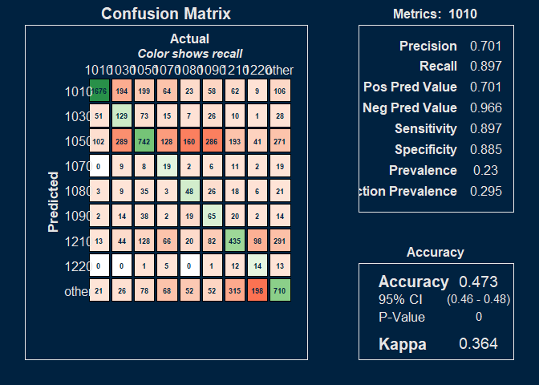
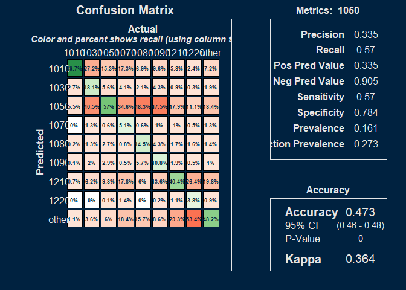
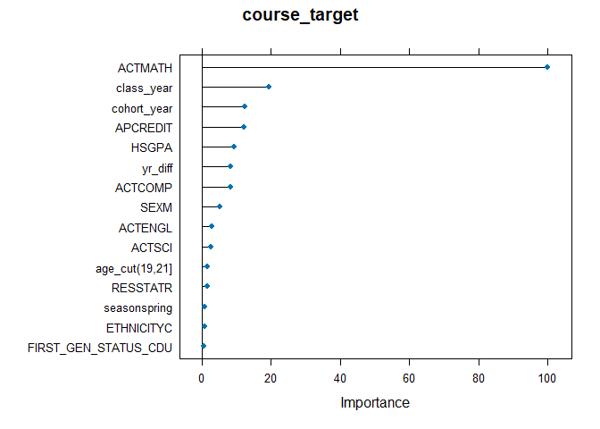

### Models  

Only one model. I could delete this section 

### Predictors  

SEX, FIRST_GEN_STATUS_CD, ETHNICITY, RESSTAT, FA_PELL, APCREDIT, HSGPA, HSPRIVATE, HONORS, ACTCOMP, ACTENGL, ACTMATH, ACTSCI, cohort_year, class_year, yr_diff, season, course_level, age_cut. 

"load" is the credit load per student per term. 
"yr_diff" is the time (expressed as fractions of a year) between the cohort date and the end of term date for the course.  

The other variables are either self-explanatory or taken directly from OBIA tables.  

# Results

Develop and report the confusion matrices 

<!-- --><!-- -->

# Variable importance

<!-- -->

