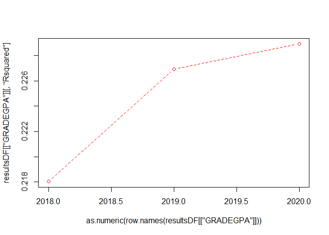
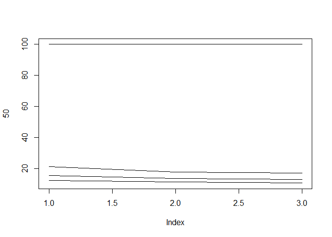

### Models  

*MODEL 1: binary* 

  - Target buckets:   
    1: "A", "A-", "B+", "B", "B-", "C+", "C", "C-"  
    0: "D+", "D", "D-", "E", "EU" 
  
*MODEL 2: trinary*  

  - Target buckets:     
    2: "A", "A-", "B+", "B", "B-"  
    1: "C+", "C", "C-"  
    0: "D+", "D", "D-", "E", "EU" 

*MODEL 3: quad* 

  - Target buckets:   
    3: "A"  
    2: "A-", "B+", "B", "B-"  
    1: "C+", "C", "C-"  
    0: "D+", "D", "D-", "E", "EU" 

*MODEL 4: grade GPA* 

  - Targets: 
    4, 3.7, 3.3, 3, 2.7, 2.3, 2, 1.7, 1.3, 1, 0.7, 0

### Predictors  

. 

"load" is the credit load per student per term. 
"yr_diff" is the time (expressed as fractions of a year) between the cohort date and the end of term date for the course.  

The other variables are either self-explanatory or taken directly from OBIA tables.  

# Results

<!-- -->

# Variable importance

<!-- -->

