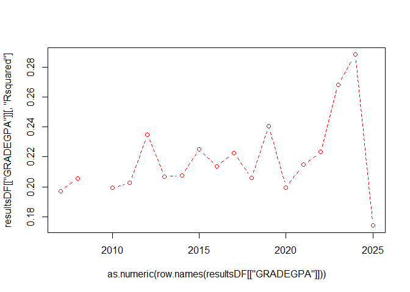
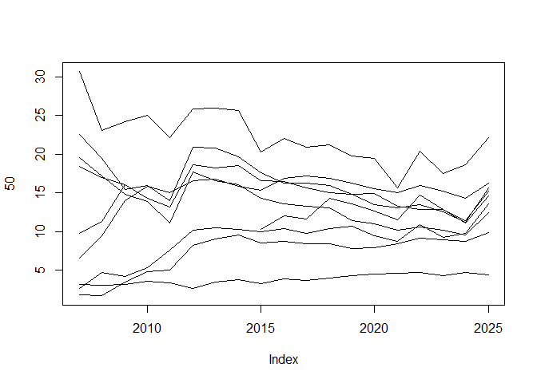

### Thoughts

So what is that 2024/2025 discontinuity?  All predictors jump from model trained on 2024, and 2025 accuracy falls.

And the ACT test scores are increasing in popularity.  Declining, then increasing.  

I think I'll try to at least knit a version of this report, and then predict the courses in overnight training. 

Or try to visualize some of the changes over time --

- How many students per year in the training set  
- Total AP credits / median ap credit for students that have them
- Some pdp plots. I guess I can't do these over time -- but I could do pdp plots showing class year.  And why is class_year -AND- cohort year shown?

Should I do a PCA?  Always love me a PCA.

### Models  

*MODEL 1: binary* 

  - Target buckets:   
    1: "A", "A-", "B+", "B", "B-", "C+", "C", "C-"  
    0: "D+", "D", "D-", "E", "EU" 
  
*MODEL 2: trinary*  

  - Target buckets:     
    2: "A", "A-", "B+", "B", "B-"  
    1: "C+", "C", "C-"  
    0: "D+", "D", "D-", "E", "EU" 

*MODEL 3: quad* 

  - Target buckets:   
    3: "A"  
    2: "A-", "B+", "B", "B-"  
    1: "C+", "C", "C-"  
    0: "D+", "D", "D-", "E", "EU" 

*MODEL 4: grade GPA* 

  - Targets: 
    4, 3.7, 3.3, 3, 2.7, 2.3, 2, 1.7, 1.3, 1, 0.7, 0

### Predictors  

. 

"load" is the credit load per student per term. 
"yr_diff" is the time (expressed as fractions of a year) between the cohort date and the end of term date for the course.  

The other variables are either self-explanatory or taken directly from OBIA tables.  

# Results


<!-- -->


# Variable importance


<!-- -->


```{=html}
<div class="plotly html-widget html-fill-item" id="htmlwidget-8ef63ed570c7a82760dd" style="width:672px;height:480px;"></div>
<script type="application/json" data-for="htmlwidget-8ef63ed570c7a82760dd">{"x":{"visdat":{"545c5a2a6bcf":["function () ","plotlyVisDat"]},"cur_data":"545c5a2a6bcf","attrs":{"545c5a2a6bcf":{"alpha_stroke":1,"sizes":[10,100],"spans":[1,20],"x":[2007,2008,2009,2010,2011,2012,2013,2014,2015,2016,2017,2018,2019,2020,2021,2022,2023,2024,2025],"y":[30.681871306368869,23.131243078089959,24.235324299437014,25.045898283525741,22.119724266171286,25.886730450096717,25.983246272763328,25.63531768994573,20.247570549903475,22.002730562347537,20.904426195080621,21.229339725128433,19.780506219719907,19.439380779571142,15.611731993352782,20.358726687057352,17.485644966492252,18.638554266212783,22.167648994898791],"type":"scatter","mode":"lines","name":"ACTMATH","hovertemplate":"<b>ACTMATH<\/b><br>Year: %{x}<br>Importance: %{y:.2f}<br><extra><\/extra>","inherit":true},"545c5a2a6bcf.1":{"alpha_stroke":1,"sizes":[10,100],"spans":[1,20],"x":[2007,2008,2009,2010,2011,2012,2013,2014,2015,2016,2017,2018,2019,2020,2021,2022,2023,2024,2025],"y":[22.597492912323055,19.494504202248361,15.425944309752929,15.983846476856364,13.970585006716163,20.937358205662658,20.811024683686277,19.640719887205684,17.573906457437559,16.245864697148633,16.293952293541889,15.937886415659436,14.814731636465295,14.961085816192062,13.220102655122416,12.854780382702058,12.856687109494969,11.39688628230636,15.229105769127385],"type":"scatter","mode":"lines","name":"ACTENGL","hovertemplate":"<b>ACTENGL<\/b><br>Year: %{x}<br>Importance: %{y:.2f}<br><extra><\/extra>","inherit":true},"545c5a2a6bcf.2":{"alpha_stroke":1,"sizes":[10,100],"spans":[1,20],"x":[2007,2008,2009,2010,2011,2012,2013,2014,2015,2016,2017,2018,2019,2020,2021,2022,2023,2024,2025],"y":[19.5590864983415,17.187672785261331,14.871503212813831,13.887434667171167,11.098339137138739,17.70650080902929,16.544256297214329,16.077975562625845,14.28934797873819,13.623919851791152,13.223861969442705,13.066392193702006,11.391501173412395,11.010383993513956,10.181441447244783,10.556140636249015,10.192949114207121,9.5297791562145218,12.417741786609241],"type":"scatter","mode":"lines","name":"ACTCOMP","hovertemplate":"<b>ACTCOMP<\/b><br>Year: %{x}<br>Importance: %{y:.2f}<br><extra><\/extra>","inherit":true},"545c5a2a6bcf.3":{"alpha_stroke":1,"sizes":[10,100],"spans":[1,20],"x":[2007,2008,2009,2010,2011,2012,2013,2014,2015,2016,2017,2018,2019,2020,2021,2022,2023,2024,2025],"y":[18.464784592771149,16.962701706044744,16.082932110663204,14.317605934061866,13.187535792202956,18.612745839063315,18.182628140450756,18.532529382072514,16.565514262804466,16.480098375921067,15.597812091501135,15.055021606978006,14.867236283103491,13.502366963155257,13.027537326409536,13.517140142597114,12.572875875430833,11.236884699860326,15.67494120361096],"type":"scatter","mode":"lines","name":"ACTSCI","hovertemplate":"<b>ACTSCI<\/b><br>Year: %{x}<br>Importance: %{y:.2f}<br><extra><\/extra>","inherit":true},"545c5a2a6bcf.4":{"alpha_stroke":1,"sizes":[10,100],"spans":[1,20],"x":[2007,2008,2009,2010,2011,2012,2013,2014,2015,2016,2017,2018,2019,2020,2021,2022,2023,2024,2025],"y":[9.7846427899564858,11.309800075311093,16.087317860871391,null,null,null,null,null,10.3085851049977,12.027147448045076,11.604375939240914,14.32722926101389,13.617507734716671,12.614697829523037,11.483777931098166,14.700653252297503,12.847731110438984,11.067601859091413,14.569610279183282],"type":"scatter","mode":"lines","name":"APCREDIT","hovertemplate":"<b>APCREDIT<\/b><br>Year: %{x}<br>Importance: %{y:.2f}<br><extra><\/extra>","inherit":true},"545c5a2a6bcf.5":{"alpha_stroke":1,"sizes":[10,100],"spans":[1,20],"x":[2007,2008,2009,2010,2011,2012,2013,2014,2015,2016,2017,2018,2019,2020,2021,2022,2023,2024,2025],"y":[6.5667640197710222,9.4709440176200079,13.989181010586613,15.846682914776375,15.04529320614779,16.554638897819473,16.77934535195174,15.899524974977593,15.294222577745925,16.84937173616191,17.186002477591504,16.866268334853782,16.308681921409146,15.554676568342069,14.998970036230835,15.923668873270353,15.182983207281531,14.267594981696016,16.310670310161139],"type":"scatter","mode":"lines","name":"yr_diff","hovertemplate":"<b>yr_diff<\/b><br>Year: %{x}<br>Importance: %{y:.2f}<br><extra><\/extra>","inherit":true},"545c5a2a6bcf.6":{"alpha_stroke":1,"sizes":[10,100],"spans":[1,20],"x":[2007,2008,2009,2010,2011,2012,2013,2014,2015,2016,2017,2018,2019,2020,2021,2022,2023,2024,2025],"y":[3.1314364033863065,3.0299512622472125,3.1058169507125264,3.6086860028189753,3.3122751054618842,2.6675180185028293,3.4965824718980443,3.7356961038144663,3.2500804785116313,3.8195654727379504,3.637293486463665,3.9632912555532798,4.3024598791233277,4.4558204726298349,4.6043195349252724,4.7317128891779232,4.3293685330748142,4.7070589458425598,4.4237702481560435],"type":"scatter","mode":"lines","name":"RESSTATR","hovertemplate":"<b>RESSTATR<\/b><br>Year: %{x}<br>Importance: %{y:.2f}<br><extra><\/extra>","inherit":true},"545c5a2a6bcf.7":{"alpha_stroke":1,"sizes":[10,100],"spans":[1,20],"x":[2007,2008,2009,2010,2011,2012,2013,2014,2015,2016,2017,2018,2019,2020,2021,2022,2023,2024,2025],"y":[2.6564192880677764,4.6867213884406578,4.1302038860109107,5.3180026137715197,7.5706202675887528,10.16126830519922,10.436399472966492,10.235396683719754,9.9680253071920593,10.421907264041339,9.7912810160475559,10.342196308707607,10.726033967789503,9.4461421309709532,8.7489827429856497,10.880999402862233,9.1903990866623708,9.7623159361992968,13.598235876812575],"type":"scatter","mode":"lines","name":"cohort_year","hovertemplate":"<b>cohort_year<\/b><br>Year: %{x}<br>Importance: %{y:.2f}<br><extra><\/extra>","inherit":true},"545c5a2a6bcf.8":{"alpha_stroke":1,"sizes":[10,100],"spans":[1,20],"x":[2007,2008,2009,2010,2011,2012,2013,2014,2015,2016,2017,2018,2019,2020,2021,2022,2023,2024,2025],"y":[1.8544345465324314,1.6645010407550269,3.4206363844840761,4.7713214552818277,5.005039764021717,8.1984887216294364,9.0120967422820097,9.59407518547542,8.4781382565283376,8.7583806511566724,8.4069790633821739,8.4159071829335641,7.7743774913795329,7.8824052208598285,8.4142371307268977,9.1536215106597361,8.9014984550805885,8.7566321499135036,9.8624576737114786],"type":"scatter","mode":"lines","name":"class_year","hovertemplate":"<b>class_year<\/b><br>Year: %{x}<br>Importance: %{y:.2f}<br><extra><\/extra>","inherit":true}},"layout":{"margin":{"b":40,"l":60,"t":25,"r":10},"xaxis":{"domain":[0,1],"automargin":true,"title":"Test Year"},"yaxis":{"domain":[0,1],"automargin":true,"title":"Variable Importance"},"hovermode":"closest","legend":{"title":{"text":"Variable"}},"showlegend":true},"source":"A","config":{"modeBarButtonsToAdd":["hoverclosest","hovercompare"],"showSendToCloud":false},"data":[{"x":[2007,2008,2009,2010,2011,2012,2013,2014,2015,2016,2017,2018,2019,2020,2021,2022,2023,2024,2025],"y":[30.681871306368869,23.131243078089959,24.235324299437014,25.045898283525741,22.119724266171286,25.886730450096717,25.983246272763328,25.63531768994573,20.247570549903475,22.002730562347537,20.904426195080621,21.229339725128433,19.780506219719907,19.439380779571142,15.611731993352782,20.358726687057352,17.485644966492252,18.638554266212783,22.167648994898791],"type":"scatter","mode":"lines","name":"ACTMATH","hovertemplate":["<b>ACTMATH<\/b><br>Year: %{x}<br>Importance: %{y:.2f}<br><extra><\/extra>","<b>ACTMATH<\/b><br>Year: %{x}<br>Importance: %{y:.2f}<br><extra><\/extra>","<b>ACTMATH<\/b><br>Year: %{x}<br>Importance: %{y:.2f}<br><extra><\/extra>","<b>ACTMATH<\/b><br>Year: %{x}<br>Importance: %{y:.2f}<br><extra><\/extra>","<b>ACTMATH<\/b><br>Year: %{x}<br>Importance: %{y:.2f}<br><extra><\/extra>","<b>ACTMATH<\/b><br>Year: %{x}<br>Importance: %{y:.2f}<br><extra><\/extra>","<b>ACTMATH<\/b><br>Year: %{x}<br>Importance: %{y:.2f}<br><extra><\/extra>","<b>ACTMATH<\/b><br>Year: %{x}<br>Importance: %{y:.2f}<br><extra><\/extra>","<b>ACTMATH<\/b><br>Year: %{x}<br>Importance: %{y:.2f}<br><extra><\/extra>","<b>ACTMATH<\/b><br>Year: %{x}<br>Importance: %{y:.2f}<br><extra><\/extra>","<b>ACTMATH<\/b><br>Year: %{x}<br>Importance: %{y:.2f}<br><extra><\/extra>","<b>ACTMATH<\/b><br>Year: %{x}<br>Importance: %{y:.2f}<br><extra><\/extra>","<b>ACTMATH<\/b><br>Year: %{x}<br>Importance: %{y:.2f}<br><extra><\/extra>","<b>ACTMATH<\/b><br>Year: %{x}<br>Importance: %{y:.2f}<br><extra><\/extra>","<b>ACTMATH<\/b><br>Year: %{x}<br>Importance: %{y:.2f}<br><extra><\/extra>","<b>ACTMATH<\/b><br>Year: %{x}<br>Importance: %{y:.2f}<br><extra><\/extra>","<b>ACTMATH<\/b><br>Year: %{x}<br>Importance: %{y:.2f}<br><extra><\/extra>","<b>ACTMATH<\/b><br>Year: %{x}<br>Importance: %{y:.2f}<br><extra><\/extra>","<b>ACTMATH<\/b><br>Year: %{x}<br>Importance: %{y:.2f}<br><extra><\/extra>"],"marker":{"color":"rgba(31,119,180,1)","line":{"color":"rgba(31,119,180,1)"}},"error_y":{"color":"rgba(31,119,180,1)"},"error_x":{"color":"rgba(31,119,180,1)"},"line":{"color":"rgba(31,119,180,1)"},"xaxis":"x","yaxis":"y","frame":null},{"x":[2007,2008,2009,2010,2011,2012,2013,2014,2015,2016,2017,2018,2019,2020,2021,2022,2023,2024,2025],"y":[22.597492912323055,19.494504202248361,15.425944309752929,15.983846476856364,13.970585006716163,20.937358205662658,20.811024683686277,19.640719887205684,17.573906457437559,16.245864697148633,16.293952293541889,15.937886415659436,14.814731636465295,14.961085816192062,13.220102655122416,12.854780382702058,12.856687109494969,11.39688628230636,15.229105769127385],"type":"scatter","mode":"lines","name":"ACTENGL","hovertemplate":["<b>ACTENGL<\/b><br>Year: %{x}<br>Importance: %{y:.2f}<br><extra><\/extra>","<b>ACTENGL<\/b><br>Year: %{x}<br>Importance: %{y:.2f}<br><extra><\/extra>","<b>ACTENGL<\/b><br>Year: %{x}<br>Importance: %{y:.2f}<br><extra><\/extra>","<b>ACTENGL<\/b><br>Year: %{x}<br>Importance: %{y:.2f}<br><extra><\/extra>","<b>ACTENGL<\/b><br>Year: %{x}<br>Importance: %{y:.2f}<br><extra><\/extra>","<b>ACTENGL<\/b><br>Year: %{x}<br>Importance: %{y:.2f}<br><extra><\/extra>","<b>ACTENGL<\/b><br>Year: %{x}<br>Importance: %{y:.2f}<br><extra><\/extra>","<b>ACTENGL<\/b><br>Year: %{x}<br>Importance: %{y:.2f}<br><extra><\/extra>","<b>ACTENGL<\/b><br>Year: %{x}<br>Importance: %{y:.2f}<br><extra><\/extra>","<b>ACTENGL<\/b><br>Year: %{x}<br>Importance: %{y:.2f}<br><extra><\/extra>","<b>ACTENGL<\/b><br>Year: %{x}<br>Importance: %{y:.2f}<br><extra><\/extra>","<b>ACTENGL<\/b><br>Year: %{x}<br>Importance: %{y:.2f}<br><extra><\/extra>","<b>ACTENGL<\/b><br>Year: %{x}<br>Importance: %{y:.2f}<br><extra><\/extra>","<b>ACTENGL<\/b><br>Year: %{x}<br>Importance: %{y:.2f}<br><extra><\/extra>","<b>ACTENGL<\/b><br>Year: %{x}<br>Importance: %{y:.2f}<br><extra><\/extra>","<b>ACTENGL<\/b><br>Year: %{x}<br>Importance: %{y:.2f}<br><extra><\/extra>","<b>ACTENGL<\/b><br>Year: %{x}<br>Importance: %{y:.2f}<br><extra><\/extra>","<b>ACTENGL<\/b><br>Year: %{x}<br>Importance: %{y:.2f}<br><extra><\/extra>","<b>ACTENGL<\/b><br>Year: %{x}<br>Importance: %{y:.2f}<br><extra><\/extra>"],"marker":{"color":"rgba(255,127,14,1)","line":{"color":"rgba(255,127,14,1)"}},"error_y":{"color":"rgba(255,127,14,1)"},"error_x":{"color":"rgba(255,127,14,1)"},"line":{"color":"rgba(255,127,14,1)"},"xaxis":"x","yaxis":"y","frame":null},{"x":[2007,2008,2009,2010,2011,2012,2013,2014,2015,2016,2017,2018,2019,2020,2021,2022,2023,2024,2025],"y":[19.5590864983415,17.187672785261331,14.871503212813831,13.887434667171167,11.098339137138739,17.70650080902929,16.544256297214329,16.077975562625845,14.28934797873819,13.623919851791152,13.223861969442705,13.066392193702006,11.391501173412395,11.010383993513956,10.181441447244783,10.556140636249015,10.192949114207121,9.5297791562145218,12.417741786609241],"type":"scatter","mode":"lines","name":"ACTCOMP","hovertemplate":["<b>ACTCOMP<\/b><br>Year: %{x}<br>Importance: %{y:.2f}<br><extra><\/extra>","<b>ACTCOMP<\/b><br>Year: %{x}<br>Importance: %{y:.2f}<br><extra><\/extra>","<b>ACTCOMP<\/b><br>Year: %{x}<br>Importance: %{y:.2f}<br><extra><\/extra>","<b>ACTCOMP<\/b><br>Year: %{x}<br>Importance: %{y:.2f}<br><extra><\/extra>","<b>ACTCOMP<\/b><br>Year: %{x}<br>Importance: %{y:.2f}<br><extra><\/extra>","<b>ACTCOMP<\/b><br>Year: %{x}<br>Importance: %{y:.2f}<br><extra><\/extra>","<b>ACTCOMP<\/b><br>Year: %{x}<br>Importance: %{y:.2f}<br><extra><\/extra>","<b>ACTCOMP<\/b><br>Year: %{x}<br>Importance: %{y:.2f}<br><extra><\/extra>","<b>ACTCOMP<\/b><br>Year: %{x}<br>Importance: %{y:.2f}<br><extra><\/extra>","<b>ACTCOMP<\/b><br>Year: %{x}<br>Importance: %{y:.2f}<br><extra><\/extra>","<b>ACTCOMP<\/b><br>Year: %{x}<br>Importance: %{y:.2f}<br><extra><\/extra>","<b>ACTCOMP<\/b><br>Year: %{x}<br>Importance: %{y:.2f}<br><extra><\/extra>","<b>ACTCOMP<\/b><br>Year: %{x}<br>Importance: %{y:.2f}<br><extra><\/extra>","<b>ACTCOMP<\/b><br>Year: %{x}<br>Importance: %{y:.2f}<br><extra><\/extra>","<b>ACTCOMP<\/b><br>Year: %{x}<br>Importance: %{y:.2f}<br><extra><\/extra>","<b>ACTCOMP<\/b><br>Year: %{x}<br>Importance: %{y:.2f}<br><extra><\/extra>","<b>ACTCOMP<\/b><br>Year: %{x}<br>Importance: %{y:.2f}<br><extra><\/extra>","<b>ACTCOMP<\/b><br>Year: %{x}<br>Importance: %{y:.2f}<br><extra><\/extra>","<b>ACTCOMP<\/b><br>Year: %{x}<br>Importance: %{y:.2f}<br><extra><\/extra>"],"marker":{"color":"rgba(44,160,44,1)","line":{"color":"rgba(44,160,44,1)"}},"error_y":{"color":"rgba(44,160,44,1)"},"error_x":{"color":"rgba(44,160,44,1)"},"line":{"color":"rgba(44,160,44,1)"},"xaxis":"x","yaxis":"y","frame":null},{"x":[2007,2008,2009,2010,2011,2012,2013,2014,2015,2016,2017,2018,2019,2020,2021,2022,2023,2024,2025],"y":[18.464784592771149,16.962701706044744,16.082932110663204,14.317605934061866,13.187535792202956,18.612745839063315,18.182628140450756,18.532529382072514,16.565514262804466,16.480098375921067,15.597812091501135,15.055021606978006,14.867236283103491,13.502366963155257,13.027537326409536,13.517140142597114,12.572875875430833,11.236884699860326,15.67494120361096],"type":"scatter","mode":"lines","name":"ACTSCI","hovertemplate":["<b>ACTSCI<\/b><br>Year: %{x}<br>Importance: %{y:.2f}<br><extra><\/extra>","<b>ACTSCI<\/b><br>Year: %{x}<br>Importance: %{y:.2f}<br><extra><\/extra>","<b>ACTSCI<\/b><br>Year: %{x}<br>Importance: %{y:.2f}<br><extra><\/extra>","<b>ACTSCI<\/b><br>Year: %{x}<br>Importance: %{y:.2f}<br><extra><\/extra>","<b>ACTSCI<\/b><br>Year: %{x}<br>Importance: %{y:.2f}<br><extra><\/extra>","<b>ACTSCI<\/b><br>Year: %{x}<br>Importance: %{y:.2f}<br><extra><\/extra>","<b>ACTSCI<\/b><br>Year: %{x}<br>Importance: %{y:.2f}<br><extra><\/extra>","<b>ACTSCI<\/b><br>Year: %{x}<br>Importance: %{y:.2f}<br><extra><\/extra>","<b>ACTSCI<\/b><br>Year: %{x}<br>Importance: %{y:.2f}<br><extra><\/extra>","<b>ACTSCI<\/b><br>Year: %{x}<br>Importance: %{y:.2f}<br><extra><\/extra>","<b>ACTSCI<\/b><br>Year: %{x}<br>Importance: %{y:.2f}<br><extra><\/extra>","<b>ACTSCI<\/b><br>Year: %{x}<br>Importance: %{y:.2f}<br><extra><\/extra>","<b>ACTSCI<\/b><br>Year: %{x}<br>Importance: %{y:.2f}<br><extra><\/extra>","<b>ACTSCI<\/b><br>Year: %{x}<br>Importance: %{y:.2f}<br><extra><\/extra>","<b>ACTSCI<\/b><br>Year: %{x}<br>Importance: %{y:.2f}<br><extra><\/extra>","<b>ACTSCI<\/b><br>Year: %{x}<br>Importance: %{y:.2f}<br><extra><\/extra>","<b>ACTSCI<\/b><br>Year: %{x}<br>Importance: %{y:.2f}<br><extra><\/extra>","<b>ACTSCI<\/b><br>Year: %{x}<br>Importance: %{y:.2f}<br><extra><\/extra>","<b>ACTSCI<\/b><br>Year: %{x}<br>Importance: %{y:.2f}<br><extra><\/extra>"],"marker":{"color":"rgba(214,39,40,1)","line":{"color":"rgba(214,39,40,1)"}},"error_y":{"color":"rgba(214,39,40,1)"},"error_x":{"color":"rgba(214,39,40,1)"},"line":{"color":"rgba(214,39,40,1)"},"xaxis":"x","yaxis":"y","frame":null},{"x":[2007,2008,2009,null,2015,2016,2017,2018,2019,2020,2021,2022,2023,2024,2025],"y":[9.7846427899564858,11.309800075311093,16.087317860871391,null,10.3085851049977,12.027147448045076,11.604375939240914,14.32722926101389,13.617507734716671,12.614697829523037,11.483777931098166,14.700653252297503,12.847731110438984,11.067601859091413,14.569610279183282],"type":"scatter","mode":"lines","name":"APCREDIT","hovertemplate":["<b>APCREDIT<\/b><br>Year: %{x}<br>Importance: %{y:.2f}<br><extra><\/extra>","<b>APCREDIT<\/b><br>Year: %{x}<br>Importance: %{y:.2f}<br><extra><\/extra>","<b>APCREDIT<\/b><br>Year: %{x}<br>Importance: %{y:.2f}<br><extra><\/extra>",null,"<b>APCREDIT<\/b><br>Year: %{x}<br>Importance: %{y:.2f}<br><extra><\/extra>","<b>APCREDIT<\/b><br>Year: %{x}<br>Importance: %{y:.2f}<br><extra><\/extra>","<b>APCREDIT<\/b><br>Year: %{x}<br>Importance: %{y:.2f}<br><extra><\/extra>","<b>APCREDIT<\/b><br>Year: %{x}<br>Importance: %{y:.2f}<br><extra><\/extra>","<b>APCREDIT<\/b><br>Year: %{x}<br>Importance: %{y:.2f}<br><extra><\/extra>","<b>APCREDIT<\/b><br>Year: %{x}<br>Importance: %{y:.2f}<br><extra><\/extra>","<b>APCREDIT<\/b><br>Year: %{x}<br>Importance: %{y:.2f}<br><extra><\/extra>","<b>APCREDIT<\/b><br>Year: %{x}<br>Importance: %{y:.2f}<br><extra><\/extra>","<b>APCREDIT<\/b><br>Year: %{x}<br>Importance: %{y:.2f}<br><extra><\/extra>","<b>APCREDIT<\/b><br>Year: %{x}<br>Importance: %{y:.2f}<br><extra><\/extra>","<b>APCREDIT<\/b><br>Year: %{x}<br>Importance: %{y:.2f}<br><extra><\/extra>"],"marker":{"color":"rgba(148,103,189,1)","line":{"color":"rgba(148,103,189,1)"}},"error_y":{"color":"rgba(148,103,189,1)"},"error_x":{"color":"rgba(148,103,189,1)"},"line":{"color":"rgba(148,103,189,1)"},"xaxis":"x","yaxis":"y","frame":null},{"x":[2007,2008,2009,2010,2011,2012,2013,2014,2015,2016,2017,2018,2019,2020,2021,2022,2023,2024,2025],"y":[6.5667640197710222,9.4709440176200079,13.989181010586613,15.846682914776375,15.04529320614779,16.554638897819473,16.77934535195174,15.899524974977593,15.294222577745925,16.84937173616191,17.186002477591504,16.866268334853782,16.308681921409146,15.554676568342069,14.998970036230835,15.923668873270353,15.182983207281531,14.267594981696016,16.310670310161139],"type":"scatter","mode":"lines","name":"yr_diff","hovertemplate":["<b>yr_diff<\/b><br>Year: %{x}<br>Importance: %{y:.2f}<br><extra><\/extra>","<b>yr_diff<\/b><br>Year: %{x}<br>Importance: %{y:.2f}<br><extra><\/extra>","<b>yr_diff<\/b><br>Year: %{x}<br>Importance: %{y:.2f}<br><extra><\/extra>","<b>yr_diff<\/b><br>Year: %{x}<br>Importance: %{y:.2f}<br><extra><\/extra>","<b>yr_diff<\/b><br>Year: %{x}<br>Importance: %{y:.2f}<br><extra><\/extra>","<b>yr_diff<\/b><br>Year: %{x}<br>Importance: %{y:.2f}<br><extra><\/extra>","<b>yr_diff<\/b><br>Year: %{x}<br>Importance: %{y:.2f}<br><extra><\/extra>","<b>yr_diff<\/b><br>Year: %{x}<br>Importance: %{y:.2f}<br><extra><\/extra>","<b>yr_diff<\/b><br>Year: %{x}<br>Importance: %{y:.2f}<br><extra><\/extra>","<b>yr_diff<\/b><br>Year: %{x}<br>Importance: %{y:.2f}<br><extra><\/extra>","<b>yr_diff<\/b><br>Year: %{x}<br>Importance: %{y:.2f}<br><extra><\/extra>","<b>yr_diff<\/b><br>Year: %{x}<br>Importance: %{y:.2f}<br><extra><\/extra>","<b>yr_diff<\/b><br>Year: %{x}<br>Importance: %{y:.2f}<br><extra><\/extra>","<b>yr_diff<\/b><br>Year: %{x}<br>Importance: %{y:.2f}<br><extra><\/extra>","<b>yr_diff<\/b><br>Year: %{x}<br>Importance: %{y:.2f}<br><extra><\/extra>","<b>yr_diff<\/b><br>Year: %{x}<br>Importance: %{y:.2f}<br><extra><\/extra>","<b>yr_diff<\/b><br>Year: %{x}<br>Importance: %{y:.2f}<br><extra><\/extra>","<b>yr_diff<\/b><br>Year: %{x}<br>Importance: %{y:.2f}<br><extra><\/extra>","<b>yr_diff<\/b><br>Year: %{x}<br>Importance: %{y:.2f}<br><extra><\/extra>"],"marker":{"color":"rgba(140,86,75,1)","line":{"color":"rgba(140,86,75,1)"}},"error_y":{"color":"rgba(140,86,75,1)"},"error_x":{"color":"rgba(140,86,75,1)"},"line":{"color":"rgba(140,86,75,1)"},"xaxis":"x","yaxis":"y","frame":null},{"x":[2007,2008,2009,2010,2011,2012,2013,2014,2015,2016,2017,2018,2019,2020,2021,2022,2023,2024,2025],"y":[3.1314364033863065,3.0299512622472125,3.1058169507125264,3.6086860028189753,3.3122751054618842,2.6675180185028293,3.4965824718980443,3.7356961038144663,3.2500804785116313,3.8195654727379504,3.637293486463665,3.9632912555532798,4.3024598791233277,4.4558204726298349,4.6043195349252724,4.7317128891779232,4.3293685330748142,4.7070589458425598,4.4237702481560435],"type":"scatter","mode":"lines","name":"RESSTATR","hovertemplate":["<b>RESSTATR<\/b><br>Year: %{x}<br>Importance: %{y:.2f}<br><extra><\/extra>","<b>RESSTATR<\/b><br>Year: %{x}<br>Importance: %{y:.2f}<br><extra><\/extra>","<b>RESSTATR<\/b><br>Year: %{x}<br>Importance: %{y:.2f}<br><extra><\/extra>","<b>RESSTATR<\/b><br>Year: %{x}<br>Importance: %{y:.2f}<br><extra><\/extra>","<b>RESSTATR<\/b><br>Year: %{x}<br>Importance: %{y:.2f}<br><extra><\/extra>","<b>RESSTATR<\/b><br>Year: %{x}<br>Importance: %{y:.2f}<br><extra><\/extra>","<b>RESSTATR<\/b><br>Year: %{x}<br>Importance: %{y:.2f}<br><extra><\/extra>","<b>RESSTATR<\/b><br>Year: %{x}<br>Importance: %{y:.2f}<br><extra><\/extra>","<b>RESSTATR<\/b><br>Year: %{x}<br>Importance: %{y:.2f}<br><extra><\/extra>","<b>RESSTATR<\/b><br>Year: %{x}<br>Importance: %{y:.2f}<br><extra><\/extra>","<b>RESSTATR<\/b><br>Year: %{x}<br>Importance: %{y:.2f}<br><extra><\/extra>","<b>RESSTATR<\/b><br>Year: %{x}<br>Importance: %{y:.2f}<br><extra><\/extra>","<b>RESSTATR<\/b><br>Year: %{x}<br>Importance: %{y:.2f}<br><extra><\/extra>","<b>RESSTATR<\/b><br>Year: %{x}<br>Importance: %{y:.2f}<br><extra><\/extra>","<b>RESSTATR<\/b><br>Year: %{x}<br>Importance: %{y:.2f}<br><extra><\/extra>","<b>RESSTATR<\/b><br>Year: %{x}<br>Importance: %{y:.2f}<br><extra><\/extra>","<b>RESSTATR<\/b><br>Year: %{x}<br>Importance: %{y:.2f}<br><extra><\/extra>","<b>RESSTATR<\/b><br>Year: %{x}<br>Importance: %{y:.2f}<br><extra><\/extra>","<b>RESSTATR<\/b><br>Year: %{x}<br>Importance: %{y:.2f}<br><extra><\/extra>"],"marker":{"color":"rgba(227,119,194,1)","line":{"color":"rgba(227,119,194,1)"}},"error_y":{"color":"rgba(227,119,194,1)"},"error_x":{"color":"rgba(227,119,194,1)"},"line":{"color":"rgba(227,119,194,1)"},"xaxis":"x","yaxis":"y","frame":null},{"x":[2007,2008,2009,2010,2011,2012,2013,2014,2015,2016,2017,2018,2019,2020,2021,2022,2023,2024,2025],"y":[2.6564192880677764,4.6867213884406578,4.1302038860109107,5.3180026137715197,7.5706202675887528,10.16126830519922,10.436399472966492,10.235396683719754,9.9680253071920593,10.421907264041339,9.7912810160475559,10.342196308707607,10.726033967789503,9.4461421309709532,8.7489827429856497,10.880999402862233,9.1903990866623708,9.7623159361992968,13.598235876812575],"type":"scatter","mode":"lines","name":"cohort_year","hovertemplate":["<b>cohort_year<\/b><br>Year: %{x}<br>Importance: %{y:.2f}<br><extra><\/extra>","<b>cohort_year<\/b><br>Year: %{x}<br>Importance: %{y:.2f}<br><extra><\/extra>","<b>cohort_year<\/b><br>Year: %{x}<br>Importance: %{y:.2f}<br><extra><\/extra>","<b>cohort_year<\/b><br>Year: %{x}<br>Importance: %{y:.2f}<br><extra><\/extra>","<b>cohort_year<\/b><br>Year: %{x}<br>Importance: %{y:.2f}<br><extra><\/extra>","<b>cohort_year<\/b><br>Year: %{x}<br>Importance: %{y:.2f}<br><extra><\/extra>","<b>cohort_year<\/b><br>Year: %{x}<br>Importance: %{y:.2f}<br><extra><\/extra>","<b>cohort_year<\/b><br>Year: %{x}<br>Importance: %{y:.2f}<br><extra><\/extra>","<b>cohort_year<\/b><br>Year: %{x}<br>Importance: %{y:.2f}<br><extra><\/extra>","<b>cohort_year<\/b><br>Year: %{x}<br>Importance: %{y:.2f}<br><extra><\/extra>","<b>cohort_year<\/b><br>Year: %{x}<br>Importance: %{y:.2f}<br><extra><\/extra>","<b>cohort_year<\/b><br>Year: %{x}<br>Importance: %{y:.2f}<br><extra><\/extra>","<b>cohort_year<\/b><br>Year: %{x}<br>Importance: %{y:.2f}<br><extra><\/extra>","<b>cohort_year<\/b><br>Year: %{x}<br>Importance: %{y:.2f}<br><extra><\/extra>","<b>cohort_year<\/b><br>Year: %{x}<br>Importance: %{y:.2f}<br><extra><\/extra>","<b>cohort_year<\/b><br>Year: %{x}<br>Importance: %{y:.2f}<br><extra><\/extra>","<b>cohort_year<\/b><br>Year: %{x}<br>Importance: %{y:.2f}<br><extra><\/extra>","<b>cohort_year<\/b><br>Year: %{x}<br>Importance: %{y:.2f}<br><extra><\/extra>","<b>cohort_year<\/b><br>Year: %{x}<br>Importance: %{y:.2f}<br><extra><\/extra>"],"marker":{"color":"rgba(127,127,127,1)","line":{"color":"rgba(127,127,127,1)"}},"error_y":{"color":"rgba(127,127,127,1)"},"error_x":{"color":"rgba(127,127,127,1)"},"line":{"color":"rgba(127,127,127,1)"},"xaxis":"x","yaxis":"y","frame":null},{"x":[2007,2008,2009,2010,2011,2012,2013,2014,2015,2016,2017,2018,2019,2020,2021,2022,2023,2024,2025],"y":[1.8544345465324314,1.6645010407550269,3.4206363844840761,4.7713214552818277,5.005039764021717,8.1984887216294364,9.0120967422820097,9.59407518547542,8.4781382565283376,8.7583806511566724,8.4069790633821739,8.4159071829335641,7.7743774913795329,7.8824052208598285,8.4142371307268977,9.1536215106597361,8.9014984550805885,8.7566321499135036,9.8624576737114786],"type":"scatter","mode":"lines","name":"class_year","hovertemplate":["<b>class_year<\/b><br>Year: %{x}<br>Importance: %{y:.2f}<br><extra><\/extra>","<b>class_year<\/b><br>Year: %{x}<br>Importance: %{y:.2f}<br><extra><\/extra>","<b>class_year<\/b><br>Year: %{x}<br>Importance: %{y:.2f}<br><extra><\/extra>","<b>class_year<\/b><br>Year: %{x}<br>Importance: %{y:.2f}<br><extra><\/extra>","<b>class_year<\/b><br>Year: %{x}<br>Importance: %{y:.2f}<br><extra><\/extra>","<b>class_year<\/b><br>Year: %{x}<br>Importance: %{y:.2f}<br><extra><\/extra>","<b>class_year<\/b><br>Year: %{x}<br>Importance: %{y:.2f}<br><extra><\/extra>","<b>class_year<\/b><br>Year: %{x}<br>Importance: %{y:.2f}<br><extra><\/extra>","<b>class_year<\/b><br>Year: %{x}<br>Importance: %{y:.2f}<br><extra><\/extra>","<b>class_year<\/b><br>Year: %{x}<br>Importance: %{y:.2f}<br><extra><\/extra>","<b>class_year<\/b><br>Year: %{x}<br>Importance: %{y:.2f}<br><extra><\/extra>","<b>class_year<\/b><br>Year: %{x}<br>Importance: %{y:.2f}<br><extra><\/extra>","<b>class_year<\/b><br>Year: %{x}<br>Importance: %{y:.2f}<br><extra><\/extra>","<b>class_year<\/b><br>Year: %{x}<br>Importance: %{y:.2f}<br><extra><\/extra>","<b>class_year<\/b><br>Year: %{x}<br>Importance: %{y:.2f}<br><extra><\/extra>","<b>class_year<\/b><br>Year: %{x}<br>Importance: %{y:.2f}<br><extra><\/extra>","<b>class_year<\/b><br>Year: %{x}<br>Importance: %{y:.2f}<br><extra><\/extra>","<b>class_year<\/b><br>Year: %{x}<br>Importance: %{y:.2f}<br><extra><\/extra>","<b>class_year<\/b><br>Year: %{x}<br>Importance: %{y:.2f}<br><extra><\/extra>"],"marker":{"color":"rgba(188,189,34,1)","line":{"color":"rgba(188,189,34,1)"}},"error_y":{"color":"rgba(188,189,34,1)"},"error_x":{"color":"rgba(188,189,34,1)"},"line":{"color":"rgba(188,189,34,1)"},"xaxis":"x","yaxis":"y","frame":null}],"highlight":{"on":"plotly_click","persistent":false,"dynamic":false,"selectize":false,"opacityDim":0.20000000000000001,"selected":{"opacity":1},"debounce":0},"shinyEvents":["plotly_hover","plotly_click","plotly_selected","plotly_relayout","plotly_brushed","plotly_brushing","plotly_clickannotation","plotly_doubleclick","plotly_deselect","plotly_afterplot","plotly_sunburstclick"],"base_url":"https://plot.ly"},"evals":[],"jsHooks":[]}</script>
```


