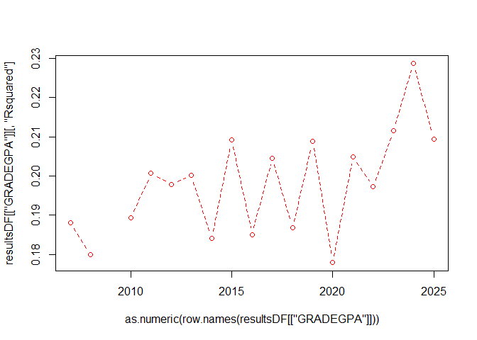
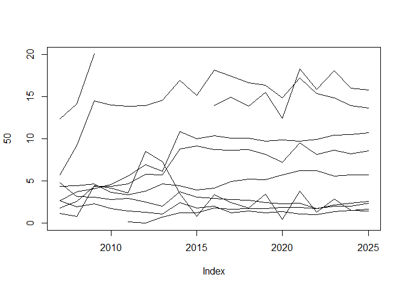

### SUMMARY 

### METHODOLOGY 

All math courses taken by first time freshmen were identified. Each student's first math courses were identified (or multiple courses if taken in the same term.)   Grade performance for these math courses was queried.  These are called the initial math courses.   

Predictive models were trained with package "xgboost" (extreme gradient boosting) with five-fold cross validation and a grid search pattern (nrounds = (100,200); max_depth(3,6); eta(0.05,0.2); colsample_bytree(0.8); subsample(0.8).)    

An expanding window of historical data was used, where one model was trained per year for nineteen models.  Each model incrementally added an additional year's data and predicted on the subsequent year.  For example, the predicted course selection for the year 2010 was trained on data from the years 2005 to 2009.  The predicted course selection for the year 2024 was trained on data from the years 2005 to 2023.  

A value for math course was predicted.  

#### Variables 

The variables included: 

*Demographics:* 

  * Age (less than 17 yrs old/17/18/19 or 20/greater than 21 years old)
  * Sex (male or female)
  * First generation status
  * Ethnicity 
  
*High school information and performance:*  

  * High school GPA 
  * Number of AP credits
  * Whether the high school was public or private   
  * Honors achievement

*Test scores:*    

  * ACT Math
  * ACT English
  * ACT Science
  * ACT comprehensive

*University information:*  

  * Residence status  
  * Pell grant eligibility  
  * Cohort year (2005 to 2024)
  * Class year (2005 to 2025)
  * Years from the cohort date (always fall of the year) until the first term with math courses 
  * Season (spring, summer, or fall)  

#### Filters  

The following filters were applied: 

 * Math labs are filtered out.  
 * Courses higher than 3000 level were removed. 
 * Students younger than 11 yrs old were removed. 
 * Withdraw and "rare" grades of V, I, NC, and CR were removed.  
 * Students with high school GPA values of zero were removed. 
 * Courses from students with unusually high credits taken that semester (greater than 99th percentile) were removed.  
 * Courses taken more than half a year prior to the cohort date (where all cohort dates are in the fall) were removed   
 * All records with incomplete information were removed.  

#### Transformations    

The following transformations were applied: 

  * AP credit values of "NA" were converted to zero.  
  * Math courses with ordered enrollment above the 95th percentile of cumulative total were combined as "other"  
  
#### Target values    

Each model predicted a value for a math course out of the following possibilities:  

MATH_1010, MATH_1050, MATH_1210, MATH_1030, MATH_1090, MATH_1070, MATH_1220, MATH_1080, MATH_1060, MATH_1310, MATH_2210, MATH_990, MATH_1100, MATH_1250 or "other".
 
The following math courses were combined into "other":  

MATH_1040, MATH_1311, MATH_1260, MATH_950, MATH_1270, MATH_1320, MATH_1321, MATH_1215, MATH_1170, MATH_2270, MATH_2250, MATH_1035, MATH_2000, MATH_1280, MATH_2200, MATH_1105, MATH_2271, MATH_2015, MATH_2280, MATH_2160, UC_1000, MATH_1180.
  
### DISCUSSION  

### CONCLUSIONS  

### RESULTS 


```{=html}
<div class="plotly html-widget html-fill-item" id="htmlwidget-a2efb31248a71289c609" style="width:672px;height:480px;"></div>
<script type="application/json" data-for="htmlwidget-a2efb31248a71289c609">{"x":{"visdat":{"77f429de76de":["function () ","plotlyVisDat"]},"cur_data":"77f429de76de","attrs":{"77f429de76de":{"alpha_stroke":1,"sizes":[10,100],"spans":[1,20],"x":[2007,2008,2009,2010,2011,2012,2013,2014,2015,2016,2017,2018,2019,2020,2021,2022,2023,2024],"y":[0.18802179003294422,0.17994713198754,null,0.18934505687355518,0.20070730865950634,0.19786878862667312,0.20011952473551428,0.18411968261380923,0.20915872357252341,0.18505846989011573,0.20452186002143466,0.18680723756917056,0.20885566847869066,0.17789103918025095,0.20485779697763659,0.19730128472960376,0.21165389638524507,0.22868022346456882],"name":"GPA Model","type":"scatter","mode":"lines+markers","inherit":true},"77f429de76de.1":{"alpha_stroke":1,"sizes":[10,100],"spans":[1,20],"x":[2007,2008,2009,2010,2011,2012,2013,2014,2015,2016,2017,2018,2019,2020,2021,2022,2023,2024],"y":[0.17684400590267216,0.21013545051712479,null,0.21125361421561603,0.21948151839128791,0.21211005256968371,0.2090168630073255,0.19405743251244287,0.21450107682612829,0.22697083126865222,0.23861712960408085,0.22311331551167607,0.25327201897854057,0.20717504825523067,0.24220275745982095,0.22322361275635491,0.25309105081916028,0.26080024721155692],"name":"Quad Model","type":"scatter","mode":"lines+markers","inherit":true}},"layout":{"margin":{"b":40,"l":60,"t":25,"r":10},"title":"R-squared Over Years","xaxis":{"domain":[0,1],"automargin":true,"title":"Year"},"yaxis":{"domain":[0,1],"automargin":true,"title":"R-squared"},"hovermode":"closest","showlegend":true},"source":"A","config":{"modeBarButtonsToAdd":["hoverclosest","hovercompare"],"showSendToCloud":false},"data":[{"x":[2007,2008,null,2010,2011,2012,2013,2014,2015,2016,2017,2018,2019,2020,2021,2022,2023,2024],"y":[0.18802179003294422,0.17994713198754,null,0.18934505687355518,0.20070730865950634,0.19786878862667312,0.20011952473551428,0.18411968261380923,0.20915872357252341,0.18505846989011573,0.20452186002143466,0.18680723756917056,0.20885566847869066,0.17789103918025095,0.20485779697763659,0.19730128472960376,0.21165389638524507,0.22868022346456882],"name":"GPA Model","type":"scatter","mode":"lines+markers","marker":{"color":"rgba(31,119,180,1)","line":{"color":"rgba(31,119,180,1)"}},"error_y":{"color":"rgba(31,119,180,1)"},"error_x":{"color":"rgba(31,119,180,1)"},"line":{"color":"rgba(31,119,180,1)"},"xaxis":"x","yaxis":"y","frame":null},{"x":[2007,2008,null,2010,2011,2012,2013,2014,2015,2016,2017,2018,2019,2020,2021,2022,2023,2024],"y":[0.17684400590267216,0.21013545051712479,null,0.21125361421561603,0.21948151839128791,0.21211005256968371,0.2090168630073255,0.19405743251244287,0.21450107682612829,0.22697083126865222,0.23861712960408085,0.22311331551167607,0.25327201897854057,0.20717504825523067,0.24220275745982095,0.22322361275635491,0.25309105081916028,0.26080024721155692],"name":"Quad Model","type":"scatter","mode":"lines+markers","marker":{"color":"rgba(255,127,14,1)","line":{"color":"rgba(255,127,14,1)"}},"error_y":{"color":"rgba(255,127,14,1)"},"error_x":{"color":"rgba(255,127,14,1)"},"line":{"color":"rgba(255,127,14,1)"},"xaxis":"x","yaxis":"y","frame":null}],"highlight":{"on":"plotly_click","persistent":false,"dynamic":false,"selectize":false,"opacityDim":0.20000000000000001,"selected":{"opacity":1},"debounce":0},"shinyEvents":["plotly_hover","plotly_click","plotly_selected","plotly_relayout","plotly_brushed","plotly_brushing","plotly_clickannotation","plotly_doubleclick","plotly_deselect","plotly_afterplot","plotly_sunburstclick"],"base_url":"https://plot.ly"},"evals":[],"jsHooks":[]}</script>
```

```{=html}
<div class="plotly html-widget html-fill-item" id="htmlwidget-b1f90e6a8cc3eaad2630" style="width:672px;height:480px;"></div>
<script type="application/json" data-for="htmlwidget-b1f90e6a8cc3eaad2630">{"x":{"visdat":{"77f451935444":["function () ","plotlyVisDat"]},"cur_data":"77f451935444","attrs":{"77f451935444":{"alpha_stroke":1,"sizes":[10,100],"spans":[1,20],"x":[2007,2008,2009,2010,2011,2012,2013,2014,2015,2016,2017,2018,2019,2020,2021,2022,2023,2024],"y":[0.97241445294884121,0.98787112632726082,1.1709841872672209,1.0321813827287047,0.93072643919440046,0.9299009165819373,0.97391241227132896,0.91187358043088673,0.89673939180868711,0.93265937445972469,0.9144866447385348,0.95003878900447347,0.8790230308935274,0.93928362140638966,0.86867630711630839,0.9278284882874468,0.99785735254203112,0.96249532997146137],"name":"GPA Model","type":"scatter","mode":"lines+markers","inherit":true},"77f451935444.1":{"alpha_stroke":1,"sizes":[10,100],"spans":[1,20],"x":[2007,2008,2009,2010,2011,2012,2013,2014,2015,2016,2017,2018,2019,2020,2021,2022,2023,2024],"y":[0.77890335458173143,0.78762743612560249,0.95607224194164697,0.78533300569771514,0.75889752428043344,0.75048305424323591,0.76403401616087496,0.75415426076126024,0.7416040786131175,0.74396598151697368,0.72637466634303105,0.7456848876882185,0.70382036558858874,0.74181273666520908,0.69821392414557026,0.752678234060289,0.76049725822773873,0.75292571506164929],"name":"Quad Model","type":"scatter","mode":"lines+markers","inherit":true}},"layout":{"margin":{"b":40,"l":60,"t":25,"r":10},"title":"MAE Over Years","xaxis":{"domain":[0,1],"automargin":true,"title":"Year"},"yaxis":{"domain":[0,1],"automargin":true,"title":"MAE"},"hovermode":"closest","showlegend":true},"source":"A","config":{"modeBarButtonsToAdd":["hoverclosest","hovercompare"],"showSendToCloud":false},"data":[{"x":[2007,2008,2009,2010,2011,2012,2013,2014,2015,2016,2017,2018,2019,2020,2021,2022,2023,2024],"y":[0.97241445294884121,0.98787112632726082,1.1709841872672209,1.0321813827287047,0.93072643919440046,0.9299009165819373,0.97391241227132896,0.91187358043088673,0.89673939180868711,0.93265937445972469,0.9144866447385348,0.95003878900447347,0.8790230308935274,0.93928362140638966,0.86867630711630839,0.9278284882874468,0.99785735254203112,0.96249532997146137],"name":"GPA Model","type":"scatter","mode":"lines+markers","marker":{"color":"rgba(31,119,180,1)","line":{"color":"rgba(31,119,180,1)"}},"error_y":{"color":"rgba(31,119,180,1)"},"error_x":{"color":"rgba(31,119,180,1)"},"line":{"color":"rgba(31,119,180,1)"},"xaxis":"x","yaxis":"y","frame":null},{"x":[2007,2008,2009,2010,2011,2012,2013,2014,2015,2016,2017,2018,2019,2020,2021,2022,2023,2024],"y":[0.77890335458173143,0.78762743612560249,0.95607224194164697,0.78533300569771514,0.75889752428043344,0.75048305424323591,0.76403401616087496,0.75415426076126024,0.7416040786131175,0.74396598151697368,0.72637466634303105,0.7456848876882185,0.70382036558858874,0.74181273666520908,0.69821392414557026,0.752678234060289,0.76049725822773873,0.75292571506164929],"name":"Quad Model","type":"scatter","mode":"lines+markers","marker":{"color":"rgba(255,127,14,1)","line":{"color":"rgba(255,127,14,1)"}},"error_y":{"color":"rgba(255,127,14,1)"},"error_x":{"color":"rgba(255,127,14,1)"},"line":{"color":"rgba(255,127,14,1)"},"xaxis":"x","yaxis":"y","frame":null}],"highlight":{"on":"plotly_click","persistent":false,"dynamic":false,"selectize":false,"opacityDim":0.20000000000000001,"selected":{"opacity":1},"debounce":0},"shinyEvents":["plotly_hover","plotly_click","plotly_selected","plotly_relayout","plotly_brushed","plotly_brushing","plotly_clickannotation","plotly_doubleclick","plotly_deselect","plotly_afterplot","plotly_sunburstclick"],"base_url":"https://plot.ly"},"evals":[],"jsHooks":[]}</script>
```

```{=html}
<div class="plotly html-widget html-fill-item" id="htmlwidget-62213f714914f61f6185" style="width:672px;height:480px;"></div>
<script type="application/json" data-for="htmlwidget-62213f714914f61f6185">{"x":{"visdat":{"77f452bf1c50":["function () ","plotlyVisDat"]},"cur_data":"77f452bf1c50","attrs":{"77f452bf1c50":{"alpha_stroke":1,"sizes":[10,100],"spans":[1,20],"x":[2007,2008,2009,2010,2011,2012,2013,2014,2015,2016,2017,2018,2019,2020,2021,2022,2023,2024],"y":[1.1836306549487925,1.2198857717949694,1.4095845339437376,1.2182427417222534,1.1452239728039191,1.1365812343631199,1.1705515960677539,1.1275633966148044,1.0994662857019388,1.1343273218006535,1.1260846763657517,1.1551831617421264,1.0877555282767608,1.1380893750186689,1.0771916649832569,1.1354929868098196,1.1800258326429773,1.1590179417093607],"name":"GPA Model","type":"scatter","mode":"lines+markers","inherit":true},"77f452bf1c50.1":{"alpha_stroke":1,"sizes":[10,100],"spans":[1,20],"x":[2007,2008,2009,2010,2011,2012,2013,2014,2015,2016,2017,2018,2019,2020,2021,2022,2023,2024],"y":[0.94795727911999594,0.95495871278114108,1.15872600460342,0.94969170240728262,0.93023702087519844,0.92152289030601175,0.93916137965239799,0.91565891681714284,0.91052510371719997,0.90570476094749874,0.89640425844974636,0.91115594762122942,0.86705513756378949,0.90998902460155551,0.8667499548211709,0.92159045937812545,0.91960754519150589,0.91640783254490588],"name":"Quad Model","type":"scatter","mode":"lines+markers","inherit":true}},"layout":{"margin":{"b":40,"l":60,"t":25,"r":10},"title":"RMSE Over Years","xaxis":{"domain":[0,1],"automargin":true,"title":"Year"},"yaxis":{"domain":[0,1],"automargin":true,"title":"RMSE"},"hovermode":"closest","showlegend":true},"source":"A","config":{"modeBarButtonsToAdd":["hoverclosest","hovercompare"],"showSendToCloud":false},"data":[{"x":[2007,2008,2009,2010,2011,2012,2013,2014,2015,2016,2017,2018,2019,2020,2021,2022,2023,2024],"y":[1.1836306549487925,1.2198857717949694,1.4095845339437376,1.2182427417222534,1.1452239728039191,1.1365812343631199,1.1705515960677539,1.1275633966148044,1.0994662857019388,1.1343273218006535,1.1260846763657517,1.1551831617421264,1.0877555282767608,1.1380893750186689,1.0771916649832569,1.1354929868098196,1.1800258326429773,1.1590179417093607],"name":"GPA Model","type":"scatter","mode":"lines+markers","marker":{"color":"rgba(31,119,180,1)","line":{"color":"rgba(31,119,180,1)"}},"error_y":{"color":"rgba(31,119,180,1)"},"error_x":{"color":"rgba(31,119,180,1)"},"line":{"color":"rgba(31,119,180,1)"},"xaxis":"x","yaxis":"y","frame":null},{"x":[2007,2008,2009,2010,2011,2012,2013,2014,2015,2016,2017,2018,2019,2020,2021,2022,2023,2024],"y":[0.94795727911999594,0.95495871278114108,1.15872600460342,0.94969170240728262,0.93023702087519844,0.92152289030601175,0.93916137965239799,0.91565891681714284,0.91052510371719997,0.90570476094749874,0.89640425844974636,0.91115594762122942,0.86705513756378949,0.90998902460155551,0.8667499548211709,0.92159045937812545,0.91960754519150589,0.91640783254490588],"name":"Quad Model","type":"scatter","mode":"lines+markers","marker":{"color":"rgba(255,127,14,1)","line":{"color":"rgba(255,127,14,1)"}},"error_y":{"color":"rgba(255,127,14,1)"},"error_x":{"color":"rgba(255,127,14,1)"},"line":{"color":"rgba(255,127,14,1)"},"xaxis":"x","yaxis":"y","frame":null}],"highlight":{"on":"plotly_click","persistent":false,"dynamic":false,"selectize":false,"opacityDim":0.20000000000000001,"selected":{"opacity":1},"debounce":0},"shinyEvents":["plotly_hover","plotly_click","plotly_selected","plotly_relayout","plotly_brushed","plotly_brushing","plotly_clickannotation","plotly_doubleclick","plotly_deselect","plotly_afterplot","plotly_sunburstclick"],"base_url":"https://plot.ly"},"evals":[],"jsHooks":[]}</script>
```


```{=html}
<div class="plotly html-widget html-fill-item" id="htmlwidget-0f9a114b1e3db804c127" style="width:672px;height:480px;"></div>
<script type="application/json" data-for="htmlwidget-0f9a114b1e3db804c127">{"x":{"visdat":{"77f42a111d56":["function () ","plotlyVisDat"]},"cur_data":"77f42a111d56","attrs":{"77f42a111d56":{"alpha_stroke":1,"sizes":[10,100],"spans":[1,20],"x":[2007,2008,2009,2010,2011,2012,2013,2014,2015,2016,2017,2018,2019,2020,2021,2022,2023,2024,2025],"y":[100,100,100,100,100,100,100,100,100,100,100,100,100,100,100,100,100,100,100],"type":"scatter","mode":"lines","name":"HSGPA","hovertemplate":"<b>HSGPA<\/b><br>Year: %{x}<br>Importance: %{y:.2f}<br><extra><\/extra>","inherit":true},"77f42a111d56.1":{"alpha_stroke":1,"sizes":[10,100],"spans":[1,20],"x":[2007,2008,2009,2010,2011,2012,2013,2014,2015,2016,2017,2018,2019,2020,2021,2022,2023,2024,2025],"y":[12.333914811040403,14.148460930397706,20.013393002605564,null,null,null,null,null,null,13.952435170937566,14.903038662339998,13.825370730104721,15.490404254081886,12.399134597444492,18.279694931872204,15.858739326018981,18.023810456455188,16.014405596665338,15.787010932719703],"type":"scatter","mode":"lines","name":"APCREDIT","hovertemplate":"<b>APCREDIT<\/b><br>Year: %{x}<br>Importance: %{y:.2f}<br><extra><\/extra>","inherit":true},"77f42a111d56.2":{"alpha_stroke":1,"sizes":[10,100],"spans":[1,20],"x":[2007,2008,2009,2010,2011,2012,2013,2014,2015,2016,2017,2018,2019,2020,2021,2022,2023,2024,2025],"y":[5.6952127157976147,9.1939775199585334,14.506004352939858,13.974229553877358,13.851242188885315,13.93266341517449,14.585390172051349,16.902859921061875,15.145071709547567,18.112202120259894,17.40369304124237,16.660185471093065,16.366630665849726,14.836860270530597,17.165677286102639,15.324719444445265,14.841515872193817,13.908133358811996,13.627158429932321],"type":"scatter","mode":"lines","name":"yr_diff","hovertemplate":"<b>yr_diff<\/b><br>Year: %{x}<br>Importance: %{y:.2f}<br><extra><\/extra>","inherit":true},"77f42a111d56.3":{"alpha_stroke":1,"sizes":[10,100],"spans":[1,20],"x":[2007,2008,2009,2010,2011,2012,2013,2014,2015,2016,2017,2018,2019,2020,2021,2022,2023,2024,2025],"y":[2.6873113376096236,3.7612646672892427,4.0788509283156014,4.620093797282478,5.5984633734605858,6.9129033183012654,6.1405441740774753,10.820854659671173,10.001628389594789,10.352672999593011,10.067266365140039,10.06498709705142,9.7494065746301644,9.8666734640112423,9.7076626617716411,9.8927046173773245,10.440166021228443,10.528902905409067,10.746936809868851],"type":"scatter","mode":"lines","name":"cohort_year","hovertemplate":"<b>cohort_year<\/b><br>Year: %{x}<br>Importance: %{y:.2f}<br><extra><\/extra>","inherit":true}},"layout":{"margin":{"b":40,"l":60,"t":25,"r":10},"title":"Variable Importance Over Time (all variables, GPA)","xaxis":{"domain":[0,1],"automargin":true,"title":"Test Year"},"yaxis":{"domain":[0,1],"automargin":true,"title":"Variable Importance"},"hovermode":"closest","legend":{"title":{"text":"Variable"}},"showlegend":true},"source":"A","config":{"modeBarButtonsToAdd":["hoverclosest","hovercompare"],"showSendToCloud":false},"data":[{"x":[2007,2008,2009,2010,2011,2012,2013,2014,2015,2016,2017,2018,2019,2020,2021,2022,2023,2024,2025],"y":[100,100,100,100,100,100,100,100,100,100,100,100,100,100,100,100,100,100,100],"type":"scatter","mode":"lines","name":"HSGPA","hovertemplate":["<b>HSGPA<\/b><br>Year: %{x}<br>Importance: %{y:.2f}<br><extra><\/extra>","<b>HSGPA<\/b><br>Year: %{x}<br>Importance: %{y:.2f}<br><extra><\/extra>","<b>HSGPA<\/b><br>Year: %{x}<br>Importance: %{y:.2f}<br><extra><\/extra>","<b>HSGPA<\/b><br>Year: %{x}<br>Importance: %{y:.2f}<br><extra><\/extra>","<b>HSGPA<\/b><br>Year: %{x}<br>Importance: %{y:.2f}<br><extra><\/extra>","<b>HSGPA<\/b><br>Year: %{x}<br>Importance: %{y:.2f}<br><extra><\/extra>","<b>HSGPA<\/b><br>Year: %{x}<br>Importance: %{y:.2f}<br><extra><\/extra>","<b>HSGPA<\/b><br>Year: %{x}<br>Importance: %{y:.2f}<br><extra><\/extra>","<b>HSGPA<\/b><br>Year: %{x}<br>Importance: %{y:.2f}<br><extra><\/extra>","<b>HSGPA<\/b><br>Year: %{x}<br>Importance: %{y:.2f}<br><extra><\/extra>","<b>HSGPA<\/b><br>Year: %{x}<br>Importance: %{y:.2f}<br><extra><\/extra>","<b>HSGPA<\/b><br>Year: %{x}<br>Importance: %{y:.2f}<br><extra><\/extra>","<b>HSGPA<\/b><br>Year: %{x}<br>Importance: %{y:.2f}<br><extra><\/extra>","<b>HSGPA<\/b><br>Year: %{x}<br>Importance: %{y:.2f}<br><extra><\/extra>","<b>HSGPA<\/b><br>Year: %{x}<br>Importance: %{y:.2f}<br><extra><\/extra>","<b>HSGPA<\/b><br>Year: %{x}<br>Importance: %{y:.2f}<br><extra><\/extra>","<b>HSGPA<\/b><br>Year: %{x}<br>Importance: %{y:.2f}<br><extra><\/extra>","<b>HSGPA<\/b><br>Year: %{x}<br>Importance: %{y:.2f}<br><extra><\/extra>","<b>HSGPA<\/b><br>Year: %{x}<br>Importance: %{y:.2f}<br><extra><\/extra>"],"marker":{"color":"rgba(31,119,180,1)","line":{"color":"rgba(31,119,180,1)"}},"error_y":{"color":"rgba(31,119,180,1)"},"error_x":{"color":"rgba(31,119,180,1)"},"line":{"color":"rgba(31,119,180,1)"},"xaxis":"x","yaxis":"y","frame":null},{"x":[2007,2008,2009,null,2016,2017,2018,2019,2020,2021,2022,2023,2024,2025],"y":[12.333914811040403,14.148460930397706,20.013393002605564,null,13.952435170937566,14.903038662339998,13.825370730104721,15.490404254081886,12.399134597444492,18.279694931872204,15.858739326018981,18.023810456455188,16.014405596665338,15.787010932719703],"type":"scatter","mode":"lines","name":"APCREDIT","hovertemplate":["<b>APCREDIT<\/b><br>Year: %{x}<br>Importance: %{y:.2f}<br><extra><\/extra>","<b>APCREDIT<\/b><br>Year: %{x}<br>Importance: %{y:.2f}<br><extra><\/extra>","<b>APCREDIT<\/b><br>Year: %{x}<br>Importance: %{y:.2f}<br><extra><\/extra>",null,"<b>APCREDIT<\/b><br>Year: %{x}<br>Importance: %{y:.2f}<br><extra><\/extra>","<b>APCREDIT<\/b><br>Year: %{x}<br>Importance: %{y:.2f}<br><extra><\/extra>","<b>APCREDIT<\/b><br>Year: %{x}<br>Importance: %{y:.2f}<br><extra><\/extra>","<b>APCREDIT<\/b><br>Year: %{x}<br>Importance: %{y:.2f}<br><extra><\/extra>","<b>APCREDIT<\/b><br>Year: %{x}<br>Importance: %{y:.2f}<br><extra><\/extra>","<b>APCREDIT<\/b><br>Year: %{x}<br>Importance: %{y:.2f}<br><extra><\/extra>","<b>APCREDIT<\/b><br>Year: %{x}<br>Importance: %{y:.2f}<br><extra><\/extra>","<b>APCREDIT<\/b><br>Year: %{x}<br>Importance: %{y:.2f}<br><extra><\/extra>","<b>APCREDIT<\/b><br>Year: %{x}<br>Importance: %{y:.2f}<br><extra><\/extra>","<b>APCREDIT<\/b><br>Year: %{x}<br>Importance: %{y:.2f}<br><extra><\/extra>"],"marker":{"color":"rgba(255,127,14,1)","line":{"color":"rgba(255,127,14,1)"}},"error_y":{"color":"rgba(255,127,14,1)"},"error_x":{"color":"rgba(255,127,14,1)"},"line":{"color":"rgba(255,127,14,1)"},"xaxis":"x","yaxis":"y","frame":null},{"x":[2007,2008,2009,2010,2011,2012,2013,2014,2015,2016,2017,2018,2019,2020,2021,2022,2023,2024,2025],"y":[5.6952127157976147,9.1939775199585334,14.506004352939858,13.974229553877358,13.851242188885315,13.93266341517449,14.585390172051349,16.902859921061875,15.145071709547567,18.112202120259894,17.40369304124237,16.660185471093065,16.366630665849726,14.836860270530597,17.165677286102639,15.324719444445265,14.841515872193817,13.908133358811996,13.627158429932321],"type":"scatter","mode":"lines","name":"yr_diff","hovertemplate":["<b>yr_diff<\/b><br>Year: %{x}<br>Importance: %{y:.2f}<br><extra><\/extra>","<b>yr_diff<\/b><br>Year: %{x}<br>Importance: %{y:.2f}<br><extra><\/extra>","<b>yr_diff<\/b><br>Year: %{x}<br>Importance: %{y:.2f}<br><extra><\/extra>","<b>yr_diff<\/b><br>Year: %{x}<br>Importance: %{y:.2f}<br><extra><\/extra>","<b>yr_diff<\/b><br>Year: %{x}<br>Importance: %{y:.2f}<br><extra><\/extra>","<b>yr_diff<\/b><br>Year: %{x}<br>Importance: %{y:.2f}<br><extra><\/extra>","<b>yr_diff<\/b><br>Year: %{x}<br>Importance: %{y:.2f}<br><extra><\/extra>","<b>yr_diff<\/b><br>Year: %{x}<br>Importance: %{y:.2f}<br><extra><\/extra>","<b>yr_diff<\/b><br>Year: %{x}<br>Importance: %{y:.2f}<br><extra><\/extra>","<b>yr_diff<\/b><br>Year: %{x}<br>Importance: %{y:.2f}<br><extra><\/extra>","<b>yr_diff<\/b><br>Year: %{x}<br>Importance: %{y:.2f}<br><extra><\/extra>","<b>yr_diff<\/b><br>Year: %{x}<br>Importance: %{y:.2f}<br><extra><\/extra>","<b>yr_diff<\/b><br>Year: %{x}<br>Importance: %{y:.2f}<br><extra><\/extra>","<b>yr_diff<\/b><br>Year: %{x}<br>Importance: %{y:.2f}<br><extra><\/extra>","<b>yr_diff<\/b><br>Year: %{x}<br>Importance: %{y:.2f}<br><extra><\/extra>","<b>yr_diff<\/b><br>Year: %{x}<br>Importance: %{y:.2f}<br><extra><\/extra>","<b>yr_diff<\/b><br>Year: %{x}<br>Importance: %{y:.2f}<br><extra><\/extra>","<b>yr_diff<\/b><br>Year: %{x}<br>Importance: %{y:.2f}<br><extra><\/extra>","<b>yr_diff<\/b><br>Year: %{x}<br>Importance: %{y:.2f}<br><extra><\/extra>"],"marker":{"color":"rgba(44,160,44,1)","line":{"color":"rgba(44,160,44,1)"}},"error_y":{"color":"rgba(44,160,44,1)"},"error_x":{"color":"rgba(44,160,44,1)"},"line":{"color":"rgba(44,160,44,1)"},"xaxis":"x","yaxis":"y","frame":null},{"x":[2007,2008,2009,2010,2011,2012,2013,2014,2015,2016,2017,2018,2019,2020,2021,2022,2023,2024,2025],"y":[2.6873113376096236,3.7612646672892427,4.0788509283156014,4.620093797282478,5.5984633734605858,6.9129033183012654,6.1405441740774753,10.820854659671173,10.001628389594789,10.352672999593011,10.067266365140039,10.06498709705142,9.7494065746301644,9.8666734640112423,9.7076626617716411,9.8927046173773245,10.440166021228443,10.528902905409067,10.746936809868851],"type":"scatter","mode":"lines","name":"cohort_year","hovertemplate":["<b>cohort_year<\/b><br>Year: %{x}<br>Importance: %{y:.2f}<br><extra><\/extra>","<b>cohort_year<\/b><br>Year: %{x}<br>Importance: %{y:.2f}<br><extra><\/extra>","<b>cohort_year<\/b><br>Year: %{x}<br>Importance: %{y:.2f}<br><extra><\/extra>","<b>cohort_year<\/b><br>Year: %{x}<br>Importance: %{y:.2f}<br><extra><\/extra>","<b>cohort_year<\/b><br>Year: %{x}<br>Importance: %{y:.2f}<br><extra><\/extra>","<b>cohort_year<\/b><br>Year: %{x}<br>Importance: %{y:.2f}<br><extra><\/extra>","<b>cohort_year<\/b><br>Year: %{x}<br>Importance: %{y:.2f}<br><extra><\/extra>","<b>cohort_year<\/b><br>Year: %{x}<br>Importance: %{y:.2f}<br><extra><\/extra>","<b>cohort_year<\/b><br>Year: %{x}<br>Importance: %{y:.2f}<br><extra><\/extra>","<b>cohort_year<\/b><br>Year: %{x}<br>Importance: %{y:.2f}<br><extra><\/extra>","<b>cohort_year<\/b><br>Year: %{x}<br>Importance: %{y:.2f}<br><extra><\/extra>","<b>cohort_year<\/b><br>Year: %{x}<br>Importance: %{y:.2f}<br><extra><\/extra>","<b>cohort_year<\/b><br>Year: %{x}<br>Importance: %{y:.2f}<br><extra><\/extra>","<b>cohort_year<\/b><br>Year: %{x}<br>Importance: %{y:.2f}<br><extra><\/extra>","<b>cohort_year<\/b><br>Year: %{x}<br>Importance: %{y:.2f}<br><extra><\/extra>","<b>cohort_year<\/b><br>Year: %{x}<br>Importance: %{y:.2f}<br><extra><\/extra>","<b>cohort_year<\/b><br>Year: %{x}<br>Importance: %{y:.2f}<br><extra><\/extra>","<b>cohort_year<\/b><br>Year: %{x}<br>Importance: %{y:.2f}<br><extra><\/extra>","<b>cohort_year<\/b><br>Year: %{x}<br>Importance: %{y:.2f}<br><extra><\/extra>"],"marker":{"color":"rgba(214,39,40,1)","line":{"color":"rgba(214,39,40,1)"}},"error_y":{"color":"rgba(214,39,40,1)"},"error_x":{"color":"rgba(214,39,40,1)"},"line":{"color":"rgba(214,39,40,1)"},"xaxis":"x","yaxis":"y","frame":null}],"highlight":{"on":"plotly_click","persistent":false,"dynamic":false,"selectize":false,"opacityDim":0.20000000000000001,"selected":{"opacity":1},"debounce":0},"shinyEvents":["plotly_hover","plotly_click","plotly_selected","plotly_relayout","plotly_brushed","plotly_brushing","plotly_clickannotation","plotly_doubleclick","plotly_deselect","plotly_afterplot","plotly_sunburstclick"],"base_url":"https://plot.ly"},"evals":[],"jsHooks":[]}</script>
```


```{=html}
<div class="plotly html-widget html-fill-item" id="htmlwidget-3fdc9300d4c50c6bbb15" style="width:672px;height:480px;"></div>
<script type="application/json" data-for="htmlwidget-3fdc9300d4c50c6bbb15">{"x":{"visdat":{"77f42e3152d9":["function () ","plotlyVisDat"]},"cur_data":"77f42e3152d9","attrs":{"77f42e3152d9":{"alpha_stroke":1,"sizes":[10,100],"spans":[1,20],"x":[2007,2008,2009,2010,2011,2012,2013,2014,2015,2016,2017,2018,2019,2020,2021,2022,2023,2024,2025],"y":[100,100,100,100,100,100,100,100,100,100,100,100,100,100,100,100,100,100,100],"type":"scatter","mode":"lines","name":"HSGPA","hovertemplate":"<b>HSGPA<\/b><br>Year: %{x}<br>Importance: %{y:.2f}<br><extra><\/extra>","inherit":true},"77f42e3152d9.1":{"alpha_stroke":1,"sizes":[10,100],"spans":[1,20],"x":[2007,2008,2009,2010,2011,2012,2013,2014,2015,2016,2017,2018,2019,2020,2021,2022,2023,2024,2025],"y":[10.332924778956151,14.117989701269698,20.037932130623258,null,null,null,null,null,null,8.3365450180212477,10.654225979546766,8.2103522196078789,8.4604694171347958,10.477811776117644,9.3256977356393413,11.447952462165745,13.463430977173402,15.453454043388678,14.271804236113281],"type":"scatter","mode":"lines","name":"APCREDIT","hovertemplate":"<b>APCREDIT<\/b><br>Year: %{x}<br>Importance: %{y:.2f}<br><extra><\/extra>","inherit":true},"77f42e3152d9.2":{"alpha_stroke":1,"sizes":[10,100],"spans":[1,20],"x":[2007,2008,2009,2010,2011,2012,2013,2014,2015,2016,2017,2018,2019,2020,2021,2022,2023,2024,2025],"y":[4.5602430581509701,8.127887816542513,13.466528566291725,11.973226341947226,11.829438294438146,12.528821121001387,12.224036283229598,11.964377041570714,12.759024465415747,12.258071701585861,12.341278241065416,10.609355187102096,10.186665719974185,9.9151305294222105,8.8554319580680367,8.7582942105209636,8.7973282077819093,8.0250890557941634,7.5429759055853056],"type":"scatter","mode":"lines","name":"yr_diff","hovertemplate":"<b>yr_diff<\/b><br>Year: %{x}<br>Importance: %{y:.2f}<br><extra><\/extra>","inherit":true},"77f42e3152d9.3":{"alpha_stroke":1,"sizes":[10,100],"spans":[1,20],"x":[2007,2008,2009,2010,2011,2012,2013,2014,2015,2016,2017,2018,2019,2020,2021,2022,2023,2024,2025],"y":[1.0264260923333717,1.7432643312135891,5.2618281244189369,2.9742368459775319,5.4801719058618987,10.076562839368092,8.2857295415782524,5.8411300665145722,12.393832469855397,4.9495097822654568,9.8226462783496071,2.2641184206268781,5.26413873924625,2.990336865837945,2.0143775996933533,1.9984970701762097,5.6284777139007272,3.8233415976811305,2.7987453382169885],"type":"scatter","mode":"lines","name":"HONORS","hovertemplate":"<b>HONORS<\/b><br>Year: %{x}<br>Importance: %{y:.2f}<br><extra><\/extra>","inherit":true}},"layout":{"margin":{"b":40,"l":60,"t":25,"r":10},"title":"Variable Importance Over Time (all variables, Quad)","xaxis":{"domain":[0,1],"automargin":true,"title":"Test Year"},"yaxis":{"domain":[0,1],"automargin":true,"title":"Variable Importance"},"hovermode":"closest","legend":{"title":{"text":"Variable"}},"showlegend":true},"source":"A","config":{"modeBarButtonsToAdd":["hoverclosest","hovercompare"],"showSendToCloud":false},"data":[{"x":[2007,2008,2009,2010,2011,2012,2013,2014,2015,2016,2017,2018,2019,2020,2021,2022,2023,2024,2025],"y":[100,100,100,100,100,100,100,100,100,100,100,100,100,100,100,100,100,100,100],"type":"scatter","mode":"lines","name":"HSGPA","hovertemplate":["<b>HSGPA<\/b><br>Year: %{x}<br>Importance: %{y:.2f}<br><extra><\/extra>","<b>HSGPA<\/b><br>Year: %{x}<br>Importance: %{y:.2f}<br><extra><\/extra>","<b>HSGPA<\/b><br>Year: %{x}<br>Importance: %{y:.2f}<br><extra><\/extra>","<b>HSGPA<\/b><br>Year: %{x}<br>Importance: %{y:.2f}<br><extra><\/extra>","<b>HSGPA<\/b><br>Year: %{x}<br>Importance: %{y:.2f}<br><extra><\/extra>","<b>HSGPA<\/b><br>Year: %{x}<br>Importance: %{y:.2f}<br><extra><\/extra>","<b>HSGPA<\/b><br>Year: %{x}<br>Importance: %{y:.2f}<br><extra><\/extra>","<b>HSGPA<\/b><br>Year: %{x}<br>Importance: %{y:.2f}<br><extra><\/extra>","<b>HSGPA<\/b><br>Year: %{x}<br>Importance: %{y:.2f}<br><extra><\/extra>","<b>HSGPA<\/b><br>Year: %{x}<br>Importance: %{y:.2f}<br><extra><\/extra>","<b>HSGPA<\/b><br>Year: %{x}<br>Importance: %{y:.2f}<br><extra><\/extra>","<b>HSGPA<\/b><br>Year: %{x}<br>Importance: %{y:.2f}<br><extra><\/extra>","<b>HSGPA<\/b><br>Year: %{x}<br>Importance: %{y:.2f}<br><extra><\/extra>","<b>HSGPA<\/b><br>Year: %{x}<br>Importance: %{y:.2f}<br><extra><\/extra>","<b>HSGPA<\/b><br>Year: %{x}<br>Importance: %{y:.2f}<br><extra><\/extra>","<b>HSGPA<\/b><br>Year: %{x}<br>Importance: %{y:.2f}<br><extra><\/extra>","<b>HSGPA<\/b><br>Year: %{x}<br>Importance: %{y:.2f}<br><extra><\/extra>","<b>HSGPA<\/b><br>Year: %{x}<br>Importance: %{y:.2f}<br><extra><\/extra>","<b>HSGPA<\/b><br>Year: %{x}<br>Importance: %{y:.2f}<br><extra><\/extra>"],"marker":{"color":"rgba(31,119,180,1)","line":{"color":"rgba(31,119,180,1)"}},"error_y":{"color":"rgba(31,119,180,1)"},"error_x":{"color":"rgba(31,119,180,1)"},"line":{"color":"rgba(31,119,180,1)"},"xaxis":"x","yaxis":"y","frame":null},{"x":[2007,2008,2009,null,2016,2017,2018,2019,2020,2021,2022,2023,2024,2025],"y":[10.332924778956151,14.117989701269698,20.037932130623258,null,8.3365450180212477,10.654225979546766,8.2103522196078789,8.4604694171347958,10.477811776117644,9.3256977356393413,11.447952462165745,13.463430977173402,15.453454043388678,14.271804236113281],"type":"scatter","mode":"lines","name":"APCREDIT","hovertemplate":["<b>APCREDIT<\/b><br>Year: %{x}<br>Importance: %{y:.2f}<br><extra><\/extra>","<b>APCREDIT<\/b><br>Year: %{x}<br>Importance: %{y:.2f}<br><extra><\/extra>","<b>APCREDIT<\/b><br>Year: %{x}<br>Importance: %{y:.2f}<br><extra><\/extra>",null,"<b>APCREDIT<\/b><br>Year: %{x}<br>Importance: %{y:.2f}<br><extra><\/extra>","<b>APCREDIT<\/b><br>Year: %{x}<br>Importance: %{y:.2f}<br><extra><\/extra>","<b>APCREDIT<\/b><br>Year: %{x}<br>Importance: %{y:.2f}<br><extra><\/extra>","<b>APCREDIT<\/b><br>Year: %{x}<br>Importance: %{y:.2f}<br><extra><\/extra>","<b>APCREDIT<\/b><br>Year: %{x}<br>Importance: %{y:.2f}<br><extra><\/extra>","<b>APCREDIT<\/b><br>Year: %{x}<br>Importance: %{y:.2f}<br><extra><\/extra>","<b>APCREDIT<\/b><br>Year: %{x}<br>Importance: %{y:.2f}<br><extra><\/extra>","<b>APCREDIT<\/b><br>Year: %{x}<br>Importance: %{y:.2f}<br><extra><\/extra>","<b>APCREDIT<\/b><br>Year: %{x}<br>Importance: %{y:.2f}<br><extra><\/extra>","<b>APCREDIT<\/b><br>Year: %{x}<br>Importance: %{y:.2f}<br><extra><\/extra>"],"marker":{"color":"rgba(255,127,14,1)","line":{"color":"rgba(255,127,14,1)"}},"error_y":{"color":"rgba(255,127,14,1)"},"error_x":{"color":"rgba(255,127,14,1)"},"line":{"color":"rgba(255,127,14,1)"},"xaxis":"x","yaxis":"y","frame":null},{"x":[2007,2008,2009,2010,2011,2012,2013,2014,2015,2016,2017,2018,2019,2020,2021,2022,2023,2024,2025],"y":[4.5602430581509701,8.127887816542513,13.466528566291725,11.973226341947226,11.829438294438146,12.528821121001387,12.224036283229598,11.964377041570714,12.759024465415747,12.258071701585861,12.341278241065416,10.609355187102096,10.186665719974185,9.9151305294222105,8.8554319580680367,8.7582942105209636,8.7973282077819093,8.0250890557941634,7.5429759055853056],"type":"scatter","mode":"lines","name":"yr_diff","hovertemplate":["<b>yr_diff<\/b><br>Year: %{x}<br>Importance: %{y:.2f}<br><extra><\/extra>","<b>yr_diff<\/b><br>Year: %{x}<br>Importance: %{y:.2f}<br><extra><\/extra>","<b>yr_diff<\/b><br>Year: %{x}<br>Importance: %{y:.2f}<br><extra><\/extra>","<b>yr_diff<\/b><br>Year: %{x}<br>Importance: %{y:.2f}<br><extra><\/extra>","<b>yr_diff<\/b><br>Year: %{x}<br>Importance: %{y:.2f}<br><extra><\/extra>","<b>yr_diff<\/b><br>Year: %{x}<br>Importance: %{y:.2f}<br><extra><\/extra>","<b>yr_diff<\/b><br>Year: %{x}<br>Importance: %{y:.2f}<br><extra><\/extra>","<b>yr_diff<\/b><br>Year: %{x}<br>Importance: %{y:.2f}<br><extra><\/extra>","<b>yr_diff<\/b><br>Year: %{x}<br>Importance: %{y:.2f}<br><extra><\/extra>","<b>yr_diff<\/b><br>Year: %{x}<br>Importance: %{y:.2f}<br><extra><\/extra>","<b>yr_diff<\/b><br>Year: %{x}<br>Importance: %{y:.2f}<br><extra><\/extra>","<b>yr_diff<\/b><br>Year: %{x}<br>Importance: %{y:.2f}<br><extra><\/extra>","<b>yr_diff<\/b><br>Year: %{x}<br>Importance: %{y:.2f}<br><extra><\/extra>","<b>yr_diff<\/b><br>Year: %{x}<br>Importance: %{y:.2f}<br><extra><\/extra>","<b>yr_diff<\/b><br>Year: %{x}<br>Importance: %{y:.2f}<br><extra><\/extra>","<b>yr_diff<\/b><br>Year: %{x}<br>Importance: %{y:.2f}<br><extra><\/extra>","<b>yr_diff<\/b><br>Year: %{x}<br>Importance: %{y:.2f}<br><extra><\/extra>","<b>yr_diff<\/b><br>Year: %{x}<br>Importance: %{y:.2f}<br><extra><\/extra>","<b>yr_diff<\/b><br>Year: %{x}<br>Importance: %{y:.2f}<br><extra><\/extra>"],"marker":{"color":"rgba(44,160,44,1)","line":{"color":"rgba(44,160,44,1)"}},"error_y":{"color":"rgba(44,160,44,1)"},"error_x":{"color":"rgba(44,160,44,1)"},"line":{"color":"rgba(44,160,44,1)"},"xaxis":"x","yaxis":"y","frame":null},{"x":[2007,2008,2009,2010,2011,2012,2013,2014,2015,2016,2017,2018,2019,2020,2021,2022,2023,2024,2025],"y":[1.0264260923333717,1.7432643312135891,5.2618281244189369,2.9742368459775319,5.4801719058618987,10.076562839368092,8.2857295415782524,5.8411300665145722,12.393832469855397,4.9495097822654568,9.8226462783496071,2.2641184206268781,5.26413873924625,2.990336865837945,2.0143775996933533,1.9984970701762097,5.6284777139007272,3.8233415976811305,2.7987453382169885],"type":"scatter","mode":"lines","name":"HONORS","hovertemplate":["<b>HONORS<\/b><br>Year: %{x}<br>Importance: %{y:.2f}<br><extra><\/extra>","<b>HONORS<\/b><br>Year: %{x}<br>Importance: %{y:.2f}<br><extra><\/extra>","<b>HONORS<\/b><br>Year: %{x}<br>Importance: %{y:.2f}<br><extra><\/extra>","<b>HONORS<\/b><br>Year: %{x}<br>Importance: %{y:.2f}<br><extra><\/extra>","<b>HONORS<\/b><br>Year: %{x}<br>Importance: %{y:.2f}<br><extra><\/extra>","<b>HONORS<\/b><br>Year: %{x}<br>Importance: %{y:.2f}<br><extra><\/extra>","<b>HONORS<\/b><br>Year: %{x}<br>Importance: %{y:.2f}<br><extra><\/extra>","<b>HONORS<\/b><br>Year: %{x}<br>Importance: %{y:.2f}<br><extra><\/extra>","<b>HONORS<\/b><br>Year: %{x}<br>Importance: %{y:.2f}<br><extra><\/extra>","<b>HONORS<\/b><br>Year: %{x}<br>Importance: %{y:.2f}<br><extra><\/extra>","<b>HONORS<\/b><br>Year: %{x}<br>Importance: %{y:.2f}<br><extra><\/extra>","<b>HONORS<\/b><br>Year: %{x}<br>Importance: %{y:.2f}<br><extra><\/extra>","<b>HONORS<\/b><br>Year: %{x}<br>Importance: %{y:.2f}<br><extra><\/extra>","<b>HONORS<\/b><br>Year: %{x}<br>Importance: %{y:.2f}<br><extra><\/extra>","<b>HONORS<\/b><br>Year: %{x}<br>Importance: %{y:.2f}<br><extra><\/extra>","<b>HONORS<\/b><br>Year: %{x}<br>Importance: %{y:.2f}<br><extra><\/extra>","<b>HONORS<\/b><br>Year: %{x}<br>Importance: %{y:.2f}<br><extra><\/extra>","<b>HONORS<\/b><br>Year: %{x}<br>Importance: %{y:.2f}<br><extra><\/extra>","<b>HONORS<\/b><br>Year: %{x}<br>Importance: %{y:.2f}<br><extra><\/extra>"],"marker":{"color":"rgba(214,39,40,1)","line":{"color":"rgba(214,39,40,1)"}},"error_y":{"color":"rgba(214,39,40,1)"},"error_x":{"color":"rgba(214,39,40,1)"},"line":{"color":"rgba(214,39,40,1)"},"xaxis":"x","yaxis":"y","frame":null}],"highlight":{"on":"plotly_click","persistent":false,"dynamic":false,"selectize":false,"opacityDim":0.20000000000000001,"selected":{"opacity":1},"debounce":0},"shinyEvents":["plotly_hover","plotly_click","plotly_selected","plotly_relayout","plotly_brushed","plotly_brushing","plotly_clickannotation","plotly_doubleclick","plotly_deselect","plotly_afterplot","plotly_sunburstclick"],"base_url":"https://plot.ly"},"evals":[],"jsHooks":[]}</script>
```


```{=html}
<div class="plotly html-widget html-fill-item" id="htmlwidget-1f5bb90dd9deaab788eb" style="width:672px;height:480px;"></div>
<script type="application/json" data-for="htmlwidget-1f5bb90dd9deaab788eb">{"x":{"visdat":{"77f4369b38f9":["function () ","plotlyVisDat"]},"cur_data":"77f4369b38f9","attrs":{"77f4369b38f9":{"alpha_stroke":1,"sizes":[10,100],"spans":[1,20],"x":[2007,2008,2009,2010,2011,2012,2013,2014,2015,2016,2017,2018,2019,2020,2021,2022,2023,2024,2025],"y":[12.333914811040403,14.148460930397706,20.013393002605564,null,null,null,null,null,null,13.952435170937566,14.903038662339998,13.825370730104721,15.490404254081886,12.399134597444492,18.279694931872204,15.858739326018981,18.023810456455188,16.014405596665338,15.787010932719703],"type":"scatter","mode":"lines","name":"APCREDIT","hovertemplate":"<b>APCREDIT<\/b><br>Year: %{x}<br>Importance: %{y:.2f}<br><extra><\/extra>","inherit":true},"77f4369b38f9.1":{"alpha_stroke":1,"sizes":[10,100],"spans":[1,20],"x":[2007,2008,2009,2010,2011,2012,2013,2014,2015,2016,2017,2018,2019,2020,2021,2022,2023,2024,2025],"y":[5.6952127157976147,9.1939775199585334,14.506004352939858,13.974229553877358,13.851242188885315,13.93266341517449,14.585390172051349,16.902859921061875,15.145071709547567,18.112202120259894,17.40369304124237,16.660185471093065,16.366630665849726,14.836860270530597,17.165677286102639,15.324719444445265,14.841515872193817,13.908133358811996,13.627158429932321],"type":"scatter","mode":"lines","name":"yr_diff","hovertemplate":"<b>yr_diff<\/b><br>Year: %{x}<br>Importance: %{y:.2f}<br><extra><\/extra>","inherit":true},"77f4369b38f9.2":{"alpha_stroke":1,"sizes":[10,100],"spans":[1,20],"x":[2007,2008,2009,2010,2011,2012,2013,2014,2015,2016,2017,2018,2019,2020,2021,2022,2023,2024,2025],"y":[2.6873113376096236,3.7612646672892427,4.0788509283156014,4.620093797282478,5.5984633734605858,6.9129033183012654,6.1405441740774753,10.820854659671173,10.001628389594789,10.352672999593011,10.067266365140039,10.06498709705142,9.7494065746301644,9.8666734640112423,9.7076626617716411,9.8927046173773245,10.440166021228443,10.528902905409067,10.746936809868851],"type":"scatter","mode":"lines","name":"cohort_year","hovertemplate":"<b>cohort_year<\/b><br>Year: %{x}<br>Importance: %{y:.2f}<br><extra><\/extra>","inherit":true}},"layout":{"margin":{"b":40,"l":60,"t":25,"r":10},"title":"Variable Importance Over Time (low importance variables, GPA)","xaxis":{"domain":[0,1],"automargin":true,"title":"Test Year"},"yaxis":{"domain":[0,1],"automargin":true,"title":"Variable Importance"},"hovermode":"closest","legend":{"title":{"text":"Variable"}},"showlegend":true},"source":"A","config":{"modeBarButtonsToAdd":["hoverclosest","hovercompare"],"showSendToCloud":false},"data":[{"x":[2007,2008,2009,null,2016,2017,2018,2019,2020,2021,2022,2023,2024,2025],"y":[12.333914811040403,14.148460930397706,20.013393002605564,null,13.952435170937566,14.903038662339998,13.825370730104721,15.490404254081886,12.399134597444492,18.279694931872204,15.858739326018981,18.023810456455188,16.014405596665338,15.787010932719703],"type":"scatter","mode":"lines","name":"APCREDIT","hovertemplate":["<b>APCREDIT<\/b><br>Year: %{x}<br>Importance: %{y:.2f}<br><extra><\/extra>","<b>APCREDIT<\/b><br>Year: %{x}<br>Importance: %{y:.2f}<br><extra><\/extra>","<b>APCREDIT<\/b><br>Year: %{x}<br>Importance: %{y:.2f}<br><extra><\/extra>",null,"<b>APCREDIT<\/b><br>Year: %{x}<br>Importance: %{y:.2f}<br><extra><\/extra>","<b>APCREDIT<\/b><br>Year: %{x}<br>Importance: %{y:.2f}<br><extra><\/extra>","<b>APCREDIT<\/b><br>Year: %{x}<br>Importance: %{y:.2f}<br><extra><\/extra>","<b>APCREDIT<\/b><br>Year: %{x}<br>Importance: %{y:.2f}<br><extra><\/extra>","<b>APCREDIT<\/b><br>Year: %{x}<br>Importance: %{y:.2f}<br><extra><\/extra>","<b>APCREDIT<\/b><br>Year: %{x}<br>Importance: %{y:.2f}<br><extra><\/extra>","<b>APCREDIT<\/b><br>Year: %{x}<br>Importance: %{y:.2f}<br><extra><\/extra>","<b>APCREDIT<\/b><br>Year: %{x}<br>Importance: %{y:.2f}<br><extra><\/extra>","<b>APCREDIT<\/b><br>Year: %{x}<br>Importance: %{y:.2f}<br><extra><\/extra>","<b>APCREDIT<\/b><br>Year: %{x}<br>Importance: %{y:.2f}<br><extra><\/extra>"],"marker":{"color":"rgba(31,119,180,1)","line":{"color":"rgba(31,119,180,1)"}},"error_y":{"color":"rgba(31,119,180,1)"},"error_x":{"color":"rgba(31,119,180,1)"},"line":{"color":"rgba(31,119,180,1)"},"xaxis":"x","yaxis":"y","frame":null},{"x":[2007,2008,2009,2010,2011,2012,2013,2014,2015,2016,2017,2018,2019,2020,2021,2022,2023,2024,2025],"y":[5.6952127157976147,9.1939775199585334,14.506004352939858,13.974229553877358,13.851242188885315,13.93266341517449,14.585390172051349,16.902859921061875,15.145071709547567,18.112202120259894,17.40369304124237,16.660185471093065,16.366630665849726,14.836860270530597,17.165677286102639,15.324719444445265,14.841515872193817,13.908133358811996,13.627158429932321],"type":"scatter","mode":"lines","name":"yr_diff","hovertemplate":["<b>yr_diff<\/b><br>Year: %{x}<br>Importance: %{y:.2f}<br><extra><\/extra>","<b>yr_diff<\/b><br>Year: %{x}<br>Importance: %{y:.2f}<br><extra><\/extra>","<b>yr_diff<\/b><br>Year: %{x}<br>Importance: %{y:.2f}<br><extra><\/extra>","<b>yr_diff<\/b><br>Year: %{x}<br>Importance: %{y:.2f}<br><extra><\/extra>","<b>yr_diff<\/b><br>Year: %{x}<br>Importance: %{y:.2f}<br><extra><\/extra>","<b>yr_diff<\/b><br>Year: %{x}<br>Importance: %{y:.2f}<br><extra><\/extra>","<b>yr_diff<\/b><br>Year: %{x}<br>Importance: %{y:.2f}<br><extra><\/extra>","<b>yr_diff<\/b><br>Year: %{x}<br>Importance: %{y:.2f}<br><extra><\/extra>","<b>yr_diff<\/b><br>Year: %{x}<br>Importance: %{y:.2f}<br><extra><\/extra>","<b>yr_diff<\/b><br>Year: %{x}<br>Importance: %{y:.2f}<br><extra><\/extra>","<b>yr_diff<\/b><br>Year: %{x}<br>Importance: %{y:.2f}<br><extra><\/extra>","<b>yr_diff<\/b><br>Year: %{x}<br>Importance: %{y:.2f}<br><extra><\/extra>","<b>yr_diff<\/b><br>Year: %{x}<br>Importance: %{y:.2f}<br><extra><\/extra>","<b>yr_diff<\/b><br>Year: %{x}<br>Importance: %{y:.2f}<br><extra><\/extra>","<b>yr_diff<\/b><br>Year: %{x}<br>Importance: %{y:.2f}<br><extra><\/extra>","<b>yr_diff<\/b><br>Year: %{x}<br>Importance: %{y:.2f}<br><extra><\/extra>","<b>yr_diff<\/b><br>Year: %{x}<br>Importance: %{y:.2f}<br><extra><\/extra>","<b>yr_diff<\/b><br>Year: %{x}<br>Importance: %{y:.2f}<br><extra><\/extra>","<b>yr_diff<\/b><br>Year: %{x}<br>Importance: %{y:.2f}<br><extra><\/extra>"],"marker":{"color":"rgba(255,127,14,1)","line":{"color":"rgba(255,127,14,1)"}},"error_y":{"color":"rgba(255,127,14,1)"},"error_x":{"color":"rgba(255,127,14,1)"},"line":{"color":"rgba(255,127,14,1)"},"xaxis":"x","yaxis":"y","frame":null},{"x":[2007,2008,2009,2010,2011,2012,2013,2014,2015,2016,2017,2018,2019,2020,2021,2022,2023,2024,2025],"y":[2.6873113376096236,3.7612646672892427,4.0788509283156014,4.620093797282478,5.5984633734605858,6.9129033183012654,6.1405441740774753,10.820854659671173,10.001628389594789,10.352672999593011,10.067266365140039,10.06498709705142,9.7494065746301644,9.8666734640112423,9.7076626617716411,9.8927046173773245,10.440166021228443,10.528902905409067,10.746936809868851],"type":"scatter","mode":"lines","name":"cohort_year","hovertemplate":["<b>cohort_year<\/b><br>Year: %{x}<br>Importance: %{y:.2f}<br><extra><\/extra>","<b>cohort_year<\/b><br>Year: %{x}<br>Importance: %{y:.2f}<br><extra><\/extra>","<b>cohort_year<\/b><br>Year: %{x}<br>Importance: %{y:.2f}<br><extra><\/extra>","<b>cohort_year<\/b><br>Year: %{x}<br>Importance: %{y:.2f}<br><extra><\/extra>","<b>cohort_year<\/b><br>Year: %{x}<br>Importance: %{y:.2f}<br><extra><\/extra>","<b>cohort_year<\/b><br>Year: %{x}<br>Importance: %{y:.2f}<br><extra><\/extra>","<b>cohort_year<\/b><br>Year: %{x}<br>Importance: %{y:.2f}<br><extra><\/extra>","<b>cohort_year<\/b><br>Year: %{x}<br>Importance: %{y:.2f}<br><extra><\/extra>","<b>cohort_year<\/b><br>Year: %{x}<br>Importance: %{y:.2f}<br><extra><\/extra>","<b>cohort_year<\/b><br>Year: %{x}<br>Importance: %{y:.2f}<br><extra><\/extra>","<b>cohort_year<\/b><br>Year: %{x}<br>Importance: %{y:.2f}<br><extra><\/extra>","<b>cohort_year<\/b><br>Year: %{x}<br>Importance: %{y:.2f}<br><extra><\/extra>","<b>cohort_year<\/b><br>Year: %{x}<br>Importance: %{y:.2f}<br><extra><\/extra>","<b>cohort_year<\/b><br>Year: %{x}<br>Importance: %{y:.2f}<br><extra><\/extra>","<b>cohort_year<\/b><br>Year: %{x}<br>Importance: %{y:.2f}<br><extra><\/extra>","<b>cohort_year<\/b><br>Year: %{x}<br>Importance: %{y:.2f}<br><extra><\/extra>","<b>cohort_year<\/b><br>Year: %{x}<br>Importance: %{y:.2f}<br><extra><\/extra>","<b>cohort_year<\/b><br>Year: %{x}<br>Importance: %{y:.2f}<br><extra><\/extra>","<b>cohort_year<\/b><br>Year: %{x}<br>Importance: %{y:.2f}<br><extra><\/extra>"],"marker":{"color":"rgba(44,160,44,1)","line":{"color":"rgba(44,160,44,1)"}},"error_y":{"color":"rgba(44,160,44,1)"},"error_x":{"color":"rgba(44,160,44,1)"},"line":{"color":"rgba(44,160,44,1)"},"xaxis":"x","yaxis":"y","frame":null}],"highlight":{"on":"plotly_click","persistent":false,"dynamic":false,"selectize":false,"opacityDim":0.20000000000000001,"selected":{"opacity":1},"debounce":0},"shinyEvents":["plotly_hover","plotly_click","plotly_selected","plotly_relayout","plotly_brushed","plotly_brushing","plotly_clickannotation","plotly_doubleclick","plotly_deselect","plotly_afterplot","plotly_sunburstclick"],"base_url":"https://plot.ly"},"evals":[],"jsHooks":[]}</script>
```


Discretize and create a confusion matrix


```{=html}
<div class="plotly html-widget html-fill-item" id="htmlwidget-e85f66a53a8889ca2b2a" style="width:672px;height:480px;"></div>
<script type="application/json" data-for="htmlwidget-e85f66a53a8889ca2b2a">{"x":{"visdat":{"77f4362e24ee":["function () ","plotlyVisDat"]},"cur_data":"77f4362e24ee","attrs":{"77f4362e24ee":{"alpha_stroke":1,"sizes":[10,100],"spans":[1,20],"x":[2007,2008,2009,2010,2011,2012,2013,2014,2015,2016,2017,2018,2019,2020,2021,2022,2023,2024],"y":[1.2686571663366371,1.2209057521665498,1.4075523369791887,1.1904313899286636,1.1490258578881027,1.2058538192129706,1.2027227863473786,1.1398361369384633,1.0986106492575969,1.1234684316814008,1.1374124321339272,1.2435837355652239,1.1698811953839781,1.2089988580528346,1.1463195950889049,1.2273594652779527,1.275133845382282,1.3183745013766552],"name":"MATH_1010","type":"scatter","mode":"lines+markers","inherit":true},"77f4362e24ee.1":{"alpha_stroke":1,"sizes":[10,100],"spans":[1,20],"x":[2007,2008,2009,2010,2011,2012,2013,2014,2015,2016,2017,2018,2019,2020,2021,2022,2023,2024],"y":[1.1661987393309037,1.0656241887802611,1.3108494705000475,1.1317480847384174,1.214195355479107,1.194695055480482,1.0867355745305911,1.0227961055430779,1.159056322922438,1.0532198127173538,1.0683231562118887,1.1124927882313114,1.1024813251318992,1.19561854589525,1.0675276906288527,1.1795646504063397,1.1400410320045931,1.2278992736999901],"name":"MATH_1030","type":"scatter","mode":"lines+markers","inherit":true},"77f4362e24ee.2":{"alpha_stroke":1,"sizes":[10,100],"spans":[1,20],"x":[2007,2008,2009,2010,2011,2012,2013,2014,2015,2016,2017,2018,2019,2020,2021,2022,2023,2024],"y":[0.82813258159979142,1.4404116046971358,1.465861431364091,1.3932879626322674,0.94859458932641594,1.0274578377665802,1.2070951113679811,1.3160268877507546,0.87101277522584852,1.3132449298013322,1.2134021870506797,1.1932463207064732,1.4019074020590037,1.2779727370412057,1.1404040123526145,1.3213394014480553,1.2481343004141028,1.344877152729447],"name":"MATH_1040","type":"scatter","mode":"lines+markers","inherit":true},"77f4362e24ee.3":{"alpha_stroke":1,"sizes":[10,100],"spans":[1,20],"x":[2007,2008,2009,2010,2011,2012,2013,2014,2015,2016,2017,2018,2019,2020,2021,2022,2023,2024],"y":[1.2316345460835081,1.2850097751242584,1.3746551497300854,1.3257189041941912,1.2188220539619858,1.0665302228965132,1.2764480846773385,1.2534719668963272,1.0667441980611259,1.1392630082950836,1.2412019947980883,1.2272673739218312,1.1060898285085303,1.1907961329217711,1.1235950581351659,1.1265349738730424,1.1874727486694272,1.2437987862268092],"name":"MATH_1050","type":"scatter","mode":"lines+markers","inherit":true},"77f4362e24ee.4":{"alpha_stroke":1,"sizes":[10,100],"spans":[1,20],"x":[2007,2008,2009,2010,2011,2012,2013,2014,2015,2016,2017,2018,2019,2020,2021,2022,2023,2024],"y":[1.0873752733624036,1.3186883877444517,1.2648299930775488,1.3153161352569853,1.1445043998160669,1.1624087845858457,1.2157108772103611,1.2157357945939489,1.1057779317947742,1.2352170164822394,1.4414437438149181,1.2046620283964367,1.0429959733647061,1.1365098396070734,1.2821531573306659,1.3007701245466594,1.2511972821133373,1.2115827907227266],"name":"MATH_1060","type":"scatter","mode":"lines+markers","inherit":true},"77f4362e24ee.5":{"alpha_stroke":1,"sizes":[10,100],"spans":[1,20],"x":[2007,2008,2009,2010,2011,2012,2013,2014,2015,2016,2017,2018,2019,2020,2021,2022,2023,2024],"y":[1.2958558683688333,1.323884477143189,1.4408811216611561,1.245972965229833,1.119276138404919,1.0686527107134665,1.1060176154306316,1.0851450739441801,1.1190172964215492,0.90698468114908226,1.0584309395521321,1.2950594932300812,0.96469517926626691,1.2190019855841625,1.0919899380035836,1.1172895639922282,1.2249652289681736,1.2473955162593429],"name":"MATH_1070","type":"scatter","mode":"lines+markers","inherit":true},"77f4362e24ee.6":{"alpha_stroke":1,"sizes":[10,100],"spans":[1,20],"x":[2007,2008,2009,2010,2011,2012,2013,2014,2015,2016,2017,2018,2019,2020,2021,2022,2023,2024],"y":[0.66334692886752644,null,null,null,null,1.2746682536546059,1.1704332579031955,1.1443540333219342,1.0912569793568174,1.2534306326930715,1.1544127441212284,1.2430617364999912,1.1518321146442436,1.0511319176794405,1.1170492095430276,1.1042859669667457,1.1469290472468034,1.0715551685798823],"name":"MATH_1080","type":"scatter","mode":"lines+markers","inherit":true},"77f4362e24ee.7":{"alpha_stroke":1,"sizes":[10,100],"spans":[1,20],"x":[2007,2008,2009,2010,2011,2012,2013,2014,2015,2016,2017,2018,2019,2020,2021,2022,2023,2024],"y":[1.2016669012013468,1.2079031258129687,1.5126370846743946,1.1916525980369428,1.0983372098788733,1.1447560180351206,1.1512969464693383,1.1649591021372518,1.0913680645894019,1.1936006279517308,1.1493318779326072,1.1048343383638013,1.1579099298444515,1.1568726649202028,0.91624579291542907,1.1417470164340426,1.2281805556623868,1.1841536773331121],"name":"MATH_1090","type":"scatter","mode":"lines+markers","inherit":true},"77f4362e24ee.8":{"alpha_stroke":1,"sizes":[10,100],"spans":[1,20],"x":[2007,2008,2009,2010,2011,2012,2013,2014,2015,2016,2017,2018,2019,2020,2021,2022,2023,2024],"y":[1.3457146230293651,1.1752429425129818,1.5978321544221288,1.2639063898215643,1.3914031663464699,1.1652510498682438,1.1187990032486885,1.002049415220811,1.4002878077031635,1.2184671454422145,1.1986521150810134,1.2805833936349484,0.94099118006775206,1.0416411826908898,0.81993307402625326,0.90639328781002093,1.3164512696569717,1.0848344912246353],"name":"MATH_1100","type":"scatter","mode":"lines+markers","inherit":true},"77f4362e24ee.9":{"alpha_stroke":1,"sizes":[10,100],"spans":[1,20],"x":[2007,2008,2009,2010,2011,2012,2013,2014,2015,2016,2017,2018,2019,2020,2021,2022,2023,2024],"y":[1.0247877536961891,1.2446731682318941,1.4752345026876994,1.1560284700206143,1.1303984645602436,1.0889571490975194,1.0919696868669151,1.0424337181552448,1.1513367279143096,1.1227668343496429,0.9215607681398208,1.0193335874920322,1.112289350881092,1.1045849916088113,1.0434879179773797,1.0858443963714399,1.2533505857488709,1.0470494417273817],"name":"MATH_1210","type":"scatter","mode":"lines+markers","inherit":true},"77f4362e24ee.10":{"alpha_stroke":1,"sizes":[10,100],"spans":[1,20],"x":[2007,2008,2009,2010,2011,2012,2013,2014,2015,2016,2017,2018,2019,2020,2021,2022,2023,2024],"y":[1.0534004428672115,1.0209208607962439,1.3808084145005339,1.1358712567698059,1.1051114016466714,1.1116325185585023,1.1180193862022474,1.0930562589801254,1.089547860690961,0.97846735598025603,1.1037094663819449,1.0571429123289631,0.89383609295063415,0.87847351023107556,0.95025317966930023,0.91048847981973413,0.84556263055293412,0.85061475405072429],"name":"MATH_1220","type":"scatter","mode":"lines+markers","inherit":true},"77f4362e24ee.11":{"alpha_stroke":1,"sizes":[10,100],"spans":[1,20],"x":[2007,2008,2009,2010,2011,2012,2013,2014,2015,2016,2017,2018,2019,2020,2021,2022,2023,2024],"y":[0.92469959662093593,0.93405718696147888,1.1552424738670588,0.95316186994743435,0.7829654240561319,0.98018635311270264,0.78003887323231724,0.88660614862760412,1.0893657575721867,1.0659259990645165,0.84581988002610331,0.71225524821203789,0.27348063635061609,1.2478354943223415,0.70611544472547338,null,null,null],"name":"MATH_1250","type":"scatter","mode":"lines+markers","inherit":true},"77f4362e24ee.12":{"alpha_stroke":1,"sizes":[10,100],"spans":[1,20],"x":[2007,2008,2009,2010,2011,2012,2013,2014,2015,2016,2017,2018,2019,2020,2021,2022,2023,2024],"y":[null,null,null,null,null,1.0666648945783044,1.1157454041737893,0.99423740037868102,1.0346952384543004,1.0660379092997982,1.0494701338042478,0.96431432637496772,1.0105840498693575,1.0733160693269819,1.1244662902795306,1.1876492378372203,1.1263301178670726,1.0320316060094112],"name":"MATH_1310","type":"scatter","mode":"lines+markers","inherit":true},"77f4362e24ee.13":{"alpha_stroke":1,"sizes":[10,100],"spans":[1,20],"x":[2007,2008,2009,2010,2011,2012,2013,2014,2015,2016,2017,2018,2019,2020,2021,2022,2023,2024],"y":[0.87250336695344577,1.2793222720788178,1.4222599028626501,0.90369313017420638,0.89870938098513797,1.077354721463172,1.0536016963360366,0.90007944897140602,1.1171359745290652,1.1491843967878161,0.896281240962438,0.9975381168478461,0.81060985610109992,0.95929399942942162,0.9694915457165173,0.72775789039141869,0.64338014812886946,0.75039298279034516],"name":"MATH_2210","type":"scatter","mode":"lines+markers","inherit":true},"77f4362e24ee.14":{"alpha_stroke":1,"sizes":[10,100],"spans":[1,20],"x":[2007,2008,2009,2010,2011,2012,2013,2014,2015,2016,2017,2018,2019,2020,2021,2022,2023,2024],"y":[null,null,null,null,null,null,null,null,1.0700411536550087,1.4188841467720301,null,null,null,null,null,null,null,null],"name":"MATH_990","type":"scatter","mode":"lines+markers","inherit":true}},"layout":{"margin":{"b":40,"l":60,"t":25,"r":10},"title":"RMSE by Course Over Years","xaxis":{"domain":[0,1],"automargin":true,"title":"Year"},"yaxis":{"domain":[0,1],"automargin":true,"title":"RMSE"},"hovermode":"closest","showlegend":true},"source":"A","config":{"modeBarButtonsToAdd":["hoverclosest","hovercompare"],"showSendToCloud":false},"data":[{"x":[2007,2008,2009,2010,2011,2012,2013,2014,2015,2016,2017,2018,2019,2020,2021,2022,2023,2024],"y":[1.2686571663366371,1.2209057521665498,1.4075523369791887,1.1904313899286636,1.1490258578881027,1.2058538192129706,1.2027227863473786,1.1398361369384633,1.0986106492575969,1.1234684316814008,1.1374124321339272,1.2435837355652239,1.1698811953839781,1.2089988580528346,1.1463195950889049,1.2273594652779527,1.275133845382282,1.3183745013766552],"name":"MATH_1010","type":"scatter","mode":"lines+markers","marker":{"color":"rgba(31,119,180,1)","line":{"color":"rgba(31,119,180,1)"}},"error_y":{"color":"rgba(31,119,180,1)"},"error_x":{"color":"rgba(31,119,180,1)"},"line":{"color":"rgba(31,119,180,1)"},"xaxis":"x","yaxis":"y","frame":null},{"x":[2007,2008,2009,2010,2011,2012,2013,2014,2015,2016,2017,2018,2019,2020,2021,2022,2023,2024],"y":[1.1661987393309037,1.0656241887802611,1.3108494705000475,1.1317480847384174,1.214195355479107,1.194695055480482,1.0867355745305911,1.0227961055430779,1.159056322922438,1.0532198127173538,1.0683231562118887,1.1124927882313114,1.1024813251318992,1.19561854589525,1.0675276906288527,1.1795646504063397,1.1400410320045931,1.2278992736999901],"name":"MATH_1030","type":"scatter","mode":"lines+markers","marker":{"color":"rgba(255,127,14,1)","line":{"color":"rgba(255,127,14,1)"}},"error_y":{"color":"rgba(255,127,14,1)"},"error_x":{"color":"rgba(255,127,14,1)"},"line":{"color":"rgba(255,127,14,1)"},"xaxis":"x","yaxis":"y","frame":null},{"x":[2007,2008,2009,2010,2011,2012,2013,2014,2015,2016,2017,2018,2019,2020,2021,2022,2023,2024],"y":[0.82813258159979142,1.4404116046971358,1.465861431364091,1.3932879626322674,0.94859458932641594,1.0274578377665802,1.2070951113679811,1.3160268877507546,0.87101277522584852,1.3132449298013322,1.2134021870506797,1.1932463207064732,1.4019074020590037,1.2779727370412057,1.1404040123526145,1.3213394014480553,1.2481343004141028,1.344877152729447],"name":"MATH_1040","type":"scatter","mode":"lines+markers","marker":{"color":"rgba(44,160,44,1)","line":{"color":"rgba(44,160,44,1)"}},"error_y":{"color":"rgba(44,160,44,1)"},"error_x":{"color":"rgba(44,160,44,1)"},"line":{"color":"rgba(44,160,44,1)"},"xaxis":"x","yaxis":"y","frame":null},{"x":[2007,2008,2009,2010,2011,2012,2013,2014,2015,2016,2017,2018,2019,2020,2021,2022,2023,2024],"y":[1.2316345460835081,1.2850097751242584,1.3746551497300854,1.3257189041941912,1.2188220539619858,1.0665302228965132,1.2764480846773385,1.2534719668963272,1.0667441980611259,1.1392630082950836,1.2412019947980883,1.2272673739218312,1.1060898285085303,1.1907961329217711,1.1235950581351659,1.1265349738730424,1.1874727486694272,1.2437987862268092],"name":"MATH_1050","type":"scatter","mode":"lines+markers","marker":{"color":"rgba(214,39,40,1)","line":{"color":"rgba(214,39,40,1)"}},"error_y":{"color":"rgba(214,39,40,1)"},"error_x":{"color":"rgba(214,39,40,1)"},"line":{"color":"rgba(214,39,40,1)"},"xaxis":"x","yaxis":"y","frame":null},{"x":[2007,2008,2009,2010,2011,2012,2013,2014,2015,2016,2017,2018,2019,2020,2021,2022,2023,2024],"y":[1.0873752733624036,1.3186883877444517,1.2648299930775488,1.3153161352569853,1.1445043998160669,1.1624087845858457,1.2157108772103611,1.2157357945939489,1.1057779317947742,1.2352170164822394,1.4414437438149181,1.2046620283964367,1.0429959733647061,1.1365098396070734,1.2821531573306659,1.3007701245466594,1.2511972821133373,1.2115827907227266],"name":"MATH_1060","type":"scatter","mode":"lines+markers","marker":{"color":"rgba(148,103,189,1)","line":{"color":"rgba(148,103,189,1)"}},"error_y":{"color":"rgba(148,103,189,1)"},"error_x":{"color":"rgba(148,103,189,1)"},"line":{"color":"rgba(148,103,189,1)"},"xaxis":"x","yaxis":"y","frame":null},{"x":[2007,2008,2009,2010,2011,2012,2013,2014,2015,2016,2017,2018,2019,2020,2021,2022,2023,2024],"y":[1.2958558683688333,1.323884477143189,1.4408811216611561,1.245972965229833,1.119276138404919,1.0686527107134665,1.1060176154306316,1.0851450739441801,1.1190172964215492,0.90698468114908226,1.0584309395521321,1.2950594932300812,0.96469517926626691,1.2190019855841625,1.0919899380035836,1.1172895639922282,1.2249652289681736,1.2473955162593429],"name":"MATH_1070","type":"scatter","mode":"lines+markers","marker":{"color":"rgba(140,86,75,1)","line":{"color":"rgba(140,86,75,1)"}},"error_y":{"color":"rgba(140,86,75,1)"},"error_x":{"color":"rgba(140,86,75,1)"},"line":{"color":"rgba(140,86,75,1)"},"xaxis":"x","yaxis":"y","frame":null},{"x":[2007,null,2012,2013,2014,2015,2016,2017,2018,2019,2020,2021,2022,2023,2024],"y":[0.66334692886752644,null,1.2746682536546059,1.1704332579031955,1.1443540333219342,1.0912569793568174,1.2534306326930715,1.1544127441212284,1.2430617364999912,1.1518321146442436,1.0511319176794405,1.1170492095430276,1.1042859669667457,1.1469290472468034,1.0715551685798823],"name":"MATH_1080","type":"scatter","mode":"lines+markers","marker":{"color":"rgba(227,119,194,1)","line":{"color":"rgba(227,119,194,1)"}},"error_y":{"color":"rgba(227,119,194,1)"},"error_x":{"color":"rgba(227,119,194,1)"},"line":{"color":"rgba(227,119,194,1)"},"xaxis":"x","yaxis":"y","frame":null},{"x":[2007,2008,2009,2010,2011,2012,2013,2014,2015,2016,2017,2018,2019,2020,2021,2022,2023,2024],"y":[1.2016669012013468,1.2079031258129687,1.5126370846743946,1.1916525980369428,1.0983372098788733,1.1447560180351206,1.1512969464693383,1.1649591021372518,1.0913680645894019,1.1936006279517308,1.1493318779326072,1.1048343383638013,1.1579099298444515,1.1568726649202028,0.91624579291542907,1.1417470164340426,1.2281805556623868,1.1841536773331121],"name":"MATH_1090","type":"scatter","mode":"lines+markers","marker":{"color":"rgba(127,127,127,1)","line":{"color":"rgba(127,127,127,1)"}},"error_y":{"color":"rgba(127,127,127,1)"},"error_x":{"color":"rgba(127,127,127,1)"},"line":{"color":"rgba(127,127,127,1)"},"xaxis":"x","yaxis":"y","frame":null},{"x":[2007,2008,2009,2010,2011,2012,2013,2014,2015,2016,2017,2018,2019,2020,2021,2022,2023,2024],"y":[1.3457146230293651,1.1752429425129818,1.5978321544221288,1.2639063898215643,1.3914031663464699,1.1652510498682438,1.1187990032486885,1.002049415220811,1.4002878077031635,1.2184671454422145,1.1986521150810134,1.2805833936349484,0.94099118006775206,1.0416411826908898,0.81993307402625326,0.90639328781002093,1.3164512696569717,1.0848344912246353],"name":"MATH_1100","type":"scatter","mode":"lines+markers","marker":{"color":"rgba(188,189,34,1)","line":{"color":"rgba(188,189,34,1)"}},"error_y":{"color":"rgba(188,189,34,1)"},"error_x":{"color":"rgba(188,189,34,1)"},"line":{"color":"rgba(188,189,34,1)"},"xaxis":"x","yaxis":"y","frame":null},{"x":[2007,2008,2009,2010,2011,2012,2013,2014,2015,2016,2017,2018,2019,2020,2021,2022,2023,2024],"y":[1.0247877536961891,1.2446731682318941,1.4752345026876994,1.1560284700206143,1.1303984645602436,1.0889571490975194,1.0919696868669151,1.0424337181552448,1.1513367279143096,1.1227668343496429,0.9215607681398208,1.0193335874920322,1.112289350881092,1.1045849916088113,1.0434879179773797,1.0858443963714399,1.2533505857488709,1.0470494417273817],"name":"MATH_1210","type":"scatter","mode":"lines+markers","marker":{"color":"rgba(23,190,207,1)","line":{"color":"rgba(23,190,207,1)"}},"error_y":{"color":"rgba(23,190,207,1)"},"error_x":{"color":"rgba(23,190,207,1)"},"line":{"color":"rgba(23,190,207,1)"},"xaxis":"x","yaxis":"y","frame":null},{"x":[2007,2008,2009,2010,2011,2012,2013,2014,2015,2016,2017,2018,2019,2020,2021,2022,2023,2024],"y":[1.0534004428672115,1.0209208607962439,1.3808084145005339,1.1358712567698059,1.1051114016466714,1.1116325185585023,1.1180193862022474,1.0930562589801254,1.089547860690961,0.97846735598025603,1.1037094663819449,1.0571429123289631,0.89383609295063415,0.87847351023107556,0.95025317966930023,0.91048847981973413,0.84556263055293412,0.85061475405072429],"name":"MATH_1220","type":"scatter","mode":"lines+markers","marker":{"color":"rgba(31,119,180,1)","line":{"color":"rgba(31,119,180,1)"}},"error_y":{"color":"rgba(31,119,180,1)"},"error_x":{"color":"rgba(31,119,180,1)"},"line":{"color":"rgba(31,119,180,1)"},"xaxis":"x","yaxis":"y","frame":null},{"x":[2007,2008,2009,2010,2011,2012,2013,2014,2015,2016,2017,2018,2019,2020,2021],"y":[0.92469959662093593,0.93405718696147888,1.1552424738670588,0.95316186994743435,0.7829654240561319,0.98018635311270264,0.78003887323231724,0.88660614862760412,1.0893657575721867,1.0659259990645165,0.84581988002610331,0.71225524821203789,0.27348063635061609,1.2478354943223415,0.70611544472547338],"name":"MATH_1250","type":"scatter","mode":"lines+markers","marker":{"color":"rgba(255,127,14,1)","line":{"color":"rgba(255,127,14,1)"}},"error_y":{"color":"rgba(255,127,14,1)"},"error_x":{"color":"rgba(255,127,14,1)"},"line":{"color":"rgba(255,127,14,1)"},"xaxis":"x","yaxis":"y","frame":null},{"x":[2012,2013,2014,2015,2016,2017,2018,2019,2020,2021,2022,2023,2024],"y":[1.0666648945783044,1.1157454041737893,0.99423740037868102,1.0346952384543004,1.0660379092997982,1.0494701338042478,0.96431432637496772,1.0105840498693575,1.0733160693269819,1.1244662902795306,1.1876492378372203,1.1263301178670726,1.0320316060094112],"name":"MATH_1310","type":"scatter","mode":"lines+markers","marker":{"color":"rgba(44,160,44,1)","line":{"color":"rgba(44,160,44,1)"}},"error_y":{"color":"rgba(44,160,44,1)"},"error_x":{"color":"rgba(44,160,44,1)"},"line":{"color":"rgba(44,160,44,1)"},"xaxis":"x","yaxis":"y","frame":null},{"x":[2007,2008,2009,2010,2011,2012,2013,2014,2015,2016,2017,2018,2019,2020,2021,2022,2023,2024],"y":[0.87250336695344577,1.2793222720788178,1.4222599028626501,0.90369313017420638,0.89870938098513797,1.077354721463172,1.0536016963360366,0.90007944897140602,1.1171359745290652,1.1491843967878161,0.896281240962438,0.9975381168478461,0.81060985610109992,0.95929399942942162,0.9694915457165173,0.72775789039141869,0.64338014812886946,0.75039298279034516],"name":"MATH_2210","type":"scatter","mode":"lines+markers","marker":{"color":"rgba(214,39,40,1)","line":{"color":"rgba(214,39,40,1)"}},"error_y":{"color":"rgba(214,39,40,1)"},"error_x":{"color":"rgba(214,39,40,1)"},"line":{"color":"rgba(214,39,40,1)"},"xaxis":"x","yaxis":"y","frame":null},{"x":[2015,2016],"y":[1.0700411536550087,1.4188841467720301],"name":"MATH_990","type":"scatter","mode":"lines+markers","marker":{"color":"rgba(148,103,189,1)","line":{"color":"rgba(148,103,189,1)"}},"error_y":{"color":"rgba(148,103,189,1)"},"error_x":{"color":"rgba(148,103,189,1)"},"line":{"color":"rgba(148,103,189,1)"},"xaxis":"x","yaxis":"y","frame":null}],"highlight":{"on":"plotly_click","persistent":false,"dynamic":false,"selectize":false,"opacityDim":0.20000000000000001,"selected":{"opacity":1},"debounce":0},"shinyEvents":["plotly_hover","plotly_click","plotly_selected","plotly_relayout","plotly_brushed","plotly_brushing","plotly_clickannotation","plotly_doubleclick","plotly_deselect","plotly_afterplot","plotly_sunburstclick"],"base_url":"https://plot.ly"},"evals":[],"jsHooks":[]}</script>
```

```{=html}
<div class="plotly html-widget html-fill-item" id="htmlwidget-e9726a2f9aa9878ff9bf" style="width:672px;height:480px;"></div>
<script type="application/json" data-for="htmlwidget-e9726a2f9aa9878ff9bf">{"x":{"visdat":{"77f42ee96432":["function () ","plotlyVisDat"]},"cur_data":"77f42ee96432","attrs":{"77f42ee96432":{"alpha_stroke":1,"sizes":[10,100],"spans":[1,20],"x":[2007,2008,2009,2010,2011,2012,2013,2014,2015,2016,2017,2018,2019,2020,2021,2022,2023,2024],"y":[0.13792588246812787,0.13369021177821658,0.019184395417172432,0.17879877054914675,0.19005121269025513,0.14942083538110251,0.10214986170042364,0.11409033320794949,0.22321406876912514,0.13465526422872778,0.17460739450266088,0.093754630908457634,0.13243054436368615,0.11232572290844253,0.18590379178324981,0.23109337027022125,0.12334563050033098,0.17590912396371172],"name":"MATH_1010","type":"scatter","mode":"lines+markers","inherit":true},"77f42ee96432.1":{"alpha_stroke":1,"sizes":[10,100],"spans":[1,20],"x":[2007,2008,2009,2010,2011,2012,2013,2014,2015,2016,2017,2018,2019,2020,2021,2022,2023,2024],"y":[0.19461638779887142,0.25776894815132784,0.082462150734368467,0.22725728059191685,0.20356056852833859,0.15233012838338522,0.12315190376190757,0.17319594636240587,0.13295273814230629,0.20432333661582858,0.12413569121119641,0.14948640355394358,0.17810065682999027,0.13884699191000466,0.20011367362368807,0.1511155961070291,0.18316961307638643,0.1727393501273731],"name":"MATH_1030","type":"scatter","mode":"lines+markers","inherit":true},"77f42ee96432.2":{"alpha_stroke":1,"sizes":[10,100],"spans":[1,20],"x":[2007,2008,2009,2010,2011,2012,2013,2014,2015,2016,2017,2018,2019,2020,2021,2022,2023,2024],"y":[0.17877774921665249,0.31193010596057502,0.015267698750926092,0.22917391395067852,0.30060001949446602,0.17253388575618372,0.1562563051060506,0.20989402153431613,0.4132692415399371,0.002869602382011702,0.40366536665866565,0.3870955490464828,0.11506987399986497,0.0063328844833006265,0.26492846888681054,0.13670834732709197,0.082433285630891279,0.18052689397169078],"name":"MATH_1040","type":"scatter","mode":"lines+markers","inherit":true},"77f42ee96432.3":{"alpha_stroke":1,"sizes":[10,100],"spans":[1,20],"x":[2007,2008,2009,2010,2011,2012,2013,2014,2015,2016,2017,2018,2019,2020,2021,2022,2023,2024],"y":[0.19800059429711442,0.14627360512990745,0.015307663020947175,0.097550536510292885,0.15447783620528849,0.2541087781881548,0.21099872640472925,0.11975752585324148,0.24752825441490164,0.23065312296785792,0.17484404656706529,0.22049674275743136,0.25033147865964034,0.16542906602130533,0.15504572862669574,0.18857654613179239,0.206624418319963,0.2059534506507521],"name":"MATH_1050","type":"scatter","mode":"lines+markers","inherit":true},"77f42ee96432.4":{"alpha_stroke":1,"sizes":[10,100],"spans":[1,20],"x":[2007,2008,2009,2010,2011,2012,2013,2014,2015,2016,2017,2018,2019,2020,2021,2022,2023,2024],"y":[0.16773081898065234,0.083879263614838939,0.031404151838066795,0.10137986604899375,0.13115796945713426,0.22214457700031495,0.13352277865556902,0.12620897604034892,0.20697781436413576,0.1746654211852138,0.034764287490375176,0.20876014079471336,0.26034924233121726,0.098315744926120219,0.23184725350828905,0.09128643511458201,0.21846330335472905,0.22304560086095815],"name":"MATH_1060","type":"scatter","mode":"lines+markers","inherit":true},"77f42ee96432.5":{"alpha_stroke":1,"sizes":[10,100],"spans":[1,20],"x":[2007,2008,2009,2010,2011,2012,2013,2014,2015,2016,2017,2018,2019,2020,2021,2022,2023,2024],"y":[0.1863474691718259,0.15046007360487351,0.054701274788757977,0.19644140492274176,0.13621308753851705,0.23415277067910251,0.29614091424889721,0.21529828309487231,0.17466682311759016,0.31669679168649645,0.25475116190815361,0.16367048320805846,0.34351081954988721,0.037361150433493903,0.17281447714834244,0.30703917857767554,0.1986215757976712,0.1492201239240884],"name":"MATH_1070","type":"scatter","mode":"lines+markers","inherit":true},"77f42ee96432.6":{"alpha_stroke":1,"sizes":[10,100],"spans":[1,20],"x":[2007,2008,2009,2010,2011,2012,2013,2014,2015,2016,2017,2018,2019,2020,2021,2022,2023,2024],"y":[null,null,null,null,null,0.13893296108932549,0.29810719267573704,0.21239593378055638,0.23522645646825469,0.14541183452905571,0.20333604720780732,0.16409384770865298,0.19025448510676754,0.26688665521009042,0.18646842197076058,0.24728211279536452,0.21377600253345136,0.33078157315049461],"name":"MATH_1080","type":"scatter","mode":"lines+markers","inherit":true},"77f42ee96432.7":{"alpha_stroke":1,"sizes":[10,100],"spans":[1,20],"x":[2007,2008,2009,2010,2011,2012,2013,2014,2015,2016,2017,2018,2019,2020,2021,2022,2023,2024],"y":[0.13851433872159236,0.20400405170297084,0.0033906824683061247,0.19771784610789658,0.15088142735925764,0.15333025598702951,0.25438913133207941,0.25379967125858149,0.24775360851234571,0.16191312687793907,0.20764532606689873,0.1962778189136456,0.078897873274302505,0.12712282091697658,0.10694466252662538,0.16331474823346095,0.18213203745653617,0.19204503693070107],"name":"MATH_1090","type":"scatter","mode":"lines+markers","inherit":true},"77f42ee96432.8":{"alpha_stroke":1,"sizes":[10,100],"spans":[1,20],"x":[2007,2008,2009,2010,2011,2012,2013,2014,2015,2016,2017,2018,2019,2020,2021,2022,2023,2024],"y":[0.13972158207472465,0.16198609859913002,0.00017071063615412053,0.17394643549088357,0.234807746960879,0.11464574615364218,0.36841686088567804,0.1694064941748577,0.032745543286105717,0.068859871615223667,0.09453847422882769,0.040087669492001141,0.21079518484078028,0.083409481717040948,0.38291463942102261,0.2510338630026826,0.080759716903792814,0.11816555014003664],"name":"MATH_1100","type":"scatter","mode":"lines+markers","inherit":true},"77f42ee96432.9":{"alpha_stroke":1,"sizes":[10,100],"spans":[1,20],"x":[2007,2008,2009,2010,2011,2012,2013,2014,2015,2016,2017,2018,2019,2020,2021,2022,2023,2024],"y":[0.24981233714190501,0.13588082045513858,0.0037504026449612653,0.20673526124791433,0.097816794523115078,0.2251010440178576,0.15615904471437198,0.22679427858383533,0.18170629285852241,0.18928215872558862,0.21842426719274047,0.14036154525675468,0.14784374684850249,0.19233503274989527,0.1458140051013154,0.16413123459059842,0.17703207367520624,0.24178570741116434],"name":"MATH_1210","type":"scatter","mode":"lines+markers","inherit":true},"77f42ee96432.10":{"alpha_stroke":1,"sizes":[10,100],"spans":[1,20],"x":[2007,2008,2009,2010,2011,2012,2013,2014,2015,2016,2017,2018,2019,2020,2021,2022,2023,2024],"y":[0.30194570473341348,0.26628493714019041,0.029092988038776264,0.14415556611167729,0.24229510564899007,0.22376113637719094,0.17829063786268645,0.14178662648127163,0.19705703887586787,0.21528407330993074,0.078284059173309758,0.21570610590390785,0.17565192796519027,0.20211066451345405,0.086994196676660238,0.15510277852569429,0.1779742466750654,0.17238322595605882],"name":"MATH_1220","type":"scatter","mode":"lines+markers","inherit":true},"77f42ee96432.11":{"alpha_stroke":1,"sizes":[10,100],"spans":[1,20],"x":[2007,2008,2009,2010,2011,2012,2013,2014,2015,2016,2017,2018,2019,2020,2021,2022,2023,2024],"y":[0.16217446342531047,0.21552940218781785,0.1267333012910766,0.24367943478725437,0.45721890483627819,0.36542165968942492,0.5173482029905585,0.25362254994672168,0.25358240407486266,0.37600315976727255,0.08940970633349897,0.50562900213663753,0.29106895636546715,0.3861211352946477,0.48311239965658231,null,null,null],"name":"MATH_1250","type":"scatter","mode":"lines+markers","inherit":true},"77f42ee96432.12":{"alpha_stroke":1,"sizes":[10,100],"spans":[1,20],"x":[2007,2008,2009,2010,2011,2012,2013,2014,2015,2016,2017,2018,2019,2020,2021,2022,2023,2024],"y":[null,null,null,null,null,0.32407594058414491,0.10525941871231066,0.22150730780413053,0.25793769117025878,0.2015302626565853,0.35478609459784588,0.15250736232967885,0.23828364418564471,0.13933102643788059,0.26708029070919898,0.18251363927200875,0.17506911431712666,0.22061332431170128],"name":"MATH_1310","type":"scatter","mode":"lines+markers","inherit":true},"77f42ee96432.13":{"alpha_stroke":1,"sizes":[10,100],"spans":[1,20],"x":[2007,2008,2009,2010,2011,2012,2013,2014,2015,2016,2017,2018,2019,2020,2021,2022,2023,2024],"y":[0.29323272899915737,0.16098089149302086,0.010588788064994992,0.39919384066073571,0.30758110062393623,0.28545079987095157,0.079885073308308768,0.016167803976270843,0.091282959840888508,0.096174394918382408,0.13846877171384661,0.2105406285754233,0.022368818983866671,0.13864171389048929,0.074320009130494302,0.2087746311394745,0.30664742351405599,0.15046024837702432],"name":"MATH_2210","type":"scatter","mode":"lines+markers","inherit":true},"77f42ee96432.14":{"alpha_stroke":1,"sizes":[10,100],"spans":[1,20],"x":[2007,2008,2009,2010,2011,2012,2013,2014,2015,2016,2017,2018,2019,2020,2021,2022,2023,2024],"y":[null,null,null,null,null,null,null,null,0.22293311515712408,0.14112448385990947,null,null,null,null,null,null,null,null],"name":"MATH_990","type":"scatter","mode":"lines+markers","inherit":true}},"layout":{"margin":{"b":40,"l":60,"t":25,"r":10},"title":"R-squared by Course Over Years","xaxis":{"domain":[0,1],"automargin":true,"title":"Year"},"yaxis":{"domain":[0,1],"automargin":true,"title":"R-squared"},"hovermode":"closest","showlegend":true},"source":"A","config":{"modeBarButtonsToAdd":["hoverclosest","hovercompare"],"showSendToCloud":false},"data":[{"x":[2007,2008,2009,2010,2011,2012,2013,2014,2015,2016,2017,2018,2019,2020,2021,2022,2023,2024],"y":[0.13792588246812787,0.13369021177821658,0.019184395417172432,0.17879877054914675,0.19005121269025513,0.14942083538110251,0.10214986170042364,0.11409033320794949,0.22321406876912514,0.13465526422872778,0.17460739450266088,0.093754630908457634,0.13243054436368615,0.11232572290844253,0.18590379178324981,0.23109337027022125,0.12334563050033098,0.17590912396371172],"name":"MATH_1010","type":"scatter","mode":"lines+markers","marker":{"color":"rgba(31,119,180,1)","line":{"color":"rgba(31,119,180,1)"}},"error_y":{"color":"rgba(31,119,180,1)"},"error_x":{"color":"rgba(31,119,180,1)"},"line":{"color":"rgba(31,119,180,1)"},"xaxis":"x","yaxis":"y","frame":null},{"x":[2007,2008,2009,2010,2011,2012,2013,2014,2015,2016,2017,2018,2019,2020,2021,2022,2023,2024],"y":[0.19461638779887142,0.25776894815132784,0.082462150734368467,0.22725728059191685,0.20356056852833859,0.15233012838338522,0.12315190376190757,0.17319594636240587,0.13295273814230629,0.20432333661582858,0.12413569121119641,0.14948640355394358,0.17810065682999027,0.13884699191000466,0.20011367362368807,0.1511155961070291,0.18316961307638643,0.1727393501273731],"name":"MATH_1030","type":"scatter","mode":"lines+markers","marker":{"color":"rgba(255,127,14,1)","line":{"color":"rgba(255,127,14,1)"}},"error_y":{"color":"rgba(255,127,14,1)"},"error_x":{"color":"rgba(255,127,14,1)"},"line":{"color":"rgba(255,127,14,1)"},"xaxis":"x","yaxis":"y","frame":null},{"x":[2007,2008,2009,2010,2011,2012,2013,2014,2015,2016,2017,2018,2019,2020,2021,2022,2023,2024],"y":[0.17877774921665249,0.31193010596057502,0.015267698750926092,0.22917391395067852,0.30060001949446602,0.17253388575618372,0.1562563051060506,0.20989402153431613,0.4132692415399371,0.002869602382011702,0.40366536665866565,0.3870955490464828,0.11506987399986497,0.0063328844833006265,0.26492846888681054,0.13670834732709197,0.082433285630891279,0.18052689397169078],"name":"MATH_1040","type":"scatter","mode":"lines+markers","marker":{"color":"rgba(44,160,44,1)","line":{"color":"rgba(44,160,44,1)"}},"error_y":{"color":"rgba(44,160,44,1)"},"error_x":{"color":"rgba(44,160,44,1)"},"line":{"color":"rgba(44,160,44,1)"},"xaxis":"x","yaxis":"y","frame":null},{"x":[2007,2008,2009,2010,2011,2012,2013,2014,2015,2016,2017,2018,2019,2020,2021,2022,2023,2024],"y":[0.19800059429711442,0.14627360512990745,0.015307663020947175,0.097550536510292885,0.15447783620528849,0.2541087781881548,0.21099872640472925,0.11975752585324148,0.24752825441490164,0.23065312296785792,0.17484404656706529,0.22049674275743136,0.25033147865964034,0.16542906602130533,0.15504572862669574,0.18857654613179239,0.206624418319963,0.2059534506507521],"name":"MATH_1050","type":"scatter","mode":"lines+markers","marker":{"color":"rgba(214,39,40,1)","line":{"color":"rgba(214,39,40,1)"}},"error_y":{"color":"rgba(214,39,40,1)"},"error_x":{"color":"rgba(214,39,40,1)"},"line":{"color":"rgba(214,39,40,1)"},"xaxis":"x","yaxis":"y","frame":null},{"x":[2007,2008,2009,2010,2011,2012,2013,2014,2015,2016,2017,2018,2019,2020,2021,2022,2023,2024],"y":[0.16773081898065234,0.083879263614838939,0.031404151838066795,0.10137986604899375,0.13115796945713426,0.22214457700031495,0.13352277865556902,0.12620897604034892,0.20697781436413576,0.1746654211852138,0.034764287490375176,0.20876014079471336,0.26034924233121726,0.098315744926120219,0.23184725350828905,0.09128643511458201,0.21846330335472905,0.22304560086095815],"name":"MATH_1060","type":"scatter","mode":"lines+markers","marker":{"color":"rgba(148,103,189,1)","line":{"color":"rgba(148,103,189,1)"}},"error_y":{"color":"rgba(148,103,189,1)"},"error_x":{"color":"rgba(148,103,189,1)"},"line":{"color":"rgba(148,103,189,1)"},"xaxis":"x","yaxis":"y","frame":null},{"x":[2007,2008,2009,2010,2011,2012,2013,2014,2015,2016,2017,2018,2019,2020,2021,2022,2023,2024],"y":[0.1863474691718259,0.15046007360487351,0.054701274788757977,0.19644140492274176,0.13621308753851705,0.23415277067910251,0.29614091424889721,0.21529828309487231,0.17466682311759016,0.31669679168649645,0.25475116190815361,0.16367048320805846,0.34351081954988721,0.037361150433493903,0.17281447714834244,0.30703917857767554,0.1986215757976712,0.1492201239240884],"name":"MATH_1070","type":"scatter","mode":"lines+markers","marker":{"color":"rgba(140,86,75,1)","line":{"color":"rgba(140,86,75,1)"}},"error_y":{"color":"rgba(140,86,75,1)"},"error_x":{"color":"rgba(140,86,75,1)"},"line":{"color":"rgba(140,86,75,1)"},"xaxis":"x","yaxis":"y","frame":null},{"x":[2012,2013,2014,2015,2016,2017,2018,2019,2020,2021,2022,2023,2024],"y":[0.13893296108932549,0.29810719267573704,0.21239593378055638,0.23522645646825469,0.14541183452905571,0.20333604720780732,0.16409384770865298,0.19025448510676754,0.26688665521009042,0.18646842197076058,0.24728211279536452,0.21377600253345136,0.33078157315049461],"name":"MATH_1080","type":"scatter","mode":"lines+markers","marker":{"color":"rgba(227,119,194,1)","line":{"color":"rgba(227,119,194,1)"}},"error_y":{"color":"rgba(227,119,194,1)"},"error_x":{"color":"rgba(227,119,194,1)"},"line":{"color":"rgba(227,119,194,1)"},"xaxis":"x","yaxis":"y","frame":null},{"x":[2007,2008,2009,2010,2011,2012,2013,2014,2015,2016,2017,2018,2019,2020,2021,2022,2023,2024],"y":[0.13851433872159236,0.20400405170297084,0.0033906824683061247,0.19771784610789658,0.15088142735925764,0.15333025598702951,0.25438913133207941,0.25379967125858149,0.24775360851234571,0.16191312687793907,0.20764532606689873,0.1962778189136456,0.078897873274302505,0.12712282091697658,0.10694466252662538,0.16331474823346095,0.18213203745653617,0.19204503693070107],"name":"MATH_1090","type":"scatter","mode":"lines+markers","marker":{"color":"rgba(127,127,127,1)","line":{"color":"rgba(127,127,127,1)"}},"error_y":{"color":"rgba(127,127,127,1)"},"error_x":{"color":"rgba(127,127,127,1)"},"line":{"color":"rgba(127,127,127,1)"},"xaxis":"x","yaxis":"y","frame":null},{"x":[2007,2008,2009,2010,2011,2012,2013,2014,2015,2016,2017,2018,2019,2020,2021,2022,2023,2024],"y":[0.13972158207472465,0.16198609859913002,0.00017071063615412053,0.17394643549088357,0.234807746960879,0.11464574615364218,0.36841686088567804,0.1694064941748577,0.032745543286105717,0.068859871615223667,0.09453847422882769,0.040087669492001141,0.21079518484078028,0.083409481717040948,0.38291463942102261,0.2510338630026826,0.080759716903792814,0.11816555014003664],"name":"MATH_1100","type":"scatter","mode":"lines+markers","marker":{"color":"rgba(188,189,34,1)","line":{"color":"rgba(188,189,34,1)"}},"error_y":{"color":"rgba(188,189,34,1)"},"error_x":{"color":"rgba(188,189,34,1)"},"line":{"color":"rgba(188,189,34,1)"},"xaxis":"x","yaxis":"y","frame":null},{"x":[2007,2008,2009,2010,2011,2012,2013,2014,2015,2016,2017,2018,2019,2020,2021,2022,2023,2024],"y":[0.24981233714190501,0.13588082045513858,0.0037504026449612653,0.20673526124791433,0.097816794523115078,0.2251010440178576,0.15615904471437198,0.22679427858383533,0.18170629285852241,0.18928215872558862,0.21842426719274047,0.14036154525675468,0.14784374684850249,0.19233503274989527,0.1458140051013154,0.16413123459059842,0.17703207367520624,0.24178570741116434],"name":"MATH_1210","type":"scatter","mode":"lines+markers","marker":{"color":"rgba(23,190,207,1)","line":{"color":"rgba(23,190,207,1)"}},"error_y":{"color":"rgba(23,190,207,1)"},"error_x":{"color":"rgba(23,190,207,1)"},"line":{"color":"rgba(23,190,207,1)"},"xaxis":"x","yaxis":"y","frame":null},{"x":[2007,2008,2009,2010,2011,2012,2013,2014,2015,2016,2017,2018,2019,2020,2021,2022,2023,2024],"y":[0.30194570473341348,0.26628493714019041,0.029092988038776264,0.14415556611167729,0.24229510564899007,0.22376113637719094,0.17829063786268645,0.14178662648127163,0.19705703887586787,0.21528407330993074,0.078284059173309758,0.21570610590390785,0.17565192796519027,0.20211066451345405,0.086994196676660238,0.15510277852569429,0.1779742466750654,0.17238322595605882],"name":"MATH_1220","type":"scatter","mode":"lines+markers","marker":{"color":"rgba(31,119,180,1)","line":{"color":"rgba(31,119,180,1)"}},"error_y":{"color":"rgba(31,119,180,1)"},"error_x":{"color":"rgba(31,119,180,1)"},"line":{"color":"rgba(31,119,180,1)"},"xaxis":"x","yaxis":"y","frame":null},{"x":[2007,2008,2009,2010,2011,2012,2013,2014,2015,2016,2017,2018,2019,2020,2021],"y":[0.16217446342531047,0.21552940218781785,0.1267333012910766,0.24367943478725437,0.45721890483627819,0.36542165968942492,0.5173482029905585,0.25362254994672168,0.25358240407486266,0.37600315976727255,0.08940970633349897,0.50562900213663753,0.29106895636546715,0.3861211352946477,0.48311239965658231],"name":"MATH_1250","type":"scatter","mode":"lines+markers","marker":{"color":"rgba(255,127,14,1)","line":{"color":"rgba(255,127,14,1)"}},"error_y":{"color":"rgba(255,127,14,1)"},"error_x":{"color":"rgba(255,127,14,1)"},"line":{"color":"rgba(255,127,14,1)"},"xaxis":"x","yaxis":"y","frame":null},{"x":[2012,2013,2014,2015,2016,2017,2018,2019,2020,2021,2022,2023,2024],"y":[0.32407594058414491,0.10525941871231066,0.22150730780413053,0.25793769117025878,0.2015302626565853,0.35478609459784588,0.15250736232967885,0.23828364418564471,0.13933102643788059,0.26708029070919898,0.18251363927200875,0.17506911431712666,0.22061332431170128],"name":"MATH_1310","type":"scatter","mode":"lines+markers","marker":{"color":"rgba(44,160,44,1)","line":{"color":"rgba(44,160,44,1)"}},"error_y":{"color":"rgba(44,160,44,1)"},"error_x":{"color":"rgba(44,160,44,1)"},"line":{"color":"rgba(44,160,44,1)"},"xaxis":"x","yaxis":"y","frame":null},{"x":[2007,2008,2009,2010,2011,2012,2013,2014,2015,2016,2017,2018,2019,2020,2021,2022,2023,2024],"y":[0.29323272899915737,0.16098089149302086,0.010588788064994992,0.39919384066073571,0.30758110062393623,0.28545079987095157,0.079885073308308768,0.016167803976270843,0.091282959840888508,0.096174394918382408,0.13846877171384661,0.2105406285754233,0.022368818983866671,0.13864171389048929,0.074320009130494302,0.2087746311394745,0.30664742351405599,0.15046024837702432],"name":"MATH_2210","type":"scatter","mode":"lines+markers","marker":{"color":"rgba(214,39,40,1)","line":{"color":"rgba(214,39,40,1)"}},"error_y":{"color":"rgba(214,39,40,1)"},"error_x":{"color":"rgba(214,39,40,1)"},"line":{"color":"rgba(214,39,40,1)"},"xaxis":"x","yaxis":"y","frame":null},{"x":[2015,2016],"y":[0.22293311515712408,0.14112448385990947],"name":"MATH_990","type":"scatter","mode":"lines+markers","marker":{"color":"rgba(148,103,189,1)","line":{"color":"rgba(148,103,189,1)"}},"error_y":{"color":"rgba(148,103,189,1)"},"error_x":{"color":"rgba(148,103,189,1)"},"line":{"color":"rgba(148,103,189,1)"},"xaxis":"x","yaxis":"y","frame":null}],"highlight":{"on":"plotly_click","persistent":false,"dynamic":false,"selectize":false,"opacityDim":0.20000000000000001,"selected":{"opacity":1},"debounce":0},"shinyEvents":["plotly_hover","plotly_click","plotly_selected","plotly_relayout","plotly_brushed","plotly_brushing","plotly_clickannotation","plotly_doubleclick","plotly_deselect","plotly_afterplot","plotly_sunburstclick"],"base_url":"https://plot.ly"},"evals":[],"jsHooks":[]}</script>
```

```{=html}
<div class="plotly html-widget html-fill-item" id="htmlwidget-1bfcb45ef353453e25f4" style="width:672px;height:480px;"></div>
<script type="application/json" data-for="htmlwidget-1bfcb45ef353453e25f4">{"x":{"visdat":{"77f48da52c9":["function () ","plotlyVisDat"]},"cur_data":"77f48da52c9","attrs":{"77f48da52c9":{"alpha_stroke":1,"sizes":[10,100],"spans":[1,20],"x":[2007,2008,2009,2010,2011,2012,2013,2014,2015,2016,2017,2018,2019,2020,2021,2022,2023,2024],"y":[1.0884353712150947,0.97031233789874061,1.1723219638109592,1.0184245246315002,0.93555722890581405,1.0039848164810037,0.99494858717326062,0.93190672447046408,0.89850499216794577,0.935185308010411,0.93425156169239132,1.0433601693216576,0.98064594748062639,1.032359033248313,0.93325150626547204,1.0589353238514492,1.0842171727931091,1.141513047883677],"name":"MATH_1010","type":"scatter","mode":"lines+markers","inherit":true},"77f48da52c9.1":{"alpha_stroke":1,"sizes":[10,100],"spans":[1,20],"x":[2007,2008,2009,2010,2011,2012,2013,2014,2015,2016,2017,2018,2019,2020,2021,2022,2023,2024],"y":[0.92154733723016102,0.87235047782925401,1.0849100289200291,0.96175383242756829,0.99835822582244882,0.9555398959263115,0.91411087052160955,0.79303958773612981,0.94044867473490101,0.84286572063291398,0.83130429112998239,0.9198499768629842,0.90906156126860604,1.0121806865850371,0.88599958625239861,0.98088294528709985,0.95440301032418173,1.0457451435475569],"name":"MATH_1030","type":"scatter","mode":"lines+markers","inherit":true},"77f48da52c9.2":{"alpha_stroke":1,"sizes":[10,100],"spans":[1,20],"x":[2007,2008,2009,2010,2011,2012,2013,2014,2015,2016,2017,2018,2019,2020,2021,2022,2023,2024],"y":[0.70012694199879977,1.3153098265329997,1.1405370273897726,1.2417137966156007,0.78152596099036087,0.87879062861931034,1.0218788266181946,1.1394106027242299,0.69962021545930342,1.0285480701006378,1.0726984199724701,1.0424344778060912,1.1426553312100862,1.0653687839922699,0.95503967059286021,1.1093485239573888,1.107102707336689,1.1628532389799755],"name":"MATH_1040","type":"scatter","mode":"lines+markers","inherit":true},"77f48da52c9.3":{"alpha_stroke":1,"sizes":[10,100],"spans":[1,20],"x":[2007,2008,2009,2010,2011,2012,2013,2014,2015,2016,2017,2018,2019,2020,2021,2022,2023,2024],"y":[1.0052408389143042,1.0548184577133748,1.1578478193443633,1.1354286557462019,1.0449138247448466,0.89259016255014823,1.1199258068366833,1.0067792880110757,0.87051239089638588,0.96679294366515089,1.0306776852960939,1.0373412172908347,0.90712039636082631,1.0080261359587124,0.89108749439633039,0.93970106939204068,1.0018501881240072,1.056270302567663],"name":"MATH_1050","type":"scatter","mode":"lines+markers","inherit":true},"77f48da52c9.4":{"alpha_stroke":1,"sizes":[10,100],"spans":[1,20],"x":[2007,2008,2009,2010,2011,2012,2013,2014,2015,2016,2017,2018,2019,2020,2021,2022,2023,2024],"y":[0.87879965342008159,1.0951817742261021,1.0292166297355394,1.1535297019141062,0.90809267482895784,0.94394757151603703,1.0176114293436209,1.0098033901361319,0.89602398311390608,0.99509586644551107,1.1951951792210709,1.0475608173458055,0.86438524578556875,0.91909331718337872,1.0806031332015991,1.100367019965615,1.0908692623995528,1.007146504091069],"name":"MATH_1060","type":"scatter","mode":"lines+markers","inherit":true},"77f48da52c9.5":{"alpha_stroke":1,"sizes":[10,100],"spans":[1,20],"x":[2007,2008,2009,2010,2011,2012,2013,2014,2015,2016,2017,2018,2019,2020,2021,2022,2023,2024],"y":[1.0563223079896309,1.152669022363775,1.1717963028699161,1.065859349981531,0.90115437862035397,0.88342135188815829,0.93480906507243289,0.91068950939178472,0.94535239102511581,0.74284413214083078,0.88010857653233321,1.1428336868286133,0.80782190147373412,0.98865888023376469,0.87801446263094129,0.95917506818057729,1.0798158187650693,1.0629058979081769],"name":"MATH_1070","type":"scatter","mode":"lines+markers","inherit":true},"77f48da52c9.6":{"alpha_stroke":1,"sizes":[10,100],"spans":[1,20],"x":[2007,2008,2009,2010,2011,2012,2013,2014,2015,2016,2017,2018,2019,2020,2021,2022,2023,2024],"y":[0.60053706169128418,null,null,null,null,1.0179411066903008,0.96318000831465789,0.91832656766061738,0.88778612118088807,1.0422787496213164,0.9337412885177967,1.0460393126066341,0.93373585050388919,0.83841358072035543,0.94895537541462827,0.90100850068129512,0.99026474118232732,0.9023558295933547],"name":"MATH_1080","type":"scatter","mode":"lines+markers","inherit":true},"77f48da52c9.7":{"alpha_stroke":1,"sizes":[10,100],"spans":[1,20],"x":[2007,2008,2009,2010,2011,2012,2013,2014,2015,2016,2017,2018,2019,2020,2021,2022,2023,2024],"y":[0.99982214381221601,0.97928754663842876,1.2730320455582163,0.99686296506666805,0.91504853248596196,0.89974608956096336,0.93150700860553326,0.91606409081097306,0.89881221284257606,1.0163494470131458,0.93286342064539596,0.89868937368392943,0.94358827223380415,0.99496484927411355,0.68230107420369202,0.88862570695174758,1.0575507067359253,0.99461151905182343],"name":"MATH_1090","type":"scatter","mode":"lines+markers","inherit":true},"77f48da52c9.8":{"alpha_stroke":1,"sizes":[10,100],"spans":[1,20],"x":[2007,2008,2009,2010,2011,2012,2013,2014,2015,2016,2017,2018,2019,2020,2021,2022,2023,2024],"y":[1.1087335873872806,0.97619904251985778,1.3978711366653442,1.0804849519449122,1.0131506853103638,1.0114968159619502,0.97474271926012912,0.74134429368105803,1.1443999144766066,0.99807255789637561,1.0227083929653826,1.0846538723731529,0.78924407243728645,0.86749803955490523,0.67406248637608124,0.70895370390357049,1.1311969923418621,0.90377633257916101],"name":"MATH_1100","type":"scatter","mode":"lines+markers","inherit":true},"77f48da52c9.9":{"alpha_stroke":1,"sizes":[10,100],"spans":[1,20],"x":[2007,2008,2009,2010,2011,2012,2013,2014,2015,2016,2017,2018,2019,2020,2021,2022,2023,2024],"y":[0.83664602205970073,0.99826095058044917,1.2224114364538439,0.94786961789564661,0.91695607496433507,0.86938064831274531,0.89164753473393055,0.84803620086525977,0.94545410440125821,0.92296859554097621,0.75008873293332967,0.76952172091061422,0.87738147170785918,0.90890330482681903,0.83724854322825137,0.86401783199401572,1.0882296526351491,0.87008064319658729],"name":"MATH_1210","type":"scatter","mode":"lines+markers","inherit":true},"77f48da52c9.10":{"alpha_stroke":1,"sizes":[10,100],"spans":[1,20],"x":[2007,2008,2009,2010,2011,2012,2013,2014,2015,2016,2017,2018,2019,2020,2021,2022,2023,2024],"y":[0.80533224463462827,0.82907699988438532,1.1092630305805722,0.94380682356217327,0.8354007137232814,0.85827362638838756,0.92086533057062259,0.87625408702426488,0.83653638031747612,0.74412089066071951,0.87134657980965791,0.84621947198300751,0.66904941957596453,0.65998291385417085,0.79509044748086199,0.749536844328338,0.66697150414912554,0.64320456931780567],"name":"MATH_1220","type":"scatter","mode":"lines+markers","inherit":true},"77f48da52c9.11":{"alpha_stroke":1,"sizes":[10,100],"spans":[1,20],"x":[2007,2008,2009,2010,2011,2012,2013,2014,2015,2016,2017,2018,2019,2020,2021,2022,2023,2024],"y":[0.69055387540297075,0.78687696830899112,1.0314197797041673,0.73308923244476321,0.62970657172026456,0.81576247119903567,0.6327485280377525,0.72958984808488325,0.84711591046431967,0.71196182250976559,0.74896444366091774,0.56575941210207736,0.24583050906658169,0.89104289026821359,0.64252926826477064,null,null,null],"name":"MATH_1250","type":"scatter","mode":"lines+markers","inherit":true},"77f48da52c9.12":{"alpha_stroke":1,"sizes":[10,100],"spans":[1,20],"x":[2007,2008,2009,2010,2011,2012,2013,2014,2015,2016,2017,2018,2019,2020,2021,2022,2023,2024],"y":[null,null,null,null,null,0.87523663140632013,0.88105186481733588,0.82180575391031663,0.8466909050941468,0.86717508805209198,0.8501695386471193,0.80104629146425355,0.79838500663212375,0.85580277536168448,0.92786873682685522,0.95491647896599674,0.92274974622423689,0.82656578500141475],"name":"MATH_1310","type":"scatter","mode":"lines+markers","inherit":true},"77f48da52c9.13":{"alpha_stroke":1,"sizes":[10,100],"spans":[1,20],"x":[2007,2008,2009,2010,2011,2012,2013,2014,2015,2016,2017,2018,2019,2020,2021,2022,2023,2024],"y":[0.62101984487639539,1.0349591175715129,1.1510304801166058,0.76510361830393481,0.71526490793389785,0.84971034955978397,0.85047779655456546,0.73497903581525459,0.90740842880346839,0.83622764978143904,0.70965017692462817,0.6940841537632354,0.58912149488925936,0.68087213614891318,0.78635938377941361,0.55819779123578761,0.51382281344424008,0.5035620939904365],"name":"MATH_2210","type":"scatter","mode":"lines+markers","inherit":true},"77f48da52c9.14":{"alpha_stroke":1,"sizes":[10,100],"spans":[1,20],"x":[2007,2008,2009,2010,2011,2012,2013,2014,2015,2016,2017,2018,2019,2020,2021,2022,2023,2024],"y":[null,null,null,null,null,null,null,null,0.87285717824347941,1.2021157236202904,null,null,null,null,null,null,null,null],"name":"MATH_990","type":"scatter","mode":"lines+markers","inherit":true}},"layout":{"margin":{"b":40,"l":60,"t":25,"r":10},"title":"MAE by Course Over Years","xaxis":{"domain":[0,1],"automargin":true,"title":"Year"},"yaxis":{"domain":[0,1],"automargin":true,"title":"MAE"},"hovermode":"closest","showlegend":true},"source":"A","config":{"modeBarButtonsToAdd":["hoverclosest","hovercompare"],"showSendToCloud":false},"data":[{"x":[2007,2008,2009,2010,2011,2012,2013,2014,2015,2016,2017,2018,2019,2020,2021,2022,2023,2024],"y":[1.0884353712150947,0.97031233789874061,1.1723219638109592,1.0184245246315002,0.93555722890581405,1.0039848164810037,0.99494858717326062,0.93190672447046408,0.89850499216794577,0.935185308010411,0.93425156169239132,1.0433601693216576,0.98064594748062639,1.032359033248313,0.93325150626547204,1.0589353238514492,1.0842171727931091,1.141513047883677],"name":"MATH_1010","type":"scatter","mode":"lines+markers","marker":{"color":"rgba(31,119,180,1)","line":{"color":"rgba(31,119,180,1)"}},"error_y":{"color":"rgba(31,119,180,1)"},"error_x":{"color":"rgba(31,119,180,1)"},"line":{"color":"rgba(31,119,180,1)"},"xaxis":"x","yaxis":"y","frame":null},{"x":[2007,2008,2009,2010,2011,2012,2013,2014,2015,2016,2017,2018,2019,2020,2021,2022,2023,2024],"y":[0.92154733723016102,0.87235047782925401,1.0849100289200291,0.96175383242756829,0.99835822582244882,0.9555398959263115,0.91411087052160955,0.79303958773612981,0.94044867473490101,0.84286572063291398,0.83130429112998239,0.9198499768629842,0.90906156126860604,1.0121806865850371,0.88599958625239861,0.98088294528709985,0.95440301032418173,1.0457451435475569],"name":"MATH_1030","type":"scatter","mode":"lines+markers","marker":{"color":"rgba(255,127,14,1)","line":{"color":"rgba(255,127,14,1)"}},"error_y":{"color":"rgba(255,127,14,1)"},"error_x":{"color":"rgba(255,127,14,1)"},"line":{"color":"rgba(255,127,14,1)"},"xaxis":"x","yaxis":"y","frame":null},{"x":[2007,2008,2009,2010,2011,2012,2013,2014,2015,2016,2017,2018,2019,2020,2021,2022,2023,2024],"y":[0.70012694199879977,1.3153098265329997,1.1405370273897726,1.2417137966156007,0.78152596099036087,0.87879062861931034,1.0218788266181946,1.1394106027242299,0.69962021545930342,1.0285480701006378,1.0726984199724701,1.0424344778060912,1.1426553312100862,1.0653687839922699,0.95503967059286021,1.1093485239573888,1.107102707336689,1.1628532389799755],"name":"MATH_1040","type":"scatter","mode":"lines+markers","marker":{"color":"rgba(44,160,44,1)","line":{"color":"rgba(44,160,44,1)"}},"error_y":{"color":"rgba(44,160,44,1)"},"error_x":{"color":"rgba(44,160,44,1)"},"line":{"color":"rgba(44,160,44,1)"},"xaxis":"x","yaxis":"y","frame":null},{"x":[2007,2008,2009,2010,2011,2012,2013,2014,2015,2016,2017,2018,2019,2020,2021,2022,2023,2024],"y":[1.0052408389143042,1.0548184577133748,1.1578478193443633,1.1354286557462019,1.0449138247448466,0.89259016255014823,1.1199258068366833,1.0067792880110757,0.87051239089638588,0.96679294366515089,1.0306776852960939,1.0373412172908347,0.90712039636082631,1.0080261359587124,0.89108749439633039,0.93970106939204068,1.0018501881240072,1.056270302567663],"name":"MATH_1050","type":"scatter","mode":"lines+markers","marker":{"color":"rgba(214,39,40,1)","line":{"color":"rgba(214,39,40,1)"}},"error_y":{"color":"rgba(214,39,40,1)"},"error_x":{"color":"rgba(214,39,40,1)"},"line":{"color":"rgba(214,39,40,1)"},"xaxis":"x","yaxis":"y","frame":null},{"x":[2007,2008,2009,2010,2011,2012,2013,2014,2015,2016,2017,2018,2019,2020,2021,2022,2023,2024],"y":[0.87879965342008159,1.0951817742261021,1.0292166297355394,1.1535297019141062,0.90809267482895784,0.94394757151603703,1.0176114293436209,1.0098033901361319,0.89602398311390608,0.99509586644551107,1.1951951792210709,1.0475608173458055,0.86438524578556875,0.91909331718337872,1.0806031332015991,1.100367019965615,1.0908692623995528,1.007146504091069],"name":"MATH_1060","type":"scatter","mode":"lines+markers","marker":{"color":"rgba(148,103,189,1)","line":{"color":"rgba(148,103,189,1)"}},"error_y":{"color":"rgba(148,103,189,1)"},"error_x":{"color":"rgba(148,103,189,1)"},"line":{"color":"rgba(148,103,189,1)"},"xaxis":"x","yaxis":"y","frame":null},{"x":[2007,2008,2009,2010,2011,2012,2013,2014,2015,2016,2017,2018,2019,2020,2021,2022,2023,2024],"y":[1.0563223079896309,1.152669022363775,1.1717963028699161,1.065859349981531,0.90115437862035397,0.88342135188815829,0.93480906507243289,0.91068950939178472,0.94535239102511581,0.74284413214083078,0.88010857653233321,1.1428336868286133,0.80782190147373412,0.98865888023376469,0.87801446263094129,0.95917506818057729,1.0798158187650693,1.0629058979081769],"name":"MATH_1070","type":"scatter","mode":"lines+markers","marker":{"color":"rgba(140,86,75,1)","line":{"color":"rgba(140,86,75,1)"}},"error_y":{"color":"rgba(140,86,75,1)"},"error_x":{"color":"rgba(140,86,75,1)"},"line":{"color":"rgba(140,86,75,1)"},"xaxis":"x","yaxis":"y","frame":null},{"x":[2007,null,2012,2013,2014,2015,2016,2017,2018,2019,2020,2021,2022,2023,2024],"y":[0.60053706169128418,null,1.0179411066903008,0.96318000831465789,0.91832656766061738,0.88778612118088807,1.0422787496213164,0.9337412885177967,1.0460393126066341,0.93373585050388919,0.83841358072035543,0.94895537541462827,0.90100850068129512,0.99026474118232732,0.9023558295933547],"name":"MATH_1080","type":"scatter","mode":"lines+markers","marker":{"color":"rgba(227,119,194,1)","line":{"color":"rgba(227,119,194,1)"}},"error_y":{"color":"rgba(227,119,194,1)"},"error_x":{"color":"rgba(227,119,194,1)"},"line":{"color":"rgba(227,119,194,1)"},"xaxis":"x","yaxis":"y","frame":null},{"x":[2007,2008,2009,2010,2011,2012,2013,2014,2015,2016,2017,2018,2019,2020,2021,2022,2023,2024],"y":[0.99982214381221601,0.97928754663842876,1.2730320455582163,0.99686296506666805,0.91504853248596196,0.89974608956096336,0.93150700860553326,0.91606409081097306,0.89881221284257606,1.0163494470131458,0.93286342064539596,0.89868937368392943,0.94358827223380415,0.99496484927411355,0.68230107420369202,0.88862570695174758,1.0575507067359253,0.99461151905182343],"name":"MATH_1090","type":"scatter","mode":"lines+markers","marker":{"color":"rgba(127,127,127,1)","line":{"color":"rgba(127,127,127,1)"}},"error_y":{"color":"rgba(127,127,127,1)"},"error_x":{"color":"rgba(127,127,127,1)"},"line":{"color":"rgba(127,127,127,1)"},"xaxis":"x","yaxis":"y","frame":null},{"x":[2007,2008,2009,2010,2011,2012,2013,2014,2015,2016,2017,2018,2019,2020,2021,2022,2023,2024],"y":[1.1087335873872806,0.97619904251985778,1.3978711366653442,1.0804849519449122,1.0131506853103638,1.0114968159619502,0.97474271926012912,0.74134429368105803,1.1443999144766066,0.99807255789637561,1.0227083929653826,1.0846538723731529,0.78924407243728645,0.86749803955490523,0.67406248637608124,0.70895370390357049,1.1311969923418621,0.90377633257916101],"name":"MATH_1100","type":"scatter","mode":"lines+markers","marker":{"color":"rgba(188,189,34,1)","line":{"color":"rgba(188,189,34,1)"}},"error_y":{"color":"rgba(188,189,34,1)"},"error_x":{"color":"rgba(188,189,34,1)"},"line":{"color":"rgba(188,189,34,1)"},"xaxis":"x","yaxis":"y","frame":null},{"x":[2007,2008,2009,2010,2011,2012,2013,2014,2015,2016,2017,2018,2019,2020,2021,2022,2023,2024],"y":[0.83664602205970073,0.99826095058044917,1.2224114364538439,0.94786961789564661,0.91695607496433507,0.86938064831274531,0.89164753473393055,0.84803620086525977,0.94545410440125821,0.92296859554097621,0.75008873293332967,0.76952172091061422,0.87738147170785918,0.90890330482681903,0.83724854322825137,0.86401783199401572,1.0882296526351491,0.87008064319658729],"name":"MATH_1210","type":"scatter","mode":"lines+markers","marker":{"color":"rgba(23,190,207,1)","line":{"color":"rgba(23,190,207,1)"}},"error_y":{"color":"rgba(23,190,207,1)"},"error_x":{"color":"rgba(23,190,207,1)"},"line":{"color":"rgba(23,190,207,1)"},"xaxis":"x","yaxis":"y","frame":null},{"x":[2007,2008,2009,2010,2011,2012,2013,2014,2015,2016,2017,2018,2019,2020,2021,2022,2023,2024],"y":[0.80533224463462827,0.82907699988438532,1.1092630305805722,0.94380682356217327,0.8354007137232814,0.85827362638838756,0.92086533057062259,0.87625408702426488,0.83653638031747612,0.74412089066071951,0.87134657980965791,0.84621947198300751,0.66904941957596453,0.65998291385417085,0.79509044748086199,0.749536844328338,0.66697150414912554,0.64320456931780567],"name":"MATH_1220","type":"scatter","mode":"lines+markers","marker":{"color":"rgba(31,119,180,1)","line":{"color":"rgba(31,119,180,1)"}},"error_y":{"color":"rgba(31,119,180,1)"},"error_x":{"color":"rgba(31,119,180,1)"},"line":{"color":"rgba(31,119,180,1)"},"xaxis":"x","yaxis":"y","frame":null},{"x":[2007,2008,2009,2010,2011,2012,2013,2014,2015,2016,2017,2018,2019,2020,2021],"y":[0.69055387540297075,0.78687696830899112,1.0314197797041673,0.73308923244476321,0.62970657172026456,0.81576247119903567,0.6327485280377525,0.72958984808488325,0.84711591046431967,0.71196182250976559,0.74896444366091774,0.56575941210207736,0.24583050906658169,0.89104289026821359,0.64252926826477064],"name":"MATH_1250","type":"scatter","mode":"lines+markers","marker":{"color":"rgba(255,127,14,1)","line":{"color":"rgba(255,127,14,1)"}},"error_y":{"color":"rgba(255,127,14,1)"},"error_x":{"color":"rgba(255,127,14,1)"},"line":{"color":"rgba(255,127,14,1)"},"xaxis":"x","yaxis":"y","frame":null},{"x":[2012,2013,2014,2015,2016,2017,2018,2019,2020,2021,2022,2023,2024],"y":[0.87523663140632013,0.88105186481733588,0.82180575391031663,0.8466909050941468,0.86717508805209198,0.8501695386471193,0.80104629146425355,0.79838500663212375,0.85580277536168448,0.92786873682685522,0.95491647896599674,0.92274974622423689,0.82656578500141475],"name":"MATH_1310","type":"scatter","mode":"lines+markers","marker":{"color":"rgba(44,160,44,1)","line":{"color":"rgba(44,160,44,1)"}},"error_y":{"color":"rgba(44,160,44,1)"},"error_x":{"color":"rgba(44,160,44,1)"},"line":{"color":"rgba(44,160,44,1)"},"xaxis":"x","yaxis":"y","frame":null},{"x":[2007,2008,2009,2010,2011,2012,2013,2014,2015,2016,2017,2018,2019,2020,2021,2022,2023,2024],"y":[0.62101984487639539,1.0349591175715129,1.1510304801166058,0.76510361830393481,0.71526490793389785,0.84971034955978397,0.85047779655456546,0.73497903581525459,0.90740842880346839,0.83622764978143904,0.70965017692462817,0.6940841537632354,0.58912149488925936,0.68087213614891318,0.78635938377941361,0.55819779123578761,0.51382281344424008,0.5035620939904365],"name":"MATH_2210","type":"scatter","mode":"lines+markers","marker":{"color":"rgba(214,39,40,1)","line":{"color":"rgba(214,39,40,1)"}},"error_y":{"color":"rgba(214,39,40,1)"},"error_x":{"color":"rgba(214,39,40,1)"},"line":{"color":"rgba(214,39,40,1)"},"xaxis":"x","yaxis":"y","frame":null},{"x":[2015,2016],"y":[0.87285717824347941,1.2021157236202904],"name":"MATH_990","type":"scatter","mode":"lines+markers","marker":{"color":"rgba(148,103,189,1)","line":{"color":"rgba(148,103,189,1)"}},"error_y":{"color":"rgba(148,103,189,1)"},"error_x":{"color":"rgba(148,103,189,1)"},"line":{"color":"rgba(148,103,189,1)"},"xaxis":"x","yaxis":"y","frame":null}],"highlight":{"on":"plotly_click","persistent":false,"dynamic":false,"selectize":false,"opacityDim":0.20000000000000001,"selected":{"opacity":1},"debounce":0},"shinyEvents":["plotly_hover","plotly_click","plotly_selected","plotly_relayout","plotly_brushed","plotly_brushing","plotly_clickannotation","plotly_doubleclick","plotly_deselect","plotly_afterplot","plotly_sunburstclick"],"base_url":"https://plot.ly"},"evals":[],"jsHooks":[]}</script>
```


# Old stuff

Eventually delete everything below this

### Thoughts

So what is that 2024/2025 discontinuity?  All predictors jump from model trained on 2024, and 2025 accuracy falls.

And the ACT test scores are increasing in popularity.  Declining, then increasing.  

I think I'll try to at least knit a version of this report, and then predict the courses in overnight training. 

Or try to visualize some of the changes over time --

- How many students per year in the training set  
- Total AP credits / median ap credit for students that have them
- Some pdp plots. I guess I can't do these over time -- but I could do pdp plots showing class year.  And why is class_year -AND- cohort year shown?
- How many students take the ACT and the spread or interquartile range

Should I do a PCA?  Always love me a PCA.

### Models  


  | Letter  |***GPA model***| ***Quad Model*** |
  |---------|---------------|------------------|
  | E, EU   | 0             | "Low"            |
  | D-      | 0.7           | "Low"            |
  | D       | 1.0           | "Low"            |
  | D+      | 1.3           | "Low"            |
  | C-      | 1.7           | "Med-Minus"      | 
  | C       | 2.0           | "Med-Minus"      |  
  | C+      | 2.3           | "Med-Minus"      |
  | B-      | 2.7           | "Med-Plus"       |
  | B       | 3.0           | "Med-Plus"       |
  | B+      | 3.3           | "Med-Plus"       |
  | A-      | 3.7           | "Med-Plus"       |
  | A       | 4.0           | "High"           |


*MODEL 1: binary* 

  - Target buckets:   
    1: "A", "A-", "B+", "B", "B-", "C+", "C", "C-"  
    0: "D+", "D", "D-", "E", "EU" 
  
*MODEL 2: trinary*  

  - Target buckets:     
    2: "A", "A-", "B+", "B", "B-"  
    1: "C+", "C", "C-"  
    0: "D+", "D", "D-", "E", "EU" 

*MODEL 3: quad* 

  - Target buckets:   
    3: "A"  
    2: "A-", "B+", "B", "B-"  
    1: "C+", "C", "C-"  
    0: "D+", "D", "D-", "E", "EU" 

*MODEL 4: grade GPA* 

  - Targets: 
    4, 3.7, 3.3, 3, 2.7, 2.3, 2, 1.7, 1.3, 1, 0.7, 0

### Predictors  

. 

"load" is the credit load per student per term. 
"yr_diff" is the time (expressed as fractions of a year) between the cohort date and the end of term date for the course.  

The other variables are either self-explanatory or taken directly from OBIA tables.  

Results


<!-- -->


# Variable importance

<!-- -->


