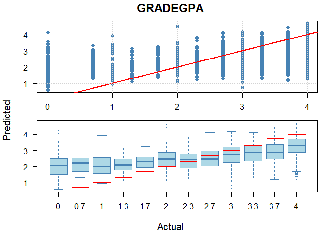
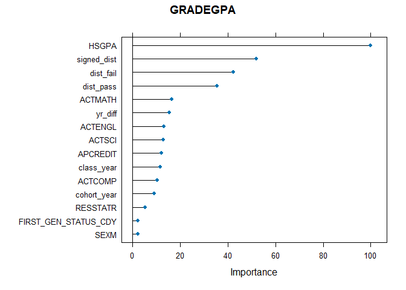

```
## [1] "GRADEGPA"
## missingFilter
## FALSE  TRUE 
##    21  1947
```


### Models  

*MODEL 1: binary* 

  - Target buckets:   
    1: "A", "A-", "B+", "B", "B-", "C+", "C", "C-"  
    0: "D+", "D", "D-", "E", "EU" 
  
*MODEL 2: trinary*  

  - Target buckets:     
    2: "A", "A-", "B+", "B", "B-"  
    1: "C+", "C", "C-"  
    0: "D+", "D", "D-", "E", "EU" 

*MODEL 3: quad* 

  - Target buckets:   
    3: "A"  
    2: "A-", "B+", "B", "B-"  
    1: "C+", "C", "C-"  
    0: "D+", "D", "D-", "E", "EU" 

*MODEL 4: grade GPA* 

  - Targets: 
    4, 3.7, 3.3, 3, 2.7, 2.3, 2, 1.7, 1.3, 1, 0.7, 0

### Predictors  

course, class_year, SEX, FIRST_GEN_STATUS_CD, ETHNICITY, RESSTAT, FA_PELL, APCREDIT, HSGPA, HSPRIVATE, HONORS, ACTCOMP, ACTENGL, ACTMATH, ACTSCI, cohort_year, yr_diff, season, course_level, age_cut, dist_fail, dist_pass, signed_dist. 

"load" is the credit load per student per term. 
"yr_diff" is the time (expressed as fractions of a year) between the cohort date and the end of term date for the course.  

The other variables are either self-explanatory or taken directly from OBIA tables.  

# Results


```
## [1] "GRADEGPA"
## [1] "GRADEGPA"
## missingFilter
## FALSE  TRUE 
##    21  1947
```

```
## [1] "GRADEGPA"
## missingFilter
## FALSE  TRUE 
##    21  1947
```

<table class=" lightable-classic" style="color: black; font-family: Calibri; width: auto !important; margin-left: auto; margin-right: auto;">
<caption>Normalized Regression Results Across Grading Buckets</caption>
 <thead>
<tr>
<th style="empty-cells: hide;" colspan="1"></th>
<th style="padding-bottom:0; padding-left:3px;padding-right:3px;text-align: center; " colspan="3"><div style="border-bottom: 1px solid #111111; margin-bottom: -1px; ">Raw Metrics</div></th>
<th style="padding-bottom:0; padding-left:3px;padding-right:3px;text-align: center; " colspan="4"><div style="border-bottom: 1px solid #111111; margin-bottom: -1px; ">Normalized Metrics</div></th>
</tr>
  <tr>
   <th style="text-align:left;font-weight: bold;background-color: rgba(240, 240, 240, 255) !important;">  </th>
   <th style="text-align:center;font-weight: bold;background-color: rgba(240, 240, 240, 255) !important;"> RMSE </th>
   <th style="text-align:center;font-weight: bold;background-color: rgba(240, 240, 240, 255) !important;"> MAE </th>
   <th style="text-align:center;font-weight: bold;background-color: rgba(240, 240, 240, 255) !important;"> R-sq </th>
   <th style="text-align:center;font-weight: bold;background-color: rgba(240, 240, 240, 255) !important;"> NRMSE (Range) </th>
   <th style="text-align:center;font-weight: bold;background-color: rgba(240, 240, 240, 255) !important;"> NMAE (Range) </th>
   <th style="text-align:center;font-weight: bold;background-color: rgba(240, 240, 240, 255) !important;"> NRMSE (SD) </th>
   <th style="text-align:center;font-weight: bold;background-color: rgba(240, 240, 240, 255) !important;"> NMAE (SD) </th>
  </tr>
 </thead>
<tbody>
  <tr>
   <td style="text-align:left;background-color: rgba(255, 255, 255, 255) !important;"> GRADEGPA </td>
   <td style="text-align:center;background-color: rgba(255, 255, 255, 255) !important;"> 1.04 </td>
   <td style="text-align:center;background-color: rgba(255, 255, 255, 255) !important;"> 0.82 </td>
   <td style="text-align:center;background-color: rgba(255, 255, 255, 255) !important;"> 0.26 </td>
   <td style="text-align:center;background-color: rgba(255, 255, 255, 255) !important;"> 0.26 </td>
   <td style="text-align:center;background-color: rgba(255, 255, 255, 255) !important;"> 0.2 </td>
   <td style="text-align:center;background-color: rgba(255, 255, 255, 255) !important;"> 0.9 </td>
   <td style="text-align:center;background-color: rgba(255, 255, 255, 255) !important;"> 0.71 </td>
  </tr>
</tbody>
</table>


<!-- -->

# Variable importance

<!-- -->


# Training data


Presentation order: 


```
## [1] "GRADEGPA"
```

```
## [[1]]
## ── Data Summary ────────────────────────
##                            Values                      
## Name                       data_list[[x]][["training...
## Number of rows             36569                       
## Number of columns          24                          
## _______________________                                
## Column type frequency:                                 
##   character                5                           
##   factor                   3                           
##   numeric                  16                          
## ________________________                               
## Group variables            None                        
## 
## ── Variable type: character ────────────────────────────────────────────────────
##   skim_variable       n_missing complete_rate min max empty n_unique whitespace
## 1 SEX                         0             1   1   1     0        2          0
## 2 FIRST_GEN_STATUS_CD         0             1   1   1     0        3          0
## 3 RESSTAT                     0             1   1   1     0        2          0
## 4 HSPRIVATE                   0             1   1   1     0        2          0
## 5 season                      0             1   4   6     0        3          0
## 
## ── Variable type: factor ───────────────────────────────────────────────────────
##   skim_variable n_missing complete_rate ordered n_unique
## 1 course                0             1 FALSE         24
## 2 ETHNICITY             0             1 FALSE          9
## 3 age_cut               0             1 FALSE          5
##   top_counts                                 
## 1 MAT: 8827, MAT: 6016, MAT: 4829, MAT: 3291 
## 2 C: 26313, H: 4521, A: 2617, M: 1724        
## 3 (17: 29854, (18: 3123, (19: 1820, (0,: 1478
## 
## ── Variable type: numeric ──────────────────────────────────────────────────────
##    skim_variable n_missing complete_rate     mean     sd        p0      p25
##  1 GRADEGPA              0             1    2.85   1.22     0         2    
##  2 class_year            0             1 2015.     4.99  2006      2011    
##  3 FA_PELL               0             1    0.220  0.414    0         0    
##  4 APCREDIT              0             1    7.06  12.2      0         0    
##  5 HSGPA                 0             1    3.62   0.341    1.07      3.41 
##  6 HONORS                0             1    0.161  0.367    0         0    
##  7 ACTCOMP               0             1   25.0    4.30    11        22    
##  8 ACTENGL               0             1   24.8    5.26     7        21    
##  9 ACTMATH               0             1   24.4    4.56     1        21    
## 10 ACTSCI                0             1   24.9    4.52     2        22    
## 11 cohort_year           0             1 2015.     5.08  2005      2010    
## 12 yr_diff               0             1    0.503  0.795   -0.397     0.241
## 13 course_level          0             1    1.03   0.162    1         1    
## 14 dist_fail             0             1    1.45   0.758    0         0.918
## 15 dist_pass             0             1    1.29   0.826    0.0141    0.702
## 16 signed_dist           0             1    0.158  0.688   -2.91     -0.414
##         p50      p75    p100 hist 
##  1    3.3      4        4    ▂▁▂▃▇
##  2 2015     2019     2023    ▆▆▇▇▇
##  3    0        0        1    ▇▁▁▁▂
##  4    0       11       85    ▇▁▁▁▁
##  5    3.71     3.91     4.42 ▁▁▁▇▇
##  6    0        0        1    ▇▁▁▁▂
##  7   25       28       36    ▁▅▇▅▂
##  8   24       28       36    ▁▂▇▆▃
##  9   24       27       36    ▁▁▅▇▂
## 10   24       27       36    ▁▁▅▇▂
## 11 2015     2019     2023    ▅▆▅▇▆
## 12    0.260    0.260   16.6  ▇▁▁▁▁
## 13    1        1        2    ▇▁▁▁▁
## 14    1.37     1.83     8.23 ▇▃▁▁▁
## 15    1.10     1.68     9.85 ▇▂▁▁▁
## 16    0.220    0.685    4.02 ▁▅▇▁▁
```

