# Summary

Five models were trained using extreme gradient boosting.  Each model predicted a course grade (or bucket of course grades) for one of ten math courses at the University of Utah.  Each model used complete cases of a small number of predictors, such as high school GPA and ACT test scores.

The data included all years from 2005 to 2025.  

The math courses were chosen as the ten highest enrollment math courses at the U during that period. 

Four models bucketed grades into groups of increasing granularity and used classification.  One model trained on numeric GPA values and used regression.  

All models had low accuracy. The highest classification model had a Kappa value of 0.207, and the regression model had an r-squared value of 0.27.

Due to low accuracy, it is not recommended that these models can be used to generate strong recommendations or firm cut-offs or thresholds for the various courses.  Rather, it could be used to develop probabilistic guidance that a student or advisor could access.  

# Key findings  

  - The high school GPA was the most predictive variable for the regression model. 
  - Math 1070 had the highest accuracy ($R^2$ value of 0.30) while Math 1030 had the lowest accuracy ($R^2$ value of 0.20).
  - An inspection of accuracy found that predictions were the most accurate for students with a high school GPA greater than 4.0. 
  - Math grades increased with high school GPA and ACT math test scores.  
  - Other important variables include AP credit and the number of years between initial enrollment and the math class.  
  - Math grades have increased on average during the time period investigated.  
  - A guidance plot shows a heatmap of predicted grades varied across two leading indicators and adjustable to the remaining variables.  

# Next steps  

  - Filter the data to first term math courses only:  all the math courses taken in the first term a student takes a math course and re-train the models.  
  - Include the concurrent semester credit load.    
    - Possibly broken out by college or topic.  
  - Convert everything to regression models.   
  - Attempt different methods to predict withdrawals (grades of "W").  
  - Develop counter-factual tables of predicted grades in alternative courses in order to identify optimum course selections based on the limited predictors.   
  - Develop guidance plots that show the optimum course selection per individual with respect to grade.  
  - Develop a plot that shows the expected grade and range per course per individual.  


# Model summaries 

All models use complete cases of the predictors course, SEX, FIRST_GEN_STATUS_CD, ETHNICITY, RESSTAT, FA_PELL, AGE, APCREDIT, HSGPA, HSPRIVATE, HONORS, ACTCOMP, ACTENGL, ACTMATH, ACTSCI, year, yr_diff with an 80/20 training/testing split using stratified sampling of the grades.  

Missing, 'rare' or unusual grades of "V", "I", "NC", "CR", and "EU" were excluded.  

**MODEL 1:** ***Withdraw binary***  

  - Target classes:  "withdraw" (4.1%) or "not_withdraw" (95.9%) from the grade "W".   
  - Model: Five-fold cross validation with synthetic minority oversampling (SMOTE). 
  - Accuracy: Kappa of 0.003   

**MODEL 2:** ***Binary***  

  - Target classes: "hi_grade" (81.6%) from grades "A", "A-", "B+", "B", "B-", "C+", "C", "C-", and "low_grade" (18.4%) from grades "D+", "D", "D-", and "E".   
  - Model:  Five-fold cross validation with synthetic minority oversampling (SMOTE).  
  - Accuracy: Kappa of 0.086
  
**MODEL 3:** ***Trinary***  

  - Target classes: "hi_grade" (62.7%) from grades "A", "A-", "B+", "B", "B-", "med_grade" (18.8 %) from grades "C+", "C", "C-", and "low_grade" (18.4%) from grades "D+", "D", "D-", and "E".   
  - Accuracy: Kappa of 0.111  

**MODEL 4:** ***Quad*** 

  - Target classes: "hi_grade" (22.7%) from grades "A", "medPlus_grade" (37.4 %) from grades "A-", "B+", "B", "B-", "medMinus_grade" (18.1 %) from grades "C+", "C", "C-", and "low_grade" (21.9%) from grades "D+", "D", "D-", "E" and "W". 
  - Model:  Five-fold cross validation  
  - Accuracy: Kappa of 0.207  
  
**MODEL 5:** ***GPA***  

  - Five-fold cross validation regression model was performed against the numeric values of GRADEGPA (0, 1, 1.7, 2, 2.3, 2.7, 3, 3.3, 3.7, 4) and assessed with default regression metrics (RMSE, R², and MAE.)  
  - Accuracy: RMSE: 1.067, MAE: 0.816, $R^2$: 0.265

# Classification model accuracy

Because no classification model produced a Kappa value greater than 0.21 (indicating performance too close to random), no classification model will be interpreted or evaluated further.  

Confusion matrices for each model are available in the appendix. 

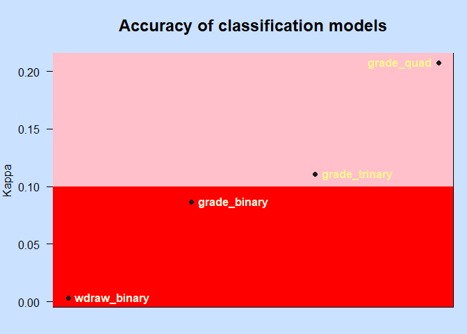<!-- -->


# Regression model accuracy


```
## Regression diagnostics:
## RMSE: 1.0664
## MAE:  0.8156
## R-squared: 0.2631
```

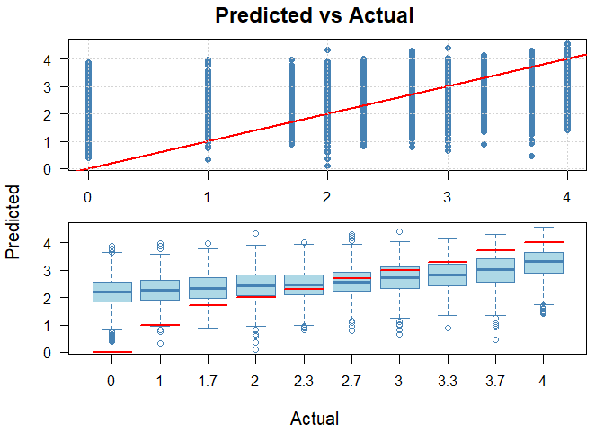<!-- -->


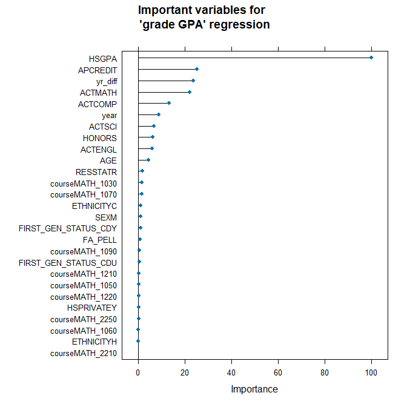<!-- -->


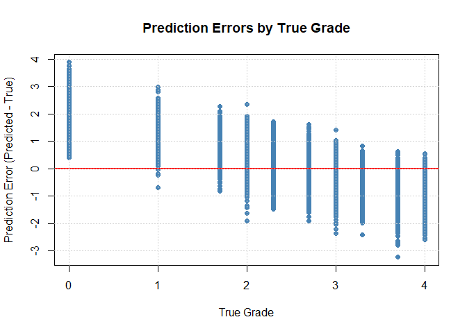<!-- -->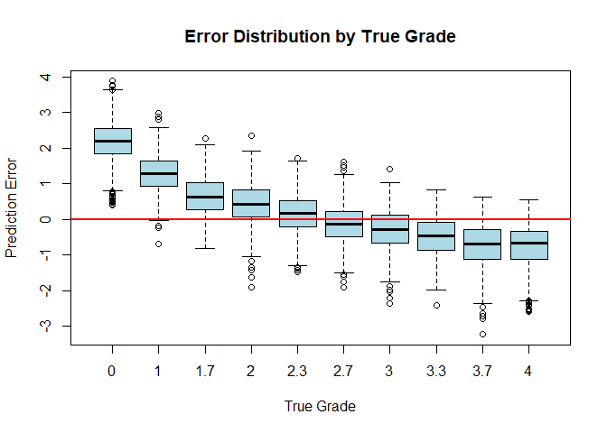<!-- -->


<table class="table table-striped table-hover table-condensed" style="font-size: 14px; color: black; width: auto !important; margin-left: auto; margin-right: auto;">
<caption style="font-size: initial !important;">Course Metrics Summary</caption>
 <thead>
  <tr>
   <th style="text-align:center;"> course </th>
   <th style="text-align:center;"> n </th>
   <th style="text-align:center;"> rmse </th>
   <th style="text-align:center;"> mae </th>
   <th style="text-align:center;"> r_squared </th>
  </tr>
 </thead>
<tbody>
  <tr>
   <td style="text-align:center;"> MATH_1070 </td>
   <td style="text-align:center;"> 879 </td>
   <td style="text-align:center;"> 0.97 </td>
   <td style="text-align:center;"> 0.71 </td>
   <td style="text-align:center;"> 0.30 </td>
  </tr>
  <tr>
   <td style="text-align:center;"> MATH_1210 </td>
   <td style="text-align:center;"> 1848 </td>
   <td style="text-align:center;"> 1.02 </td>
   <td style="text-align:center;"> 0.78 </td>
   <td style="text-align:center;"> 0.27 </td>
  </tr>
  <tr>
   <td style="text-align:center;"> MATH_2250 </td>
   <td style="text-align:center;"> 972 </td>
   <td style="text-align:center;"> 1.00 </td>
   <td style="text-align:center;"> 0.74 </td>
   <td style="text-align:center;"> 0.25 </td>
  </tr>
  <tr>
   <td style="text-align:center;"> MATH_1090 </td>
   <td style="text-align:center;"> 735 </td>
   <td style="text-align:center;"> 1.10 </td>
   <td style="text-align:center;"> 0.84 </td>
   <td style="text-align:center;"> 0.24 </td>
  </tr>
  <tr>
   <td style="text-align:center;"> MATH_1010 </td>
   <td style="text-align:center;"> 2015 </td>
   <td style="text-align:center;"> 1.14 </td>
   <td style="text-align:center;"> 0.90 </td>
   <td style="text-align:center;"> 0.24 </td>
  </tr>
  <tr>
   <td style="text-align:center;"> MATH_1050 </td>
   <td style="text-align:center;"> 2100 </td>
   <td style="text-align:center;"> 1.17 </td>
   <td style="text-align:center;"> 0.93 </td>
   <td style="text-align:center;"> 0.23 </td>
  </tr>
  <tr>
   <td style="text-align:center;"> MATH_2210 </td>
   <td style="text-align:center;"> 1174 </td>
   <td style="text-align:center;"> 0.93 </td>
   <td style="text-align:center;"> 0.66 </td>
   <td style="text-align:center;"> 0.23 </td>
  </tr>
  <tr>
   <td style="text-align:center;"> MATH_1220 </td>
   <td style="text-align:center;"> 1603 </td>
   <td style="text-align:center;"> 1.02 </td>
   <td style="text-align:center;"> 0.76 </td>
   <td style="text-align:center;"> 0.22 </td>
  </tr>
  <tr>
   <td style="text-align:center;"> MATH_1060 </td>
   <td style="text-align:center;"> 1052 </td>
   <td style="text-align:center;"> 1.16 </td>
   <td style="text-align:center;"> 0.92 </td>
   <td style="text-align:center;"> 0.20 </td>
  </tr>
  <tr>
   <td style="text-align:center;"> MATH_1030 </td>
   <td style="text-align:center;"> 914 </td>
   <td style="text-align:center;"> 1.03 </td>
   <td style="text-align:center;"> 0.78 </td>
   <td style="text-align:center;"> 0.20 </td>
  </tr>
</tbody>
</table>


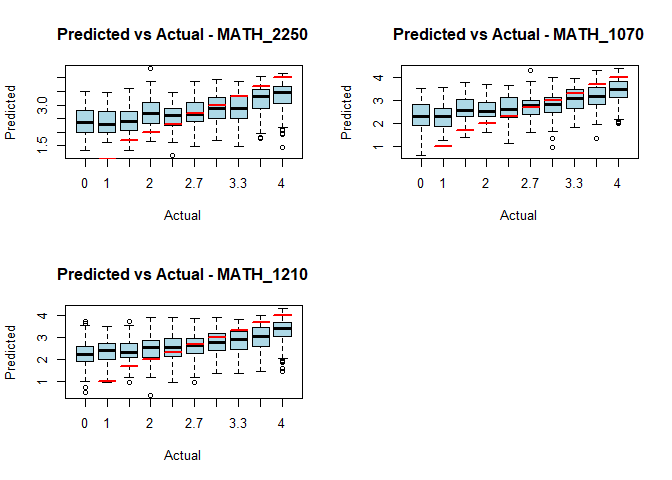<!-- -->

```
##       Group      RMSE       MAE        R2
## 1 MATH_2250 0.9963164 0.7395423 0.2522179
## 2 MATH_1070 0.9705010 0.7094025 0.2980107
## 3 MATH_1210 1.0203418 0.7766726 0.2694268
```

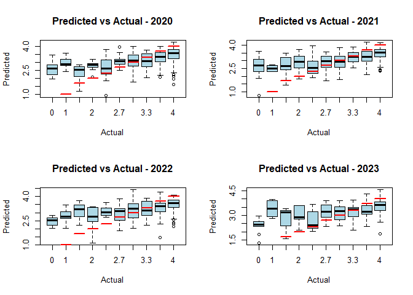<!-- -->

```
##   Group      RMSE       MAE        R2
## 1  2020 0.8821072 0.6216837 0.2221123
## 2  2021 0.9148967 0.6634648 0.2342416
## 3  2022 0.8596743 0.6428008 0.1833608
## 4  2023 0.8020737 0.5824797 0.2045901
```


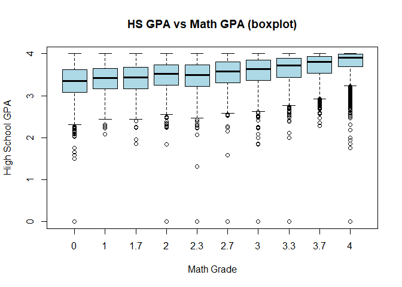<!-- -->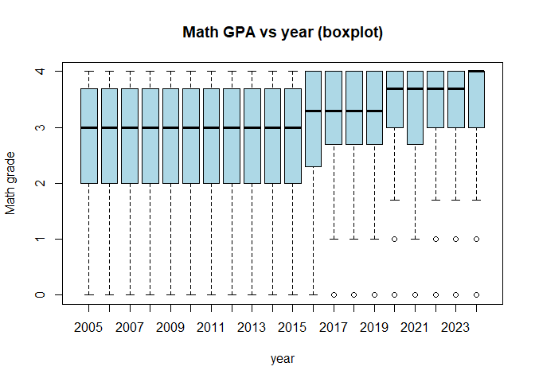<!-- -->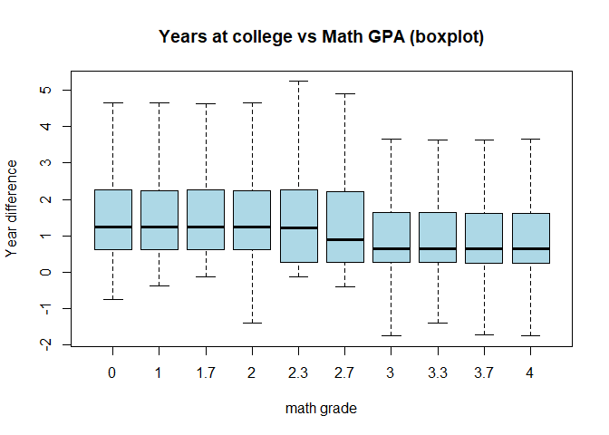<!-- -->


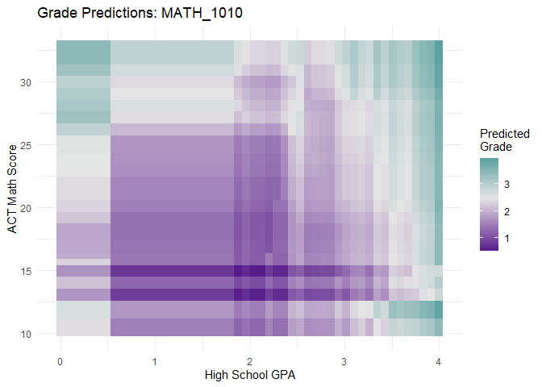<!-- -->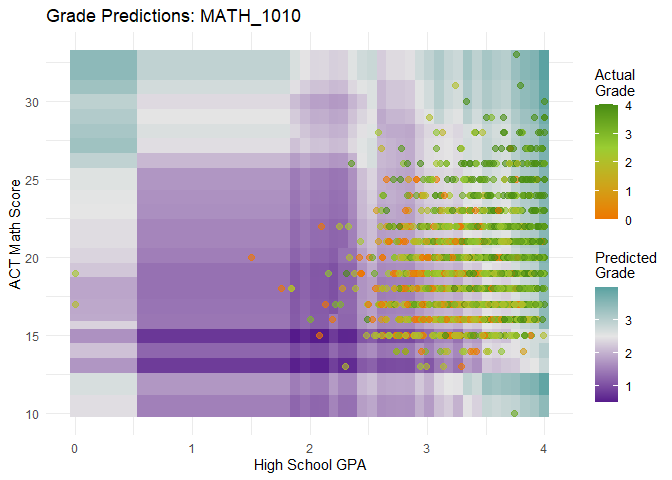<!-- -->


```
## [1] "HSGPA"    "APCREDIT" "yr_diff"
```

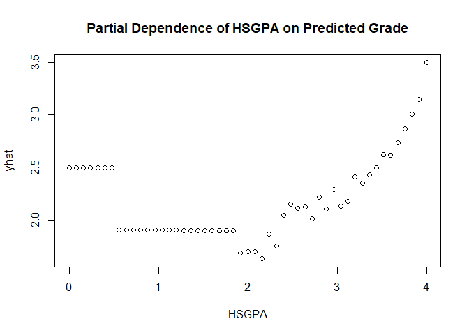<!-- -->

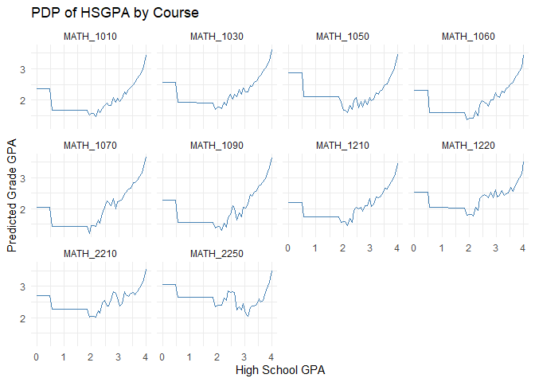<!-- -->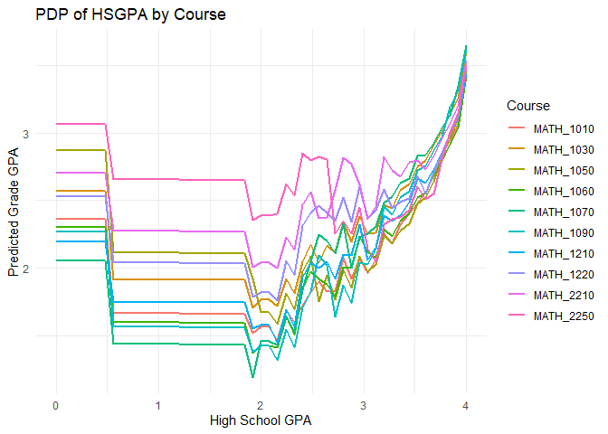<!-- -->

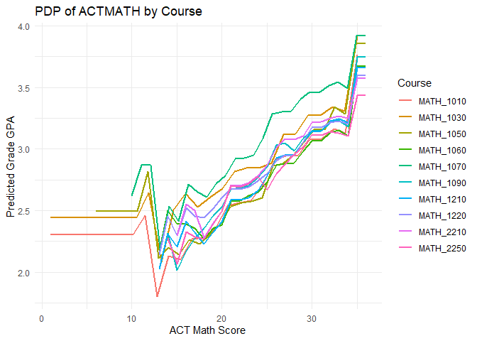<!-- -->


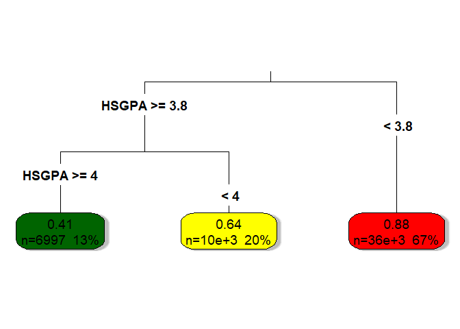<!-- -->

This plot shows that students with a high school GPA greater than 4.0 have high accuracy in math course grade prediction.  

# APPENDIX

### Selecting high volume courses using hierarchical clustering


### Classification model results  


