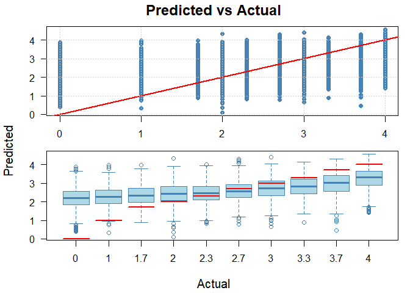

# SUMMARY

Five models were trained using extreme gradient boosting.  Each model predicted a course grade for one of ten math courses at the University of Utah.  Each model used complete cases of a small number of predictors, such as high school GPA and ACT test scores.

The data included all years from 2005 to 2025.  

Four models bucketed grades into groups of increasing granularity and used classification.  One model trained on numeric GPA values and used regression.  

All models had low accuracy. The highest classification model had a Kappa value of 0.207, and the regression model had an r-squared value of 0.27.

Due to low accuracy, it is not recommended that these few predictors can be used to generate strong recommendations or firm cut-offs or thresholds for the various courses.  Rather, it could be used to develop probabilistic guidance that a student or advisor could access.  

Some key findings include:  


  - The high school GPA was the most predictive variable for the regression model. 
  - Math 1050 [?] had the highest accuracy (R^2 value of 0.29) while Math xxxx had the lowest accuracy.
  - An inspection of accuracy found that predictions were the most accurate for students with a high school GPA greater than [[3.8]]. 
  - Math grades increased with high school GPA and ACT math test scores.  
  - Other important variables.  
  - Math grades have increased during the time period investigated. 
  - A guidance plot shows a heatmap of predicted grades varied across two leading indicators and adjustable to the remaining variables.  


# MODEL SUMMARY

**MODEL 1:** ***Withdraw binary***
  - 

**MODEL 2:** ***Grade binary***
  - 

**MODEL 3:** ***Trinary***
  -
  
**MODEL 4:** ***Quad***
  -   
  
**MODEL 5:** ***GPA***
  -


NEXT STEPS: 

  - Filter the data to first term math courses only:  all the math courses taken in the first term a student takes a math course and re-train the models.  
  - Include the concurrent semester credit load.    
    - Possibly broken out by college or topic.  
  - Convert everything to regression models.   
  - Attempt different methods to predict withdrawals (grades of "W").  
  - Develop counter-factual tables of predicted grades in alternative courses in order to identify optimum course selections based on the limited data.  
  - Develop guidance plots that show the optimum course selection per individual with respect to grade. 
  - Develop a plot that shows the expected grade and range per course per individual.  
  
  
  
  
  
  
  


# Classification model accuracy

Because no classification model produced a Kappa value greater than 0.21 (indicating performance too close to random), no classification model will be interpreted or evaluated further.  

Confusion matrices for each model are available in the appendix. 

<!-- -->


# Regression model accuracy


```
## Regression diagnostics:
## RMSE: 1.0664
## MAE:  0.8156
## R-squared: 0.2631
```

<!-- -->


<!-- -->


<!-- --><!-- -->


<table class="table table-striped table-hover table-condensed" style="font-size: 14px; color: black; width: auto !important; margin-left: auto; margin-right: auto;">
<caption style="font-size: initial !important;">Course Metrics Summary</caption>
 <thead>
  <tr>
   <th style="text-align:center;"> course </th>
   <th style="text-align:center;"> n </th>
   <th style="text-align:center;"> rmse </th>
   <th style="text-align:center;"> mae </th>
   <th style="text-align:center;"> r_squared </th>
  </tr>
 </thead>
<tbody>
  <tr>
   <td style="text-align:center;"> MATH_1070 </td>
   <td style="text-align:center;"> 879 </td>
   <td style="text-align:center;"> 0.97 </td>
   <td style="text-align:center;"> 0.71 </td>
   <td style="text-align:center;"> 0.30 </td>
  </tr>
  <tr>
   <td style="text-align:center;"> MATH_1210 </td>
   <td style="text-align:center;"> 1848 </td>
   <td style="text-align:center;"> 1.02 </td>
   <td style="text-align:center;"> 0.78 </td>
   <td style="text-align:center;"> 0.27 </td>
  </tr>
  <tr>
   <td style="text-align:center;"> MATH_2250 </td>
   <td style="text-align:center;"> 972 </td>
   <td style="text-align:center;"> 1.00 </td>
   <td style="text-align:center;"> 0.74 </td>
   <td style="text-align:center;"> 0.25 </td>
  </tr>
  <tr>
   <td style="text-align:center;"> MATH_1090 </td>
   <td style="text-align:center;"> 735 </td>
   <td style="text-align:center;"> 1.10 </td>
   <td style="text-align:center;"> 0.84 </td>
   <td style="text-align:center;"> 0.24 </td>
  </tr>
  <tr>
   <td style="text-align:center;"> MATH_1010 </td>
   <td style="text-align:center;"> 2015 </td>
   <td style="text-align:center;"> 1.14 </td>
   <td style="text-align:center;"> 0.90 </td>
   <td style="text-align:center;"> 0.24 </td>
  </tr>
  <tr>
   <td style="text-align:center;"> MATH_1050 </td>
   <td style="text-align:center;"> 2100 </td>
   <td style="text-align:center;"> 1.17 </td>
   <td style="text-align:center;"> 0.93 </td>
   <td style="text-align:center;"> 0.23 </td>
  </tr>
  <tr>
   <td style="text-align:center;"> MATH_2210 </td>
   <td style="text-align:center;"> 1174 </td>
   <td style="text-align:center;"> 0.93 </td>
   <td style="text-align:center;"> 0.66 </td>
   <td style="text-align:center;"> 0.23 </td>
  </tr>
  <tr>
   <td style="text-align:center;"> MATH_1220 </td>
   <td style="text-align:center;"> 1603 </td>
   <td style="text-align:center;"> 1.02 </td>
   <td style="text-align:center;"> 0.76 </td>
   <td style="text-align:center;"> 0.22 </td>
  </tr>
  <tr>
   <td style="text-align:center;"> MATH_1060 </td>
   <td style="text-align:center;"> 1052 </td>
   <td style="text-align:center;"> 1.16 </td>
   <td style="text-align:center;"> 0.92 </td>
   <td style="text-align:center;"> 0.20 </td>
  </tr>
  <tr>
   <td style="text-align:center;"> MATH_1030 </td>
   <td style="text-align:center;"> 914 </td>
   <td style="text-align:center;"> 1.03 </td>
   <td style="text-align:center;"> 0.78 </td>
   <td style="text-align:center;"> 0.20 </td>
  </tr>
</tbody>
</table>


<!-- -->

```
##       Group      RMSE       MAE        R2
## 1 MATH_2250 0.9963164 0.7395423 0.2522179
## 2 MATH_1070 0.9705010 0.7094025 0.2980107
## 3 MATH_1210 1.0203418 0.7766726 0.2694268
```

<!-- -->

```
##   Group      RMSE       MAE        R2
## 1  2020 0.8821072 0.6216837 0.2221123
## 2  2021 0.9148967 0.6634648 0.2342416
## 3  2022 0.8596743 0.6428008 0.1833608
## 4  2023 0.8020737 0.5824797 0.2045901
```


Is there a pocket of high accuracy?

I think I should make sure all-l of these visualizations work,
including a few more ---

partial dependence plot

hs.gpa vs act scores as axis, actual - predicted grade (connected by a line on a countour plot?)

should I do a variable importance plot, where I shuffle a variable?

correlate ?


<!-- --><!-- --><!-- -->


So I am looking at two things here:
- Writing up this report
- Comparing the data set

If the data set compares, then I need to move to the next iteration of training (esp only using the first math class and possibly adding the number of credits in the first semester)  (I think there's something to also looking at the GPA for all of the other classes that semester.  I wonder if causal inference allows that kind of thing?)

If the data set does NOT compare, then this becomes less interesting and I should re-run the training on this data set.

I'm thinking I should also run the binary as a regression model to take advantage of the ordinal nature of the data.

I'd also really like to know what the range of grades are for a prediction of, say, 2.7 or 3.0.  I guess that's my RMSE or MAE.  It's also rotating my boxplots on the side, or one box plot per prediction.

Then there's reviewing my Claude convo and adding those conversations.

And there's a couple of my other sandbox -- selecting classes via hierarchical clustering and the year_diff density plots (years to class)


I need to see how the prediction/actual changes as one predictor changes


I'd like to see something like an individual guidance chart, one per student, that gives the probabilities (contours?) of grades per course.

So it has all the information we have about a student, and somehow tells them what their likelihood is.  

In my mind (and I know this won't work) I am imagining ACT Math along one edge, and HS GPA along the other, and each cell is a color with the probability of getting greater than "X" score.  One graphic per course.

It would make a cool widget in Shiny, that's for sure, where the student moves their widget up or down to determine their own cut-off dates.  

The student could then add information to the widget, and get a personalized prediction.  They could add as much information as they'd like and with-hold others.  
It would display something like an "expected grade" with error bars.

I am imaginining ... I'm not sure what I'm imaginging.

Something like each square represents a grade and a probability?  At the upper right corner is the highest probability, and the grade that appears in that corner changes based on the personal prediction. 

Anyway, def leading towards "probabilistic guidance." 

And I might as well try a per-course model.

And (of course) restrict it to the first math class taken by the first-time-freshman


I gotta show what I've got, though -- I need some show'n'tell.

<!-- --><!-- -->


Why can't I simply subtract one from the prediction?  Won't that make it more accurate?


I like that contour map.  Looking pretty good.
...and it also shows how AWFUL it is!

I still haven't answered if I have pockets of high accuracy. 


This bin4 looks terrible.  I don't quite believe it.

Instead of four pairs, I wonder if I can have the four y-bins as well (sub-bins for the grade).

Next, I need to do a pdp plot.


```
## [1] "HSGPA"    "APCREDIT" "yr_diff"
```

<!-- -->

<!-- --><!-- -->

<!-- -->


<!-- -->

A plot I want to see is ---
It's individual for a single person
x-axis has all of the courses
y-axis has the predicted grade, and the estimated spread of GPA.
It would be nice if I could show the spread of actual GPA for the people with that estimate


# APPENDIX

### Selecting high volume courses using hierarchical clustering


