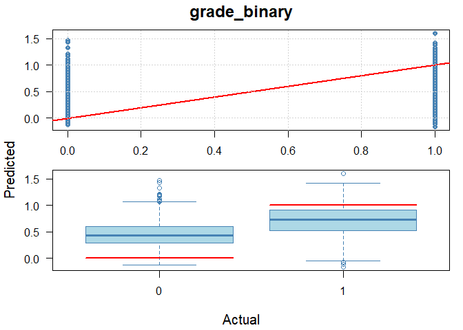
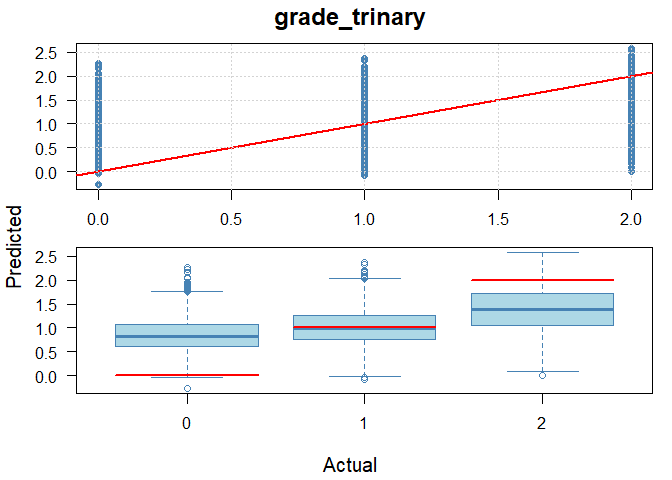
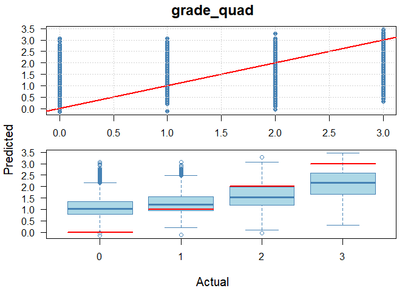
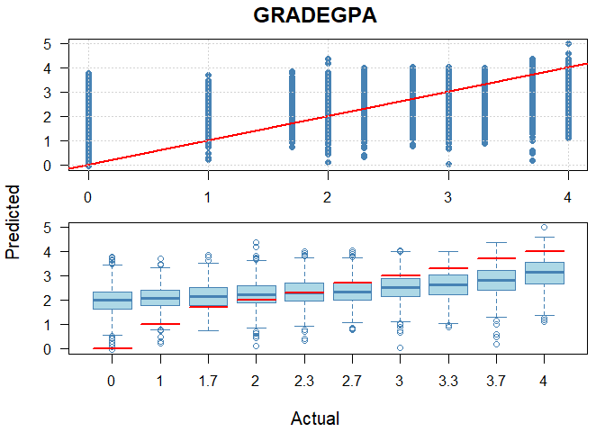
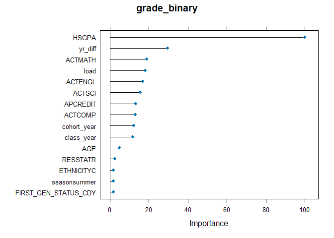
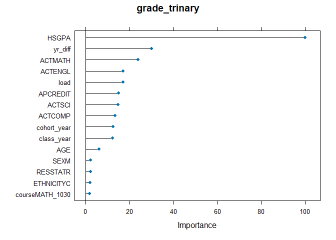
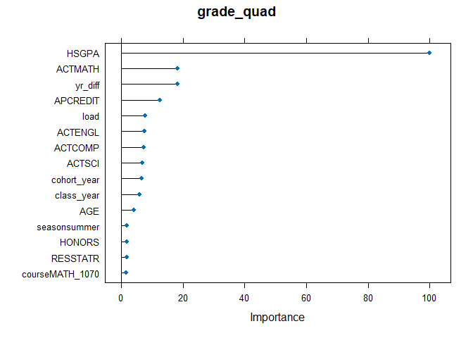
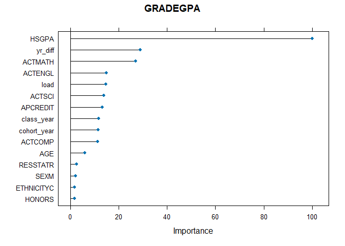

# SUMMARY 

Four models were trained using extreme gradient boosting. Each model predicted a course grade (or bucket of course grades) for one of ten math courses at the University of Utah. Each model used complete cases of a small number of predictors, such as high school GPA and ACT test scores.

The data included all years from 2005 to 2025.

The math courses were chosen as the ten highest enrollment math courses at the U during that period.

All models used regression.  Three models bucketed grades into groups of increasing granularity, and the fourth model used the numeric GPA value.  The grade "EU" was converted to a value of zero for two of the models. The relatively rare grades of "missing", "V", "I", "NC", and "CR" were excluded from all models.  The grade "W" was included in the lowest bucket for the quad model.  

Each model had an 80/20 training/testing split stratified on the grades before bucketing.  

All models had low accuracy. The quad model and the numeric GPA model had the highest squared correlation ($r^2$) values of 0.28 and 0.26, respectively.  The binary and trinary models had $r^2$ values of 0.19 and 0.11.

Due to low accuracy, it is not recommended that these models can be used to generate strong recommendations or firm cut-offs or thresholds for the various courses. Rather, it could be used to develop probabilistic guidance that a student or advisor could access.

### Models  

*MODEL 1: binary* 

  - Target buckets:   
    1: "A", "A-", "B+", "B", "B-", "C+", "C", "C-"  
    0: "D+", "D", "D-", "E", "EU" 
  
*MODEL 2: trinary*  

  - Target buckets:     
    2:  "A", "A-", "B+", "B", "B-"  
    1: "C+", "C", "C-"  
    0: "D+", "D", "D-", "E" 

*MODEL 3: quad* 

  - Target buckets:   
    3: "A"  
    2: "A-", "B+", "B", "B-"  
    1: "C+", "C", "C-"  
    0: "D+", "D", "D-", "E", "EU", "W"  

*MODEL 4: grade GPA* 

  - Targets: 
    4, 3.7, 3.3, 3, 2.7, 2.3, 2, 1.7, 1.3, 1, 0.7, 0

### Predictors  

course, SEX, FIRST_GEN_STATUS_CD, ETHNICITY, RESSTAT, FA_PELL, AGE, APCREDIT, HSGPA, HSPRIVATE, HONORS, ACTCOMP, ACTENGL, ACTMATH, ACTSCI, load, cohort_year, class_year, yr_diff, season. 

"load" is the credit load per student per term. 
"yr_diff" is the time (expressed as fractions of a year) between the cohort date and the end of term date for the course.  

The other variables are either self-explanatory or taken directly from OBIA tables.  

# Results

<table class=" lightable-classic" style="color: black; font-family: Calibri; width: auto !important; margin-left: auto; margin-right: auto;">
<caption>Normalized Regression Results Across Grading Buckets</caption>
 <thead>
<tr>
<th style="empty-cells: hide;" colspan="1"></th>
<th style="padding-bottom:0; padding-left:3px;padding-right:3px;text-align: center; " colspan="3"><div style="border-bottom: 1px solid #111111; margin-bottom: -1px; ">Raw Metrics</div></th>
<th style="padding-bottom:0; padding-left:3px;padding-right:3px;text-align: center; " colspan="4"><div style="border-bottom: 1px solid #111111; margin-bottom: -1px; ">Normalized Metrics</div></th>
</tr>
  <tr>
   <th style="text-align:left;font-weight: bold;background-color: rgba(240, 240, 240, 255) !important;">  </th>
   <th style="text-align:center;font-weight: bold;background-color: rgba(240, 240, 240, 255) !important;"> RMSE </th>
   <th style="text-align:center;font-weight: bold;background-color: rgba(240, 240, 240, 255) !important;"> MAE </th>
   <th style="text-align:center;font-weight: bold;background-color: rgba(240, 240, 240, 255) !important;"> R² </th>
   <th style="text-align:center;font-weight: bold;background-color: rgba(240, 240, 240, 255) !important;"> NRMSE (Range) </th>
   <th style="text-align:center;font-weight: bold;background-color: rgba(240, 240, 240, 255) !important;"> NMAE (Range) </th>
   <th style="text-align:center;font-weight: bold;background-color: rgba(240, 240, 240, 255) !important;"> NRMSE (SD) </th>
   <th style="text-align:center;font-weight: bold;background-color: rgba(240, 240, 240, 255) !important;"> NMAE (SD) </th>
  </tr>
 </thead>
<tbody>
  <tr>
   <td style="text-align:left;background-color: rgba(255, 255, 255, 255) !important;"> grade_binary </td>
   <td style="text-align:center;background-color: rgba(255, 255, 255, 255) !important;"> 0.40 </td>
   <td style="text-align:center;background-color: rgba(255, 255, 255, 255) !important;"> 0.33 </td>
   <td style="text-align:center;background-color: rgba(255, 255, 255, 255) !important;"> 0.11 </td>
   <td style="text-align:center;background-color: rgba(255, 255, 255, 255) !important;"> 0.40 </td>
   <td style="text-align:center;background-color: rgba(255, 255, 255, 255) !important;"> 0.33 </td>
   <td style="text-align:center;background-color: rgba(255, 255, 255, 255) !important;"> 1.13 </td>
   <td style="text-align:center;background-color: rgba(255, 255, 255, 255) !important;"> 0.93 </td>
  </tr>
  <tr>
   <td style="text-align:left;background-color: rgba(255, 255, 255, 255) !important;"> grade_trinary </td>
   <td style="text-align:center;background-color: rgba(255, 255, 255, 255) !important;"> 0.73 </td>
   <td style="text-align:center;background-color: rgba(255, 255, 255, 255) !important;"> 0.61 </td>
   <td style="text-align:center;background-color: rgba(255, 255, 255, 255) !important;"> 0.19 </td>
   <td style="text-align:center;background-color: rgba(255, 255, 255, 255) !important;"> 0.37 </td>
   <td style="text-align:center;background-color: rgba(255, 255, 255, 255) !important;"> 0.30 </td>
   <td style="text-align:center;background-color: rgba(255, 255, 255, 255) !important;"> 1.00 </td>
   <td style="text-align:center;background-color: rgba(255, 255, 255, 255) !important;"> 0.83 </td>
  </tr>
  <tr>
   <td style="text-align:left;background-color: rgba(255, 255, 255, 255) !important;"> grade_quad </td>
   <td style="text-align:center;background-color: rgba(255, 255, 255, 255) !important;"> 0.89 </td>
   <td style="text-align:center;background-color: rgba(255, 255, 255, 255) !important;"> 0.72 </td>
   <td style="text-align:center;background-color: rgba(255, 255, 255, 255) !important;"> 0.28 </td>
   <td style="text-align:center;background-color: rgba(255, 255, 255, 255) !important;"> 0.30 </td>
   <td style="text-align:center;background-color: rgba(255, 255, 255, 255) !important;"> 0.24 </td>
   <td style="text-align:center;background-color: rgba(255, 255, 255, 255) !important;"> 0.86 </td>
   <td style="text-align:center;background-color: rgba(255, 255, 255, 255) !important;"> 0.70 </td>
  </tr>
  <tr>
   <td style="text-align:left;background-color: rgba(255, 255, 255, 255) !important;"> GRADEGPA </td>
   <td style="text-align:center;background-color: rgba(255, 255, 255, 255) !important;"> 1.10 </td>
   <td style="text-align:center;background-color: rgba(255, 255, 255, 255) !important;"> 0.88 </td>
   <td style="text-align:center;background-color: rgba(255, 255, 255, 255) !important;"> 0.26 </td>
   <td style="text-align:center;background-color: rgba(255, 255, 255, 255) !important;"> 0.27 </td>
   <td style="text-align:center;background-color: rgba(255, 255, 255, 255) !important;"> 0.22 </td>
   <td style="text-align:center;background-color: rgba(255, 255, 255, 255) !important;"> 0.87 </td>
   <td style="text-align:center;background-color: rgba(255, 255, 255, 255) !important;"> 0.70 </td>
  </tr>
</tbody>
</table>


<!-- --><!-- --><!-- --><!-- -->

# Variable importance

<!-- --><!-- --><!-- --><!-- -->


# Training data


Presentation order: 


```
## [1] "grade_binary"
## [1] "grade_trinary"
## [1] "grade_quad"
## [1] "GRADEGPA"
```

```
## [[1]]
## ── Data Summary ────────────────────────
##                            Values                      
## Name                       data_list[[x]][["training...
## Number of rows             52827                       
## Number of columns          21                          
## _______________________                                
## Column type frequency:                                 
##   character                7                           
##   numeric                  14                          
## ________________________                               
## Group variables            None                        
## 
## ── Variable type: character ────────────────────────────────────────────────────
##   skim_variable       n_missing complete_rate min max empty n_unique whitespace
## 1 course                      0             1   9   9     0       10          0
## 2 SEX                         0             1   1   1     0        2          0
## 3 FIRST_GEN_STATUS_CD         0             1   1   1     0        3          0
## 4 ETHNICITY                   0             1   1   1     0        9          0
## 5 RESSTAT                     0             1   1   1     0        2          0
## 6 HSPRIVATE                   0             1   1   1     0        2          0
## 7 season                      0             1   4   6     0        3          0
## 
## ── Variable type: numeric ──────────────────────────────────────────────────────
##    skim_variable n_missing complete_rate     mean     sd       p0      p25
##  1 grade_binary          0             1    0.851  0.356    0        1    
##  2 FA_PELL               0             1    0.226  0.418    0        0    
##  3 AGE                   0             1   18.2    0.794   15       18    
##  4 APCREDIT              0             1    7.94  12.3      0        0    
##  5 HSGPA                 0             1    3.58   0.369    0.99     3.35 
##  6 HONORS                0             1    0.158  0.365    0        0    
##  7 ACTCOMP               0             1   24.7    4.45    10       21    
##  8 ACTENGL               0             1   24.4    5.35     6       21    
##  9 ACTMATH               0             1   24.0    4.86     1       20    
## 10 ACTSCI                0             1   24.6    4.65     2       21    
## 11 load                  0             1   13.1    3.00     2       12    
## 12 cohort_year           0             1 2012.     4.95  2005     2009    
## 13 class_year            0             1 2014.     4.92  2005     2010    
## 14 yr_diff               0             1    1.49   1.71    -0.397    0.260
##         p50     p75   p100 hist 
##  1    1        1       1   ▂▁▁▁▇
##  2    0        0       1   ▇▁▁▁▂
##  3   18       18      37   ▇▁▁▁▁
##  4    0       12      92   ▇▁▁▁▁
##  5    3.66     3.89    4   ▁▁▁▃▇
##  6    0        0       1   ▇▁▁▁▂
##  7   24       28      36   ▁▃▇▆▂
##  8   24       28      36   ▁▂▇▆▃
##  9   24       27      36   ▁▁▆▇▂
## 10   24       27      36   ▁▁▅▇▂
## 11   13       15      19   ▁▁▃▇▃
## 12 2012     2015    2024   ▆▇▆▃▂
## 13 2013     2017    2025   ▆▇▇▃▂
## 14    0.638    1.88   18.9 ▇▁▁▁▁
## 
## [[2]]
## ── Data Summary ────────────────────────
##                            Values                      
## Name                       data_list[[x]][["training...
## Number of rows             52439                       
## Number of columns          21                          
## _______________________                                
## Column type frequency:                                 
##   character                7                           
##   numeric                  14                          
## ________________________                               
## Group variables            None                        
## 
## ── Variable type: character ────────────────────────────────────────────────────
##   skim_variable       n_missing complete_rate min max empty n_unique whitespace
## 1 course                      0             1   9   9     0       10          0
## 2 SEX                         0             1   1   1     0        2          0
## 3 FIRST_GEN_STATUS_CD         0             1   1   1     0        3          0
## 4 ETHNICITY                   0             1   1   1     0        9          0
## 5 RESSTAT                     0             1   1   1     0        2          0
## 6 HSPRIVATE                   0             1   1   1     0        2          0
## 7 season                      0             1   4   6     0        3          0
## 
## ── Variable type: numeric ──────────────────────────────────────────────────────
##    skim_variable n_missing complete_rate     mean     sd       p0      p25
##  1 grade_trinary         0             1    1.52   0.732    0        1    
##  2 FA_PELL               0             1    0.227  0.419    0        0    
##  3 AGE                   0             1   18.2    0.790   14       18    
##  4 APCREDIT              0             1    7.99  12.3      0        0    
##  5 HSGPA                 0             1    3.58   0.368    0.99     3.35 
##  6 HONORS                0             1    0.159  0.365    0        0    
##  7 ACTCOMP               0             1   24.7    4.45    10       21    
##  8 ACTENGL               0             1   24.4    5.34     6       21    
##  9 ACTMATH               0             1   24.0    4.85     1       20    
## 10 ACTSCI                0             1   24.6    4.64     2       21    
## 11 load                  0             1   13.1    3.00     2       12    
## 12 cohort_year           0             1 2012.     4.96  2005     2009    
## 13 class_year            0             1 2014.     4.93  2005     2010    
## 14 yr_diff               0             1    1.48   1.69    -0.397    0.260
##         p50     p75   p100 hist 
##  1    2        2       2   ▂▁▂▁▇
##  2    0        0       1   ▇▁▁▁▂
##  3   18       18      37   ▇▂▁▁▁
##  4    0       12      92   ▇▁▁▁▁
##  5    3.66     3.90    4   ▁▁▁▃▇
##  6    0        0       1   ▇▁▁▁▂
##  7   24       28      36   ▁▃▇▆▂
##  8   24       28      36   ▁▂▇▆▃
##  9   24       27      36   ▁▁▆▇▂
## 10   24       27      36   ▁▁▅▇▂
## 11   13       15      19   ▁▁▃▇▃
## 12 2012     2015    2024   ▆▇▆▃▂
## 13 2013     2017    2025   ▆▇▇▃▂
## 14    0.638    1.88   18.9 ▇▁▁▁▁
## 
## [[3]]
## ── Data Summary ────────────────────────
##                            Values                      
## Name                       data_list[[x]][["training...
## Number of rows             55087                       
## Number of columns          21                          
## _______________________                                
## Column type frequency:                                 
##   character                7                           
##   numeric                  14                          
## ________________________                               
## Group variables            None                        
## 
## ── Variable type: character ────────────────────────────────────────────────────
##   skim_variable       n_missing complete_rate min max empty n_unique whitespace
## 1 course                      0             1   9   9     0       10          0
## 2 SEX                         0             1   1   1     0        2          0
## 3 FIRST_GEN_STATUS_CD         0             1   1   1     0        3          0
## 4 ETHNICITY                   0             1   1   1     0        9          0
## 5 RESSTAT                     0             1   1   1     0        2          0
## 6 HSPRIVATE                   0             1   1   1     0        2          0
## 7 season                      0             1   4   6     0        3          0
## 
## ── Variable type: numeric ──────────────────────────────────────────────────────
##    skim_variable n_missing complete_rate     mean     sd       p0      p25
##  1 grade_quad            0             1    1.69   1.03     0        1    
##  2 FA_PELL               0             1    0.227  0.419    0        0    
##  3 AGE                   0             1   18.2    0.792   14       18    
##  4 APCREDIT              0             1    7.86  12.3      0        0    
##  5 HSGPA                 0             1    3.58   0.371    0.99     3.34 
##  6 HONORS                0             1    0.156  0.363    0        0    
##  7 ACTCOMP               0             1   24.7    4.44    10       21    
##  8 ACTENGL               0             1   24.4    5.33     6       21    
##  9 ACTMATH               0             1   23.9    4.86     1       20    
## 10 ACTSCI                0             1   24.6    4.64     2       21    
## 11 load                  0             1   13.1    3.00     2       12    
## 12 cohort_year           0             1 2012.     4.95  2005     2008    
## 13 class_year            0             1 2014.     4.93  2005     2010    
## 14 yr_diff               0             1    1.51   1.72    -0.397    0.260
##         p50     p75   p100 hist 
##  1    2        2       3   ▃▃▁▇▅
##  2    0        0       1   ▇▁▁▁▂
##  3   18       18      37   ▇▂▁▁▁
##  4    0       12      92   ▇▁▁▁▁
##  5    3.66     3.89    4   ▁▁▁▃▇
##  6    0        0       1   ▇▁▁▁▂
##  7   24       28      36   ▁▃▇▆▂
##  8   24       28      36   ▁▂▇▆▃
##  9   24       27      36   ▁▁▆▇▂
## 10   24       27      36   ▁▁▅▇▂
## 11   13       15      19   ▁▁▃▇▃
## 12 2012     2015    2024   ▆▇▆▃▂
## 13 2013     2017    2025   ▆▇▇▃▂
## 14    0.882    1.89   18.6 ▇▁▁▁▁
## 
## [[4]]
## ── Data Summary ────────────────────────
##                            Values                      
## Name                       data_list[[x]][["training...
## Number of rows             52826                       
## Number of columns          21                          
## _______________________                                
## Column type frequency:                                 
##   character                7                           
##   numeric                  14                          
## ________________________                               
## Group variables            None                        
## 
## ── Variable type: character ────────────────────────────────────────────────────
##   skim_variable       n_missing complete_rate min max empty n_unique whitespace
## 1 course                      0             1   9   9     0       10          0
## 2 SEX                         0             1   1   1     0        2          0
## 3 FIRST_GEN_STATUS_CD         0             1   1   1     0        3          0
## 4 ETHNICITY                   0             1   1   1     0        9          0
## 5 RESSTAT                     0             1   1   1     0        2          0
## 6 HSPRIVATE                   0             1   1   1     0        2          0
## 7 season                      0             1   4   6     0        3          0
## 
## ── Variable type: numeric ──────────────────────────────────────────────────────
##    skim_variable n_missing complete_rate     mean     sd       p0      p25
##  1 GRADEGPA              0             1    2.73   1.26     0        2    
##  2 FA_PELL               0             1    0.227  0.419    0        0    
##  3 AGE                   0             1   18.2    0.800   14       18    
##  4 APCREDIT              0             1    7.95  12.4      0        0    
##  5 HSGPA                 0             1    3.58   0.369    0.99     3.35 
##  6 HONORS                0             1    0.159  0.366    0        0    
##  7 ACTCOMP               0             1   24.7    4.45    10       21    
##  8 ACTENGL               0             1   24.4    5.35     6       21    
##  9 ACTMATH               0             1   24.0    4.86     1       20    
## 10 ACTSCI                0             1   24.6    4.64     2       21    
## 11 load                  0             1   13.1    3.01     2       12    
## 12 cohort_year           0             1 2012.     4.94  2005     2009    
## 13 class_year            0             1 2014.     4.91  2005     2010    
## 14 yr_diff               0             1    1.48   1.70    -0.397    0.260
##         p50     p75   p100 hist 
##  1    3        4       4   ▂▁▃▃▇
##  2    0        0       1   ▇▁▁▁▂
##  3   18       18      37   ▇▂▁▁▁
##  4    0       12      91   ▇▁▁▁▁
##  5    3.66     3.89    4   ▁▁▁▃▇
##  6    0        0       1   ▇▁▁▁▂
##  7   24       28      36   ▁▃▇▆▂
##  8   24       28      36   ▁▂▇▆▃
##  9   24       27      36   ▁▁▆▇▂
## 10   24       27      36   ▁▁▅▇▂
## 11   13       15      19   ▁▁▃▇▃
## 12 2012     2015    2024   ▆▇▆▃▂
## 13 2013     2017    2025   ▆▇▇▃▂
## 14    0.638    1.88   18.9 ▇▁▁▁▁
```

