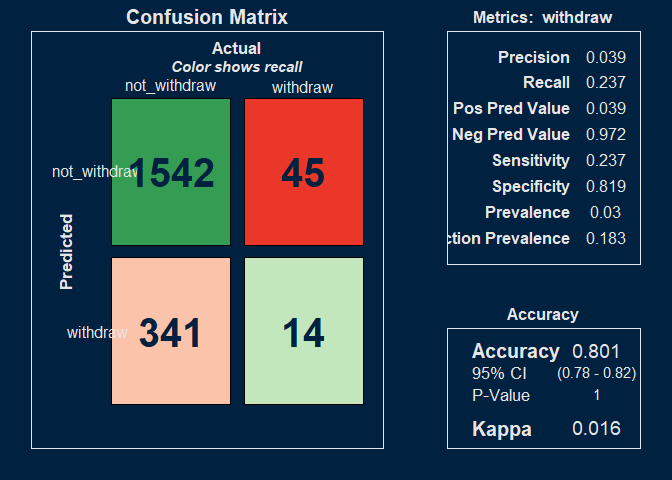
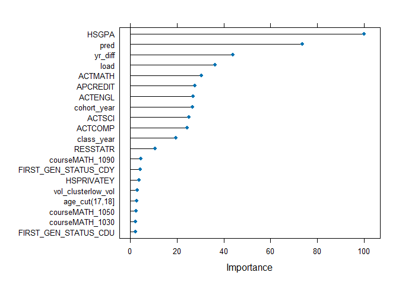
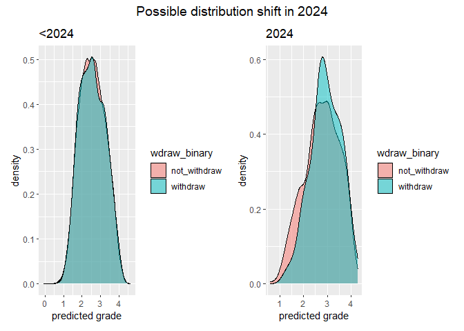
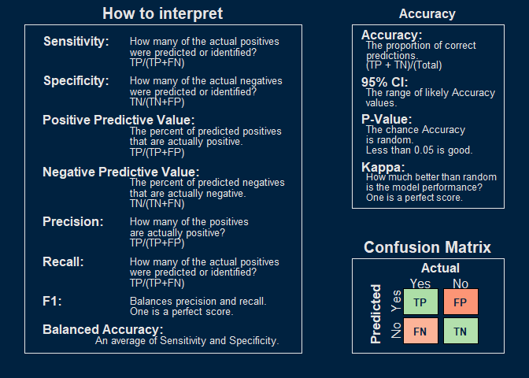

<!-- -->

<!-- -->


<!-- -->

```
## [1] "Logistic regression for years <2024 finds no connection between predicted grade and withdrawal"
```

```
## 
## Call:
## glm(formula = wdraw_numeric ~ pred, family = "binomial", data = pData)
## 
## Coefficients:
##              Estimate Std. Error z value Pr(>|z|)    
## (Intercept) -3.499031   0.121128  -28.89   <2e-16 ***
## pred         0.004121   0.045698    0.09    0.928    
## ---
## Signif. codes:  0 '***' 0.001 '**' 0.01 '*' 0.05 '.' 0.1 ' ' 1
## 
## (Dispersion parameter for binomial family taken to be 1)
## 
##     Null deviance: 9394.5  on 35186  degrees of freedom
## Residual deviance: 9394.5  on 35185  degrees of freedom
## AIC: 9398.5
## 
## Number of Fisher Scoring iterations: 6
```

```
## [1] "Logistic regression for 2024 finds predicted grade significant at p<.1"
```

```
## 
## Call:
## glm(formula = wdraw_numeric ~ pred, family = "binomial", data = pData)
## 
## Coefficients:
##             Estimate Std. Error z value Pr(>|z|)    
## (Intercept)  -4.3476     0.5608  -7.753 8.97e-15 ***
## pred          0.3106     0.1864   1.666   0.0957 .  
## ---
## Signif. codes:  0 '***' 0.001 '**' 0.01 '*' 0.05 '.' 0.1 ' ' 1
## 
## (Dispersion parameter for binomial family taken to be 1)
## 
##     Null deviance: 528.47  on 1941  degrees of freedom
## Residual deviance: 525.62  on 1940  degrees of freedom
## AIC: 529.62
## 
## Number of Fisher Scoring iterations: 6
```


<!-- -->


