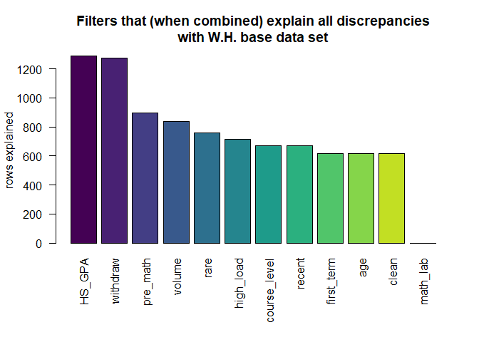

# Executive summary

**PURPOSE:** The purpose of this report is to compare the data sets derived by Bill Prisbrey and Whitney Holt and explain any discrepancies.  

**SITUATION:** Bill Prisbrey and Whitney Holt used different methods to derive data sets used to examine grades in first math courses.  Prisbrey (who is new to this data) derived the data set in R, while Holt used SQL.  Prisbrey extracted all available years, while Holt extracted after Fall 2021. 

**COMPLICATION:** Prisbrey's data set was missing 2,316 rows that were found in Holt's baseline data set for the terms that they had in common.  

**RESOLUTION:** There are no unexplained differences.  An investigation of the filters used by Prisbrey explained all discrepancies with Holt's base data extraction.  

# Filters used by Prisbrey

  |Filter          |Removes                                                                   |
  |----------------|--------------------------------------------------------------------------|
  |High School GPA | Students without a high school GPA                                       |
  |Withdraw        | 'W' grade values                                                         |
  |Pre-math        | Students taking math more than half a year before their cohort date      |
  |Volume          | Courses that are greater than 90% of the cumulative total enrollment     |
  |Rare            | 'V', 'I', 'NC', 'CR' grade values                                        |
  |High load       | Students taking more than the 99th percentile in total credits that term |
  |Course level    | Courses higher than 3000 level                                           |
  |Recent          | Courses that were not after before Spring 2021                           |
  |First Term      | Courses taken in a term after the first term a math course is taken      |
  |Age             | Students younger than 12 years old                                       |
  |Clean           | 'NA' grade values                                                        |
  |Math Lab        | Math labs                                                                |
  

<!-- -->
