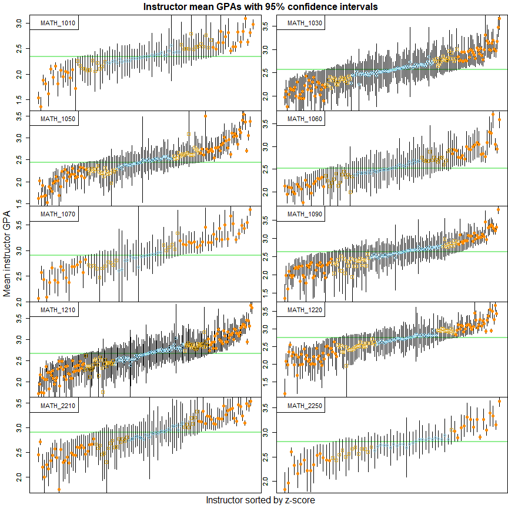
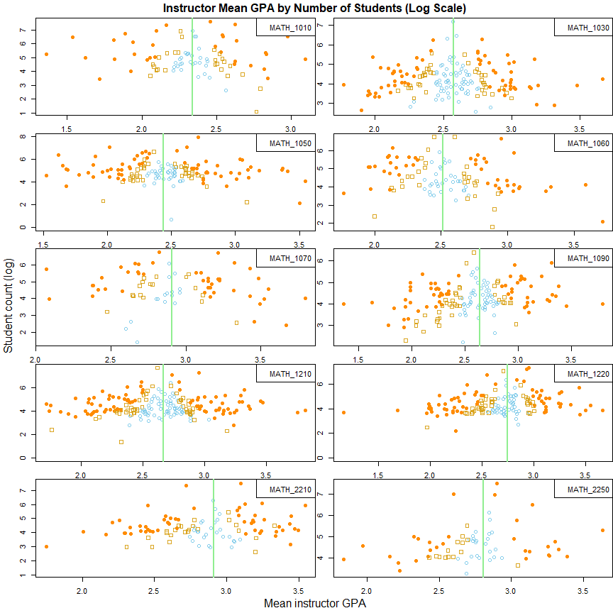

## EXECUTIVE SUMMARY

TBD

## OBJECTIVES   

  (1)  Identify popular math courses
  (2)  Explore variability in grading by instructor
  (3)  Identify common sequences of math courses
  (10) Publish skim description of the data    


## (1) Identify popular math courses

<!-- --><table class="table table-striped table-hover table-condensed" style="font-size: 13px; color: black; width: auto !important; margin-left: auto; margin-right: auto;">
<caption style="font-size: initial !important;">Count of students and instructors per course</caption>
 <thead>
  <tr>
   <th style="text-align:left;"> Course </th>
   <th style="text-align:right;"> Students </th>
   <th style="text-align:right;"> Instructors </th>
   <th style="text-align:left;"> Title </th>
   <th style="text-align:left;"> Cluster </th>
  </tr>
 </thead>
<tbody>
  <tr>
   <td style="text-align:left;"> MATH_1050 </td>
   <td style="text-align:right;"> 25078 </td>
   <td style="text-align:right;"> 145 </td>
   <td style="text-align:left;"> Coll Alg </td>
   <td style="text-align:left;"> <span style="     color: white !important;border-radius: 4px; padding-right: 4px; padding-left: 4px; background-color: purple !important;">2</span> </td>
  </tr>
  <tr>
   <td style="text-align:left;"> MATH_1210 </td>
   <td style="text-align:right;"> 22638 </td>
   <td style="text-align:right;"> 200 </td>
   <td style="text-align:left;"> Calculus I </td>
   <td style="text-align:left;"> <span style="     color: white !important;border-radius: 4px; padding-right: 4px; padding-left: 4px; background-color: purple !important;">2</span> </td>
  </tr>
  <tr>
   <td style="text-align:left;"> MATH_1010 </td>
   <td style="text-align:right;"> 20749 </td>
   <td style="text-align:right;"> 88 </td>
   <td style="text-align:left;"> Intrm Algebra </td>
   <td style="text-align:left;"> <span style="     color: white !important;border-radius: 4px; padding-right: 4px; padding-left: 4px; background-color: purple !important;">2</span> </td>
  </tr>
  <tr>
   <td style="text-align:left;"> MATH_1220 </td>
   <td style="text-align:right;"> 18131 </td>
   <td style="text-align:right;"> 158 </td>
   <td style="text-align:left;"> Calculus II </td>
   <td style="text-align:left;"> <span style="     color: white !important;border-radius: 4px; padding-right: 4px; padding-left: 4px; background-color: dodgerblue !important;">3</span> </td>
  </tr>
  <tr>
   <td style="text-align:left;"> MATH_1030 </td>
   <td style="text-align:right;"> 16188 </td>
   <td style="text-align:right;"> 172 </td>
   <td style="text-align:left;"> Intro Quant Reasoning </td>
   <td style="text-align:left;"> <span style="     color: white !important;border-radius: 4px; padding-right: 4px; padding-left: 4px; background-color: dodgerblue !important;">3</span> </td>
  </tr>
  <tr>
   <td style="text-align:left;"> MATH_1060 </td>
   <td style="text-align:right;"> 12842 </td>
   <td style="text-align:right;"> 106 </td>
   <td style="text-align:left;"> Trig </td>
   <td style="text-align:left;"> <span style="     color: white !important;border-radius: 4px; padding-right: 4px; padding-left: 4px; background-color: dodgerblue !important;">3</span> </td>
  </tr>
  <tr>
   <td style="text-align:left;"> MATH_2210 </td>
   <td style="text-align:right;"> 12571 </td>
   <td style="text-align:right;"> 105 </td>
   <td style="text-align:left;"> Calculus III </td>
   <td style="text-align:left;"> <span style="     color: white !important;border-radius: 4px; padding-right: 4px; padding-left: 4px; background-color: dodgerblue !important;">3</span> </td>
  </tr>
  <tr>
   <td style="text-align:left;"> MATH_1090 </td>
   <td style="text-align:right;"> 12063 </td>
   <td style="text-align:right;"> 154 </td>
   <td style="text-align:left;"> Coll Alg Bus/Soc Sci </td>
   <td style="text-align:left;"> <span style="     color: white !important;border-radius: 4px; padding-right: 4px; padding-left: 4px; background-color: dodgerblue !important;">3</span> </td>
  </tr>
  <tr>
   <td style="text-align:left;"> MATH_1090 </td>
   <td style="text-align:right;"> 12063 </td>
   <td style="text-align:right;"> 154 </td>
   <td style="text-align:left;"> Business Algebra </td>
   <td style="text-align:left;"> <span style="     color: white !important;border-radius: 4px; padding-right: 4px; padding-left: 4px; background-color: dodgerblue !important;">3</span> </td>
  </tr>
  <tr>
   <td style="text-align:left;"> MATH_1070 </td>
   <td style="text-align:right;"> 11428 </td>
   <td style="text-align:right;"> 78 </td>
   <td style="text-align:left;"> Intro Stat Inference </td>
   <td style="text-align:left;"> <span style="     color: white !important;border-radius: 4px; padding-right: 4px; padding-left: 4px; background-color: dodgerblue !important;">3</span> </td>
  </tr>
  <tr>
   <td style="text-align:left;"> MATH_2250 </td>
   <td style="text-align:right;"> 10086 </td>
   <td style="text-align:right;"> 68 </td>
   <td style="text-align:left;"> Diff Equ &amp; Lin Algebra </td>
   <td style="text-align:left;"> <span style="     color: white !important;border-radius: 4px; padding-right: 4px; padding-left: 4px; background-color: dodgerblue !important;">3</span> </td>
  </tr>
  <tr>
   <td style="text-align:left;"> MATH_2250 </td>
   <td style="text-align:right;"> 10086 </td>
   <td style="text-align:right;"> 68 </td>
   <td style="text-align:left;"> Ode's And Lin Alg </td>
   <td style="text-align:left;"> <span style="     color: white !important;border-radius: 4px; padding-right: 4px; padding-left: 4px; background-color: dodgerblue !important;">3</span> </td>
  </tr>
</tbody>
</table>

## (2) Explore variability in grading by instructor


<!-- -->


<!-- -->

Conclusion:  

  (1) That there is large variation in grading between instructors    
  
  (2) That student abilities are not randomly distributed and there is some kind of sorting going on    
  

Possible next steps:    

Predict instructor z-score using:   

  (1) Use student-level information (test scores, high school GPA, high school transcript)    
  (2) Use class-level information (timing, duration, percent of capacity)   
  (3) Use instructor-level information (years of experience, research load)     


## Frequent Fliers

<!-- -->

```
## 
## 00072741 00480481 00672216 00744364 00834999 00179799 
##       20       17       16       16       16       15
```

Probably worth investigating further.   


  
## OBJECTIVE 10: SKIM


