# Executive Summary

### **PURPOSE:**  *This report examines predictors of math course selection and academic performance over time.*  

### **EXECUTIVE SUMMARY:**  *This report finds that math grades awarded have increased; that ACT math test scores has drastically decreased; and that the mix of courses selected has changed.  The students who submit test scores are increasingly elite, with better high school GPA's, test scores, and grade performance in initial math courses.  It also finds that courses and grades are consistently mildly distinguished by high school GPA and ACT math test scores over time; and that transforming these qualifications into z-scores per course improves stability.*

# Discussion  

This report finds many changes over time.  Most notably, grades have increased; test score submission rates have decreased;  and the mix of courses selected has changed. 

***Grades have increased.***  This report finds that the proportion of students earning an 4.0 ("A") has steadily increased from ~20% to ~30% since 2005.  Conversely, the proportion of students achieving a 2.3 ("C+") or worse has declined from ~40% to ~30% in the same time span.  

***Test score submission rates have decreased.***  This report finds that a decreasing number of students submit ACT test scores.  Only one-third of students in high volume courses submitted math test scores in 2024, compared to about 90% submission until 2016.  These students are increasingly elite, with better high school GPA's, test scores, and grade performance in initial math courses.

***Mix of courses selected has changed.***  This report finds that overall enrollment has steadily increased, and that enrollment has increased more in high volume courses (1010, 1050, 1210, 1030, and 1090.)  Among these, Math 1010 and Math 1090 have shifted positions as highest and lowest enrolled classes.  Where Math 1010 used to be the highest enrolled course by a large margin, it is now the lowest enrolled course by a large margin. 

Awarded grades are also higher in the low-volume courses than the high volume courses, with a median grade of 3.7 in the low-volume courses compared to 3.0 for the high-volume courses in 2024.  It is also observed that Math 1090 had a rising median course GPA since 2015, peaking with a median grade of 4.0 in 2020.  The median grade for 1090 has since fallen to be more in alignment with the other high volume courses in 2024.

**Courses and grades are at least mildly distinguished by ACT math test scores and high school GPA.**  Low-volume classes have higher test scores and high school GPA.  Among the high volume classes, Math 1010 has students with the lowest median test scores and high school GPA, and Math 1210 has the highest.

Transforming these incoming qualifications of ACT math test scores and high school GPA into z-scores introduces stability.  The median z-scores and combined distance for on track students is mostly stable.  The median z-scores and combined distance for at risk students shows a strong trend in the last few years, however, particularly in the combined distance for the median at risk student.  This aligns with the the grade compression already noted.  (Here, "on track" is defined as achieving a grade of 2.7 ("B-") or better, and "at risk" is defined as achieving a grade of 2.3 ("C+") or worse.  This cut-off was identified as the optimum in the predictive model described in the accompanying report.)
  
# Enrollment  

### *Courses are separated into high volume or low volume courses.  Courses with less than five percent of the cumulative enrollment are combined together as 'other'.* 

Five math courses have distinctly high enrollment.  These courses are categorized together as "high volume" and designated as "hi_vol" in legends in this course.  These courses are Math 1010, 1050, 1210, 1030, and 1090.  

An additional nine courses are categorized as "low volume."  They are Math 1070, 1220, 1080, 1060, 1310, 2210, 990, 1100, and 1250.

Many small courses that consist of less than 5% of the total enrollment combined are lumped together as "other."

<!-- -->

### *Although enrollment has steadily increased over time, the course mixture has changed as Math 1010 has declined to be replaced by Math 1090.* 

<!-- --><!-- --><!-- -->

# Grade distribution over time

### *The proportion of students receiving an 'A' has increased.*  

<!-- -->

<!-- -->

# ACT test scores
### *Submission of ACT test scores has steeply declined, especially for high volume courses.  Only a third of students in some courses (like Math 1090) have submitted ACT test scores.*

<!-- -->

<!-- --><!-- -->

### *Students who submit test scores are a self-selected elite, with better high school GPAs and more AP credits, a rising median ACT score, and consequent better math performance.*   

<!-- --><!-- -->

On average, test submitters' high school GPA is 0.26 higher than non-test submitters. 

<!-- --><!-- -->

Test score submitters' median AP credit was three credits higher than non-test submitters' median.

<!-- --><!-- -->

<!-- --><!-- -->

Math grades have diverged until test score submitters have a median math grade 0.7 points higher than non-submitters in 2024 (3.7 compared to 3.0.) 

###  *Courses are distinguished by ACT math scores with heavy overlap.*

<!-- -->

<!-- --><!-- -->

# High school GPA
### *Median high school GPA has increased over the years, with the courses mildly distinguished by high school GPA with heavy overlap.* 

<!-- --><!-- --><!-- -->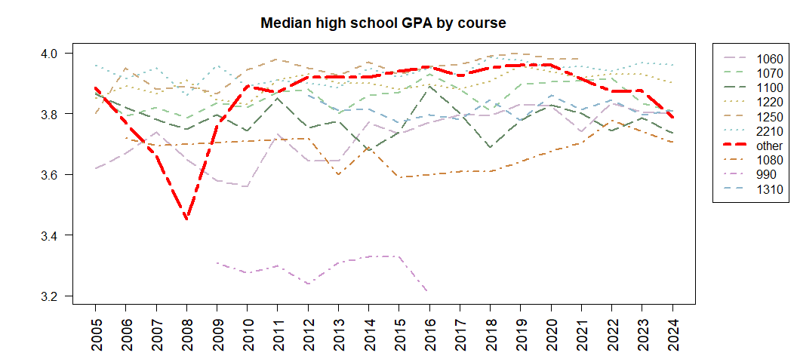<!-- -->

<!-- -->

# Math grades 
### *The median math grade fluctuates over time without a clear trend, while above-median grades shift higher:  the 70th percentile shifts from a B+ to an A in 2016.*  

<!-- -->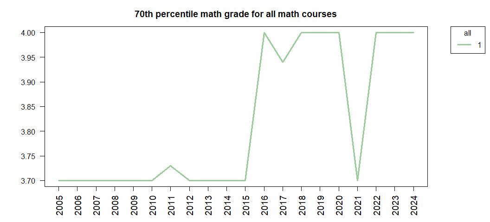<!-- -->

### *Low-volume classes have maintained a higher median GPA than high-volume classes, and seem to have recently stabilized at their twenty-year high.* 

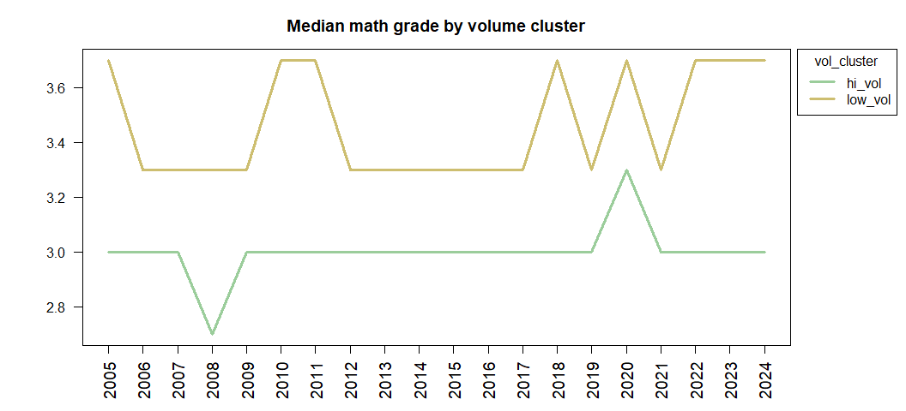<!-- -->

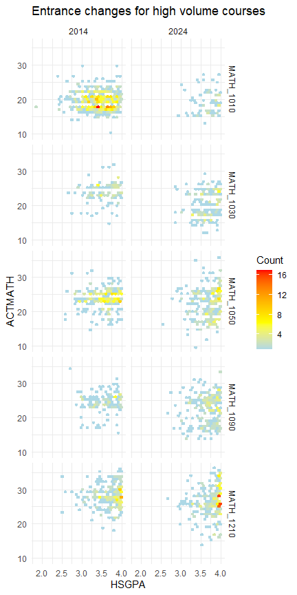<!-- -->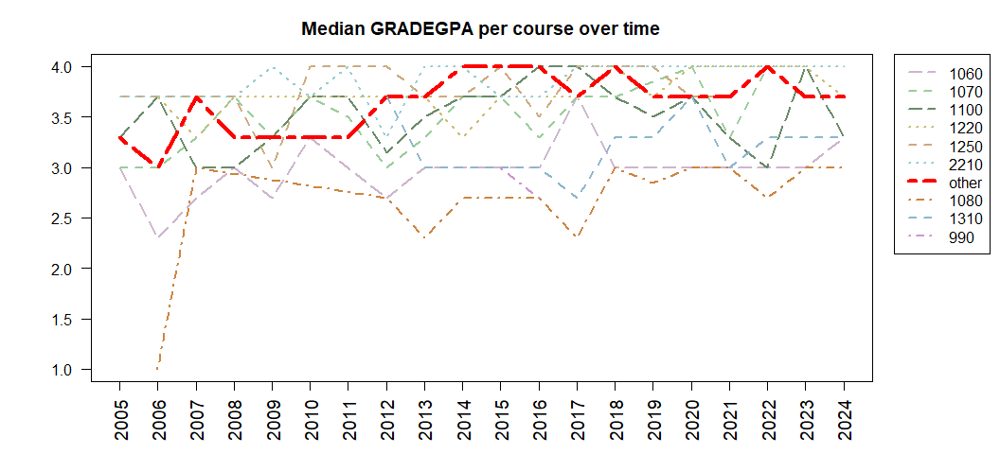<!-- -->

Math 1090 peaked with a median grade of 4.0 in 2020.
 
### *Courses are not distinguished by grade distribution.*   

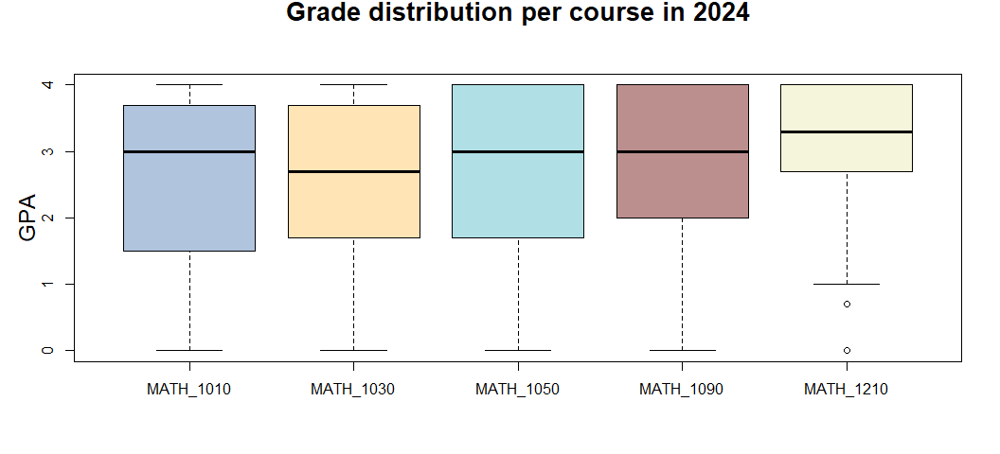<!-- -->

# Z-scores

### *Successfully on track students are closer to the prior year's median successful student.*  

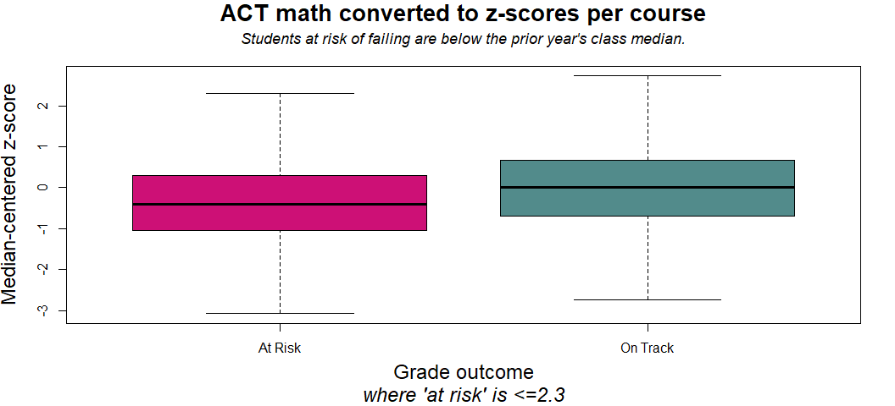<!-- -->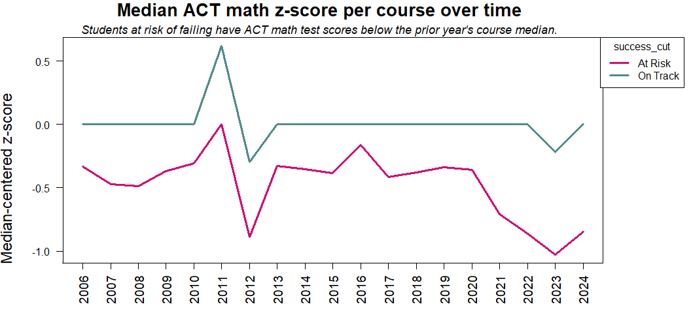<!-- -->

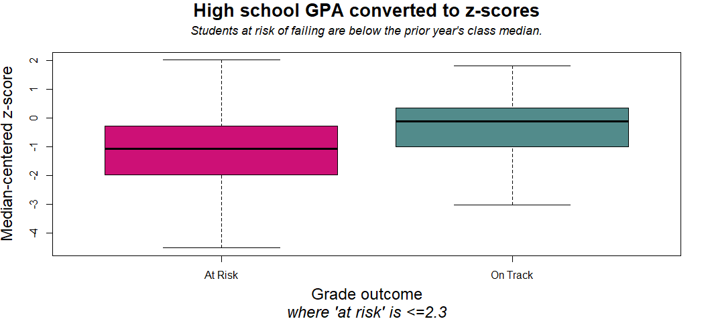<!-- -->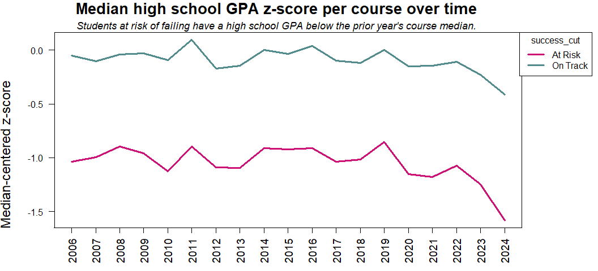<!-- -->

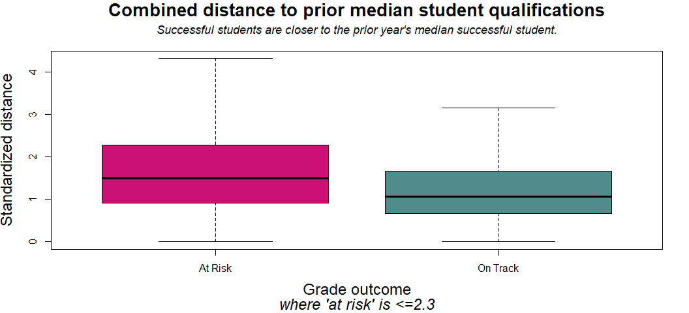<!-- -->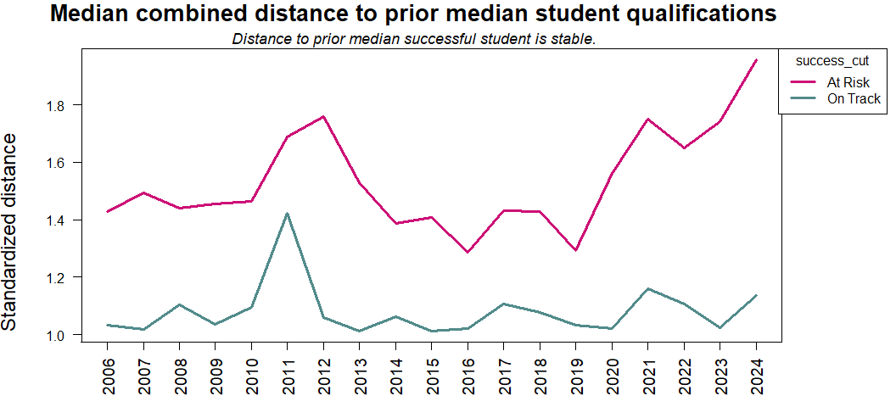<!-- -->

# Additional comparison graphics  

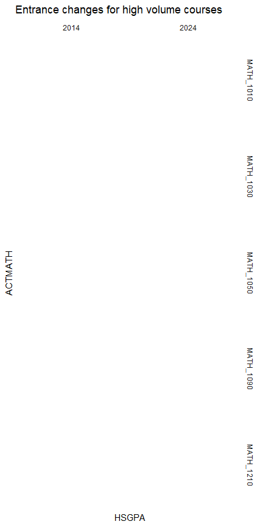<!-- -->

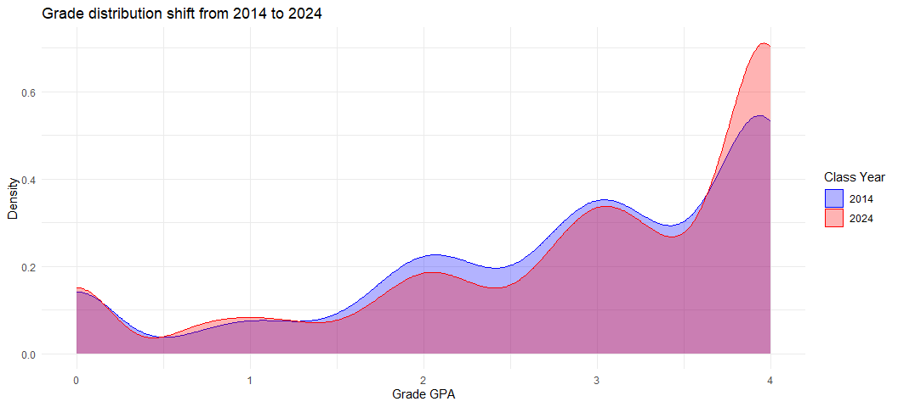<!-- -->

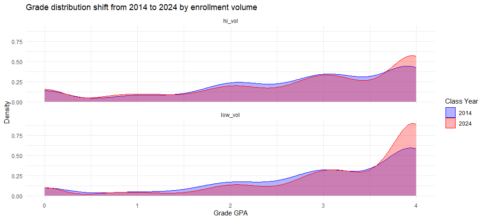<!-- -->

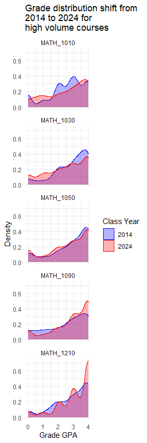<!-- -->

