Some kind of words here.


```
##  [1] "MATH_1010" "MATH_1050" "MATH_1210" "MATH_1030" "MATH_1090" "MATH_1070"
##  [7] "MATH_1220" "MATH_1080" "MATH_1060" "MATH_1310" "MATH_2210" "MATH_990" 
## [13] "MATH_1100" "MATH_1250"
```

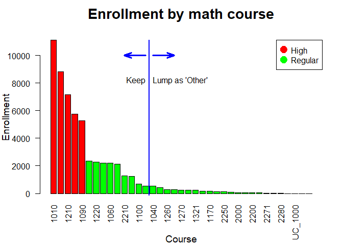<!-- -->

ACT over time

- Number of students who submit a score 
- Median score, maybe 75th or 90th percentile
- Enrollment, using EMPLID

I need to compare over-all population, and "complete.cases" population used in the predictor.  ACT MATH submissions especially.


# Enrollment

<!-- -->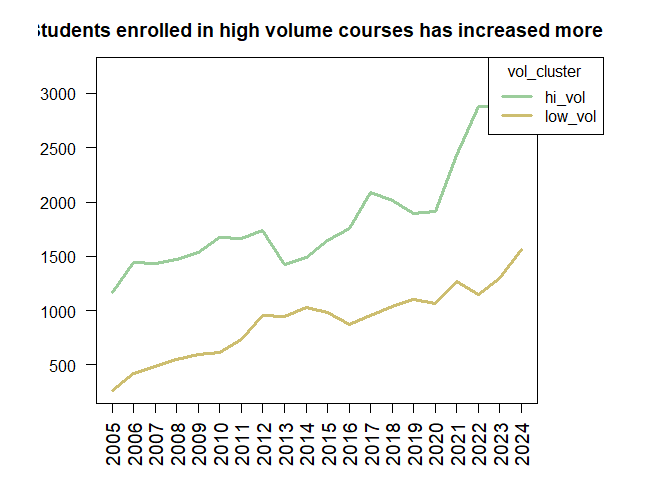<!-- -->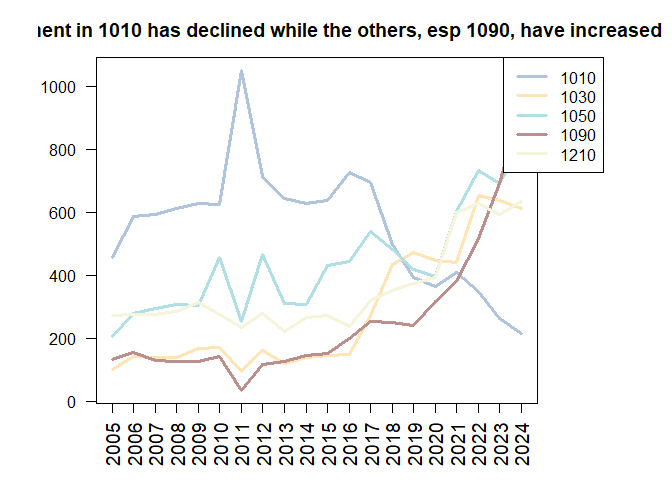<!-- -->

# Submission of ACT test scores


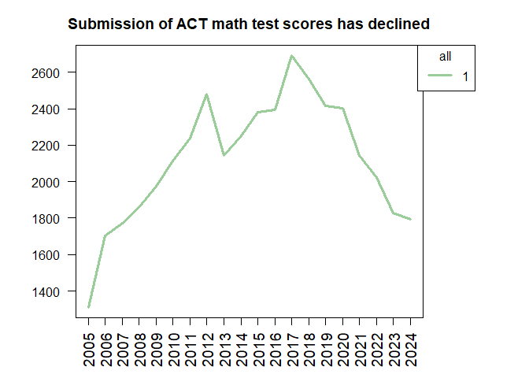<!-- --><!-- -->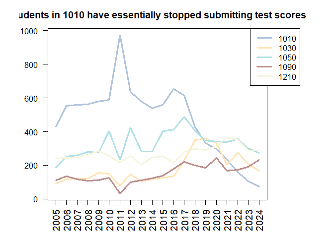<!-- -->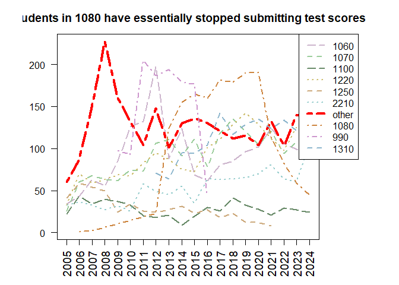<!-- -->

### Fraction submitting test scores

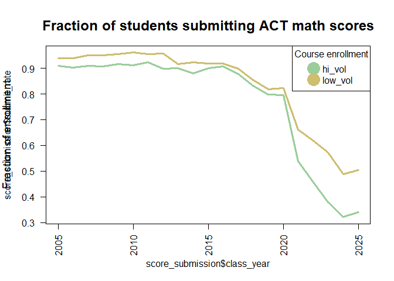<!-- -->

# Comparing submitters and non-submitters

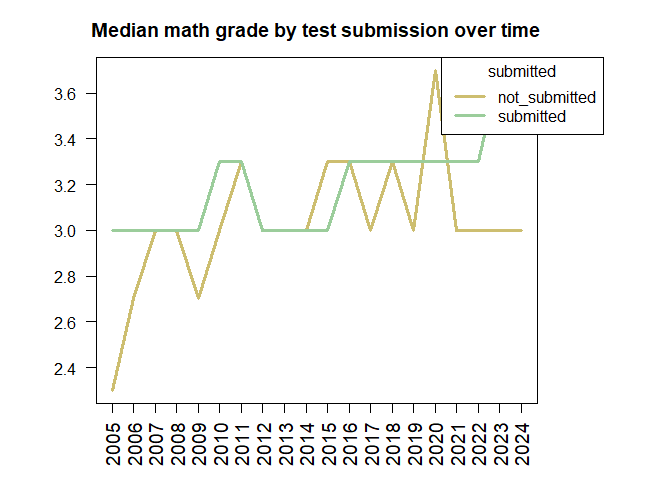<!-- -->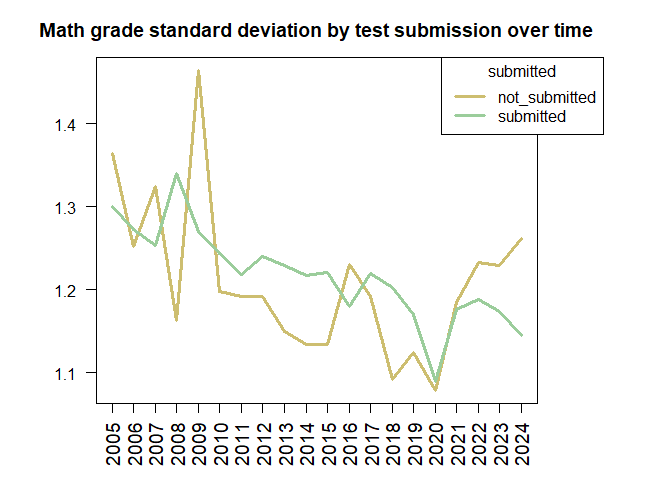<!-- -->

Math grades have diverged such that test submitters have a median math GPA of 3.6 compared to 3.0 for non-test submitters. 

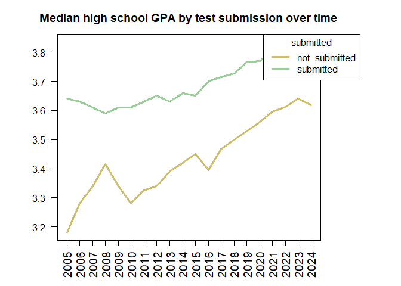<!-- -->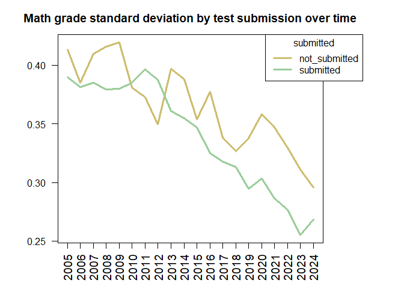<!-- -->

On average, test submitters' high school GPA is 0.26 higher than non-test submitters. 


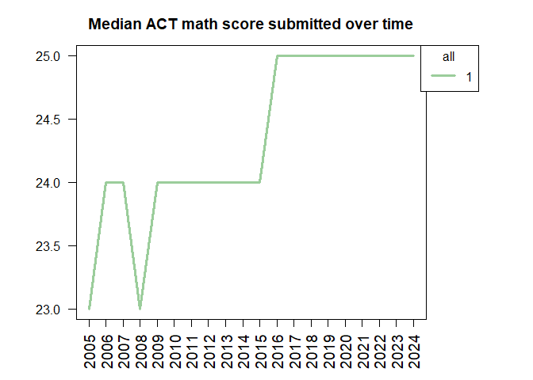<!-- -->


# Grade inflation

I'm not sure if I have much to show here.

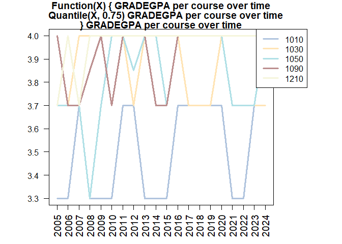<!-- -->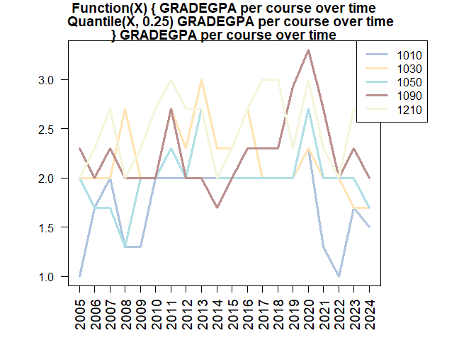<!-- -->


Check out hsgpa, and gpa, and actmath scores by submitted and un-submitted over time.
Looks like submitters might simply be an increasingly elite group of students, so it "looks like" grade inflation but I'm just getting the more elite students to self-identify.


This report needs a complete overhaul.

What I need to do: 
 - Keep your first graphic that explains enrollment numbers and lumping into "other"
 - Repeat function "overTime" for the top handful of predictors
 - Double-check the use of "length" to mean the number of people enrolling or submitting test scores.  It seems too low 
    - I want to find out what percentage of students submit ACTMATH scores. 
 - Pull in some of the graphics from "Math grade by ACT and test score" into here, and leave that for just the heat maps
 - Compare pre-2020 heatmaps vs the heatmaps of 2024

==

Where is that document I was working on?
I was looking at predictors over time, and it was a report of descriptive things. 

It was "Math grade by ACT math score and high school GPA.Rmd"

Seems like I c/should break that into two reports, and one report is just the heatmaps. Or, more accurately, a child I guess.  And it should be "admittance" on left and "performance" on right.  

I'm also pretty sure I haven't knitted the latest version of it.


I need to create an appendix that shows all of the cleaning steps. All of these filters and complete cases. 

But first, let's show our math classes by enrollment

STARTING DESCRIPTIVES


### ACT math scores per course over time

<!-- -->


```
## [[1]]
## NULL
## 
## [[2]]
## NULL
## 
## [[3]]
## NULL
## 
## [[4]]
## NULL
## 
## [[5]]
## NULL
```

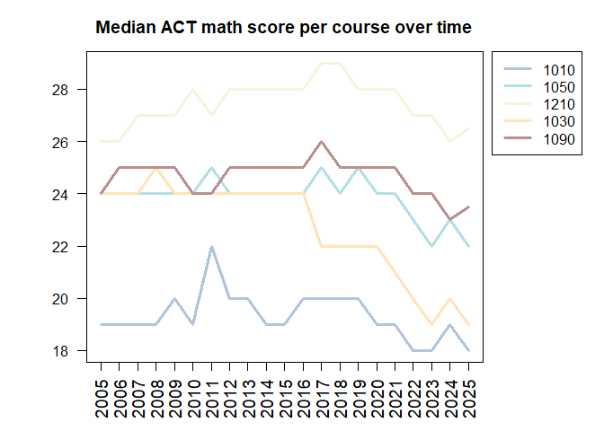<!-- -->

And this would look good as a plotly.

I need to see if ACT has gone down over time  
I need to see how the math grade and the HSGPA have changed over time 

<!-- -->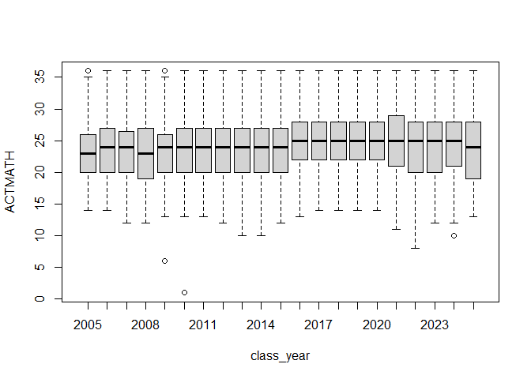<!-- -->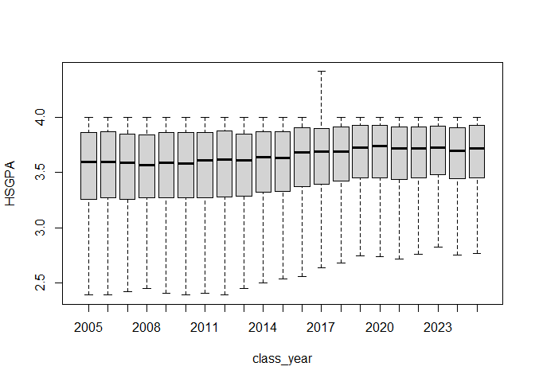<!-- -->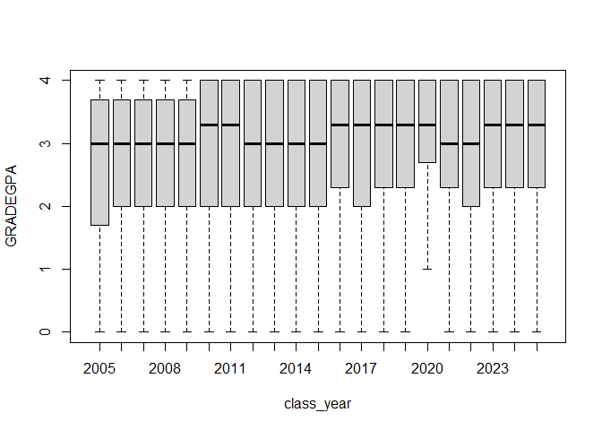<!-- -->


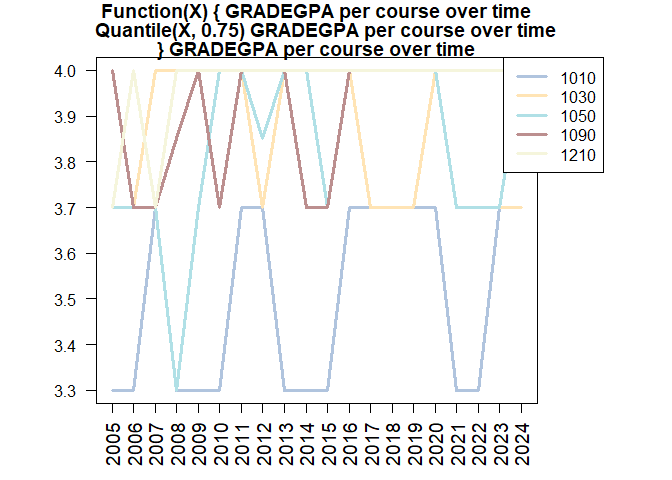<!-- -->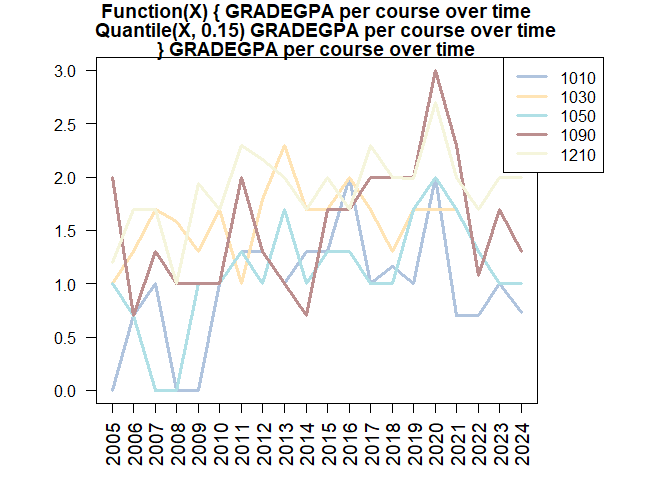<!-- -->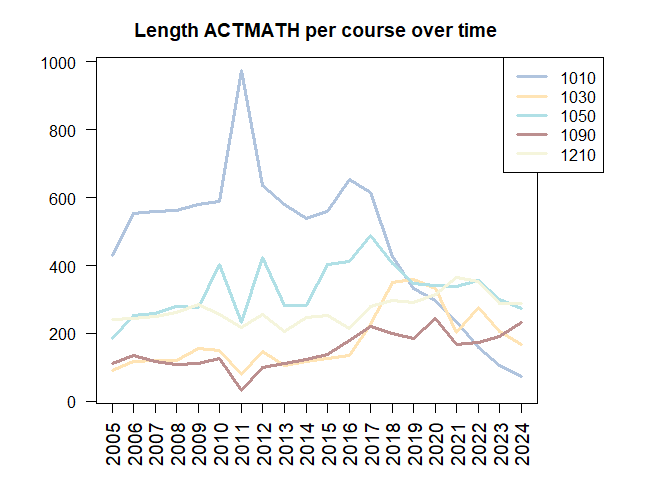<!-- -->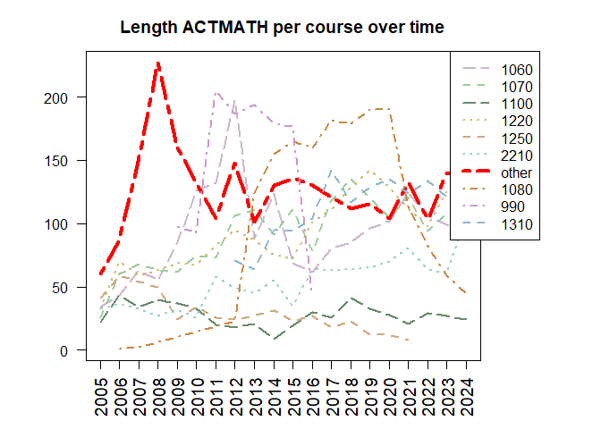<!-- -->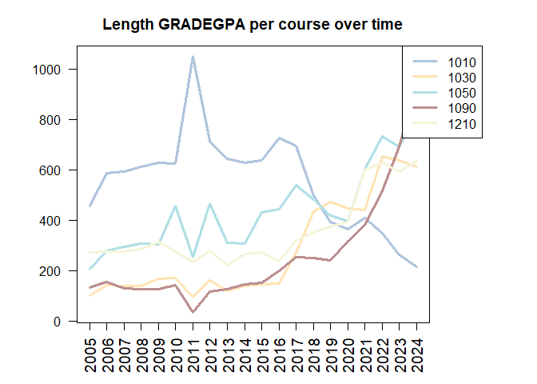<!-- -->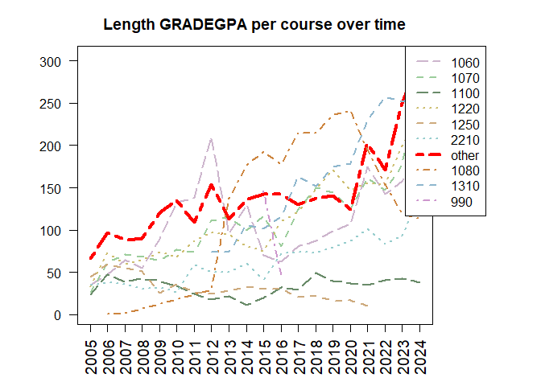<!-- -->

<!-- -->

Seems like I want a report that is "overview of first time freshman" and describes a few factoids about first time freshmen over time --

-- Like, how many, median HSGPA and ACT MATH scores, how many submit the scores 
-- Focus on the predictors that I'm using.

Then, I want an "overview of first math courses for first time freshmen" ... and then describe like I'm doing here.  What fraction of first time freshmen take a math class at the U? What fraction take them in Semesters 1 thru 4?  What fraction only take one math class ... and they are done?   I'd want to compare this to the top ten math courses, and include a nod to the number of instructors. 

Then, I can show "predicting course selection and academic performance" ... and that's my predictive models.  

Then, using causal inference methods, I can write a "recommending course".

A couple of explanatory graphics includes --
- PERFORMANCE = MOTIVATION x ABILITY and subset ability to "Math"  and "Study" Ability

- Time experience  (Prior knowledge --> course selection --> course performance)

There's a lot that I don't have explained  --

Like, so --- so the grade prediction remains high even though the course performance is low.  How irrelevant is course selection?  Isn't that interesting? 

If I told a student, "You'll get a B plus-or-minus one letter grade," I mean, is that what I'm telling him?  

I have a lot of good stuff here.  I just gotta, like, write it up.

I still want to see heatmaps at different instances in time.  

It's almost like I need to write several reports.  One, the massive appendix, is a pile of technical reports that can be referenced.  Then, on top of that, is the "summary" for the lay-reader with the main take-aways and points. 

O.k., let's get three reports polished and moved to the U drive-- Course over time, Grades over time, and predictors over time. 


