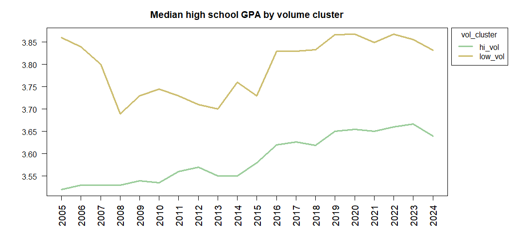
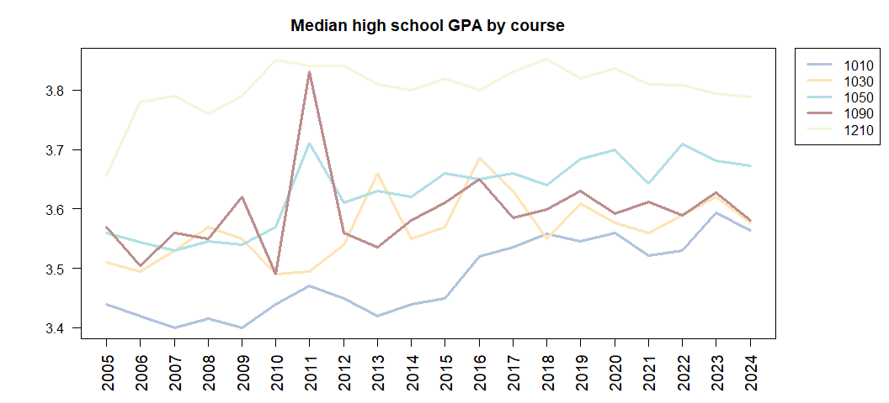

**PURPOSE:**  This report examines predictors of math course selection and academic performance over time.  

**EXECUTIVE SUMMARY:**  This report finds that a decreasing number of students submit ACT test scores.  Theses students are increasingly elite, with better high school GPA's, test scores, and grade performance in initial math courses.

# Discussion  

# Enrollment  

### *Courses are separated into high volume or low volume courses.  Courses with less than five percent of the cumulative enrollment are combined together as 'other'.* 

Five math courses have distinctly high enrollment.  These courses are categorized together as "high volume" and designated as "hi_vol" in legends in this course.  These courses are Math 1010, 1050, 1210, 1030, and 1090.  

An additional nine courses are categorized as "low volume."  They are Math 1070, 1220, 1080, 1060, 1310, 2210, 990, 1100, and 1250.

Many small courses that consist of less than 5% of the total enrollment combined are lumped together as "other."

<!-- -->

These courses are more prominent recently but have been included in the 'other' category.

<!-- --><!-- -->

### *Although enrollment has steadily increased over time, the course mixture has changed as Math 1010 has declined to be replaced by Math 1090.* 

<!-- --><!-- --><!-- -->

# ACT test scores
### *Submission of ACT test scores has steeply declined, especially for high volume courses.  Only a third of students in some courses (like Math 1090) have submitted ACT test scores.*

<!-- -->

<!-- --><!-- -->

### *Students who submit test scores are a self-selected elite, with better high school GPAs and more AP credits, a rising median ACT score, and consequent better math performance.*   

<!-- --><!-- -->

On average, test submitters' high school GPA is 0.26 higher than non-test submitters. 

<!-- --><!-- -->

Test score submitters' median AP credit was three credits higher than non-test submitters' median.

<!-- --><!-- -->

<!-- --><!-- -->

Math grades have diverged until test score submitters have a median math grade 0.7 points higher than non-submitters in 2024 (3.7 compared to 3.0.) 

###  *Courses are distinguished by ACT math scores with heavy overlap.*

<!-- -->

<!-- --><!-- -->

# High school GPA
### *Interpret the graphics* 

<!-- --><!-- --><!-- --><!-- -->

# Math grades 
### *The median math grade fluctuates over time without a clear trend, while above-median grades shift higher:  the 70th percentile shifts from a B+ to an A in 2015.*  

<!-- --><!-- -->

### *Low-volume classes have maintained a higher median GPA than high-volume classes, and seem to have recently stabilized at their twenty-year high.* 

<!-- -->

<!-- --><!-- -->

Math 1090 peaked with a median grade of 4.0 in 2020.
 
### *Courses are not distinguished by grade distribution.*   

<!-- -->

