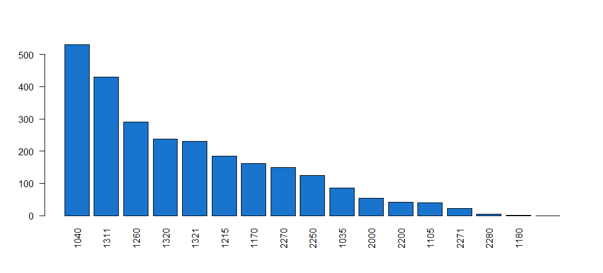
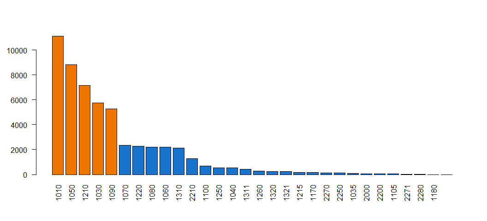
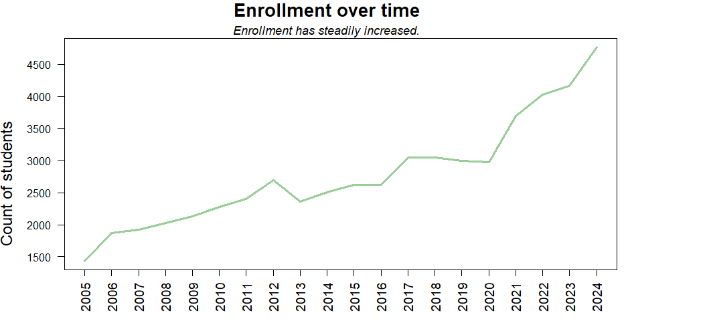
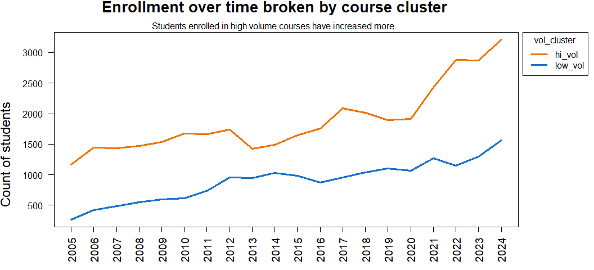
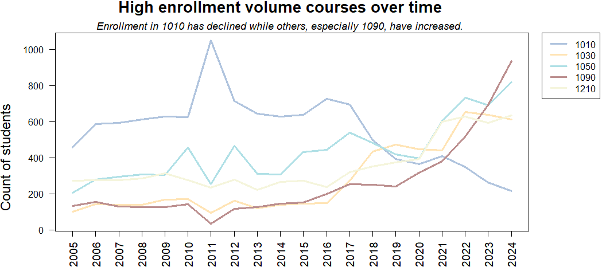
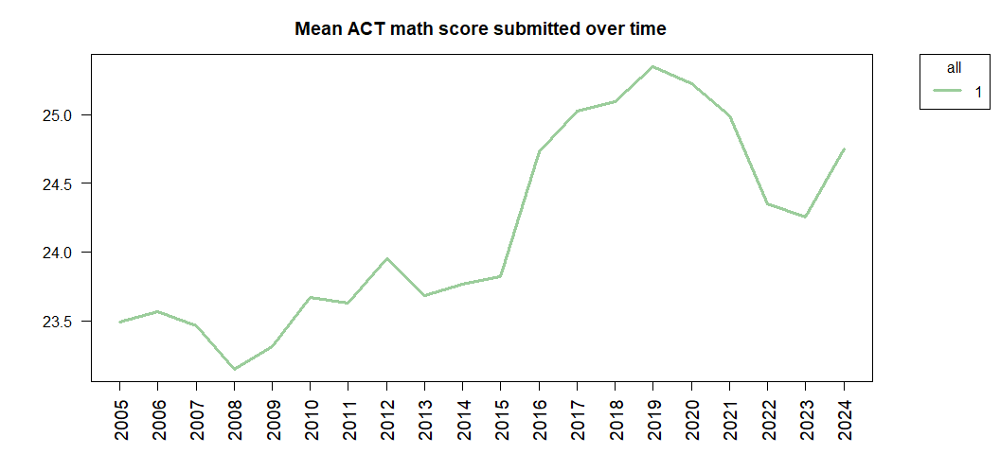
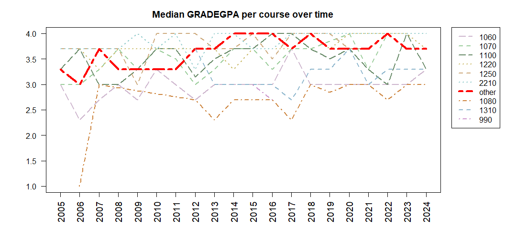
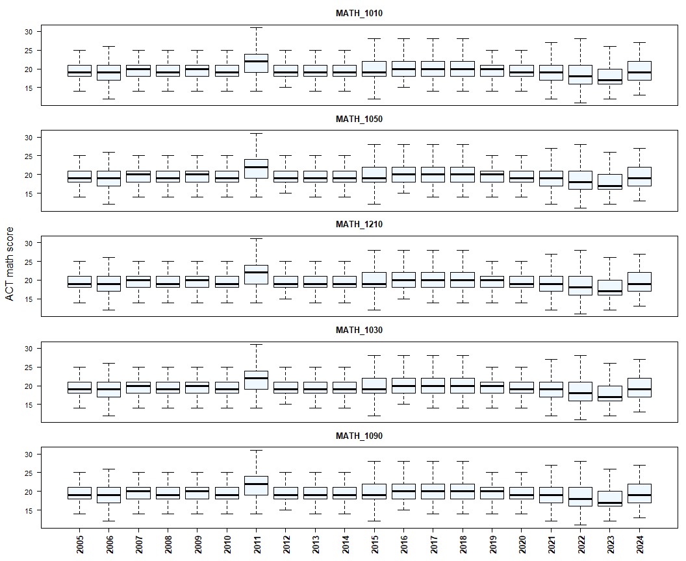

**PURPOSE:**  This report examines predictors of math course selection and academic performance over time.  

**EXECUTIVE SUMMARY:**  This report finds that a decreasing number of students submit ACT test scores.  Theses students are increasingly elite, with better high school GPA's, test scores, and grade performance in initial math courses.

# DISCUSSION

# Enrollment  

### *Courses are separated into high volume or low volume courses.  Courses with less than five percent of the cumulative enrollment are combined together as 'other'.* 

Five math courses have distinctly high enrollment.  These courses are categorized together as "high volume" and designated as "hi_vol" in legends in this course.  These courses are Math 1010, 1050, 1210, 1030, and 1090.  

An additional nine courses are categorized as "low volume."  They are Math 1070, 1220, 1080, 1060, 1310, 2210, 990, 1100, and 1250.

Many small courses that consist of less than 5% of the total enrollment combined are lumped together as "other."

<!-- -->

These courses are more prominent recently but have been included in the 'other' category.

<!-- --><!-- -->

### *Although enrollment has steadily increased over time, the course mixture has changed as Math 1010 has declined to be replaced by Math 1090.* 

<!-- --><!-- --><!-- -->

# ACT test scores
### *Submission of ACT test scores has steeply declined, especially for high volume courses.  Only a third of students in some courses (like Math 1090) have submitted ACT test scores.*

<!-- -->

<!-- --><!-- -->

### *Students who submit test scores are a self-selected elite, with better high school GPAs and more AP credits, a rising median ACT score, and consequent better math performance.*   

<!-- --><!-- -->

On average, test submitters' high school GPA is 0.26 higher than non-test submitters. 

<!-- --><!-- -->

Test score submitters' median AP credit was three credits higher than non-test submitters' median.

<!-- --><!-- -->

<!-- --><!-- -->

Math grades have diverged until test score submitters have a median math grade 0.7 points higher than non-submitters in 2024 (3.7 compared to 3.0.) 

### *The median math grade fluctuates over time without a clear trend, while above-median grades shift higher:  the 70th percentile shifts from a B+ to an A in 2015.*  

<!-- --><!-- -->

<!-- --><!-- -->

Low-volume classes have maintained a higher median GPA than high-volume classes, and seem to have recently stabilized at their twenty-year high.  

<!-- --><!-- -->

Math 1090 peaked with a median grade of 4.0 in 2020. 

###  *Courses are distinguished by ACT math scores with heavy overlap.*

<!-- -->

<!-- --><!-- -->

<!-- -->

# Nothing happens after here

Grade inflation

Looks like 1010 is tough and 1090 is easy (....?)

Check out hsgpa, and gpa, and actmath scores by submitted and un-submitted over time.
Looks like submitters might simply be an increasingly elite group of students, so it "looks like" grade inflation but I'm just getting the more elite students to self-identify.

This report needs a complete overhaul.

What I need to do: 
 - Keep your first graphic that explains enrollment numbers and lumping into "other"
 - Repeat function "overTime" for the top handful of predictors
 - Double-check the use of "length" to mean the number of people enrolling or submitting test scores.  It seems too low 
    - I want to find out what percentage of students submit ACTMATH scores. 
 - Pull in some of the graphics from "Math grade by ACT and test score" into here, and leave that for just the heat maps
 - Compare pre-2020 heatmaps vs the heatmaps of 2024

==

Where is that document I was working on?
I was looking at predictors over time, and it was a report of descriptive things. 

It was "Math grade by ACT math score and high school GPA.Rmd"

Seems like I c/should break that into two reports, and one report is just the heatmaps. Or, more accurately, a child I guess.  And it should be "admittance" on left and "performance" on right.  

I'm also pretty sure I haven't knitted the latest version of it.

I need to create an appendix that shows all of the cleaning steps. All of these filters and complete cases. 

But first, let's show our math classes by enrollment

STARTING DESCRIPTIVES

### ACT math scores per course over time

<!-- -->

And this would look good as a plotly.

I need to see if ACT has gone down over time  
I need to see how the math grade and the HSGPA have changed over time 

Seems like I want a report that is "overview of first time freshman" and describes a few factoids about first time freshmen over time --

-- Like, how many, median HSGPA and ACT MATH scores, how many submit the scores 
-- Focus on the predictors that I'm using.

Then, I want an "overview of first math courses for first time freshmen" ... and then describe like I'm doing here.  What fraction of first time freshmen take a math class at the U? What fraction take them in Semesters 1 thru 4?  What fraction only take one math class ... and they are done?   I'd want to compare this to the top ten math courses, and include a nod to the number of instructors. 

Then, I can show "predicting course selection and academic performance" ... and that's my predictive models.  

Then, using causal inference methods, I can write a "recommending course".

A couple of explanatory graphics includes --
- PERFORMANCE = MOTIVATION x ABILITY and subset ability to "Math"  and "Study" Ability

- Time experience  (Prior knowledge --> course selection --> course performance)

There's a lot that I don't have explained  --

Like, so --- so the grade prediction remains high even though the course performance is low.  How irrelevant is course selection?  Isn't that interesting? 

If I told a student, "You'll get a B plus-or-minus one letter grade," I mean, is that what I'm telling him?  

I have a lot of good stuff here.  I just gotta, like, write it up.

I still want to see heatmaps at different instances in time.  

It's almost like I need to write several reports.  One, the massive appendix, is a pile of technical reports that can be referenced.  Then, on top of that, is the "summary" for the lay-reader with the main take-aways and points. 

O.k., let's get three reports polished and moved to the U drive-- Course over time, Grades over time, and predictors over time. 

