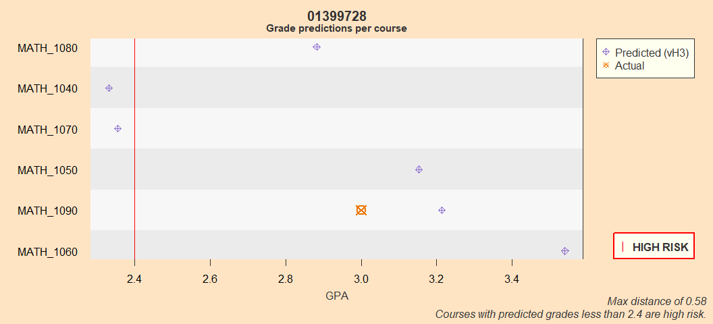

**EXPLANATION:** 

This document can be used to help the incoming freshman select a math course.  

It provides the statistical distance to the qualifications of successful students in the prior year's courses.  Academic performance roughly decreases with distance and courses with a distance measure larger than three are not recommended.  

It also provides individual grade expectations per course based on available information about the student and the department's historical records.  

These projected grades have a large margin of error and many students who are projected to perform well end up performing poorly, and vice versa.  [Say something about the importance of work ethic and individual effort, and that important factors like concurrent course load, course schedule, and individual circumstances are not captured.]

**IMPORTANT NOTE:** 

***This document shows historical projections and actual performance for students in 2024.*** 
  

# Student ID: 01399728

<!-- -->

## Distance  

<!-- -->

## Projections 

<!-- -->

## Table 

<table class="table table-striped table-hover" style="color: black; width: auto !important; ">
<caption>Student  01399728</caption>
 <thead>
  <tr>
   <th style="text-align:center;"> HS GPA </th>
   <th style="text-align:center;"> ACT Math </th>
  </tr>
 </thead>
<tbody>
  <tr>
   <td style="text-align:center;"> 3.91 </td>
   <td style="text-align:center;"> 24 </td>
  </tr>
</tbody>
</table>

<table class="table table-striped table-hover" style="color: black; width: auto !important; margin-left: auto; margin-right: auto;">
<caption>Distance to median successful student and predicted grades</caption>
 <thead>
  <tr>
   <th style="text-align:left;">   </th>
   <th style="text-align:center;"> Distance </th>
   <th style="text-align:center;"> Predicted Grade </th>
   <th style="text-align:center;"> Median ACT Math </th>
   <th style="text-align:center;"> Median HS GPA </th>
  </tr>
 </thead>
<tbody>
  <tr>
   <td style="text-align:left;"> MATH_1080 </td>
   <td style="text-align:center;"> 0.06 </td>
   <td style="text-align:center;"> 2.88 </td>
   <td style="text-align:center;"> 24.0 </td>
   <td style="text-align:center;"> 3.90 </td>
  </tr>
  <tr>
   <td style="text-align:left;"> MATH_1040 </td>
   <td style="text-align:center;"> 0.13 </td>
   <td style="text-align:center;"> 2.33 </td>
   <td style="text-align:center;"> 24.0 </td>
   <td style="text-align:center;"> 3.89 </td>
  </tr>
  <tr>
   <td style="text-align:left;"> MATH_1070 </td>
   <td style="text-align:center;"> 0.13 </td>
   <td style="text-align:center;"> 2.36 </td>
   <td style="text-align:center;"> 24.5 </td>
   <td style="text-align:center;"> 3.93 </td>
  </tr>
  <tr>
   <td style="text-align:left;"> MATH_1050 </td>
   <td style="text-align:center;"> 0.41 </td>
   <td style="text-align:center;"> 3.15 </td>
   <td style="text-align:center;"> 24.0 </td>
   <td style="text-align:center;"> 3.81 </td>
  </tr>
  <tr>
   <td style="text-align:left;"> MATH_1090 </td>
   <td style="text-align:center;"> 0.58 </td>
   <td style="text-align:center;"> 3.21 </td>
   <td style="text-align:center;"> 24.0 </td>
   <td style="text-align:center;"> 3.76 </td>
  </tr>
  <tr>
   <td style="text-align:left;"> MATH_1060 </td>
   <td style="text-align:center;"> 0.58 </td>
   <td style="text-align:center;"> 3.54 </td>
   <td style="text-align:center;"> 26.0 </td>
   <td style="text-align:center;"> 3.91 </td>
  </tr>
  <tr>
   <td style="text-align:left;"> MATH_1215 </td>
   <td style="text-align:center;"> 0.72 </td>
   <td style="text-align:center;"> 2.95 </td>
   <td style="text-align:center;"> 27.0 </td>
   <td style="text-align:center;"> 3.91 </td>
  </tr>
  <tr>
   <td style="text-align:left;"> MATH_1210 </td>
   <td style="text-align:center;"> 0.76 </td>
   <td style="text-align:center;"> 2.71 </td>
   <td style="text-align:center;"> 27.0 </td>
   <td style="text-align:center;"> 3.92 </td>
  </tr>
  <tr>
   <td style="text-align:left;"> MATH_1030 </td>
   <td style="text-align:center;"> 0.80 </td>
   <td style="text-align:center;"> 3.14 </td>
   <td style="text-align:center;"> 22.0 </td>
   <td style="text-align:center;"> 3.76 </td>
  </tr>
  <tr>
   <td style="text-align:left;"> MATH_1100 </td>
   <td style="text-align:center;"> 0.98 </td>
   <td style="text-align:center;"> 2.97 </td>
   <td style="text-align:center;"> 26.5 </td>
   <td style="text-align:center;"> 3.88 </td>
  </tr>
  <tr>
   <td style="text-align:left;"> MATH_1310 </td>
   <td style="text-align:center;"> 1.06 </td>
   <td style="text-align:center;"> 2.79 </td>
   <td style="text-align:center;"> 28.0 </td>
   <td style="text-align:center;"> 3.92 </td>
  </tr>
  <tr>
   <td style="text-align:left;"> MATH_1320 </td>
   <td style="text-align:center;"> 1.11 </td>
   <td style="text-align:center;"> 2.66 </td>
   <td style="text-align:center;"> 29.0 </td>
   <td style="text-align:center;"> 3.92 </td>
  </tr>
  <tr>
   <td style="text-align:left;"> MATH_1010 </td>
   <td style="text-align:center;"> 1.23 </td>
   <td style="text-align:center;"> 3.14 </td>
   <td style="text-align:center;"> 20.0 </td>
   <td style="text-align:center;"> 3.80 </td>
  </tr>
  <tr>
   <td style="text-align:left;"> MATH_1105 </td>
   <td style="text-align:center;"> 1.27 </td>
   <td style="text-align:center;"> 3.13 </td>
   <td style="text-align:center;"> 25.0 </td>
   <td style="text-align:center;"> 3.62 </td>
  </tr>
  <tr>
   <td style="text-align:left;"> MATH_2271 </td>
   <td style="text-align:center;"> 1.67 </td>
   <td style="text-align:center;"> 2.74 </td>
   <td style="text-align:center;"> 35.0 </td>
   <td style="text-align:center;"> 3.95 </td>
  </tr>
  <tr>
   <td style="text-align:left;"> MATH_1220 </td>
   <td style="text-align:center;"> 1.70 </td>
   <td style="text-align:center;"> 2.83 </td>
   <td style="text-align:center;"> 30.0 </td>
   <td style="text-align:center;"> 3.96 </td>
  </tr>
</tbody>
</table>

