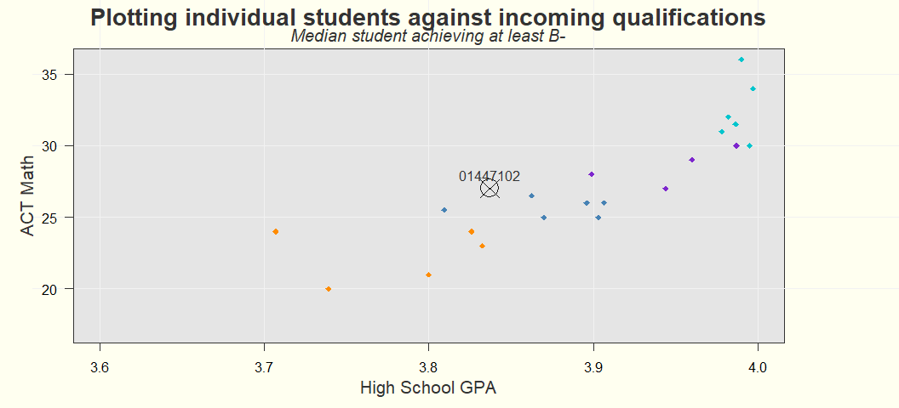
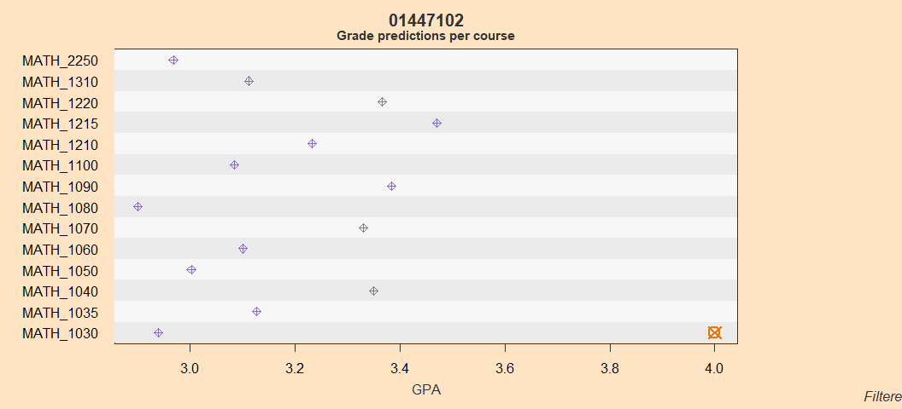

**EXPLANATION:** 

This document can be used to help the incoming freshman select a math course.  

It provides the statistical distance to the qualifications of successful students in the prior year's courses.  Academic performance roughly increases with distance and courses with a distance measure larger than three are not recommended.  

It also provides individual grade expectations per course based on available information about the student and the department's historical records.  

These projected grades have a large margin of error and many students who are projected to perform well end up performing poorly, and many students who are projected to flunk end up performing well.  

  

# Student ID: 01447102

## Distance  

<!-- -->

## Projections 

<!-- -->

## Table 

<table class="table table-striped table-hover" style="color: black; width: auto !important; ">
<caption>Student  01447102</caption>
 <thead>
  <tr>
   <th style="text-align:center;"> HS GPA </th>
   <th style="text-align:center;"> ACT Math </th>
  </tr>
 </thead>
<tbody>
  <tr>
   <td style="text-align:center;"> 3.84 </td>
   <td style="text-align:center;"> 27 </td>
  </tr>
</tbody>
</table>

<table class="table table-striped table-hover" style="color: black; width: auto !important; margin-left: auto; margin-right: auto;">
<caption>Distance to median successful student and predicted grades</caption>
 <thead>
  <tr>
   <th style="text-align:left;">   </th>
   <th style="text-align:center;"> Distance </th>
   <th style="text-align:center;"> Predicted Grade </th>
   <th style="text-align:center;"> Median ACT Math </th>
   <th style="text-align:center;"> Median HS GPA </th>
  </tr>
 </thead>
<tbody>
  <tr>
   <td style="text-align:left;"> MATH_1040 </td>
   <td style="text-align:center;"> 0.18 </td>
   <td style="text-align:center;"> 3.35 </td>
   <td style="text-align:center;"> 26.5 </td>
   <td style="text-align:center;"> 3.86 </td>
  </tr>
  <tr>
   <td style="text-align:left;"> MATH_1100 </td>
   <td style="text-align:center;"> 0.36 </td>
   <td style="text-align:center;"> 3.08 </td>
   <td style="text-align:center;"> 25.5 </td>
   <td style="text-align:center;"> 3.81 </td>
  </tr>
  <tr>
   <td style="text-align:left;"> MATH_1215 </td>
   <td style="text-align:center;"> 0.39 </td>
   <td style="text-align:center;"> 3.47 </td>
   <td style="text-align:center;"> 26.0 </td>
   <td style="text-align:center;"> 3.91 </td>
  </tr>
  <tr>
   <td style="text-align:left;"> MATH_1070 </td>
   <td style="text-align:center;"> 0.41 </td>
   <td style="text-align:center;"> 3.33 </td>
   <td style="text-align:center;"> 26.0 </td>
   <td style="text-align:center;"> 3.90 </td>
  </tr>
  <tr>
   <td style="text-align:left;"> MATH_1310 </td>
   <td style="text-align:center;"> 0.45 </td>
   <td style="text-align:center;"> 3.11 </td>
   <td style="text-align:center;"> 28.0 </td>
   <td style="text-align:center;"> 3.90 </td>
  </tr>
  <tr>
   <td style="text-align:left;"> MATH_1210 </td>
   <td style="text-align:center;"> 0.49 </td>
   <td style="text-align:center;"> 3.23 </td>
   <td style="text-align:center;"> 27.0 </td>
   <td style="text-align:center;"> 3.94 </td>
  </tr>
  <tr>
   <td style="text-align:left;"> MATH_1080 </td>
   <td style="text-align:center;"> 0.64 </td>
   <td style="text-align:center;"> 2.90 </td>
   <td style="text-align:center;"> 25.0 </td>
   <td style="text-align:center;"> 3.87 </td>
  </tr>
  <tr>
   <td style="text-align:left;"> MATH_1060 </td>
   <td style="text-align:center;"> 0.70 </td>
   <td style="text-align:center;"> 3.10 </td>
   <td style="text-align:center;"> 25.0 </td>
   <td style="text-align:center;"> 3.90 </td>
  </tr>
  <tr>
   <td style="text-align:left;"> MATH_1090 </td>
   <td style="text-align:center;"> 0.76 </td>
   <td style="text-align:center;"> 3.38 </td>
   <td style="text-align:center;"> 24.0 </td>
   <td style="text-align:center;"> 3.83 </td>
  </tr>
  <tr>
   <td style="text-align:left;"> MATH_1220 </td>
   <td style="text-align:center;"> 0.90 </td>
   <td style="text-align:center;"> 3.37 </td>
   <td style="text-align:center;"> 29.0 </td>
   <td style="text-align:center;"> 3.96 </td>
  </tr>
  <tr>
   <td style="text-align:left;"> MATH_1035 </td>
   <td style="text-align:center;"> 0.94 </td>
   <td style="text-align:center;"> 3.13 </td>
   <td style="text-align:center;"> 24.0 </td>
   <td style="text-align:center;"> 3.71 </td>
  </tr>
  <tr>
   <td style="text-align:left;"> MATH_1050 </td>
   <td style="text-align:center;"> 1.11 </td>
   <td style="text-align:center;"> 3.00 </td>
   <td style="text-align:center;"> 23.0 </td>
   <td style="text-align:center;"> 3.83 </td>
  </tr>
  <tr>
   <td style="text-align:left;"> MATH_1030 </td>
   <td style="text-align:center;"> 1.71 </td>
   <td style="text-align:center;"> 2.94 </td>
   <td style="text-align:center;"> 21.0 </td>
   <td style="text-align:center;"> 3.80 </td>
  </tr>
  <tr>
   <td style="text-align:left;"> MATH_2250 </td>
   <td style="text-align:center;"> 1.71 </td>
   <td style="text-align:center;"> 2.97 </td>
   <td style="text-align:center;"> 34.0 </td>
   <td style="text-align:center;"> 4.00 </td>
  </tr>
</tbody>
</table>

