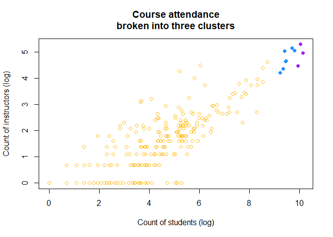
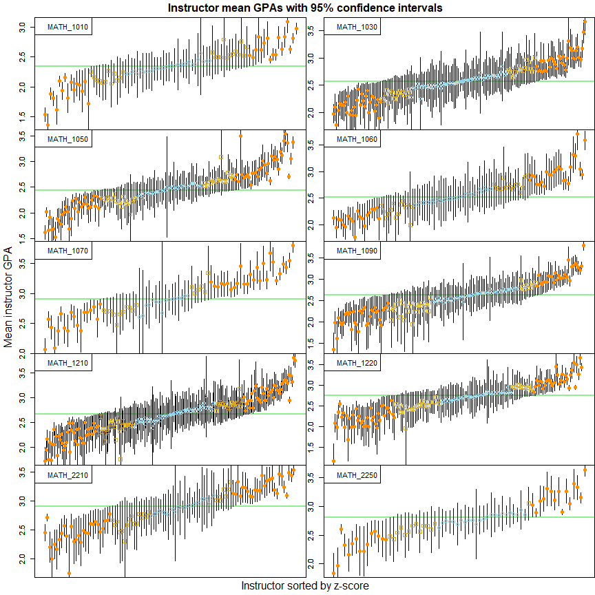
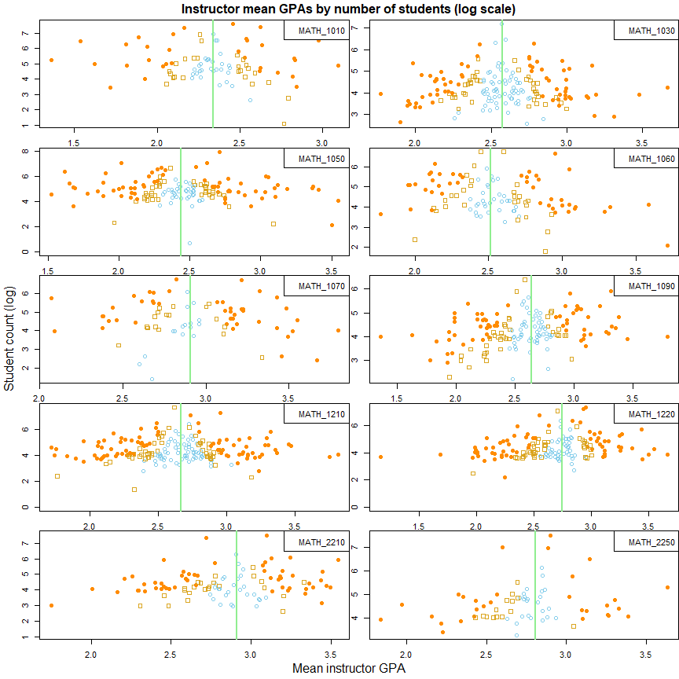
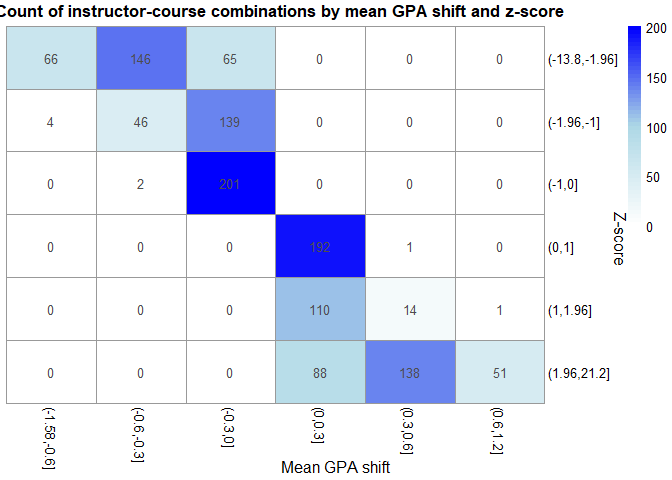
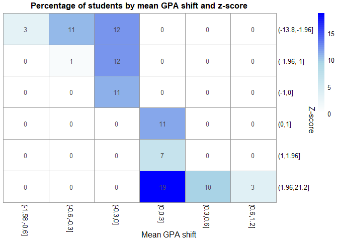

**PURPOSE:** This report identifies variation in grading by instructors of ten high enrollment math courses.   

## EXECUTIVE SUMMARY

This report identifies that 27% of students enrolled in the top ten high enrollment math courses since 2005 have received grades from instructors that are shifted at least 0.3 GPA from the course mean, with a difference that is significant at the 95% confidence level.    

This suggests either underlying mechanisms that influence how students are sorted into classes, or different grading standards by instructors.   

Understanding or controlling for this variation may be important in understanding student success in math courses or in recommending students for course placement.   

This report examines course data since 2005 and makes no effort to examine variation over time. 

## OBJECTIVES   

  (1)  Identify high enrollment math courses.
  (2)  Explore variability in grading by instructor.
  (3)  Explore implications and identify next steps.    

## (1) Identify high enrollment math courses

The math courses with the largest enrollment in the database (dating back to 2005) are Math 1050, 1210, and 1010, with greater than 20,000 enrolled students in each.  (Students who re-enroll are counted for every time they enroll.)

Hierarchical clustering identifies seven more high enrollment courses differentiated by a natural break (as can be seen in the graphic below, "Course attendance broken into three clusters.")  These courses are Math 1220, 1030, 1060, 2210, 1090, 1070, and 2250.

<!-- --><table class="table table-striped table-hover table-condensed" style="font-size: 13px; color: black; width: auto !important; margin-left: auto; margin-right: auto;">
<caption style="font-size: initial !important;">Count of students and instructors per course</caption>
 <thead>
  <tr>
   <th style="text-align:left;"> Course </th>
   <th style="text-align:right;"> Students </th>
   <th style="text-align:right;"> Instructors </th>
   <th style="text-align:left;"> Title </th>
   <th style="text-align:left;"> Cluster </th>
  </tr>
 </thead>
<tbody>
  <tr>
   <td style="text-align:left;"> MATH_1050 </td>
   <td style="text-align:right;"> 25078 </td>
   <td style="text-align:right;"> 145 </td>
   <td style="text-align:left;"> Coll Alg </td>
   <td style="text-align:left;"> 2 </td>
  </tr>
  <tr>
   <td style="text-align:left;"> MATH_1210 </td>
   <td style="text-align:right;"> 22638 </td>
   <td style="text-align:right;"> 200 </td>
   <td style="text-align:left;"> Calculus I </td>
   <td style="text-align:left;"> 2 </td>
  </tr>
  <tr>
   <td style="text-align:left;"> MATH_1010 </td>
   <td style="text-align:right;"> 20749 </td>
   <td style="text-align:right;"> 88 </td>
   <td style="text-align:left;"> Intrm Algebra </td>
   <td style="text-align:left;"> 2 </td>
  </tr>
  <tr>
   <td style="text-align:left;"> MATH_1220 </td>
   <td style="text-align:right;"> 18131 </td>
   <td style="text-align:right;"> 158 </td>
   <td style="text-align:left;"> Calculus II </td>
   <td style="text-align:left;"> 3 </td>
  </tr>
  <tr>
   <td style="text-align:left;"> MATH_1030 </td>
   <td style="text-align:right;"> 16188 </td>
   <td style="text-align:right;"> 172 </td>
   <td style="text-align:left;"> Intro Quant Reasoning </td>
   <td style="text-align:left;"> 3 </td>
  </tr>
  <tr>
   <td style="text-align:left;"> MATH_1060 </td>
   <td style="text-align:right;"> 12842 </td>
   <td style="text-align:right;"> 106 </td>
   <td style="text-align:left;"> Trig </td>
   <td style="text-align:left;"> 3 </td>
  </tr>
  <tr>
   <td style="text-align:left;"> MATH_2210 </td>
   <td style="text-align:right;"> 12571 </td>
   <td style="text-align:right;"> 105 </td>
   <td style="text-align:left;"> Calculus III </td>
   <td style="text-align:left;"> 3 </td>
  </tr>
  <tr>
   <td style="text-align:left;"> MATH_1090 </td>
   <td style="text-align:right;"> 12063 </td>
   <td style="text-align:right;"> 154 </td>
   <td style="text-align:left;"> Coll Alg Bus/Soc Sci </td>
   <td style="text-align:left;"> 3 </td>
  </tr>
  <tr>
   <td style="text-align:left;"> MATH_1090 </td>
   <td style="text-align:right;"> 12063 </td>
   <td style="text-align:right;"> 154 </td>
   <td style="text-align:left;"> Business Algebra </td>
   <td style="text-align:left;"> 3 </td>
  </tr>
  <tr>
   <td style="text-align:left;"> MATH_1070 </td>
   <td style="text-align:right;"> 11428 </td>
   <td style="text-align:right;"> 78 </td>
   <td style="text-align:left;"> Intro Stat Inference </td>
   <td style="text-align:left;"> 3 </td>
  </tr>
  <tr>
   <td style="text-align:left;"> MATH_2250 </td>
   <td style="text-align:right;"> 10086 </td>
   <td style="text-align:right;"> 68 </td>
   <td style="text-align:left;"> Diff Equ &amp; Lin Algebra </td>
   <td style="text-align:left;"> 3 </td>
  </tr>
  <tr>
   <td style="text-align:left;"> MATH_2250 </td>
   <td style="text-align:right;"> 10086 </td>
   <td style="text-align:right;"> 68 </td>
   <td style="text-align:left;"> Ode's And Lin Alg </td>
   <td style="text-align:left;"> 3 </td>
  </tr>
</tbody>
</table>

## (2) Explore variability in grading by instructor

Grading is examined for these ten courses on an instructor-by-course basis.  

An overall population mean GPA per course is calculated across all instructors.  Each instructor's mean GPA per course is calculated.  A standard error per instructor-course combination is estimated as the standard deviation of student GPAs divided by the square root of the number of students. 

A z-score is then calculated per instructor as the instructor mean minus the population mean divided by the instructor's standard error.

These are represented graphically in the two visualizations below.    

The number of instructor-course combinations are tallied by their mean GPA shift and z-scores, where a z-score less than -1.96 or greater than 1.96 are significantly different at the 95% confidence level.  This is shown in the first table, "Count of instructors by mean GPA shift and z-score."

The percentage of the total enrollment population in the instructor-course combinations are also shown in the second table, "Percentage of students by mean GPA shift and z-score."

Per the last table, some 14% of students are graded by instructors that award a mean GPA that is at least 0.3 GPA lower than the course mean, a difference significant at the 95% confidence level.  On the other extreme, about 13% of the students are graded by instructors that award a mean GPA that is at least 0.3 GPA greater than the course mean (at the 95% confidence level.)   

<!-- -->

<!-- -->

<!-- -->

<!-- -->

## Possible implications and next steps

The variation in grading between instructor-courses suggests two possible conclusions:    

  (1)  That students are not randomly distributed among instructors.   
  (2)  That instructors conduct courses with different expectations and grading standards.   

Non-random distribution of students among instructors could suggest underlying factors or mechanisms that influence how students are sorted into classes.  For example, perhaps some instructors start their class early on Monday morning and this schedule is unpopular with low-achieving students, who then choose other classes.   
  
Different grading standards by instructors could suggest tightening up course expectations, such as applying a uniform final test per course, to ensure uniform grading and uniform preparation for subsequent courses.  The variation may also be explained as a shift in grading standards over time.         

This variation could be explored by using machine learning methods to identify predictors of the instructors' z-scores at the student level (student test scores and high school GPA), class level (starting time and capacity), instructor level (years of experience and class load), and over time.     

Understanding or controlling for this variation may be important in understanding student success in math courses or in recommending students for course placement.

