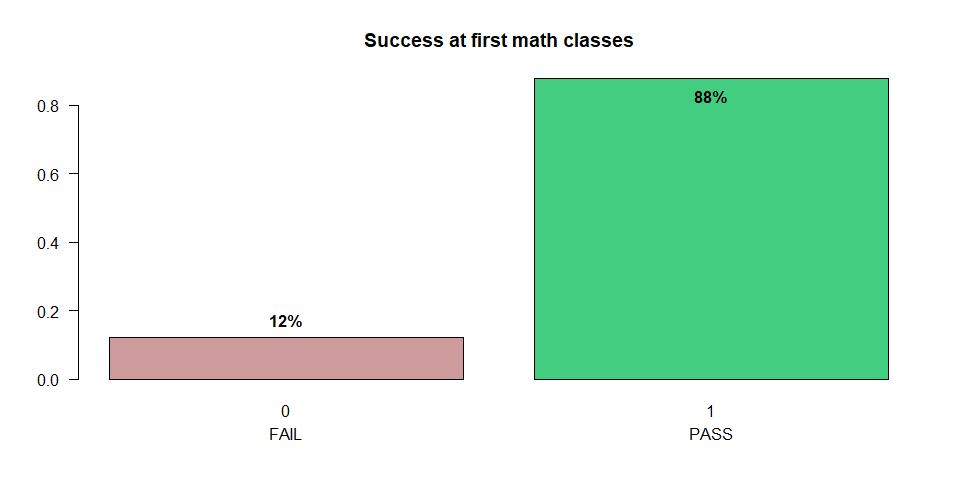
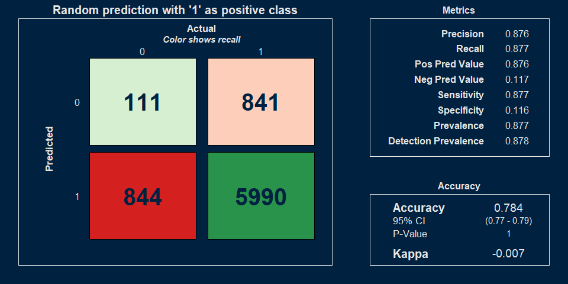
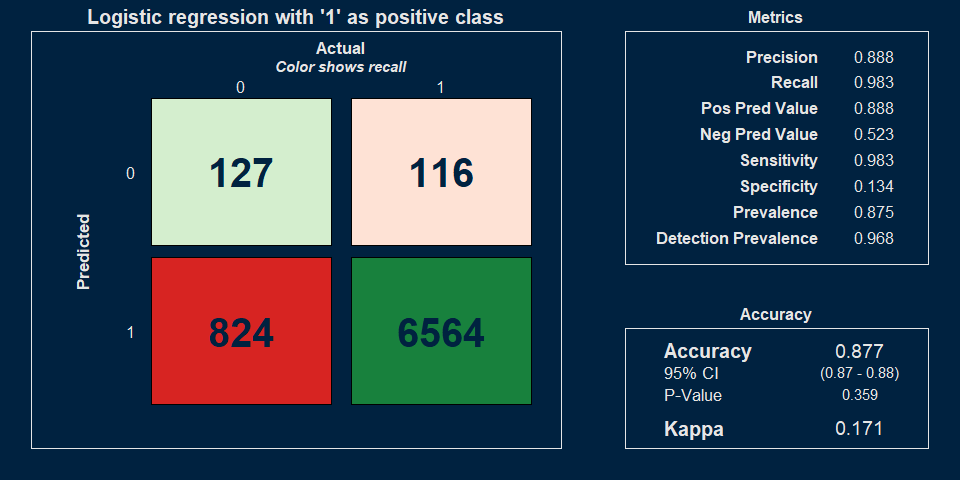
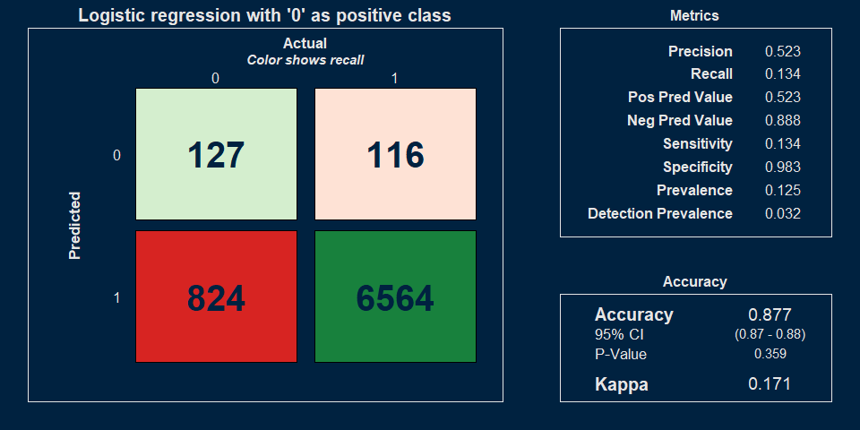
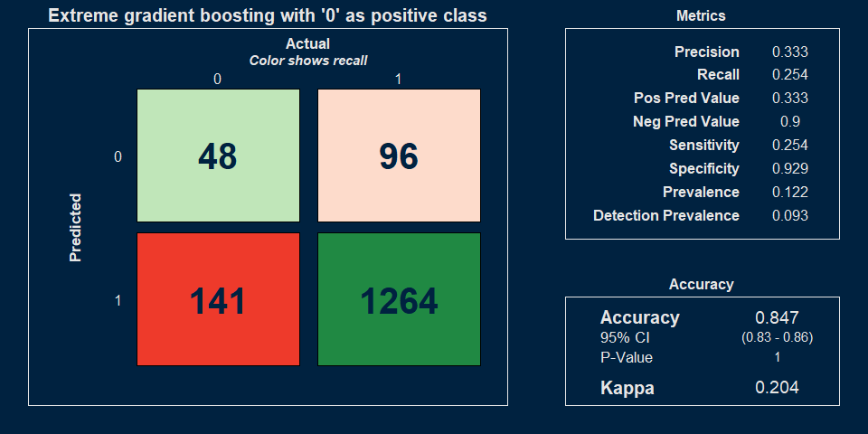

### SUMMARY

#### **SITUATION** 

Math success is highly imbalanced, with roughly 80-85% pass and 15-20% fail. 

#### **COMPLICATION** 

Machine learning accuracy metrics for imbalanced data sets can be misleading.  A random prediction against an imbalanced data set will match the majority class.  Thus the accuracy will be as high as the majority class, even though the capability of the model is no better than random.  

#### **PROPOSAL**    

(1) That the population of interest are the students who fail.  
(2) That we report precision and recall for the students who fail.  
(3) That we report Kappa, F1, or Balanced Accuracy instead of (or in addition to) Accuracy and AUC as more representative of the model's ability.    
(4) That we publish the full confusion matrix for clarity. 

### DEMONSTRATIONS  

#### The data set is imbalanced.  

<!-- -->

#### Accuracy metric for a random number generator can be misleadingly high.

The prediction is randomly generated and metrics are shown specifying the positive class as "1" or "Pass".

The metrics are very high, even though the prediction is random.  

<table class="table table-striped table-hover table-condensed" style="color: black; width: auto !important; margin-left: auto; margin-right: auto;">
<caption>Random Model Performance
 (for 1)</caption>
 <thead>
  <tr>
   <th style="text-align:left;"> Metric </th>
   <th style="text-align:center;"> Value </th>
  </tr>
 </thead>
<tbody>
  <tr>
   <td style="text-align:left;"> Accuracy </td>
   <td style="text-align:center;font-weight: bold;color: black !important;background-color: ivory !important;"> 0.78 </td>
  </tr>
  <tr>
   <td style="text-align:left;"> Precision </td>
   <td style="text-align:center;font-weight: bold;color: black !important;background-color: ivory !important;"> 0.88 </td>
  </tr>
  <tr>
   <td style="text-align:left;"> Recall </td>
   <td style="text-align:center;font-weight: bold;color: black !important;background-color: ivory !important;"> 0.88 </td>
  </tr>
</tbody>
</table>

#### Precision and recall for the minority class are low. 

This emphasizes the minority class for the random generator.  It is a very different picture. 

<table class="table table-striped table-hover table-condensed" style="color: black; width: auto !important; margin-left: auto; margin-right: auto;">
<caption>Random Model Performance
 (for 0)</caption>
 <thead>
  <tr>
   <th style="text-align:left;"> Metric </th>
   <th style="text-align:center;"> Value </th>
  </tr>
 </thead>
<tbody>
  <tr>
   <td style="text-align:left;"> Accuracy </td>
   <td style="text-align:center;font-weight: bold;color: black !important;background-color: ivory !important;"> 0.78 </td>
  </tr>
  <tr>
   <td style="text-align:left;"> Precision </td>
   <td style="text-align:center;font-weight: bold;color: black !important;background-color: ivory !important;"> 0.12 </td>
  </tr>
  <tr>
   <td style="text-align:left;"> Recall </td>
   <td style="text-align:center;font-weight: bold;color: black !important;background-color: ivory !important;"> 0.12 </td>
  </tr>
</tbody>
</table>

### PROPOSAL EXAMPLES  

#### Report more accuracy metrics, use "Fail" as the positive class, and show the full confusion matrix 

##### Random prediction

The random prediction has a very low Kappa.  

Using zero or "Fail" as the positive class clarifies the utility of this model in guiding any intervention targeting this population.  

<!-- --><!-- -->

##### Logistic regression

Logistic regression has a low Kappa.  

Precision and recall for the minority class are low.  

<!-- --><!-- -->

##### Extreme gradient boosting

Extreme gradient boosting slightly improves on logistic regression.   

<!-- --><!-- -->

