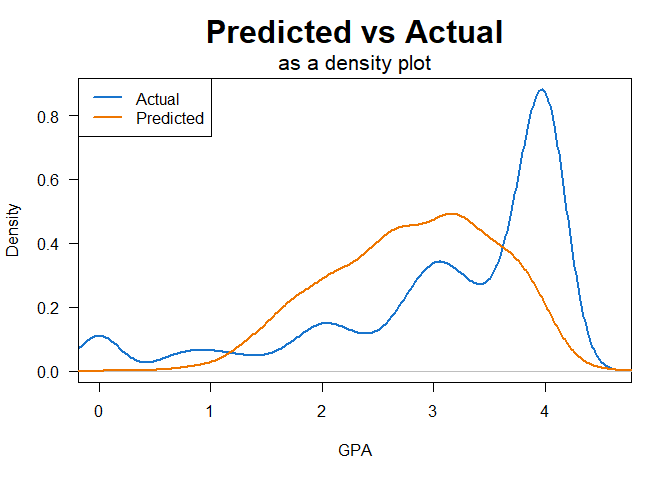
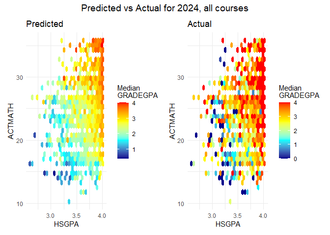
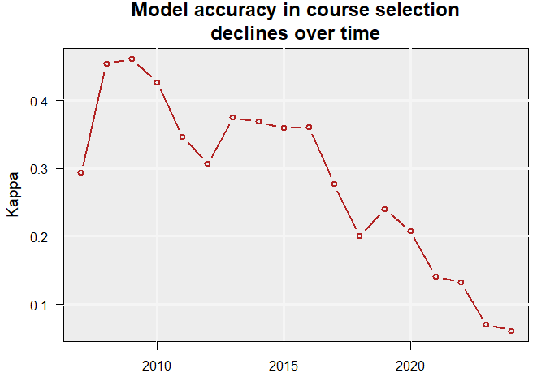
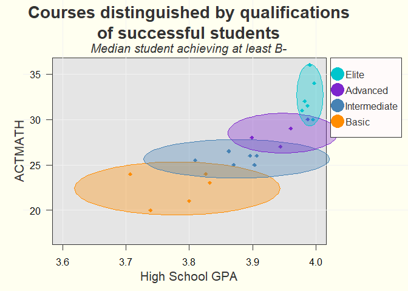

# Project Overview for Math Course Recommendation

# Executive Summary

This report finds that comparing incoming students to the prior year’s
successful students can create a mild-yet-useful course guide.

This report finds that both high school GPA and ACT Math test scores
have consistently moderately predicted grade performance and course
selection in math courses for first time freshmen.

Using these two qualifications, and comparing incoming students to the
prior year’s successful students, creates a course guide.

This report also finds that there are often several equivalent course
options for any particular student with a given set of qualifications.
It also finds that high school GPA and ACT math test scores are not
highly predictive of grade performance, suggesting that additional data
(such as individual effort) may further explain grade performance.

# Summary

In order to improve academic outcomes in math courses for first time
freshmen, an investigation into predictors of academic performance and
course selection is made using data available at the time of admissions
(called “pre-University data.”). Predictive models (logistic regression,
categorical boosting, and extreme gradient boosting) are trained that
target grade performance or course selection. Time series analyses with
extreme gradient boosting models are conducted. Accuracy values of
0.20-0.28 R2 in grades and a Kappa of 0.40 in identifying
students at risk of failing are achieved. In course selection, a Kappa
as high as 0.45 was achieved in 2009 before declining to values less
than 0.1 in 2023 and 2024.

Over time and across models, the best predictor of course selection are
ACT math test scores, and the best predictor of academic performance is
the high school GPA. Their derivative z-scores and combined z-score
distance also figure prominently. (The z-scores and combined distance
are calculated by comparing the qualifications of incoming students with
the qualifications of last year’s successful students per course.
“Success” is defined as achieving a GPA of at least 2.7 or B-minus.)

Because the combined distance is a strong predictor, comparing incoming
students with last year’s successful students is concluded to reasonably
guide course recommendation.

A course guide is created that compares the incoming students to the
prior year’s successful students (GPA \>=2.7) in terms of high school
GPA and ACT math test scores. The best model was used to create
counter-factual predictions of grade performance in alternative courses.

The guide finds that course recommendations heavily overlap in their
qualifications, or that many courses have equivalent grade expectations
for a given incoming freshmen.

A next step is to calculate a theoretical benefit in using the course
guide by identifying passing counter-factual grades in alternative
courses for students who failed (achieved a GPA \<1.7).

# Background

Currently, math course placement for first time freshmen is under
consideration due to internal and external pressures in a dynamic
environment:

- ***External concerns:*** Academic preparedness for first time freshmen
  has declined nation-wide, including for math[^1][^2].  
- ***Internal concerns:*** Several internal concerns have been voiced,
  including:
  1)  Advisors having insufficient guidelines to place students in
      courses, leading to mis-placed students. This misplacement may
      cause a strain on instructors, tutors, and classroom environments
      and result in poor academic performance.  
  2)  Students taking courses beneath their ability, exacerbating course
      capacity constraints.  
  3)  Math placement tests may be expensive and logistically difficult
      to administer at scale.  
- ***Changing situation:*** The mix of math courses selected, submission
  rates of ACT math test scores, grade inflation (or compression), and
  the relationship between incoming qualifications and course selection
  are changing.

# Research Questions

#### Main question:

(Q0) Can improving math course recommendations improve educational
outcomes?  
*Next step: Calculate improvement in failure rates using the predictive
model to estimate an optimum course selection.*

#### Sub questions:

(Q1) Can math course grade performance be predicted with minimal
pre-University data?

*Grade performance was estimated with mild to moderate accuracy using
several different models.*

(Q2) Can math course recommendations be made with minimal pre-University
data?

*Grade performance can be estimated for multiple course options,
suggesting equivalent or superior courses.*

# Analyses

Research questions Q1 and Q2 are investigated in order to answer the
main question Q0.

## Q1: PREDICT GRADE PERFORMANCE

### Q1 DATA

- *Demographics data* for first time freshmen include age, sex, first
  generation status, and ethnicity.  
- *High school data* includes high school GPA, AP credits, and public or
  private status of the high school.  
- *Test scores* from the ACT includes Math, English, Science, and
  Comprehensive. (SAT scores were not used in all models, and students
  who did not submit an ACT test score were excluded from most
  models).  
- *University information* includes the name of the course, the course
  level (1000 or 2000), residence status, Pell eligibility, year and
  season the course was taken, and student cohort year.  
- *Course filter* selected math courses as the initial math courses
  taken by the first time freshmen, or in other words all math courses
  taken by a freshman in the first semester that they took a math
  course.

### Q1 ANALYSES

Logistic regression, categorical boosting, and extreme gradient boosting
models predicted grade performance.

A time series analysis investigated model validity over time.

### Q1 RESULTS

**Table filled with placeholder values**

| MODEL ID | METHOD                    | DATA          | ACCURACY                |
|----------|---------------------------|---------------|-------------------------|
| Log_2    | Logistic Regression       | Years \> 2021 | 0.31 Kappa              |
| Cat_1    | Categorical Boosting      | Yrs \> 2021   | \[\[?\]\] Kappa         |
| vH4      | Extreme Gradient Boosting | Yrs \> 2005   | 0.28 R2      |
| vD1      | Time series (xgboost)     | Yrs \> 2005   | 0.20-0.28 R2 |
| vH4_1    | At Risk Pop. (xgboost)    | vH4 results   | 0.40 Kappa              |

Per the time series, the models could predict grade performance based on
minimal pre-University data with r-squared values between 0.20 and 0.28.
Identification of at-risk populations occurred with a Kappa value fomr
0.31 to 0.40. At 0.40 (model vH4_1), one out of three students in the
at-risk population failed.

Important or predictive variables across all models included high school
GPA and ACT math test scores.

Figure 1: Predicted vs Actual Grade Performance: Density Plot

As can be seen in
<a href="#fig-density" class="quarto-xref">Figure 1</a>, model vH4
tended to make middle-of-the-road predictions while the grade
distribution skewed heavily towards the top of the scale (where ~30% of
students received an ‘A’ in 2024.)

### Q1 DISCUSSION

The predictive models could predict grade accuracy with r-squared values
between 0.20 and 0.28. Consistently the leading predictors were the high
school GPA, followed at some distance by the ACT math test scores.
Adopting a model of performance[^3] where performance is the outcome of
ability by motivation, the models seem to suggest that “ability” can be
broken into “math ability” (indicated by the ACT math test scores) and
“study ability” (indicated by the high school GPA.) No metrics related
to “motivation” were used.

The predictive model created gently increasing grade expectations as
these two variables increased, as can be seen in
<a href="#fig-map" class="quarto-xref">Figure 2</a> on the left. Actual
grade performance was higher, as can be seen in the heat map on the
right.

Figure 2: Predicted vs Actual Grade Performance: Heat Map

Derivatives were calculated from the two leading predictors: z-scores
(based on successful students in the prior year) and a combined z-score
distance. These derived variables were found to improve predictive
accuracy.

Time series analyses validated these derived predictors and discovered a
discontinuity since 2020 that accelerated in 2023-2024 where the
relationship between incoming qualifications and course selection
disappeared.

Predictive accuracy may be improved with the addition of concurrent
data, such as the choice of major, the number of credits concurrently
taken, the difficulty of concurrent courses, and early grades on
homework, quizzes, and tests.

### Q1 CONCLUSIONS

- Grade performance can be predicted at an R-squared value of 0.20 to
  0.28 with minimal pre-University data.  
- The most important predictors are high school GPA, ACT math test
  scores, and their derivatives.
  - Populations at risk of failing can be identified with an accuracy
    score of 0.31-0.40 Kappa. At the higher value, one out of three
    students fail in the “at risk” population compared to one out of
    twenty-five students in the “anticipated success” population fails.)
    This designation may direct interventions or course recommendations.

## Q2: RECOMMEND MATH COURSE

### Q2 DATA

The same data as Q1 was used.

### Q2 ANALYSES

Extreme gradient boosting models predicted course selection.

A time series analysis investigated model validity over time.

Counter-factual grade performance was estimated using the best
predictive model for courses the student did not select.

### Q2 RESULTS

Figure 3: Course selection accuracy declining over time

The model could predict course selection with a Kappa value as high as
0.45, declining over time to next to no ability in 2023-2024.

The most important predictors were ACT Math test scores, high school
GPA, and their derivatives.

Figure 4: Course guide

A course guide (<a href="#fig-guide" class="quarto-xref">Figure 4</a>)
could be generated for 2024 students based on the ACT math scores and
the high school GPA of the successful students (GPA \>=2.7) from the
year 2023.

### Q2 DISCUSSION

The time series analysis demonstrated that minimal pre-University data
could be used to predict course selection until recently. It also
validated the use of the combined z-score distance as an important
predictor.

The ability to predict courses declined over time, and all-but vanished
in 2023 and 2024. A closer look at the combined distance variable (not
shown) reveals a discontinuity in this metric starting in 2020 and
accelerating in 2023-2024. This collapse of the model accuracy and
accelerating discontinuity may suggest an urgent need to address math
course placement. On the other hand, over the same period grades
improved (or inflated or compressed), possibly suggesting changing
expectations for math performance in these initial math courses.

The course guide showed considerable overlap between courses, and the
counter-factual grade predictions (not shown) had similar grade outcomes
per student for several courses. This suggests that any particular
student may have multiple equivalent course options.

### Q2 CONCLUSIONS

Math course recommendations can be made by comparing incoming student
qualifications to the qualifications of the prior year’s successful
students.

This should be considered a loose guideline with a heavy overlap in
acceptable courses per student.

Counter-factual grade predictions also often showed equivalent grade
outcomes for several different courses per student.

## Q0: COURSE RECOMMENDATION AND ACADEMIC OUTCOMES

### Next steps for Q0

In order to answer the main question, a reasonable next step would be to
calculate the improvement in failure rates if students who failed were
placed in their optimum course per the model and received their
counter-factual grade instead.

------------------------------------------------------------------------

[^1]: Sánchez-Mendías, J., et al. (2024). “Who are we receiving at the
    university? The impact of COVID-19 on mathematics and reading
    learning in high school.” Frontiers in Education, 9, 1356730.
    <https://doi.org/10.3389/feduc.2024.1356730>

[^2]: Horowitch, Rose. “‘A Recipe for Idiocracy’: What Happens When Even
    College Students Can’t Do Math Anymore?” The Atlantic, November 19,
    2025.
    <https://www.theatlantic.com/education/archive/2025/11/college-students-math-crisis/>

[^3]: Anderson, N. H., & Butzin, C. A. 1974. Performance = motivation X
    ability: An integration-theoretical analysis. Journal of Personality
    and Social Psychology, 30(5): 598–604.
    <https://doi.org/10.1037/h0037447>
