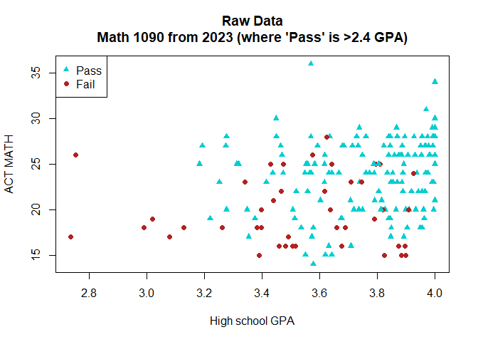
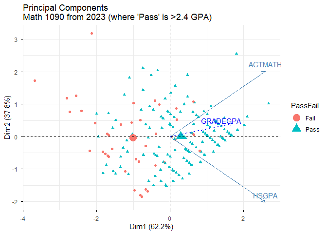
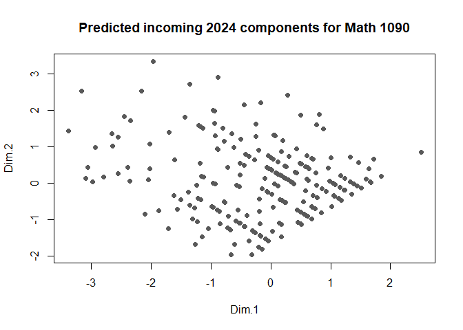
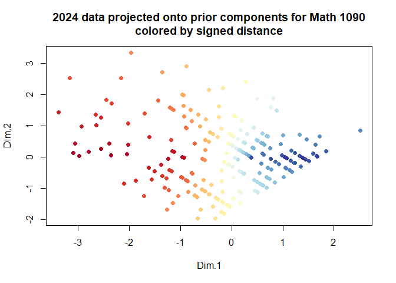
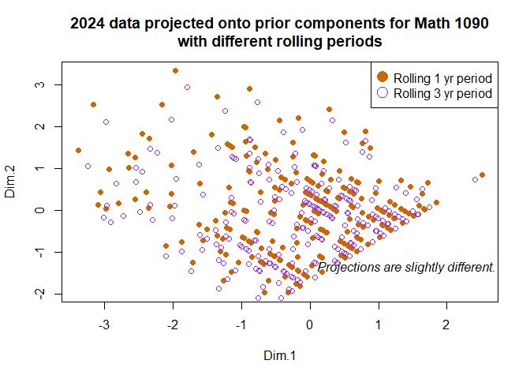
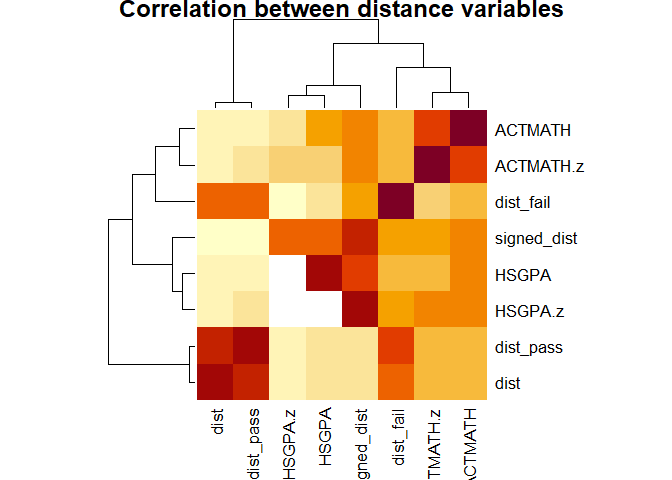
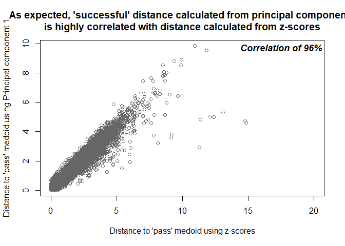

**PURPOSE:** This report describes using principal components analysis in training predictive models (xgboost) to estimate math grades.  

# EXECUTIVE SUMMARY 

In order to improve predictive accuracy, transforming the data and engineering new features using principal components was attempted.  This was expected to improve on the previous best model due to de-correlating the main variables.

It worked by extracting the principal components in prior years, projecting the target year data onto the prior principal components, and then calculating several distance metrics.

The approach did not improve model accuracy.  Using distances calculated from z-scores resulted in an R-squared value of 0.26, and using distances calculated from principal components also resulted in an R-squared value of 0.26.  Due to the increased computational complexity of extracting principal components for no improvement, the approach is abandoned.

However, the graphical representation from principal components may be instructive.  As well, a comparison in model accuracy between calculating principal components from just one prior year, or from three prior years, found that one prior year was more predictive. This suggests a trend in the data or gradual change over time as opposed to stability.  

# APPROACH  

The two leading predictors for math grades are the high school GPA and the ACT math test scores.  Previously, these scores were first filtered to just the values for "successful" students (a grade greater than 2.4), next standardized to derive a z-score centered on that filtered median, and finally a Euclidean distance was calculated.  The median-centered z-score was calculated for the prior year, and the distance was calculated for the upcoming year.

However, although the two scores are correlated, the z-scores were calculated independently.  By both de-correlating the variables, and constructing additional features, an improvement on the predictive model accuracy was anticipated. 

The following steps were observed:

  * An additional cleaning step was added (where a few dozen students were removed due to having multiple cohort dates).
  * Principal components were derived per course from ACT Math test scores and high school GPA.
    - Components were derived on a rolling basis of one or three years  
  * Component medians for passing or failing were calculated, where passing was a math grade of 2.4 or higher  
  * Data for the following year were projected onto the principal components derived from prior data. 
  * The Euclidean distance for values in that following year and the prior component medians was calculated.
  * The difference in the distances was calculated.
  
This resulted in three new variables: dist_pass (the distance to the component medians of prior successful students), dist_fail (the distance to the component medians of prior failed students), and the difference (signed_dist, calculated as dist_fail - dist_pass).

These new variables were then passed into a training model (extreme gradient boosting) where data from years less than the year 2024 were used for training, and data from the year 2024 were used for testing. R-squared and mean absolute error were compared. 

# DESCRIPTION 

### Original values compared to principal components

<!-- --><!-- -->
   
### 2024 data projected onto the prior principal components   
   
<!-- --><!-- -->
    
### Components from different rolling periods 

<!-- -->

### Correlations

<!-- -->

<!-- -->

# MODEL TRAINING RESULTS 

Model | Variable Set | Rolling Period | R-squared | Mean Absolute Error
------|--------------|----------------|-----------|--------------------
vH3 | Z-scores | 1 yr | 0.26 | 0.81
vM2 | Both | 3 yrs | 0.24  | 0.81
vM3 | PCA | 3 yrs | 0.23 | 0.84 
vM4 | PCA | 1 yr | 0.26 | 0.82

Due to an inability to improve on predictive accuracy using z-scores, deriving a "distance" measure from principal components is abandoned.

